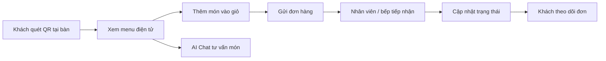
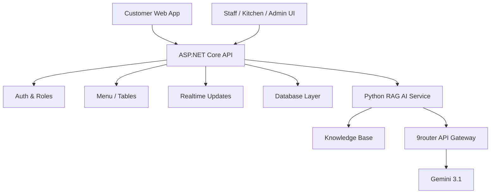

# CMC Restaurant - QR AI Ordering

**CMC Restaurant - QR AI Ordering** là nền tảng đặt món tại bàn bằng QR dành cho nhà hàng, kết hợp menu điện tử, quản lý đơn hàng theo thời gian thực và chatbot AI hỗ trợ tư vấn món. Dự án mô phỏng một quy trình vận hành hiện đại: khách mở menu trên điện thoại, nhân viên theo dõi đơn, bếp cập nhật trạng thái chế biến và quản trị viên quản lý dữ liệu nhà hàng trên cùng một hệ thống.

Mục tiêu của dự án không chỉ là một màn hình gọi món đẹp, mà là một bản demo đủ gần thực tế để trình bày cách một nhà hàng có thể số hóa luồng phục vụ từ lúc khách ngồi vào bàn đến khi đơn được xử lý.

## Điểm Nổi Bật

| Nhóm trải nghiệm | Giá trị chính |
| --- | --- |
| Khách hàng | Quét QR, xem menu, thêm món vào giỏ, gửi đơn và theo dõi trạng thái |
| Nhân viên | Tiếp nhận đơn, kiểm tra bàn, hỗ trợ khách trong quá trình phục vụ |
| Bếp | Xem danh sách món cần chuẩn bị và cập nhật tiến độ chế biến |
| Quản trị viên | Quản lý menu, bàn, đơn hàng và trạng thái vận hành |
| AI Chat | Tư vấn món, trả lời câu hỏi theo menu/FAQ và hỗ trợ lựa chọn nhanh |
| DevOps | Kế hoạch CI/CD với auto-merge, merge queue, staging, production deploy và health check |

## Bài Toán

Trong nhiều nhà hàng, gọi món thủ công dễ gây chậm trễ, nhầm bàn, thiếu cập nhật giữa phục vụ và bếp, hoặc khiến khách phải chờ nhân viên trong những thao tác đơn giản. CMC Restaurant giải quyết vấn đề đó bằng một hệ thống thống nhất:

- Khách tự gọi món trên điện thoại mà không cần cài app.
- Đơn hàng được chuyển đến khu vực vận hành nhanh hơn.
- Trạng thái đơn rõ ràng cho khách, nhân viên và bếp.
- Menu, bàn và đơn hàng được quản lý tập trung.
- Chatbot AI giúp khách chọn món tự nhiên hơn.

## Luồng Sử Dụng Chính



## Tính Năng

### Khách Hàng

- Mở menu theo bàn bằng QR hoặc mã bàn.
- Xem món ăn, đồ uống, giá và trạng thái còn hàng.
- Thêm món vào giỏ và xác nhận đơn.
- Theo dõi trạng thái đơn sau khi gửi.
- Trò chuyện với AI để được gợi ý món phù hợp.

### Vận Hành Nhà Hàng

- Màn hình nhân viên để theo dõi và xử lý đơn.
- Màn hình bếp để quản lý danh sách món đang cần chuẩn bị.
- Màn hình admin để quản lý menu, bàn và đơn hàng.
- Trạng thái đơn hàng được thiết kế cho luồng phục vụ theo thời gian thực.

### Nền Tảng Kỹ Thuật

- Frontend React/TypeScript với các màn hình customer, staff, kitchen và admin.
- Backend ASP.NET Core Web API với health endpoint, auth foundation, menu/table APIs.
- Định hướng realtime bằng SignalR.
- Tài liệu API, Git workflow, DevOps và deployment được tách trong thư mục `docs/`.

## Kiến Trúc Tổng Quan



## Công Nghệ

| Lớp | Công nghệ |
| --- | --- |
| Frontend | React, TypeScript, Vite |
| Backend | ASP.NET Core Web API |
| AI service | Python, FastAPI, RAG knowledge base |
| LLM access | Gemini 3.1 thông qua 9router API gateway |
| Realtime | SignalR định hướng cho cập nhật đơn |
| Auth | JWT/HMAC foundation, role-based access |
| Testing | .NET integration tests, Python RAG tests, frontend build checks |
| Deployment plan | GitHub Actions, Docker Compose, VPS, Nginx, HTTPS |

## Chạy Dự Án Cục Bộ

### Yêu Cầu

- Node.js phù hợp với Vite/React toolchain.
- .NET SDK phù hợp với solution backend.
- Git.

### Frontend

```bash
cd frontend
npm install
npm run dev
```

Build production:

```bash
cd frontend
npm run build
```

### Backend

```bash
cd backend
dotnet restore RestaurantQrAiOrdering.sln
dotnet run --project src/RestaurantQrAiOrdering.Api/RestaurantQrAiOrdering.Api.csproj
```

Kiểm tra health endpoint:

```bash
curl https://localhost:<port>/api/health
```

Chạy test backend:

```bash
cd backend
dotnet test RestaurantQrAiOrdering.sln
```

## Cấu Trúc Repository

```text
.
├── backend/          # ASP.NET Core API, solution và integration tests
├── frontend/         # React + TypeScript UI cho customer, staff, kitchen, admin
├── docs/             # Tài liệu nghiệp vụ, API, Git, DevOps và deployment
├── site-demo/        # Tài nguyên demo nếu có
└── tools/            # Script kiểm tra hoặc hỗ trợ dự án
```

## Trạng Thái Dự Án

Dự án đang ở giai đoạn MVP/demo và được phát triển theo từng issue. Các phần frontend, backend API foundation, auth/menu/table APIs và tài liệu vận hành đã có trong repo. Luồng DevOps chuyên nghiệp đã được chốt ở mức kế hoạch: required checks, merge queue, auto-merge, staging deploy, promote production, production deploy, health check và rollback. Pipeline CI/CD thật sẽ chỉ được xem là hoàn thành khi có workflow GitHub Actions và bằng chứng chạy thực tế.

## Tài Liệu Liên Quan

- [Ngữ cảnh dự án](docs/PROJECT_CONTEXT.md)
- [Hợp đồng API](docs/API_CONTRACT.md)
- [Quy trình Git](docs/GIT_WORKFLOW.md)
- [Quy trình DevOps và release](docs/DEVOPS_RELEASE_PROCESS.md)
- [Tài liệu triển khai](docs/DEPLOYMENT.md)
- [Quy trình làm việc nhóm](docs/TEAM_WORKFLOW.md)
- [Mẫu báo cáo tuần](docs/WEEKLY_REPORT_TEMPLATE.md)

## Định Hướng Tiếp Theo

- Hoàn thiện luồng đặt món từ QR đến đơn hàng.
- Đồng bộ realtime cho trạng thái đơn giữa khách, nhân viên và bếp.
- Hoàn thiện chatbot AI theo dữ liệu menu/FAQ.
- Triển khai CI/CD thật theo kế hoạch DevOps đã chốt.
- Chuẩn hóa bằng chứng demo, health check và báo cáo triển khai.

## DevOps Status

Issue #16 adds real CI/CD configuration for GitHub Actions, Docker Compose,
Nginx/Certbot deployment, staging/production environments, health checks and
rollback. The project should only be considered fully deployed after the
workflows run successfully, required deployment secrets are configured and the
GitHub branch ruleset is enabled.
