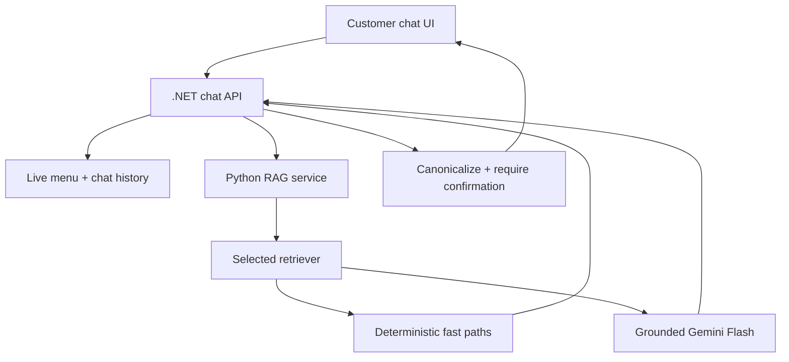

# Academic chatbot v2: protocol, evidence and production decision

## Scope and claims

This rebuild replaces the previous chatbot service, duplicated knowledge files, evaluation script and presentation artifacts. The production claim is deliberately narrow:

- menu retrieval is evaluated on the canonical 91-item seed currently used by the backend;
- the policy corpus is a versioned operator snapshot, not independently verified facts about a physical venue;
- ranking results are measured, while real-user satisfaction is not claimed because anonymized production conversations do not yet exist;
- the LLM writes grounded prose only. It is not trusted for menu IDs, prices, availability, cart mutation, order creation or payment.

## Research questions

1. Which of TF-IDF, BM25, multilingual dense embedding and two reciprocal-rank-fusion hybrids ranks the correct menu/policy evidence best?
2. How do the methods behave across exact names, Vietnamese without diacritics, semantic paraphrases, category intent, policy paraphrases, multi-intent questions and hard negatives?
3. Which method gives the best measured quality–latency trade-off for this small, structured restaurant corpus?

The selection rule was encoded before the final run: choose the highest locked-test macro slice nDCG@10; when methods differ by at most 0.005, choose lower P95 latency.

## Data protocol

- `research/menu_seed.py` parses `RestaurantMenuSeed.cs` and fails unless there are exactly 91 unique items and 13 categories.
- `menu_snapshot.json` records the experimental snapshot and its SHA-256.
- `manual_cases.json` contains reviewed paraphrases and hard negatives.
- `build_dataset.py` creates 235 query cases: 62 development and 173 locked test. Split is derived only from `group_id`; a validation step and test fail if variants of one item or policy cross splits.
- All methods use the same 101 retrieval documents: 91 menu documents and 10 policy documents.
- Development data is used for hyperparameters and abstention thresholds. The test split is used for the final comparison.
- Random seed, package environment, corpus checksums, raw per-query ranks, bootstrap intervals and McNemar tests are committed under `ai/research/artifacts/`.

## Measured locked-test results

| Method | Hit@1 | Hit@5 | MRR@10 | nDCG@10 | Macro slice nDCG | Answerability accuracy | P95 retrieval |
| --- | ---: | ---: | ---: | ---: | ---: | ---: | ---: |
| TF-IDF | 0.9760 | 0.9940 | 0.9826 | 0.9826 | **0.9461** | 0.9249 | 0.307 ms |
| BM25 | 0.9581 | 0.9820 | 0.9718 | 0.9718 | 0.9126 | 0.9538 | **0.101 ms** |
| Multilingual embedding | 0.2994 | 0.4671 | 0.3770 | 0.4006 | 0.4954 | 0.9827 | 4.610 ms |
| BM25 + embedding RRF | 0.8204 | 0.9940 | 0.8939 | 0.9168 | 0.8949 | 0.8671 | 5.625 ms |
| TF-IDF + embedding RRF | 0.8084 | 0.9940 | 0.8884 | 0.9132 | 0.8951 | 0.5260 | 5.664 ms |

The dense model was the actual pretrained `sentence-transformers/paraphrase-multilingual-MiniLM-L12-v2` executed through FastEmbed/ONNX, not a mocked score. Its model checksum is recorded in `environment.json`.

TF-IDF is selected for production. Against BM25, the paired mean nDCG improvement is 0.0109 with a 95% bootstrap interval of [0.0026, 0.0210]. The Hit@5 McNemar comparison is not significant at 0.05 (two TF-IDF-only successes, exact two-sided p=0.50), so the evidence supports the ranking-quality decision but does not justify claiming universal superiority.

## Why this is still RAG

RAG is the architecture: retrieve controlled evidence, augment the prompt, then optionally generate a grounded answer. A vector database is one possible retriever, not a requirement. In this domain, lexical normalization handled Vietnamese item names without diacritics better than the tested dense model, while also being materially faster. Production therefore follows the measured winner; embedding and hybrid approaches remain reproducible baselines.

## Production architecture



- The backend supplies the live menu on every request. The AI service fingerprints it and re-indexes only after a change.
- Price, availability, policy, guardrail and explicit-order requests avoid the LLM.
- Other grounded requests use a pooled HTTP client, a 7-second provider timeout and a 220-token cap.
- Provider failure falls back to retrieval-only output.
- The backend rejects unavailable or unknown suggestions, replaces names/prices with database values and limits results to three.
- Chat memory is stored by table session and removed when that table session closes or expires.
- The UI restores history, displays retrieval diagnostics and changes the cart only after an explicit customer click.

## Reproduction

```bash
python -m pip install -r ai/requirements-research.txt
PYTHONPATH=ai python ai/research/build_dataset.py
PYTHONPATH=ai python ai/research/run_experiments.py
MPLCONFIGDIR=/tmp/matplotlib PYTHONPATH=ai python ai/research/build_notebook.py
PYTHONPATH=ai python -m unittest discover -s ai/tests -v
```

The generated notebook is `ai/notebooks/academic_retrieval_study.ipynb`. It reads the committed artifacts and contains executed tables, plots, statistical comparisons, the production decision and limitations rather than hand-entered metrics.

## Limitations and next experiment

- Most exact/no-diacritic cases are generated systematically from the menu. This gives reproducibility but is not a substitute for real-user language.
- Manual paraphrase labels have not yet been independently annotated by two reviewers; inter-annotator agreement cannot yet be reported.
- The test corpus is dominated by known-menu queries. Macro slice nDCG reduces, but does not eliminate, this composition effect.
- Retrieval latency was measured locally with three repeats. End-to-end production latency must be measured on the deployment host, including network, database and 9Router.
- Generation faithfulness is protected by deterministic tests and canonicalization, but a larger human-rated answer set is still needed for fluency, usefulness and citation faithfulness.
- When consented anonymized logs exist, freeze a new out-of-distribution test set, add two independent relevance assessors, report Cohen's kappa and rerun the same selection protocol before changing production retrieval.
