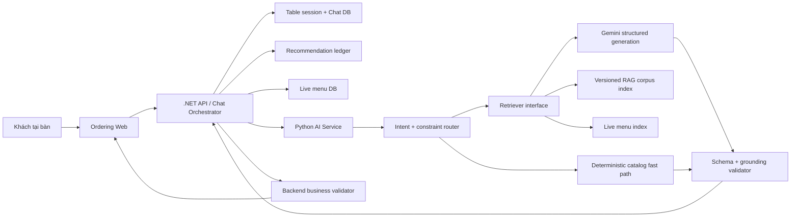
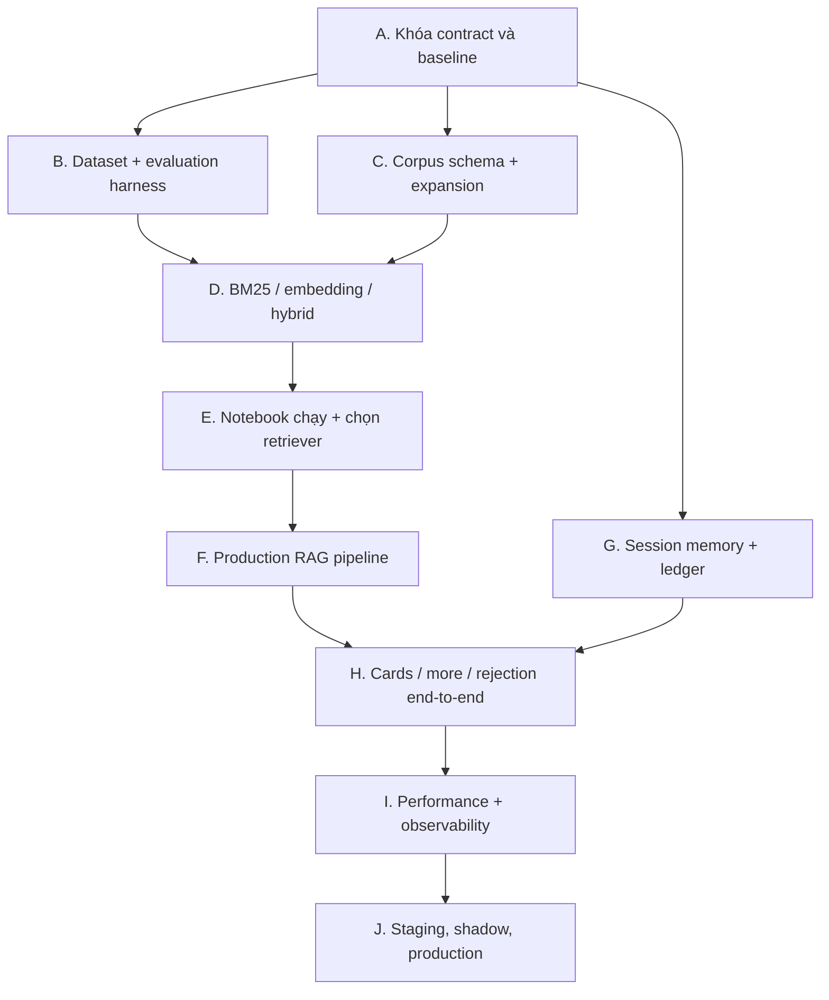

# Kế hoạch refactor AI chatbot LLM + RAG cho hệ thống gọi món

## 0. Trạng thái và nguyên tắc thực hiện

- Tài liệu này là kế hoạch trước triển khai. Chưa áp dụng code AI từ stash cũ vào nhánh hiện tại.
- Nhánh làm việc: `codex/improve-ai-seafood-retrieval`, đang bám `origin/main` và sạch tại thời điểm kiểm kê.
- Phạm vi UI đã hoàn tất ở các PR trước. Refactor này tập trung vào AI, RAG, dữ liệu nghiên cứu, bộ nhớ phiên bàn, hợp đồng card gợi ý và kiểm chứng end-to-end.
- Không chọn BM25, embedding hay hybrid bằng cảm tính. Phương pháp production chỉ được chọn sau khi notebook chạy trên tập test đóng băng và vượt các cổng chất lượng, an toàn, độ trễ.
- "Dữ liệu huấn luyện RAG" trong tài liệu này được gọi chính xác là **kho tri thức RAG**. Đây không phải fine-tuning trọng số LLM.

## 1. Baseline đã đo trên code hiện tại

| Hạng mục | Hiện trạng đã kiểm tra | Kết luận |
| --- | --- | --- |
| AI unit test | 14 test, 14 pass | Có regression cơ bản nhưng độ phủ còn mỏng |
| Notebook | 10 cell, 4 code cell, 0 cell đã chạy, 0 output | Mới là khung giao thức, chưa phải bằng chứng nghiên cứu |
| Golden questions | 15 câu, 14 câu có nhãn retrieval để benchmark | Không đủ lớn để kết luận học thuật |
| Kho tri thức | 7 file Markdown, 182 dòng, khoảng 1.382 từ | Chưa đủ sâu/rộng cho dị ứng, khẩu vị, chế độ ăn và hội thoại đa lượt |
| BM25 | Hit@5 0,857; MRR@5 0,729; p95 0,301 ms trên 14 ca | Baseline hợp lệ nhưng tập đo quá nhỏ |
| TF-IDF cosine | Hit@5 0,929; MRR@5 0,782; p95 0,111 ms trên 14 ca | Đây là sparse vector, không được gọi là neural embedding |
| Hybrid BM25 + TF-IDF RRF | Hit@5 0,857; MRR@5 0,720; p95 0,403 ms trên 14 ca | Chưa chứng minh hybrid tốt hơn |
| Runtime Python | `LexicalRetriever` hiện là alias của BM25 | Production chưa dùng embedding neural thật |
| LLM route | Backend hỗ trợ cả Gemini trực tiếp và Python RAG | Logic/prompt bị phân đôi, khó bảo đảm production parity |
| Menu grounding | Backend lấy menu sống; Python chọn candidate; backend kiểm tra lại ID action | Nền tảng đúng, cần hợp nhất và kiểm thử chặt hơn |
| Bộ nhớ phiên bàn | Chat session/message lưu DB, frontend phục hồi history, đóng/expire phiên xóa chat theo cascade | Giữ lại; bổ sung summary và sổ cái gợi ý có trạng thái |
| Chống lặp | Backend đã loại item từng gợi ý trong một số luồng deterministic | Giữ lại; mở rộng thành invariant xuyên mọi luồng LLM/RAG |

Baseline trên chỉ mô tả code hiện tại. Không dùng các con số 14 ca để chọn phương pháp cuối cùng.

## 2. Mục tiêu và tiêu chí nghiệm thu cấp hệ thống

### 2.1. Mục tiêu chức năng

1. Trả lời về menu, thành phần, khẩu vị, dị ứng, chế độ ăn, combo và chính sách nhà hàng dựa trên nguồn được kiểm soát.
2. Gợi ý chỉ từ món đang tồn tại, đang bán và phù hợp ràng buộc category/tag của menu sống.
3. Câu hỏi ngoài tag/menu được điều hướng sang lựa chọn gần nhất trong nhà hàng, không bịa tag hoặc món.
4. Lịch sử và bộ nhớ gắn với một table session, tồn tại qua refresh/reopen, bị xóa khi session đóng/expire/revoke.
5. Món đã bị từ chối hoặc đã gợi ý trước đó không được tự động gợi ý lại trong cùng phiên.
6. "Gợi ý thêm" trả về các card mới; số lượng explicit được tôn trọng trong giới hạn 1–8.
7. AI chỉ đề xuất. Thêm giỏ, gửi bếp, khuyến mãi và thanh toán vẫn do nghiệp vụ hiện tại xác nhận.

### 2.2. Cổng bắt buộc trước production

| Nhóm | Ngưỡng bắt buộc |
| --- | --- |
| Menu ID/action validity | 100% action tham chiếu item tồn tại trong candidate set và menu sống |
| Availability | 0 món hết/ngừng bán được đề xuất |
| Category hard constraint | 100% món đúng category khi người dùng nêu category rõ ràng |
| Allergen safety | 0 câu khẳng định an toàn tuyệt đối khi thiếu dữ liệu; 100% ca nguy cơ có cảnh báo/xác nhận nhân viên |
| Hallucinated item/tag | 0 item ID bịa; 0 tag bịa được trình bày như tag chính thức |
| Duplicate recommendation | 0 item bị tự động lặp lại sau khi đã gợi ý/từ chối trong cùng phiên, trừ khi khách gọi đích danh |
| Session persistence | 100% history + card phục hồi sau refresh/reopen trên cùng table session |
| Session deletion | 100% message, summary, recommendation ledger bị xóa khi phiên đóng/expire/revoke |
| Retrieval quality | Phương pháp thắng theo luật chọn ở mục 5.5; báo cáo đủ CI và kiểm định thống kê |
| Fast-path latency | p95 ≤ 100 ms cho truy vấn catalog/tag/category không cần LLM trên fixture production |
| Retrieval latency | p95 ≤ 150 ms sau warm-up trên máy staging |
| End-to-end LLM latency | p50 ≤ 1,5 s; p95 ≤ 3,0 s; timeout có fallback hữu ích |
| Structured response | ≥ 99,5% response hợp lệ schema sau tối đa một lần repair; 100% được validator kiểm tra |
| Regression | AI, backend, frontend, Docker Compose và smoke staging đều xanh |

## 3. Ranh giới domain và nguồn sự thật

| Dữ liệu/quyết định | Nguồn sự thật | Quy tắc |
| --- | --- | --- |
| Tên, giá, ảnh, trạng thái bán, category, tag món | Database backend | Không copy tĩnh vào KB để quyết định món production |
| Thành phần, allergen, khẩu vị, độ cay, phương pháp nấu | Metadata có version liên kết `menu_item_id` | Phải có nguồn, người duyệt, ngày duyệt |
| FAQ, chính sách, brand voice | Kho tri thức RAG | Chunk có ID ổn định và metadata provenance |
| Table session, chat history, cart/order | Backend database | Python không tự sở hữu vòng đời phiên |
| Suggested/rejected/accepted item | Recommendation ledger theo table session | Dùng làm hard exclusion, không chỉ nhắc trong prompt |
| Quyết định thêm giỏ/gửi bếp/thanh toán | Người dùng + backend nghiệp vụ | LLM không được tự thực thi |

Thuật ngữ chuẩn:

- **Table session**: phiên phục vụ tại một bàn, là phạm vi bộ nhớ.
- **Chat session**: kênh chat 1:1 gắn với table session đang mở.
- **Turn**: một cặp user message và assistant response đã commit.
- **RAG corpus**: tài liệu nhà hàng được chunk/index để truy hồi.
- **Live menu index**: chỉ mục được dựng từ menu database hiện tại.
- **Recommendation ledger**: sổ cái item đã gợi ý, từ chối, chấp nhận hoặc thêm giỏ.
- **Candidate set**: tập item hợp lệ sau hard filter; LLM chỉ được chọn trong tập này.

## 4. Kiến trúc đích



### 4.1. Backend .NET giữ quyền điều phối

- Xác thực QR/table session và chat access token.
- Tạo hoặc lấy chat session duy nhất của table session đang mở.
- Lưu user turn trước khi gọi AI; lưu assistant turn/card sau khi trả lời thành công.
- Cung cấp menu sống, session summary và exclusion set cho Python.
- Kiểm tra lại item ID, giá, availability, category/tag trước khi trả response.
- Xóa toàn bộ chat state khi table session đóng, hết hạn hoặc bị revoke.
- Không giữ một prompt Gemini thứ hai chạy song song với Python RAG trong production. Direct Gemini chỉ được tồn tại như feature-flag rollback tạm thời và phải có ngày xóa.

### 4.2. Python AI service có một pipeline duy nhất

1. Validate request và normalize tiếng Việt có/không dấu.
2. Trích xuất intent, category/tag, khẩu vị, allergen, diet, ngân sách, số người, số món yêu cầu.
3. Chọn fast path nếu câu hỏi chỉ cần liệt kê catalog chính xác.
4. Hard-filter live menu theo availability, category/tag, allergen/diet và exclusion set.
5. Retrieve policy/FAQ/knowledge chunks bằng retriever đã thắng benchmark.
6. Tạo prompt từ candidate set nhỏ, context có provenance, summary và các turn gần nhất.
7. Gọi Gemini bằng HTTP client tái sử dụng, timeout/retry có giới hạn.
8. Parse JSON schema, repair tối đa một lần nếu lỗi cú pháp.
9. Validate tất cả citation/action/recommendation; fallback deterministic nếu vi phạm.
10. Trả response kèm `trace_id`, retrieval metadata và latency breakdown không chứa dữ liệu nhạy cảm.

### 4.3. Hai chỉ mục tách biệt

- **Knowledge retriever**: FAQ, chính sách, allergen, pairing, phục vụ, brand voice.
- **Menu retriever**: item từ DB cùng structured metadata. Category/availability/allergen là hard filter; embedding/BM25 chỉ xếp hạng sau filter.

Không để một tài liệu mô tả thành phần chứa từ "tôm" kéo món sang category "Hải sản" nếu category chính thức không khớp.

## 5. Thiết kế nghiên cứu BM25 vs embedding vs hybrid

### 5.1. Câu hỏi nghiên cứu

- RQ1: BM25, neural embedding và hybrid khác nhau thế nào về nDCG@5, MRR@5, Recall@5 trên truy vấn tiếng Việt của nhà hàng?
- RQ2: Phương pháp nào bền hơn với không dấu, lỗi chính tả, từ đồng nghĩa và hội thoại follow-up?
- RQ3: Hard filter metadata ảnh hưởng thế nào tới category accuracy, allergen safety và hallucination?
- RQ4: Chất lượng tăng có đáng với chi phí latency, RAM, index build time và độ phức tạp vận hành?
- RQ5: Retriever thắng offline có cải thiện groundedness/action validity end-to-end khi kết hợp LLM hay không?

### 5.2. Phương pháp bắt buộc

1. **BM25**: tokenizer tiếng Việt hiện tại, ghi rõ `k1`, `b`, title/tag boost.
2. **Neural embedding**: một encoder đa ngôn ngữ nhỏ, version/commit hash cố định; document embedding dựng offline, query embedding online.
3. **Hybrid**: BM25 + neural embedding bằng Reciprocal Rank Fusion; sweep `RRF_K` chỉ trên dev.
4. **Ablation**:
   - bỏ metadata hard filter;
   - bỏ session rewrite;
   - bỏ KB domain chunks;
   - hybrid không rerank và hybrid có lightweight rerank nếu latency cho phép.

TF-IDF cosine được giữ làm baseline phụ, nhưng không thay thế thí nghiệm neural embedding.

### 5.3. Dataset và chống rò rỉ

- Tạo tối thiểu 300 case đã duyệt, mỗi case có ID, intent, query, expected chunk IDs/menu IDs, forbidden IDs/tags, safety flags và rationale.
- Phủ tối thiểu các nhóm: category/tag, thành phần, dị ứng, ăn chay/kiêng, cay-ngọt-chua-mặn, ngân sách, số người, combo, đồ uống, món hết, chính sách, typo/không dấu, out-of-domain, follow-up, từ chối, "thêm" và adversarial prompt.
- Tách theo **intent template/family**, không random từng câu, để câu paraphrase cùng gốc không rơi vào cả dev và test.
- `dev`: dùng tuning tokenizer, boost, top-k, embedding candidate và RRF.
- `test`: đóng băng trước tuning; chỉ mở một lần cho báo cáo cuối.
- Ghi manifest gồm Git SHA, corpus SHA-256, menu snapshot SHA-256, model/version, seed, hardware và timestamp.
- Nếu có câu sinh tổng hợp, bắt buộc gắn `origin=synthetic` và được người duyệt chấp nhận; báo cáo riêng kết quả human-authored và synthetic.

### 5.4. Metrics và kiểm định

Retrieval:

- Hit/Recall@1, @3, @5, @10.
- Precision@k, MRR@5, nDCG@5.
- Category/tag constraint accuracy.
- Allergen forbidden-item rate.
- p50/p95/p99 latency, index time, index size, peak RAM.

End-to-end:

- Groundedness/citation support.
- Menu item hallucination rate.
- Structured action validity.
- Duplicate recommendation rate.
- Safety escalation accuracy.
- Response relevance và task success theo rubric cố định.
- Time-to-first-byte và total response latency.

Thống kê:

- Paired bootstrap 10.000 mẫu cho CI 95% của MRR/nDCG.
- McNemar cho khác biệt hit/miss theo query.
- Wilcoxon signed-rank cho latency/rank per-query khi phân phối không chuẩn.
- Holm-Bonferroni khi so sánh nhiều cặp.
- Báo cáo effect size, CI và p-value; không chỉ báo cáo trung bình.

### 5.5. Luật chọn phương pháp đã đăng ký trước

1. Loại phương pháp vi phạm bất kỳ hard gate an toàn/grounding ở mục 2.2.
2. Trong số còn lại, chọn nDCG@5 cao nhất trên dev.
3. Nếu CI 95% chồng lấp và McNemar/Wilcoxon không cho khác biệt có ý nghĩa, chọn phương pháp có p95 latency thấp hơn và vận hành đơn giản hơn.
4. Khóa cấu hình; chạy test đúng một lần.
5. Chỉ đưa production nếu test xác nhận hard gate và không giảm có ý nghĩa so với BM25 baseline.

Luật này cho phép kết quả cuối cùng vẫn là BM25 nếu embedding/hybrid không chứng minh được lợi ích đủ lớn.

## 6. Notebook học thuật bắt buộc

Notebook đích: `ai/notebooks/llm_rag_retrieval_study.ipynb`.

Thứ tự cell:

1. Tiêu đề, abstract, phạm vi và tuyên bố reproducibility.
2. Câu hỏi nghiên cứu, giả thuyết và decision rule đăng ký trước.
3. Environment/hardware/package/model/corpus manifest.
4. Data dictionary, nguồn dữ liệu, quy trình gán nhãn và split chống leakage.
5. EDA: phân bố intent, độ dài, dấu/không dấu, safety class, expected positives.
6. Corpus audit: số chunk, độ dài, trùng lặp, orphan metadata, freshness.
7. Phương pháp BM25 và hyperparameter grid.
8. Phương pháp neural embedding và quy tắc encoding/index.
9. Hybrid RRF và grid chỉ trên dev.
10. Kết quả dev + CI + kiểm định; khóa cấu hình.
11. Kết quả frozen test.
12. Ablation hard filter/session context/corpus domain.
13. Error analysis theo query family, không cherry-pick.
14. Benchmark latency/RAM/index size sau warm-up.
15. End-to-end LLM evaluation với response cache và structured validator.
16. Threats to validity, giới hạn ngoại suy.
17. Quyết định production theo luật 5.5.

Notebook phải được thực thi từ đầu đến cuối trong môi trường sạch, lưu output, export HTML và sinh các artifact machine-readable:

- `ai/evaluation/results/retrieval_metrics.json`
- `ai/evaluation/results/per_query_results.csv`
- `ai/evaluation/results/statistical_tests.json`
- `ai/evaluation/results/error_analysis.csv`
- `ai/evaluation/results/benchmark_manifest.json`

CI chạy smoke notebook trên sample; workflow release chạy full notebook và kiểm tra artifact/corpus hash.

## 7. Kho tri thức RAG chuyên sâu

### 7.1. Schema mỗi knowledge unit

```yaml
id: allergy.shellfish.cross_contamination.v1
title: Nguy cơ dị ứng hải sản
domain: allergy
applies_to_menu_item_ids: [m_005, m_007]
tags: [hai-san, tom, cua, di-ung]
language: vi
source: restaurant_ops_manual
reviewed_by: restaurant_manager
reviewed_at: 2026-07-13
expires_at: 2027-01-13
safety_level: high
content: ...
```

### 7.2. Phạm vi nội dung

- Thành phần và nguyên liệu thay thế.
- 14 nhóm allergen phổ biến, cross-contamination và câu hỏi xác nhận bắt buộc.
- Ăn chay, vegan, halal-like request, ít đường, ít muối, low-carb; không tuyên bố chứng nhận nếu không có.
- Thang cay, ngọt, chua, mặn, béo; texture, nhiệt độ, mùi, phương pháp nấu.
- Category/course, khẩu phần, số người, ngân sách và dịp dùng bữa.
- Pairing/combo có lý do và điều kiện availability.
- FAQ vận hành: gọi món, gửi bếp, hủy/sửa, tích điểm, khuyến mãi, thanh toán.
- Out-of-domain redirect và escalation tới nhân viên.
- Brand voice, cách nói rõ ràng khi thiếu dữ liệu.
- Negative examples: bịa món, bịa tag, hứa an toàn tuyệt đối, tự thêm giỏ.

Mục tiêu phiên bản đầu: tối thiểu 20 tài liệu domain, 15.000 từ đã duyệt, 150–300 chunk sau chunking. Chất lượng/provenance quan trọng hơn việc tăng từ bằng nội dung lặp.

### 7.3. Pipeline dữ liệu

1. Validate schema và stable ID.
2. Kiểm tra duplicate/near-duplicate.
3. Kiểm tra orphan `menu_item_id` với database snapshot.
4. Chunk theo semantic section, có overlap nhỏ và giữ metadata.
5. Build lexical + embedding index tại startup/deploy, không build mỗi request.
6. Lưu manifest/hash; health endpoint báo index version và freshness.
7. Từ chối deploy nếu safety document hết hạn hoặc menu mapping lỗi.

## 8. Bộ nhớ và vòng đời phiên bàn

### 8.1. Trạng thái lưu bền

- Chat session ID và table session ID.
- Toàn bộ committed message và structured actions/card.
- Rolling summary của các turn cũ.
- Các turn gần nhất nguyên văn.
- Extracted preferences: allergen, diet, khẩu vị, ngân sách, số người; mỗi fact có source turn và confidence.
- Recommendation ledger: `suggested`, `rejected`, `accepted`, `added_to_cart`.

### 8.2. Invariant

- Một table session mở có tối đa một chat session hoạt động.
- Refresh/reopen gọi create-or-get và nhận cùng history/card.
- Chỉ message đã commit mới đi vào summary.
- Summary không được ghi đè hard fact mới hơn và không được biến suy đoán thành sự thật.
- Đóng/expire/revoke table session xóa chat session, message, summary, preferences và ledger trong cùng transaction hoặc retryable cleanup job.
- Session mới ở cùng bàn không kế thừa dữ liệu phiên cũ.

### 8.3. Context gửi LLM

- System policy cố định.
- Session preferences có provenance.
- Rolling summary.
- 6–10 turn gần nhất, loại duplicate.
- Candidate menu set đã lọc.
- Top knowledge chunks có citation ID.
- Rejected/suggested item IDs dưới dạng hard exclusion, không chỉ câu nhắc mềm.

## 9. Hợp đồng gợi ý và card

Response schema thống nhất giữa Python và .NET:

```json
{
  "content": "...",
  "intent": "recommend_menu",
  "suggestions": [
    {
      "menu_item_id": "m_005",
      "quantity": 1,
      "reason": "...",
      "evidence_ids": ["kb.flavor.sour.v1"],
      "requires_customer_confirmation": true
    }
  ],
  "follow_up": {
    "can_show_more": true,
    "remaining_count": 6
  },
  "guardrail_flags": [],
  "trace_id": "..."
}
```

Quy tắc:

- Default trả 3 card; "thêm" trả 4 card mới; số explicit 1–8 được ưu tiên.
- `exclude_item_ids` gồm item đã gợi ý/từ chối; backend kiểm tra lại response không giao nhau.
- Nếu hết candidate mới, nói rõ đã hết lựa chọn phù hợp và hỏi khách có muốn nới ràng buộc; không lặp im lặng.
- Hỏi chi tiết món vừa gợi ý được phép hiển thị lại card đó vì đây là lookup đích danh, không phải recommendation mới.
- AI không tự thêm card vào giỏ. Card chỉ thay đổi giỏ sau thao tác xác nhận của khách.

## 10. Hiệu năng, độ tin cậy và quan sát

- Khởi tạo retriever, embedding model, index và HTTP client một lần trong lifespan.
- Cache document embeddings theo corpus hash; cache query embedding ngắn hạn theo normalized query + index version.
- Fast path cho category/tag/catalog/count/availability không gọi LLM.
- Candidate set tối đa 8 item; context token budget cố định.
- Timeout phân lớp: retrieval 150 ms; LLM 3 s mục tiêu, hard timeout cấu hình; tối đa một retry cho lỗi transient.
- Circuit breaker: Gemini lỗi liên tiếp thì trả deterministic grounded response, không trả `Failed to fetch`.
- Telemetry: latency theo stage, retriever method/version, top IDs, validator rejection, fallback reason, duplicate blocked; không log token/QR/PII thô.
- Health/readiness kiểm tra model/index đã warm và corpus version đúng.

## 11. Roadmap triển khai theo lát dọc



### Lát A — Contract và baseline

Deliverables:

- Chốt request/response schema, domain terms và source-of-truth.
- Ghi baseline tự động, không lấy số liệu từ notebook chưa chạy.
- Tạo fixture menu production-like và test invariant hiện có.
- Review stash cũ theo từng file; không apply toàn bộ.

Exit gate: baseline reproducible từ một command; worktree sạch; schema test xanh.

### Lát B — Dataset và evaluation harness

Deliverables:

- JSONL schema cho query, positives, forbidden IDs, safety flags.
- 300 case đã duyệt, split theo family, manifest/hash.
- Evaluator metrics + bootstrap/McNemar/Wilcoxon/Holm.
- Regression test chống leakage và duplicate IDs.

Exit gate: dataset audit xanh, split đóng băng, evaluator có unit test.

### Lát C — Corpus schema và mở rộng KB

Deliverables:

- Knowledge schema + validator + provenance/freshness.
- Tối thiểu 20 tài liệu, 15.000 từ đã duyệt.
- Menu metadata mapping và orphan/duplicate report.
- Index builder có manifest.

Exit gate: 0 orphan, 0 duplicate ID, safety docs còn hạn, chunk audit đạt.

### Lát D — Ba retriever và ablation

Deliverables:

- Interface chung `Retriever.search(query, filters, top_k)`.
- BM25 production baseline.
- Neural embedding retriever với model/version pin.
- Hybrid RRF và optional lightweight rerank.
- Benchmark latency/RAM/index size.

Exit gate: mọi phương pháp chạy cùng corpus/split/metric; không có code path đặc biệt làm lệch so sánh.

### Lát E — Notebook và quyết định khoa học

Deliverables:

- Notebook 17 phần chạy sạch và lưu output.
- HTML report + JSON/CSV artifacts.
- CI/statistical comparison + error analysis.
- ADR ghi retriever được chọn theo luật 5.5.

Exit gate: người khác clone repo có thể tái lập kết quả; không còn cell chưa chạy hoặc nhận xét thiếu số liệu.

### Lát F — Production RAG pipeline

Deliverables:

- Một Python pipeline duy nhất; direct Gemini backend ở chế độ rollback có thời hạn.
- Fast path, constraint extraction, dual index, structured generation, validator/fallback.
- HTTP client/model/index lifespan và health metadata.

Exit gate: parity test chứng minh runtime dùng đúng retriever/model/corpus đã thắng notebook.

### Lát G — Session memory và recommendation ledger

Deliverables:

- Rolling summary + extracted preferences có provenance.
- Ledger suggested/rejected/accepted/added-to-cart.
- Transactional cleanup khi close/expire/revoke.
- Migration + backend integration tests.

Exit gate: refresh/reopen giữ nguyên state; phiên mới không rò dữ liệu; cleanup test xanh.

### Lát H — Card, "thêm" và từ chối end-to-end

Deliverables:

- Card schema thống nhất.
- Explicit count 1–8, default 3, more 4.
- Hard exclusion và exhaustion flow.
- Backend/frontend/API contract tests và Playwright flow.

Exit gate: không lặp trên kịch bản đa lượt; card vẫn tồn tại sau refresh; chỉ xác nhận mới thêm giỏ.

### Lát I — Tối ưu và observability

Deliverables:

- Warm index/model, cache theo version, fast path benchmark.
- Stage latency metrics, fallback/validator dashboard fields.
- Load test và timeout/circuit-breaker test.

Exit gate: đạt toàn bộ latency SLO mục 2.2 trên staging production-like.

### Lát J — Triển khai an toàn

Deliverables:

- Deploy staging với corpus/model manifest.
- Shadow evaluation trên traffic đã ẩn danh, không tác động response.
- Canary theo feature flag; rollback về baseline deterministic.
- Production smoke: allergy, category, typo, more, rejection, refresh, close session.

Exit gate: CI/security/deploy xanh, canary không vi phạm hard gate, tài liệu vận hành hoàn chỉnh.

## 12. Ma trận kiểm chứng cuối cùng

| Yêu cầu | Bằng chứng bắt buộc |
| --- | --- |
| LLM + RAG thật | Runtime trace + integration test có retrieved chunk IDs và structured LLM response |
| So sánh BM25/embedding/hybrid | Notebook đã chạy, per-query CSV, statistical JSON, ADR chọn phương pháp |
| KB đủ rộng | Corpus manifest, schema audit, coverage report theo domain |
| Phản hồi nhanh | Staging benchmark p50/p95/p99 và load-test report |
| Bộ nhớ theo phiên | DB integration + refresh/reopen Playwright test |
| Xóa khi đóng phiên | Transaction/cleanup integration test kiểm tra mọi bảng liên quan |
| Bám menu/tag | Hard-filter property tests + 100% category/action validity |
| Ngoài tag | Golden/adversarial cases chứng minh redirect không bịa |
| Không lặp/từ chối | Multi-turn ledger test và duplicate-rate report bằng 0 |
| "Thêm" nhiều card | Contract + backend + frontend E2E với count 1, 4, 8 và exhausted set |
| AI không tự đặt món | API/business invariant test xác nhận cart/order chỉ đổi sau user confirmation |
| Tài liệu chi tiết | Overview, research protocol, corpus guide, session memory, operations, evaluation report |

## 13. Bộ tài liệu đích

- `docs/ai/AI_SYSTEM_OVERVIEW.md`
- `docs/ai/AI_RAG_RESEARCH_PROTOCOL.md`
- `docs/ai/AI_KNOWLEDGE_BASE_SCHEMA.md`
- `docs/ai/AI_SESSION_MEMORY_AND_RECOMMENDATIONS.md`
- `docs/ai/AI_PRODUCTION_OPERATIONS.md`
- `docs/ai/AI_EVALUATION_REPORT.md`
- `docs/ai/ADR_RETRIEVER_SELECTION.md`
- `ai/notebooks/llm_rag_retrieval_study.ipynb`

Mỗi tài liệu phải ghi owner, last reviewed, version compatibility và liên kết tới test/artifact chứng minh.

## 14. Chiến lược Git và xử lý stash

- Không apply nguyên `stash@{0}` vì được tạo trên base cũ và chồng lấn các PR đã merge.
- Dùng `git stash show -p` để phân loại từng thay đổi thành: giữ nguyên, viết lại theo contract mới, hoặc bỏ vì main đã có giải pháp tốt hơn.
- Thứ tự commit nhỏ: contract/tests → dataset/evaluator → corpus → retrievers → notebook/artifacts → runtime → session ledger → performance/docs.
- Mỗi lát có PR riêng vào `develop` theo quy ước repo; CI xanh mới merge.
- Không commit API key, raw production chat hoặc dữ liệu nhận dạng khách hàng.

## 15. Definition of Done

Refactor chỉ hoàn thành khi:

1. Tất cả lát A–J đạt exit gate.
2. Notebook chạy sạch, lưu output và chứng minh lựa chọn retriever bằng test thống kê.
3. Runtime production dùng đúng model/retriever/corpus manifest đã được notebook chọn.
4. Toàn bộ hard gate an toàn, menu grounding, duplicate, session lifecycle và latency đạt ngưỡng.
5. Full frontend/backend/AI test, Docker Compose validation, staging smoke, canary và production deploy đều có bằng chứng.
6. Không còn nhánh Gemini/RAG song song không được kiểm soát, stash AI cũ đã được xử lý dứt điểm và tài liệu vận hành đã cập nhật.

## 16. Lát triển khai đầu tiên sau khi duyệt kế hoạch

Bắt đầu bằng **Lát A + B**: khóa contract, giữ baseline hiện tại làm đối chứng, xây dataset/evaluation harness và split chống leakage. Không viết embedding/hybrid production trước khi evaluator đủ tin cậy; nếu làm ngược thứ tự, dự án sẽ lại rơi vào tình trạng chọn phương pháp theo ấn tượng.
