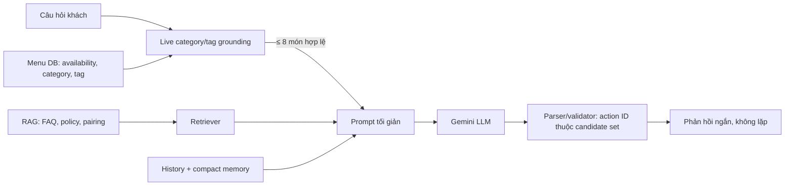

# Protocol chất lượng AI/RAG: menu live, accuracy và latency

## Kết luận kỹ thuật

Chatbot là LLM + RAG, nhưng LLM không phải nguồn dữ liệu menu. Menu live từ backend là source of truth cho tên món, giá, availability, category và tag. RAG chỉ truy hồi FAQ, policy và tri thức hỗ trợ; LLM chỉ diễn đạt trên tập context đã được kiểm soát.

Sự cố khách hỏi **Hải sản** nhưng nhận món thuộc nhóm khác xuất phát từ ba lỗi thiết kế:

1. Cầu nối backend → AI có `category_id` nhưng không gửi `category_name` mà người dùng thực sự hỏi.
2. Prompt nhận một danh sách món đầu tiên thay vì candidate set lọc theo category/tag.
3. Category/tag chỉ là soft hint cho LLM, chưa là invariant có test.

## Luồng production mới

`ChatMenuGrounding` ở backend lọc category trước tag và chỉ đưa tối đa tám món còn bán cho provider. Cùng quy tắc được áp dụng ở Python RAG để bảo vệ endpoint `/v1/chat` khi gọi trực tiếp. Parser chỉ chấp nhận action ID từ candidate set đó.

## Thiết kế nghiên cứu có thể tái lập

### Dữ liệu

- Knowledge base markdown: FAQ, policy, pairing, menu mẫu; ghi version/hash trước mỗi lần benchmark.
- `ai/evaluation/golden_questions.csv`: câu hỏi có nguồn kỳ vọng và guardrail kỳ vọng.
- Menu live: kiểm thử riêng category/tag bằng purity, coverage và action validity; không đưa snapshot lỗi thời vào RAG để thay dữ liệu DB.
- Tách tập dev/frozen-test trước khi chọn production retriever. Không dùng frozen test để tuning `k`, boost hoặc RRF weight.

### Ma trận phương pháp

| Phương pháp | Thực thi | Mục tiêu đánh giá | Lưu ý khoa học |
| --- | --- | --- | --- |
| BM25 + title/tag boost | `BM25Retriever` | lexical exact match | baseline hiện hành, nhanh và giải thích được |
| TF-IDF cosine vector | `TfidfVectorRetriever` | vector retrieval độc lập | là sparse vector baseline, **không** gọi là neural embedding |
| Hybrid RRF | `HybridRrfRetriever` | giảm bỏ sót từ một ranker | fusion BM25 + TF-IDF, có thêm chi phí |
| Neural embedding | chưa chọn encoder | semantic/paraphrase | chỉ chạy khi ghi encoder/version/device/corpus hash/seed |
| Live category/tag grounding | `ChatMenuGrounding` | menu correctness/safety | hard constraint; không thay retrieval FAQ/policy |

### Metric và luật chọn

- Retrieval: Hit@5, MRR@5, per-query rank, P50/P95 retrieval latency.
- Menu grounding: candidate purity, candidate coverage, action validity, false-category rate.
- Generation: faithfulness, hallucinated-menu rate, duplicate-response rate, human acceptance.
- Latency: retrieval local, backend orchestration, provider TTFT/end-to-end riêng biệt. Không suy luận P95 production từ benchmark local.
- Chọn retrieval trên dev theo MRR@5, sau đó Hit@5, sau đó P95. Chạy frozen test một lần sau khi khóa cấu hình.

`ai/evaluation/retrieval_benchmark.py` chạy ba retriever cùng golden set. Ở snapshot hiện tại (14 câu có nguồn kỳ vọng), kết quả chẩn đoán là:

| Method | Hit@5 | MRR@5 | P50 local | P95 local |
| --- | ---: | ---: | ---: | ---: |
| BM25 | 0.857 | 0.729 | 0.249 ms | 0.552 ms |
| TF-IDF vector baseline | 0.929 | 0.782 | 0.078 ms | 0.118 ms |
| Hybrid RRF | 0.857 | 0.720 | 0.351 ms | 0.539 ms |

Các số trên không tự động đổi production retriever vì golden set hiện chưa được tách dev/frozen test. Chúng là baseline được lưu để làm research checkpoint, không phải marketing claim về semantic embedding.

## Tối ưu tốc độ nhưng không hy sinh độ đúng

- Candidate menu ≤8 (trước đây prompt có thể nhận danh sách menu không liên quan); câu trả lời ≤4 món.
- Lịch sử gần nhất ≤6 và compact memory cũ có giới hạn; câu hỏi hiện tại chỉ xuất hiện một lần.
- Gemini dùng structured response, `temperature=0.2`, `reasoning_effort=low`; đây là cấu hình phù hợp tư vấn menu ngắn và được Gemini OpenAI-compatibility hỗ trợ.
- Prompt cấm lặp câu/món; parser Python loại câu lặp y hệt, direct provider loại dòng lặp y hệt.
- Không stream JSON trực tiếp vào UI ở giai đoạn này vì client cần JSON hợp lệ để validate action. Khi muốn giảm perceived latency hơn nữa, thêm server-side streaming với incremental JSON parser và test hủy request riêng.

## Regression bắt buộc

1. Query `Cho tôi các món hải sản` chỉ trả candidate có category `Hải sản`.
2. Query tag (ví dụ `món hấp`) chỉ trả candidate có tag đó.
3. Menu item hết hàng hoặc thuộc category inactive không vào candidate set.
4. Action ngoài candidate set bị chặn, kể cả khi LLM nêu đúng tên/giá cũ.
5. Câu hoặc dòng response lặp y hệt bị khử trước khi trả UI.
6. Full Python/backend test và benchmark phải chạy trong CI; staging đo P95 provider thật trước release.

## Artefact nghiên cứu

- `ai/notebooks/academic_rag_quality_study.ipynb`: notebook tuần tự từ câu hỏi nghiên cứu, audit dữ liệu, ma trận phương pháp, benchmark, grounding đến quyết định.
- `ai/evaluation/retrieval_benchmark.py`: benchmark có thể chạy lại không cần network/model download.
- `ai/tests/test_menu_grounding.py` và `backend/tests/RestaurantQrAiOrdering.Api.Tests/ChatMenuGroundingTests.cs`: regression V34.
