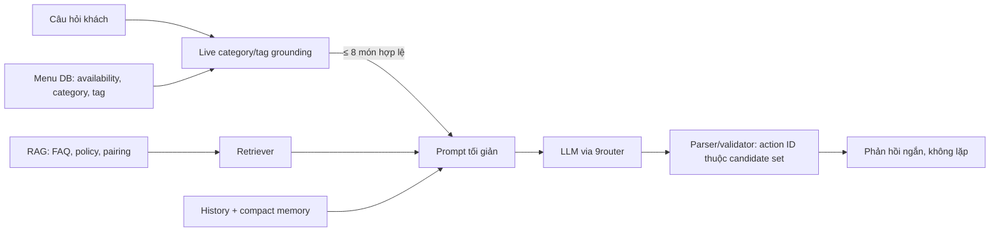

# Protocol chất lượng AI/RAG: menu live, accuracy và latency

## Kết luận kỹ thuật

Chatbot là LLM + RAG, nhưng LLM không phải nguồn dữ liệu menu. Menu live từ backend là source of truth cho tên món, giá, availability, category và tag. RAG chỉ truy hồi FAQ, policy và tri thức hỗ trợ; LLM chỉ diễn đạt trên tập context đã được kiểm soát.

Sự cố khách hỏi **Hải sản** nhưng nhận món thuộc nhóm khác xuất phát từ ba lỗi thiết kế:

1. Cầu nối backend → AI có `category_id` nhưng không gửi `category_name` mà người dùng thực sự hỏi.
2. Prompt nhận một danh sách món đầu tiên thay vì candidate set lọc theo category/tag.
3. Category/tag chỉ là soft hint cho LLM, chưa là invariant có test.

## Luồng production mới

`ChatMenuGrounding` ở backend lọc category trước tag và chỉ đưa tối đa tám món còn bán cho provider. Cùng quy tắc được áp dụng ở Python RAG để bảo vệ endpoint `/v1/chat` trên mọi request nội bộ. Parser chỉ chấp nhận action ID từ candidate set đó.

Với yêu cầu catalog rõ ràng theo category/tag (ví dụ “toàn bộ thực đơn về hải sản”), backend không gọi LLM. Backend dựng danh sách trực tiếp từ candidate set live để chặn cả trường hợp LLM nêu tên món sai trong trường `content` dù action ID đã được validate.

## Thiết kế nghiên cứu có thể tái lập

### Dữ liệu

- Knowledge base markdown: FAQ, policy, pairing, menu mẫu; ghi version/hash trước mỗi lần benchmark.
- `ai/evaluation/golden/cases.jsonl`: canonical golden (dev/test split, SHA-256 locked).
- `ai/evaluation/golden/smoke_retrieval.jsonl`: CI retrieval smoke (~36 case).
- Legacy `golden_questions.csv`: archived reference only.
- Menu live: kiểm thử riêng category/tag bằng purity, coverage và action validity; không đưa snapshot lỗi thời vào RAG để thay dữ liệu DB.
- Tách tập dev/frozen-test trước khi chọn production retriever. Không dùng frozen test để tuning `k`, boost hoặc RRF weight.

### Ma trận phương pháp

| Phương pháp | Thực thi | Mục tiêu đánh giá | Lưu ý khoa học |
| --- | --- | --- | --- |
| BM25 + title/tag boost | `BM25Retriever` | lexical exact match | baseline nhanh và giải thích được |
| TF-IDF cosine vector | `TfidfVectorRetriever` | vector retrieval độc lập | là sparse vector baseline, **không** gọi là neural embedding |
| Dense multilingual E5 | `EmbeddingRetriever` | semantic/paraphrase | encoder/revision/device/corpus hash/seed phải nằm trong manifest |
| Hybrid RRF | `HybridRrfRetriever` | giảm bỏ sót từ một ranker | cấu hình hiện tại fusion BM25 + multilingual E5 |
| Live category/tag grounding | `ChatMenuGrounding` | menu correctness/safety | hard constraint; không thay retrieval FAQ/policy |

### Metric và luật chọn

- Retrieval: Hit@5, MRR@5, per-query rank, P50/P95 retrieval latency.
- Menu grounding: candidate purity, candidate coverage, action validity, false-category rate.
- Generation: faithfulness, hallucinated-menu rate, duplicate-response rate, human acceptance.
- Latency: retrieval local, backend orchestration, provider TTFT/end-to-end riêng biệt. Không suy luận P95 production từ benchmark local.
- Chọn retrieval trên dev theo MRR@5, sau đó Hit@5, sau đó P95. Chạy frozen test một lần sau khi khóa cấu hình.

`ai/evaluation/run_retrieval_experiment.py` chạy ma trận BM25/dense/hybrid trên dev split; `retrieval_benchmark.py` chỉ còn là smoke benchmark. Kết quả được lưu làm research checkpoint và không tự động đổi production retriever.

## Tối ưu tốc độ nhưng không hy sinh độ đúng

- Candidate menu ≤8 (trước đây prompt có thể nhận danh sách menu không liên quan); câu trả lời ≤4 món.
- Lịch sử gần nhất ≤12 cùng typed session state và rolling summary có version; câu hỏi hiện tại chỉ xuất hiện một lần và Python không cắt lịch sử lần thứ hai.
- LLM qua 9router (OpenAI-compatible): `LLM_MODEL=cx/gpt-5.6-luna-review` — một mô hình duy nhất
  cho cả triển khai và quality gate, không cấu hình fallback. DeepSeek đã bị bỏ sau khi route của
  nó trong 9router từ chối `response_format:json_object`; xem `docs/ai/AI_DECISION_HISTORY.md`.
  `temperature=0.2`, structured response.
- Prompt cấm lặp câu/món; parser/validator Python loại câu hoặc dòng lặp y hệt.
- Không stream JSON trực tiếp vào UI ở giai đoạn này vì client cần JSON hợp lệ để validate action. Khi muốn giảm perceived latency hơn nữa, thêm server-side streaming với incremental JSON parser và test hủy request riêng.

## Regression bắt buộc

1. Query `Cho tôi các món hải sản` chỉ trả candidate có category `Hải sản`.
2. Query tag (ví dụ `món hấp`) chỉ trả candidate có tag đó.
3. Menu item hết hàng hoặc thuộc category inactive không vào candidate set.
4. Action ngoài candidate set bị chặn, kể cả khi LLM nêu đúng tên/giá cũ.
5. Câu hoặc dòng response lặp y hệt bị khử trước khi trả UI.
6. CI smoke: `python ai/evaluation/ci_golden_gates.py --run-smoke-eval`; quality gate E2E+LLM chạy manual trước release.

## Artefact nghiên cứu

- `ai/notebooks/rag_llm_system_research.ipynb`: notebook duy nhất, được sinh từ artifact đã khóa bằng `ai/scripts/build_rag_llm_research.py`.
- `output/reports/Bao_cao_do_an_AI_RAG_CMC_Restaurant.docx`: báo cáo Word học thuật có thể chỉnh sửa, dùng chung dữ liệu với notebook và được sinh bằng `ai/scripts/build_academic_report.py`.
- `ai/evaluation/run_retrieval_experiment.py`: benchmark BM25/dense/hybrid; `retrieval_benchmark.py` chỉ phục vụ smoke offline.
- `ai/tests/test_menu_grounding.py` và `backend/tests/RestaurantQrAiOrdering.Api.Tests/ChatMenuGroundingTests.cs`: regression V34.
