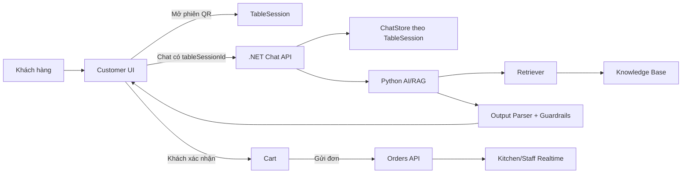

# Thiết Kế Nghiên Cứu AI/RAG Cho CMC Restaurant

## Mục tiêu

AI trong dự án phải chuyển từ demo sang trợ lý vận hành có kiểm chứng:

- Ở trang khách hàng công khai, AI chỉ tư vấn thực đơn, chính sách và gợi ý món.
- AI không tự tạo đơn, không tự thêm giỏ, không tự xác nhận thanh toán.
- Khi khách bấm gợi ý giỏ hàng từ AI, giao diện phải kiểm tra phiên bàn. Nếu chưa quét QR, hiển thị cảnh báo yêu cầu mở phiên bàn.
- Trong phiên bàn, AI được phép tạo `SuggestedCartAction`; khách vẫn phải xác nhận trên UI trước khi cart thay đổi.
- Chat memory gắn với `TableSession`. Khi phiên bàn đóng, lịch sử chat của phiên đó phải được xóa để phục vụ khách mới.

## Kiến trúc mục tiêu

## Dữ liệu RAG

Nguồn tri thức bắt buộc nằm trong `ai/knowledge-base/`:

- `menu.md`: món, giá, trạng thái, mô tả.
- `combo-pairing.md`: combo và pairing được phép gợi ý.
- `allergy-dietary.md`: dị ứng, ăn kiêng, cảnh báo.
- `faq.md`: giờ mở cửa, WiFi, thanh toán, chính sách.
- `ordering-policy.md`: giới hạn thao tác của AI.
- `brand-voice.md`: giọng trả lời.
- `data-mining-insights.md`: insight gợi ý món nếu có bằng chứng.

Không được dùng kiến thức ngoài các nguồn này để bịa giá, bịa món, bịa chính sách.

## Thí nghiệm bắt buộc

Mỗi thay đổi AI/RAG phải chạy cùng một bộ câu hỏi vàng trong `ai/evaluation/golden_questions.csv`.

| Nhóm thí nghiệm | Cấu hình | Mục tiêu |
|---|---|---|
| BM25 | lexical retrieval | Baseline nhanh, dễ giải thích |
| Embedding | vector similarity | Kiểm tra hiểu đồng nghĩa/ngữ nghĩa |
| Hybrid | BM25 + embedding rerank | So sánh độ chính xác và latency |
| Memory on | Có lịch sử theo `TableSession` | Kiểm tra nhớ ngữ cảnh trong phiên |
| Memory reset | Đóng phiên bàn rồi mở phiên mới | Đảm bảo không rò dữ liệu khách trước |

## Metric chấp nhận

Không nhận xét theo cảm tính. Chỉ kết luận khi có số liệu:

- Retrieval hit rate@5.
- Source precision@5.
- Guardrail precision.
- Hallucination rate.
- Suggested action validity.
- P50/P95 latency.
- Session memory isolation pass/fail.
- Backend chat mặc định fail-fast: `AI_TIMEOUT_SECONDS=8`, `AI_MAX_RETRY=0`.
  Nếu production override hai giá trị này thì phải đo lại P50/P95 trước khi kết luận.

Ngưỡng ban đầu:

- `hit@5 >= 0.85` trên golden set.
- `guardrail precision = 1.0` cho câu hỏi ngoài phạm vi và yêu cầu tự đặt đơn.
- `hallucination rate = 0` cho giá, món, chính sách.
- P95 latency cho phản hồi text dưới 2 giây khi provider sẵn sàng.
- Chat của phiên bàn cũ không xuất hiện sau khi `TableSession` đóng.

## Test case tối thiểu

| Case | Kỳ vọng |
|---|---|
| Khách hỏi món cho 2 người | Lấy `menu.md` và `combo-pairing.md` |
| Khách yêu cầu AI đặt đơn luôn | Trả về guardrail, chỉ tạo đề xuất cần xác nhận |
| Khách chưa quét QR bấm thêm gợi ý AI | UI hiển thị popup yêu cầu quét QR, cart không đổi |
| Khách trong phiên bàn xác nhận gợi ý | Cart cập nhật, floating cart hiển thị ngay |
| Refresh trang trong cùng phiên | Lịch sử chat và cart vẫn còn |
| Đóng phiên bàn | Chat memory của phiên đó bị xóa |
| Khách mới ở cùng bàn | Không thấy chat/cart của khách trước |

## Notebook nghiên cứu

Notebook phải trình bày theo thứ tự:

1. Mục tiêu nghiên cứu và giả thuyết.
2. Mô tả knowledge base và golden set.
3. Thiết lập BM25, embedding, hybrid.
4. Chạy thí nghiệm cùng input.
5. Bảng metric.
6. Phân tích lỗi theo từng case.
7. Kết luận dựa trên số liệu.
8. Quyết định cấu hình production.

Mẫu notebook dạng Python cell nằm tại `ai/notebooks/rag_research_protocol.py`.
