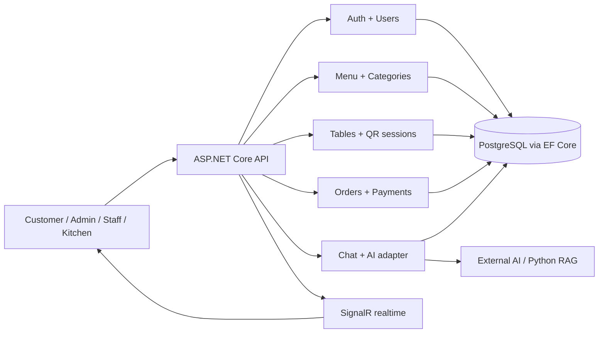

# Backend Modular Monolith

Tài liệu này mô tả kiến trúc đang chạy của API CMC Restaurant. Nó thay thế các mô tả cũ về các in-memory store độc lập.

## 1. Hình dạng hệ thống



`RestaurantQrAiOrdering.Api` là một modular monolith: các module được tổ chức theo khả năng nghiệp vụ, cùng triển khai trong một API và cùng transaction boundary khi cần.

## 2. Persistence và runtime

- Production/staging dùng `RestaurantDbContext` với PostgreSQL/Npgsql.
- Development hoặc integration test có thể dùng EF InMemory; đây là provider thay thế, không phải các in-memory store nghiệp vụ.
- Migration chỉ chạy khi `RUN_DB_MIGRATIONS_ON_STARTUP=true` và có PostgreSQL.
- `DbUserStore` là implementation đăng ký cho `IUserStore`; `DbChatStore` là implementation đăng ký cho `IChatStore`.
- Menu, categories, tables, orders và payments đọc/ghi trực tiếp qua `RestaurantDbContext` tại module sở hữu.

Không còn `RestaurantDataStore`, `ChatStore` hoặc `UserStore` in-memory trong runtime.

## 3. Ranh giới module

| Module | Sở hữu | Điểm vào chính | Persistence |
|---|---|---|---|
| Auth + Users | đăng nhập, token, tài khoản, vai trò | `AuthEndpoints`, `UserEndpoints` | `DbUserStore`, EF Core |
| Menu + Categories | danh mục, món, khả dụng, giá | `MenuEndpoints`, category endpoints | EF Core |
| Tables | QR bàn, phiên bàn | `TableEndpoints` | EF Core |
| Orders + Payments | đơn, item, timeline, thanh toán | `OrderEndpoints`, `PaymentEndpoints` | `OrderStore`, EF Core |
| Chat | chat session/message, capability, gọi AI | `ChatEndpoints` | `DbChatStore`, EF Core |
| Realtime | phát sự kiện đơn hàng | `OrderRealtimeNotifier`, hub | SignalR |

Contract nằm cạnh implementation sở hữu: ví dụ `IUserStore.cs` và `IChatStore.cs` mô tả seam, còn adapter database tương ứng nằm trong cùng module.

## 4. Invariants vận hành

- Một phiên bàn usable phải `Open`, chưa `ClosedAt` và chưa quá `ExpiresAt`.
- Khi phiên bàn đóng/hết hạn, mọi chat capability gắn với phiên đó bị thu hồi.
- Mỗi bàn chỉ có tối đa một phiên `Open` nhờ filtered unique index `UX_table_sessions_active_restaurant_table`.
- `Completed` và `Cancelled` là trạng thái terminal của đơn; item trong đơn terminal không thể đổi trạng thái.
- Payment `Refunded` là terminal cho thao tác confirm/fail thủ công.
- Chat tư vấn menu đọc availability và giá hiện tại từ database, không dùng snapshot lúc khởi động.

## 5. Transaction và cạnh tranh

Mở phiên QR trước tiên chuyển mọi phiên quá hạn của bàn sang `Expired`, rồi tìm phiên live. Nếu hai request cùng tạo phiên, PostgreSQL unique index chặn phiên trùng; API đọc lại phiên vừa được request còn lại tạo.

Migration `EnforceSingleActiveTableSession` cũng chuyển các phiên đã quá hạn trước khi tạo index. Các phiên live bị trùng cần được kiểm tra bằng preflight trong [Production Operations](PRODUCTION_OPERATIONS.md).

## 6. Kiểm chứng

Regression suite ở `backend/tests/RestaurantQrAiOrdering.Api.Tests` chạy qua HTTP với factory InMemory, bao phủ payment terminal state, lifecycle phiên bàn/chat, menu live, đơn terminal và EF embedding tracking.

```bash
dotnet test backend/RestaurantQrAiOrdering.sln --configuration Release
dotnet build backend/RestaurantQrAiOrdering.sln --configuration Release
```

CI chạy các regression test này ở job `backend-test`; frontend và AI vẫn có build/compile checks riêng.

## 7. Quy tắc thay đổi

1. Không xoá source trước khi chứng minh không có caller và chạy build/test.
2. State transition mới phải có test qua public seam hoặc model invariant.
3. Mỗi thay đổi schema phải có migration, preflight dữ liệu nếu có thể đụng production data, và đường rollback rõ ràng.
4. Public route/contract chỉ được bỏ sau deprecation có chủ đích; không coi “không có caller trong repo” là đủ.
