# BA/SA System Design - CMC Restaurant

Tài liệu này chuẩn hóa phân tích nghiệp vụ và kiến trúc giải pháp cho giai đoạn backend-first. Mục tiêu là để thành viên mới đọc xong có thể hiểu đúng actor, luồng nghiệp vụ, ranh giới module, dữ liệu lõi và hợp đồng API trước khi thiết kế UI hoặc viết code.

> **Nguồn chuẩn hợp nhất: [`docs/SYSTEM_ANALYSIS_DESIGN.md`](SYSTEM_ANALYSIS_DESIGN.md).** Tài liệu BA/SA này giữ các sơ đồ phân tích; đã đồng bộ state machine + ERD với branch `develop` (bỏ Delivery, order tạo ở `Placed`, thêm `Refunded`, per-order access token, `order_status_history`, ràng buộc order ↔ table session).

## 1. Bối Cảnh Và Phạm Vi

CMC Restaurant là hệ thống gọi món bằng QR có hỗ trợ AI gợi ý món. Hệ thống ưu tiên backend thật trước, sau đó UI bám theo API thật. Các logic mock/localStorage chỉ được dùng cho demo cũ, không được dùng làm nguồn sự thật nghiệp vụ.

Phạm vi hiện tại:

- Khách quét QR tại bàn, xem menu, tạo đơn dine-in (gọi món tại bàn).
- Nhân viên quầy theo dõi đơn, xác nhận thanh toán, hỗ trợ khách.
- Bếp nhận đơn, cập nhật trạng thái từng món theo thời gian thực.
- Quản lý/Admin quản lý menu, danh mục, bàn/QR và theo dõi vận hành.
- AI service gợi ý món dựa trên menu/FAQ/RAG, chỉ đề xuất và không tự sửa giỏ hàng.
- Thanh toán MVP hỗ trợ COD và VietQR.
- PostgreSQL là nguồn dữ liệu chính cho backend.

Ngoài phạm vi hiện tại:

- Không tích hợp cổng thanh toán ngân hàng real-time callback.
- Không tự động fine-tune model LLM trong app.
- Không xem AI provider như actor nghiệp vụ của người dùng. AI provider là hạ tầng phía sau AI service.

## 2. Actor Và Trách Nhiệm

| Actor | Vai trò | Quyền chính |
| --- | --- | --- |
| Customer | Khách dùng web qua QR tại bàn | Xem menu, tạo đơn, theo dõi đơn, tạo VietQR, chat gợi ý món |
| Staff/Counter | Nhân viên quầy | Xem đơn, xác nhận thanh toán, hỗ trợ trạng thái đơn |
| Kitchen | Bếp | Nhận đơn mới, cập nhật trạng thái từng món |
| Admin/Manager | Quản lý | Quản lý menu, danh mục, bàn/QR, xem trạng thái vận hành |
| AI Service | Hệ thống phụ trợ | Nhận câu hỏi, truy xuất knowledge base, gọi Google Gemini API, trả gợi ý an toàn |
| Payment/Bank/VietQR | Hệ thống thanh toán phụ trợ | Sinh nội dung chuyển khoản/VietQR để khách thanh toán |

Ghi chú bảo vệ phạm vi: `AI Service` và `Payment/Bank/VietQR` là supporting systems, không phải người dùng chính. Các use case quản trị/bếp/nhân viên phải `include` đăng nhập trước khi thao tác.

## 3. Use Case Tổng Quan

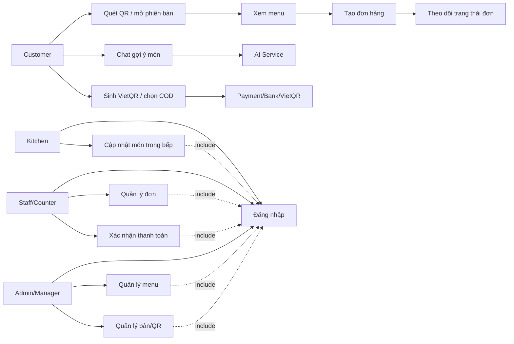

## 4. Luồng Nghiệp Vụ Chính

### 4.1 QR / Table Session

1. Customer quét QR hoặc mở link có `tableCode`.
2. Frontend gọi `GET /api/tables/{tableCode}` để lấy thông tin bàn và session.
3. Nếu bàn hợp lệ, customer xem menu theo ngữ cảnh bàn.
4. Khi tạo đơn, backend gắn đơn với `tableCode` và phiên bàn (`tableSessionId`).

### 4.2 Menu

1. Customer gọi `GET /api/menu`.
2. Admin đăng nhập rồi quản lý danh mục/món qua các endpoint `/api/admin/categories` và `/api/admin/menu-items`.
3. UI không tự bịa danh mục/món ngoài API thật.
4. Trạng thái món hết hàng được backend trả về để UI khóa thao tác thêm vào giỏ.

### 4.3 Order

1. Customer gửi `POST /api/orders` với item, số lượng, payment method và context.
2. Backend validate menu item, giá, trạng thái availability và tạo `orderCode`.
3. Kitchen/Staff nhận đơn qua API polling hoặc SignalR event `order.created`.
4. Kitchen cập nhật từng món qua `PATCH /api/orders/{orderCode}/items/{orderItemId}/status`.
5. Staff/Admin cập nhật trạng thái đơn qua `PATCH /api/orders/{orderCode}/status`.
6. Customer theo dõi qua `GET /api/orders/{orderCode}`.

### 4.4 Kitchen

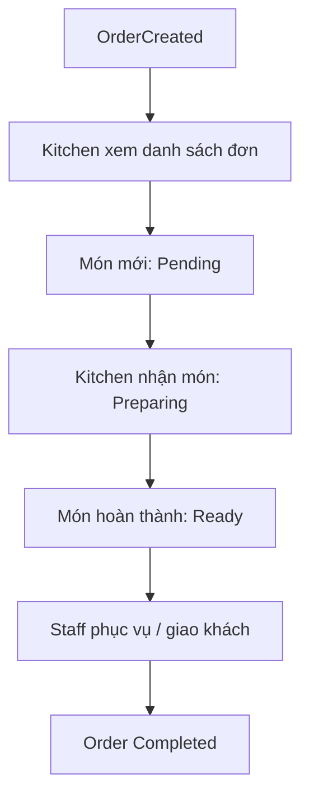

### 4.5 Payment

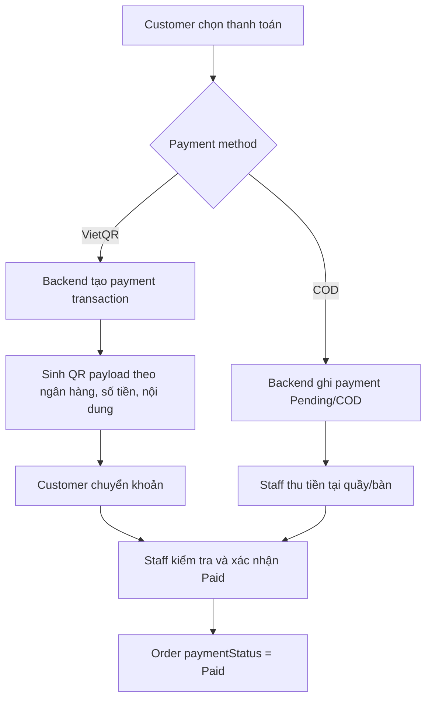

### 4.6 AI Suggestion

1. Customer mở chat và gửi câu hỏi.
2. Backend tạo/đọc chat session qua `/api/chat/sessions`.
3. Backend gọi AI service nội bộ.
4. AI service truy xuất knowledge base menu/FAQ, gọi Google Gemini API nếu có cấu hình.
5. AI trả lời bằng văn bản và có thể trả `SuggestedCartAction`.
6. Frontend chỉ hiển thị đề xuất. Customer phải xác nhận trước khi thêm vào giỏ.
7. Nếu AI lỗi hoặc trả payload không an toàn, backend dùng fallback an toàn, không tạo đơn và không sửa giỏ hàng.

## 5. Activity Diagram - Đặt Món Dine-in

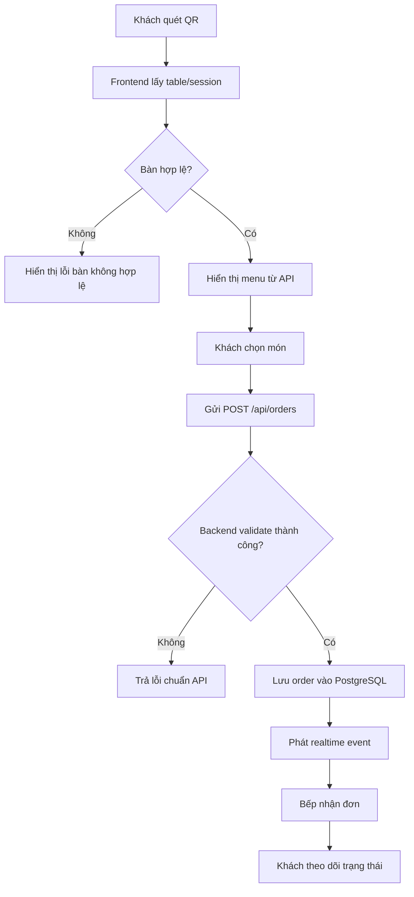

## 6. Sequence Diagram - Order Đến Bếp

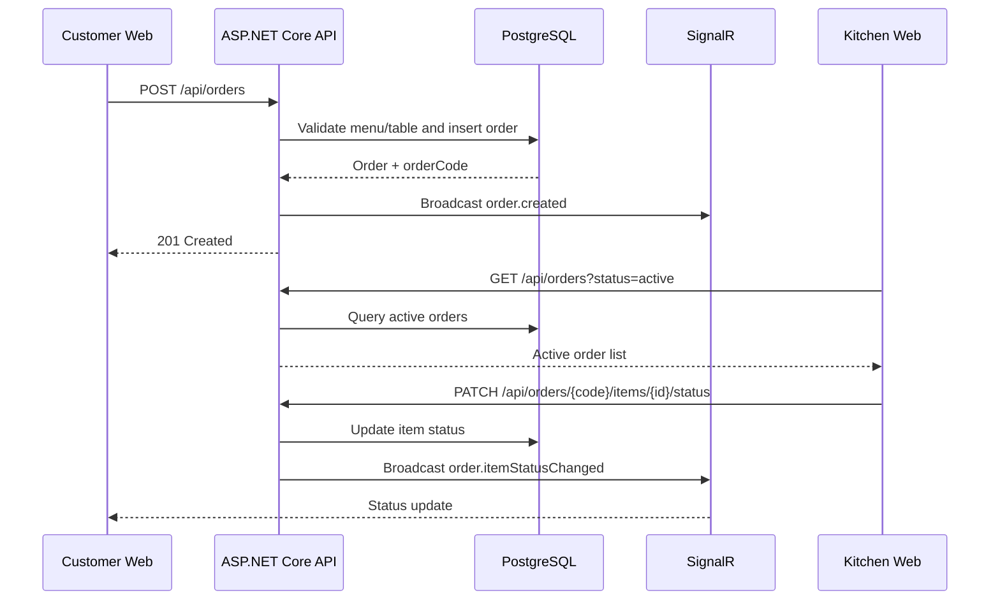

## 7. Sequence Diagram - AI Gợi Ý Món

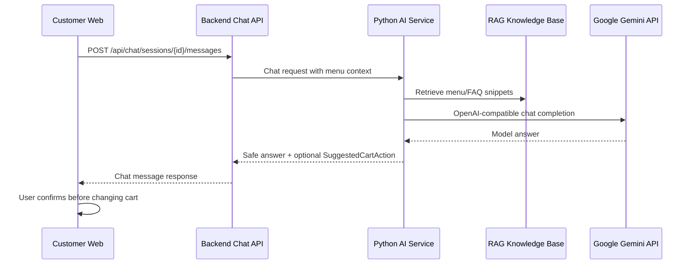

## 8. State Diagram

> Các sơ đồ dưới đã đồng bộ với state machine thực trong `OrderStore.cs` / `PaymentEndpoints.cs` (branch `develop`). Order được tạo ở `Placed`; mọi lần đổi trạng thái order hoặc payment được ghi vào bảng `order_status_history` (kèm actor + note). Chuyển sang `Completed` yêu cầu payment `Confirmed/Paid`; ghi đồng thời (2 người sửa cùng đơn) trả `409 CONFLICT_STALE` (optimistic concurrency `xmin`).

### 8.1 Order State

`Draft` là giá trị enum mặc định nhưng đơn thực tế được tạo ở `Placed`. Hủy chỉ cho phép từ `Draft`/`Placed`/`Confirmed`.

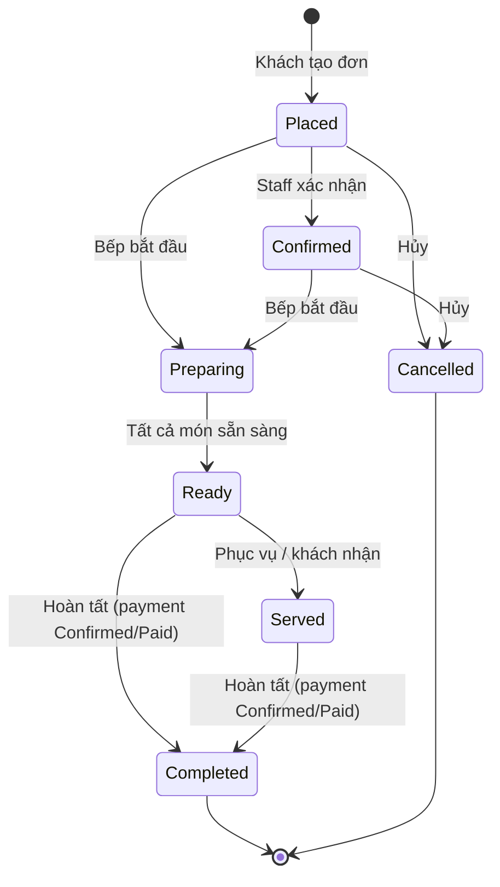

### 8.2 Payment State

Trạng thái theo đúng enum `PaymentStatus`. `Confirmed` và `Paid` đều thỏa điều kiện hoàn tất đơn; `Refunded` chỉ đạt được từ `Confirmed`/`Paid`.

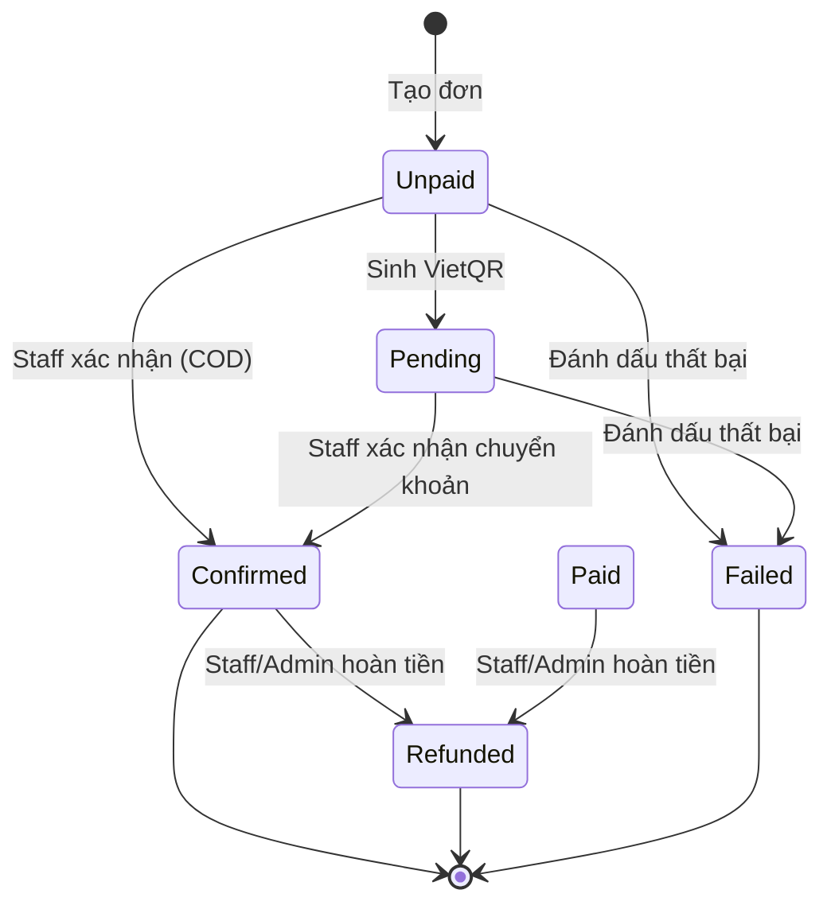

### 8.3 Order Item State

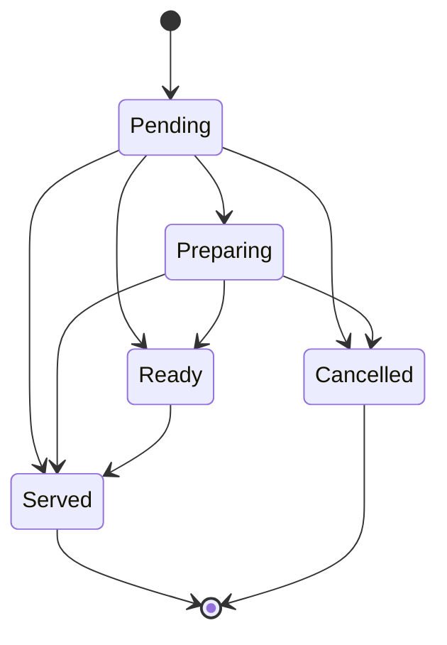

## 9. Class / Domain Model Mức Khái Niệm

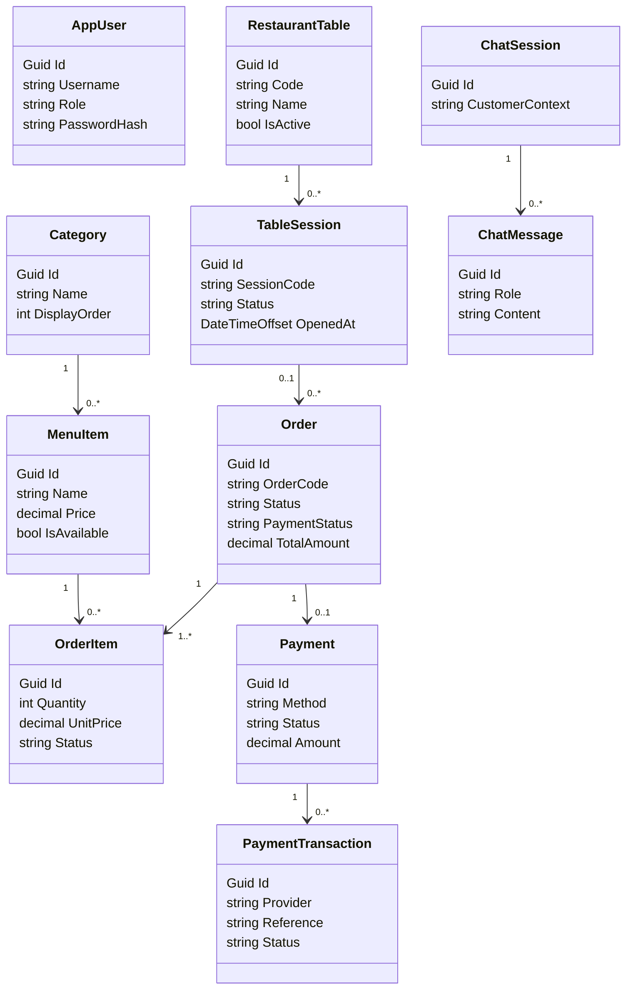

## 10. ERD Mức Triển Khai

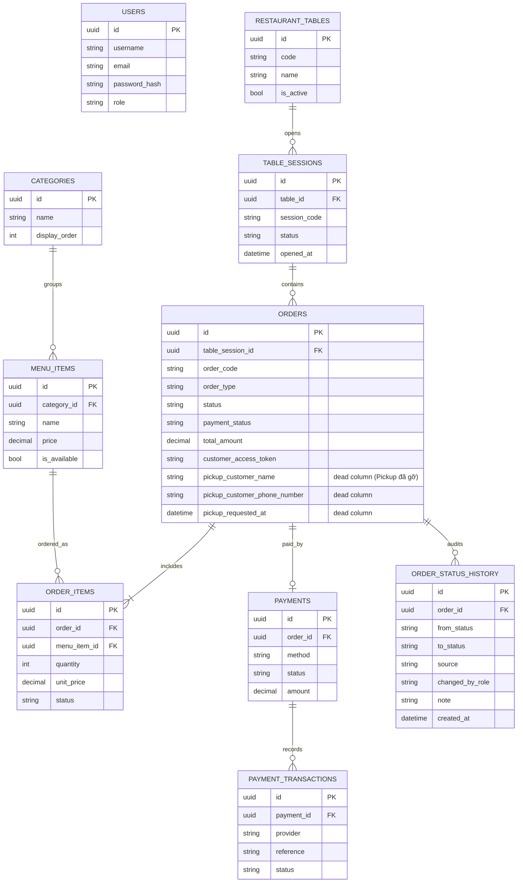

## 11. Component Diagram

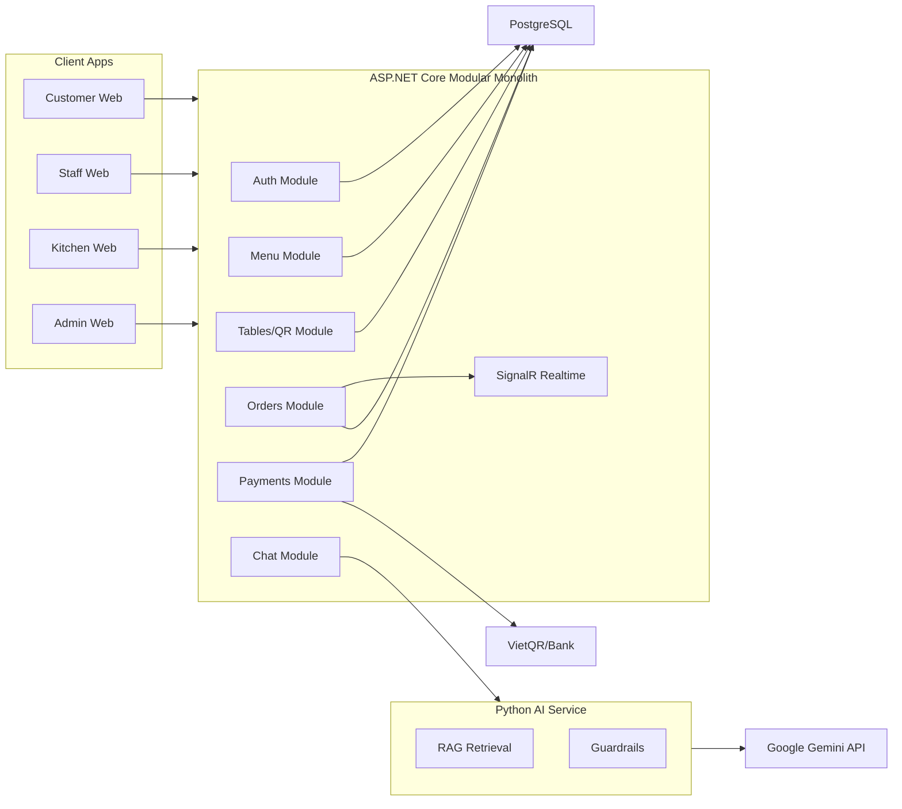

## 12. Deployment Diagram

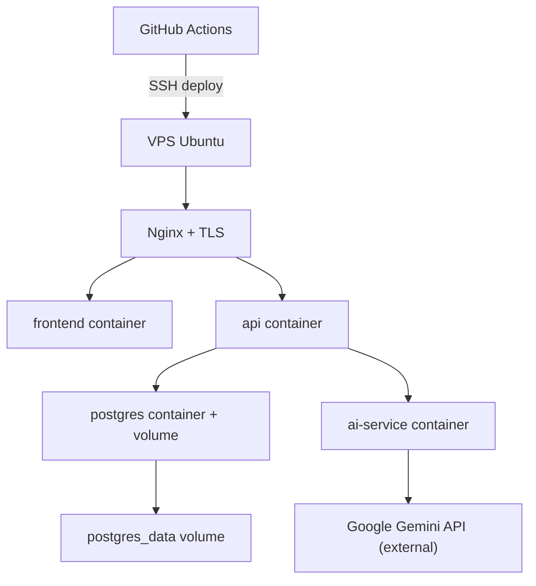

## 13. API Traceability Checklist

| Nghiệp vụ | API/backend liên quan | Ghi chú kiểm tra |
| --- | --- | --- |
| Đăng nhập | `POST /api/auth/login`, `GET /api/auth/me` | Staff/Kitchen/Admin phải đăng nhập trước thao tác |
| Bàn/QR | `GET /api/tables/{tableCode}` | Không tự tạo table context ở UI |
| Menu khách | `GET /api/menu` | Menu UI đọc API thật |
| Quản lý menu | `/api/admin/categories`, `/api/admin/menu-items` | Cần token role phù hợp |
| Tạo đơn | `POST /api/orders` | Backend validate item/price/status |
| Theo dõi đơn | `GET /api/orders/{orderCode}` | Customer không cần đăng nhập |
| Danh sách đơn bếp/quầy | `GET /api/orders` | Dùng cho staff/kitchen dashboard |
| Cập nhật trạng thái món | `PATCH /api/orders/{orderCode}/items/{orderItemId}/status` | Kitchen flow |
| Cập nhật trạng thái đơn | `PATCH /api/orders/{orderCode}/status` | Staff/Admin flow |
| VietQR | Payment endpoints trong module `Payments` | Staff xác nhận thanh toán trong MVP |
| AI chat | `/api/chat/sessions`, `/api/chat/sessions/{id}/messages` | AI chỉ đề xuất, không tự tạo đơn |
| Realtime | SignalR hub + order events | Có polling fallback |

## 14. Quy Tắc Cho Các Issue UI/API Tiếp Theo

- UI phải bắt đầu từ use case và API traceability ở tài liệu này.
- Không đưa payload mẫu/debug API ra giao diện người dùng cuối.
- Không dùng mock/localStorage làm nguồn sự thật của order, payment, kitchen hoặc admin.
- Nếu cần dữ liệu demo, seed trong backend hoặc PostgreSQL, không hard-code ở component UI.
- Mỗi PR UI phải ghi rõ route nào gọi endpoint nào.
- Mỗi PR nghiệp vụ phải cập nhật diagram/checklist nếu làm thay đổi flow.

## 15. Definition Of Done Cho Tài Liệu BA/SA

- Actor đầy đủ và phân biệt người dùng chính với supporting system.
- Use case đăng nhập được include trước các thao tác staff/kitchen/admin.
- Có activity, sequence, state, component, deployment, class và ERD ở mức phù hợp.
- Luồng QR/session, menu, order, kitchen, payment, AI suggestion và admin đều có mô tả.
- Tài liệu không mâu thuẫn với `docs/API_CONTRACT.md`, `Program.cs`, Docker Compose và các module backend hiện tại.
