# CI/CD & DevOps Pipeline

Tài liệu mô tả luồng tích hợp và triển khai liên tục của hệ thống **CMC Restaurant QR AI Ordering** (monorepo: .NET API + React/Vite frontend + Python RAG service + PostgreSQL, triển khai bằng Docker Compose lên VPS).

## 1. Tổng quan luồng

```mermaid
flowchart LR
  dev[feature branch<br/>feat/* · fix/* · chore/*] -->|push / PR| ci[CI<br/>build · test · security]
  ci -->|xanh + auto-merge| develop[(develop)]
  develop --> stg[Deploy Staging<br/>backup → deploy → health-check]
  stg -->|thành công| relpr[Release PR develop→main<br/>KHÔNG auto-merge]
  relpr -->|maintainer duyệt + merge| main[(main)]
  main --> prodcks[release-checks = CI]
  prodcks --> prod[Deploy Production<br/>backup → deploy → health-check]
  prod -->|thất bại| rb[Auto-rollback<br/>rollback.yml]
```

Nguyên tắc: **tự động tối đa, chỉ chặn tay ở cửa production**. Staging chạy tự động để phản hồi nhanh; lên production luôn cần một người duyệt.

## 2. Môi trường

| Môi trường | Branch nguồn | Kích hoạt | Cổng bảo vệ |
| --- | --- | --- | --- |
| CI (ephemeral) | mọi branch/PR | push feat|fix|chore, mọi PR | — |
| **Staging** | `develop` | tự động khi merge vào develop | CI xanh |
| **Production** | `main` | khi maintainer merge Release PR | duyệt tay + CI (`release-checks`) |

## 3. Các workflow

| File | Vai trò | Trigger |
| --- | --- | --- |
| `ci.yml` | build + test FE/BE/AI, validate docker-compose, xuất test artifact | PR, push (develop/main/feature), `workflow_call` |
| `security.yml` | CodeQL (C#/JS-TS/Python), dependency-review, gitleaks, Trivy | PR, push, lịch tuần |
| `deploy-staging.yml` | SSH deploy lên VPS staging | push `develop` |
| `promote-production.yml` | mở/refresh Release PR develop→main (**không** auto-merge) | sau khi Deploy Staging thành công |
| `deploy-production.yml` | CI lại rồi SSH deploy production + **auto-rollback** khi lỗi | push `main` |
| `auto-merge.yml` | bật auto-merge cho PR vào **develop** (cùng repo, không draft) | PR target develop |
| `rollback.yml` | rollback staging/production về bản trước | thủ công / được deploy dispatch |
| `dependabot.yml` | cập nhật phụ thuộc nuget/npm/pip/actions hàng tuần | lịch |

## 4. Quality gates (CI)

Mỗi PR phải xanh các job:

- `frontend-build` — `npm ci` → `npm run build` (typecheck + build 4 app) → `vitest` (xuất JUnit artifact).
- `backend-test` — `dotnet restore/build/test` (Release) → xuất TRX artifact.
- `ai-service-test` — `unittest` cho RAG core.
- `docker-compose-config` — validate `deploy/docker-compose.yml`.

`concurrency` huỷ các lần chạy cũ trên cùng ref để tiết kiệm runner.

## 5. Bảo mật (DevSecOps)

- **CodeQL**: phân tích tĩnh 3 ngôn ngữ (`build-mode: none`), báo cáo lên tab *Security → Code scanning*.
- **dependency-review**: chặn PR nếu thêm phụ thuộc mức *critical*.
- **gitleaks**: quét lộ secret trong lịch sử/diff.
- **Trivy**: quét lỗ hổng + misconfig + secret trên filesystem (HIGH/CRITICAL).
- **Dependabot**: tự mở PR nâng cấp phụ thuộc hàng tuần (gom nhóm dev-tooling để giảm nhiễu).
- `auto-merge` chỉ áp dụng cho PR **cùng repo** (tránh footgun của `pull_request_target`).

## 6. Độ tin cậy khi triển khai

Script `deploy/scripts/deploy-vps.sh` thực hiện tuần tự trên VPS:

1. Đồng bộ mã nguồn (giữ `repo.previous` để rollback).
2. `docker compose up -d --build`.
3. `backup-postgres.sh` — sao lưu DB trước khi kiểm tra.
4. `write-nginx-config.sh` + `issue-certbot.sh` — cấu hình reverse proxy + TLS.
5. `health-check.sh` — kiểm tra `/api/health`; lỗi sẽ khiến job thất bại.

Nếu **Deploy Production** thất bại (build/migration/health-check), workflow tự **dispatch `rollback.yml`** cho môi trường production.

## 7. Bí mật & cấu hình

Secrets đặt theo **GitHub Environments** (`staging`, `production`), không nằm trong repo:

- `STAGING_HOST` / `PRODUCTION_HOST`, `*_SSH_USER`, `*_SSH_KEY`
- `*_POSTGRES_PASSWORD`, `JWT_SIGNING_KEY`, `GEMINI_API_KEY`
- `*_BOOTSTRAP_ADMIN_EMAIL` / `_PASSWORD`, `CERTBOT_EMAIL`, `RELEASE_BOT_TOKEN` (tuỳ chọn)

## 8. Kích hoạt cổng duyệt production (một lần, trong Settings)

Phần này nằm ngoài code — cần bật trong GitHub:

1. **Settings → Environments → `production` → Required reviewers**: thêm người duyệt. Khi đó job `deploy-production` sẽ chờ duyệt trước khi chạy.
2. **Settings → Branches → Rule cho `main`**: yêu cầu PR + các status check `frontend-build`, `backend-test`, `docker-compose-config` phải xanh mới merge được.
3. (Tuỳ chọn) Bật *Require review from Code scanning* nếu dùng GitHub Advanced Security.

## 9. Vận hành nhanh (runbook)

- **Phát hành lên production**: chờ Release PR (do `promote-production` tạo) → review CI + staging → merge vào `main` → theo dõi *Deploy Production*.
- **Rollback thủ công**: Actions → *Rollback* → chọn `staging`/`production` → Run.
- **Sự cố CI**: mở artifact `*-test-results` để xem chi tiết test thất bại.
