# Phân Tích & Thiết Kế Hệ Thống — CMC Restaurant QR AI Ordering

> **Tài liệu nguồn chính (single source of truth)** cho phân tích nghiệp vụ (BA), thiết kế giải pháp (SA)
> và luồng hoạt động. Được **đối chiếu trực tiếp với code hiện tại** trên nhánh `develop` (sau đợt
> hardening P0–P3). Khi có mâu thuẫn giữa các tài liệu, **file này thắng**.
>
> - Chi tiết endpoint/DTO/error-code: xem [`API_CONTRACT.md`](API_CONTRACT.md).
> - Nợ kỹ thuật & kế hoạch dọn/bổ sung: xem [`REFACTOR_PLAN.md`](REFACTOR_PLAN.md).
> - Các tài liệu cũ (`BA_SA_SYSTEM_DESIGN.md`, `PROJECT_CONTEXT.md`) giữ lại làm lịch sử; phần enum/flow
>   đã lỗi thời được chú thích trỏ về file này.
>
> _Cập nhật: 2026-07-01._

---

## 1. Bối Cảnh & Phạm Vi

Hệ thống đặt/gọi món bằng **QR** cho nhà hàng, tích hợp **chatbot AI** tư vấn món (RAG). Backend là nguồn
sự thật nghiệp vụ; UI bám API thật; AI chỉ **đề xuất**, không tự tạo đơn / sửa giỏ / bịa giá.

**Trong phạm vi (v1):** QR dine-in tại bàn; menu/cart/checkout; theo dõi đơn realtime; kitchen board;
staff order + payment desk; admin menu/category/table/user; chatbot RAG; thanh toán MVP **COD + VietQR**
(đối soát thủ công); Postgres là DB chính; deploy Docker/VPS + CI/CD.

**Ngoài phạm vi:** đặt món mang về / pickup online; cổng thanh toán ngân hàng real-time callback; giao hàng
thật/shipper; đặt bàn trước; quản lý tồn kho; fine-tune LLM; marketplace nhiều nhà hàng. **Domain giao hàng
(Delivery) và Pickup đã bị gỡ** — chỉ còn `DineIn` (quét QR tại bàn).

## 2. Kiến Trúc Tổng Thể

Modular monolith .NET + AI service Python tách riêng + 4 frontend app + Postgres.

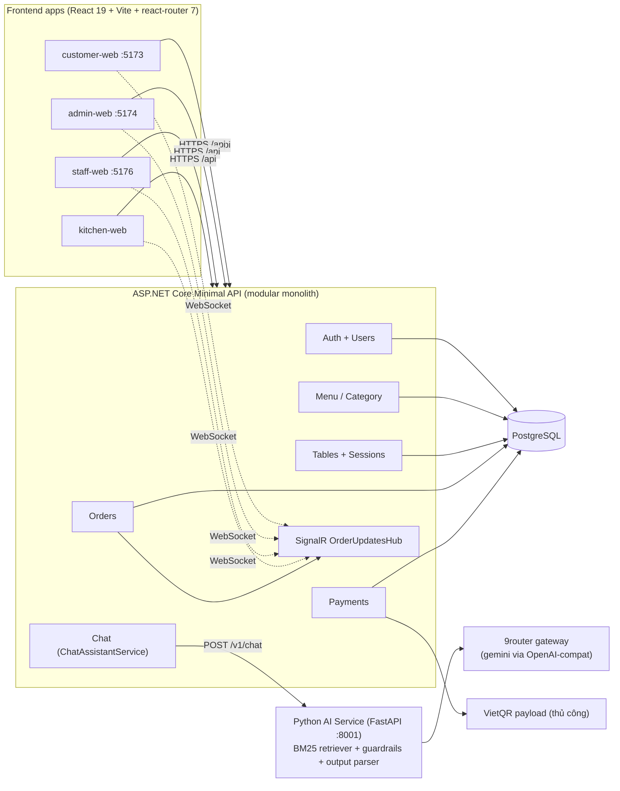

**Stack:** Backend ASP.NET Core Minimal API, EF Core 8 + Npgsql, JWT (HMAC) + PBKDF2, SignalR.
AI service FastAPI (Python 3.12), retrieval **Okapi BM25** (lexical, không phải vector). Frontend npm
workspaces: 4 app + 6 package (`shared-ui`, `api-client`, `shared-types`, `auth`, `realtime-client`,
`utils`). Deploy docker-compose (postgres, api, ai-service, frontend) + GitHub Actions
(develop→staging→main→prod auto-promote).

## 3. Actor & Phân Quyền

| Actor | Loại | Xác thực | Quyền chính |
| --- | --- | --- | --- |
| **Customer/Guest** | Người dùng chính | Ẩn danh (không tài khoản) | Xem menu, tạo đơn, theo dõi đơn của mình (qua `X-Order-Token`), tạo VietQR, chat AI |
| **Staff** | Người dùng chính | JWT role `Staff` | Xem tất cả đơn, đổi trạng thái đơn, xác nhận/huỷ/**hoàn** thanh toán |
| **Kitchen** | Người dùng chính | JWT role `Kitchen` | Xem đơn, cập nhật trạng thái từng món |
| **Admin/Manager** | Người dùng chính | JWT role `Admin` | Toàn quyền staff + quản lý menu/category/table/user |
| **AI Service** | Hệ phụ trợ | Nội bộ (backend gọi) | Truy xuất KB, gọi 9router, trả gợi ý an toàn |
| **VietQR/Bank** | Hệ phụ trợ | — | Sinh payload chuyển khoản; đối soát **thủ công** bởi Staff |

Quy tắc: mọi thao tác Staff/Kitchen/Admin **include đăng nhập** trước. Customer **không có tài khoản** — QR
ordering ẩn danh; đọc đơn riêng bằng per-order token (mục 10).

## 4. Use Case Tổng Quan

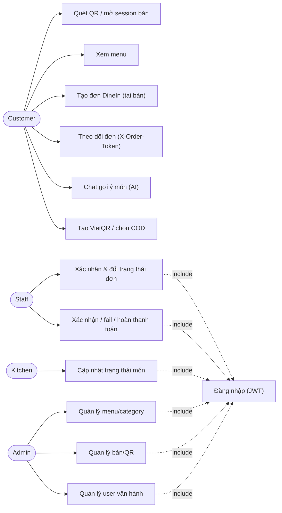

## 5. Mô Hình Miền & ERD

13 entity. **Đã đối chiếu code** (`backend/Entities/*`, `RestaurantDbContext.cs`).

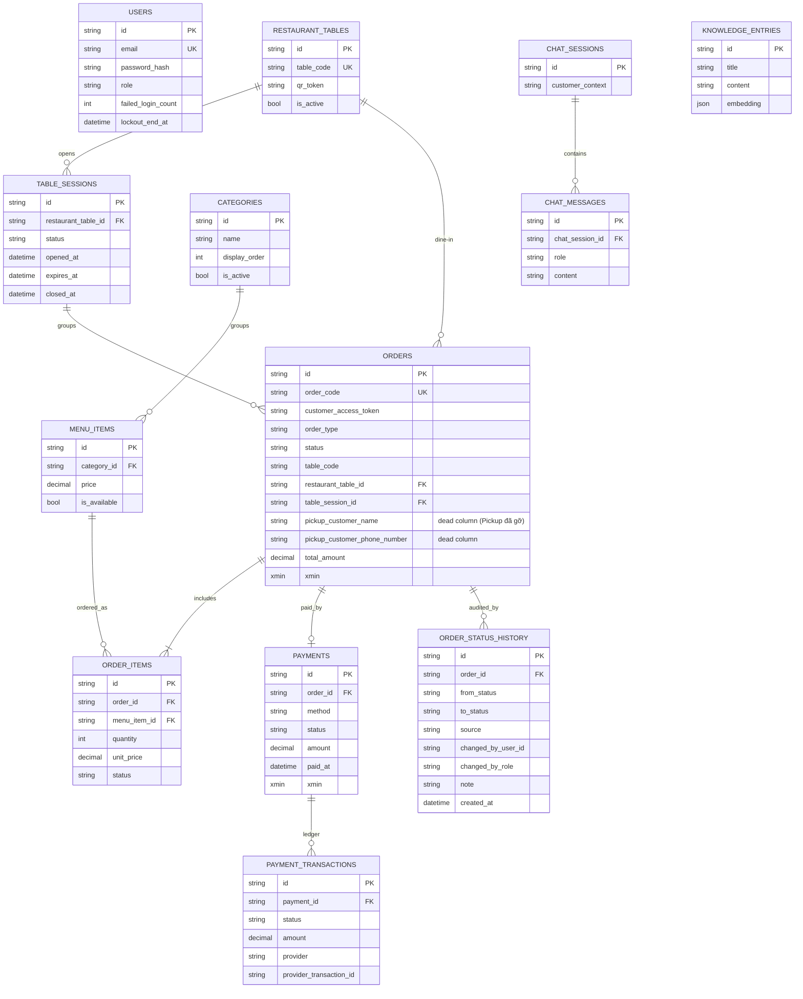

> **Chú thích wiring hiện tại:**
> - `KNOWLEDGE_ENTRIES` (+ cột `embedding`) được map nhưng chưa nằm trong retrieval flow của AI service Python; giữ lại chờ data audit trước khi bỏ schema.
> - `CHAT_SESSIONS`/`CHAT_MESSAGES` được lưu qua **`DbChatStore`**; lịch sử chat bền qua API restart và bị thu hồi theo `TableSession` khi cần.
> - `ORDERS.xmin`/`PAYMENTS.xmin`: optimistic concurrency token (Postgres system column, P1).

## 6. Enum Chuẩn (theo code hiện tại)

| Enum | Giá trị (đúng thứ tự) | Ghi chú |
| --- | --- | --- |
| `UserRole` | `Customer`, `Staff`, `Kitchen`, `Admin` | Customer ẩn danh; 3 role vận hành cần JWT |
| `OrderType` | `DineIn` | Chỉ dine-in tại bàn (QR). `Pickup`/`DeliveryMock` **đã gỡ** |
| `OrderStatus` | `Draft`, `Placed`, `Confirmed`, `Preparing`, `Ready`, `Served`, `Completed`, `Cancelled` | ⚠️ `Delivering`/`Delivered` **đã gỡ**. Đơn tạo ra ở `Placed`; `Draft` là default-enum, thực tế không dùng |
| `OrderItemStatus` | `Pending`, `Preparing`, `Ready`, `Served`, `Cancelled` | |
| `PaymentMethod` | `COD`, `VietQR` | |
| `PaymentStatus` | `Unpaid`, `Pending`, `Paid`, `Confirmed`, `Failed`, `Cancelled`, `Refunded` | `Refunded` thêm ở P3; `Confirmed`/`Paid` = đã đối soát |
| `TableSessionStatus` | `Open`, `Closed` (+ `Expired` **suy ra**) | Expired tính theo `expires_at` khi đọc, không có sweeper |
| `OrderStatusChangeSource` | `Status`, `Payment` | Nguồn dòng audit trong `order_status_history` |
| `ChatRole` | `user`, `assistant` | |

## 7. State Machine (đối chiếu `OrderStore.cs`)

### 7.1 Order

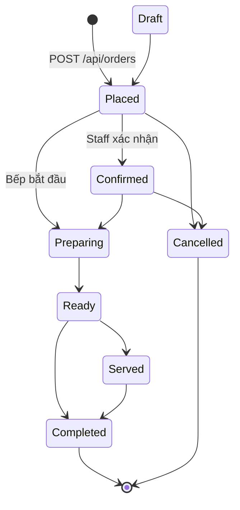

Ràng buộc (code):
- **Huỷ** chỉ từ `Draft`/`Placed`/`Confirmed`, và bị **khoá** nếu order đã `Preparing`+ hoặc **bất kỳ món
  nào** đã qua `Pending` (`IsCancellationLocked`) → lỗi `ORDER_CANCEL_NOT_ALLOWED`.
- **Completed** yêu cầu payment `Confirmed`/`Paid`, nếu chưa → `ORDER_COMPLETE_REQUIRES_PAYMENT`.
- Transition không hợp lệ → `ORDER_STATUS_TRANSITION_INVALID`; re-gửi cùng status bị từ chối (tránh audit
  trùng). Ghi đè đồng thời → `409 CONFLICT_STALE` (xmin).
- Huỷ đơn → cascade huỷ các món còn `Pending`.

### 7.2 Order Item

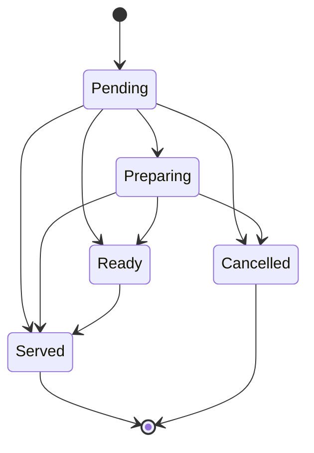
Chỉ tiến (cho phép nhảy bậc cho bếp nhanh), không lùi; `Served`/`Cancelled` là terminal.

### 7.3 Payment

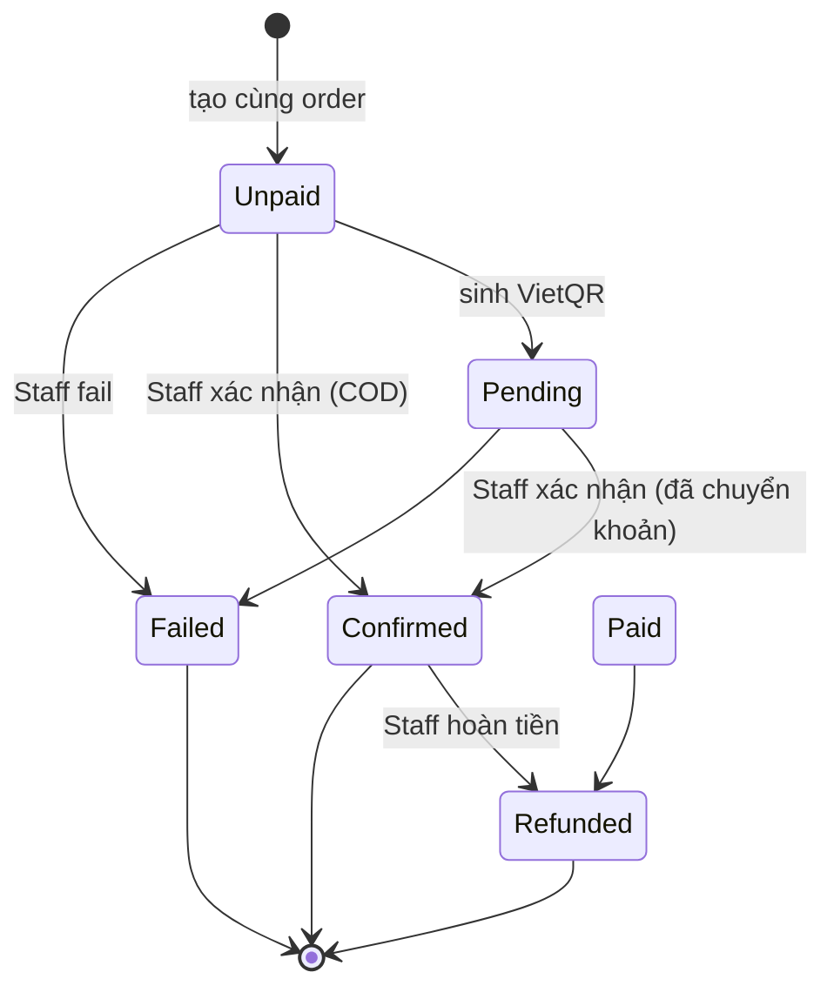
`confirm` ghi `Confirmed` + `paid_at` + dòng ledger; `refund` chỉ từ `Confirmed`/`Paid` (khác → lỗi
`PAYMENT_NOT_REFUNDABLE`). Mọi thao tác payment ghi 1 dòng `payment_transactions` + 1 marker
`order_status_history` (source=`Payment`).

### 7.4 Table Session

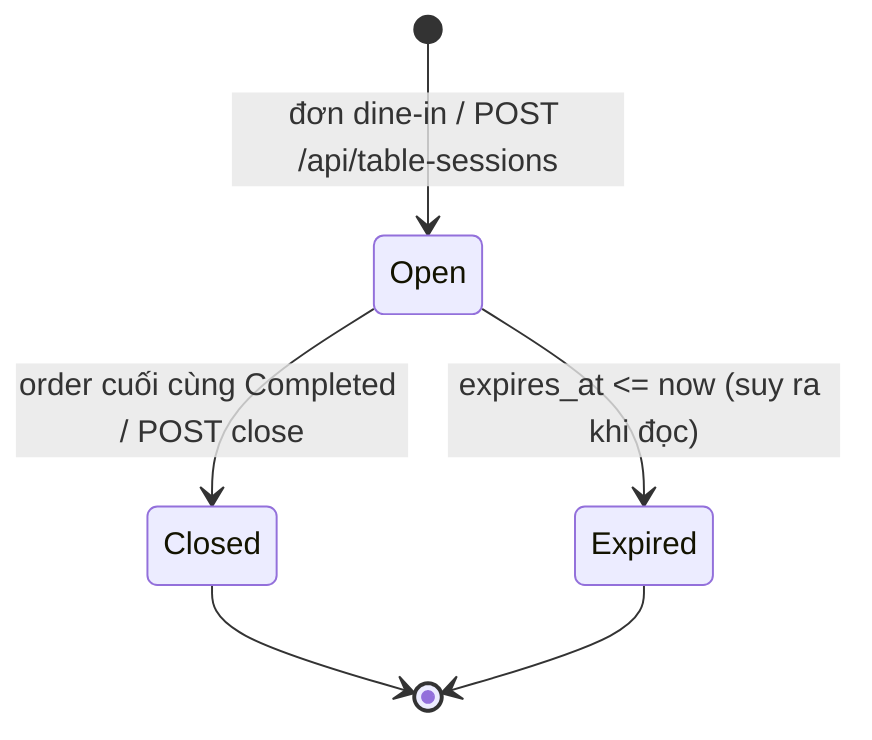
Đơn dine-in gắn vào session `Open` chưa hết hạn của bàn (mở mới nếu chưa có), TTL **4h**. Khi order
`Completed` và không còn order active nào khác trên session → đóng session (cùng unit-of-work). **Chưa có
background job** đổi Open→Expired (chỉ tính lúc đọc).

## 8. Luồng Hoạt Động (Activity & Sequence)

### 8.1 Đặt món dine-in (activity)

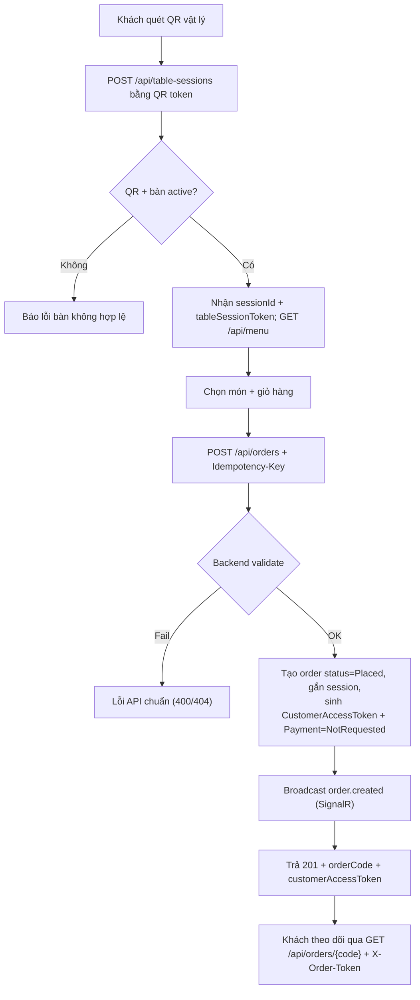

### 8.2 Order → Kitchen (sequence)

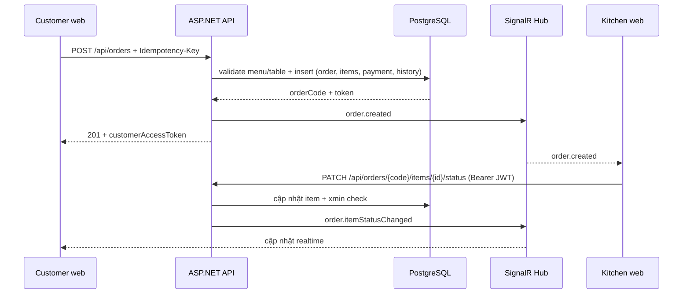

### 8.3 Thanh toán (COD + VietQR)

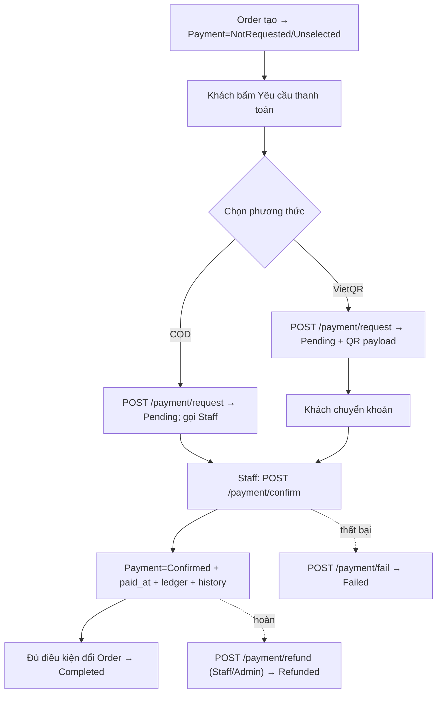

### 8.4 AI chat / RAG (sequence + guardrails)

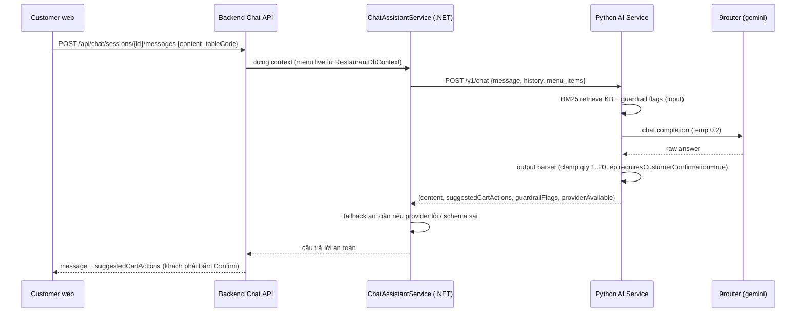

**Guardrail:** 5 cờ input (Python `guardrails.py`) + 2 cờ hệ thống backend thêm
(`AI_PROVIDER_UNAVAILABLE`, `AI_OUTPUT_SCHEMA_INVALID`). AI **không** tự tạo đơn / sửa giỏ / bịa giá; mọi
`suggestedCartAction` mang `requiresCustomerConfirmation=true`.

### 8.5 Đăng nhập + khoá tài khoản (P3)

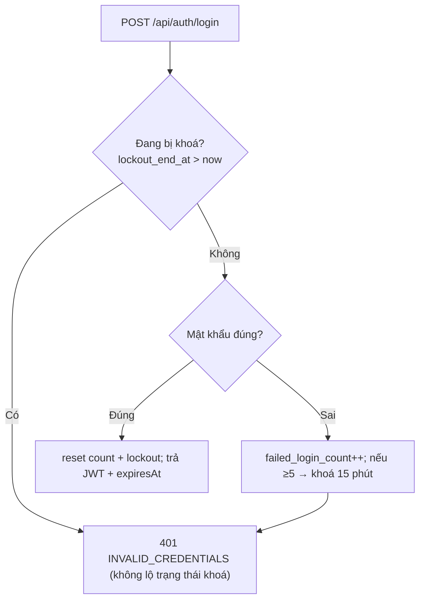
Thông báo luôn là `INVALID_CREDENTIALS` (không phân biệt sai mật khẩu vs đang khoá) → chống user
enumeration.

## 9. API Surface (tóm tắt — chi tiết ở API_CONTRACT.md)

| Nhóm | Endpoint tiêu biểu | Auth |
| --- | --- | --- |
| Auth/User | `POST /api/auth/login`, `GET /api/auth/me`, `POST /api/auth/change-password`, `/api/users` (Admin) | public / JWT |
| Menu | `GET /api/menu`; `/api/admin/categories`, `/api/admin/menu-items` | public / AdminOnly |
| Tables | safe public resolve/session; `/api/admin/tables` co QR | public capability / AdminOnly |
| Orders | `POST /api/orders`, `GET /api/orders/{code}` (**X-Order-Token**), `GET /api/orders`, `PATCH .../status`, `PATCH .../items/{id}/status` | mixed |
| Payments | `GET .../payment`, `POST .../payment/request` (token + idempotency), `.../confirm`, `.../fail`, `.../refund` | mixed / Staff+Admin |
| Chat | `POST /api/chat/sessions`, `POST .../messages`, `GET .../messages` | public |
| Realtime | SignalR hub; order token cho customer, JWT cho operator; them `payment.requested` | mixed |
| Health | `/api/health`, `/health/live`, `/health/ready` | public |

## 10. Thiết Kế Bảo Mật

- **Per-order access token** (P0): mỗi order sinh token 32-byte base64url; customer đọc order/payment
  riêng qua header **`X-Order-Token`** (`OrderAccessGuard.CanRead`). Role vận hành bỏ qua token. Sai/thiếu
  → **404** (không xác nhận tồn tại) → chống enumerate order code tuần tự `ORD-n`.
- **Table-session capability**: public session read bat buoc `X-Table-Session-Token`; QR token chi hien trong Admin API.
- **Idempotency**: create order/payment request luu key + fingerprint; retry khong tao don/giao dich trung.
- **RBAC**: management API AdminOnly; Staff chi order/payment/session operations; Kitchen chi kitchen operations.
- **Optimistic concurrency** (P1): `xmin` trên `Order`/`Payment`; ghi đè đồng thời → `409 CONFLICT_STALE`.
- **Order code**: Postgres sequence (`NextOrderCodeNumber()`), hết race `Count()+1`.
- **Completion gate** (P1): không `Completed` khi payment chưa settle.
- **Auth**: PBKDF2 hash + JWT HMAC; policy `RequireRole`, `AdminOnly`; bootstrap admin create-if-missing
  từ env (không reset); login lockout 5 lần/15 phút (P3); đổi mật khẩu tự phục vụ.
- **Audit**: `order_status_history` ghi mọi đổi trạng thái + payment event kèm actor (userId/role).
- **Middleware**: body JSON lỗi → `400 REQUEST_INVALID`; CORS whitelist theo env; HTTPS redirect.

## 11. AI / RAG Service

FastAPI `:8001` — `GET /health`, `POST /v1/rag/search`, `POST /v1/chat`. Retrieval **Okapi BM25**
(K1=1.5, B=0.75, title_boost=1.5, tag_boost=1.0, top_k=5) trên KB Markdown (`ai/knowledge-base/*.md`,
chunk theo header). LLM `gemini` qua 9router (OpenAI-compat `:20128/v1`, temp 0.2). Pipeline:
`retriever → prompts → 9router → output_parser`; `guardrails.py` gắn cờ input.
**RAG là lexical, không phải vector** (dù entity `KnowledgeEntry.embedding` tồn tại — chưa dùng).

## 12. Triển Khai

`docker-compose`: `postgres:5432`, `api:5000`, `ai-service:8001`, `frontend:8080`. CI/CD GitHub Actions:
`ci.yml` → `deploy-staging.yml` (nhánh `develop`) → `promote-production.yml` (PR develop→main) →
`deploy-production.yml`; có `auto-merge.yml`, `rollback.yml`. Migration chạy qua flag
`RUN_DB_MIGRATIONS_ON_STARTUP` (hiện `true`; xem REFACTOR_PLAN để tách thành bước deploy riêng).

## 13. Definition of Done cho tài liệu

- Enum/flow/state **khớp code** `develop` (đã đối chiếu 2026-07-01).
- Không mâu thuẫn với `API_CONTRACT.md`, `Program.cs`, `OrderStore.cs`, `PaymentEndpoints.cs`,
  `docker-compose.yml`.
- Mọi nợ kỹ thuật còn lại (KnowledgeEntry data audit, AI test coverage, doc drift) được trỏ sang
  [`REFACTOR_PLAN.md`](REFACTOR_PLAN.md).
