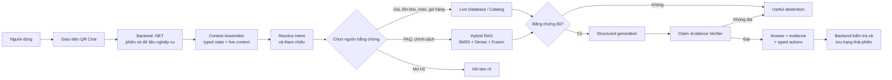
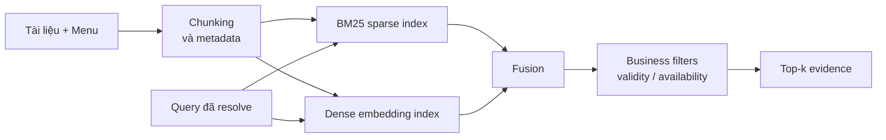
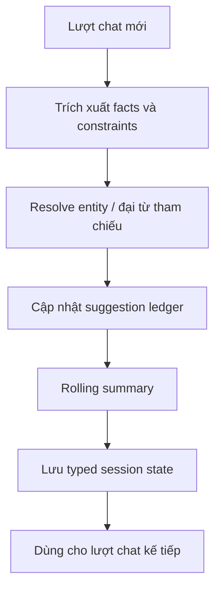
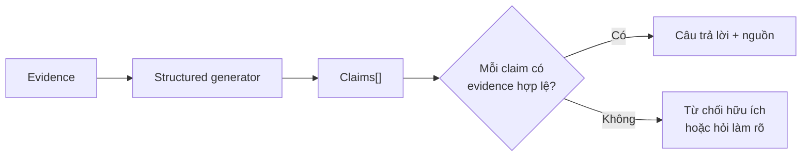

# BÁO CÁO TỔNG HỢP CÁC CÔNG VIỆC ĐÃ THỰC HIỆN VỚI HỆ THỐNG AI

> Dự án: **CMC Restaurant — QR Ordering & AI Chatbot**  
> Phạm vi: AI chatbot có ngữ cảnh, Retrieval-Augmented Generation (RAG), chống trả lời thiếu căn cứ, đánh giá thực nghiệm và tài liệu học thuật  
> Trạng thái tài liệu: tổng hợp theo mã nguồn và artifact hiện có trong worktree  
> Nguyên tắc báo cáo: chỉ ghi “đã đo” khi có artifact; nội dung chưa đo được đánh dấu riêng

---

## 1. Tóm tắt điều hành

Hệ thống ban đầu đã có chatbot, tìm kiếm kết hợp BM25 và dense retrieval, nhưng còn bốn vấn đề chính:

1. Mọi câu hỏi có nguy cơ bị đưa vào RAG mà chưa xác định đúng loại dữ liệu cần dùng.
2. Ngữ cảnh hội thoại chủ yếu dựa trên các lượt chat gần nhất, chưa có trạng thái phiên có cấu trúc.
3. Chưa có cơ chế kiểm tra từng phát biểu của mô hình với bằng chứng trước khi trả lời.
4. Một số chỉ số đánh giá dễ gây hiểu nhầm, đặc biệt khi chất lượng câu trả lời bị gộp với lỗi nhà cung cấp LLM hoặc khi dùng `composite_pass=100%` làm kết luận.

Phần nâng cấp đã chuyển hệ thống theo hướng **evidence-first**:

- Câu hỏi về giá, tình trạng bán, món ăn, giỏ hàng, dị ứng và dinh dưỡng ưu tiên dữ liệu trực tiếp.
- Câu hỏi FAQ/chính sách mới sử dụng Knowledge Base RAG.
- Câu hỏi mơ hồ phải được giải quyết tham chiếu hoặc hỏi lại.
- Câu trả lời được biểu diễn thành các claim có liên kết tới evidence.
- Khi thiếu bằng chứng, hệ thống từ chối hữu ích thay vì suy đoán.
- Trạng thái hội thoại được lưu bằng facts, constraints, entity IDs và rolling summary.
- Streaming và non-streaming dùng chung quy tắc lưu trạng thái.
- Retrieval, hội thoại nhiều lượt và LLM được đánh giá thành các lớp riêng.

Kết quả đã đo nổi bật:

- Hybrid E5 đạt **Hit@5 = 109/110 (99,09%)** và **nDCG@5 = 0,8332** trên tập dev đã chọn.
- Độ trễ retrieval release candidate: **p50 = 24,30 ms**, **p95 = 29,34 ms**, đo 7 lần cho mỗi truy vấn.
- Bộ kiểm tra hội thoại có **50 phiên × 12 lượt**, context checks đạt **1200/1200**, referent checks đạt **150/150**.
- So sánh LLM trên 18 trường hợp cho thấy cả GPT-5.5 và DeepSeek đều giữ grounding/schema trên 11 lần gọi thành công, nhưng chất lượng câu trả lời vẫn thấp; vì vậy chưa được phép kết luận hệ thống đã “không bịa”.

Quyết định hiện tại là **HOLD** đối với tuyên bố sẵn sàng phát hành AI v3. Hệ thống cần hoàn thành human evaluation, frozen test, calibration và đo SLO staging trước khi chuyển mặc định.

---

## 2. Kiến trúc sau khi nâng cấp



Điểm quan trọng của kiến trúc này là chatbot **không mặc định dùng RAG cho mọi câu hỏi**. Hệ thống xác định câu hỏi đang cần dữ liệu nghiệp vụ trực tiếp, tài liệu tri thức, phản hồi deterministic hay cần hỏi lại trước khi truy xuất.

---

## 3. Các công việc đã thực hiện

### 3.1. Chuẩn hóa dữ liệu và version hóa Knowledge Base

Đã bổ sung mô hình chunk có định danh ổn định, thay vì phụ thuộc vào tên file:

- `chunk_id`
- `document_id`
- `parent_id`
- `section_path`
- `content`
- `content_hash`
- `tags`
- `risk_tier`
- `valid_from`
- `valid_to`

Corpus hash hiện phản ánh nội dung, metadata và cấu hình chunking. Index manifest lưu thông tin phục vụ tái lập thí nghiệm, gồm:

- corpus hash;
- phiên bản model embedding;
- cấu hình chunking;
- seed;
- thời điểm tạo;
- thông tin môi trường/phần cứng;
- provenance của lần chạy.

Đã bổ sung kiểm thử parity để runtime và evaluation phải trả cùng `chunk_id` cho cùng truy vấn và cùng index.

Các tệp chính:

- `ai/app/rag/knowledge_base.py`
- `ai/app/rag/embedding_retriever.py`
- `ai/app/rag/hybrid_retriever.py`
- `ai/scripts/build_index.py`
- `ai/tests/test_knowledge_base_v2.py`
- `ai/tests/test_index_manifest_v2.py`
- `ai/tests/test_runtime_eval_retrieval_parity.py`

Quyết định kỹ thuật hiện tại: tiếp tục dùng index in-memory có version. Chưa thêm Qdrant vì quy mô hiện tại chưa chứng minh nhu cầu về cập nhật nóng, số lượng chunk lớn hoặc vi phạm giới hạn RAM/SLO.

### 3.2. Xây dựng retrieval theo hướng đo được và tái lập được

Pipeline retrieval được tổ chức thành các thành phần:



Các cấu hình nghiên cứu đã được chuẩn bị để so sánh BM25, dense encoder và hybrid retrieval. Release candidate hiện đo bằng:

- Dense encoder: `intfloat/multilingual-e5-small`
- Dung lượng encoder ước tính: 120 MB
- Kết hợp sparse + dense
- Có menu filters
- Chạy CPU

Đã sửa cách tổng hợp metric để:

- tách retrieval quality khỏi generation quality;
- ghi rõ numerator/denominator;
- ghi rõ split và số lượng mẫu;
- không dùng một chỉ số tổng hợp để che các lỗi faithfulness hoặc provider;
- phân biệt screening latency một lần đo với release-candidate latency nhiều lần đo.

### 3.3. Bổ sung hợp đồng Chat V2

`ChatRequestV2` đã được mở rộng để truyền:

- `contract_version`;
- nội dung câu hỏi;
- tối đa 12 lượt hội thoại gần nhất;
- facts và constraints đã biết;
- các entity đang được tham chiếu;
- ID món đã gợi ý, từ chối, chấp nhận hoặc thêm vào giỏ;
- rolling summary và memory version;
- live menu cùng `catalog_version`;
- giỏ hàng, đơn hiện tại và các dữ liệu nghiệp vụ liên quan.

`ChatResponseV2` đã bổ sung:

- `decision`: intent, route, confidence, evidence sufficiency, abstain reason;
- `evidence[]`: nguồn, ID dữ liệu và retrieval score;
- `claims[]`: nội dung claim, evidence IDs, trạng thái verification;
- typed cart actions;
- `session_updates`;
- guardrail flags;
- provider status;
- latency breakdown;
- pipeline version.

Các tệp AI chính:

- `ai/app/schemas.py`
- `ai/app/services/assistant.py`
- `ai/app/rag/query_rewriter.py`
- `ai/app/rag/conversation_policy.py`

Các tệp backend chính:

- `backend/Entities/ChatSession.cs`
- `backend/src/RestaurantQrAiOrdering.Api/Chat/ChatSessionStatePersistence.cs`
- `backend/src/RestaurantQrAiOrdering.Api/Chat/DbChatStore.cs`
- `backend/src/RestaurantQrAiOrdering.Api/Chat/ChatEndpoints.cs`
- `backend/src/RestaurantQrAiOrdering.Api/Chat/ChatStreamEndpoints.cs`
- `backend/src/RestaurantQrAiOrdering.Api/Data/Migrations/20260722162140_AddsChatTypedSessionState.cs`

### 3.4. Xây dựng bộ nhớ hội thoại theo phiên

Trạng thái hội thoại không còn chỉ là chuỗi tin nhắn. Hệ thống lưu:



Ví dụ trạng thái cần nhớ:

- số người;
- ngân sách;
- dị ứng và chế độ ăn;
- nhóm món mong muốn;
- món đã gợi ý;
- món người dùng đã từ chối;
- món đang được nói tới bởi “món đó”, “cái đó”;
- món đã thêm vào giỏ;
- tóm tắt các lượt cũ ngoài cửa sổ history.

Đã thống nhất cách cập nhật trạng thái giữa streaming và non-streaming để tránh tình trạng hai chế độ nhớ khác nhau hoặc gợi ý trùng món.

### 3.5. Routing theo nguồn bằng chứng

Đã tách các route chính:

| Loại câu hỏi | Route ưu tiên | Nguyên tắc |
|---|---|---|
| Chào hỏi, cảm ơn, small talk | Deterministic | Không gọi RAG |
| Giá, món đang bán, availability | Live data | Không lấy từ KB cũ |
| Giỏ hàng, hành động đặt món | Live data + typed action | Backend kiểm tra lại |
| Dị ứng, dinh dưỡng | Live data nghiêm ngặt | Thiếu trường thì fail closed |
| FAQ, chính sách nhà hàng | Knowledge Base RAG | Phải có evidence |
| “Món đó”, “còn món khác?” | Resolve context trước | Không retrieval bằng câu mơ hồ |
| Không xác định được đối tượng | Clarify | Hỏi người dùng làm rõ |

Đã tắt catalog fast path cho các thuộc tính mà catalog không có dữ liệu đáng tin cậy, ví dụ calorie, lượng đường hoặc thông tin dinh dưỡng chi tiết.

Các tệp chính:

- `ai/app/rag/menu_query_filters.py`
- `ai/app/rag/kb_info_fast_path.py`
- `ai/app/rag/menu_presence_fast_path.py`
- `ai/app/rag/policy_faq_fast_path.py`
- `ai/app/rag/conversation_policy.py`
- `ai/app/services/assistant.py`

### 3.6. Kiểm tra claim, guardrail và abstention

Đã thêm `claim_verifier` để kiểm tra claim với evidence trước khi trả câu cuối:



Quy tắc triển khai:

- factual claim phải trỏ được tới evidence;
- claim về dị ứng, dinh dưỡng và hành động đặt món dùng chế độ nghiêm ngặt;
- dữ liệu thiếu, hết hạn hoặc mâu thuẫn không được tự suy đoán;
- prompt injection từ người dùng hoặc từ Knowledge Base được đánh dấu bởi guardrail;
- output sai schema không được xem là câu trả lời hợp lệ;
- backend tiếp tục kiểm tra typed action trước khi thay đổi giỏ hàng.

Các tệp chính:

- `ai/app/rag/claim_verifier.py`
- `ai/app/rag/output_parser.py`
- `ai/app/rag/prompts.py`
- `ai/tests/test_claim_verifier.py`
- `ai/tests/test_prompt_injection_guardrail.py`
- `ai/tests/test_assistant_confidence_gate.py`

Lưu ý: đây là cơ chế **giảm nguy cơ hallucination**, không phải bằng chứng rằng mô hình “không bao giờ bịa”.

### 3.7. Chuẩn hóa provider LLM

Đã thay phần tích hợp cũ bằng router client dùng cấu hình thống nhất:

- `LLM_PROVIDER`
- `LLM_BASE_URL`
- `LLM_API_KEY`
- `LLM_MODEL`

Phía backend dùng `CHAT_AI_PROVIDER`. Các tên cấu hình cũ chỉ nên được hỗ trợ trong một giai đoạn chuyển tiếp kèm cảnh báo.

Đã bổ sung:

- router client;
- kiểm tra response/schema;
- provider observability;
- smoke script cho 9router;
- so sánh GPT-5.5 và DeepSeek trên cùng evidence, prompt và token budget.

Các tệp chính:

- `ai/app/clients/router.py`
- `ai/app/config.py`
- `ai/scripts/smoke_9router.py`
- `ai/tests/test_router_client.py`
- `ai/tests/test_router_config.py`
- `ai/tests/test_smoke_9router.py`

### 3.8. Bảo mật, cache và vận hành

Đã bổ sung hoặc chuẩn hóa:

- `AI_INTERNAL_TOKEN` cho endpoint nội bộ, bao gồm cache invalidation;
- cache key theo catalog/index/prompt/model version;
- readiness kiểm tra AI service, provider config và dependency liên quan;
- deploy smoke test bằng một truy vấn AI an toàn;
- staging đi qua CI tương tự production;
- metric route, evidence sufficiency, abstention, provider error, cache hit, latency và guardrail;
- nguyên tắc không log PII thô.

Các tệp liên quan:

- `ai/app/main.py`
- `ai/app/config.py`
- `ai/app/rag/response_cache.py`
- `backend/src/RestaurantQrAiOrdering.Api/Chat/ChatAiProvider.cs`
- `.github/workflows/ci.yml`
- `.github/workflows/deploy-staging.yml`
- `.github/workflows/deploy-production.yml`
- `deploy/scripts/health-check.sh`

Đã ghi nhận yêu cầu xoay khóa nếu `ai/.env` từng chứa chuỗi có hình thức giống credential thật. Tài liệu hoặc `.env.example` không được chứa secret hoạt động.

---

## 4. Chương trình đánh giá đã xây dựng

### 4.1. Retrieval evaluation

Đã xây dựng pipeline:

1. Chạy retrieval experiment.
2. Tính Hit@k, MRR@k, nDCG@k và forbidden-hit.
3. Tổng hợp theo method và family.
4. So sánh paired.
5. Tính bootstrap confidence interval và Holm-adjusted significance khi đủ cấu hình.
6. Xuất artifact có provenance.

Tệp chính:

- `ai/evaluation/run_retrieval_experiment.py`
- `ai/evaluation/summarize_retrieval_comparison.py`
- `ai/evaluation/merge_retrieval_artifacts.py`

### 4.2. Session evaluation

Đã xây dựng bộ đánh giá phiên dài để kiểm tra:

- facts và constraints còn được giữ sau nhiều lượt;
- tham chiếu “món đó/cái đó” được resolve;
- không gợi ý trùng các món đã đưa ra;
- typed action hợp lệ;
- dị ứng phải fail closed khi thiếu dữ liệu;
- rolling summary được tạo;
- history gửi sang AI không vượt giới hạn.

Tệp chính:

- `ai/evaluation/run_session_e2e_eval.py`
- `ai/tests/test_session_eval_v2.py`

### 4.3. Dual-LLM evaluation

Đã xây dựng protocol để GPT-5.5 và DeepSeek nhận:

- cùng câu hỏi;
- cùng evidence;
- cùng prompt;
- cùng giới hạn token;
- cùng tiêu chí chấm.

Đã tách:

- provider call rate;
- availability trên số lần thực sự gọi;
- grounding/schema trên nhóm thành công;
- quality trên nhóm thành công;
- latency;
- faithfulness;
- paired win/tie/loss.

Tệp chính:

- `ai/evaluation/run_dual_llm_eval.py`
- `ai/evaluation/dual_model_comparison.py`
- `ai/evaluation/results/dual_model/20260723-9router-paired-18-final/comparison.json`

---

## 5. Kết quả thực nghiệm hiện có

### 5.1. Retrieval release candidate

Nguồn: `ai/evaluation/results/dev_hybrid_e5_release_candidate.v1.json`

| Chỉ số | Kết quả |
|---|---:|
| Số truy vấn dev được chọn | 110 |
| Hit@1 | 98/110 = 89,09% |
| Hit@5 | 109/110 = 99,09% |
| Hit@10 | 110/110 = 100% |
| MRR@5 | 0,9367 |
| nDCG@5 | 0,8332 |
| Forbidden hit@10 | 0 |
| Latency p50 | 24,30 ms |
| Latency p95 | 29,34 ms |
| Số lần đo latency | 7 lần/truy vấn |

Diễn giải:

- Hit@5 vượt gate 95%.
- nDCG@5 vượt gate 0,75.
- Hit@10 = 100% không có nghĩa thứ hạng top đầu đã hoàn hảo; nDCG@5 mới phản ánh rõ hơn chất lượng sắp xếp.
- Đây là kết quả trên **dev**, không thay thế frozen test.
- Artifact ghi `frozen_test_opened = false`; chưa được phép dùng kết quả này như điểm test cuối cùng.

### 5.2. Corpus và dataset

| Thành phần | Quy mô hiện có |
|---|---:|
| Knowledge documents | 205 |
| Menu documents | 91 |
| Tổng evaluation corpus | 296 |
| Dev dataset ban đầu | 125 cases |
| Số family | 25 |
| Cases dùng trong release-candidate run | 110 |

Knowledge corpus hash và full evaluation corpus hash khác nhau theo thiết kế vì full corpus có thêm menu data.

### 5.3. Hội thoại theo phiên

Nguồn: `ai/evaluation/results/session_e2e_eval.json`

| Chỉ số | Kết quả |
|---|---:|
| Số phiên extended | 50 |
| Số lượt mỗi phiên | 12 |
| Context checks | 1200/1200 = 100% |
| Referent checks | 150/150 = 100% |
| Phiên không gợi ý trùng | 50/50 = 100% |
| Phiên có action hợp lệ | 50/50 = 100% |
| Allergy fail-closed | 50/50 = 100% |

Giới hạn diễn giải:

- Đây là các phiên **scripted/deterministic**.
- Kết quả chứng minh các invariant trong kịch bản kiểm thử, chưa chứng minh hiệu quả tương đương trên hội thoại tự do của người dùng thật.
- Artifact hiện có đúng 12 lượt/phiên, chưa phải 12–20 lượt như release gate dự kiến ban đầu.

### 5.4. So sánh GPT-5.5 và DeepSeek

Nguồn: `ai/evaluation/results/dual_model/20260723-9router-paired-18-final/comparison.json`

| Chỉ số | GPT-5.5 | DeepSeek |
|---|---:|---:|
| Tổng cases | 18 | 18 |
| Lần thực sự gọi provider | 11/18 | 11/18 |
| Availability trên lần gọi | 11/11 | 11/11 |
| Quality pass trên lần thành công | 2/11 | 3/11 |
| Grounding pass | 11/11 | 11/11 |
| Schema pass | 11/11 | 11/11 |
| Faithfulness trung bình | 0,3719 | 0,5707 |
| Latency p50 | 7.350,9 ms | 5.510,9 ms |
| Latency p95 | 11.883,8 ms | 8.239,9 ms |

Paired comparison trên 11 trường hợp cùng thành công:

- DeepSeek thắng quality: 1;
- GPT-5.5 thắng quality: 0;
- hòa: 10;
- chênh lệch faithfulness trung bình `GPT-5.5 - DeepSeek = -0,1988`.

Không nên kết luận DeepSeek tốt hơn tuyệt đối vì:

- mẫu chỉ có 18 cases;
- chỉ 11 cases thực sự gọi cả hai provider;
- quality được chấm tự động;
- chưa có human evaluation đủ lớn;
- chưa có confidence interval đủ mạnh cho kết luận tổng quát.

Kết quả quan trọng hơn là **quality pass hiện còn thấp ở cả hai model**, nên retrieval tốt chưa đồng nghĩa chatbot đã trả lời tốt.

---

## 6. Notebook và báo cáo đã tạo

### 6.1. Một notebook duy nhất

Notebook duy nhất:

- `ai/notebooks/rag_retrieval_research.ipynb`

Notebook được sinh tự động bằng:

- `ai/scripts/build_research_notebook.py`

Cấu trúc trình bày:

1. Bài toán và dữ liệu.
2. Retrieval-Augmented Generation.
3. Chatbot có ngữ cảnh theo phiên.
4. Thí nghiệm và kết quả.
5. Kết luận, giới hạn và hướng phát triển.

Nhịp trình bày của mỗi phần:

> Mục tiêu → nguyên lý → code thật → artifact thật → phân tích → quyết định

Trạng thái lần kiểm tra gần nhất:

- 104 cells;
- 45 code cells đã thực thi;
- 0 cell lỗi.

Notebook không tạo số minh họa. Artifact bắt buộc thiếu hoặc sai hash phải làm preflight thất bại; nội dung chưa đo phải hiển thị “Chưa đo”.

### 6.2. Hình trực quan kiến trúc (tĩnh)

SVG kiến trúc evidence-first nằm tại `docs/assets/ai-architecture/` (đã commit). Pipeline Word/report visuals đã gỡ; deliverable học phần duy nhất là notebook §15 charts + artifact JSON.

### 6.3. Báo cáo Word (đã gỡ)

Deliverable nghiên cứu: **`ai/notebooks/rag_retrieval_research.ipynb`** + JSON trong `ai/evaluation/results/`. Không duy trì `word_report` / `build_academic_report`.

---

## 7. Kiểm thử và xác minh đã thực hiện

Các nhóm test mới bao phủ:

- ChatRequestV2 và ChatResponseV2;
- tương thích contract cũ;
- streaming/non-streaming state parity;
- stable chunk ID và corpus hash;
- index manifest;
- runtime/evaluation retrieval parity;
- evidence routing;
- small talk không gọi RAG;
- live-data questions không dùng KB mù quáng;
- claim verification;
- prompt injection guardrail;
- response cache versioning;
- internal authentication và readiness;
- provider/router configuration;
- session evaluation;
- notebook structure và execution;
- figure manifest;
- Word report structure.

Kết quả lần kiểm tra gần nhất:

- AI test suite: **326 passed, 5 skipped** trong virtual environment chính.
- 5 test Word bị skip do environment đó không có `python-docx`.
- 5 Word tests đã chạy riêng và **đều passed** bằng bundled document runtime.
- Báo cáo Word đã được render tạm thành PDF 33 trang để kiểm tra trực quan; file PDF kiểm tra đã được xóa sau khi hoàn tất.

Các tệp test tiêu biểu:

- `ai/tests/test_chat_contract_v2.py`
- `ai/tests/test_evidence_routing_v2.py`
- `ai/tests/test_claim_verifier.py`
- `ai/tests/test_runtime_eval_retrieval_parity.py`
- `ai/tests/test_session_eval_v2.py`
- `ai/tests/test_research_notebook.py`
- `ai/tests/test_notebook_metrics.py`
- `ai/tests/test_research_notebook.py`

---

## 8. Những gì chưa được coi là hoàn thành

Các hạng mục dưới đây chưa có đủ bằng chứng để ghi là “đạt”:

1. Frozen test chưa được mở và chạy chính thức.
2. Chưa có human review 50–100 câu cho release hiện tại.
3. Chưa có tối thiểu 20% mẫu được hai người chấm để đo agreement.
4. Chưa đo calibration đầy đủ bằng reliability diagram, ECE và Brier score.
5. Chưa có risk–coverage curve để chọn ngưỡng abstention theo risk tier.
6. Chưa chạy đầy đủ chunking ablation: heading, fixed, hierarchical và semantic.
7. Chưa chạy full leave-one-component-out ablation.
8. Chưa có staging measurement đủ để xác nhận availability ≥ 99% và p95 end-to-end ≤ 6 giây.
9. Session evaluation chưa bao phủ hội thoại tự do 12–20 lượt của người thật.
10. Chưa chứng minh critical hallucination = 0 trên frozen release set.

Vì vậy, không sử dụng các câu khẳng định:

- “AI hoàn toàn không bịa”;
- “hệ thống đã đạt 90/100”;
- “production đã đạt SLO”;
- “DeepSeek chắc chắn tốt hơn GPT-5.5”.

Phát biểu đúng ở thời điểm hiện tại:

> Hệ thống đã có kiến trúc evidence-first, typed session memory, claim verification và useful abstention; retrieval dev đạt gate, nhưng chất lượng end-to-end và độ an toàn production vẫn cần frozen test, human review, calibration và staging validation.

---

## 9. Quyết định kỹ thuật có chủ đích

### Chưa dùng LangGraph

Luồng hiện tại có thể biểu diễn rõ bằng service và state machine. LangGraph chỉ nên được thêm khi cần:

- pause/resume workflow;
- nhiều tool có trạng thái;
- human approval giữa luồng;
- workflow dài, có checkpoint hoặc recovery phức tạp.

### Chưa dùng Qdrant

In-memory versioned index vẫn phù hợp với quy mô hiện tại. Chỉ cân nhắc Qdrant khi:

- vượt khoảng 10.000 chunks;
- cần cập nhật nóng thường xuyên;
- cần chia sẻ index giữa nhiều instance;
- RAM hoặc latency vi phạm SLO.

### Chưa đưa BGE-M3, HyDE và reranker nặng vào production

Các phương pháp này thuộc nhánh nghiên cứu. Chỉ đưa vào production khi vượt Pareto gate về:

- retrieval/generation quality;
- latency;
- RAM;
- độ ổn định;
- chi phí vận hành.

---

## 10. Lộ trình tiếp theo

### Giai đoạn 1 — Khóa dữ liệu và protocol

- Chốt corpus, chunk config, prompt và model revision.
- Kiểm tra hash và provenance.
- Đóng dev selection.
- Xác nhận frozen test chưa bị truy cập trong lúc chọn cấu hình.

### Giai đoạn 2 — Hoàn tất thí nghiệm còn thiếu

- Chunking comparison.
- BM25/BM25+/dense/hybrid/fusion/rerank comparison.
- Query rewrite, multi-query và HyDE ở research mode.
- Memory ablation.
- Routing ablation.
- Claim verifier và abstention ablation.

### Giai đoạn 3 — Calibration và safety

- Reliability diagram.
- ECE và Brier score.
- Risk–coverage curve.
- Chọn threshold theo intent và risk tier.
- Red-team prompt injection, stale data, conflict, timeout, typo, tiếng Việt không dấu và code-switching.

### Giai đoạn 4 — Human evaluation

- Chấm 50–100 câu.
- Ít nhất 20% được hai người chấm độc lập.
- Báo cáo agreement.
- Phân loại lỗi: retrieval miss, wrong route, unresolved reference, insufficient evidence, unsupported claim, stale data, provider/schema failure.

### Giai đoạn 5 — Frozen test và rollout

- Khóa code/config/corpus/decision rule.
- Mở frozen test đúng một lần.
- Đánh giá release gate.
- Chạy shadow mode.
- Canary bằng feature flag `AI_PIPELINE=v2|v3`.
- Theo dõi drift và rollback bằng feature flag khi cần.

---

## 11. Cách tái tạo notebook, báo cáo và test

Từ thư mục gốc dự án:

```powershell
cd ai
python -m pip install -r requirements-evaluation.txt
python scripts/build_research_notebook.py --execute
python scripts/build_research_notebook.py --regen-live --execute
python -m unittest discover -s tests
```

Các artifact quan trọng cần giữ nguyên:

- `ai/evaluation/results/dev_retrieval_summary.v3.json`
- `ai/evaluation/results/session_e2e_eval.json`
- `ai/evaluation/results/knowledge_manifest.json`
- `ai/evaluation/results/notebook_live_test.json`
- `ai/evaluation/results/dual_model_test.json`
- `ai/evaluation/results/notebook_retrieval_screening.json`

Nếu artifact bắt buộc bị thiếu hoặc hash không khớp, `build_research_notebook.py` validate phải dừng thay vì tự tạo số thay thế.

---

## 12. Kết luận

Phần nâng cấp quan trọng nhất không phải là thêm một mô hình lớn hơn, mà là thay đổi cách chatbot ra quyết định:

1. hiểu câu hỏi trong ngữ cảnh phiên;
2. xác định đúng nguồn dữ liệu;
3. resolve đối tượng đang được nói tới;
4. chỉ tạo claim từ evidence;
5. kiểm tra claim;
6. từ chối hoặc hỏi lại khi thiếu bằng chứng;
7. lưu trạng thái có cấu trúc cho lượt sau;
8. đánh giá từng lớp của hệ thống bằng artifact có provenance.

Retrieval hiện có kết quả dev tốt, và các invariant của phiên scripted đều đạt trong artifact hiện tại. Tuy nhiên, generation quality trên mẫu LLM nhỏ vẫn chưa đạt yêu cầu. Do đó, đóng góp thực tế của giai đoạn này là tạo được một nền tảng RAG/chatbot **đo được, kiểm tra được, có khả năng từ chối và không che giấu phần chưa đo**. Đây là nền tảng cần thiết để tiếp tục human evaluation, frozen test và rollout an toàn.

