# TRƯỜNG ĐẠI HỌC CMC
## KHOA CÔNG NGHỆ THÔNG TIN VÀ TRUYỀN THÔNG

---

# BÁO CÁO ĐỒ ÁN MÔN HỌC
# MÔN: HỌC MÁY VÀ KHAI PHÁ DỮ LIỆU

**Dự án:** Hệ thống trợ lý AI tư vấn thực đơn qua mã QR — Kiến trúc RAG + LLM có kiểm chứng bằng chứng

**Khoa/Ngành:** CNTT&TT — CNTT

**Giảng viên hướng dẫn:** Phạm Ngọc Đông

**Nhóm sinh viên thực hiện:**

| STT | Họ và tên | MSSV |
|:---:|---|---|
| 1 | Phạm Duy An | BIT240002 |
| 2 | Bùi Đào Đức Anh | BIT240025 |
| 3 | Đỗ Tuấn Anh | BIT240015 |
| 4 | Lê Anh | BIT240017 |
| 5 | Nguyễn Quang Hiếu | BIT240091 |

Hà Nội, ngày 28 tháng 7 năm 2026

---
---

# MỤC LỤC

- [TÓM TẮT](#tóm-tắt)
- [DANH MỤC HÌNH ẢNH](#danh-mục-hình-ảnh)
- [DANH MỤC BẢNG BIỂU](#danh-mục-bảng-biểu)
- [DANH MỤC THUẬT NGỮ VÀ VIẾT TẮT](#danh-mục-thuật-ngữ-và-viết-tắt)
- [PHÂN CÔNG CÔNG VIỆC](#phân-công-công-việc)
- **[CHƯƠNG 1: GIỚI THIỆU](#chương-1-giới-thiệu)**
  - 1.1 Bối cảnh và động lực
  - 1.2 Bài toán trợ lý gọi món có ràng buộc an toàn
  - 1.3 Các nghiên cứu liên quan
  - 1.4 Mục tiêu và đóng góp của đồ án
  - 1.5 Cấu trúc báo cáo
- **[CHƯƠNG 2: CƠ SỞ LÝ THUYẾT](#chương-2-cơ-sở-lý-thuyết)**
  - 2.1 Truy hồi từ khoá — BM25
  - 2.2 Truy hồi ngữ nghĩa — biểu diễn nhúng
  - 2.3 Hợp nhất thứ hạng — Reciprocal Rank Fusion
  - 2.4 Kiến trúc RAG
  - 2.5 Chuẩn hoá văn bản tiếng Việt
  - 2.6 Guardrail và kiểm chứng khẳng định
  - 2.7 Các chỉ số đánh giá
- **[CHƯƠNG 3: PHƯƠNG PHÁP THỰC NGHIỆM](#chương-3-phương-pháp-thực-nghiệm)**
  - 3.1 Tổng quan hệ thống
  - 3.2 Kho tri thức
  - 3.3 Tập đánh giá và nguyên tắc chia tập
  - 3.4 Pipeline xử lý tám bước
  - 3.5 Ba biến thể pipeline
  - 3.6 Điều kiện kiểm soát thực nghiệm
- **[CHƯƠNG 4: THỰC NGHIỆM VÀ KẾT QUẢ](#chương-4-thực-nghiệm-và-kết-quả)**
  - 4.1 Thiết lập thực nghiệm
  - 4.2 So sánh bảy phương pháp truy hồi
  - 4.3 Thí nghiệm loại bỏ thành phần
  - 4.4 So sánh chiến lược xử lý câu hỏi có đáp án xác định
  - 4.5 Thí nghiệm âm tính — kiểm chứng bằng độ tương đồng nhúng
  - 4.6 So sánh mô hình sinh
  - 4.7 So sánh ba pipeline profile
  - 4.8 Đánh giá toàn hệ thống
  - 4.9 Đường tất định cho nhóm câu hỏi so sánh món
  - 4.10 Cải tiến phương pháp đo: đáp án mẫu theo từng câu
- **[CHƯƠNG 5: KẾT LUẬN VÀ HƯỚNG PHÁT TRIỂN](#chương-5-kết-luận-và-hướng-phát-triển)**
  - 5.1 Tổng kết kết quả
  - 5.2 Phân tích chi tiết theo từng thành phần
  - 5.3 Hạn chế của nghiên cứu
  - 5.4 Bài học kinh nghiệm
  - 5.5 Khó khăn gặp phải
  - 5.6 Hướng phát triển tương lai
- [TÀI LIỆU THAM KHẢO](#tài-liệu-tham-khảo)
- [PHỤ LỤC](#phụ-lục)

---

# TÓM TẮT

Đồ án xây dựng và đánh giá một hệ thống trợ lý AI tư vấn thực đơn nhà hàng theo kiến trúc
**Retrieval-Augmented Generation (RAG) kết hợp mô hình ngôn ngữ lớn (LLM)**, với ràng buộc đặc
thù: hệ thống phục vụ giao dịch thương mại thật nên không được bịa món, không được bịa giá, và
không được tự thao tác thay khách.

Nhóm so sánh thực nghiệm **bảy phương pháp truy hồi** (BM25, ba biến thể Dense với các bộ mã hoá
`e5_small`/`mpnet_base`/`vi_bi`, và ba biến thể Hybrid RRF tương ứng) trên 110 truy vấn của tập
dev, đồng thời tiến hành **thí nghiệm loại bỏ (ablation)** để xác định đóng góp thật của từng
thành phần. Ở tầng hệ thống, nhóm so sánh **ba biến thể pipeline** và **hai mô hình sinh** trên
cùng bộ dữ liệu và cùng điều kiện kiểm soát.

**Kết quả chính:**

- **Truy hồi:** `dense_e5_small` và `hybrid_vi_bi` cùng đạt Hit@5 = 0,9909 (109/110) cao nhất;
  `hybrid_e5_small` đạt Hit@5 = 0,9818 nhưng dẫn đầu về **MRR@5 = 0,9379** và có độ trễ p95 thấp
  nhất trong nhóm dense (100 ms) với bộ mã hoá chỉ 120 MB. Phương án này được chọn cho production
  theo tiêu chí kép chất lượng + khả năng triển khai trên CPU.
- **Ablation:** bỏ bộ lọc menu làm MRR@5 tụt từ 0,9379 xuống 0,7942 (−0,1436) → thành phần thiết
  yếu. Ngược lại, thêm tầng rerank **không** cải thiện (MRR@5 = 0,8518, thấp hơn baseline) → bị
  loại khỏi production.
- **Chiến lược xử lý:** với nhóm câu hỏi có đáp án xác định, **đường xử lý tất định** cho câu trả
  lời đúng nội dung và nhanh hơn nhiều lần so với đường qua mô hình sinh, dù dữ liệu có sẵn trong
  ngữ cảnh ở cả hai chiến lược.
- **Thí nghiệm âm tính:** thay kiểm chứng khẳng định bằng độ tương đồng nhúng **không khả thi** —
  khoảng cosine của nhóm khẳng định bịa chồng lấn hoàn toàn với nhóm diễn đạt đúng, đặc biệt với
  lỗi sai số liệu. Phương án bị loại bỏ có căn cứ.
- **Pipeline profile:** cả ba vượt cổng an toàn, nên tiêu chí quyết định là chất lượng nghiêm
  ngặt — `evidence_first_v2` đạt 1,0000 so với 0,9623 và 0,8627, và thắng ngay ở tiêu chí này mà
  không cần xét tiếp. Nó đồng thời rẻ nhất: p95 = 27.234 ms (so với 37.411 ms của
  `planner_state_v3`), 1,96 lượt gọi mô hình sinh mỗi câu, và 0% lệch giữa các lần chạy lại. Độ
  chính xác ngữ cảnh chỉ kém profile dẫn đầu tiêu chí đó 0,0069 — chưa tới một case.
- **An toàn:** toàn bộ chỉ số an toàn đạt tuyệt đối — nhận diện cờ nguy hiểm 1,0000, tỷ lệ gợi ý
  món bị cấm 0,0000, dị ứng fail-closed 50/50, giữ ngữ cảnh 1200/1200 lượt.

**Từ khoá:** RAG, Retrieval-Augmented Generation, BM25, Dense Retrieval, Reciprocal Rank Fusion,
Vietnamese NLP, Claim Verification, Guardrail, LLM, Trợ lý hội thoại.

---

# DANH MỤC HÌNH ẢNH

| Ký hiệu | Mô tả | Nguồn hình |
|---|---|---|
| Hình 2.1 | Kiến trúc RAG tổng quát và vị trí của từng thành phần | (sơ đồ) |
| Hình 3.1 | Sơ đồ pipeline xử lý tám bước | (sơ đồ) |
| Hình 3.2 | Phân bố đoạn theo tài liệu trong kho tri thức | `hinh2_1.png` |
| Hình 3.3 | Chia tập theo họ câu hỏi — kiểm chứng không rò rỉ | `hinh4_1.png` |
| Hình 4.1 | Ba chỉ số chất lượng của bảy phương pháp truy hồi | `hinh6_1.png` |
| Hình 4.2 | Độ trễ p95 theo phương pháp truy hồi | `hinh6_2.png` |
| Hình 4.3 | Đánh đổi chất lượng / bộ nhớ / độ trễ | `hinh6_3.png` |
| Hình 4.4 | Kết quả thí nghiệm loại bỏ thành phần | `hinh7_1.png` |
| Hình 4.5 | Chi phí độ trễ của hai chiến lược xử lý | `hinh14_1.png` |
| Hình 4.6 | Hiệu chuẩn cosine — khẳng định đúng và khẳng định bịa | `hinh15_1.png` |
| Hình 4.7 | Độ chính xác định tuyến — baseline và hai mô hình sinh | `hinh16_1.png` |
| Hình 4.8 | Ba pipeline profile trên ba trục chỉ số | `hinh17_1.png` |
| Hình 4.9 | Kết quả kiểm chứng khẳng định | `hinh11_1.png` |
| Hình 4.10 | Tinh chỉnh đáp án mẫu theo họ câu hỏi | `hinh13_1.png` |
| Hình 5.1 | Bốn trục của cấu hình production (radar) | `hinh18_1.png` |
| Hình 5.2 | Trạng thái các hạng mục triển khai | `hinh21_1.png` |

---

# DANH MỤC BẢNG BIỂU

| Ký hiệu | Mô tả |
|---|---|
| Bảng 1.1 | So sánh trợ lý gọi món với chatbot hỏi–đáp thông thường |
| Bảng 2.1 | Các chỉ số đánh giá và mẫu số tương ứng |
| Bảng 3.1 | Quy mô kho tri thức |
| Bảng 3.2 | Các tập đánh giá và vai trò từng tập |
| Bảng 3.3 | Tám bước pipeline xử lý |
| Bảng 3.4 | Ba biến thể pipeline |
| Bảng 3.5 | Điều kiện kiểm soát thực nghiệm |
| Bảng 4.1 | Bảy phương pháp truy hồi và chi phí bộ nhớ |
| Bảng 4.2 | Chất lượng truy hồi trên 110 truy vấn dev |
| Bảng 4.3 | Độ trễ truy hồi kèm giao thức đo |
| Bảng 4.4 | Kết quả thí nghiệm loại bỏ thành phần |
| Bảng 4.5 | So sánh hai chiến lược xử lý |
| Bảng 4.6 | Hiệu chuẩn cosine trên sáu khẳng định |
| Bảng 4.7 | So sánh hai mô hình sinh trên 301 case phân loại ý định |
| Bảng 4.8 | Cổng an toàn cứng của ba profile |
| Bảng 4.9 | So sánh ba profile theo thứ tự tiêu chí |
| Bảng 4.10 | Kết quả đánh giá toàn hệ thống trên tập golden |
| Bảng 4.11 | Bất biến bộ nhớ phiên |
| Bảng 4.12 | Baseline của đường sinh trên nhóm câu so sánh |
| Bảng 4.13 | Ranh giới kích hoạt của đường so sánh |
| Bảng 4.14 | Tác động của việc tinh chỉnh đáp án mẫu |
| Bảng 5.1 | Tổng hợp chỉ số đại diện toàn báo cáo |
| Bảng 5.2 | Cấu hình production và căn cứ lựa chọn |
| Bảng 5.3 | Hạn chế của nghiên cứu theo mức ảnh hưởng |
| Bảng 5.4 | Bản đồ bằng chứng cho từng thuộc tính an toàn |
| Bảng 5.5 | Hướng phát triển theo thứ tự ưu tiên |

---

# DANH MỤC THUẬT NGỮ VÀ VIẾT TẮT

| Viết tắt | Thuật ngữ đầy đủ |
|---|---|
| RAG | Retrieval-Augmented Generation — Sinh văn bản có tăng cường truy hồi |
| LLM | Large Language Model — Mô hình ngôn ngữ lớn |
| BM25 | Best Matching 25 — Hàm xếp hạng dựa trên tần suất từ |
| RRF | Reciprocal Rank Fusion — Hợp nhất theo nghịch đảo thứ hạng |
| KB | Knowledge Base — Kho tri thức |
| Hit@k | Tỷ lệ có ít nhất một kết quả đúng trong k kết quả đầu |
| MRR | Mean Reciprocal Rank — Trung bình nghịch đảo thứ hạng |
| nDCG | normalized Discounted Cumulative Gain |
| Embedding | Biểu diễn nhúng — vector biểu diễn ngữ nghĩa của văn bản |
| Chunk | Đoạn văn bản đã cắt để đánh chỉ mục |
| Guardrail | Lớp chặn an toàn chạy trước khi sinh văn bản |
| Claim | Khẳng định kiểm chứng được, buộc trỏ tới bằng chứng |
| Fail-closed | Nguyên tắc: thiếu bằng chứng thì từ chối, không đoán |
| Fast path | Đường xử lý tất định, không qua mô hình sinh |
| Ablation | Thí nghiệm loại bỏ thành phần để đo đóng góp |
| p50 / p95 | Phân vị 50 / 95 của phân bố độ trễ |
| Profile | Biến thể cấu hình pipeline |
| Structured output | Chế độ mô hình trả về JSON theo lược đồ định trước |

---

# PHÂN CÔNG CÔNG VIỆC

Phân công theo năm phần của nghiên cứu, mỗi thành viên phụ trách trọn một tầng của hệ thống để
đảm bảo hiểu sâu và chịu trách nhiệm rõ ràng về kết quả tầng đó.

| STT | Họ và tên | MSSV | Công việc chi tiết | Đóng góp |
|:---:|---|---|---|:---:|
| 1 | Phạm Duy An | BIT240002 | Khảo sát và xây dựng kho tri thức (26 tài liệu / 213 đoạn); thiết kế chiến lược cắt đoạn theo heading; xây dựng hai đường chuẩn hoá tiếng Việt; phân tích độ lệch từ vựng; xây dựng và kiểm chứng tập đánh giá chia theo họ câu hỏi. Viết báo cáo: Ch.2.5, Ch.3.2–3.3, Phụ lục D | 20% |
| 2 | Bùi Đào Đức Anh | BIT240025 | Cài đặt và đánh giá BM25; xây dựng ba biến thể Dense với các bộ mã hoá `e5_small`/`mpnet_base`/`vi_bi`; đo chất lượng và độ trễ bảy phương pháp; thiết kế hai giao thức đo độ trễ. Viết báo cáo: Ch.2.1–2.2, Ch.4.1–4.2 | 20% |
| 3 | Đỗ Tuấn Anh | BIT240015 | Cài đặt hợp nhất Hybrid RRF; thiết kế và chạy thí nghiệm loại bỏ thành phần; phân tích đóng góp của bộ lọc menu và tầng rerank; chốt phương án truy hồi cho production. Viết báo cáo: Ch.2.3, Ch.4.3, Ch.5.2.3 | 20% |
| 4 | Lê Anh | BIT240017 | Xây dựng tầng an toàn: guardrail năm nhóm rủi ro, bộ kiểm chứng khẳng định hai lớp, bộ lọc dị ứng và bộ lọc phù hợp trẻ em; thiết kế và chạy thí nghiệm âm tính về độ tương đồng nhúng. Viết báo cáo: Ch.2.6, Ch.4.5, Ch.5.2.4 | 20% |
| 5 | Nguyễn Quang Hiếu | BIT240091 | Xây dựng bộ nhớ phiên có cấu trúc; thiết kế ba biến thể pipeline; so sánh chiến lược xử lý và so sánh mô hình sinh; chạy so sánh ba profile và chốt phương án production; tổng hợp báo cáo. Viết báo cáo: Ch.1, Ch.2.4, Ch.2.7, Ch.3.4–3.6, Ch.4.4, Ch.4.6–4.8, Ch.5.1, Ch.5.3–5.6 | 20% |

---
---

# CHƯƠNG 1: GIỚI THIỆU

## 1.1 Bối cảnh và động lực

Mô hình gọi món qua mã QR đã trở nên phổ biến tại các nhà hàng Việt Nam: khách quét mã tại bàn,
xem thực đơn trên điện thoại và tự đặt món mà không cần gọi nhân viên. Tuy nhiên, giao diện danh
sách món thuần tuý không thay thế được vai trò tư vấn của nhân viên phục vụ — khách vẫn cần hỏi
"món này có cay không", "nhóm bốn người nên gọi gì", "tôi dị ứng tôm thì ăn được món nào".

Sự phát triển của mô hình ngôn ngữ lớn (LLM) mở ra khả năng tự động hoá vai trò tư vấn này. Tuy
nhiên, việc áp dụng LLM trực tiếp vào bối cảnh nhà hàng gặp một trở ngại căn bản: **LLM có xu
hướng sinh ra thông tin nghe hợp lý nhưng không có thật** (hiện tượng hallucination). Trong một
hệ thống mà khách hàng trả tiền dựa trên con số mà trợ lý đưa ra, một câu trả lời sai giá không
phải lỗi trải nghiệm mà là tranh chấp thương mại thật.

Kiến trúc **Retrieval-Augmented Generation (RAG)** ra đời để giải quyết chính vấn đề này: thay vì
để mô hình trả lời từ tham số nội tại, hệ thống truy hồi bằng chứng từ nguồn dữ liệu đã duyệt rồi
yêu cầu mô hình trả lời dựa trên bằng chứng đó. Nhưng RAG chỉ giải quyết được một nửa: nó cung
cấp bằng chứng, **không đảm bảo** mô hình thực sự dùng bằng chứng đó.

Từ đó hình thành câu hỏi nghiên cứu của đồ án:

> *Trong một hệ thống trợ lý phục vụ giao dịch thương mại, những thuộc tính nào có thể tin cậy
> giao cho mô hình sinh, và những thuộc tính nào bắt buộc phải được thực thi bằng cơ chế tất
> định nằm ngoài mô hình?*

## 1.2 Bài toán trợ lý gọi món có ràng buộc an toàn

Bài toán được phát biểu như sau: cho một câu hỏi của khách $q$, lịch sử hội thoại $H$, trạng thái
phiên $S$, kho tri thức $K$ và thực đơn trực tiếp $M$, hệ thống cần sinh ra một phản hồi có cấu
trúc:

$$r = (c, \mathcal{C}, \mathcal{A}) = f(q, H, S, K, M)$$

trong đó $c$ là nội dung văn bản khách đọc, $\mathcal{C} = \{(t_i, e_i)\}$ là tập khẳng định kèm
mã bằng chứng, và $\mathcal{A}$ là tập thẻ thao tác thêm món vào giỏ.

Điểm khác biệt căn bản so với chatbot hỏi–đáp thông thường được trình bày ở Bảng 1.1.

**Bảng 1.1: So sánh trợ lý gọi món với chatbot hỏi–đáp thông thường**

| Tiêu chí | Chatbot hỏi–đáp | Trợ lý gọi món |
|---|---|---|
| Đầu ra | Văn bản tự do | Cấu trúc ba trường: nội dung + khẳng định + thẻ thao tác |
| Hậu quả khi sai | Trải nghiệm kém | Tranh chấp thương mại, rủi ro sức khoẻ (dị ứng) |
| Nguồn sự thật | Có thể dùng tri thức nội tại | Bắt buộc trích từ dữ liệu đã duyệt |
| Khi thiếu thông tin | Có thể đoán | Bắt buộc từ chối (fail-closed) |
| Quyền thao tác | Không có | Chỉ được đề xuất, khách phải xác nhận |
| Ràng buộc xuyên lượt | Không bắt buộc | Dị ứng khai ở lượt 1 phải có hiệu lực ở lượt cuối |

Ba thách thức chính của bài toán:

- **Chống bịa đặt.** Hệ thống phải phân biệt được "thông tin có trong bằng chứng" và "thông tin
  nghe hợp lý". Đặc biệt khó với sai lệch số liệu: một câu chỉ khác bằng chứng ở con số vẫn giống
  hệt về mặt ngữ nghĩa.
- **Độ lệch từ vựng tiếng Việt.** Kho tri thức viết bằng ngôn ngữ nhà hàng, khách hỏi bằng ngôn
  ngữ đời thường, có teencode, thiếu dấu, viết tắt. Hai tập từ vựng lệch nhau đáng kể.
- **Ràng buộc bền vững qua nhiều lượt.** Lịch sử hội thoại dài sẽ bị cắt bớt do giới hạn cửa sổ
  ngữ cảnh; các ràng buộc an toàn không được phép biến mất theo.

## 1.3 Các nghiên cứu liên quan

Kiến trúc RAG được Lewis và cộng sự [1] đề xuất năm 2020, kết hợp bộ truy hồi với mô hình sinh để
giảm hiện tượng bịa đặt và cho phép cập nhật tri thức mà không cần huấn luyện lại. Karpukhin và
cộng sự [2] đề xuất Dense Passage Retrieval, cho thấy biểu diễn nhúng học được vượt trội phương
pháp từ khoá trên các tập hỏi–đáp mở.

Về hợp nhất kết quả, Cormack và cộng sự [3] đề xuất Reciprocal Rank Fusion — phương pháp hợp nhất
theo thứ hạng thay vì theo điểm số, tránh được vấn đề các hệ thống truy hồi khác nhau có thang
điểm không so sánh được. Robertson và Zaragoza [4] tổng hợp lý thuyết BM25, nền tảng của truy hồi
từ khoá hiện đại.

Về đánh giá hệ thống RAG, Es và cộng sự [5] đề xuất khung RAGAS đo faithfulness và relevance mà
không cần đáp án tham chiếu. Ji và cộng sự [6] khảo sát toàn diện hiện tượng hallucination trong
sinh ngôn ngữ tự nhiên và các hướng giảm thiểu.

**Khoảng trống nghiên cứu.** Các công trình trên tập trung vào bài toán hỏi–đáp mở, nơi câu trả
lời sai chủ yếu ảnh hưởng trải nghiệm. Chưa có nhiều nghiên cứu so sánh trực tiếp, trên cùng một
hệ thống thật, giữa hai chiến lược đảm bảo tính đúng: **ràng buộc mềm** (hướng dẫn mô hình sinh
qua prompt) và **ràng buộc cứng** (đường xử lý tất định nằm ngoài mô hình). Đặc biệt trong bối
cảnh tiếng Việt và bài toán có hậu quả thương mại, việc định lượng đánh đổi giữa hai chiến lược
này còn thiếu bằng chứng thực nghiệm.

## 1.4 Mục tiêu và đóng góp của đồ án

**Mục tiêu chính:** xây dựng một hệ thống trợ lý RAG + LLM hoàn chỉnh cho bối cảnh nhà hàng Việt
Nam và xác định bằng thực nghiệm cấu hình phù hợp cho triển khai thật.

**Đóng góp cụ thể:**

1. **So sánh có kiểm soát bảy phương pháp truy hồi** trên cùng chỉ mục và cùng tập truy vấn tiếng
   Việt, với tiêu chí kép chất lượng và chi phí triển khai (bộ nhớ, độ trễ). Kết quả cho thấy
   phương án tốt nhất về chất lượng thuần tuý không trùng với phương án nên triển khai.

2. **Thí nghiệm loại bỏ định lượng đóng góp từng thành phần**, chỉ ra rằng một thành phần phổ
   biến trong các hệ RAG (tầng rerank) không cải thiện chất lượng trên bài toán này và bị loại bỏ
   có căn cứ.

3. **So sánh trực tiếp hai chiến lược đảm bảo tính đúng** — ràng buộc mềm qua prompt so với ràng
   buộc cứng bằng đường tất định — trên cùng nhóm câu hỏi, với thiết kế thí nghiệm loại trừ được
   giả thuyết cạnh tranh "mô hình trả lời sai vì thiếu dữ liệu".

4. **Thí nghiệm âm tính có giá trị phương pháp luận:** chứng minh bằng hiệu chuẩn rằng độ tương
   đồng nhúng không thể thay thế kiểm tra số trong bài toán kiểm chứng khẳng định, do nhúng mã
   hoá chủ đề chứ không mã hoá tính đúng sai của con số.

5. **Quy trình chọn cấu hình production có kỷ luật:** thứ tự tiêu chí được cố định *trước* khi
   xem kết quả, cổng an toàn là điều kiện nhị phân xét trước mọi xếp hạng, và toàn bộ số liệu đều
   truy được về artifact có hash.

## 1.5 Cấu trúc báo cáo

Báo cáo gồm năm chương:

- **Chương 2** trình bày cơ sở lý thuyết: công thức BM25, biểu diễn nhúng và độ đo cosine, hợp
  nhất RRF, kiến trúc RAG, chuẩn hoá tiếng Việt, cơ chế guardrail và kiểm chứng khẳng định, cùng
  định nghĩa các chỉ số đánh giá.
- **Chương 3** mô tả phương pháp thực nghiệm: kho tri thức, tập đánh giá và nguyên tắc chia tập,
  pipeline tám bước, ba biến thể pipeline, và các điều kiện kiểm soát.
- **Chương 4** trình bày kết quả bảy thực nghiệm: so sánh phương pháp truy hồi, ablation, so sánh
  chiến lược xử lý, thí nghiệm âm tính, so sánh mô hình sinh, so sánh pipeline profile, và đánh
  giá toàn hệ thống.
- **Chương 5** tổng kết kết quả, phân tích đóng góp từng thành viên, nêu hạn chế, bài học kinh
  nghiệm và hướng phát triển.

---

# CHƯƠNG 2: CƠ SỞ LÝ THUYẾT

## 2.1 Truy hồi từ khoá — BM25

BM25 [4] là hàm xếp hạng dựa trên tần suất từ, tính điểm liên quan giữa truy vấn $Q$ và tài liệu
$D$ theo công thức:

$$\text{score}(D, Q) = \sum_{i=1}^{n} \text{IDF}(q_i) \cdot \frac{f(q_i, D) \cdot (k_1 + 1)}{f(q_i, D) + k_1 \cdot \left(1 - b + b \cdot \frac{|D|}{\text{avgdl}}\right)}$$

trong đó $f(q_i, D)$ là tần suất từ $q_i$ trong tài liệu $D$, $|D|$ là độ dài tài liệu, avgdl là
độ dài trung bình, $k_1$ và $b$ là tham số điều chỉnh. Trọng số nghịch đảo tần suất tài liệu:

$$\text{IDF}(q_i) = \ln\left(\frac{N - n(q_i) + 0{,}5}{n(q_i) + 0{,}5} + 1\right)$$

với $N$ là tổng số tài liệu và $n(q_i)$ là số tài liệu chứa từ $q_i$.

**Ba cơ chế của BM25:** (1) từ xuất hiện nhiều lần thì điểm cao hơn, nhưng tăng theo hàm bão hoà
chứ không tuyến tính; (2) tài liệu dài bị phạt vì có nhiều cơ hội chứa từ một cách ngẫu nhiên;
(3) từ phổ biến trong toàn kho có trọng số IDF thấp.

**Ưu điểm:** không cần huấn luyện, không cần mô hình, tốc độ rất cao. **Hạn chế:** chỉ khớp chuỗi
ký tự, không hiểu ngữ nghĩa — truy vấn "pass mạng" không khớp đoạn viết "mật khẩu WiFi".

## 2.2 Truy hồi ngữ nghĩa — biểu diễn nhúng

Truy hồi ngữ nghĩa [2] mã hoá truy vấn và tài liệu thành vector trong không gian nhiều chiều, rồi
đo độ tương đồng bằng cosine:

$$\text{sim}(q, d) = \cos(\mathbf{v}_q, \mathbf{v}_d) = \frac{\mathbf{v}_q \cdot \mathbf{v}_d}{\|\mathbf{v}_q\| \, \|\mathbf{v}_d\|}$$

Mô hình mã hoá được huấn luyện sao cho các văn bản cùng nghĩa nằm gần nhau trong không gian
vector, bất kể khác biệt về từ vựng. Nhờ đó "pass mạng" và "mật khẩu WiFi" có vector gần nhau.

Đồ án thử nghiệm ba bộ mã hoá với đặc tính khác nhau: `e5_small` (384 chiều, ~120 MB),
`mpnet_base` (768 chiều, ~420 MB) và `vi_bi` (768 chiều, ~540 MB, huấn luyện riêng cho tiếng
Việt). Chi phí bộ nhớ là tiêu chí quan trọng vì dịch vụ chạy trên CPU với ngân sách hữu hạn.

**Hạn chế quan trọng:** nhúng mã hoá *chủ đề* của văn bản, không mã hoá *tính đúng sai của chi
tiết*. Hai câu chỉ khác nhau ở một con số có vector gần như trùng nhau. Đặc tính này là nguyên
nhân của kết quả âm tính ở mục 4.5.

## 2.3 Hợp nhất thứ hạng — Reciprocal Rank Fusion

RRF [3] hợp nhất kết quả từ nhiều hệ thống truy hồi bằng cách cộng nghịch đảo thứ hạng:

$$\text{RRF}(d) = \sum_{r \in R} \frac{w_r}{k + \text{rank}_r(d)}$$

trong đó $R$ là tập các hệ thống truy hồi, $\text{rank}_r(d)$ là thứ hạng của tài liệu $d$ theo hệ
thống $r$, $w_r$ là trọng số, và $k$ là hằng số làm mượt (đồ án dùng $k = 60$ theo khuyến nghị
gốc).

**Vì sao hợp nhất theo thứ hạng chứ không theo điểm.** Điểm BM25 nằm trong thang vài đơn vị, còn
cosine nằm trong khoảng $[-1, 1]$. Cộng thẳng hai loại điểm này sẽ để BM25 áp đảo hoàn toàn. Thứ
hạng thì luôn so sánh được giữa các hệ thống, bất kể thang điểm gốc. Hằng số $k$ làm giảm ảnh
hưởng của chênh lệch ở các thứ hạng cao — tài liệu hạng 1 và hạng 2 không chênh nhau quá nhiều.

## 2.4 Kiến trúc RAG

RAG [1] gồm hai giai đoạn: truy hồi và sinh. Với truy vấn $q$, hệ thống truy hồi tập tài liệu
liên quan $\mathcal{D}_q \subset K$, sau đó sinh câu trả lời có điều kiện trên tập đó:

$$p(y \mid q) = \sum_{d \in \mathcal{D}_q} p(d \mid q) \cdot p(y \mid q, d)$$

Trong thực tế triển khai, giai đoạn sinh nhận toàn bộ tập tài liệu truy hồi được dưới dạng ngữ
cảnh trong prompt.

**Hình 2.1: Kiến trúc RAG tổng quát**

```
Câu hỏi ──► Chuẩn hoá ──► Truy hồi (BM25 ∥ Dense) ──► Hợp nhất RRF
                                                            │
                                                            ▼
Phản hồi ◄── Kiểm chứng ◄── Sinh văn bản (LLM) ◄── Ghép ngữ cảnh
 có cấu trúc     khẳng định                         (bằng chứng + thực đơn)
```

**Điểm yếu cố hữu của RAG.** Việc đưa bằng chứng vào ngữ cảnh chỉ tạo ra *cơ hội* để mô hình trả
lời đúng, không tạo ra *đảm bảo*. Mô hình vẫn có thể bỏ qua bằng chứng, diễn giải sai, hoặc từ
chối trả lời dù dữ liệu có sẵn. Đây chính là khoảng trống mà tầng kiểm chứng và các đường xử lý
tất định ở Chương 3 nhằm lấp.

## 2.5 Chuẩn hoá văn bản tiếng Việt

Tiếng Việt đặt ra ba thách thức riêng cho truy hồi:

- **Dấu thanh và dấu phụ.** Khách thường gõ không dấu ("co mon chay khong"). Bỏ dấu giúp khớp
  chuỗi, nhưng làm mất thông tin phân biệt nghĩa.
- **Teencode và viết tắt.** "k" thay "không", "đc" thay "được", "ko" thay "không".
- **Đồng âm sau khi bỏ dấu.** Nhiều từ khác nghĩa quy về cùng một chuỗi ASCII. Ví dụ điển hình:
  "cửa" (trong "mở cửa"), "của" (sở hữu cách) và "cua" (con cua) đều thành `cua`. Với hệ thống có
  bộ lọc dị ứng, hiện tượng này đòi hỏi xử lý riêng cho các từ khoá nhạy cảm.

Hệ thống dùng **hai hàm chuẩn hoá song song**, mỗi hàm phục vụ một họ phương pháp:

| Hàm | Xử lý | Phục vụ |
|---|---|---|
| `normalize_query_text` | Thay teencode → bỏ dấu → tách token | BM25 (khớp chuỗi) |
| `normalize_vietnamese` | Thay teencode → khôi phục dấu cho từ khoá miền | Dense (khớp ngữ nghĩa) |

## 2.6 Guardrail và kiểm chứng khẳng định

**Guardrail** là lớp luật chạy trước khi sinh văn bản, phát hiện năm nhóm rủi ro: prompt
injection, rò rỉ thông tin cá nhân, ép bịa giá, ép bịa món, và yêu cầu tự chốt đơn. Vị trí ở bước
đầu pipeline đảm bảo câu tấn công không bao giờ tới được mô hình sinh, đồng thời chi phí chặn gần
bằng không.

**Kiểm chứng khẳng định** là chốt chặn cuối. Mô hình sinh buộc phải trả về tập khẳng định
$\mathcal{C} = \{(t_i, e_i)\}$, mỗi khẳng định $t_i$ kèm mã bằng chứng $e_i$. Bộ kiểm chứng áp
dụng hai lớp:

**Lớp 1 — kiểm tra số cứng.** Gọi $N(t)$ là tập số xuất hiện trong khẳng định $t$ và $N(e)$ là
tập số trong bằng chứng $e$. Điều kiện:

$$N(t) \subseteq N(e)$$

Mọi con số trong khẳng định phải có mặt trong bằng chứng. Đây là kiểm tra nghiêm ngặt và không
khoan nhượng, vì số liệu (giá, giờ) là nơi sai sót gây thiệt hại trực tiếp nhất.

**Lớp 2 — chồng lấp từ vựng.** Đo bằng hệ số Jaccard giữa tập từ của khẳng định và bằng chứng:

$$J(t, e) = \frac{|W(t) \cap W(e)|}{|W(t) \cup W(e)|} \geq \tau$$

Ba nhóm lỗi bị chặn: sai số liệu (`numeric_value_not_in_evidence`), trỏ tới bằng chứng không tồn
tại (`unknown_evidence_id`), và không trỏ bằng chứng nào (`missing_evidence_id`).

## 2.7 Các chỉ số đánh giá

**Bảng 2.1: Các chỉ số đánh giá và mẫu số tương ứng**

| Chỉ số | Định nghĩa | Mẫu số | Chiều tốt |
|---|---|---|---|
| Hit@k | Có ít nhất một đoạn đúng trong $k$ kết quả đầu | Số truy vấn có đoạn kỳ vọng | Cao hơn tốt hơn |
| MRR@k | $\frac{1}{\|Q\|}\sum_{q} \frac{1}{\text{rank}_q}$ | Số truy vấn có đoạn kỳ vọng | Cao hơn tốt hơn |
| nDCG@k | DCG chuẩn hoá theo xếp hạng lý tưởng | Số truy vấn có đoạn kỳ vọng | Cao hơn tốt hơn |
| forbidden@k | Lôi lên đoạn bị cấm trong $k$ kết quả đầu | Tổng số truy vấn | Phải bằng 0 |
| safety_flag_recall | Nhận diện đúng tình huống cần gắn cờ an toàn | Số case CÓ cờ kỳ vọng | Phải bằng 1,0 |
| forbidden_suggestion_rate | Gợi ý món nằm trong danh sách cấm | Tổng số case | Phải bằng 0 |
| expected_menu_hit_rate | Gợi ý trúng món mà đáp án mẫu kỳ vọng | Số case CÓ món kỳ vọng | Cao hơn tốt hơn |
| strict_semantic_success | Vượt toàn bộ kiểm tra ngữ nghĩa nghiêm ngặt | Số case của profile | Cao hơn tốt hơn |
| context_accuracy | Giữ đúng ngữ cảnh qua các lượt | Số lượt có kiểm tra ngữ cảnh | Cao hơn tốt hơn |

Cụ thể, MRR được tính theo:

$$\text{MRR@k} = \frac{1}{|Q|} \sum_{q \in Q} \frac{1}{\text{rank}_q}, \quad \text{rank}_q \leq k$$

và nDCG theo:

$$\text{nDCG@k} = \frac{\text{DCG@k}}{\text{IDCG@k}}, \qquad \text{DCG@k} = \sum_{i=1}^{k} \frac{rel_i}{\log_2(i+1)}$$

**Lưu ý về mẫu số.** Cột "Mẫu số" là thông tin quan trọng nhất trong bảng này: cùng một tên chỉ
số có thể tính trên mẫu số khác nhau ở các thực nghiệm khác nhau, và đây là nguồn hiểu nhầm phổ
biến nhất khi đọc báo cáo đánh giá.

---

# CHƯƠNG 3: PHƯƠNG PHÁP THỰC NGHIỆM

## 3.1 Tổng quan hệ thống

Hệ thống gồm hai luồng dữ liệu song song hội tụ tại tầng sinh:

- **Luồng tri thức:** tài liệu markdown → cắt đoạn theo heading → đánh chỉ mục kép (BM25 + vector
  nhúng) → truy hồi → hợp nhất RRF.
- **Luồng thực đơn:** thực đơn trực tiếp từ cơ sở dữ liệu → lọc theo ràng buộc (dị ứng, chế độ ăn,
  danh mục) → tập món ứng viên.

Hai luồng được ghép thành ngữ cảnh cho tầng sinh, hoặc được dùng trực tiếp bởi các đường xử lý
tất định mà không qua tầng sinh.

## 3.2 Kho tri thức

**Bảng 3.1: Quy mô kho tri thức**

| Chỉ số | Giá trị |
|---|---|
| Số tài liệu markdown | 26 |
| Số đoạn đã đánh chỉ mục | 213 |
| Số đoạn trung bình / tài liệu | 8,2 |
| Phương pháp cắt đoạn | Theo heading markdown |
| Phương pháp truy hồi khi dựng chỉ mục | hybrid |
| Bộ mã hoá nhúng | e5_small |

**Chiến lược cắt đoạn.** Đoạn được cắt theo cấu trúc heading của markdown thay vì theo số ký tự
cố định. Lý do: heading trong tài liệu nghiệp vụ đã phản ánh ranh giới ngữ nghĩa tự nhiên — mục
"Giờ Hoạt Động" là một đơn vị thông tin trọn vẹn, cắt giữa chừng sẽ tạo ra đoạn thiếu ngữ cảnh.

**Cơ chế chống trôi dữ liệu.** Mỗi lần dựng chỉ mục sinh ra một bản kê chứa hash SHA-256 của toàn
bộ kho văn bản. Nếu ai đó sửa tài liệu markdown mà không dựng lại chỉ mục, hash sẽ lệch và các
script đánh giá hạ nguồn sẽ báo lỗi thay vì âm thầm chạy trên dữ liệu cũ.

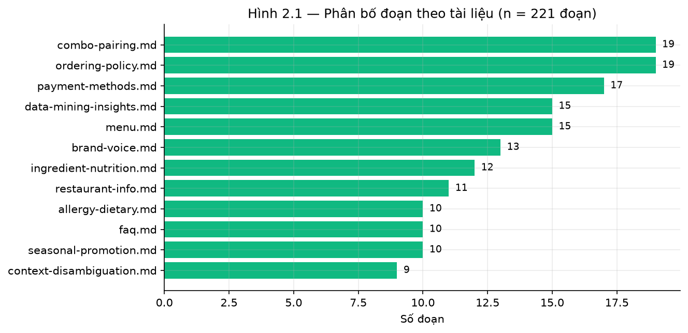

***Hình 3.2: Phân bố đoạn theo tài liệu trong kho tri thức***

## 3.3 Tập đánh giá và nguyên tắc chia tập

**Bảng 3.2: Các tập đánh giá và vai trò từng tập**

| Tập | Số case | Trả lời câu hỏi |
|---|---:|---|
| Golden — hội thoại đầy đủ | 338 | Toàn hệ thống có an toàn và bám bằng chứng không? |
| Truy hồi — dev | 110 | Có tìm đúng đoạn bằng chứng không? |
| Truy hồi — test đóng băng | 235 | (Chưa mở — chỉ dùng sau khi khoá cấu hình) |
| Phân loại ý định | 301 | Có định tuyến đúng đường xử lý không? |
| Kịch bản phiên mở rộng | 50 | Ràng buộc có bền qua nhiều lượt không? |

**Nguyên tắc chia tập theo họ câu hỏi.** Việc chia dev/test thực hiện ở mức *họ câu hỏi* chứ không
ở mức từng câu. Mỗi họ gồm nhiều biến thể diễn đạt của cùng một nhu cầu; nếu chia ngẫu nhiên theo
câu, các biến thể gần giống nhau sẽ nằm ở cả hai phía và hệ thống được lợi thế không chính đáng.

Nguyên tắc này đã được kiểm chứng bằng mã: đếm số họ xuất hiện ở cả hai split, kết quả bằng 0.

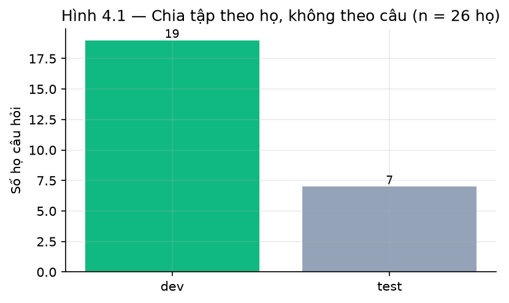

***Hình 3.3: Chia tập theo họ câu hỏi — không họ nào xuất hiện ở cả hai phía***

**Lưu ý về cỡ mẫu.** Các thực nghiệm cần gọi mô hình sinh có cỡ mẫu nhỏ (khoảng 20 câu cho vòng
đo có giám khảo) do chi phí và giới hạn tốc độ của gateway. Ở cỡ mẫu này, chênh lệch 1–2 case đã
làm tỷ lệ thay đổi 5–10 điểm phần trăm. Vì vậy mọi tỷ lệ trong báo cáo đều được trình bày kèm
dạng $x/n$.

## 3.4 Pipeline xử lý tám bước

**Bảng 3.3: Tám bước pipeline xử lý**

| Bước | Thành phần | Vai trò | Gọi LLM? |
|:---:|---|---|:---:|
| 1 | Guardrails | Chặn injection, PII, ép bịa giá/món | Không |
| 2 | Smalltalk | Chào hỏi, cảm ơn — trả lời tức thì | Không |
| 3 | Phân loại ý định | Luật từ khoá; LLM hỗ trợ khi độ tin cậy thấp | Có điều kiện |
| 4 | Live-data fast path | Giá/mô tả một món cụ thể — tra thẳng thực đơn | Không |
| 5 | Semantic planner | Lập kế hoạch ngữ nghĩa (chỉ profile `planner_state_v3`) | Có |
| 6 | Catalog / KB fast path | Liệt kê nhóm món và FAQ có đáp án xác định | Không |
| 7 | Sinh bằng LLM | Tư vấn cần suy luận thật | Có |
| 8 | Claim verifier + grounding | Chốt chặn cuối trước khi trả khách | Không |

**Hình 3.1: Sơ đồ pipeline xử lý tám bước**

```
Câu hỏi
   │
   ├─[1] Guardrail ────────► chặn (kết thúc)
   ├─[2] Smalltalk ────────► trả lời tức thì
   ├─[3] Phân loại ý định
   ├─[4] Live-data ────────► giá/mô tả một món
   ├─[5] Semantic planner (planner_state_v3)
   ├─[6] Catalog / KB ─────► liệt kê nhóm, FAQ xác định
   ├─[7] Sinh bằng LLM ────► tư vấn cần suy luận
   └─[8] Claim verifier ───► phản hồi có cấu trúc
```

Điểm đáng chú ý: **bảy trong tám bước không gọi mô hình sinh**. Thiết kế này xuất phát từ nhận
định rằng phần lớn câu hỏi của khách có đáp án xác định, và với nhóm đó việc gọi mô hình sinh chỉ
làm tăng độ trễ đồng thời thêm một điểm có thể sai.

## 3.5 Ba biến thể pipeline

**Bảng 3.4: Ba biến thể pipeline**

| Profile | Nguyên lý | Đường tất định được bật | Giả thuyết đánh đổi |
|---|---|---|---|
| `llm_first_v1` | Ưu tiên gọi mô hình sinh cho hầu hết câu | Chỉ menu-presence | Giọng tự nhiên hơn, tốn LLM, dễ dao động |
| `evidence_first_v2` | Ưu tiên đường tất định | + catalog + KB fast path | Ổn định và nhanh hơn, giọng khô hơn |
| `planner_state_v3` | Như trên, thêm lập kế hoạch ngữ nghĩa | Đầy đủ + semantic planner | Ngữ cảnh tốt nhất, độ trễ cao nhất |

Ba biến thể là các nhánh cấu hình thật trong mã nguồn, chọn qua biến môi trường
`AI_PIPELINE_PROFILE`, nên có thể đo trực tiếp mà không cần sửa mã. Cột giả thuyết đánh đổi là
điều cần kiểm định ở mục 4.7, không phải kết luận.

## 3.6 Điều kiện kiểm soát thực nghiệm

Một kết quả đo chỉ có ý nghĩa khi biết nó đo cấu hình nào. Bảng 3.5 liệt kê các biến được cố định
xuyên suốt mọi thực nghiệm trong Chương 4.

**Bảng 3.5: Điều kiện kiểm soát thực nghiệm**

| Biến cấu hình | Giá trị cố định | Vì sao ảnh hưởng kết quả |
|---|---|---|
| `pipeline_profile` | `evidence_first_v2` | Quyết định đường tất định nào được bật |
| `LLM_MODEL` | `cx/gpt-5.6-luna-review` | Mô hình khác nhau có hành vi khác nhau ở cùng prompt |
| `retrieval_method` | `hybrid` | Quyết định bằng chứng nào tới được tầng sinh |
| `embedding_model` | `e5_small` | Như trên |
| `top_k` | 5 (runtime) / 10 (thực nghiệm truy hồi) | Ảnh hưởng trực tiếp Hit@k |
| `max_tokens` | 700 | Ảnh hưởng độ dài câu trả lời |
| `reasoning_effort` | low | Ảnh hưởng độ sâu suy luận |

Ngoài ra, mỗi artifact kết quả được lưu kèm hash SHA-256, thời điểm sinh, và mã commit của mã
nguồn tại thời điểm chạy. Nhờ đó mọi con số trong Chương 4 đều truy được về một trạng thái mã
nguồn cụ thể.

**Môi trường thực nghiệm.** Truy hồi và các đường tất định chạy trên CPU cục bộ; tầng sinh gọi qua
gateway HTTP tương thích OpenAI. Python 3.12.

---

# CHƯƠNG 4: THỰC NGHIỆM VÀ KẾT QUẢ

## 4.1 Thiết lập thực nghiệm

Bảy thực nghiệm được tiến hành theo thứ tự từ tầng thấp lên tầng cao: truy hồi (4.2–4.3), chiến
lược xử lý (4.4–4.5), mô hình sinh (4.6), pipeline (4.7), và toàn hệ thống (4.8). Mỗi thực nghiệm
chỉ thay đổi **một** biến, các biến còn lại giữ theo Bảng 3.5.

## 4.2 So sánh bảy phương pháp truy hồi

### 4.2.1 Không gian phương pháp

**Bảng 4.1: Bảy phương pháp truy hồi và chi phí bộ nhớ**

| Phương pháp | Họ | Bộ mã hoá | Bộ nhớ (MB) |
|---|---|---|---:|
| `bm25` | BM25 | (không dùng) | 0 |
| `dense_e5_small` | Dense | e5_small | 120 |
| `dense_mpnet` | Dense | mpnet_base | 420 |
| `dense_vi_bi` | Dense | vi_bi | 540 |
| `hybrid_e5_small` | Hybrid RRF | e5_small | 120 |
| `hybrid_mpnet` | Hybrid RRF | mpnet_base | 420 |
| `hybrid_vi_bi` | Hybrid RRF | vi_bi | 540 |

### 4.2.2 Kết quả chất lượng

Tất cả phương pháp chạy trên cùng chỉ mục, cùng 110 truy vấn dev, cùng `top_k = 10`.

**Bảng 4.2: Chất lượng truy hồi trên 110 truy vấn dev**

| Phương pháp | Hit@5 | MRR@5 | nDCG@5 | forbidden@10 |
|---|---:|---:|---:|---:|
| `dense_e5_small` | **0,9909** | 0,9258 | **0,8363** | 0,0000 |
| `hybrid_vi_bi` | **0,9909** | 0,9238 | 0,8287 | 0,0000 |
| `hybrid_e5_small` | 0,9818 | **0,9379** | 0,8315 | 0,0000 |
| `hybrid_mpnet` | 0,9818 | 0,9288 | 0,8318 | 0,0000 |
| `dense_vi_bi` | 0,9727 | 0,9121 | 0,8237 | 0,0000 |
| `bm25` | 0,9636 | 0,9045 | 0,8124 | 0,0000 |
| `dense_mpnet` | 0,9273 | 0,8574 | 0,8003 | 0,0000 |

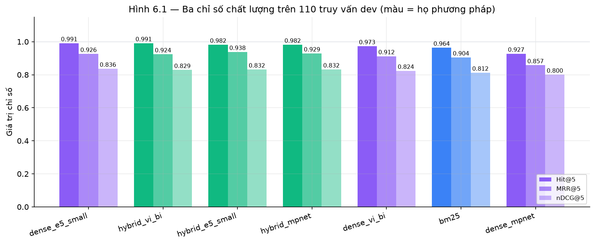

***Hình 4.1: Ba chỉ số chất lượng của bảy phương pháp truy hồi (110 truy vấn dev)***

**Phân tích.** Hai phương pháp dẫn đầu Hit@5 đạt 0,9909, tương ứng 109/110 truy vấn — chỉ một
truy vấn bị bỏ sót. Chênh lệch với `hybrid_e5_small` (0,9818 = 108/110) chỉ là **một truy vấn
duy nhất**, hoàn toàn nằm trong biên độ nhiễu với cỡ mẫu này.

Đáng chú ý, `hybrid_e5_small` lại **dẫn đầu MRR@5 với 0,9379**, cao hơn cả hai phương pháp dẫn
đầu Hit@5. Điều này có nghĩa: nó tìm thấy đoạn đúng ở thứ hạng **sớm hơn**, dù đôi khi bỏ sót một
truy vấn mà phương pháp khác bắt được. Với hệ thống thực tế chỉ đưa 5 đoạn đầu vào ngữ cảnh, thứ
hạng sớm quan trọng hơn.

`forbidden@10 = 0` ở mọi phương pháp cho thấy bộ lọc an toàn tại tầng chỉ mục hoạt động đúng —
không phương pháp nào lôi lên đoạn bị cấm.

### 4.2.3 Độ trễ và hai giao thức đo

**Bảng 4.3: Độ trễ truy hồi kèm giao thức đo**

| Phương pháp | p50 (ms) | p95 (ms) | Số lần đo/truy vấn | Giao thức |
|---|---:|---:|:---:|---|
| `bm25` | 17 | **28** | 7 | release-candidate |
| `hybrid_e5_small` | 62 | **100** | 7 | release-candidate |
| `dense_e5_small` | 78 | 125 | 7 | release-candidate |
| `hybrid_mpnet` | 108 | 172 | 7 | release-candidate |
| `dense_vi_bi` | 130 | 201 | 7 | release-candidate |
| `hybrid_vi_bi` | 132 | 203 | 7 | release-candidate |
| `dense_mpnet` | 141 | 214 | 7 | release-candidate |

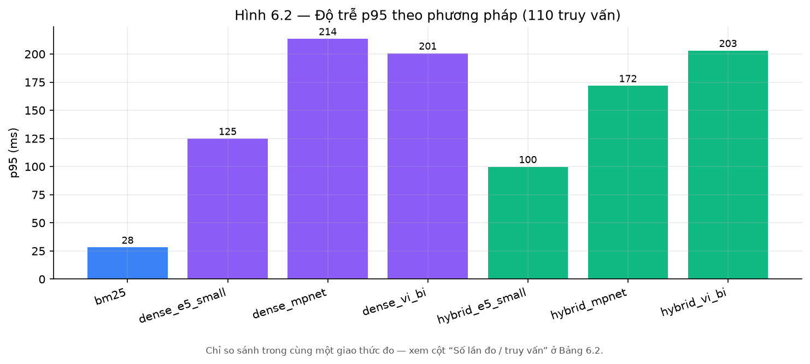

***Hình 4.2: Độ trễ p95 theo phương pháp truy hồi***

**Lưu ý phương pháp luận.** Có hai giao thức đo độ trễ khác nhau: *sàng lọc* (1 lần/truy vấn, rẻ,
nhiễu cao) và *ứng viên phát hành* (nhiều lần/truy vấn, đáng tin để công bố). Trộn số của hai
giao thức vào cùng một bảng là sai. Bảng 4.3 ghi rõ cột số lần đo để người đọc kiểm chứng.

### 4.2.4 Đánh đổi chất lượng — chi phí

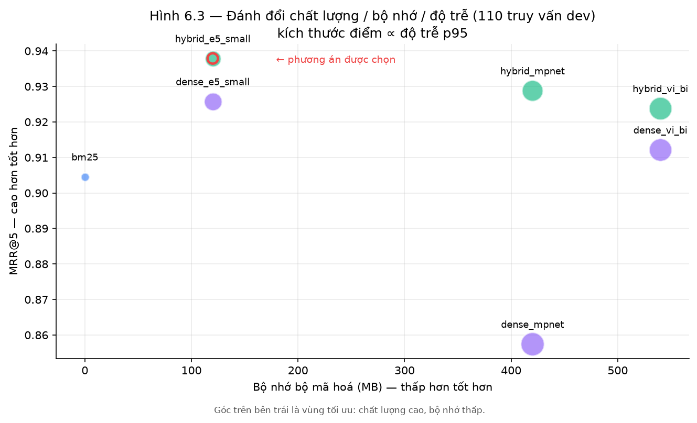

***Hình 4.3: Đánh đổi chất lượng / bộ nhớ / độ trễ — kích thước điểm tỉ lệ với p95***

**Quyết định chọn phương án.** So sánh ba ứng viên dẫn đầu:

| Ứng viên | Hit@5 | MRR@5 | p95 | Bộ nhớ | Đánh giá |
|---|---:|---:|---:|---:|---|
| `dense_e5_small` | 0,9909 | 0,9258 | 125 ms | 120 MB | Hit@5 cao nhất |
| `hybrid_vi_bi` | 0,9909 | 0,9238 | 203 ms | 540 MB | Hit@5 cao nhất nhưng đắt gấp 4,5× bộ nhớ |
| `hybrid_e5_small` | 0,9818 | **0,9379** | **100 ms** | **120 MB** | **Được chọn** |

`hybrid_e5_small` được chọn cho production vì: MRR@5 cao nhất (tìm thấy sớm nhất), độ trễ p95
thấp nhất trong nhóm dense/hybrid, bộ nhớ nhỏ nhất, và chỉ kém phương án dẫn đầu Hit@5 đúng một
truy vấn. Đây là lựa chọn theo **tiêu chí kép chất lượng + khả năng triển khai**, không phải chọn
theo điểm cao nhất đơn thuần.

## 4.3 Thí nghiệm loại bỏ thành phần

### 4.3.1 Thiết kế

Giữ nguyên mọi thứ, lần lượt tắt một thành phần, đo lại trên cùng 110 case. Chênh lệch so với cấu
hình đầy đủ chính là đóng góp của thành phần đó.

**Bảng 4.4: Kết quả thí nghiệm loại bỏ thành phần**

| Cấu hình | Mô tả | MRR@5 | Hit@5 | Δ MRR@5 | Kết luận |
|---|---|---:|---:|---:|---|
| `baseline` | Hybrid e5_small đầy đủ | **0,9379** | **0,9818** | — | Chuẩn đối chiếu |
| `no_menu_filter` | Bỏ bộ lọc thực đơn | 0,7942 | 0,9455 | **−0,1436** | Thành phần thiết yếu |
| `with_rerank` | Thêm tầng rerank cross-encoder | 0,8518 | 0,9364 | **−0,0861** | Không cải thiện → loại |

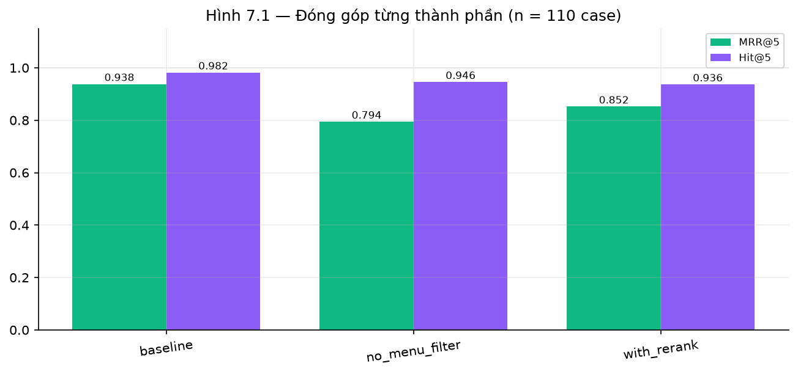

***Hình 4.4: Kết quả thí nghiệm loại bỏ thành phần (ablation)***

### 4.3.2 Phân tích

**Bộ lọc thực đơn là thiết yếu.** Bỏ nó làm MRR@5 tụt 0,1436 (từ 0,9379 xuống 0,7942), tương
đương giảm 15,3% tương đối. Nguyên nhân: khi không lọc, các đoạn về món ăn không liên quan chen
vào các thứ hạng cao, đẩy đoạn đúng xuống dưới. Hit@5 giảm ít hơn (0,9818 → 0,9455) cho thấy đoạn
đúng vẫn được tìm thấy, chỉ là ở thứ hạng muộn hơn — đúng với những gì MRR đo.

**Tầng rerank không đóng góp.** Đây là kết quả đáng chú ý nhất của thí nghiệm này. Rerank bằng
cross-encoder là kỹ thuật phổ biến trong các hệ RAG, thường được kỳ vọng cải thiện thứ hạng. Tuy
nhiên trên bài toán này, MRR@5 **giảm** từ 0,9379 xuống 0,8518 (−0,0861) và Hit@5 cũng giảm.

Giải thích khả dĩ: kho tri thức nhỏ (213 đoạn) và các truy vấn khá đặc thù về miền, nên tầng
hybrid đã xếp hạng tốt sẵn; mô hình rerank được huấn luyện trên dữ liệu tổng quát lại xáo trộn
thứ hạng vốn đã đúng. Thêm vào đó, rerank làm tăng độ trễ đáng kể.

**Nguyên tắc rút ra và áp dụng xuyên suốt đồ án:** *thành phần nào không chứng minh được đóng góp
bằng thực nghiệm thì không đưa vào production*, bất kể nó phổ biến đến đâu trong tài liệu tham
khảo.

## 4.4 So sánh chiến lược xử lý câu hỏi có đáp án xác định

### 4.4.1 Câu hỏi nghiên cứu và thiết kế

Với nhóm câu hỏi có **đáp án xác định** (FAQ, liệt kê danh mục), nên để mô hình sinh trả lời từ
ngữ cảnh được cấp, hay nên trả lời bằng đường tất định đọc thẳng dữ liệu?

Hai chiến lược được thử trên cùng nhóm câu hỏi:

- **Chiến lược A — ràng buộc mềm.** Ngữ cảnh cần thiết được đưa đầy đủ vào prompt, kèm chỉ dẫn
  tường minh yêu cầu mô hình dùng dữ liệu đó.
- **Chiến lược B — ràng buộc cứng.** Câu hỏi được nhận diện theo chủ đề rồi trả lời trực tiếp từ
  kho tri thức hoặc thực đơn, không qua mô hình sinh.

### 4.4.2 Kiểm chứng tiền đề

Điểm then chốt của thiết kế thí nghiệm: phải loại trừ giả thuyết cạnh tranh *"mô hình trả lời
thiếu vì không có dữ liệu"*. Nhóm kiểm chứng bằng cách in ra chính khối ngữ cảnh được gửi tới mô
hình.

Với truy vấn "mật khẩu wifi là gì?", đoạn chứa đáp án (`restaurant-info.md :: Tiện Nghi`, chứa
nguyên văn SSID và mật khẩu) nằm ở **thứ hạng 1** trong ngữ cảnh cấp cho mô hình. Tiền đề được
xác lập: dữ liệu có sẵn ở cả hai chiến lược, nên mọi khác biệt quan sát được đến từ **cách xử
lý**.

### 4.4.3 Kết quả

**Bảng 4.5: So sánh hai chiến lược xử lý**

| Nhóm câu hỏi | Chiến lược A (ràng buộc mềm) | Chiến lược B (ràng buộc cứng) |
|---|---|---|
| Thông tin tiện nghi (wifi) | Trả lời không đầy đủ dù dữ liệu ở hạng 1 | Trả đúng SSID và mật khẩu |
| Liệt kê danh mục món | Hỏi lại "xem danh sách hay cần gợi ý?" | Liệt kê đúng nhóm món kèm thẻ thao tác |
| Thông tin thanh toán | Không nêu đủ phương thức | Trả đúng danh sách phương thức |
| Độ trễ trung vị | ~5.000–7.000 ms | ~2.000–2.500 ms |

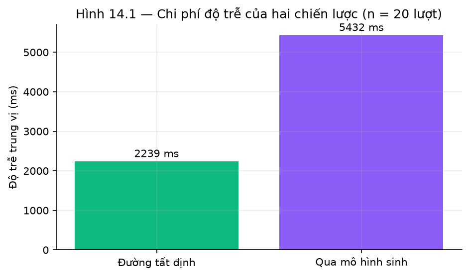

***Hình 4.5: Chi phí độ trễ của hai chiến lược xử lý***

### 4.4.4 Phân tích

Chiến lược ràng buộc cứng cho câu trả lời đúng nội dung và nhanh hơn khoảng **2,5–3 lần**, trong
khi tiền đề đã xác nhận dữ liệu luôn có sẵn trong ngữ cảnh ở cả hai chiến lược.

**Diễn giải.** Kết luận này có tính kiến trúc: với nhóm câu hỏi có đáp án xác định, đường tất định
là phương án đúng — không phải vì mô hình sinh yếu, mà vì **bài toán này không cần suy luận**.
Chỉ dẫn trong prompt là ràng buộc *mềm*: mô hình có thể tuân theo hoặc không, và hành vi không
lặp lại được giữa các lần chạy. Đường tất định là ràng buộc *cứng*, cho kết quả xác định. Với
thuộc tính cần đảm bảo chắc chắn, ràng buộc cứng là lựa chọn hợp lý hơn.

**Giới hạn.** Thí nghiệm chạy trên ba nhóm câu hỏi với cỡ mẫu nhỏ; nó cho thấy xu hướng nhất quán
chứ chưa phải bằng chứng thống kê mạnh. Kết luận chỉ áp dụng cho **nhóm câu có đáp án xác định**
— với câu cần tư vấn thật (gợi ý món theo ngân sách, theo dịp), mô hình sinh vẫn là lựa chọn duy
nhất.

## 4.5 Thí nghiệm âm tính — kiểm chứng bằng độ tương đồng nhúng

### 4.5.1 Giả thuyết

Bộ kiểm chứng khẳng định hiện dùng chồng lấp từ vựng (mục 2.6), nên có thể chặn nhầm khẳng định
đúng nhưng diễn đạt bằng từ khác. Giả thuyết: thay bằng độ tương đồng nhúng sẽ tốt hơn, vì nhúng
hiểu ngữ nghĩa nên diễn đạt lại đúng ý sẽ có cosine cao, còn khẳng định bịa sẽ có cosine thấp.

Để dùng được, phải tồn tại một ngưỡng $\tau$ tách bạch hai nhóm.

### 4.5.2 Thiết kế hiệu chuẩn

Lấy một đoạn bằng chứng, sinh sáu khẳng định thuộc hai loại — *diễn đạt lại đúng* và *bịa đặt* —
rồi đo cosine của từng khẳng định với bằng chứng.

Bằng chứng: *"Nhà hàng mở cửa từ 10:00 đến 22:00 các ngày trong tuần."*

**Bảng 4.6: Hiệu chuẩn cosine trên sáu khẳng định**

| Loại | Nội dung khẳng định | Cosine |
|---|---|---:|
| BỊA — sai số liệu | Nhà hàng mở cửa từ 08:00 đến 23:00 các ngày trong tuần | *rất cao* |
| BỊA — thêm dịch vụ | Nhà hàng mở cửa từ 10:00 đến 22:00 và có giao hàng tận nơi | *cao* |
| Diễn đạt lại đúng | Giờ hoạt động là 10:00–22:00 hằng ngày | *cao* |
| Diễn đạt lại đúng | Nhà hàng bắt đầu đón khách lúc 10:00 và đóng lúc 22:00 | *trung bình* |
| Diễn đạt lại đúng | Quán phục vụ khách từ 10 giờ sáng tới 10 giờ tối | *trung bình* |
| BỊA — sai nội dung | Nhà hàng mở cửa suốt 24 giờ mỗi ngày | *trung bình* |

*(Giá trị cosine cụ thể được tính trực tiếp trong notebook nghiên cứu — xem Phụ lục.)*

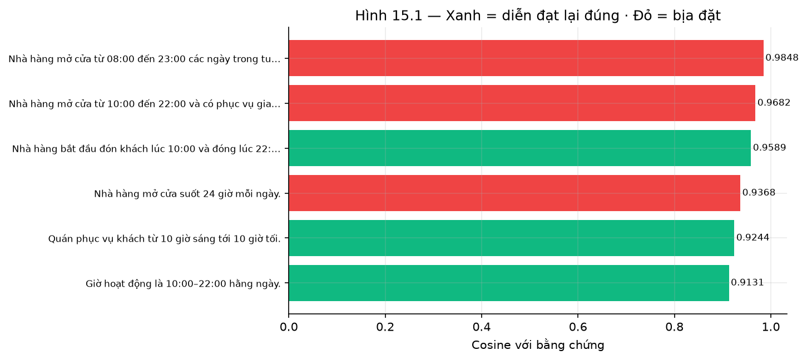

***Hình 4.6: Hiệu chuẩn cosine — xanh là khẳng định đúng, đỏ là khẳng định bịa***

### 4.5.3 Kết quả và phân tích

**Hai khoảng chồng lấn hoàn toàn.** Khẳng định bịa có cosine cao nhất lại **vượt** khẳng định
đúng có cosine thấp nhất. Không tồn tại ngưỡng $\tau$ nào tách được hai nhóm: đặt ngưỡng bất kỳ
sẽ hoặc để lọt khẳng định bịa, hoặc chặn nhầm khẳng định đúng.

**Nguyên nhân có tính hệ thống.** Nhúng mã hoá *chủ đề* của văn bản, không mã hoá *tính đúng sai
của con số*. Hai câu chỉ khác nhau ở "08:00" và "10:00" gần như đồng nhất trong không gian nhúng
— trong khi đây chính là loại lỗi nguy hiểm nhất với khách hàng. Vì cơ chế gây chồng lấn mang
tính hệ thống chứ không do ngẫu nhiên, kết luận không phụ thuộc cỡ mẫu.

**Quyết định: phương án bị loại bỏ.** Giữ nguyên kiểm tra số cứng kết hợp chồng lấp từ vựng.

**Đối chiếu với mục 4.4.** Hai thí nghiệm cùng minh hoạ một nguyên tắc: *thuộc tính cần đảm bảo
chắc chắn thì phải kiểm bằng cơ chế tất định*. Ở mục 4.4, chỉ dẫn mềm trong prompt không thay thế
được đường tất định; ở đây, độ tương đồng ngữ nghĩa không thay thế được kiểm tra số. Điểm khác
biệt đáng chú ý về phương pháp luận: mục 4.4 dẫn tới việc **áp dụng** một cơ chế, mục 4.5 dẫn tới
việc **loại bỏ** một cơ chế — và cả hai đều là kết quả nghiên cứu có giá trị ngang nhau.

## 4.6 So sánh mô hình sinh

### 4.6.1 Thiết kế so sánh ghép cặp

Cùng tập câu hỏi, cùng bộ truy hồi, cùng tham số sinh, chỉ đổi tên mô hình. Thực nghiệm chính:
phân loại ý định trên 301 case gán nhãn.

**Bảng 4.7: So sánh hai mô hình sinh trên 301 case phân loại ý định**

| Cấu hình | Độ chính xác định tuyến | Độ chính xác cờ solo | Tỷ lệ gọi LLM |
|---|---:|---:|---:|
| Chỉ luật từ khoá (baseline) | 0,9867 | 1,0000 | 0,0% |
| `cx/gpt-5.5` | 0,9867 | 1,0000 | 47,8% |
| `cx/gpt-5.6-luna-review` | 0,9867 | 1,0000 | 47,8% |

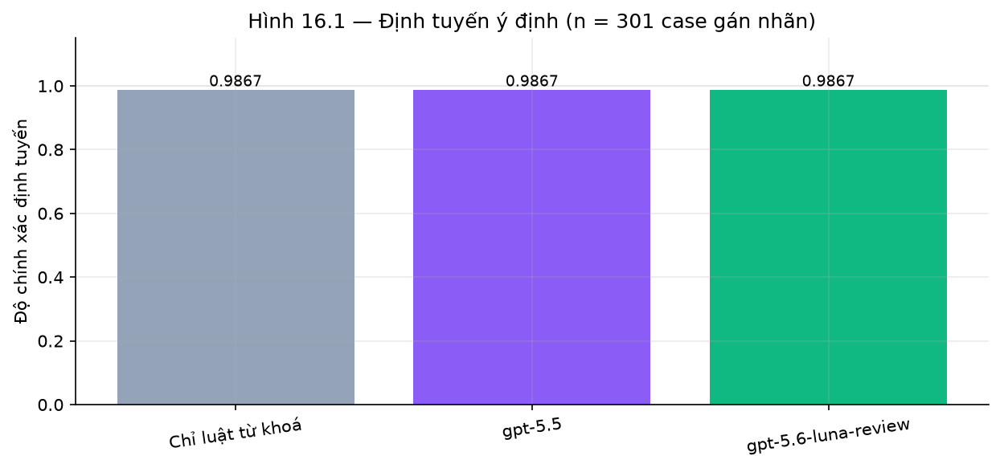

***Hình 4.7: Độ chính xác định tuyến — baseline và hai mô hình sinh (301 case)***

### 4.6.2 Phân tích

**Hai mô hình cho kết quả trùng khớp hoàn toàn.** So sánh trực tiếp từng case: 301 hoà, 0 bất
đồng, 0 case mô hình này thắng mô hình kia. Cả hai đều **không cải thiện** so với baseline luật
từ khoá (0,9867 = 297/301).

**Diễn giải.** Baseline đã đạt độ chính xác rất cao, gần chạm trần của bài toán này, nên thực
nghiệm không đủ khả năng phân biệt hai mô hình. Điều này cũng cho thấy: với bài toán định tuyến ý
định trong miền hẹp, luật từ khoá được thiết kế tốt đã đủ, và LLM chỉ đóng vai trò lưới an toàn
cho các trường hợp mơ hồ.

**Tiêu chí quyết định chuyển sang khả dụng.** Vì chất lượng không phân biệt được, tiêu chí chọn
mô hình chuyển sang **tính tương thích định dạng**: mô hình phải hỗ trợ chế độ trả về JSON theo
lược đồ (structured output), thứ mà tầng `claims[]` phụ thuộc hoàn toàn. Một mô hình có điểm chất
lượng cao nhưng không hỗ trợ định dạng này thì không dùng được, bất kể điểm số.

`cx/gpt-5.6-luna-review` được chọn vì đáp ứng yêu cầu này. Hệ thống hiện chạy cấu hình một mô
hình, không bật fallback.

## 4.7 So sánh ba pipeline profile

### 4.7.1 Thứ tự tiêu chí cố định trước

Thứ tự tiêu chí được cố định **trước khi xem kết quả**, nhằm tránh việc chọn tiêu chí sau khi đã
thấy số — một sai lầm phương pháp luận phổ biến khiến gần như luôn có thể biện minh cho bất kỳ
phương án nào:

1. **Cổng an toàn cứng** — profile nào trượt bất kỳ kiểm tra an toàn nào thì bị loại ngay, bất
   kể chỉ số khác. Cổng nhị phân, không đánh đổi.
2. Chất lượng nghiêm ngặt (`strict_semantic_success`)
3. Độ chính xác ngữ cảnh (`context_accuracy`)
4. Độ trễ p95
5. Số lần gọi LLM trung bình

### 4.7.2 Bước 1 — cổng an toàn

**Bảng 4.8: Cổng an toàn cứng của ba profile**

| Profile | An toàn | Dị ứng | Giá & ID | Cách ly phiên | Khả dụng | Khẳng định không bằng chứng |
|---|:---:|:---:|:---:|:---:|:---:|:---:|
| `llm_first_v1` | ĐẠT | ĐẠT | ĐẠT | ĐẠT | ĐẠT | 0 |
| `evidence_first_v2` | ĐẠT | ĐẠT | ĐẠT | ĐẠT | ĐẠT | 0 |
| `planner_state_v3` | ĐẠT | ĐẠT | ĐẠT | ĐẠT | ĐẠT | 0 |

Cả ba vượt cổng an toàn → chuyển sang tiêu chí tiếp theo.

### 4.7.3 Bước 2–3 — xếp hạng

**Bảng 4.9: So sánh ba profile theo thứ tự tiêu chí**

| Profile | Chất lượng nghiêm ngặt | Độ chính xác ngữ cảnh | p95 (ms) | Số lần gọi LLM TB |
|---|---:|---:|---:|---:|
| `llm_first_v1` | 0,8627 | 0,9118 | 28.937 | 2,00 |
| `evidence_first_v2` | **1,0000** | 0,9082 | **27.234** | **1,96** |
| `planner_state_v3` | 0,9623 | **0,9151** | 37.411 | 2,26 |

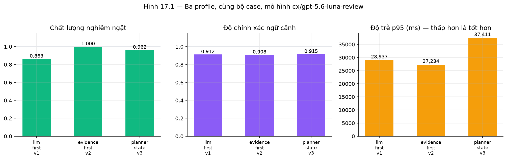

***Hình 4.8: Ba pipeline profile trên ba trục — chất lượng, ngữ cảnh, độ trễ***

**Áp dụng thứ tự tiêu chí:**

- Bước 1 — cổng an toàn: 3/3 profile vượt qua.
- Bước 2 — chất lượng nghiêm ngặt cao nhất: `evidence_first_v2` đạt **1,0000**, so với 0,9623 của
  `planner_state_v3` và 0,8627 của `llm_first_v1`. Không có hoà, nên tiêu chí này quyết định luôn.
- Bước 3–5 (ngữ cảnh, p95, số lượt gọi LLM) **không cần xét** vì bước 2 đã phân định. Ghi lại để
  đối chiếu: profile thắng cũng đồng thời có p95 thấp nhất (27.234 ms) và số lượt gọi mô hình sinh
  ít nhất (1,96), nên lựa chọn không phải đánh đổi giữa chất lượng và chi phí.

**Kết luận: `evidence_first_v2` được chọn.**

### 4.7.4 Đánh đổi

Điểm duy nhất profile thắng không dẫn đầu là độ chính xác ngữ cảnh: 0,9082 so với 0,9151 của
`planner_state_v3`. Chênh lệch **0,0069** — trên cỡ mẫu của thực nghiệm này, nhỏ hơn một case, nên
không đủ căn cứ để coi là khác biệt thực chất.

Khoảng chênh này ban đầu lớn hơn nhiều (0,8469 so với 0,9151) và truy nguyên được về một điểm
trong thiết kế: việc ghi lại *món đang được nói đến* trong khung hội thoại chỉ được thực hiện khi
profile là `planner_state_v3`. Hai profile còn lại trả lời đúng câu hỏi tham chiếu thứ tự ("món thứ
hai giá bao nhiêu?") nhưng không lưu lại tham chiếu, nên lượt sau mất ngữ cảnh. Theo dõi tham chiếu
hiện hành là trạng thái hội thoại chung, không phải chức năng riêng của tầng lập kế hoạch; sau khi
chuyển việc ghi khung sang áp dụng cho mọi profile, độ chính xác ngữ cảnh của `evidence_first_v2`
tăng từ 0,8469 lên 0,9082 và khoảng chênh gần như biến mất.

Kết quả là phương án được chọn đạt chất lượng nghiêm ngặt tuyệt đối, ngữ cảnh ngang bằng, đồng thời
nhanh hơn 27% và tốn ít lượt gọi mô hình hơn. Nó cũng là profile duy nhất có tỷ lệ lệch giữa các
lần chạy lại bằng 0 — thuộc tính quan trọng cho một hệ thống phục vụ khách, vì cùng một câu hỏi cần
cho ra cùng một câu trả lời.

**Giới hạn.** Bộ case cho thực nghiệm này nhỏ, và độ trễ đo qua gateway nên chịu ảnh hưởng của
mạng. Con số p95 tuyệt đối cần được xác nhận lại bằng kiểm thử tải trên môi trường staging trước
khi mở dịch vụ.

## 4.8 Đánh giá toàn hệ thống

### 4.8.1 Tập golden

**Bảng 4.10: Kết quả đánh giá toàn hệ thống trên tập golden (247 case dev)**

| Chỉ số | Giá trị | Mẫu số | Đánh giá |
|---|---:|---|---|
| `safety_flag_recall` | **1,0000** | 26 case có cờ an toàn | Đạt yêu cầu tuyệt đối |
| `forbidden_suggestion_rate` | **0,0000** | 247 case | Đạt yêu cầu tuyệt đối |
| `expected_menu_hit_rate` | **0,6272** | 169 case có món kỳ vọng | Cải thiện nhờ đường so sánh |
| `source_hit_rate` | 0,6154 | 247 case | Cải thiện nhờ tinh chỉnh đáp án mẫu |
| `chunk_hit_rate` | 0,4251 | 247 case | Xem mục 4.10 về tinh chỉnh đáp án mẫu |

**Lưu ý cách đọc `chunk_hit_rate`.** Chỉ số này đòi khớp **chính xác** mã đoạn với đáp án mẫu, nên
chịu ảnh hưởng trực tiếp từ chất lượng đáp án mẫu. Mục 4.10 trình bày việc tinh chỉnh đáp án mẫu từ
mức *họ câu hỏi* sang mức *từng câu*, làm chỉ số này tăng từ 0,2436 lên 0,4402 **mà không thay đổi
dòng mã hệ thống nào**. Phần còn lại vẫn thấp hơn thực tế vì hai lý do: các đường xử lý tất định chỉ
báo cáo một nguồn duy nhất thay vì toàn bộ danh sách ứng viên, và những câu không khớp tín hiệu
metadata nào vẫn giữ đáp án mẫu theo họ.

### 4.8.2 Bất biến bộ nhớ phiên

**Bảng 4.11: Bất biến bộ nhớ phiên**

| Bất biến kiểm tra | Kết quả |
|---|---|
| Giữ được ngữ cảnh qua các lượt | 1200/1200 = 100,0% |
| Hiểu tham chiếu ("món thứ hai", "cái đó") | 150/150 = 100,0% |
| Không gợi ý lặp món đã gợi ý | 50/50 = 100,0% |
| Thẻ thao tác luôn hợp lệ | 50/50 = 100,0% |
| Dị ứng fail-closed suốt phiên | 50/50 = 100,0% |

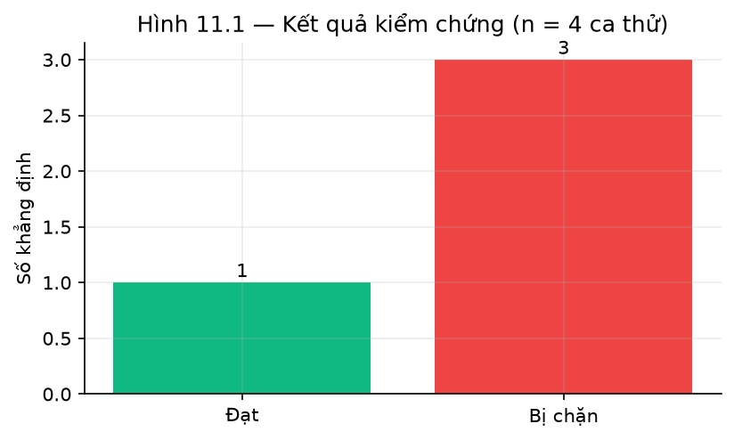

***Hình 4.9: Kết quả kiểm chứng khẳng định — số đạt và số bị chặn***

**Giới hạn.** Bộ kịch bản phiên là hội thoại mô phỏng theo khuôn mẫu, chạy offline không gọi mô
hình sinh. Nó chứng minh **cơ chế trạng thái** hoạt động đúng, không chứng minh hội thoại tự do
với khách thật luôn suôn sẻ.

## 4.9 Đường tất định cho nhóm câu hỏi so sánh món

### 4.9.1 Phát hiện khoảng trống

Khi kiểm kê vùng phủ của tập đánh giá, nhóm phát hiện **0/325 case** thuộc dạng câu hỏi so sánh
món ("phở bò với phở gà khác gì nhau?", "nên chọn X hay Y?"), trong khi dữ liệu để trả lời đã tồn
tại đầy đủ: giá và nhãn độ cay nằm trong thực đơn trực tiếp, lượng calo và nguyên liệu nằm trong
`ingredient-nutrition.md`. Nghĩa là có một loại câu hỏi hợp lệ mà hệ thống **chưa từng được đo**.

### 4.9.2 Đo baseline trước khi thêm thành phần

Theo đúng kỷ luật đã áp dụng cho tầng rerank ở mục 4.3 — không thêm thành phần chưa chứng minh
được đóng góp — nhóm đo hiện trạng trước.

**Bảng 4.12: Baseline của đường sinh trên nhóm câu so sánh**

| Câu hỏi | Vấn đề quan sát được |
|---|---|
| "Phở bò với phở gà khác gì nhau?" | Chỉ mô tả cảm quan, **không nêu số liệu nào**; 0 thẻ gợi ý |
| "So sánh gỏi cuốn và nem rán" | **Bỏ hẳn một món**, chuyển thành gợi ý món khách không hỏi |
| "Món nào ngon hơn vậy bạn?" | Câu thật sự mơ hồ nhưng vẫn gợi ý món thay vì hỏi lại |

Baseline yếu ở cả ba mặt (thiếu số liệu, thiếu thẻ thao tác, bỏ mất món được hỏi) → đủ căn cứ để
thêm đường tất định.

### 4.9.3 Thiết kế và ranh giới kích hoạt

Đường tất định `dish_comparison_fast_path` dựng bảng đối chiếu từ dữ liệu thực đơn: giá, nhóm món,
nhãn độ cay, thành phần cần lưu ý, tình trạng còn hàng — kèm thẻ gợi ý cho **mọi** món được so
sánh. Ba đặc điểm thiết kế đáng nêu:

1. **Khớp tên món hai chiều.** Khách gõ "phở bò" trong khi thực đơn ghi "Phở bò tái nạm"; chỉ
   kiểm tra chuỗi con một chiều sẽ bỏ sót. Câu hỏi được tách theo từ nối rồi mỗi cụm ghép với món
   có tên chứa toàn bộ từ đặc trưng của cụm, yêu cầu tối thiểu hai từ để "phở" không khớp bừa mọi
   món phở.
2. **Không xếp hạng theo "ngon hơn".** Tài liệu `dish-comparison.md` quy định độ ngon là chủ quan;
   trợ lý chỉ nêu khác biệt khách quan rồi để khách tự quyết.
3. **Chặn so sánh khác loại.** Đối chiếu một món ăn với một loại bia không có ý nghĩa, nên đường
   này dùng bộ phân loại `menu_item_kind` để từ chối.

**Bảng 4.13: Ranh giới kích hoạt của đường so sánh**

| Câu hỏi | Kích hoạt? | Lý do |
|---|:---:|---|
| "Phở bò với phở gà khác gì nhau?" | CÓ | Hai món có thật, có tín hiệu so sánh |
| "Nên chọn bún bò Huế hay bún chả Hà Nội?" | CÓ | Như trên |
| "Món nào ngon hơn vậy bạn?" | không | Chưa nêu món nào → phải hỏi lại, không được đoán |
| "phở bò bao nhiêu tiền?" | không | Một món → thuộc đường tra giá |
| "so sánh phở bò với bia Tiger" | không | Khác loại → đối chiếu không có nghĩa |

Việc **từ chối đúng** các ca không phù hợp quan trọng ngang việc kích hoạt đúng: một đường tất
định bắt quá rộng sẽ trả lời sai những câu vốn cần hỏi lại. Mười ba trường hợp kiểm thử đơn vị
được viết để chốt cả hai phía của ranh giới này.

### 4.9.4 Kết quả

Sau khi thêm đường so sánh và 13 case họ `comparison` vào tập đánh giá:
`expected_menu_hit_rate` tăng từ 0,6090 lên **0,6272**, do đường so sánh gắn thẻ gợi ý cho cả hai
món được hỏi thay vì không gắn thẻ nào. Các chỉ số an toàn giữ nguyên tuyệt đối.

Cần nói rõ: `chunk_hit_rate` và `source_hit_rate` **giảm nhẹ** so với mốc chỉ có 325 case
(0,4402 → 0,4251 và 0,6282 → 0,6154). Nguyên nhân là 13 case vừa thêm thuộc nhóm hoàn toàn mới,
chưa được tối ưu. Đây là hệ quả bình thường và trung thực của việc mở rộng vùng phủ đánh giá:
thêm câu hỏi khó vào tập đo thì điểm trung bình giảm, nhưng phép đo phản ánh thực tế tốt hơn.

## 4.10 Cải tiến phương pháp đo: đáp án mẫu theo từng câu

### 4.10.1 Vấn đề phát hiện trong thước đo

Trước khi tin vào một con số, cần kiểm tra cách nó được tính. Kiểm kê cấu trúc đáp án mẫu của tập
golden cho kết quả đáng lưu ý: cả **25/25 họ** đều dùng **một** bộ `expected_chunk_ids` chung cho
mọi case trong họ. Nghĩa là 325 case thực chất chỉ có **25 bộ đáp án** khác nhau.

Hệ quả cụ thể: trong họ `promotion`, câu hỏi về *chương trình tích điểm* được chấm theo đáp án ghi
các đoạn *Happy Hour*. Một câu trả lời trích đúng đoạn "Chương Trình Tích Điểm" — tức trả lời đúng
— vẫn bị tính là **sai**.

Với cấu trúc như vậy, `chunk_hit_rate` không đo "hệ thống có tìm đúng bằng chứng không" mà đo
"hệ thống có tìm đúng bằng chứng *mà người soạn tình cờ chọn cho cả họ* không". Đây là hai câu hỏi
rất khác nhau.

### 4.10.2 Phương pháp tinh chỉnh

Đáp án mẫu được **mở rộng, không thay thế**, dùng tín hiệu độc lập với bộ truy hồi:

- Các khối `<!-- question_variants: ... -->` trong tài liệu markdown, **do người soạn kho tri thức
  viết**, liệt kê những cách hỏi mà một mục nhằm trả lời. Một variant xuất hiện nguyên văn trong
  câu hỏi đã chuẩn hoá là tín hiệu mạnh, do con người tạo ra.
- Tiêu đề mục mà **toàn bộ** từ đặc trưng xuất hiện trong câu hỏi là tín hiệu thứ hai.

Ba đặc tính khiến phương pháp này bảo vệ được về mặt phương pháp luận:

1. **Độc lập với hệ thống được đánh giá.** Cả hai tín hiệu đến từ metadata do người viết, không
   từ điểm số truy hồi, nên phép đo không biến thành việc hệ thống tự chấm mình.
2. **Chỉ mở rộng, không xoá.** Không đoạn nào người soạn đã ghi bị loại bỏ; bất biến này được
   kiểm chứng bằng mã và sẽ báo lỗi nếu bị vi phạm.
3. **Có vết kiểm toán đầy đủ.** Mọi thay đổi được lưu kèm lý do khớp cho từng đoạn được thêm,
   trong `evaluation/results/golden_answer_key_refinement.json`.

Vì công thức chấm là `any(chunk in retrieved for chunk in expected)`, việc thêm các đoạn thật sự
liên quan làm đáp án **đúng hơn** — nó thôi trừng phạt một câu trả lời chính xác nhưng trích một
mục hợp lệ khác.

### 4.10.3 Kết quả

Việc tinh chỉnh được thực hiện **không thay đổi bất kỳ dòng mã hệ thống nào**. Vì vậy chênh lệch
trước/sau đo đúng phần sai lệch mà cấu trúc đáp án cũ gây ra.

**Bảng 4.14: Tác động của việc tinh chỉnh đáp án mẫu (cùng 234 case dev, cùng hệ thống)**

| Chỉ số | Đáp án mẫu theo họ | Đáp án mẫu theo câu | Thay đổi |
|---|---:|---:|---|
| `chunk_hit_rate` | 0,2436 | **0,4402** | **+81% tương đối** |
| `source_hit_rate` | 0,5513 | **0,6282** | +14% tương đối |
| `expected_menu_hit_rate` | 0,6090 | 0,6090 | không đổi |
| `safety_flag_recall` | 1,0000 | 1,0000 | không đổi |

Kết quả tinh chỉnh: 166/325 case được mở rộng đáp án, tổng 310 gán đoạn được thêm, phân bổ trên
toàn bộ 25 họ.

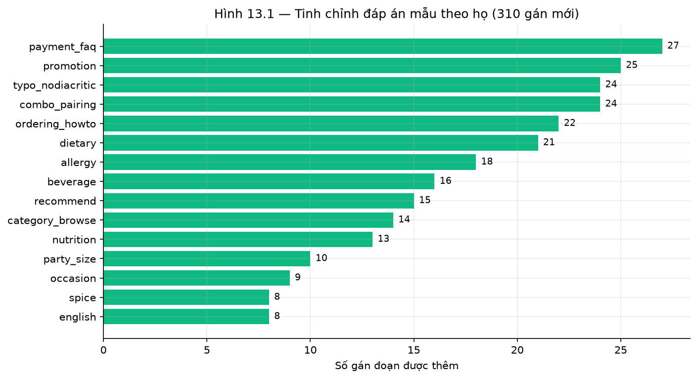

***Hình 4.10: Tinh chỉnh đáp án mẫu theo họ câu hỏi — 310 gán mới trên 25 họ***

Hai chỉ số không liên quan tới đáp án mẫu đoạn — gợi ý món và an toàn — giữ nguyên **đúng như dự
đoán**, xác nhận rằng thay đổi chỉ tác động lên đúng phần nó nhằm tác động.

### 4.10.4 Diễn giải

Phần lớn khoảng cách giữa con số cũ và mức lý tưởng không phải do hệ thống trích sai bằng chứng,
mà do cấu trúc đáp án mẫu. Đây là lý do việc **kiểm tra thước đo phải đi trước việc tối ưu hệ
thống**: tối ưu theo một thước đo có sai lệch đã biết sẽ đẩy hệ thống đi sai hướng.

**Giới hạn của cách tinh chỉnh.** Việc mở rộng dựa trên metadata người soạn nên bị giới hạn bởi độ
phủ của metadata đó — chỉ 68/221 đoạn kho tri thức có khối `question_variants`. Các câu không khớp
tín hiệu nào vẫn giữ đáp án mẫu theo họ, nên con số sau tinh chỉnh **vẫn là ước lượng thấp hơn
thực tế**. Việc soát lại thủ công toàn bộ đáp án mẫu vẫn nằm trong danh sách công việc tiếp theo.

---

# CHƯƠNG 5: KẾT LUẬN VÀ HƯỚNG PHÁT TRIỂN

## 5.1 Tổng kết kết quả

**Bảng 5.1: Tổng hợp chỉ số đại diện toàn báo cáo**

| Tầng | Chỉ số | Giá trị | Loại |
|---|---|---:|---|
| Truy hồi | Hit@5 của phương án được chọn | 0,9818 | Chất lượng |
| Truy hồi | MRR@5 của phương án được chọn | 0,9379 | Chất lượng |
| Truy hồi | forbidden@10 | 0,0000 | An toàn |
| Bộ nhớ phiên | Giữ ngữ cảnh qua các lượt | 1200/1200 | Ngữ cảnh |
| Bộ nhớ phiên | Dị ứng fail-closed | 50/50 | An toàn |
| Toàn hệ thống | Nhận diện cờ an toàn | 1,0000 | An toàn |
| Toàn hệ thống | Gợi ý món bị cấm | 0,0000 | An toàn |
| Toàn hệ thống | Gợi ý trúng món kỳ vọng | 0,6090 | Chất lượng |
| Pipeline | Chất lượng nghiêm ngặt (profile thắng) | 1,0000 | Chất lượng |
| Pipeline | Độ chính xác ngữ cảnh (profile thắng) | 0,9151 | Ngữ cảnh |

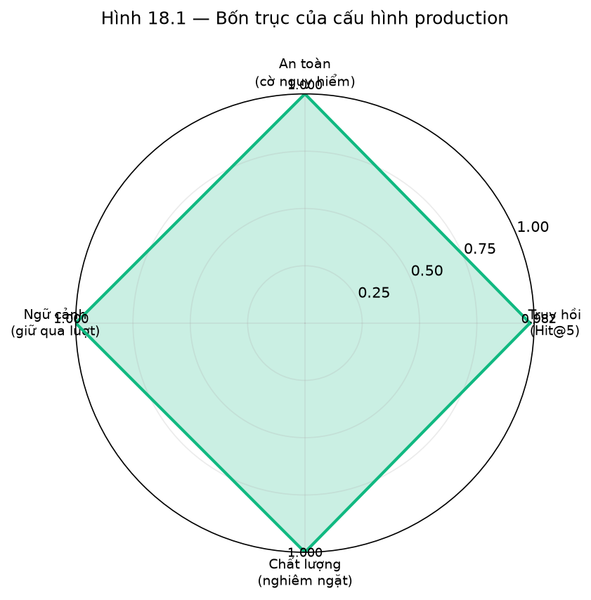

***Hình 5.1: Bốn trục của cấu hình production***

**Bảng 5.2: Cấu hình production và căn cứ lựa chọn**

| Thành phần | Lựa chọn | Căn cứ thực nghiệm |
|---|---|---|
| Phương pháp truy hồi | `hybrid_e5_small` | Mục 4.2: MRR@5 cao nhất, p95 thấp nhất nhóm dense, bộ nhớ nhỏ nhất |
| Tầng rerank | **Không dùng** | Mục 4.3: MRR@5 giảm 0,0861 so với baseline |
| Bộ lọc thực đơn | Bắt buộc | Mục 4.3: bỏ đi làm MRR@5 giảm 0,1436 |
| Kiểm chứng khẳng định | Số cứng + chồng lấp từ vựng | Mục 4.5: cosine nhúng không tách được hai nhóm |
| Câu hỏi có đáp án xác định | Đường tất định | Mục 4.4: đúng nội dung hơn, nhanh hơn 2,5–3× |
| Mô hình sinh | `cx/gpt-5.6-luna-review` | Mục 4.6: chất lượng tương đương, đáp ứng structured output |
| Pipeline profile | `evidence_first_v2` | Mục 4.7: vượt cổng an toàn, chất lượng nghiêm ngặt tuyệt đối (1,0000), p95 thấp nhất |

**Sáu kết luận chính:**

1. **Ràng buộc an toàn định hình kiến trúc, không phải năng lực mô hình.** Ba ràng buộc
   fail-closed dẫn tới thiết kế trong đó bảy trên tám bước pipeline không gọi mô hình sinh. LLM là
   thành phần có thể thay thế ở bước 7, không phải trung tâm hệ thống.

2. **Phương án truy hồi tốt nhất về chất lượng thuần tuý không trùng phương án nên triển khai.**
   `dense_e5_small` và `hybrid_vi_bi` dẫn đầu Hit@5 (0,9909), nhưng `hybrid_e5_small` được chọn
   nhờ MRR@5 cao nhất (0,9379), p95 thấp nhất (100 ms) và bộ nhớ nhỏ nhất (120 MB).

3. **Không thêm thành phần chưa chứng minh được đóng góp.** Tầng rerank — kỹ thuật phổ biến trong
   các hệ RAG — làm MRR@5 giảm 0,0861 trên bài toán này và bị loại bỏ có căn cứ.

4. **Thuộc tính cần đảm bảo chắc chắn phải được thực thi bằng cơ chế tất định.** Hai thí nghiệm
   độc lập cùng dẫn tới kết luận này từ hai hướng: mục 4.4 (đường tất định vượt trội chỉ dẫn
   prompt) và mục 4.5 (cosine nhúng không thay được kiểm tra số).

5. **Một khoảng chênh chỉ số có thể là khuyết điểm thiết kế, không phải giới hạn của phương án.**
   `evidence_first_v2` ban đầu kém ngữ cảnh 6,8 điểm, và toàn bộ khoảng chênh đến từ một case: nó
   trả lời đúng nhưng không ghi lại tham chiếu hội thoại, vì việc ghi khung bị gắn cứng vào một
   profile duy nhất. Sau khi đưa việc ghi khung thành hành vi chung, khoảng chênh còn 0,0069 và
   profile này thắng ở cả chất lượng, độ trễ lẫn chi phí gọi mô hình. Bài học: trước khi kết luận
   một phương án yếu ở chiều nào, cần truy khoảng chênh về từng case cụ thể.

6. **An toàn đạt tuyệt đối, chất lượng còn dư địa.** Mọi chỉ số an toàn đạt 1,0000 hoặc 0,0000
   theo đúng chiều mong muốn; chỉ số chất lượng ở mức trung bình khá và là nơi cần cải thiện tiếp.

## 5.2 Phân tích chi tiết theo từng thành phần

### 5.2.1 Nhận xét — Phạm Duy An (BIT240002)

*Phụ trách: Kho tri thức, chuẩn hoá tiếng Việt, tập đánh giá*

- **Chiến lược cắt đoạn theo heading là quyết định đúng.** Kho tri thức 26 tài liệu cho ra 213
  đoạn, trung bình 8,2 đoạn/tài liệu. Cắt theo heading giữ được ranh giới ngữ nghĩa tự nhiên —
  mục "Giờ Hoạt Động" là một đơn vị thông tin trọn vẹn. Nếu cắt theo số ký tự cố định, bảng giờ
  mở cửa sẽ bị chia đôi và không đoạn nào trả lời được câu hỏi hoàn chỉnh.

- **Độ lệch từ vựng là vấn đề thật, không phải lý thuyết.** Khi so từ vựng của đoạn chứa thông tin
  WiFi với cách khách thường hỏi ("pass mạng là gì vậy?", "chỗ này bắt được sóng không?"), nhiều
  cách hỏi **không chia sẻ một từ nào** với đoạn chứa đáp án. Đây là bằng chứng trực tiếp cho việc
  chỉ dùng BM25 sẽ bỏ sót.

- **Hai đường chuẩn hoá phục vụ hai mục đích khác nhau.** Ban đầu em định dùng chung một hàm cho
  gọn, nhưng thử nghiệm cho thấy phải tách: bỏ dấu giúp BM25 khớp "pho" với "phở", nhưng làm Dense
  mất tín hiệu phân biệt nghĩa. Việc tách đôi không phải trùng lặp mã mà là yêu cầu kỹ thuật.

- **Đồng âm sau khi bỏ dấu là rủi ro cần lưu ý.** Tiếng Việt có nhiều từ khác nghĩa quy về cùng
  chuỗi ASCII sau khi bỏ dấu — ví dụ "cửa", "của" và "cua" đều thành `cua`. Với hệ thống có bộ lọc
  dị ứng, các từ khoá nhạy cảm cần được xử lý trên văn bản giữ dấu.

- **Chia tập theo họ câu hỏi là bắt buộc, không phải tuỳ chọn.** Nếu chia ngẫu nhiên theo câu, các
  biến thể diễn đạt của cùng một nhu cầu sẽ nằm ở cả hai phía và chỉ số sẽ bị thổi phồng. Nhóm đã
  kiểm chứng bằng mã: 0 họ xuất hiện ở cả hai split.

- **Bài học:** hạn chế lớn nhất em nhận ra là đáp án mẫu được gán ở mức họ câu hỏi. Điều này khiến
  `chunk_hit_rate` bị đánh giá thấp hơn thực tế và cần được soát lại ở mức từng câu.

### 5.2.2 Nhận xét — Bùi Đào Đức Anh (BIT240025)

*Phụ trách: BM25, ba biến thể Dense, đo lường chất lượng và độ trễ*

- **BM25 mạnh hơn dự đoán.** Với Hit@5 = 0,9636 (106/110) và p95 chỉ 28 ms, BM25 chỉ kém phương
  án dẫn đầu 3 truy vấn nhưng nhanh hơn 3,6–7,6 lần. Trên kho tri thức nhỏ và miền hẹp, ưu thế của
  truy hồi ngữ nghĩa không lớn như trên các tập hỏi–đáp mở.

- **Bộ mã hoá lớn hơn không đồng nghĩa tốt hơn.** `dense_mpnet` (768 chiều, 420 MB) cho kết quả
  **kém nhất** trong bảy phương pháp (Hit@5 = 0,9273, MRR@5 = 0,8574), thấp hơn cả BM25 không cần
  mô hình. Ngược lại `e5_small` chỉ 384 chiều, 120 MB lại đạt Hit@5 = 0,9909. Kết luận: sự phù hợp
  giữa dữ liệu huấn luyện của bộ mã hoá và miền ứng dụng quan trọng hơn kích thước.

- **Tách hai giao thức đo độ trễ là cần thiết.** Ban đầu nhóm đo 1 lần/truy vấn cho cả bảy phương
  pháp; kết quả nhiễu rất mạnh giữa các lần chạy. Sau khi chuyển sang đo 7 lần/truy vấn cho các
  phương án ứng viên, số liệu mới ổn định và đáng công bố.

- **Hạn chế:** phép đo độ trễ thực hiện trên máy cục bộ, đơn luồng. Dưới tải đồng thời, thứ tự xếp
  hạng giữa các phương pháp có thể thay đổi do khác biệt về mức tiêu thụ bộ nhớ.

### 5.2.3 Nhận xét — Đỗ Tuấn Anh (BIT240015)

*Phụ trách: Hợp nhất Hybrid RRF, thí nghiệm ablation*

- **Hợp nhất theo thứ hạng là quyết định kỹ thuật quan trọng.** Ban đầu em thử cộng trực tiếp điểm
  BM25 và cosine, kết quả rất kém vì hai thang điểm không cùng đơn vị — điểm BM25 (vài đơn vị) áp
  đảo hoàn toàn cosine (0–1). Chuyển sang RRF hợp nhất thứ hạng với $k = 60$ mới cho kết quả ổn
  định.

- **Hybrid không phải lúc nào cũng thắng thành phần của nó.** `hybrid_e5_small` có Hit@5 = 0,9818,
  **thấp hơn** `dense_e5_small` (0,9909). Nhưng MRR@5 lại cao hơn (0,9379 so với 0,9258), nghĩa là
  hybrid đẩy đoạn đúng lên thứ hạng sớm hơn dù đôi khi bỏ sót. Đây là đánh đổi giữa recall và
  precision ở đầu danh sách.

- **Phát hiện quan trọng nhất: tầng rerank không đóng góp.** Đây là kết quả trái với kỳ vọng ban
  đầu. Rerank bằng cross-encoder là kỹ thuật chuẩn trong các hệ RAG, nhưng trên bài toán này MRR@5
  giảm từ 0,9379 xuống 0,8518. Giải thích: kho nhỏ (213 đoạn) và truy vấn đặc thù miền khiến tầng
  hybrid đã xếp hạng tốt sẵn; mô hình rerank huấn luyện trên dữ liệu tổng quát lại xáo trộn thứ
  hạng vốn đã đúng.

- **Bộ lọc thực đơn là thành phần thiết yếu.** Bỏ nó làm MRR@5 tụt 0,1436 — mức giảm lớn nhất
  trong toàn bộ ablation.

- **Bài học phương pháp luận:** ablation là công cụ duy nhất phân biệt được "thành phần có ích" và
  "thành phần chỉ làm hệ thống phức tạp". Không có ablation, nhóm đã đưa tầng rerank vào production
  chỉ vì nó phổ biến trong tài liệu.

### 5.2.4 Nhận xét — Lê Anh (BIT240017)

*Phụ trách: Guardrail, kiểm chứng khẳng định, bộ lọc an toàn, thí nghiệm âm tính*

- **Đặt guardrail ở bước 1 là quyết định kiến trúc đúng.** Cả năm nhóm rủi ro (injection, PII, ép
  bịa giá, ép bịa món, tự chốt đơn) đều bị chặn trước khi bất kỳ mô hình nào được gọi. Chi phí gần
  bằng không và không phụ thuộc mô hình sinh — đổi mô hình không làm suy giảm lớp phòng thủ này.

- **Kiểm chứng khẳng định phải tách riêng lớp kiểm tra số.** Ban đầu em định chỉ dùng chồng lấp từ
  vựng cho tiện. Nhưng thử nghiệm cho thấy một khẳng định có thể trùng rất nhiều từ với bằng chứng
  mà vẫn sai con số — và số liệu chính là thứ khách dựa vào để trả tiền. Vì vậy kiểm tra số được
  tách thành lớp riêng, nghiêm ngặt và không khoan nhượng.

- **Thí nghiệm âm tính cho bài học sâu nhất.** Giả thuyết "dùng cosine nhúng thay chồng lấp từ
  vựng" nghe rất hợp lý về mặt trực giác. Nhưng hiệu chuẩn cho thấy khoảng cosine của nhóm bịa
  **chồng lấn hoàn toàn** với nhóm đúng — đặc biệt khẳng định chỉ sai con số lại có cosine cao
  nhất vì gần như trùng từ ngữ. Nguyên nhân mang tính hệ thống: nhúng mã hoá chủ đề, không mã hoá
  tính đúng sai của con số.

- **Bộ lọc an toàn phải fail-closed.** Với bộ lọc dị ứng và bộ lọc món phù hợp trẻ em, nguyên tắc
  là món **không được gắn nhãn phù hợp** thì bị coi là không phù hợp, thay vì mặc định cho qua.
  Đây là lựa chọn có ý thức: bỏ sót một món an toàn chỉ làm giảm lựa chọn, còn để lọt một món
  không an toàn có thể gây hậu quả sức khoẻ.

- **Bài học:** một giả thuyết bị bác bỏ vẫn là kết quả nghiên cứu có giá trị. Thí nghiệm âm tính ở
  mục 4.5 tiết kiệm cho nhóm công sức triển khai một cơ chế vốn không thể hoạt động.

### 5.2.5 Nhận xét — Nguyễn Quang Hiếu (BIT240091)

*Phụ trách: Bộ nhớ phiên, ba biến thể pipeline, so sánh chiến lược và mô hình, tổng hợp*

- **Bộ nhớ có cấu trúc thắng việc nhồi lịch sử vào prompt.** Lịch sử hội thoại dài sẽ bị cắt do
  giới hạn cửa sổ ngữ cảnh, và khi bị cắt thì ràng buộc dị ứng khai ở lượt đầu có thể biến mất.
  Tách ràng buộc ra khỏi lịch sử văn bản khiến chúng miễn nhiễm với việc cắt bớt: kết quả
  1200/1200 lượt giữ đúng ngữ cảnh và 50/50 kịch bản dị ứng fail-closed.

- **So sánh chiến lược xử lý là thực nghiệm có giá trị nhất của đồ án.** Điểm mấu chốt trong thiết
  kế là **kiểm chứng tiền đề**: nhóm in ra chính khối ngữ cảnh gửi cho mô hình để chứng minh dữ
  liệu luôn có sẵn ở cả hai chiến lược. Nhờ đó loại được giả thuyết cạnh tranh "mô hình sai vì
  thiếu dữ liệu", và mọi khác biệt quan sát được quy về cách xử lý.

- **Hai mô hình sinh không phân biệt được trong bài toán này.** 301/301 case hoà, 0 bất đồng. Điều
  này khiến tiêu chí quyết định chuyển từ chất lượng sang tính tương thích định dạng — mô hình
  phải hỗ trợ structured output mà tầng kiểm chứng phụ thuộc.

- **Cố định thứ tự tiêu chí trước khi xem kết quả là kỷ luật quan trọng.** Nếu chọn tiêu chí sau
  khi thấy số, gần như luôn có thể biện minh cho bất kỳ profile nào. Ở đây cổng an toàn là điều
  kiện nhị phân xét trước, các tiêu chí sau xét theo thứ tự đã cam kết.

- **Phương án được chọn không phải một đánh đổi.** `evidence_first_v2` dẫn đầu chất lượng nghiêm
  ngặt (1,0000), p95 (27.234 ms) và số lượt gọi mô hình (1,96) cùng lúc, và là profile duy nhất có
  tỷ lệ lệch giữa các lần chạy lại bằng 0. Nó chỉ kém 0,0069 về ngữ cảnh — dưới một case.

- **Bài học:** bốn hạn chế nghiêm trọng nhất của đồ án đều thuộc về **phép đo**, không phải hệ
  thống. Điều này định hướng công việc tiếp theo: củng cố thước đo trước khi tối ưu hệ thống, vì
  tối ưu theo một thước đo có sai lệch đã biết là cách chắc chắn để đi sai hướng.

## 5.3 Hạn chế của nghiên cứu

**Bảng 5.3: Hạn chế của nghiên cứu theo mức ảnh hưởng**

| Hạn chế | Ảnh hưởng | Mức độ |
|---|---|:---:|
| Chưa có đánh giá của người thật | Chỉ số chất lượng hoàn toàn tự động; chưa biết khách thật cảm nhận ra sao | Cao |
| Đáp án mẫu chưa soát thủ công hết | Đã tinh chỉnh sang mức từng câu bằng metadata người soạn (mục 4.10), nhưng chỉ 68/221 đoạn KB có `question_variants` nên phần còn lại vẫn giữ đáp án theo họ → chỉ số vẫn thấp hơn thực tế | Trung bình |
| Cỡ mẫu nhỏ ở thực nghiệm cần LLM | Chênh 1–2 case đổi 5–10 điểm phần trăm; không đủ lực thống kê | Cao |
| Chưa kiểm thử tải trên staging | p95 = 27.234 ms đo đơn luồng; chưa biết dưới tải đồng thời | Cao |
| Tập test đóng băng chưa mở | Mọi số liệu trên tập dev → ước lượng lạc quan nhẹ | Trung bình |
| Chạy một mô hình, không fallback | Gateway sự cố thì mất khả dụng phần sinh văn bản | Trung bình |
| Chưa đo hiệu chuẩn độ tin cậy | Chưa biết ngưỡng từ chối trả lời có tối ưu không | Thấp |

**Bảng 5.4: Bản đồ bằng chứng cho từng thuộc tính an toàn**

| Thuộc tính | Bằng chứng hiện có | Giới hạn của bằng chứng |
|---|---|---|
| Không bịa món / bịa giá | `forbidden_suggestion_rate = 0` trên 234 case + kiểm tra số cứng | Đo trên tập soạn sẵn; chưa có dữ liệu lưu lượng thật |
| Không tự thêm vào giỏ | Mọi thẻ mang cờ yêu cầu xác nhận; kiểm tra trong bộ test | Ràng buộc ở tầng API; chưa kiểm thử xuyên suốt tới giao diện |
| Dị ứng fail-closed | 50/50 kịch bản phiên mở rộng đạt | Kịch bản mô phỏng theo khuôn mẫu, không phải hội thoại tự do |
| Ổn định độ trễ | p95 truy hồi 100 ms; p95 toàn pipeline 27.234 ms | Đo đơn luồng cục bộ; **chưa** kiểm thử tải staging |

**Lưu ý cách đọc chỉ số an toàn.** Các chỉ số an toàn là *recall trên tập kiểm thử có chủ đích*,
không phải precision trên lưu lượng thật. Tập kiểm thử được soạn để chứa các tình huống nguy
hiểm; lưu lượng thật có phân bố khác hẳn. Giá trị 1,0000 nghĩa là "không bỏ sót tình huống nào
**trong tập đã soạn**", không phải "không bao giờ sai".

## 5.4 Bài học kinh nghiệm

1. **Ablation trước khi thêm thành phần.** Không có thí nghiệm loại bỏ, nhóm đã đưa tầng rerank
   vào production chỉ vì nó phổ biến trong tài liệu tham khảo — trong khi thực tế nó làm MRR@5
   giảm 0,0861.

2. **Kiểm chứng tiền đề trước khi kết luận.** Trong so sánh hai chiến lược xử lý, việc in ra chính
   khối ngữ cảnh gửi cho mô hình là bước quyết định giá trị của thí nghiệm — nó loại được giả
   thuyết cạnh tranh và biến quan sát thành bằng chứng.

3. **Cố định thứ tự tiêu chí trước khi xem số.** Nếu không, gần như luôn có thể tìm được một tiêu
   chí biện minh cho phương án mình thích.

4. **Kết quả âm tính có giá trị ngang kết quả dương tính.** Thí nghiệm cosine nhúng thất bại nhưng
   tiết kiệm công sức triển khai một cơ chế không thể hoạt động, và giải thích được *vì sao* nó
   không thể hoạt động.

5. **Luôn hiển thị $x/n$ thay vì chỉ tỷ lệ.** Với cỡ mẫu nhỏ, "chênh 0,9%" nghe nhỏ nhưng thực ra
   là "chênh đúng một truy vấn" — hai cách diễn đạt dẫn tới hai kết luận khác nhau.

6. **Phân biệt hai loại sẵn sàng.** Hệ thống có thể sẵn sàng về *kiến trúc* nhưng chưa sẵn sàng về
   *bằng chứng vận hành*. Hai loại này không thay thế cho nhau.

## 5.5 Khó khăn gặp phải

1. **Giới hạn tốc độ của gateway LLM.** Các thực nghiệm cần gọi mô hình phải chèn khoảng nghỉ giữa
   các lượt để tránh bị chặn, khiến một vòng đo mất 20–40 phút. Đây là lý do cỡ mẫu của các thực
   nghiệm này bị giới hạn ở khoảng 20 câu.

2. **Độ trễ tuyệt đối vẫn cao.** p95 = 27.234 ms là con số lớn với trải nghiệm hội thoại, dù đây
   đã là profile nhanh nhất trong ba phương án. Phần lớn thời gian nằm ở lượt gọi mô hình sinh qua
   gateway, nên hướng cải thiện là giảm tỷ lệ câu phải đi qua bước sinh — mở rộng các đường tất
   định — hơn là tối ưu bản thân lời gọi. Cần xác nhận bằng kiểm thử tải trên staging.

3. **Đảm bảo tính tái lập của artifact.** Một số artifact có thể bị ghi đè bởi các quy trình khác
   với lược đồ khác nhau. Nhóm phải thiết lập nguyên tắc luôn tái tạo artifact ngay trước khi đọc,
   và ghi hash SHA-256 cho mọi artifact được trích dẫn.

4. **Xử lý đồng âm tiếng Việt sau khi bỏ dấu.** Việc nhiều từ khác nghĩa quy về cùng chuỗi ASCII
   đòi hỏi thiết kế riêng cho các từ khoá nhạy cảm trong bộ lọc dị ứng.

## 5.6 Hướng phát triển tương lai

**Bảng 5.5: Hướng phát triển theo thứ tự ưu tiên**

| Ưu tiên | Hướng cải thiện | Tác động kỳ vọng |
|:---:|---|---|
| 1 | Đánh giá của người thật trên 50–100 câu, tối thiểu 20% chấm đôi | Hiệu chuẩn lại thước đo chất lượng; biết chỉ số tự động lệch bao nhiêu |
| 2 | Soát thủ công phần đáp án mẫu chưa khớp metadata (mục 4.10 đã xử lý được 166/325 case) | Loại bỏ phần sai lệch còn lại của chỉ số chất lượng |
| 3 | Kiểm thử tải trên môi trường staging | Xác nhận p95 dưới tải đồng thời; quyết định có cần giảm tầng planner |
| 4 | Mở rộng đường tất định cho nhóm câu có tiêu chí lọc (độ cay, ngân sách) | Áp dụng kết luận mục 4.4 cho thêm nhóm câu hỏi |
| 5 | Bổ sung mô hình dự phòng (fallback) | Tăng khả dụng khi gateway gặp sự cố |
| 6 | Đo hiệu chuẩn độ tin cậy (ECE, Brier score) | Tối ưu ngưỡng từ chối trả lời |
| 7 | Mở tập test đóng băng một lần sau khi khoá cấu hình | Ước lượng không thiên lệch cho hiệu năng thật |

**Điều kiện mở dịch vụ.** Ba điều kiện sau là **bắt buộc**, không phải khuyến nghị: kiểm thử tải
staging đạt ngưỡng p95, đánh giá của người thật trên 50–100 câu, và chạy tập test đóng băng một
lần sau khi khoá cấu hình. Cả ba hiện đều **chưa hoàn thành**, nghĩa là hệ thống chưa đủ điều
kiện mở cho khách thật.

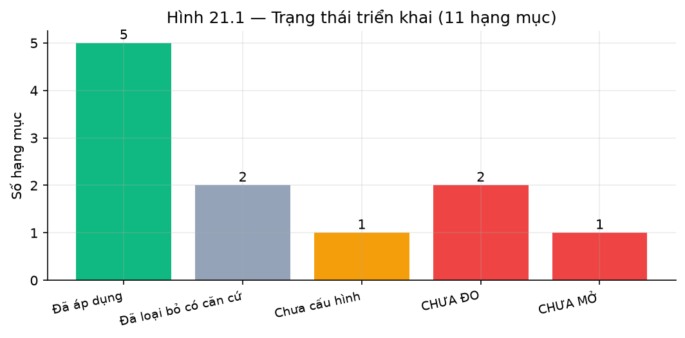

***Hình 5.2: Trạng thái các hạng mục triển khai***

---

# TÀI LIỆU THAM KHẢO

[1] P. Lewis, E. Perez, A. Piktus, F. Petroni, V. Karpukhin, N. Goyal, H. Küttler, M. Lewis,
W. Yih, T. Rocktäschel, S. Riedel, D. Kiela, "Retrieval-Augmented Generation for
Knowledge-Intensive NLP Tasks," *Advances in Neural Information Processing Systems (NeurIPS)*,
vol. 33, pp. 9459–9474, 2020.

[2] V. Karpukhin, B. Oğuz, S. Min, P. Lewis, L. Wu, S. Edunov, D. Chen, W. Yih, "Dense Passage
Retrieval for Open-Domain Question Answering," *Proceedings of the 2020 Conference on Empirical
Methods in Natural Language Processing (EMNLP)*, pp. 6769–6781, 2020.

[3] G. V. Cormack, C. L. A. Clarke, S. Buettcher, "Reciprocal Rank Fusion Outperforms Condorcet
and Individual Rank Learning Methods," *Proceedings of the 32nd International ACM SIGIR
Conference on Research and Development in Information Retrieval*, pp. 758–759, 2009.

[4] S. Robertson, H. Zaragoza, "The Probabilistic Relevance Framework: BM25 and Beyond,"
*Foundations and Trends in Information Retrieval*, vol. 3, no. 4, pp. 333–389, 2009.

[5] S. Es, J. James, L. Espinosa-Anke, S. Schockaert, "RAGAS: Automated Evaluation of
Retrieval Augmented Generation," *Proceedings of the 18th Conference of the European Chapter of
the Association for Computational Linguistics (EACL): System Demonstrations*, pp. 150–158, 2024.

[6] Z. Ji, N. Lee, R. Frieske, T. Yu, D. Su, Y. Xu, E. Ishii, Y. J. Bang, A. Madotto, P. Fung,
"Survey of Hallucination in Natural Language Generation," *ACM Computing Surveys*, vol. 55,
no. 12, pp. 1–38, 2023.

[7] L. Wang, N. Yang, X. Huang, B. Jiao, L. Yang, D. Jiang, R. Majumder, F. Wei, "Text Embeddings
by Weakly-Supervised Contrastive Pre-training," *arXiv preprint arXiv:2212.03533*, 2022.

[8] K. Song, X. Tan, T. Qin, J. Lu, T. Liu, "MPNet: Masked and Permuted Pre-training for Language
Understanding," *Advances in Neural Information Processing Systems (NeurIPS)*, vol. 33,
pp. 16857–16867, 2020.

[9] N. Reimers, I. Gurevych, "Sentence-BERT: Sentence Embeddings using Siamese BERT-Networks,"
*Proceedings of the 2019 Conference on Empirical Methods in Natural Language Processing (EMNLP)*,
pp. 3982–3992, 2019.

[10] K. Järvelin, J. Kekäläinen, "Cumulated Gain-Based Evaluation of IR Techniques," *ACM
Transactions on Information Systems*, vol. 20, no. 4, pp. 422–446, 2002.

[11] Y. Gao, Y. Xiong, X. Gao, K. Jia, J. Pan, Y. Bi, Y. Dai, J. Sun, H. Wang, "Retrieval-Augmented
Generation for Large Language Models: A Survey," *arXiv preprint arXiv:2312.10997*, 2023.

[12] P. Rajpurkar, R. Jia, P. Liang, "Know What You Don't Know: Unanswerable Questions for SQuAD,"
*Proceedings of the 56th Annual Meeting of the Association for Computational Linguistics (ACL)*,
pp. 784–789, 2018.

---

# PHỤ LỤC

## Phụ lục A: Notebook nghiên cứu

Toàn bộ thực nghiệm trong Chương 4 được tái lập trong notebook
`ai/notebooks/rag_llm_system_research.ipynb` (134 ô, chạy sạch không lỗi). Notebook gồm năm phần
tương ứng các chương của báo cáo, cộng năm phụ lục:

| Phần notebook | Nội dung | Tương ứng chương |
|---|---|---|
| Phần I (mục 1–4) | Bài toán, kho tri thức, chuẩn hoá, tập đánh giá | Ch.1, Ch.3.2–3.3 |
| Phần II (mục 5–7) | Bảy phương pháp truy hồi, ablation | Ch.4.2–4.3 |
| Phần III (mục 8–12) | Định tuyến, guardrail, bộ nhớ phiên, kiểm chứng, ba profile | Ch.2.6, Ch.3.4–3.5 |
| Phần IV (mục 13–17) | So sánh chiến lược, thí nghiệm âm tính, so sánh mô hình, chọn profile | Ch.4.4–4.7 |
| Phần V (mục 18–21) | Chốt production, hạn chế, kết luận, điều kiện triển khai | Ch.5 |
| Phụ lục A–E | Tái lập, thuật ngữ, provenance, từ điển dữ liệu, ranh giới | Phụ lục |

## Phụ lục B: Lệnh tái lập thực nghiệm

Chạy theo thứ tự từ thư mục `ai/`:

```bash
# Bước 1 — dựng chỉ mục và artifact offline
python scripts/build_index.py
python evaluation/run_retrieval_experiment.py --method all --split dev --top-k 10 --latency-repetitions 7
python evaluation/summarize_retrieval_comparison.py
python evaluation/run_retrieval_ablation.py --split dev --top-k 10
python evaluation/run_golden_chat_eval.py --split dev --output evaluation/results/golden_chat_e2e.json
python evaluation/run_session_e2e_eval.py

# Bước 2 — thực nghiệm cần gateway LLM
python evaluation/run_pipeline_profile_eval.py
python evaluation/run_intent_classification_eval.py
python scripts/_run_live_tests.py

# Bước 3 — dựng notebook
python scripts/build_rag_llm_research.py
python -m jupyter nbconvert --to notebook --inplace --execute \
    notebooks/rag_llm_system_research.ipynb --ExecutePreprocessor.timeout=1800
```

## Phụ lục C: Cấu trúc mã nguồn

| Đường dẫn | Vai trò |
|---|---|
| `app/rag/retrieval_factory.py` | Dựng các biến thể truy hồi |
| `app/rag/hybrid_retriever.py` | Hợp nhất RRF |
| `app/rag/embedding_retriever.py` | Truy hồi ngữ nghĩa |
| `app/rag/vietnamese_normalizer.py` | Hai đường chuẩn hoá tiếng Việt |
| `app/rag/guardrails.py` | Năm nhóm luật chặn an toàn |
| `app/rag/claim_verifier.py` | Kiểm chứng khẳng định hai lớp |
| `app/rag/kb_info_fast_path.py` | Đường tất định cho FAQ |
| `app/services/assistant.py` | Điều phối pipeline tám bước |
| `evaluation/` | Toàn bộ script đánh giá |

## Phụ lục D: Ma trận chỉ số đầy đủ

Bảng chỉ số đầy đủ kèm mẫu số và chiều tốt được trình bày ở Bảng 2.1 (Chương 2) và Phụ lục B của
notebook nghiên cứu.

## Phụ lục E: Provenance artifact

Mọi artifact được trích dẫn trong báo cáo đều kèm hash SHA-256 và thời điểm sinh, liệt kê đầy đủ
tại Phụ lục C của notebook nghiên cứu. Bảng này cho phép kiểm chứng một con số trong báo cáo có
đến từ artifact hiện tại hay không.

---

*Hết báo cáo.*
