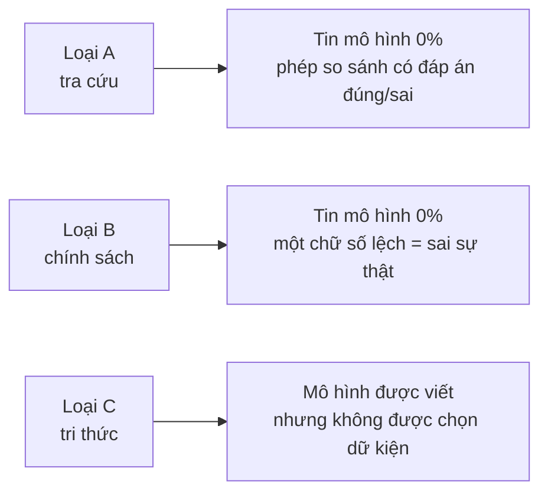
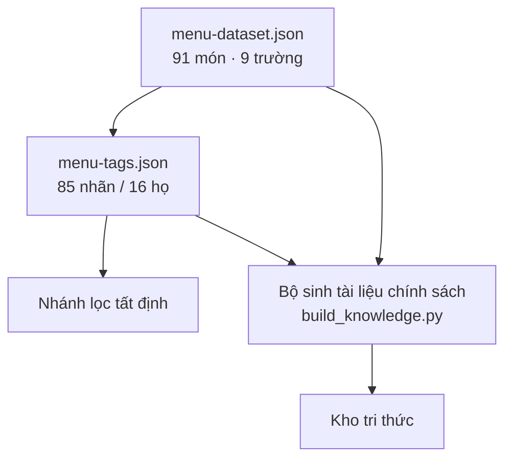
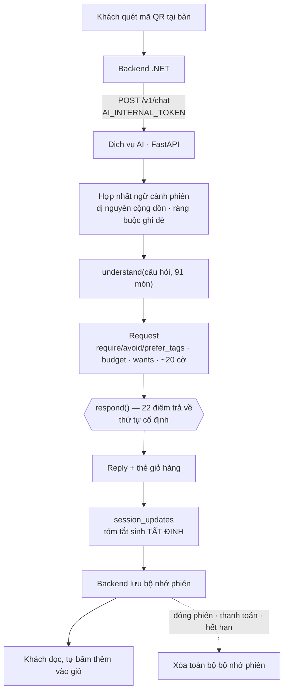
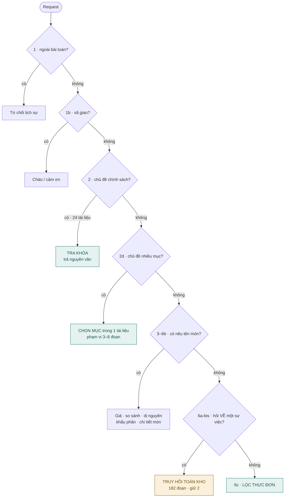
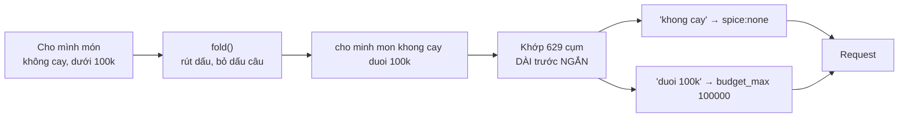
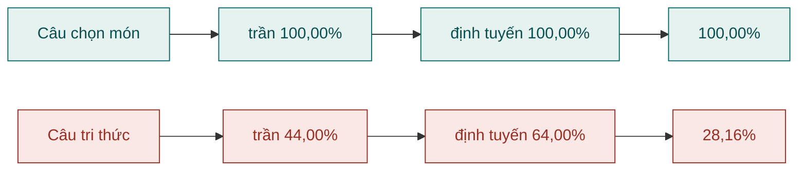

# Trợ lý AI tư vấn đặt món cho nhà hàng: kiến trúc lai giữa suy luận tất định và truy hồi xác suất

**Môn học** Học máy và Khai phá dữ liệu · **Nhóm** 5 thành viên
**Mã nguồn** `restaurant-qr-ai-ordering`, nhánh `safety/nhan-dien-khai-di-ung`

> Mọi con số trong báo cáo này **tính lại được bằng một lệnh** ghi kèm. Không con số nào viết tay.
> Tài liệu này chỉ mô tả hệ thống **đang có trong mã nguồn**; các phiên bản đã bị gỡ bỏ chỉ được
> nhắc tới khi cần giải thích một quyết định, và luôn kèm phép đo dẫn tới quyết định đó.

---

## Tóm tắt

Bài toán đặt ra là xây một trợ lý trả lời câu hỏi của thực khách sau khi quét mã QR tại bàn. Cách
tiếp cận phổ biến cho lớp bài toán này là **Retrieval-Augmented Generation (RAG)**: nạp toàn bộ tri
thức nhà hàng vào một kho văn bản, truy hồi đoạn liên quan, rồi để mô hình ngôn ngữ viết câu trả
lời.

Nghiên cứu của nhóm cho thấy cách tiếp cận đó **giải sai bài toán trên phần lớn không gian câu
hỏi**. Đo trên 310 lượt của hai tập mô phỏng luồng sản phẩm, **96,9% lượt trong một phiên hội thoại
thật không cần chạm tới kho tri thức** — chúng là câu chọn món, và một phép lọc tất định trên nhãn
trả lời chúng **chính xác 100,00%**, trong khi bộ truy hồi tốt nhất chỉ đạt 87,9% ở chỉ số tương
ứng.

Đóng góp chính của đồ án vì vậy không phải "đã xây được một hệ RAG", mà là:

1. **Phân định bằng phép đo** ranh giới giữa câu hỏi nên trả lời tất định và câu hỏi cần truy hồi.
2. **Bốn kết quả âm tính** được báo cáo đầy đủ, mỗi kết quả loại bỏ một thành phần mà trực giác kỹ
   thuật nói là nên có.
3. **Một quy trình đo lường tự phòng vệ**: mọi con số do bộ chạy sinh ra, tài liệu chỉ đọc; và một
   bộ chứng cứ in ra dữ liệu thô để người chấm tự phán xét thay vì tin tỷ lệ.

---

## 1. Bối cảnh và phát biểu bài toán

### 1.1 Ba loại câu hỏi, và vì sao phân loại chúng là quyết định kiến trúc

Khảo sát câu hỏi thực khách có thể đặt ra cho thấy chúng không đồng nhất về **bản chất lời giải**:

| Loại | Ví dụ | Đáp án nằm ở đâu | Kỹ thuật đúng |
|---|---|---|---|
| **A — Tra cứu** | *"Món nào dưới 100.000đ không cay?"* | trường dữ liệu của thực đơn | phép lọc tất định |
| **B — Chính sách** | *"Mấy giờ quán đóng cửa?"* | một câu văn cố định | tra khóa, trả nguyên văn |
| **C — Tri thức** | *"Cùng là gà mà sao món thì mềm món thì dai?"* | trong một đoạn văn | truy hồi rồi tổng hợp |

Phân biệt này **không phải chi tiết cài đặt**. Nó quyết định mức độ được phép tin mô hình ngôn ngữ,
và do đó quyết định toàn bộ kiến trúc:



Câu hỏi loại A có đáp án **đúng/sai rõ ràng**: `price < 100000` là một phép so sánh. Giao nó cho mô
hình sinh là biến một bài toán có lời giải chính xác thành một bài toán xấp xỉ — và nhận về xác
suất sai ở nơi vốn không cần có xác suất nào.

### 1.2 Ràng buộc an toàn

Nhà hàng phục vụ đồ ăn. Một lời khai dị ứng bị bỏ sót không phải lỗi chất lượng mà là lỗi an toàn.
Ràng buộc này định hình ba quyết định kiến trúc được trình bày ở mục 3.4.

### 1.3 Phạm vi và giới hạn khai báo trước

Hệ thống **không** trả lời: số liệu dinh dưỡng định lượng, nguồn gốc nguyên liệu, tình trạng còn/hết
theo thời gian thực, và **câu hỏi bằng tiếng nước ngoài**. Mục 8 trình bày chi tiết cùng phép đo.

---

## 2. Dữ liệu

### 2.1 Thực đơn và hệ thống nhãn

| | |
|---|---|
| Số món | **91** |
| Danh mục | **13** |
| Nhãn được định nghĩa | **85**, chia **16 họ** |
| Nhãn trên mỗi món | **9–21** |
| Họ độc quyền | `spice`, `price` — một món chỉ mang đúng một giá trị |



Độ phủ nhãn quyết định nhãn đó dùng được vào việc gì, và đây là nguyên tắc trung tâm của khâu dữ
liệu:

> **Nhóm nhãn phủ 91/91 món** → thiếu nhãn là **lỗi dữ liệu**, và nhãn dùng để **lọc**.
> **Nhóm phủ một phần** → thiếu nhãn là **chưa ghi nhận**, không phải *không có*; nhãn chỉ dùng để
> **sắp thứ tự**.

Bảng dưới đây là **toàn bộ 16 họ nhãn**, sắp theo độ phủ. Cột cuối là hệ quả trực tiếp của nguyên
tắc trên:

| Họ | Phủ | Giá trị | Dùng để |
|---|---:|---|---|
| `party` | **91/91** | solo 68 · family 32 · friends 31 · share 24 · two_three 11 · three_five 9 | **lọc** |
| `meal` | **91/91** | dinner 64 · lunch 39 · breakfast 22 · late_night 4 | **lọc** |
| `season` | **91/91** | all_year 69 · hot_season 15 · cooling 14 · cold_season 7 | **lọc** |
| `spice` **(độc quyền)** | **91/91** | none 68 · mild 14 · medium 6 · hot 3 | **lọc** |
| `price` **(độc quyền)** | **91/91** | budget 54 · mid 26 · high 10 · premium 1 | **lọc** |
| `occasion` | 79/91 | everyday 53 · drinking 17 · business 12 · banquet 11 · date 4 · birthday 3 | **sắp thứ tự** |
| `flavour` | 72/91 | sweet 43 · rich 29 · fatty 20 · sour 13 · salty 10 · smoky 7 | sắp thứ tự |
| `health` | 67/91 | light 39 · high_protein 30 · healthy 25 · low_calorie 19 · low_fat 8 · no_msg 4 | sắp thứ tự |
| `region` | 65/91 | south 35 · north 16 · hanoi 12 · central 11 · saigon 11 · mekong 5 · danang 4 · hue 3 · highlands 3 · hoian 2 | sắp thứ tự |
| `ingredient` | 57/91 | pork 19 · shrimp 12 · vegetable 12 · chicken 11 · mushroom 10 · tofu 9 · beef 6 · fish 6 · squid 3 · crab 3 | sắp thứ tự |
| `method` | 57/91 | simmered 21 · grilled 10 · fried 7 · steamed 5 · stir_fried 4 · rolled 4 · boiled 3 · roasted 3 · stewed 2 · braised 1 · whole_roast 1 | sắp thứ tự |
| `audience` | 52/91 | child 43 · elderly 29 | sắp thứ tự |
| **`allergen`** | **44/91** | seafood 26 · dairy 12 · peanut 7 · egg 7 · gluten 7 | **fail-closed** |
| `serving` | 24/91 | preorder 12 · takeaway 11 · hot 1 | tra cứu |
| `diet` | 17/91 | vegetarian 17 · vegan 17 | lọc |
| `promo` | 4/91 | popular 3 · signature 2 | sắp thứ tự |

**(độc quyền)** = một món chỉ mang đúng một giá trị của họ nhãn đó.

Ba quan sát rút ra từ bảng này, và cả ba ảnh hưởng tới thiết kế:

**1. `allergen` chỉ phủ 44/91 món — và đó là con số quan trọng nhất bảng.** Nghĩa là 47 món **chưa
được ghi nhận dị nguyên nào**, không phải *không có dị nguyên nào*. Danh sách lọc ra vì vậy **không
phải một kết luận về an toàn**, và hệ thống nói rõ điều đó với khách thay vì im lặng. Bộ rà
`audit_allergen_tags.py` đối chiếu nhãn với mô tả món và đã tìm ra bảy lỗ thật — nhưng mô tả không
phải bảng thành phần, nên **còn thiếu bao nhiêu thì không biết được từ dữ liệu này**.

**2. `diet:vegetarian` và `diet:vegan` gắn trên ĐÚNG CÙNG 17 món.** Trong bộ dữ liệu này, một trong
hai nhãn không phân biệt được gì. Với món chay Việt thì hợp lý — chay Phật giáo vốn không dùng sữa,
trứng — nhưng nghĩa là câu *"có món thuần chay không"* và *"có món chay không"* cho **cùng kết
quả**, và câu trả lời nói ra điều đó thay vì để khách tự đoán.

**3. Nhóm phủ mỏng thì nhãn thiếu không có nghĩa gì.** `occasion:date` chỉ có trên 4 món. Nếu dùng
nó để **lọc** thì câu *"Mình đi hẹn hò, nên gọi món gì?"* chỉ còn đúng một món (Tôm hùm 890.000đ).
Nay dịp ăn dùng để **sắp thứ tự**, không để loại món — và đây là một trong chín cơ chế được đo bằng
ablation ở mục 5.9.

### 2.2 Kho tri thức: một kho, hai chế độ trả lời

| Loại | Số | `answer_mode` | Vào chỉ mục | Đường tới khách |
|---|---:|---|---|---|
| `policy` | **24** | `verbatim` | không | tra khóa, trả **nguyên văn** |
| `written` | **36** | `synthesize` | **182 đoạn** | tra khóa → chọn mục, hoặc truy hồi |
| | **60** | | **213 đoạn tổng** | **174 tiêu đề mục** phân biệt |

Phân chia theo **chế độ trả lời**, không theo chủ đề. Tài liệu `verbatim` chứa thông tin mà một chữ
số lệch là nói sai sự thật về nhà hàng — giờ mở cửa, phụ phí, quy trình khai dị ứng. Chúng không đi
qua bộ xếp hạng, và mô hình không chạm vào chữ.

#### 2.2.1 Hai mươi bốn tài liệu `verbatim` — mỗi tài liệu một câu trả lời

Chúng trả lời câu hỏi chính sách, và **mỗi tài liệu là đúng một khối văn bản**, không chia mục:

| Nhóm | Chủ đề |
|---|---|
| Vận hành | `hours` · `location` · `contact` · `parking` · `wifi` · `smoking` |
| Đặt và thanh toán | `booking` · `payment` · `invoice` · `service_charge` · `price_range` |
| Món và phục vụ | `menu_size` · `preorder` · `takeaway_items` · `delivery` · `spice_levels` · `vegetarian` |
| Khách đặc biệt | `children` · `high_chair` · `accessibility` · `private_room` |
| An toàn thực phẩm | `allergen_labelling` · `kitchen_allergy` · `outside_food` |

**Tám trong số này chứa con số và do máy sinh** từ thực đơn — `menu_size` (91 món / 13 nhóm),
`price_range` (12.000–890.000đ), `preorder` (12 món), `takeaway_items` (11 món), `children` (43 món
trẻ em / 29 món người lớn tuổi), `vegetarian` (17 món), `spice_levels` (68 món không cay),
`allergen_labelling`. Mười sáu tài liệu còn lại là chính sách thật của nhà hàng, không suy được từ
thực đơn.

Lý do tách như vậy: **văn xuôi kể lại dữ liệu thì luôn trôi khỏi dữ liệu**. Một tài liệu viết tay
ghi *"hơn 90 món"* trong khi thực đơn có đúng 91 — sai ngay từ lúc viết, và không ai canh. Tám tài
liệu có số được sinh lại mỗi lần, nên chúng **không thể lệch**.

#### 2.2.2 Ba mươi sáu tài liệu `synthesize` — kho RAG thật

Đây là kho mà bộ truy hồi làm việc trên đó: **182 đoạn, 174 tiêu đề mục phân biệt**. Chúng chia
thành năm nhóm chủ đề:

| Nhóm | Tài liệu | Đoạn |
|---|---|---:|
| **Nhóm món theo loại** | `noodle_soups` · `rice_dishes` · `chicken_dishes` · `hotpot_choosing` · `fresh_fruit` · `dessert_guide` | 25 |
| **Đồ uống** | `beverage_pairing` · `coffee_and_tea` · `juice_and_smoothie` · `beer_and_alcohol` | 23 |
| **Vùng miền** | `hanoi_and_north` · `hue_and_central` · `saigon_and_south` · `highlands_danang` | 20 |
| **Cách gọi món** | `ordering_guide` · `combo_pairing` · `meal_sets` · `sharing_etiquette` · `appetizer_role` · `eating_alone` · `budget_planning` · `value_for_money` · `portion_timing` · `quick_meal` | 51 |
| **Khách và ràng buộc** | `allergy_guidance` · `seafood_caution` · `dietary_limits` · `vegetarian_reality` · `spice_ladder` · `children_elderly` · `date_occasion` · `reading_labels` | 42 |
| **Dùng hệ thống** | `first_visit` · `qr_ordering` · `faq_extended` · `cannot_help` | 27 |

Ba tài liệu đáng chú ý vì chúng làm việc mà nhãn không làm được:

- **`reading_labels`** — *"Cách đọc nhãn trên thực đơn, và giới hạn của chúng"*. Nó nói thẳng với
  khách rằng nhãn `health:*` là **đánh giá cảm quan của người nhập liệu**, không phải kết quả phân
  tích dinh dưỡng. Không nhãn nào truyền đạt được điều đó.
- **`vegetarian_reality`** — *"Ăn chay ở đây: con số thật và chỗ cần cẩn thận"*. Nó nêu việc
  `vegetarian` và `vegan` trùng nhau hoàn toàn, và cảnh báo về nước dùng.
- **`cannot_help`** — *"Những câu trợ lý không trả lời được, và vì sao"*, 9 mục. Tài liệu này tồn
  tại để hệ thống **biết mình không biết gì** thay vì đoán.

#### 2.2.3 Cấu trúc một tài liệu và cách chia đoạn

```yaml
---
id: kb.written.spice_ladder.v1
title: Bốn mức cay và cách chọn theo sức ăn cay
topic_keys: [spice_ladder]        # nối vào từ vựng — có bất biến canh
source: demo                       # demo = người viết · derived = máy sinh
audience: guest                    # BẮT BUỘC, và chỉ nhận giá trị này
answer_mode: synthesize            # synthesize = vào chỉ mục · verbatim = tra khóa
---

# Bốn mức cay và cách chọn theo sức ăn cay

## Phần lớn thực đơn KHÔNG cay
## Ba món cay đậm, và chỉ ba món
## Sáu món cay vừa
...
```

Bốn quy tắc chia đoạn, mỗi quy tắc có lý do đo được:

1. **Chia theo tiêu đề `##`**, không theo số ký tự. Cắt theo ký tự thì một đoạn có thể **đứt giữa
   bảng giá** và mô hình nhận được nửa bảng.
2. **Kèm tiêu đề tài liệu vào mỗi đoạn**, để đoạn tự đủ ngữ cảnh khi được trích rời.
3. **Đoạn quá 400 từ chia tiếp theo `###`**, đặt tên `"<mục> — <mục con>"`.
4. **`chunk_id` tất định** (`{doc_id}#{index}`) để tập đánh giá trỏ vào được.

Cửa `audience: guest` là một **phép từ chối, không phải phép lọc**: bộ nạp **báo lỗi** với tệp không
mang giá trị đó. Lý do là một sự cố thật ở bản trước — 5 tệp hướng dẫn nội bộ cho AI nằm cùng chỉ
mục truy hồi, và 47 đoạn của chúng bị trích ra cho khách đọc. Lọc bỏ thì lần sau lại có tệp lọt vào;
từ chối thì không.

### 2.3 Bất biến chống trôi dữ liệu

Tài liệu kể lại dữ liệu bằng văn xuôi thì **luôn trôi khỏi dữ liệu**. Cách chặn duy nhất là **tính
lại từ dữ liệu mỗi lần**:

```bash
python ai/scripts/build_knowledge.py --check   # 8 tài liệu chính sách có SỐ
python ai/scripts/build_tag_dictionary.py --check
python ai/scripts/audit_allergen_tags.py       # đối chiếu nhãn với mô tả món
```

Tám tài liệu chính sách chứa con số (khoảng giá, số món chay, số món cho trẻ em) **do máy sinh**.
Cổng `--check` trong CI biến "tài liệu không thể lệch" từ một lời hứa thành một bất biến máy canh.

---

## 3. Kiến trúc hệ thống

### 3.1 Luồng một lượt hỏi



Bộ nhớ phiên bị xóa ở **cả ba lối thoát**. Không có đường nào để dữ liệu bàn này rò sang bàn khác.

### 3.2 Bộ định tuyến

Định tuyến **không phải một bộ phân loại**: không mô hình, không điểm tin cậy, không `argmax`. Nó
là một chuỗi cổng có thứ tự cố định; **cổng nào khớp trước thì thắng**.



Thứ tự này không tùy tiện — mỗi vị trí đứng ở đó vì một ca hỏng đo được. Nhánh xã giao phải đứng
trước mọi nhánh chọn món, vì thiếu nó thì *"xin chào"* rơi xuống truy hồi và khách nhận về một danh
sách rượu nếp cẩm.

**Truy hồi đứng gần cuối.** Đó là chủ ý: RAG là phương án cuối, không phải phương án mặc định.

### 3.3 Bên trong bước hiểu câu hỏi



Luật **khớp cụm dài trước, rồi ăn hết đoạn đã khớp** là cơ chế chống đụng chữ sau khi rút dấu. Kiểm
kê: trong 629 cụm, **107 cụm có nguy cơ** — nằm trong cụm khác hoặc nằm trong tên món — và cơ chế
này bảo vệ tất cả.

### 3.4 Ba hằng số gánh cả kiến trúc

```python
BRANCHES_ALLOWED  = frozenset({"filter", "compare"})   # nhánh tri thức KHÔNG được sinh chữ
SO_DOAN_TRI_THUC  = 2                                   # số đoạn trích, xem mục 5.3
LIST_SIZE         = 6                                   # "đổ cả thực đơn ra không phải tư vấn"
```

Và bốn hàng rào an toàn, mỗi cái có test riêng:

| Bất biến | Cơ chế | Vì sao |
|---|---|---|
| Dị nguyên áp **cuối cùng**, không bao giờ nới | fail-closed | thà nói "không có món phù hợp" còn hơn mời món gây dị ứng |
| Dị nguyên **cộng dồn** suốt phiên | bộ nhớ phiên | khai ở lượt 1 thì lượt 5 vẫn phải nhớ |
| AI không tự đặt món | `requires_customer_confirmation` là **hằng số** | không phải trường có thể đặt sai |
| Tóm tắt phiên sinh **tất định** | không nhờ mô hình | bộ nhớ sai thì sai suốt phiên |

---

## 4. Phương pháp đánh giá

### 4.1 Bốn tập, chia theo họ

| Tập | Quy mô | Chấm cái gì |
|---|---:|---|
| `cases.json` | **147 ca** | chất lượng câu trả lời, một lượt |
| `session_scripts.json` | **60 kịch bản / 163 lượt** | bộ nhớ phiên, đa lượt |
| `retrieval_cases.json` | **114 ca** | đoạn được lấy |
| `chunk_selection_cases.json` | **120 ca** | chọn mục trong một tài liệu |
| `golden_e2e` | **103 lượt** | qua stack thật, có backend và giỏ hàng |

Chia theo **họ** chứ không theo ca: hai cách diễn đạt của cùng một câu hỏi luôn nằm cùng một bên,
nếu không thì tập "niêm phong" đã thấy trước lời giải.

### 4.2 Ba nguyên tắc đo lường

**Khóa đáp án là truy vấn, không phải danh sách.** Danh sách viết tay không có cách nào kiểm.

**Ca an toàn là chốt, không phải số liệu.** Một ca chốt đỏ là **chặn**, kể cả khi tỷ lệ chung tăng.

**Bộ dò lỗ tìm lỗi chưa nghĩ tới.** Nó kiểm xem một câu trả lời vô nghĩa có qua được ca nào không.
Khi bịt một lỗ, con số nền tụt từ **0,9960 xuống 0,7368** — tức 99,6% kia gần như hoàn toàn ảo.

### 4.3 Thống kê

Mọi so sánh giữa hai phương pháp dùng **kiểm định McNemar ghép cặp** (hai phương pháp chạy trên
cùng tập ca, đếm số ca lệch chiều), và mọi tỷ lệ kèm **khoảng tin cậy Wilson**. Với n = 50–150,
một ca lệch là 0,7–2 điểm phần trăm, nên chênh lệch dưới ngưỡng đó không được diễn giải.

---

## 5. Kết quả

### 5.1 Chất lượng câu trả lời

| Nhóm | Kết quả |
|---|---|
| Toàn bộ | **147/147** (100,00%) |
| Nhóm chốt an toàn | **21/21** |
| Nhóm phát triển | **78/78** |
| Nhóm niêm phong | **48/48** |
| Bộ nhớ phiên | **163 lượt, không lượt nào đỏ** |
| Golden đầu-cuối | **103/103** ở cả hai cấu hình |

Sàn để so: cách lách *"luôn nói chưa có dữ liệu"* qua được **8/147**. Con số 100% chỉ có nghĩa khi
đặt cạnh sàn này.

### 5.2 So sánh ba phương pháp truy hồi

Trên 66 ca nhắm vào văn xuôi viết tay — **bài toán RAG thật** của hệ thống:

| Phương pháp | Hit@1 | **Hit@2** | Hit@5 | nDCG@5 | **cấm@5** | p50 |
|---|---:|---:|---:|---:|---:|---:|
| BM25 | 0,545 | 0,712 | 0,773 | 0,463 | 9 | **1,0 ms** |
| **Embedding `bge-m3`** | 0,697 | **0,879** | **0,939** | **0,636** | **6** | 302 ms |
| Hybrid RRF | **0,712** | 0,803 | 0,864 | 0,563 | 7 | 300 ms |

Cột **Hit@2** là cột quyết định, vì hệ thống trích đúng 2 đoạn (mục 5.3). Cột **cấm@5** đo việc lấy
đoạn thuộc chủ đề mà câu hỏi **không được chạm** — một bộ xếp hạng "giỏi hơn" mà kéo theo đoạn lạc
chủ đề thì nó không giỏi hơn, nó chỉ tự tin hơn.

**Chốt embedding.** Hybrid nhỉnh hơn ở Hit@1 nhưng thua ở Hit@2, Hit@5, nDCG@5 và cấm@5 — tức thua
ở đúng chỉ số hệ thống dùng.

#### 5.2.1 Vì sao 12,1% còn lại trượt — tám ca sai, hai nguyên nhân

Con số 0,879 nghĩa là **8/66 ca trượt**. Đọc từng ca thì chúng không rải rác mà rơi vào đúng hai
nhóm:

**Nguyên nhân 1 — diễn đạt hoàn toàn không dùng từ của tài liệu (5/8 ca).** Tập đánh giá cố ý có
hai dạng câu cho mỗi tài liệu: dạng A dùng đúng chữ tài liệu dùng, dạng B diễn đạt khác. Cả 8 ca
trượt đều là **dạng B**:

| Câu hỏi | Lấy về | Cần | Chữ khách dùng ↔ chữ tài liệu dùng |
|---|---|---|---|
| *"Bàn đông muốn ăn kiểu **nhúng chung** thì lấy loại gì?"* | `combo_pairing`, `sharing_etiquette` | `hotpot_choosing` | "nhúng chung" ↔ **lẩu** |
| *"Thức uống nóng có **chất kích thích** thì gồm những gì?"* | `spice_ladder`, `beverage_pairing` | `coffee_and_tea` | "chất kích thích" ↔ **caffeine** |
| *"**Vị phía dưới** có ngọt hơn không?"* | `juice_and_smoothie`, `dessert_guide` | `saigon_and_south` | "phía dưới" ↔ **miền Nam** |
| *"**Dịp riêng tư hai người** thì bố trí bàn thế nào?"* | `sharing_etiquette`, `combo_pairing` | `date_occasion` | "riêng tư hai người" ↔ **hẹn hò** |
| *"Mình no rồi mà bạn mình chưa ăn xong, gọi thêm gì?"* | `sharing_etiquette`, `qr_ordering` | `appetizer_role` | tình huống ↔ **khai vị** |

Đây là **giới hạn của phép so vector trên kho nhỏ**, không phải lỗi cài đặt. `bge-m3` biết "nhúng
chung" gần nghĩa "lẩu", nhưng tài liệu `sharing_etiquette` cũng nói về ăn chung và nó thắng ở khoảng
cách cosine. Với 36 tài liệu, khoảng cách giữa "gần đúng" và "đúng" rất hẹp.

**Nguyên nhân 2 — nhầm giữa các tài liệu vùng miền lân cận (3/8 ca).** Kho có 5 tài liệu vùng miền,
và chúng **chồng lấn theo địa lý thật**:

| Câu hỏi | Lấy về | Cần |
|---|---|---|
| *"Vùng nào có nhiều món nồng vị ớt nhất?"* | `saigon_and_south`, `highlands_danang` | `hue_and_central` |
| *"Vùng cao và thành phố biển miền Trung có món nào?"* | `hue_and_central`, `hanoi_and_north` | `highlands_danang` |

Huế ⊂ miền Trung, Đà Nẵng ⊂ miền Trung, Tây Nguyên giáp miền Trung. Bộ nhúng lấy về **tài liệu
vùng miền đúng cấp trên** — không phải một câu trả lời sai hoàn toàn, nhưng không phải tài liệu
khóa đáp án chỉ định.

#### 5.2.2 Sáu ca chạm chủ đề cấm, và chúng đối xứng nhau

Chỉ số `cấm@5` đo việc lấy đoạn thuộc chủ đề mà câu hỏi **không được chạm**. Sáu ca vi phạm, và hai
ca đầu là **một cặp đối xứng**:

```
"Sợi dẹt với sợi tròn thì món nào là món nào?"     → chạm kb.written.rice_dishes   (cần noodle_soups)
"Có mấy món cơm và khác nhau ra sao?"              → chạm kb.written.noodle_soups  (cần rice_dishes)
```

Hai tài liệu này có **cấu trúc song song**: *"Bảy món cơm và cách chọn giữa chúng"* và *"Phở, bún,
mì, hủ tiếu — khác nhau thế nào"*. Cùng khuôn câu hỏi (*"có mấy món X, khác nhau ra sao"*), cùng độ
dài, cùng cách trình bày. Bộ nhúng bắt được **hình dạng câu hỏi** nhưng không tách được **chủ thể**.

Đây là phát hiện có giá trị thiết kế: rủi ro lấy sai chủ đề tập trung ở các cặp tài liệu **song
song về cấu trúc**, không rải đều trên kho. Bốn ca còn lại đều là tài liệu `beverage_pairing` hoặc
`beer_and_alcohol` bị kéo vào câu hỏi về món ăn — cùng một cơ chế.

### 5.3 Số đoạn trích: bài toán đánh đổi

Tăng số đoạn thì tỷ lệ chạm tài liệu đúng tăng — điều đó hiển nhiên. Câu hỏi thật là **cái giá**:

| k | trúng | **CẤM@k** | số từ khách phải đọc |
|---:|---:|---:|---:|
| 1 | 53,95% | **1,97%** | 82 |
| **2** | **70,39%** | **7,24%** | 173 |
| 3 | 76,32% | 9,87% | 271 |
| 5 | 80,92% | **15,79%** | 396 |

| bước | +trúng | +cấm | **đổi được mỗi 1 điểm cấm** |
|---|---:|---:|---:|
| 1 → 2 | +16,44 | +5,27 | **3,12** |
| 2 → 3 | +5,93 | +2,63 | 2,25 |
| **3 → 5** | +4,60 | **+5,92** | **0,78** |

Từ 3 lên 5 là **lỗ**: được 4,60 điểm đúng, trả 5,92 điểm nhiễm chủ đề cấm. Chốt **k = 2**.

### 5.4 Bốn kết quả âm tính

| Đã thử | McNemar | Kết luận |
|---|---:|---|
| Hybrid BM25 + embedding | p = 1,0000 | hoà — không dùng |
| Reranker `bge-reranker-v2-m3` @k=2 | p = 0,8238 | hoà, và **chậm 118×** (p95 81 giây) |
| Gộp tài liệu sinh-theo-nhãn thành 6 | p = 0,5488 | hoà — không đổi cấu trúc |
| Bỏ nhóm tài liệu sinh-theo-nhãn | — | **bỏ được** sau khi từ vựng đưa 99,1% câu của chúng về nhánh lọc |

Ba cách chữa độc lập đều không nâng được truy hồi trên nhóm tài liệu sinh từ nhãn. Đó là bằng chứng
hạn chế nằm ở **cấu trúc dữ liệu**, không ở lựa chọn mô hình — và nó dẫn tới quyết định bỏ chúng
khỏi chỉ mục, đưa chỉ mục về **182 đoạn văn xuôi đồng nhất**.

Dòng cuối có một bài học riêng: phép đo giữ nhóm tài liệu đó lại được thực hiện **trước** khi bổ
sung từ vựng. **Một kết luận đo đúng vẫn hết hiệu lực khi thứ nó đo đã đổi.**

### 5.5 Chất lượng định tuyến



Trần oracle của cả hệ **72,00%**, ước lượng thật **64,08%**, chi phí sai định tuyến **7,92 điểm**.
Con số này tách **lỗi của lớp** khỏi **lỗi của bộ định tuyến** — cải thiện một bộ truy hồi đang bị
định tuyến sai thì không cứu được gì.

### 5.6 Hai cách chấm định tuyến, và cả hai đều phải nêu

Khóa đáp án nghiêm ngặt nói mọi câu tri thức phải đi truy hồi. Nhưng đọc từng câu thì nhiều ca bị
chấm sai vẫn cho câu trả lời **dùng được**:

| Phán xử | Số | Nghĩa |
|---|---:|---|
| **ĐÚNG ĐÍCH** | 32/50 | đi truy hồi như thiết kế |
| **CHẤP NHẬN** | 13/50 | nhánh khác lấy nhưng câu trả lời **dùng được** |
| **SAI THẬT** | 5/50 | câu trả lời không dùng được |

> **64,00%** theo khóa nghiêm ngặt · **90,00%** chấm theo câu trả lời có dùng được không

**Mười ba ca "chấp nhận" — vì sao chúng không phải lỗi.** Năm ca đi vào tra khóa, và tra khóa
**chính xác hơn** truy hồi:

```
"Đặt bàn đông người thì cần báo trước bao lâu?"  → facts:booking
"Lần đầu tới đây, gọi kiểu gì cho khỏi bỡ ngỡ?"  → knowledge:first_visit
"Quán biết món nào còn món nào hết không?"       → policy:time_or_availability
```

Tám ca còn lại đi vào nhánh lọc và **trả về đúng thứ khách xin**:

```
"Mình người Bắc, ăn gì cho hợp khẩu vị quê?"
   → lọc region:north → Xôi gà Hà Nội · Bánh cuốn Thanh Trì · Phở gà ta
```

Danh sách đó **là** câu trả lời đúng, dù khóa đáp án nói phải đi truy hồi.

**Năm ca sai thật, và ba trong đó cùng một nguyên nhân:**

| Câu hỏi | Trả về | Vì sao sai |
|---|---|---|
| *"Ăn lẩu thì nên gọi thêm gì cho đủ bữa?"* | Lẩu nấm chay · Lẩu gà lá é · Lẩu chua cá lăng | khách hỏi gọi thêm gì **ngoài** lẩu, hệ thống trả về lẩu |
| *"Mình ăn cay giỏi, muốn thử vị miền Trung thật đậm"* | Cơm hến Huế · **Mì Quảng chay** · **Bún chay Huế** | lọc theo vùng nhưng **bỏ qua mức cay** |
| *"Muốn cái gì mát mà rẻ, không phải trà sữa"* | Bánh mì pate · Cháo lòng · Gỏi cuốn chay | *(đã sửa — xem 5.6.1)* |
| *"Nhà có người dị ứng tôm mà vẫn muốn ăn đồ biển thì sao?"* | Bánh mì pate · Cháo lòng · Gỏi cuốn chay | câu về **xử lý dị ứng**, nhận ba món không liên quan |
| *"Mình chỉ có ba mươi phút, kịp ăn gì không?"* | Bánh mì pate · Cháo lòng · Gỏi cuốn chay | không ràng buộc nào đọc ra được |

#### 5.6.1 Ba câu khác nhau, một câu trả lời — và nó lộ ra vấn đề gốc

Ba dòng cuối bảng trên trả về **cùng một danh sách**. Đó không phải trùng hợp:

```
"Muốn cái gì mát mà rẻ, không phải trà sữa"        → Bánh mì pate · Cháo lòng · Gỏi cuốn chay
"Nhà có người dị ứng tôm mà vẫn muốn ăn đồ biển?"  → Bánh mì pate · Cháo lòng · Gỏi cuốn chay
"Mình chỉ có ba mươi phút, kịp ăn gì không?"       → Bánh mì pate · Cháo lòng · Gỏi cuốn chay
```

`select()` **không bao giờ từ chối**: khi bước hiểu không đọc ra ràng buộc nào, nó trả về cả thực
đơn rồi phần liệt kê lấy 6 món đầu theo xếp hạng. Ba câu hỏi khác hẳn nhau nhận một câu trả lời.

Điều đáng nói là **cả bốn lớp kiểm soát đều xanh** ở đó — món có thật, giá đúng, không nhãn cấm,
đúng nhánh. Chúng kiểm *"kết quả có thỏa ràng buộc đã đọc không"*, mà ở đây chưa đọc ra ràng buộc
nào, nên không có gì để thỏa.

Truy nguyên câu thứ nhất tìm ra một lỗi cụ thể và đã sửa:

```
"không phải trà sữa"  →  exclude_item_ids=['m_062']   Trà sữa trân châu   ĐÚNG
                      →  avoid_categories=['cat_drink']  cả đồ uống        SAI
```

Cụm danh mục khớp là `tra` (5 món mang chữ đó), nên phủ định nó **loại sạch đồ uống** — khách xin
đồ uống mát và nhận về bánh mì. Ranh giới đúng là **đã có loại trừ theo tên món hay chưa**: nếu bộ
khớp tên món đã bắt được một món cụ thể thì khách đang nêu **một món**, không phải một danh mục.
Sau khi sửa, câu này trả về Canh khổ qua nhồi nấm · Gỏi cuốn tôm thịt · Sương sa hạt lựu · Dưa hấu
lạnh.

#### 5.6.2 Hai va chạm rút dấu trong lớp từ vựng dị nguyên

Rút dấu tiếng Việt là **phép mất thông tin**, và hai lỗi dưới đây là hệ quả trực tiếp:

```
"Mình dị ứng MÌ CHÍNH"                    →  avoid=['allergen:gluten']
"Mình không ăn được món SỐ 2"             →  avoid=['allergen:seafood']
"Có CẢ ông bà, mình không ăn được cay"    →  avoid=['allergen:seafood']
```

- *"mì chính"* rút dấu thành `mi chinh`, và cụm dị nguyên **`mi`** (mì → gluten) khớp vào giữa. Sai
  cả hai chiều: ẩn món có gluten khách ăn được, **và** không chặn thứ khách vừa nói là không dùng
  được. Sửa bằng cách thêm cụm `mi chinh` — luật khớp-cụm-dài-trước tự lo phần còn lại.
- *"số"* và *"sò"* rút dấu về cùng chuỗi `so`. Bỏ cụm `so` khỏi nhóm dị nguyên hải sản: đo trên 627
  câu → **0 câu đổi**, và không món nào trong 91 món có chữ "sò" đứng riêng thành một từ.
- *"cả"* và *"cá"* cũng về cùng chuỗi `ca` — nhưng cụm này **phải giữ**: bỏ nó thì *"Mình dị ứng
  cá"* mất hàng rào dị nguyên. Đây là hạn chế còn tồn, ghi ở mục 8.

Ba lỗi này cùng một lớp, và chúng minh họa vì sao dự án đặt **kiểm kê đụng chữ** thành một test có
số: 629 cụm, **107 cụm có nguy cơ**, và con số đó thay đổi mỗi lần thêm từ vựng.

Hai con số đo hai thứ khác nhau. Con số thứ nhất so sánh được giữa các bản; con số thứ hai là thứ
khách thật cảm nhận. Bộ chạy `run_chung_cu_dinh_tuyen.py` in **dữ liệu thô** — từng câu, nhánh thực
tế, ràng buộc đọc ra, ba món trả về — để người chấm tự phán xét thay vì tin một tỷ lệ.

### 5.7 RAG chạy bao nhiêu trong một luồng thật

Đây là phép đo đổi cách đọc mọi con số phía trên. Chạy 163 lượt kịch bản **như một phiên thật, có
bộ nhớ**, cộng 147 ca tập trả lời:

| Đường đi | 147 ca trả lời | 163 lượt phiên |
|---|---:|---:|
| Thực đơn / nhãn — **không đọc kho** | 63,3% | **96,9%** |
| Tra khóa nguyên văn | 19,7% | 0,6% |
| Chọn mục trong 1 tài liệu | 6,8% | 0,0% |
| **Truy hồi toàn kho** | **0,0%** | **0,0%** |
| Xã giao / ngoài phạm vi / hỏi lại | 10,2% | 2,5% |

**Truy hồi toàn kho chạy 0/310 lượt.** Không phải vì nó hỏng — mà vì mọi câu tri thức trong hai tập
ấy thuộc các chủ đề **đã có khóa**, và tra khóa chính xác hơn xếp hạng.

Trên một phiên trộn có câu tri thức thật, RAG chạy **3/8 lượt**:

```
1. Mình dị ứng hải sản nhé                       → filter
2. Có món nào không cay dưới 100k không?         → filter
3. Cùng là gà mà sao món thì mềm món thì dai?    → TRUY HỒI TOÀN KHO
4. Món đầu tiên giá bao nhiêu?                   → price_lookup
5. Uống cà phê buổi tối có bị mất ngủ không?     → TRUY HỒI TOÀN KHO
6. Đồ chay ở đây có thật sự chay không?          → TRUY HỒI TOÀN KHO
7. Mấy giờ quán đóng cửa?                        → facts:hours (tra khóa)
8. Cho mình món khác đi                          → filter
```

Ràng buộc dị ứng khai ở lượt 1 giữ nguyên suốt cả 8 lượt.

**Một cái bẫy trong chính phép đo:** chạy 163 lượt *không có* bộ nhớ thì 34 lượt (20,9%) trông như
đi truy hồi. Chúng là câu tham chiếu ngược — *"Món đầu tiên giá bao nhiêu?"* — không có gì để trỏ
tới nên rơi xuống truy hồi và lấy về đoạn hoàn toàn lạc. **Đo hội thoại từng lượt rời là đo một hệ
thống không tồn tại.**

### 5.8 Đường sinh bằng mô hình ngôn ngữ

Đo trên 76 ca với mô hình thật:

| | |
|---|---|
| Ca tụt khi bật | **0** |
| Câu sinh được dùng | 68/76 |
| Lùi về khuôn mẫu | 8 — **cả 8 vì bịa số tiền**, bị lớp xác minh chặn |
| Độ trễ thêm | p50 **8,6 giây** · p95 **13,5 giây** |

Ba bảo đảm không đổi khi bật: mô hình **không chọn món** (danh sách do lọc nhãn quyết định), **10
phép xác minh** chạy trước khi gửi, và thẻ giỏ dựng từ `reply.items` chứ không từ chữ mô hình viết.

### 5.9 Ablation — mỗi cơ chế phải tự chứng minh

Tắt từng cơ chế của lớp hiểu câu hỏi, chạy lại 147 ca:

| Cơ chế bị tắt | Qua | Mất | **Lỗi an toàn** |
|---|---:|---:|---:|
| bỏ dấu câu khi chuẩn hóa | 120/147 | −27 | **9** |
| phân biệt món ăn với đồ uống | 133/147 | −14 | **7** |
| lọc theo dị nguyên (fail-closed) | 142/147 | −5 | **5** |
| phân biệt chủ đề dị nguyên với cách hỏi | 144/147 | −3 | **1** |
| phân biệt "rẻ hơn X" với "tầm X" | 146/147 | −1 | **1** |
| ăn hết đoạn đã khớp (chống đụng chữ) | 143/147 | −4 | 0 |
| danh sách món nhà hàng không bán | 145/147 | −2 | 0 |
| nhận tên món rút gọn | 146/147 | −1 | 0 |
| dịp ăn là ngữ cảnh, không phải ràng buộc | 146/147 | −1 | 0 |

**Cả chín cơ chế đều có ít nhất một ca chứng minh giá trị**, và năm trong đó ngăn được lỗi an toàn.
Cột lỗi an toàn quan trọng hơn cột "mất": một cơ chế chỉ cứu một ca nhưng ngăn được lỗi dị ứng thì
vẫn phải giữ.

Hai kết quả đáng chú ý:

**"Bỏ dấu câu" là cơ chế giá trị nhất — và nghe như chuyện làm sạch chữ.** Thiếu nó thì *"mấy giờ mở
cửa**?**"* không khớp cụm `mo cua`, và **27 ca đổ, trong đó 9 lỗi an toàn**. Không ai xếp việc bỏ
dấu chấm hỏi vào nhóm cơ chế an toàn cho tới khi đo.

**"Ăn hết đoạn đã khớp" mất 4 ca — và đó là chặn dưới, không phải giá trị thật.** Kiểm kê cho thấy
**107/629 cụm có nguy cơ** đụng chữ, nhưng tập đánh giá chỉ có ca cho một phần nhỏ trong số đó. Con
số ablation vì vậy **nói về tập đánh giá**, không nói về cơ chế — và nhóm đã lấp bằng chín test
riêng thay vì để con số nói sai.

---

## 6. Bàn luận

### 6.1 Vì sao lọc tất định thắng trên phần lớn không gian câu hỏi

Câu *"món nào dưới 50.000đ"* làm lộ giới hạn của phép so vector: **nó không hiểu số**. Phép so
cosine không biết 45.000 < 50.000; nó chỉ biết chuỗi `"50.000đ"` trông giống chuỗi nào. Lọc theo
nhãn `price` đúng theo định nghĩa.

Đây là kết luận đáng báo cáo nhất của đồ án, và nó đi ngược trực giác "dùng RAG cho mọi thứ":
**không phải chỗ nào cũng nên dùng RAG**, và ranh giới đó đo được.

### 6.2 Định tuyến sai tốn gì

Sai định tuyến tốn **7,92 điểm** chất lượng. Nhưng nó **không tốn an toàn**, và lý do là kiến trúc
chứ không phải may mắn:

- Mọi nhánh nêu món đều đi qua `select()` — nơi dị nguyên áp cuối và không bao giờ nới.
- Nhánh không nêu món **không thể** gây sự cố: truy hồi trả `kind="fact"`, `items` rỗng.
- Danh sách trắng theo nhánh: định tuyến sai vào nhánh ngoài danh sách thì thẻ giỏ **rỗng**.
- Kiểm hai lần, và lần hai **`raise`** chứ không lọc — sửa lặng ở lớp cuối là cách để lớp đầu hỏng
  mà không ai biết.

Đo trên 100 câu chạy sau khi khai dị ứng hải sản, **bao gồm cả những câu bị định tuyến sai**: **0
món vi phạm lọt ra, 0 lần hàng rào cuối phải nổ.**

### 6.3 Chỗ yếu thật, và nó nằm ở đâu

Câu tri thức là mắt xích yếu nhất: **44,00% × 64,00% = 28,16%**. Điểm nghẽn nằm ở **định tuyến**,
không ở mô hình nhúng — và ba cách chữa xếp hạng đã thử đều hoà.

Nhưng con số 64,00% dùng khóa đáp án nghiêm ngặt. Chấm theo câu trả lời có dùng được không thì là
**90,00%**. Trần thật của định tuyến tri thức nằm quanh **70–80%**, không phải 100%, vì khoảng 10
câu trong tập chiều A **đúng là** của nhánh lọc.

---

## 7. Cấu hình triển khai

| Tham số | Giá trị chốt | Căn cứ |
|---|---|---|
| Mô hình nhúng | `BAAI/bge-m3` (1024 chiều) | mục 5.2 |
| Phương pháp truy hồi | **chỉ embedding** | hybrid p = 1,0000 |
| Xếp hạng lại | **không** | p = 0,8238, chậm 118× |
| Số đoạn trích | **2** | mục 5.3 |
| Đường sinh | bật/tắt được | 0 ca tụt, +8,6 giây |
| RAM | 3 GB | `bge-m3` chiếm ~1,4 GB |
| Khởi động | `start_period: 90s` | nạp mô hình |

Mô hình **nướng sẵn vào ảnh Docker** lúc build, vector của 182 đoạn **tính sẵn** bằng
`python -m rag.precompute`, và `HF_HUB_OFFLINE=1` bảo đảm dịch vụ chạy không cần mạng ra ngoài.

Một quan hệ phải giữ: `LLM_TIMEOUT_SECONDS` (30) **nhỏ hơn** `BACKEND_AI_TIMEOUT_SECONDS` (50) —
backend phải còn thời gian nhận câu thoái hóa thay vì tự hết hạn trước.

---

## 8. Hạn chế

1. **Không có nhật ký hội thoại của khách thật.** Mọi ca đánh giá do nhóm viết. Con số đo được hệ
   thống *có tôn trọng ràng buộc hay không*; nó **không** đo được khách thật hỏi gì. Đây là hạn chế
   lớn nhất và không sửa được bằng cách viết thêm ca.

2. **Tập niêm phong đã mở hết.** Không con số nào trong báo cáo này còn là held-out. Muốn kết luận
   held-out lần nữa thì phải viết tập **mới**, chưa từng dùng.

3. **Chỉ hiểu tiếng Việt, và giới hạn này chạm tới an toàn.** Đo trực tiếp qua `understand()`:

   | Câu vào | `require_tags` | `avoid_tags` |
   |---|---|---|
   | `give me a vegetarian dish` | rỗng | rỗng |
   | `I am allergic to seafood` | rỗng | **rỗng** |
   | `cho tôi món chay` | rỗng | rỗng (nhưng `wants=food`) |

   Ô in đậm là chỗ đáng lo: **lời khai dị ứng bằng tiếng Anh không bật hàng rào dị nguyên.**

4. **Nhãn dị nguyên phủ 44/91 món.** Đối chiếu mô tả tìm ra bảy lỗ thật, nhưng mô tả không phải bảng
   thành phần, nên **còn thiếu bao nhiêu thì không biết được từ dữ liệu này**.

5. **Hai va chạm rút dấu không sửa được ở lớp khớp cụm.** *"cả"* và *"cá"* rút dấu về cùng một
   chuỗi; bỏ cụm `ca` thì mất hàng rào cho *"Mình dị ứng cá"* — đã đo, 1 ca đổi và đúng ca quan
   trọng nhất. Phân biệt chúng cần ngữ cảnh mà lớp khớp cụm không có.

6. **Ảnh Docker ~3 GB** vì embedding chạy tại runtime. Giá đã đo và đã chấp nhận.

---

## 9. Kết luận

Đồ án xây dựng một trợ lý tư vấn đặt món theo kiến trúc lai, trong đó **ranh giới giữa suy luận tất
định và truy hồi xác suất được xác định bằng phép đo** thay vì bằng giả định.

Kết quả chính là một hệ thống **đơn giản hơn** thiết kế ban đầu: một mô hình nhúng thay vì ba
phương pháp truy hồi, không xếp hạng lại, kho tri thức nhỏ đi đáng kể. Mỗi lần bỏ bớt đều có một
phép đo nói *"thêm cái này không giúp gì"* — hybrid p = 1,0000, reranker p = 0,8238, gộp tài liệu
p = 0,5488.

> **Kiến trúc cuối gọn hơn kiến trúc đầu, và đó là kết quả của đo lường chứ không phải của việc cắt
> bớt cho kịp.**

Bài học phương pháp đáng giữ nhất: trong đồ án này, số lần **thước đo** sai nhiều hơn số lần **hệ
thống** sai. Thứ phát hiện ra chúng không phải sự cẩn thận mà là kỷ luật **in dữ liệu thô kèm tỷ
lệ** — một bảng số không tự tố cáo được nó sai, còn vài dòng ví dụ thì có.

---

## Phụ lục A — Tái lập toàn bộ kết quả

```bash
# Dữ liệu và tri thức sinh lại được
python ai/scripts/build_knowledge.py --check
python ai/scripts/build_tag_dictionary.py --check
python ai/scripts/audit_allergen_tags.py

# Tập đánh giá và thước đo
python ai/evaluation/validate_cases.py
python ai/evaluation/probe_metric_holes.py
python -m unittest discover -s ai/app -p "test_*.py"          # 429 test
python -m unittest discover -s ai/evaluation -p "test_*.py"   # 143 test

# Số liệu
python ai/evaluation/run_baseline.py --all            # 147/147
python ai/evaluation/run_session_eval.py              # 163 lượt
python ai/evaluation/run_retrieval_comparison.py      # bảng mục 5.2
python ai/evaluation/run_dinh_tuyen.py                # mục 5.5
python ai/evaluation/run_chung_cu_dinh_tuyen.py --md  # bảng chứng cứ mục 5.6
python ai/evaluation/analyze_failures.py
```

## Phụ lục B — Tài liệu kèm theo

| Tài liệu | Nội dung |
|---|---|
| [GIAI_THICH_CHI_TIET.md](GIAI_THICH_CHI_TIET.md) | giải thích toàn bộ dự án: gán nhãn, kho tri thức, truy hồi, phân công |
| `ai/notebooks/he_thong_ai_tu_van_dat_mon.ipynb` | 92 ô, mỗi ô mã tính lại từ mã sống |
| `ai/docs/00`→`07` | nhật ký từng bước dựng hệ thống |
