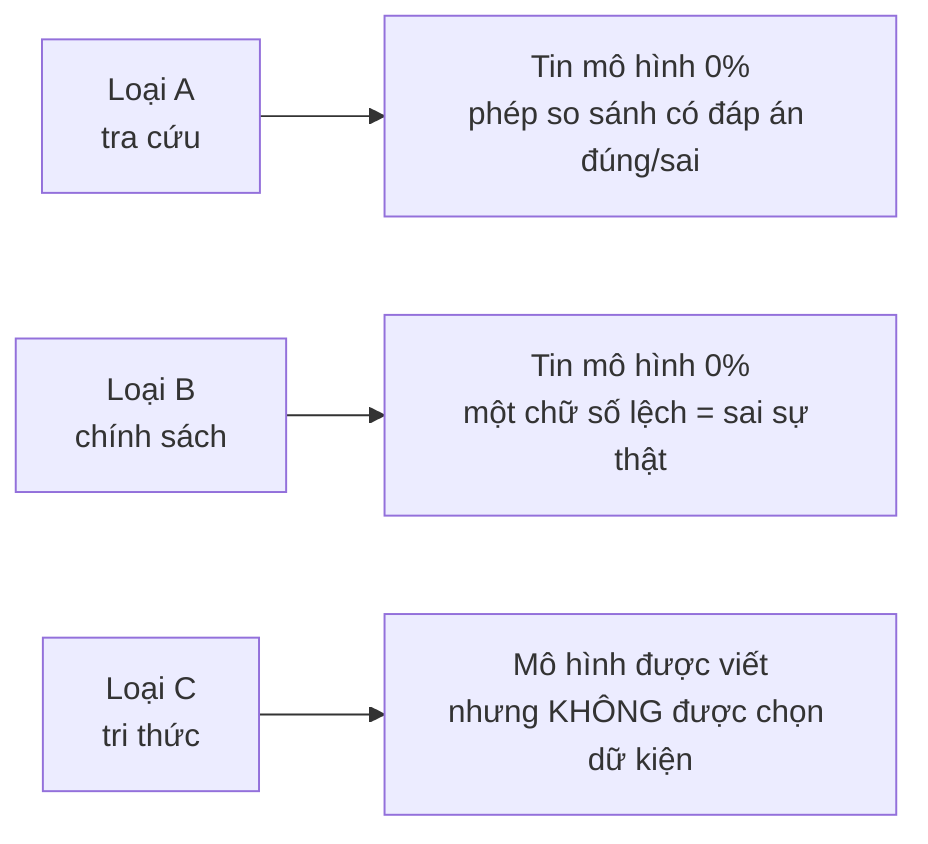
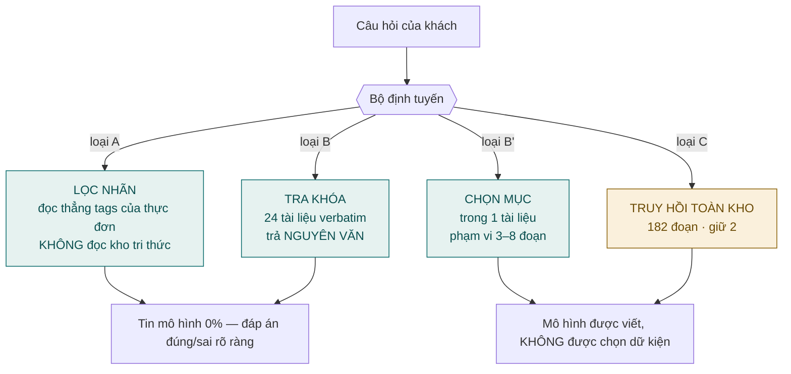
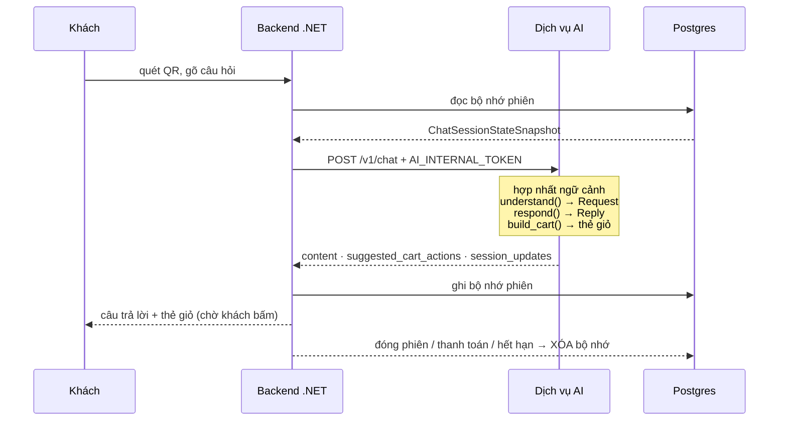
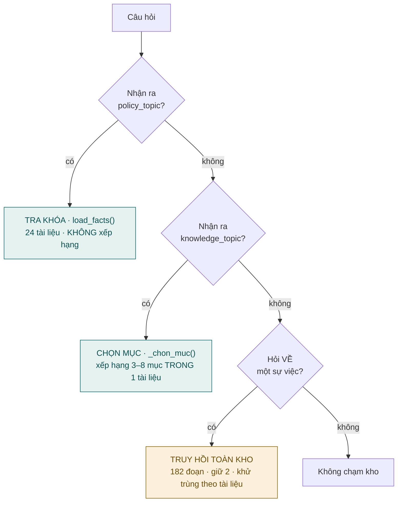
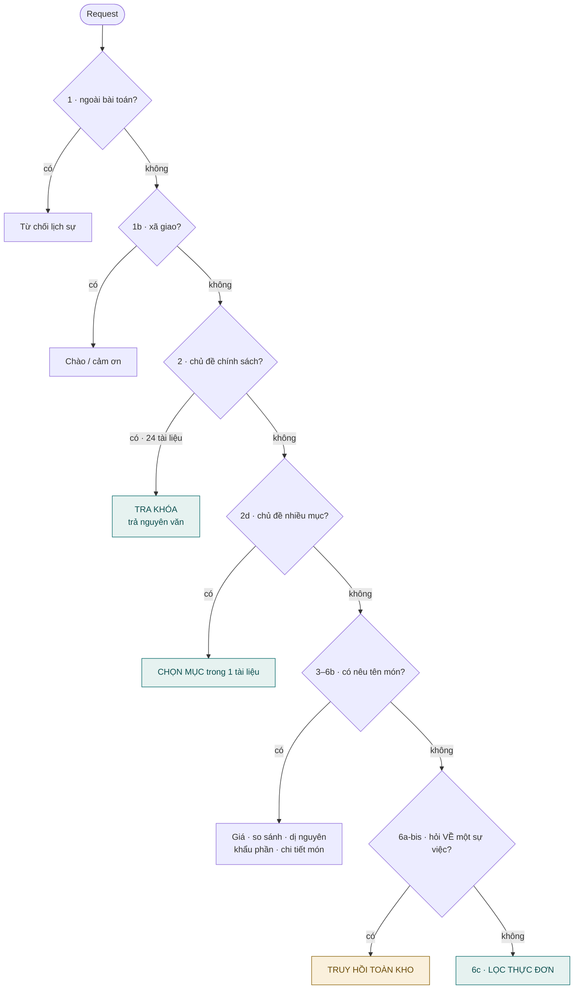
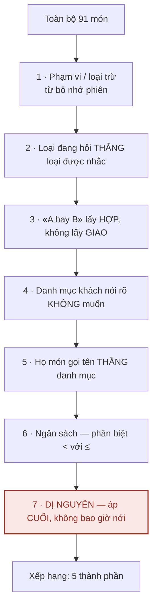
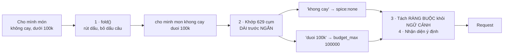
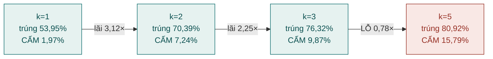
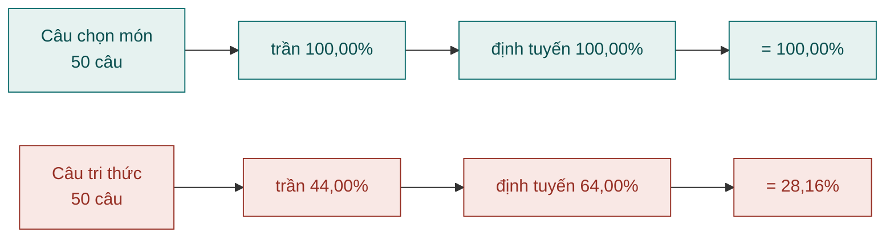

# TRƯỜNG ĐẠI HỌC CMC
## KHOA CÔNG NGHỆ THÔNG TIN VÀ TRUYỀN THÔNG

---

# BÁO CÁO ĐỒ ÁN MÔN HỌC
# MÔN: HỌC MÁY VÀ KHAI PHÁ DỮ LIỆU

**Đề tài:** Hệ thống AI tư vấn gọi món cho nhà hàng
*(Tên đăng ký: Building a Restaurant Food-Ordering Chatbot using LLM and RAG)*

**Khoa/Ngành:** CNTT&TT — Công nghệ Thông tin

**Giảng viên hướng dẫn:** Phạm Ngọc Đông

**Nhóm sinh viên thực hiện:**

| STT | Họ và tên | MSSV | Vai trò |
|:---:|---|---|---|
| 1 | Phạm Duy An | BIT240002 | **Nhóm trưởng** — Dữ liệu & Hiểu câu hỏi |
| 2 | Bùi Đào Đức Anh | BIT240025 | Truy hồi |
| 3 | Đỗ Tuấn Anh | BIT240015 | Chọn món & Giỏ hàng |
| 4 | Lê Anh | BIT240017 | Cổng vào & Phiên |
| 5 | Nguyễn Quang Hiếu | BIT240091 | Đánh giá |

Hà Nội, ngày 09 tháng 08 năm 2026

> **Mọi con số trong báo cáo này tính lại được bằng một lệnh** ghi ở Phụ lục C. Không con số nào
> được người viết gõ vào từ trí nhớ.
>
> Báo cáo chỉ mô tả **hệ thống đang có trong mã nguồn**. Những thành phần đã bị gỡ bỏ chỉ được nhắc
> tới khi cần giải thích một quyết định, và luôn kèm phép đo dẫn tới quyết định đó.

---
---

# MỤC LỤC

- [TÓM TẮT](#tóm-tắt)
- [DANH MỤC THUẬT NGỮ VÀ VIẾT TẮT](#danh-mục-thuật-ngữ-và-viết-tắt)
- [DANH MỤC BẢNG BIỂU VÀ SƠ ĐỒ](#danh-mục-bảng-biểu-và-sơ-đồ)
- [PHÂN CÔNG CÔNG VIỆC](#phân-công-công-việc)
- **[CHƯƠNG 1: GIỚI THIỆU](#chương-1-giới-thiệu)**
  - 1.0 Hệ thống này làm gì — kể bằng một hội thoại
  - 1.1 Bối cảnh và động lực
  - 1.2 Ba loại câu hỏi, và vì sao phân loại chúng là quyết định kiến trúc
  - 1.3 Ràng buộc an toàn — bài toán thật của đồ án
  - 1.4 Các nghiên cứu liên quan
  - 1.5 Mục tiêu và đóng góp
- **[CHƯƠNG 2: CƠ SỞ LÝ THUYẾT](#chương-2-cơ-sở-lý-thuyết)**
  - 2.0 Hai loại thông tin, và hai cách tra khác nhau
  - 2.1 Truy hồi từ khoá — BM25
  - 2.2 Truy hồi ngữ nghĩa — biểu diễn nhúng
  - 2.3 Hợp nhất thứ hạng — Reciprocal Rank Fusion
  - 2.4 Kiến trúc RAG và chỗ nó KHÔNG nên dùng
  - 2.5 Chuẩn hoá văn bản tiếng Việt là phép MẤT thông tin
  - 2.6 Bốn lớp an toàn
  - 2.7 Các chỉ số đánh giá, và chỉ số nào QUYẾT ĐỊNH
- **[CHƯƠNG 3: PHƯƠNG PHÁP](#chương-3-phương-pháp)**
  - 3.1 Kiến trúc — bốn đường trả lời phân theo mức tin cậy
  - 3.2 Hệ thống nhãn: quá trình gán và giới hạn
  - 3.3 Kho tri thức: một kho, hai chế độ trả lời
  - 3.4 Bộ định tuyến — chuỗi cổng, không phải bộ phân loại
  - 3.5 Lớp hiểu câu hỏi
  - 3.6 Bốn tập đánh giá, và kỷ luật chia tập
  - 3.7 Điều kiện kiểm soát thực nghiệm
- **[CHƯƠNG 4: THỰC NGHIỆM VÀ KẾT QUẢ](#chương-4-thực-nghiệm-và-kết-quả)**
  - 4.1 Thiết lập
  - 4.2 Chất lượng câu trả lời
  - 4.3 So ba phương pháp truy hồi
  - 4.4 Số đoạn trích — bài toán đánh đổi
  - 4.5 Bốn kết quả âm tính
  - 4.6 Chất lượng định tuyến, và bằng chứng từng câu
  - 4.7 RAG chạy bao nhiêu trong một luồng thật
  - 4.8 Đường sinh bằng mô hình ngôn ngữ
  - 4.9 Ablation — mỗi cơ chế phải tự chứng minh
  - 4.10 Chốt phương án triển khai, kèm giá đã đo
- **[CHƯƠNG 5: KẾT LUẬN](#chương-5-kết-luận)**
  - 5.1 Tổng kết
  - 5.2 Nhận xét của từng thành viên
  - 5.3 Làm được
  - 5.4 Hạn chế của nghiên cứu
  - 5.5 Bài học kinh nghiệm
  - 5.6 Khó khăn gặp phải
  - 5.7 Hướng phát triển tương lai
- [TÀI LIỆU THAM KHẢO](#tài-liệu-tham-khảo)
- [PHỤ LỤC](#phụ-lục)

---
---

# TÓM TẮT

## Bài toán

Đồ án xây dựng một trợ lý ảo tư vấn thực đơn cho khách quét mã QR tại bàn nhà hàng. Khách đặt câu
hỏi bằng tiếng Việt tự nhiên; hệ thống trả lời và đề xuất món để khách tự thêm vào giỏ hàng.

Dữ liệu gồm thực đơn thật **91 món** được gán **85 nhãn** thuộc **16 họ thuộc tính**, và kho tri
thức **60 tài liệu** chia thành **213 đoạn**, trong đó **182 đoạn** đưa vào chỉ mục truy hồi.

Câu hỏi của khách chia thành hai loại có **bản chất lời giải khác nhau**:

| Loại câu hỏi | Ví dụ | Đáp án nằm ở đâu |
|---|---|---|
| **Chọn món theo điều kiện** | *"Món nào dưới 100 nghìn và không cay?"* | Thuộc tính có cấu trúc của món (giá, nhãn) |
| **Tri thức nhà hàng** | *"Gọi khai vị trước có làm no bụng không?"* | Văn xuôi do người viết |

## Câu hỏi nghiên cứu

Câu hỏi nghiên cứu **không phải** *"áp dụng RAG cho nhà hàng như thế nào"*. Kỹ thuật RAG đã có sẵn
và được dùng rộng rãi. Câu hỏi đặt ra là:

> **Loại câu hỏi nào KHÔNG nên xử lý bằng RAG, và bằng chứng định lượng nào cho thấy điều đó?**

## Kết quả chính

Đo trên **310 lượt** của hai tập mô phỏng luồng sản phẩm: **96,9% lượt trong một phiên hội thoại
thật không cần chạm tới kho tri thức**. Chúng là câu chọn món, và một phép lọc tất định trên nhãn
trả lời chúng **chính xác 100,00%**, trong khi bộ truy hồi tốt nhất chỉ đạt **87,9%** ở chỉ số
tương ứng.

Trên bài toán tri thức — nơi RAG **là** phương pháp đúng — kết quả so ba phương pháp trên 66 ca văn
xuôi viết tay:

| Phương pháp | Hit@1 | **Hit@2** | Hit@5 | nDCG@5 | **cấm@5** | p50 |
|---|---:|---:|---:|---:|---:|---:|
| BM25 | 0,545 | 0,712 | 0,773 | 0,463 | 9 | **1,0 ms** |
| **Embedding `bge-m3`** | 0,697 | **0,879** | **0,939** | **0,636** | **6** | 302 ms |
| Hybrid RRF | **0,712** | 0,803 | 0,864 | 0,563 | 7 | 300 ms |

## Cơ chế bảo đảm an toàn

Hệ thống phục vụ khách có dị ứng thực phẩm, nên yêu cầu an toàn được đặt cao hơn yêu cầu chất lượng
câu chữ. An toàn được bảo đảm bằng **bốn lớp độc lập**, không bằng chỉ dẫn trong lời nhắc mô hình:

1. **Lọc dị nguyên fail-closed** — món mang nhãn dị nguyên khách nêu bị loại trước khi mô hình nhìn thấy
2. **Danh sách trắng nhánh** — `BRANCHES_ALLOWED = {filter, compare}`; nhánh tri thức không được sinh chữ
3. **Mười phép kiểm xác minh** — câu do mô hình viết bị đối chiếu với dữ liệu gốc; vi phạm thì **bỏ cả câu**
4. **Thẻ giỏ hàng tất định** — dựng từ danh sách món đã lọc, không đọc chữ mô hình viết

## Đóng góp

1. **Phân định bằng phép đo** ranh giới giữa câu hỏi nên trả lời tất định và câu hỏi cần truy hồi.
2. **Bốn kết quả âm tính** được báo cáo đầy đủ, mỗi kết quả loại bỏ một thành phần mà trực giác kỹ
   thuật nói là nên có: hybrid (p = 1,0000), xếp hạng lại (p = 0,8238), gộp tài liệu (p = 0,5488).
3. **Một quy trình đo lường tự phòng vệ**: mọi con số do bộ chạy sinh ra; và một bộ chứng cứ in ra
   **dữ liệu thô** để người chấm tự phán xét thay vì tin tỷ lệ.

## Hạn chế

Hạn chế lớn nhất: **không có nhật ký hội thoại của khách thật**. Toàn bộ ca đánh giá do nhóm tự
viết, nên chúng đo được hệ thống *có tôn trọng ràng buộc hay không*, nhưng không đo được *khách
thật sẽ hỏi những gì*. Ngoài ra, tập niêm phong đã được mở hết trong quá trình làm.

**Từ khoá:** Trợ lý ảo nhà hàng; Sinh văn bản có tăng cường truy hồi (RAG); Truy hồi thông tin;
BM25; Biểu diễn nhúng đa ngữ; Hợp nhất theo nghịch đảo thứ hạng (RRF); Lọc theo nhãn; An toàn dị
nguyên; Xử lý tiếng Việt; Đánh giá hệ thống hội thoại.

---
---

# DANH MỤC THUẬT NGỮ VÀ VIẾT TẮT

| Viết tắt | Thuật ngữ đầy đủ |
|---|---|
| RAG | Retrieval-Augmented Generation — sinh văn bản có tăng cường truy hồi |
| LLM | Large Language Model — mô hình ngôn ngữ lớn |
| BM25 | Best Matching 25 — hàm xếp hạng theo tần suất từ |
| RRF | Reciprocal Rank Fusion — hợp nhất theo nghịch đảo thứ hạng |
| IDF | Inverse Document Frequency — tần suất tài liệu nghịch đảo |
| Hit@k | Tỷ lệ có ít nhất một kết quả đúng trong k kết quả đầu |
| **Hit@2** | **Chỉ số QUYẾT ĐỊNH ở đây**, vì hệ thống trích đúng 2 đoạn |
| cấm@k | Số ca lấy phải đoạn **bị cấm** trong k đoạn đầu — đo việc trả lời SAI, không phải kém |
| MRR | Mean Reciprocal Rank — trung bình nghịch đảo thứ hạng |
| nDCG | normalized Discounted Cumulative Gain |
| Đoạn (chunk) | Một mẩu tài liệu đủ nhỏ để đưa cho mô hình đọc; kho này cắt theo tiêu đề mục |
| Fail-closed | Không chắc thì **từ chối**, không đoán. Thà nói "không có món phù hợp" còn hơn mời nhầm món gây dị ứng |
| Đường tất định | Đường trả lời không gọi mô hình sinh — giống nhau mọi lần chạy |
| Đường sinh | Nhánh mô hình VIẾT câu trả lời, qua mười phép kiểm xác minh |
| Xác minh (verify) | Kiểm câu mô hình viết trước khi gửi; vi phạm là BỎ cả câu, không sửa |
| Ablation | Tắt từng cơ chế rồi đo lại, để biết cơ chế đó có thật sự đóng góp gì không |
| Tập niêm phong | Tập câu hỏi giấu đi, **chỉ mở một lần** khi đã làm xong — như đề thi. Mở rồi thì nó không còn là đề thi nữa |
| Fold (rút dấu) | Bỏ dấu tiếng Việt để khớp chuỗi — phép **mất thông tin** |
| p50 / p95 | Phân vị 50 / 95 của phân bố độ trễ |
| McNemar | Kiểm định ghép cặp cho hai phương pháp chạy trên cùng tập ca |
| Wilson | Phương pháp tính khoảng tin cậy dùng được cả khi tỷ lệ đạt 100% |

---
---

# DANH MỤC BẢNG BIỂU VÀ SƠ ĐỒ

Mọi con số trong các bảng dưới đây được **tính lúc chạy bộ đo**, từ tệp dữ liệu và từ
`ai/evaluation/measurements/`. Không con số nào gõ tay.

| Ký hiệu | Mô tả | Mục |
|---|---|---|
| Sơ đồ 1.1 | Ba loại câu hỏi và mức được phép tin mô hình | 1.2 |
| Bảng 2.1 | Ba dạng ràng buộc mà xếp hạng theo độ giống không diễn đạt được | 2.4 |
| Sơ đồ 3.1 | Bốn đường trả lời phân theo mức tin cậy | 3.1 |
| Sơ đồ 3.2 | Luồng một lượt hỏi, từ HTTP tới JSON trả về | 3.1 |
| Bảng 3.1 | Toàn bộ 16 họ nhãn, độ phủ, và hệ quả sử dụng | 3.2 |
| Bảng 3.2 | Hai mươi bốn tài liệu `verbatim` theo nhóm chủ đề | 3.3 |
| Bảng 3.3 | Ba mươi sáu tài liệu `synthesize` theo nhóm chủ đề | 3.3 |
| Sơ đồ 3.3 | Ba đường tới kho tri thức | 3.3 |
| Sơ đồ 3.4 | Bộ định tuyến — chuỗi cổng có thứ tự cố định | 3.4 |
| Sơ đồ 3.5 | Bên trong `select()` — thứ tự áp ràng buộc | 3.4 |
| Bảng 3.4 | Bốn tập đánh giá và kỷ luật chia tập | 3.6 |
| Bảng 4.1 | Điều kiện thực nghiệm | 4.1 |
| Bảng 4.2 | So ba phương pháp truy hồi trên nhóm `written` | 4.3 |
| Bảng 4.3 | Năm ca trượt Hit@2 do diễn đạt khác | 4.3.1 |
| Bảng 4.4 | Sáu ca chạm chủ đề cấm | 4.3.2 |
| Bảng 4.5 | Đánh đổi số đoạn trích | 4.4 |
| Bảng 4.6 | Bốn kết quả âm tính | 4.5 |
| Bảng 4.7 | Chi phí sai định tuyến | 4.6 |
| Bảng 4.8 | Năm ca định tuyến sai thật | 4.6.2 |
| Bảng 4.9 | Phân bố đường đi trong luồng thật | 4.7 |
| Bảng 4.10 | Kết quả đường sinh và giá phải trả | 4.8 |
| Bảng 4.11 | Ablation — chín cơ chế | 4.9 |
| Bảng 4.12 | Chốt phương án triển khai | 4.10 |
| Bảng 5.1 | Tổng hợp kết quả cuối | 5.1 |

---
---

# PHÂN CÔNG CÔNG VIỆC

## Cách chia: theo THỨ TỰ XÂY DỰNG

Hệ thống này có ràng buộc phụ thuộc rất chặt. Không có nhãn thì không lọc được món. Không có kho
tri thức thì không truy hồi được. Và **không có tập đánh giá thì không ai biết mình làm đúng hay
sai**.

Vì vậy nhóm không chia theo module. Chia theo module thì năm người khởi động cùng lúc rồi ba người
ngồi chờ. Nhóm chia theo **chặng xây dựng**: mỗi người bàn giao một thứ mà người sau **dùng được
ngay**.

```
CHẶNG 1    Phạm Duy An        DỮ LIỆU              91 món · 85 nhãn · 60 tài liệu
              |                (nhóm trưởng)
              |  giao bộ nhãn và kho cho chặng 2, rồi làm tiếp phần hiểu câu hỏi
              v
CHẶNG 2    Nguyễn Quang Hiếu  ĐÁNH GIÁ             147 ca · 163 lượt · 114 ca truy hồi
              |                                     120 ca chọn mục
              |  viết được NGAY, không phải chờ ai — xem lý do ngay dưới
              v
CHẶNG 1b   Phạm Duy An        HIỂU CÂU HỎI         629 cụm -> Request
              |                                     (chạy song song với chặng 2)
              v
CHẶNG 3    Bùi Đào Đức Anh    TRUY HỒI             -> Evidence, tối đa 2 đoạn
              |                                     đo ngay bằng 114 ca
              v
CHẶNG 4    Đỗ Tuấn Anh        CHỌN MÓN & GIỎ HÀNG  -> Reply + thẻ giỏ
              |                                     đo ngay bằng 147 ca
              v
CHẶNG 5    Lê Anh             PHIÊN & TÍCH HỢP     -> dịch vụ HTTP chạy thật
              |                                     đo ngay bằng 163 lượt
              v
CHẶNG 6    Nguyễn Quang Hiếu  ĐÓNG VÒNG            golden 103 lượt qua stack thật
```

## Bảng phân công

| # | Họ và tên | MSSV | Chặng | Bàn giao cho người sau | Mục báo cáo | % |
|:-:|---|---|---|---|---|:-:|
| 1 | Phạm Duy An | BIT240002 | **Dữ liệu & hiểu câu hỏi** *(nhóm trưởng)* | Bộ nhãn, kho tri thức, và `Request` đã hiểu | 2.5, 3.2, 3.3, 3.5 | 20% |
| 2 | Nguyễn Quang Hiếu | BIT240091 | **Đánh giá** | Bốn tập ca có khoá đáp án, thước đo, cổng CI | 2.7, 3.6, 4.1–4.2, 4.6 | 20% |
| 3 | Bùi Đào Đức Anh | BIT240025 | **Truy hồi** | Đoạn tri thức cho câu ngoài thực đơn | 2.1–2.4, 4.3, 4.4 | 20% |
| 4 | Đỗ Tuấn Anh | BIT240015 | **Chọn món & an toàn** | Danh sách món, thẻ giỏ, bốn lớp an toàn | 2.6, 4.8, 4.9 | 20% |
| 5 | Lê Anh | BIT240017 | **Phiên & tích hợp** | Dịch vụ HTTP, bộ nhớ phiên, ghép với backend | 3.1, 3.7, 4.10 | 20% |

## Vì sao khâu đánh giá đứng thứ HAI chứ không đứng cuối

Đây là điểm khác biệt lớn nhất so với cách chia thông thường, và nó dựa trên một tính chất cụ thể
của tập đánh giá: **khoá đáp án là một ĐIỀU KIỆN, không phải một danh sách kết quả.**

Mở bất kỳ tập nào cũng thấy điều đó:

```json
cases.json            "expect": {"kind": "fact", "facts": {"m_008": {"price": 75000}}}
retrieval_cases.json  "expected": [{"topic_keys_any": ["combo_pairing"]}]
session_scripts.json  "expect": {"forbid_tags_any": ["allergen:seafood"]}
```

Không khoá nào nhắc tới mã nguồn. Chúng chỉ nhắc tới **thực đơn**, **bộ nhãn** và **siêu dữ liệu của
kho tri thức** — đúng ba thứ mà chặng 1 giao ra.

Nghĩa là người làm đánh giá viết được **toàn bộ** tập ca trước khi ba người sau viết dòng mã đầu
tiên. Nhờ vậy ba chặng sau có thước đo **trước khi bắt đầu**, và điều kiện nghiệm thu của họ là một
con số chứ không phải một lời hứa.

Nếu để đánh giá đứng cuối thì bốn chặng trước **xây mà không đo** — và đó đúng là bệnh mà đồ án này
đã mắc một lần: mỗi đường xử lý đều "chạy đúng" theo người viết ra nó, nhưng không ai đo cả hệ
thống.

**Người làm đánh giá là người duy nhất xuất hiện hai lần trong chuỗi**, vì một lý do có thật: bộ
golden phải chạy qua stack thật, nên nó buộc phải nằm sau chặng tích hợp. Mọi phần còn lại của khâu
đánh giá thì không cần chờ.

## Một chi tiết bàn giao dễ bỏ sót

Chặng 1 phải giao **đúng thứ tự: dữ liệu trước, hiểu câu hỏi sau**. Người làm đánh giá chỉ cần dữ
liệu để viết tập ca; họ không dùng tới `understand.py`. Giao ngược thứ tự thì họ ngồi chờ 2.417 dòng
mã mà mình không cần.

## Điều kiện nghiệm thu từng chặng

Mỗi chặng có **điều kiện nghiệm thu bằng số** — người sau chỉ bắt đầu khi số đó đạt. Đây là chỗ
tránh được lỗi hay gặp nhất của đồ án nhóm: bàn giao một thứ "chạy được trên máy em", rồi ba tuần
sau người khác mới phát hiện nó sai.

| Chặng | Điều kiện nghiệm thu |
|---|---|
| **1 · Dữ liệu** | hai nguồn thực đơn khớp **91/91 món**; mọi tệp dẫn xuất `--check` xanh; bộ rà nhãn **0 lỗ** |
| **2 · Đánh giá** | bốn tập có khoá đáp án dạng điều kiện; bộ dò lỗ của chính thước đo báo **0 lỗ** |
| **1b · Hiểu câu hỏi** | kiểm kê đụng chữ khớp con số đã ghi; đo bằng cách **chạy `understand()` thật** |
| **3 · Truy hồi** | 114 ca chạy trên cả ba bộ; bảng so có cột `cấm@5`; quyết định chốt **có số đi kèm** |
| **4 · Chọn món** | **0 lỗi an toàn** trên mọi tập; câu sinh vi phạm thì **bị bỏ**, không sửa |
| **5 · Tích hợp** | dịch vụ trả lời được **khi mô hình không cấu hình**; bộ nhớ giữ dị nguyên qua mọi lượt |
| **6 · Đóng vòng** | 103/103 lượt golden; mọi cổng CI xanh |

## Đường tới hạn, và chỗ chạy song song được miễn phí

```
tới hạn:    dữ liệu -> tập ca -> truy hồi -> chọn món -> tích hợp -> golden
song song:  chặng 1b (hiểu câu hỏi) chạy cùng lúc với chặng 2 (tập ca)
            chặng 4 dựng select() bằng Request, chưa cần Evidence tới nhánh tri thức
```

Chỉ **hai người đầu** nằm trên đường tới hạn ở đoạn đầu. Ba người còn lại không ai phải chờ quá một
chặng.

## Vì sao chia đều 20%

Không phải để "cho công bằng". Năm chặng đều là mắt xích **bắt buộc**: bỏ chặng nào thì hệ thống
không chạy, hoặc chạy mà không ai chứng minh được nó đúng. Trong một đồ án học máy, một hệ thống
không có phương pháp đo thì không có căn cứ để khẳng định nó hoạt động đúng — nên khâu đánh giá
nặng ngang bốn khâu kia.

---
---

# CHƯƠNG 1: GIỚI THIỆU

## 1.0 Hệ thống này làm gì — kể bằng một hội thoại
Mục này theo **một hội thoại thật** chạy qua hệ thống, chỉ ra ở mỗi lượt hệ thống đã làm gì.

Bối cảnh: khách ngồi xuống bàn, quét mã QR, mở giao diện chat.

#### Lượt 1 — khách khai dị ứng

> **Khách:** *"Mình dị ứng hải sản nhé"*

Hệ thống làm ba việc:

1. **Đọc câu** và nhận ra cụm *"dị ứng hải sản"* → ghi ra một ràng buộc: `tránh allergen:seafood`
2. **Ghi vào bộ nhớ phiên** — ràng buộc này sẽ còn hiệu lực tới hết bữa
3. **Trả lời** xác nhận đã ghi nhận

Điều quan trọng: từ giây phút này, **26 món hải sản trong thực đơn bị loại khỏi mọi câu trả lời sau
đó**, kể cả khi khách không nhắc lại.

#### Lượt 2 — khách hỏi món

> **Khách:** *"Có món nào không cay dưới 100k không?"*

Hệ thống **không** hỏi AI câu này. Nó làm một phép lọc trên bảng:

```
91 món
  → bỏ món có nhãn allergen:seafood   (ràng buộc từ lượt 1)
  → giữ món có nhãn spice:none        ("không cay")
  → giữ món có giá < 100.000          ("dưới 100k")
  → sắp thứ tự, lấy 6 món đầu
```

Kết quả **chính xác 100%**, vì `giá < 100.000` là một phép so sánh có đáp án đúng/sai rõ ràng — không
có chỗ nào để đoán sai.

> **Đây là luận điểm chính của cả đồ án.** Nhiều hệ thống trợ lý sẽ đưa câu này cho AI xử lý. Nhóm
> đo được rằng làm vậy **kém hơn hẳn**: cách của AI là tìm món có mô tả *nghe giống* câu hỏi, mà
> "nghe giống" không phải "thoả điều kiện". Chi tiết ở mục 2.4 và 4.7.

#### Lượt 3 — khách hỏi một câu KHÔNG tra bảng được

> **Khách:** *"Cùng là gà mà sao món thì mềm món thì dai?"*

Câu này **không có cột nào để lọc**. Đáp án nằm trong một đoạn văn do người viết — nói về cách chế
biến ảnh hưởng tới kết cấu thịt.

Đây là lúc **truy hồi** vào việc:

```
câu hỏi → so với 182 đoạn văn trong kho → lấy 2 đoạn liên quan nhất
        → trích NGUYÊN VĂN cho khách đọc
```

Chú ý chữ **nguyên văn**: hệ thống không để AI viết lại đoạn đó. Mỗi chữ khách đọc đều là chữ có sẵn
trong kho.

#### Lượt 4 — khách hỏi ngược lại lượt trước

> **Khách:** *"Món đầu tiên giá bao nhiêu?"*

*"Món đầu tiên"* không có nghĩa gì nếu đứng một mình. Hệ thống phải **nhớ** danh sách vừa đưa ở lượt
2, rồi tra giá món đầu trong danh sách đó.

Không có bộ nhớ phiên thì câu này rơi vào truy hồi và lấy về một đoạn hoàn toàn không liên quan.
Nhóm đo được: bỏ bộ nhớ đi thì **34 trong 163 lượt** hỏng đúng kiểu này.

#### Lượt 5 — khách bấm thêm vào giỏ

Kèm mỗi câu trả lời có món là một **thẻ giỏ hàng** — nút bấm để khách tự thêm món vào giỏ.

**AI không bao giờ tự đặt món.** Thẻ chỉ là gợi ý, và nó được dựng từ **danh sách món mà phép lọc đã
chọn**, không phải từ chữ mà AI viết ra. Nên kể cả khi AI viết sai một cái tên, khách cũng không đặt
được món không tồn tại.

#### Kết thúc — khách thanh toán

Bộ nhớ phiên **bị xoá sạch**. Bàn tiếp theo bắt đầu từ số không, không thấy gì của bàn trước.

---

### Tóm lại, hệ thống có bốn đường trả lời

| Đường | Dùng cho câu | Ví dụ | AI có được viết chữ không? |
|---|---|---|---|
| **Lọc nhãn** | chọn món theo điều kiện | *"món nào dưới 100k?"* | không — chỉ tra bảng |
| **Tra khoá** | chính sách nhà hàng | *"mấy giờ đóng cửa?"* | không — trả nguyên văn |
| **Chọn mục** | tri thức đã biết chủ đề | *"bốn mức cay khác nhau sao?"* | không — trích nguyên văn |
| **Truy hồi** | tri thức chưa biết chủ đề | *"cùng là gà sao món mềm món dai?"* | không — trích nguyên văn |

Và đây là điều nhiều người ngạc nhiên: **cả bốn đường đều không để AI tự viết dữ kiện.** AI chỉ được
diễn đạt lại cho tự nhiên hơn, ở **hai** nhánh, và câu nó viết phải qua **mười phép kiểm** trước khi
gửi cho khách.

---

## 1.1 Bối cảnh và động lực

Khách vào nhà hàng, quét mã QR ở bàn, và mở được một trang gọi món. Câu hỏi của đồ án là: **trợ lý
AI thêm được gì vào đúng chỗ đó?** Thực đơn có 91 món chia 13 danh mục — đủ nhiều để khách không đọc
hết, và đủ ít để mọi câu hỏi đều có đáp án xác định trong dữ liệu.

Điều đó đặt ra một tình thế đặc biệt so với các bài toán trợ lý thường gặp: **phần lớn câu hỏi của
khách có đáp án ĐÚNG, tra được, không cần suy đoán.** Câu *"Phở bò tái nạm bao nhiêu tiền?"* có một
câu trả lời và chỉ một. Một hệ thống sinh văn bản trả lời câu đó là một hệ thống có cơ hội sai ở chỗ
không cần có cơ hội nào.

Nên động lực của đồ án không phải "làm chatbot cho nhà hàng" mà là câu hỏi hẹp hơn và đo được hơn:

> **Ranh giới giữa việc TRA và việc SINH nằm ở đâu, và ranh giới đó nên được ép bằng cấu trúc hay
> bằng lời nhắc mô hình?**

## 1.2 Ba loại câu hỏi, và vì sao phân loại chúng là quyết định kiến trúc

Khảo sát câu hỏi thực khách có thể đặt ra cho thấy chúng không đồng nhất về **bản chất lời giải**:

| Loại | Ví dụ | Đáp án nằm ở đâu | Kỹ thuật đúng |
|---|---|---|---|
| **A — Tra cứu** | *"Món nào dưới 100.000đ không cay?"* | trường dữ liệu của thực đơn | phép lọc tất định |
| **B — Chính sách** | *"Mấy giờ quán đóng cửa?"* | một câu văn cố định | tra khóa, trả nguyên văn |
| **C — Tri thức** | *"Cùng là gà mà sao món thì mềm món thì dai?"* | trong một đoạn văn | truy hồi rồi tổng hợp |

**Sơ đồ 1.1 — Ba loại câu hỏi và mức được phép tin mô hình**



Loại A cấm sinh vì có đáp án xác định: `price < 100000` là một phép so sánh, và một mô hình viết lại
nó chỉ thêm cơ hội sai. Loại B cấm sinh vì nội dung là **chữ của người viết tài liệu**, và một chữ
số lệch trong câu chính sách là nói sai sự thật về nhà hàng.

Phân loại này **không phải nhãn cho vui**: nó thành **danh sách trắng nhánh được phép sinh** trong
mã nguồn —

```python
BRANCHES_ALLOWED = frozenset({"filter", "compare"})
```

— nên mô hình *không có đường* ghi chữ cho khách ở loại A và B. Đó là khác biệt giữa "bảo mô hình
đừng làm" và "mô hình không làm được".

## 1.3 Ràng buộc an toàn — bài toán thật của đồ án

Nhãn dị nguyên trong thực đơn phủ **44/91 món**. Con số đó định hình toàn bộ phần an toàn, vì nó
nói: **"thực đơn không ghi nhận hải sản" KHÔNG đồng nghĩa "món này an toàn"** — nó chỉ nói dữ liệu
không có ghi chép.

Hệ quả là hai yêu cầu, và cả hai đều đo được:

1. **Fail-closed.** Khách khai dị ứng thì món mang nhãn đó tuyệt đối không được nêu — kể cả khi kết
   quả rỗng. Thà nói *"không có món nào phù hợp"* còn hơn mời một món có thể gây hại.
2. **Nói ra giới hạn.** Câu trả lời phải mời khách nhắc nhân viên để bếp xác nhận. Đây **không** phải
   câu khách sáo mà là **nội dung**: nó là chỗ duy nhất trong câu trả lời nói rằng dữ liệu chỉ phủ
   một phần.

Yêu cầu thứ hai được kiểm chứng ở mục 4.8: khi bật đường sinh, mô hình viết văn mượt hơn và **bỏ câu
đó đi** — nên phép kiểm thứ tám của lớp xác minh tồn tại chính vì lý do ấy.

## 1.4 Các nghiên cứu liên quan

**BM25** (Robertson & Zaragoza, 2009) là chuẩn cho truy hồi theo từ khoá và vẫn là đường cơ sở mạnh
trên kho nhỏ. **Họ mô hình E5** (Wang et al., 2022) cung cấp biểu diễn nhúng đa ngữ có tiếng Việt,
dùng tiền tố `query:`/`passage:` để phân biệt vai trò của văn bản. **BGE-M3** (Chen et al., 2024) là
mô hình nhúng đa ngữ đa chức năng, không dùng tiền tố. **Reciprocal Rank Fusion** (Cormack et al.,
2009) hợp nhất hai bảng xếp hạng mà không cần chuẩn hoá điểm. **RAG** (Lewis et al., 2020) đặt truy
hồi trước sinh để câu trả lời có nguồn.

Điểm mà đồ án này bổ sung vào bức tranh đó: các công trình trên trả lời câu hỏi *"truy hồi thế nào
cho tốt"*, còn câu hỏi thực tế của một hệ thống có dữ liệu **đã cấu trúc** là *"chỗ nào KHÔNG nên
truy hồi"*. Mục 4.7 đo chính câu đó.

## 1.5 Mục tiêu và đóng góp

1. **Đo ranh giới tra/sinh bằng số**, không bằng lập luận: dựng đường tất định trước, đo nó, rồi mới
   biết mô hình còn phải làm gì.
2. **So ba phương pháp truy hồi trên bài toán RAG thật của hệ thống**, dùng chỉ số mà hệ thống thực
   sự chạy (Hit@2), không dùng chỉ số tiện báo cáo (Hit@5).
3. **Xây an toàn thành bốn lớp độc lập**, và chứng minh từng lớp cần thiết bằng ablation.
4. **Bốn tập đánh giá** phủ bốn chặng khác nhau của chuỗi gọi, tới tận giỏ hàng thật.
5. **Ghi lại mọi lần đo sai** — kể cả những lần thước đo sai trước khi hệ thống sai.

### Cầu nối sang Chương 2

Chương 1 đã nói **bài toán là gì**: khách hỏi hai loại câu khác hẳn nhau, và loại thứ nhất có đáp án
tra được nên không nên giao cho mô hình sinh.

Chương 2 nói về **những công cụ có sẵn** để giải hai loại câu đó — cách máy đo "hai câu giống nhau
tới đâu", RAG là gì, và quan trọng nhất: **chỗ nào RAG không dùng được, và vì sao đó là giới hạn
của chính phương pháp chứ không phải lỗi cài đặt.**

---
---

# CHƯƠNG 2: CƠ SỞ LÝ THUYẾT

## 2.0 Hai loại thông tin, và hai cách tra khác nhau

### Bài toán gốc: khách hỏi bằng lời, dữ liệu nằm ở hai dạng khác nhau

Nhà hàng có **hai loại thông tin**, và chúng khác nhau đến mức cần hai cách tra hoàn toàn khác:

| Loại | Ví dụ | Nằm ở đâu | Câu hỏi điển hình |
|---|---|---|---|
| **Có cấu trúc** | giá 85.000đ, nhãn `spice:none` | bảng thực đơn — mỗi món một dòng, mỗi thuộc tính một cột | *"món nào dưới 100 nghìn?"* |
| **Văn xuôi** | *"khai vị dùng để lấp thời gian chờ, không phải để no"* | tài liệu người viết | *"gọi khai vị trước có làm no bụng không?"* |

Câu hỏi loại một trả lời được bằng **lọc**: duyệt 91 món, giữ món thoả điều kiện. Chính xác tuyệt
đối, vì `giá < 100.000` là một phép so sánh có đáp án đúng/sai rõ ràng.

Câu hỏi loại hai **không có cột nào để lọc**. Đáp án nằm trong một đoạn văn, và việc phải làm là
**tìm đúng đoạn văn đó** trong 182 đoạn của chỉ mục. Đó là bài toán **truy hồi thông tin**.

### Truy hồi thông tin là gì

**Truy hồi** = cho một câu hỏi, tìm trong kho tài liệu những đoạn **liên quan nhất**, xếp theo thứ tự
từ liên quan nhất trở xuống. Tiếng Anh gọi là *information retrieval* — cùng một kỹ thuật mà công cụ
tìm kiếm dùng, chỉ khác là kho ở đây nhỏ và của riêng nhà hàng.

Đây là điểm quan trọng nhất của cả đồ án: truy hồi **không trả lời** câu hỏi. Nó chỉ
**đưa cho bạn đoạn văn** mà nó cho là liên quan. Nó cũng **không biết** đoạn đó có đúng không — nó
chỉ biết đoạn đó **giống** câu hỏi tới mức nào.

> **Ẩn dụ:** truy hồi giống một thủ thư. Bạn hỏi *"sách nào nói về nấu ăn Huế?"*, thủ thư đưa bạn ba
> cuốn xếp theo mức liên quan. Thủ thư **không đọc hộ** và **không khẳng định** cuốn nào trả lời đúng
> câu bạn cần — đó là việc của bạn.

### Hai cách đo "giống nhau", và vì sao cần cả hai

**Cách 1 — đếm từ chung (BM25).** Đoạn nào chứa nhiều từ giống câu hỏi thì điểm cao. Ba tinh chỉnh
khiến nó tốt hơn đếm thô: **từ hiếm đáng giá hơn từ phổ biến** (phần IDF), **lặp nhiều lần không tăng
điểm mãi** (bão hoà tần suất), và **đoạn dài bị phạt** (chuẩn hoá độ dài).

- *Điểm mạnh:* chính xác khi khách dùng **đúng chữ** có trong tài liệu.
- *Điểm yếu:* khách hỏi *"đồ biển"* mà tài liệu viết *"hải sản"* thì **không có từ nào chung** — BM25
  trả về rỗng, dù hai cụm cùng nghĩa.

**Cách 2 — so nghĩa bằng vector (embedding).** Một mô hình đã huấn luyện biến mỗi câu thành một **dãy
số** (ở đây 1024 số). Hai câu **cùng nghĩa** thì hai dãy số **gần nhau**, kể cả khi không chung chữ
nào.

> **Ẩn dụ:** mỗi câu là một **điểm trên bản đồ**. Mô hình đặt *"đồ biển"* và *"hải sản"* sát nhau,
> còn *"cà phê"* ở tận đầu kia. Tìm đoạn liên quan = tìm **điểm gần nhất**.

- *Điểm mạnh:* hiểu được cách nói khác nhau của cùng một ý.
- *Điểm yếu:* nó **luôn** trả về một đáp án. Không có khái niệm "không tìm thấy" — câu hỏi lạc đề
  hoàn toàn vẫn nhận về 5 đoạn với điểm số đàng hoàng. Nó **không trượt, nó trả sai**.

**Cách 3 — trộn hai cách trên (hybrid).** Lấy **thứ hạng** của mỗi đoạn ở cả hai cách rồi cộng nghịch
đảo lại. Dùng thứ hạng thay vì điểm số vì điểm BM25 và điểm cosine **không cùng thang đo** — cộng
thẳng thì như cộng mét với ki-lô-gam.

### RAG là gì, và vì sao đồ án này *không* dùng RAG cho mọi thứ

**RAG** — *Retrieval-Augmented Generation*, **sinh văn bản có tăng cường truy hồi**. Ba bước:

```
1. TRUY HỒI   câu hỏi -> tìm đoạn liên quan trong kho
2. GHÉP       đưa đoạn đó vào "lời nhắc" (prompt) gửi cho mô hình ngôn ngữ
3. SINH       mô hình viết câu trả lời DỰA TRÊN đoạn đó
```

Không có bước 2 thì mô hình chỉ có kiến thức chung của nó và sẽ **tự nghĩ ra** thông tin về nhà hàng
— hiện tượng gọi là **hallucination** (bịa đặt): mô hình viết ra câu nghe rất hợp lý nhưng sai sự
thật.

RAG rất mạnh cho câu **văn xuôi**. Nhưng đồ án này chứng minh bằng số rằng nó **sai chỗ** ở câu **chọn
món**:

> Truy hồi chỉ biết *"giống nhau"*. Nó **không có phép so sánh lớn hơn / nhỏ hơn**, **không có phép
> loại trừ**, và **không có phép và**.
>
> Khách nói *"tôi dị ứng hải sản"* — câu này **chứa chữ "hải sản"**, nên cả BM25 lẫn embedding đều kéo
> **món hải sản lên đầu**. Đúng ngược điều khách cần. Không phải vì chúng hỏng, mà **chính vì chúng
> hoạt động đúng như thiết kế**.

## 2.1 Truy hồi từ khoá — BM25

Điểm BM25 của đoạn *D* với truy vấn *Q*:

```
score(D,Q) = Σ_{t∈Q} IDF(t) · ( f(t,D)·(k₁+1) ) / ( f(t,D) + k₁·(1 − b + b·|D|/avgdl) )
```

với `k₁ = 1,5`, `b = 0,75`. Cài đặt của đồ án dùng dạng IDF **không âm**:

```
IDF(t) = ln( 1 + (N − n(t) + 0,5) / (n(t) + 0,5) )
```

Dạng gốc `ln((N−n+0,5)/(n+0,5))` cho giá trị **âm** khi *n > N/2*, nghĩa là chứa từ đó làm đoạn **tụt**
hạng. Với kho này thì "món" và "nhà hàng" xuất hiện ở gần như mọi đoạn, nên đó không phải chuyện lý
thuyết. Một ca test chốt `IDF > 0` cho những từ đó.

Tính chất quan trọng cho phép so ở Chương 4: **BM25 trả về RỖNG khi truy vấn không chung từ nào với
kho.** Embedding thì luôn cho điểm cho mọi đoạn, nên nó **không bao giờ "trượt"** — nó chỉ trả sai.
Đó là lý do `cấm@5` quan trọng hơn Hit@5.

## 2.2 Truy hồi ngữ nghĩa — biểu diễn nhúng

Mô hình `BAAI/bge-m3` — **1024 chiều**, mạnh ở tiếng Việt.

**Tiền tố đi theo họ mô hình.** Họ E5 đòi tiền tố phân biệt vai trò (`query:` cho truy vấn,
`passage:` cho đoạn). Họ BGE thì **không dùng tiền tố** — thêm vào là nhét hai từ vô nghĩa vào mọi
câu. Cả hai chiều đều hỏng **không có triệu chứng quan sát được**: hệ thống không báo lỗi, chỉ cho
điểm thấp hơn. Vì vậy tiền tố được tra từ một bảng theo tên mô hình thay vì viết thành hằng số rời,
và có ca kiểm thử chốt cả nội dung bảng lẫn tính nhất quán giữa bảng với mô hình đang dùng.

Vector được chuẩn hoá L2, nhờ vậy `cosine(a,b) = a·b` và phép so chỉ còn một phép nhân vô hướng.
Chuẩn hoá cũng là điều **bắt buộc về mặt đúng đắn**: không chuẩn hoá mà vẫn lấy tích vô hướng thì
đoạn **dài** được lợi thế chỉ vì vector nó dài hơn.

Một hệ quả của chuẩn hoá L2 được dùng làm tối ưu: điểm cosine của một đoạn **không phụ thuộc** việc
có bao nhiêu đoạn khác trong chỉ mục. Nên xếp hạng trong một tài liệu chỉ là **giới hạn phép chấm
điểm của chỉ mục toàn kho vào tập con** — không cần dựng chỉ mục mới.

## 2.3 Hợp nhất thứ hạng — Reciprocal Rank Fusion

```
RRF(d) = Σ_r 1 / (k + rank_r(d)),    k = 60
```

Ý nghĩa của *k*: nó làm **đồng thuận thắng nổi bật**. Một đoạn xếp hạng 3 ở *cả hai* bảng được
`2/(60+3) = 0,0317`, cao hơn một đoạn xếp hạng 1 chỉ ở *một* bảng `1/(60+1) = 0,0164`. Có test chốt
đúng hai con số đó.

Một chi tiết cài đặt quyết định việc hybrid có ý nghĩa hay không: phải lấy **sâu hơn k** từ mỗi bảng.
Chỉ lấy đúng `k` đoạn thì đoạn đồng thuận ở hạng 6 không bao giờ vào kết quả và hybrid gần như trùng
khớp BM25 — tức phép so **không so gì cả**.

## 2.4 Kiến trúc RAG và chỗ nó KHÔNG nên dùng

Đây là luận điểm chính của đồ án.

**Bảng 2.1 — Ba dạng ràng buộc mà xếp hạng theo độ giống không diễn đạt được**

| Ràng buộc | Dạng toán | Vì sao độ giống không diễn đạt được |
|---|---|---|
| `giá < 50.000` | quan hệ **thứ tự** trên số | độ giống là quan hệ **đối xứng**; thứ tự thì không. `sim(q,d)` không phân biệt được "rẻ hơn" với "đắt hơn" |
| `hải sản ∉ nhãn(d)` | phép **bù** trên tập | không tồn tại truy vấn `q` nào để `sim(q,d)` **giảm** khi `d` chứa hải sản; nhắc tới thứ cần tránh chỉ làm nó giống HƠN |
| `A ∧ B` | phép **giao** | `sim` trả một số vô hướng đã trộn; không tách lại được thành hai điều kiện để ép cả hai cùng đúng |

Nói cách khác: một bộ truy hồi chỉ là một **hàm xếp hạng** `rank(q, d) = sim(q, d)`. Nó sắp các tài
liệu theo **độ giống** với câu hỏi, chấm hết. Nó không có khái niệm *thoả* hay *không thoả* — chỉ có *giống
hơn* và *giống ít hơn*. Trong khi ba dạng ràng buộc trên là những **vị từ** trên tập món, và chúng cần
một phép toán mà quan hệ giống nhau không mang.

Trường hợp thứ hai có ý nghĩa đặc biệt về mặt an toàn: **một hệ thống RAG vận hành đúng đặc tả vẫn sẽ
đề xuất món hải sản cho người vừa khai báo dị ứng hải sản.** Nguyên nhân nằm ở chính cơ chế xếp hạng
theo độ tương đồng, không phải ở lỗi cài đặt.

**Đây là giới hạn BIỂU ĐẠT, không phải giới hạn dữ liệu hay mô hình.** Cải thiện dữ liệu không làm một
hàm xếp hạng theo độ tương đồng biểu diễn được một vị từ mà nó không có phép toán tương ứng. Mục 4.5
trình bày ba can thiệp độc lập vào dữ liệu và cách xếp hạng, và cả ba đều không thắng.

## 2.5 Chuẩn hoá văn bản tiếng Việt là phép MẤT thông tin

Rút dấu (`fold`) cho phép khớp `"mo cua"` với `"mở cửa"` — người Việt gõ không dấu rất thường. Nhưng
nó là phép **mất thông tin**, và phần bị mất có ý nghĩa phân biệt: sau khi rút dấu, `"bò"` và `"bơ"`
cùng thành `"bo"`.

Ba va chạm thật đã đo được trong hệ thống hiện tại:

| Cụm | Va chạm với | Hậu quả |
|---|---|---|
| `mi` (mì → gluten) | `mì chính` | *"Mình dị ứng mì chính"* bật nhãn gluten — **sai cả hai chiều** |
| `so` (sò → hải sản) | `số`, `sợ` | *"Mình không ăn được món số 2"* bật nhãn hải sản |
| `ca` (cá → hải sản) | `cả` | *"Có cả ông bà"* bật nhãn hải sản |

Cách chặn không phải sửa từng lỗi mà là **cơ chế khớp cụm dài trước, rồi ăn hết đoạn đã khớp**: thêm
cụm `mi chinh` thì luật tự lo phần còn lại. Kiểm kê hiện tại: trong **629 cụm**, **107 cụm có nguy cơ**
— nằm trong cụm khác hoặc nằm trong tên món — và cơ chế này bảo vệ tất cả.

Hai trường hợp không sửa được ở lớp khớp cụm được ghi ở mục 5.4.

## 2.6 Bốn lớp an toàn

An toàn **không được phụ thuộc mô hình sinh**. Đồ án cài bốn lớp độc lập.

**Lớp 1 — lọc fail-closed.** Ràng buộc dị nguyên áp **cuối cùng** và không bao giờ nới, kể cả khi kết
quả rỗng. Một ranh giới quan trọng: *loại trừ món đã gợi ý* là phép **lịch sự** và nới được; *dị
nguyên, độ cay, giá, chế độ ăn* là ràng buộc **an toàn** và không bao giờ nới.

**Lớp 2 — danh sách trắng nhánh.** `BRANCHES_ALLOWED = {filter, compare}`. Nhánh mới mặc định **không**
sinh. Đây là lớp khiến "mô hình không được nói về chính sách" thành một tính chất của mã, không phải
một lời hứa.

**Lớp 3 — mười phép kiểm xác minh** trên câu mô hình viết. Vi phạm bất kỳ phép nào thì câu sinh **bị
BỎ** và hệ thống dùng lại câu khuôn mẫu — không sửa, không thử lại:

| # | Kiểm gì |
|---|---|
| 1 | mã món mô hình khai đã dùng phải nằm trong danh sách đưa vào |
| 2 | không nhắc món thật nào **ngoài** danh sách đã lọc |
| 3 | mọi số tiền phải là giá thật của một món trong danh sách |
| 4 | không được nêu **số lượng** món |
| 5 | không được viết mã nhãn kỹ thuật vào chữ khách đọc |
| 6 | phải nhắc **đủ** món trong danh sách |
| 6b | không nhắc cùng một món hai lần |
| 6c | danh sách từ ba món trở lên phải gạch đầu dòng |
| 7 | không nhắc món mang nhãn khách cần tránh — **chốt an toàn** |
| 8 | khách đã nêu điều cần tránh thì phải **mở đường hỏi nhân viên** — **chốt an toàn** |

Sửa một câu sai thành câu đúng đòi hỏi biết đúng là gì, mà nếu đã biết thì không cần mô hình. Đó là lý
do vi phạm dẫn tới **bỏ**, không dẫn tới **sửa**.

**Lớp 4 — thẻ giỏ tất định.** Thẻ dựng từ `reply.items` — danh sách món mà mã tất định đã chọn —
**không** từ chữ mô hình viết. Nên dù một câu sinh lọt qua xác minh mà vẫn sai, khách **không đặt được**
món không tồn tại.

Một chi tiết thiết kế đáng nói: khi phát hiện món cấm lọt qua, `build_cart` **`raise CartError`** chứ
không lặng lẽ bỏ món. Sửa lặng ở lớp cuối là cách để lớp đầu hỏng mà không ai biết.

**Điều lớp 3 KHÔNG bắt được, nói ra chứ không giấu:** một tên món **hoàn toàn bịa** — không có trong
thực đơn dưới bất kỳ dạng nào — thì phép so chuỗi không phát hiện. Giới hạn này được ghi thành **một
test có tên nói rõ nó là giới hạn**, để không ai tưởng lớp đó kín.

## 2.7 Các chỉ số đánh giá, và chỉ số nào QUYẾT ĐỊNH

```
Hit@k  = 1 nếu có ít nhất một đoạn đúng trong k đoạn đầu
MRR@k  = 1/hạng của đoạn đúng đầu tiên, 0 nếu không có trong k đầu
nDCG@k = DCG@k / IDCG@k,  DCG = Σ rel_i / log₂(i+1)
cấm@5  = Số CA lấy phải đoạn bị cấm trong 5 đoạn đầu
```

**Hit@2 là chỉ số quyết định**, không phải Hit@5 — vì hệ thống lúc chạy trích đúng **2 đoạn**
(`SO_DOAN_TRI_THUC = 2`, xem mục 4.4). Chốt theo Hit@5 là chốt theo con số của một hệ thống **không tồn
tại**: Hit@5 = 1,0 vẫn đúng khi đoạn đúng nằm thứ năm và bốn đoạn lạc đề nằm trên nó.

**`cấm@5` quan trọng hơn Hit@5** vì nó đo việc trả lời **sai**, không phải kém. Và nó là chỉ số duy
nhất bắt được cách lách quan trọng nhất: một bộ truy hồi **luôn trả về 5 đoạn** đạt điểm cao trên mọi
chỉ số Hit mà không bao giờ nói "tôi không biết".

### 2.7.1 Con số `p` trong báo cáo này nghĩa là gì

Báo cáo dùng con số `p` ở nhiều chỗ (`p = 0,0020`, `p = 1,0000`). Mục này giải thích nó bằng lời
thường, vì hiểu sai nó là hiểu sai phần lớn Chương 4.

**Vấn đề cần giải.** Phương pháp A đúng 32/50 câu, phương pháp B đúng 29/50. A hơn B — nhưng hơn
**thật**, hay chỉ do **may rủi** trên đúng 50 câu này? Nếu đổi sang 50 câu khác thì có khi B lại hơn.

**Cách nhóm trả lời — kiểm định McNemar ghép cặp.** Chạy cả hai phương pháp trên **cùng một danh
sách câu hỏi**, rồi chỉ nhìn những câu mà **hai bên cho kết quả khác nhau**:

```
câu cả hai cùng đúng   -> bỏ qua, không phân biệt được gì
câu cả hai cùng sai    -> bỏ qua
câu A đúng B sai       -> đếm
câu A sai  B đúng      -> đếm
```

Nếu hai phương pháp thực sự ngang nhau thì hai con số đếm cuối phải **xấp xỉ bằng nhau** — như tung
đồng xu. Lệch càng nhiều thì càng khó tin là ngẫu nhiên.

**`p` là xác suất thấy mức lệch đó, GIẢ SỬ hai phương pháp thực ra ngang nhau.**

| `p` | Đọc là |
|---|---|
| `p < 0,05` | lệch này **khó mà do may rủi** → kết luận được là một bên hơn |
| `p ≥ 0,05` | lệch này **giống hệt may rủi** → **không** kết luận được gì |

Hai ví dụ có thật trong báo cáo:

```
embedding so với BM25    p = 0,0020   -> tin được: embedding hơn thật
hybrid    so với dense   p = 1,0000   -> 18 câu sửa được, 18 câu làm hỏng
                                         hoà đúng bằng nhau, không kết luận gì
```

**Lưu ý quan trọng:** `p ≥ 0,05` **không** có nghĩa "hai bên bằng nhau". Nó chỉ có nghĩa **dữ liệu
hiện có không đủ để nói bên nào hơn**. Đó là lý do báo cáo viết *"chưa đủ ý nghĩa"* chứ không viết
*"hai bên như nhau"*.

### 2.7.2 Khoảng tin cậy, và vì sao dùng Wilson

Một tỷ lệ đo trên 50 câu **không phải** tỷ lệ thật. **Khoảng tin cậy 95%** là khoảng mà tỷ lệ thật
nhiều khả năng nằm trong đó.

Nhóm dùng **phương pháp Wilson** thay vì công thức thông dụng `p ± 1,96·√(p(1−p)/n)`, vì công thức
kia cho khoảng rộng bằng **0** khi tỷ lệ đạt 100% — tức khẳng định chắc chắn tuyệt đối từ một mẫu
hữu hạn. Nhiều phép đo trong đồ án này đạt đúng 100%, nên công thức đó không dùng được.

### Cầu nối sang Chương 3

Chương 2 đã nói **các phương pháp có sẵn trên đời**, và đã chỉ ra một giới hạn quan trọng: một hàm
xếp hạng theo độ giống **không biểu diễn được** phép so sánh số, phép loại trừ và phép "và".

Chương 3 nói **nhóm ghép các phương pháp đó lại thành hệ thống như thế nào** — cụ thể là làm sao để
những câu hỏi cần ba phép toán trên không bao giờ đi vào đường xếp hạng.

---
---

# CHƯƠNG 3: PHƯƠNG PHÁP

## 3.1 Kiến trúc — bốn đường trả lời phân theo mức tin cậy

**Sơ đồ 3.1 — Bốn đường trả lời**



| Đường | Phạm vi đọc | Có xếp hạng? | Rủi ro chệch |
|---|---|---|---|
| Lọc nhãn | 91 món — **không đọc kho** | không | **không có** |
| Tra khóa | 24 tài liệu `verbatim` | **không** | **không có** |
| Chọn mục | 3–8 đoạn trong 1 tài liệu | có | thấp |
| Truy hồi toàn kho | 182 đoạn | có | cao nhất |

Cách sắp này có chủ ý: **đường càng hay dùng thì càng ít rủi ro**. Đường không có rủi ro nào phục vụ
phần lớn câu hỏi, còn đường rủi ro nhất chỉ phục vụ phần hiếm gặp.

**Sơ đồ 3.2 — Luồng một lượt hỏi**



Bộ nhớ phiên bị xóa ở **cả ba lối thoát**. Không có đường nào để dữ liệu bàn này rò sang bàn khác.

### Bộ nhớ phiên — ba quy tắc hợp nhất

| Loại | Quy tắc | Vì sao |
|---|---|---|
| Dị nguyên (`avoid_tags`) | **cộng dồn, không bao giờ bỏ** | khai ở lượt 1 thì lượt 5 vẫn phải nhớ — bất biến an toàn quan trọng nhất |
| Ràng buộc cứng (`spice`, `price`, `diet`, `party`) | lượt mới **ghi đè** cùng nhóm | *"rẻ hơn nữa"* phải THAY ngân sách cũ; giữ cả hai thì phép giao cho rỗng |
| Ngữ cảnh (`prefer_tags`) | cộng vào, giữ 5 gần nhất | sở thích tích lũy nhưng không được phình vô hạn |

Ghi đè theo **NHÓM** chứ không theo nhãn: `spice:none` phải **đẩy** `spice:hot` ra, không nằm cạnh nó.
Đây chính là lý do khoá nhãn phải có không gian tên (mục 3.2).

**Bộ nhớ là hàng rào chống trả lời lạc, không chỉ là tiện ích.** Đo được: chạy 163 lượt kịch bản *không
có* bộ nhớ thì **34 lượt (20,9%)** rơi xuống truy hồi và lấy về đoạn hoàn toàn không liên quan —
*"Món đầu tiên giá bao nhiêu?"* lấy về tài liệu `first_visit`. Có bộ nhớ, cả 34 lượt về nhánh đúng.

## 3.2 Hệ thống nhãn: quá trình gán và giới hạn

### 3.2.1 Vì sao cần nhãn thay vì để mô hình đọc mô tả món

Mô tả món là câu giới thiệu, không phải dữ liệu có cấu trúc:

> *"Phở bò tái nạm — nước dùng ninh xương 8 tiếng, bánh phở tươi, thịt bò tái mềm."*

Từ câu này, mô hình **có thể đoán** món không cay, có gluten, hợp bữa sáng. Nhưng "có thể đoán" không
dùng được cho câu hỏi *"món nào không có gluten"* — sai một món là khách dị ứng ăn nhầm. Nhãn biến
phép đoán thành phép **tra bảng**: `allergen:gluten` có hoặc không, và câu trả lời truy được về đúng
một trường dữ liệu.

### 3.2.2 Cấu trúc một nhãn, và vì sao cần không gian tên

```json
"spice:none": {
  "group": "spice", "value": "none",
  "label_vi": "Không cay", "label_en": "Not spicy",
  "exclusive": true
}
```

**Tiền tố nhóm (`spice:`) là quyết định quan trọng nhất của khâu này.** Với nhãn trần (`hot`, `cay`,
`nam`), sau khi rút dấu tiếng Việt thì `hot` của `serving:hot` (nóng) và `hot` của `spice:hot` (cay
đậm) là **cùng một chuỗi**.

Cách chặn không phải sửa từng lỗi mà là **đổi hình dạng dữ liệu**: mọi nhãn mang tiền tố nhóm, nên hai
nghĩa không bao giờ va nhau. Đây là nguyên tắc chung của đồ án — *sửa lớp lỗi bằng cấu trúc, không bằng
ngoại lệ*.

### 3.2.3 Quy trình gán bốn bước

| Bước | Việc | Kết quả |
|---|---|---|
| 1 | Kiểm kê thuộc tính có sẵn trong thực đơn gốc | giá, tên, mô tả, nhóm món |
| 2 | Rút thuộc tính **ngầm** từ mô tả món | cay/không cay, chay/mặn, vùng miền, cách chế biến |
| 3 | Hợp nhất hai nguồn — JSON của AI và CSDL của backend | **85 nhãn / 16 họ**, khớp **91/91 món** |
| 4 | Sinh migration để CSDL production đổi theo | chuỗi migration có phiên bản |

### 3.2.4 Toàn bộ 16 họ nhãn

**Bảng 3.1 — Hệ thống nhãn đầy đủ, sắp theo độ phủ**

| Họ | Phủ | Giá trị | Dùng để |
|---|---:|---|---|
| `party` | **91/91** | solo 68 · family 32 · friends 31 · share 24 · two_three 11 · three_five 9 | **lọc** |
| `meal` | **91/91** | dinner 64 · lunch 39 · breakfast 22 · late_night 4 | **lọc** |
| `season` | **91/91** | all_year 69 · hot_season 15 · cooling 14 · cold_season 7 | **lọc** |
| `spice` *(độc quyền)* | **91/91** | none 68 · mild 14 · medium 6 · hot 3 | **lọc** |
| `price` *(độc quyền)* | **91/91** | budget 54 · mid 26 · high 10 · premium 1 | **lọc** |
| `occasion` | 79/91 | everyday 53 · drinking 17 · business 12 · banquet 11 · date 4 · birthday 3 | **sắp thứ tự** |
| `flavour` | 72/91 | sweet 43 · rich 29 · fatty 20 · sour 13 · salty 10 · smoky 7 | sắp thứ tự |
| `health` | 67/91 | light 39 · high_protein 30 · healthy 25 · low_calorie 19 · low_fat 8 · no_msg 4 | sắp thứ tự |
| `region` | 65/91 | south 35 · north 16 · hanoi 12 · central 11 · saigon 11 · mekong 5 · danang 4 · hue 3 · highlands 3 · hoian 2 | sắp thứ tự |
| `ingredient` | 57/91 | pork 19 · shrimp 12 · vegetable 12 · chicken 11 · mushroom 10 · tofu 9 · beef 6 · fish 6 · squid 3 · crab 3 | sắp thứ tự |
| `method` | 57/91 | simmered 21 · grilled 10 · fried 7 · steamed 5 · stir_fried 4 · rolled 4 · boiled 3 · roasted 3 · stewed 2 · braised 1 · whole_roast 1 | sắp thứ tự |
| `audience` | 52/91 | child 43 · elderly 29 | sắp thứ tự |
| **`allergen`** | **44/91** | seafood 26 · dairy 12 · peanut 7 · egg 7 · gluten 7 | **fail-closed** |
| `serving` | 24/91 | preorder 12 · takeaway 11 · hot 1 | tra cứu |
| `diet` | 17/91 | vegetarian 17 · vegan 17 | lọc |
| `promo` | 4/91 | popular 3 · signature 2 | sắp thứ tự |

*(độc quyền)* = một món chỉ mang đúng một giá trị của họ nhãn đó.

### 3.2.5 Nguyên tắc đọc độ phủ, và ba hệ quả

> **Họ nhãn phủ 91/91 món** → thiếu nhãn là **lỗi dữ liệu**, và nhãn dùng để **lọc**.
> **Họ phủ một phần** → thiếu nhãn là **chưa ghi nhận**, không phải *không có*; nhãn chỉ dùng để
> **sắp thứ tự**.

**Hệ quả 1 — `allergen` chỉ phủ 44/91 món, và đó là con số quan trọng nhất bảng.** Nghĩa là 47 món
**chưa được ghi nhận dị nguyên nào**, không phải *không có dị nguyên nào*. Danh sách lọc ra vì vậy
**không phải một kết luận về an toàn**, và hệ thống nói rõ điều đó với khách thay vì im lặng.

**Hệ quả 2 — `diet:vegetarian` và `diet:vegan` gắn trên ĐÚNG CÙNG 17 món.** Trong bộ dữ liệu này, một
trong hai nhãn không phân biệt được gì. Với món chay Việt thì hợp lý — chay Phật giáo vốn không dùng
sữa, trứng — nhưng nghĩa là câu *"có món thuần chay không"* và *"có món chay không"* cho **cùng kết
quả**, và câu trả lời nói ra điều đó thay vì để khách tự đoán.

**Hệ quả 3 — họ phủ mỏng thì nhãn thiếu không có nghĩa gì.** `occasion:date` chỉ có trên **4 món**. Nếu
dùng để **lọc** thì câu *"Mình đi hẹn hò, nên gọi món gì?"* chỉ còn đúng một món (Tôm hùm 890.000đ).
Nay dịp ăn dùng để **sắp thứ tự**, và đây là một trong chín cơ chế được đo bằng ablation ở mục 4.9.

### 3.2.6 Ba bộ rà tự động, và giới hạn của chúng

| Bộ rà | Tìm gì | Đã tìm ra |
|---|---|---|
| `audit_allergen_tags.py` | món có nguyên liệu gây dị ứng trong mô tả mà thiếu nhãn | **7 lỗ thật** |
| `audit_season_tags.py` | mô tả nói "thanh nhiệt", "giải nhiệt" mà thiếu `season:cooling` | lỗ dữ liệu |
| `audit_method_tags.py` | mô tả nói cách chế biến mà thiếu `method:*` | chạy `--check`, tức **chặn** khi còn lệch |

**Giới hạn phải nói rõ:** mô tả món **không phải bảng thành phần**. Bộ rà tìm được chỗ mô tả *có nhắc*
mà nhãn *thiếu*; nó **không** tìm được món có dị nguyên mà mô tả cũng không nhắc.

Ví dụ cụ thể của giới hạn này: hai món mang `allergen:seafood` nhưng **không** mang
`ingredient:shrimp`, trong khi mô tả cho thấy chúng **chứa tôm** — *Bún đậu mắm tôm* (mắm tôm) và
*Bún bò Huế* (mắm ruốc). Nguyên nhân: mắm tôm và mắm ruốc là **gia vị**, nên không được ghi vào nhãn
nguyên liệu. Lọc theo `ingredient:shrimp` sẽ **mời đúng hai món đó** cho người dị ứng tôm.

Nên hệ thống giữ chặn rộng ở mức **nhóm** (`allergen:seafood`) và thay vào đó **nói ra lý do**, chứ
không nới hàng rào xuống mức nguyên liệu.

## 3.3 Kho tri thức: một kho, hai chế độ trả lời

**60 tài liệu / 213 đoạn**, markdown có frontmatter, chia đoạn theo tiêu đề `##`.

| Chế độ | Tài liệu | Vào chỉ mục | Cách trả lời | Mô hình chạm chữ? |
|---|---:|---|---|---|
| `verbatim` | **24** | không | TRA KHÓA, trả **nguyên văn** | **0%** |
| `synthesize` | **36** | **182 đoạn** | truy hồi hoặc chọn mục, xếp hạng | chỉ trình bày lại |
| | **60** | **213 đoạn** | **174 tiêu đề mục** phân biệt | |

Phân chia theo **chế độ trả lời**, không theo chủ đề.

### 3.3.1 Vì sao tách hai chế độ

Câu *"Mấy giờ đóng cửa?"* có **một đáp án đúng duy nhất**, và một chữ số lệch là nói sai sự thật về nhà
hàng. Đưa nó qua mô hình sinh là tạo cơ hội cho mô hình diễn đạt lại và làm sai — trong khi việc cần
làm chỉ là đọc ra một chuỗi. Ngược lại, câu *"gọi khai vị trước có làm no bụng không?"* cần diễn đạt.

Hệ quả kiến trúc: **tài liệu `verbatim` KHÔNG nằm trong chỉ mục truy hồi.** Nếu để chúng trong đó thì
có **hai đường tới cùng nội dung**, và đường xếp hạng có thể trích một câu chính sách ra giữa câu tư
vấn món. Có test chốt điều này: `test_chi_doan_synthesize_duoc_xep_hang`.

Số đoạn được xếp hạng là **182**, không phải 213: bỏ đoạn `verbatim` và bỏ đoạn **mở đầu** — một mục
không có tiêu đề là phần dẫn nhập, nó mô tả TÀI LIỆU chứ không trả lời câu nào.

### 3.3.2 Hai mươi bốn tài liệu `verbatim`

Mỗi tài liệu là đúng một khối văn bản, không chia mục.

**Bảng 3.2 — Tài liệu `verbatim` theo nhóm chủ đề**

| Nhóm | Chủ đề |
|---|---|
| Vận hành | `hours` · `location` · `contact` · `parking` · `wifi` · `smoking` |
| Đặt và thanh toán | `booking` · `payment` · `invoice` · `service_charge` · `price_range` |
| Món và phục vụ | `menu_size` · `preorder` · `takeaway_items` · `delivery` · `spice_levels` · `vegetarian` |
| Khách đặc biệt | `children` · `high_chair` · `accessibility` · `private_room` |
| An toàn thực phẩm | `allergen_labelling` · `kitchen_allergy` · `outside_food` |

**Tám trong số này chứa con số và do máy sinh** từ thực đơn: `menu_size` (91 món / 13 nhóm),
`price_range` (12.000–890.000đ), `preorder` (12 món), `takeaway_items` (11 món), `children` (43 món trẻ
em / 29 món người lớn tuổi), `vegetarian` (17 món), `spice_levels` (68 món không cay),
`allergen_labelling`. Mười sáu tài liệu còn lại là chính sách thật của nhà hàng, không suy được từ thực
đơn.

Lý do tách như vậy: **văn xuôi kể lại dữ liệu thì luôn trôi khỏi dữ liệu**. Một tài liệu viết tay ghi
*"hơn 90 món"* trong khi thực đơn có đúng 91 — sai ngay từ lúc viết, và không ai canh. Tám tài liệu có
số được sinh lại mỗi lần, kèm cổng `--check` trong CI, nên chúng **không thể lệch**.

### 3.3.3 Ba mươi sáu tài liệu `synthesize` — kho RAG thật

**Bảng 3.3 — Tài liệu `synthesize` theo nhóm chủ đề**

| Nhóm | Tài liệu | Đoạn |
|---|---|---:|
| **Nhóm món theo loại** | `noodle_soups` · `rice_dishes` · `chicken_dishes` · `hotpot_choosing` · `fresh_fruit` · `dessert_guide` | 25 |
| **Đồ uống** | `beverage_pairing` · `coffee_and_tea` · `juice_and_smoothie` · `beer_and_alcohol` | 23 |
| **Vùng miền** | `hanoi_and_north` · `hue_and_central` · `saigon_and_south` · `highlands_danang` | 20 |
| **Cách gọi món** | `ordering_guide` · `combo_pairing` · `meal_sets` · `sharing_etiquette` · `appetizer_role` · `eating_alone` · `budget_planning` · `value_for_money` · `portion_timing` · `quick_meal` | 51 |
| **Khách và ràng buộc** | `allergy_guidance` · `seafood_caution` · `dietary_limits` · `vegetarian_reality` · `spice_ladder` · `children_elderly` · `date_occasion` · `reading_labels` | 42 |
| **Dùng hệ thống** | `first_visit` · `qr_ordering` · `faq_extended` · `cannot_help` | 27 |

Ba tài liệu đáng chú ý vì chúng làm việc mà nhãn không làm được:

- **`reading_labels`** — *"Cách đọc nhãn trên thực đơn, và giới hạn của chúng"*. Nó nói thẳng với khách
  rằng nhãn `health:*` là **đánh giá cảm quan của người nhập liệu**, không phải kết quả phân tích dinh
  dưỡng. Không nhãn nào truyền đạt được điều đó.
- **`vegetarian_reality`** — nêu việc `vegetarian` và `vegan` trùng nhau hoàn toàn, và cảnh báo về nước
  dùng.
- **`cannot_help`** — *"Những câu trợ lý không trả lời được, và vì sao"*, 9 mục. Tài liệu này tồn tại để
  hệ thống **biết mình không biết gì** thay vì đoán.

### 3.3.4 Cấu trúc tài liệu và bốn quy tắc chia đoạn

```yaml
---
id: kb.written.spice_ladder.v1
title: Bốn mức cay và cách chọn theo sức ăn cay
topic_keys: [spice_ladder]        # nối vào từ vựng — có bất biến canh
source: demo                       # demo = người viết · derived = máy sinh
audience: guest                    # BẮT BUỘC, và chỉ nhận giá trị này
answer_mode: synthesize            # synthesize = vào chỉ mục · verbatim = tra khóa
---

# Bốn mức cay và cách chọn theo sức ăn cay
## Phần lớn thực đơn KHÔNG cay
## Ba món cay đậm, và chỉ ba món
```

| # | Quy tắc | Lý do đo được |
|---|---|---|
| 1 | **Chia theo tiêu đề `##`**, không theo số ký tự | cắt theo ký tự thì một đoạn có thể **đứt giữa bảng giá** và mô hình nhận nửa bảng |
| 2 | **Kèm tiêu đề tài liệu vào mỗi đoạn** | để đoạn tự đủ ngữ cảnh khi được trích rời |
| 3 | **Đoạn quá 400 từ chia tiếp theo `###`** | đặt tên `"<mục> — <mục con>"` |
| 4 | **`chunk_id` tất định** (`{doc_id}#{index}`) | để tập đánh giá trỏ vào được |

Quy tắc 2 **đúng cho xếp hạng** nhưng **sai cho việc đọc**: dán đoạn thô cho khách thì khách nhận về
một cái nhan đề. Nên có một hàm riêng làm sạch trình bày trước khi trả.

**Cửa `audience: guest` là một phép TỪ CHỐI, không phải phép lọc.** Bộ nạp **báo lỗi** với tệp không
mang giá trị đó. Lý do là một sự cố thật ở bản trước: 5 tệp hướng dẫn nội bộ cho AI nằm cùng chỉ mục
truy hồi, và 47 đoạn của chúng bị trích ra cho khách đọc. Lọc bỏ thì lần sau lại có tệp lọt vào; từ
chối thì không.

### 3.3.5 Ba đường tới kho, và khử trùng theo tài liệu

**Sơ đồ 3.3 — Ba đường tới kho tri thức**



Khi truy hồi lấy 2 đoạn, nó **khử trùng theo tài liệu** — hai đoạn phải thuộc hai tài liệu khác nhau:

```python
da_co, giu = set(), []
for cid in thu_tu_xep_hang:
    if doc_cua[cid] in da_co:
        continue          # bỏ qua: tài liệu này đã có đoạn rồi
    da_co.add(doc_cua[cid])
    giu.append(cid)
    if len(giu) >= 2:
        break
```

Không khử trùng thì hai đoạn của cùng một tài liệu chiếm cả hai suất, và khách nhận hai góc nhìn của
cùng một ý thay vì hai ý.

**Luật này ràng buộc cả thiết kế kho.** Khi thí nghiệm gộp nhiều tài liệu nhỏ thành ít tài liệu lớn,
mỗi tài liệu chỉ được góp **một** đoạn vào top-2 — chọn nhầm mục là tiêu cả tài liệu, không còn cơ hội
thứ hai. Đo được: 11,3% ca hỏng đúng kiểu đó, và đây là lý do phép gộp không thắng (mục 4.5).

## 3.4 Bộ định tuyến — chuỗi cổng, không phải bộ phân loại

Định tuyến **không phải một bộ phân loại**: không mô hình, không điểm tin cậy, không `argmax`. Nó là
một chuỗi cổng có thứ tự cố định; **cổng nào khớp trước thì thắng**.

**Sơ đồ 3.4 — Bộ định tuyến**



Thứ tự này không tùy tiện — mỗi vị trí đứng ở đó vì một ca hỏng đo được. Nhánh xã giao (1b) phải đứng
trước mọi nhánh chọn món: thiếu nó thì *"xin chào"* rơi xuống truy hồi và khách nhận về một danh sách
rượu nếp cẩm — vì cổng `thuoc_mien()` là phép OR trên từng từ đơn của mọi tên món sau khi rút dấu, nên
`chao` khớp món **"Cháo lòng Sài Gòn"**.

**Truy hồi đứng gần cuối.** Đó là chủ ý: RAG là phương án cuối, không phải phương án mặc định.

### 3.4.1 Bên trong `select()` — thứ tự áp ràng buộc

**Sơ đồ 3.5 — Thứ tự áp ràng buộc**



Bước 7 là **fail-closed**. Ngay cả nhánh «A hay B» ở bước 3 cũng phải áp lại dị nguyên sau khi hợp —
nới một hàng rào an toàn vì câu có chữ "hay" là cách tệ nhất để cơ chế này hỏng.

**Khóa xếp hạng:**

```python
return (-matched, bac, ruou, item["price"], item["id"])
```

| Thành phần | Ý nghĩa |
|---|---|
| `-matched` | số `prefer_tags` khớp, nhiều hơn lên trước |
| `bac` | món mặn (0) → tráng miệng/trái cây (1) → đồ uống (2) |
| `ruou` | **rượu bia không tự đứng đầu khi khách không xin** |
| `price` | rẻ trước |
| `id` | kết quả **tất định tuyệt đối** — cùng câu hỏi luôn cùng thứ tự |

Thành phần `ruou` đến từ một lỗi đo được: bốn món rẻ nhất thực đơn đều là bia (12.000–22.000đ), nên xếp
theo giá làm *"tư vấn đồ uống"* mở đầu bằng ba loại bia cho **mọi** khách — kể cả khách đi với trẻ con
hay còn lái xe. Đây là **xếp hạng, không phải lọc**: khách xin bia thì bia vẫn ra ngay đầu.

## 3.5 Lớp hiểu câu hỏi

**Đầu vào:** một chuỗi tiếng Việt khách gõ. **Đầu ra:** cấu trúc `Request` gồm các trường đã hiểu. Lớp
này **không dùng mô hình** và chạy bốn bước:



**Bước 3 là chỗ khó nhất của lớp này:**

| Loại | Ví dụ | Hệ quả |
|---|---|---|
| **Ràng buộc** (`require_tags`, `avoid_tags`, `budget_max`) | *"không cay"*, *"dưới 200 nghìn"* | món không thỏa bị **LOẠI** |
| **Ngữ cảnh** (`prefer_tags`) | *"đi hẹn hò"*, *"trời nóng"* | món hợp chỉ được **XẾP LÊN TRƯỚC** |

Nhầm hai thứ này gây một trong hai lỗi: hoặc lọc mất món đúng, hoặc để lọt món khách không ăn được.

Luật **khớp cụm dài trước, rồi ăn hết đoạn đã khớp** là cơ chế chống đụng chữ sau khi rút dấu. Kiểm kê:
trong **629 cụm**, **107 cụm có nguy cơ**, và cơ chế này bảo vệ tất cả.

## 3.6 Bốn tập đánh giá, và kỷ luật chia tập

**Bảng 3.4 — Bốn tập đánh giá**

| Tập | Quy mô | Chặng nó đo |
|---|---:|---|
| `cases.json` | **147 ca / 46 họ** | `understand()` + `respond()` gọi trực tiếp |
| `session_scripts.json` | **60 kịch bản / 163 lượt** | + bộ nhớ nhiều lượt |
| `retrieval_cases.json` | **114 ca** | truy hồi trên **toàn kho** |
| `chunk_selection_cases.json` | **120 ca** | chọn mục **trong một tài liệu** |
| `golden_e2e.json` | **29 hội thoại / 103 lượt** | **toàn chuỗi**, tới giỏ hàng thật |

### 3.6.1 Hai cách tạo ca, và vì sao dùng cả hai

| Cách tạo | Dùng khi | Ưu điểm | Nhược điểm |
|---|---|---|---|
| **Sinh tự động từ dữ liệu** | ca suy được từ thực đơn hoặc bộ nhãn | không thể trỏ vào dữ liệu không tồn tại; dữ liệu đổi thì ca đổi theo; không mang thiên lệch của người viết | chỉ tạo được ca *đúng khuôn*, không tạo được ca đối kháng |
| **Viết tay** | ca đối kháng, ca ngoài phạm vi, ca đụng chữ | nhắm đúng chỗ dễ sai | người viết có thể vô thức chọn ca mình biết hệ thống sẽ qua |

Nguyên tắc áp dụng: **phần suy được từ dữ liệu thì sinh, phần không suy được thì viết tay và ghi rõ lý
do từng ca**. Mọi ca viết tay đều có trường `why`.

### 3.6.2 Khóa đáp án là truy vấn, không phải danh sách

Đây là câu hỏi quan trọng nhất về nguồn gốc, vì khóa đáp án sai thì mọi con số sai theo.

| Tập | Khóa đáp án là gì | Cái gì quyết định |
|---|---|---|
| Ca trả lời | **điều kiện chọn** trên thực đơn | thực đơn — nhóm không liệt kê món |
| Kịch bản phiên | ràng buộc phải giữ qua các lượt | quy tắc hợp nhất đã đặc tả |
| Truy hồi | **điều kiện chọn đoạn** (`topic_keys_any`, `heading_any`) | siêu dữ liệu của kho |
| Chọn mục | mã đoạn đúng | cấu trúc tài liệu markdown |
| Golden | trạng thái giỏ hàng và thẻ sau mỗi lượt | hợp đồng API |

**Không tập nào có khóa đáp án là một danh sách viết tay.** Hệ quả: thực đơn thêm một món thì khóa đáp
án tự đúng theo, không cần sửa tập.

### 3.6.3 Ba nguyên tắc đo lường

**Ca an toàn là chốt, không phải số liệu.** Một ca chốt đỏ là **chặn**, kể cả khi tỷ lệ chung tăng.

**Bộ dò lỗ tìm lỗi chưa nghĩ tới.** Nó kiểm xem một câu trả lời vô nghĩa có qua được ca nào không. Khi
bịt một lỗ, con số nền tụt từ **0,9960 xuống 0,7368** — tức 99,6% kia gần như hoàn toàn ảo.

**Chia tập theo HỌ, không theo ca.** Hai ca cùng họ hỏi cùng chủ đề, chỉ khác cách diễn đạt — xem một ca
là biết ca kia, nên chia theo ca thì tập niêm phong **không còn niêm phong**. Thứ tự chia do
`sha256(tên họ)` quyết định, **không** do `random.shuffle` có seed: shuffle phụ thuộc phiên bản Python,
nên Python đổi thuật toán thì phép chia đổi theo và tập niêm phong lặng lẽ trộn vào tập phát triển.

Ba nhóm, không phải hai:

| Nhóm | Vai trò |
|---|---|
| **chốt** | **luôn phải đạt**; một ca đỏ ở đây là CHẶN, không phải số liệu |
| **phát triển** | được xem, được sửa theo |
| **niêm phong** | **chỉ mở MỘT lần** |

## 3.7 Điều kiện kiểm soát thực nghiệm

**Đường tất định phải TẤT ĐỊNH.** Mọi phép phá thế đều theo `chunk_id` tăng dần, ở **cả hai** đường xếp
hạng. Hai đường phá thế ngược nhau thì hệ thống không lặp lại được kết quả của chính nó.

**Cache lời gọi mô hình** được commit vào repo, để CI chạy lại được phép đo "có mô hình" mà không cần
khóa thật và không phụ thuộc mạng.

**Hai giao thức đo độ trễ, không được trộn:**

| Giao thức | Số lần chạy | Dùng cho |
|---|---:|---|
| sàng lọc | 1 | loại phương án chậm gấp bậc |
| chốt | 7, lấy trung vị | số đưa vào báo cáo |

**Cấu hình của mỗi lần đo được ghi kèm con số.** Tệp bằng chứng trong `ai/evaluation/measurements/` mang
nguyên phản hồi `/ready` của dịch vụ lúc đo. Lý do: đã trả giá một lần cho việc thiếu nó — một lần chạy
được báo là "qua mô hình thật" trong khi `LLM_API_KEY` rỗng nên **mọi lượt đi đường tất định**.

### Cầu nối sang Chương 4

Chương 3 đã mô tả **hệ thống làm gì**. Nhưng một mô tả không chứng minh được điều gì: mọi thiết kế
đều nghe hợp lý cho tới khi có số.

Chương 4 chạy hệ thống đó trên bốn tập đánh giá và báo lại **nó ra bao nhiêu** — kể cả những chỗ nó
sai, và kể cả bốn thí nghiệm mà nhóm làm rồi **không thu được gì**.

# CHƯƠNG 4: THỰC NGHIỆM VÀ KẾT QUẢ

## 4.1 Thiết lập

**Bảng 4.1 — Điều kiện thực nghiệm**

| Điều kiện | Giá trị |
|---|---|
| Ngày đo | 2026-08-09 |
| Thực đơn | 91 món, 85 nhãn / 16 họ |
| Kho tri thức | 60 tài liệu / 213 đoạn, **182 đoạn được xếp hạng** |
| Từ vựng tất định | **629 cụm** |
| Bộ truy hồi đã so | `bm25`, `embedding` (`BAAI/bge-m3`), `hybrid` (RRF k=60) |
| Số đoạn trích | `SO_DOAN_TRI_THUC = 2` |
| Bộ kiểm | **429 test `ai/app`** + **143 test `ai/evaluation`** · **14 cổng `--check`** |

## 4.2 Chất lượng câu trả lời

| Nhóm | Kết quả |
|---|---|
| Toàn bộ | **147/147** (100,00%) |
| Nhóm chốt an toàn | **21/21** |
| Nhóm phát triển | **78/78** |
| Nhóm niêm phong | **48/48** |
| Bộ nhớ phiên (60 kịch bản) | **163 lượt, không lượt nào đỏ**, 0 lỗi an toàn |
| Golden đầu-cuối | **103/103** ở cả hai cấu hình mô hình |

**Sàn để so:** cách lách *"luôn nói chưa có dữ liệu"* qua được **8/147**. Con số 100% chỉ có nghĩa khi
đặt cạnh sàn này.

## 4.3 So ba phương pháp truy hồi

Bài toán: **đoạn nào trong cả kho trả lời câu hỏi này.** Đây là chỗ RAG *đúng là* câu trả lời, vì phần
lớn chủ đề `synthesize` **không có cụm từ vựng** nên truy hồi là đường **duy nhất** tới chúng.

Đo trên **66 ca nhắm vào văn xuôi viết tay** — bài toán RAG thật của hệ thống:

**Bảng 4.2 — So ba phương pháp trên nhóm `written`**

| Phương pháp | Hit@1 | **Hit@2** | Hit@5 | MRR@5 | nDCG@5 | **cấm@5** | p50 | p95 |
|---|---:|---:|---:|---:|---:|---:|---:|---:|
| BM25 | 0,545 | 0,712 | 0,773 | 0,645 | 0,463 | 9 | **1,0 ms** | 1,8 ms |
| **Embedding `bge-m3`** | 0,697 | **0,879** | **0,939** | **0,806** | **0,636** | **6** | 302 ms | 480 ms |
| Hybrid RRF | **0,712** | 0,803 | 0,864 | 0,774 | 0,563 | 7 | 300 ms | 481 ms |

**Chốt embedding.** Hybrid nhỉnh hơn ở Hit@1 nhưng thua ở **Hit@2, Hit@5, MRR@5, nDCG@5 và cấm@5** —
tức thua ở đúng chỉ số hệ thống dùng. Chốt theo Hit@1 là chốt theo con số của một hệ thống trích 1
đoạn, mà hệ thống này trích 2.

### 4.3.1 Vì sao 12,1% còn lại trượt — tám ca sai, hai nguyên nhân

Con số 0,879 nghĩa là **8/66 ca trượt**. Đọc từng ca thì chúng không rải rác mà rơi vào đúng hai nhóm.

**Nguyên nhân 1 — diễn đạt hoàn toàn không dùng từ của tài liệu (5/8 ca).** Tập đánh giá cố ý có hai
dạng câu cho mỗi tài liệu: dạng A dùng đúng chữ tài liệu dùng, dạng B diễn đạt khác. **Cả 8 ca trượt
đều là dạng B.**

**Bảng 4.3 — Năm ca trượt do diễn đạt khác**

| Câu hỏi | Lấy về | Cần | Chữ khách dùng ↔ chữ tài liệu dùng |
|---|---|---|---|
| *"Bàn đông muốn ăn kiểu **nhúng chung** thì lấy loại gì?"* | `combo_pairing`, `sharing_etiquette` | `hotpot_choosing` | "nhúng chung" ↔ **lẩu** |
| *"Thức uống nóng có **chất kích thích** thì gồm những gì?"* | `spice_ladder`, `beverage_pairing` | `coffee_and_tea` | "chất kích thích" ↔ **caffeine** |
| *"**Vị phía dưới** có ngọt hơn không?"* | `juice_and_smoothie`, `dessert_guide` | `saigon_and_south` | "phía dưới" ↔ **miền Nam** |
| *"**Dịp riêng tư hai người** thì bố trí bàn thế nào?"* | `sharing_etiquette`, `combo_pairing` | `date_occasion` | "riêng tư hai người" ↔ **hẹn hò** |
| *"Mình no rồi mà bạn mình chưa ăn xong, gọi thêm gì?"* | `sharing_etiquette`, `qr_ordering` | `appetizer_role` | tình huống ↔ **khai vị** |

Đây là **giới hạn của phép so vector trên kho nhỏ**, không phải lỗi cài đặt. `bge-m3` biết "nhúng chung"
gần nghĩa "lẩu", nhưng tài liệu `sharing_etiquette` cũng nói về ăn chung và nó thắng ở khoảng cách
cosine. Với 36 tài liệu, khoảng cách giữa "gần đúng" và "đúng" rất hẹp.

**Nguyên nhân 2 — nhầm giữa các tài liệu vùng miền lân cận (3/8 ca).** Kho có 4 tài liệu vùng miền, và
chúng **chồng lấn theo địa lý thật**:

| Câu hỏi | Lấy về | Cần |
|---|---|---|
| *"Vùng nào có nhiều món nồng vị ớt nhất?"* | `saigon_and_south`, `highlands_danang` | `hue_and_central` |
| *"Vùng cao và thành phố biển miền Trung có món nào?"* | `hue_and_central`, `hanoi_and_north` | `highlands_danang` |

Huế ⊂ miền Trung, Đà Nẵng ⊂ miền Trung, Tây Nguyên giáp miền Trung. Bộ nhúng lấy về **tài liệu vùng miền
đúng cấp trên** — không phải một câu trả lời sai hoàn toàn, nhưng không phải tài liệu khóa đáp án chỉ
định.

### 4.3.2 Sáu ca chạm chủ đề cấm, và chúng đối xứng nhau

**Bảng 4.4 — Ca chạm chủ đề cấm trong top-5**

Hai ca đầu là **một cặp đối xứng**:

```
"Sợi dẹt với sợi tròn thì món nào là món nào?"  → chạm rice_dishes   (cần noodle_soups)
"Có mấy món cơm và khác nhau ra sao?"           → chạm noodle_soups  (cần rice_dishes)
```

Hai tài liệu này có **cấu trúc song song**: *"Bảy món cơm và cách chọn giữa chúng"* và *"Phở, bún, mì,
hủ tiếu — khác nhau thế nào"*. Cùng khuôn câu hỏi (*"có mấy món X, khác nhau ra sao"*), cùng độ dài,
cùng cách trình bày. Bộ nhúng bắt được **hình dạng câu hỏi** nhưng không tách được **chủ thể**.

Bốn ca còn lại đều là `beverage_pairing` hoặc `beer_and_alcohol` bị kéo vào câu hỏi về món ăn — cùng một
cơ chế:

```
"Hạt trắng ăn kèm đồ mặn thì gọi riêng hay theo bàn?"  → rice_dishes
"Bé nhà mình mới hai tuổi, quán có gì phù hợp không?"  → beer_and_alcohol
"Gọi khai vị trước có làm no bụng không?"              → beverage_pairing
```

**Đây là phát hiện có giá trị thiết kế:** rủi ro lấy sai chủ đề tập trung ở các cặp tài liệu **song song
về cấu trúc**, không rải đều trên kho. Hệ quả cho việc mở rộng kho: viết hai tài liệu cùng khuôn là tạo
ra một cặp dễ nhầm, và cách chữa nằm ở **cấu trúc tài liệu**, không ở bộ xếp hạng.

## 4.4 Số đoạn trích — bài toán đánh đổi

Tăng số đoạn thì tỷ lệ chạm tài liệu đúng tăng — điều đó hiển nhiên. Câu hỏi thật là **cái giá**.

**Bảng 4.5 — Đánh đổi số đoạn trích**

| k | trúng | **CẤM@k** | số từ khách phải đọc |
|---:|---:|---:|---:|
| 1 | 53,95% | **1,97%** | 82 |
| **2** | **70,39%** | **7,24%** | 173 |
| 3 | 76,32% | 9,87% | 271 |
| 5 | 80,92% | **15,79%** | 396 |

Lợi **biên** trả lời rõ:

| bước | +trúng | +cấm | **đổi được mỗi 1 điểm cấm** |
|---|---:|---:|---:|
| 1 → 2 | +16,44 | +5,27 | **3,12** |
| 2 → 3 | +5,93 | +2,63 | 2,25 |
| **3 → 5** | +4,60 | **+5,92** | **0,78** |



Từ 3 lên 5 là **lỗ**: được 4,60 điểm đúng, trả 5,92 điểm nhiễm chủ đề cấm, và số từ khách phải đọc tăng
từ 271 lên 396. Chốt **k = 2**.

Cái giá "đoạn lạc" không đo bằng số từ được: nó là thứ làm khách đọc một thông tin **đúng-về-việc-khác**
rồi tưởng đó là câu trả lời cho mình.

## 4.5 Bốn kết quả âm tính

Một thí nghiệm âm tính vẫn là một kết quả, và giấu nó đi là làm hỏng chính phép đo.

**Bảng 4.6 — Bốn kết quả âm tính**

| Đã thử | McNemar | Kết luận |
|---|---:|---|
| Hybrid BM25 + embedding | **p = 1,0000** | hoà tuyệt đối — không dùng |
| Xếp hạng lại `bge-reranker-v2-m3` @k=2 | **p = 0,8238** | hoà, và **chậm 118×** (p95 81 giây) |
| Gộp tài liệu sinh-theo-nhãn thành 6 nhóm | **p = 0,5488** | hoà — không đổi cấu trúc |
| Bỏ nhóm tài liệu sinh-theo-nhãn khỏi chỉ mục | — | **bỏ được** sau khi từ vựng đưa 99,1% câu của chúng về nhánh lọc |

**Ba cách chữa độc lập đều không nâng được truy hồi** trên nhóm tài liệu sinh từ nhãn. Đó là bằng chứng
hạn chế nằm ở **cấu trúc dữ liệu**, không ở lựa chọn mô hình.

Chẩn đoán cụ thể: nhóm tài liệu đó dùng chung **đúng một khuôn** với tên giá trị nhãn thay vào, nên tài
liệu điển hình có **0 từ chỉ xuất hiện ở riêng nó** (văn xuôi viết tay: 2, nhiều nhất 18). Danh sách món
rò rỉ từ vựng của mọi nhóm khác — *"Canh chua cá lóc"* nằm trong tài liệu vùng miền, cách chế biến và
dịp ăn cùng lúc. Cắt bớt mục nào cũng chỉ đưa con số 0 lên 1: thứ trùng lặp là **chính cái khuôn**.

Quyết định: bỏ chúng khỏi chỉ mục, đưa chỉ mục về **182 đoạn văn xuôi đồng nhất**. Kết quả: nhóm
`written` lên Hit@2 **0,879** và `cấm@5` giảm từ 9 xuống 6.

> **Nội dung mất đi không mất thật.** Mọi thứ những tài liệu ấy nói — danh sách món mang nhãn X, dị
> nguyên trong nhóm, dải giá — đều tính được từ nhãn, và nhánh lọc làm việc đó **chính xác 100,00%**.

Dòng cuối bảng có một bài học riêng về phương pháp: phép đo giữ nhóm tài liệu đó lại được thực hiện
**trước** khi bổ sung từ vựng. **Một kết luận đo đúng vẫn hết hiệu lực khi thứ nó đo đã đổi.**

## 4.6 Chất lượng định tuyến, và bằng chứng từng câu

Cải thiện một bộ truy hồi đang bị định tuyến sai thì không cứu được gì. Nên phải tách **lỗi của lớp**
khỏi **lỗi của bộ định tuyến**.

**Bảng 4.7 — Chi phí sai định tuyến**



```
TRẦN ORACLE (định tuyến hoàn hảo) :  72,00%
ƯỚC LƯỢNG THẬT                    :  64,08%
CHI PHÍ SAI ĐỊNH TUYẾN            :   7,92 điểm
```

### 4.6.1 Hai cách chấm, và cả hai đều phải nêu

Khóa đáp án nghiêm ngặt nói mọi câu tri thức phải đi truy hồi. Nhưng đọc từng câu thì nhiều ca bị chấm
sai vẫn cho câu trả lời **dùng được**:

| Phán xử | Số | Nghĩa |
|---|---:|---|
| **ĐÚNG ĐÍCH** | 32/50 | đi truy hồi như thiết kế |
| **CHẤP NHẬN** | 13/50 | nhánh khác lấy nhưng câu trả lời **dùng được** |
| **SAI THẬT** | 5/50 | câu trả lời không dùng được |

> **64,00%** theo khóa nghiêm ngặt · **90,00%** chấm theo câu trả lời có dùng được không

Hai con số đo hai thứ khác nhau, và cả hai đều phải nêu. Con số thứ nhất **so sánh được giữa các bản**;
con số thứ hai là **thứ khách thật cảm nhận**.

**Mười ba ca "chấp nhận" — vì sao chúng không phải lỗi.** Năm ca đi vào tra khóa, và tra khóa **chính
xác hơn** truy hồi:

```
"Đặt bàn đông người thì cần báo trước bao lâu?"  → facts:booking
"Lần đầu tới đây, gọi kiểu gì cho khỏi bỡ ngỡ?"  → knowledge:first_visit
"Quán biết món nào còn món nào hết không?"       → policy:time_or_availability
```

Tám ca còn lại đi vào nhánh lọc và **trả về đúng thứ khách xin**:

```
"Mình người Bắc, ăn gì cho hợp khẩu vị quê?"
   → lọc region:north → Xôi gà Hà Nội · Bánh cuốn Thanh Trì · Phở gà ta
```

Danh sách đó **là** câu trả lời đúng, dù khóa đáp án nói phải đi truy hồi.

### 4.6.2 Năm ca sai thật

**Bảng 4.8 — Năm ca định tuyến sai thật**

| Câu hỏi | Trả về | Vì sao sai |
|---|---|---|
| *"Ăn lẩu thì nên gọi thêm gì cho đủ bữa?"* | Lẩu nấm chay · Lẩu gà lá é · Lẩu chua cá lăng | khách hỏi gọi thêm gì **ngoài** lẩu, hệ thống trả về lẩu |
| *"Mình ăn cay giỏi, muốn thử vị miền Trung thật đậm"* | Cơm hến Huế · **Mì Quảng chay** · **Bún chay Huế** | lọc theo vùng nhưng **bỏ qua mức cay** |
| *"Muốn cái gì mát mà rẻ, không phải trà sữa"* | Bánh mì pate · Cháo lòng · Gỏi cuốn chay | *(đã sửa — xem 4.6.3)* |
| *"Nhà có người dị ứng tôm mà vẫn muốn ăn đồ biển thì sao?"* | Bánh mì pate · Cháo lòng · Gỏi cuốn chay | câu về **xử lý dị ứng**, nhận ba món không liên quan |
| *"Mình chỉ có ba mươi phút, kịp ăn gì không?"* | Bánh mì pate · Cháo lòng · Gỏi cuốn chay | không ràng buộc nào đọc ra được |

### 4.6.3 Ba câu khác nhau, một câu trả lời — và nó lộ ra vấn đề gốc

Ba dòng cuối bảng trên trả về **cùng một danh sách**. Đó không phải trùng hợp:

```
"Muốn cái gì mát mà rẻ, không phải trà sữa"        → Bánh mì pate · Cháo lòng · Gỏi cuốn chay
"Nhà có người dị ứng tôm mà vẫn muốn ăn đồ biển?"  → Bánh mì pate · Cháo lòng · Gỏi cuốn chay
"Mình chỉ có ba mươi phút, kịp ăn gì không?"       → Bánh mì pate · Cháo lòng · Gỏi cuốn chay
```

`select()` **không bao giờ từ chối**: khi bước hiểu không đọc ra ràng buộc nào, nó trả về cả thực đơn
rồi phần liệt kê lấy 6 món đầu theo xếp hạng. Ba câu hỏi khác hẳn nhau nhận một câu trả lời.

Điều đáng nói là **cả bốn lớp kiểm soát đều xanh** ở đó — món có thật, giá đúng, không nhãn cấm, đúng
nhánh. Chúng kiểm *"kết quả có thỏa ràng buộc đã đọc không"*, mà ở đây chưa đọc ra ràng buộc nào, nên
không có gì để thỏa.

Truy nguyên câu thứ nhất tìm ra một lỗi cụ thể và đã sửa:

```
"không phải trà sữa"  →  exclude_item_ids=['m_062']      Trà sữa trân châu   ĐÚNG
                      →  avoid_categories=['cat_drink']  cả đồ uống          SAI
```

Cụm danh mục khớp là `tra` (5 món mang chữ đó), nên phủ định nó **loại sạch đồ uống** — khách xin đồ
uống mát và nhận về bánh mì. Ranh giới đúng là **đã có loại trừ theo tên món hay chưa**: nếu bộ khớp tên
món đã bắt được một món cụ thể thì khách đang nêu **một món**, không phải một danh mục. Sau khi sửa, câu
này trả về Canh khổ qua nhồi nấm · Gỏi cuốn tôm thịt · Sương sa hạt lựu · Dưa hấu lạnh.

### 4.6.4 Ba va chạm rút dấu trong lớp từ vựng dị nguyên

```
"Mình dị ứng MÌ CHÍNH"                    →  avoid=['allergen:gluten']
"Mình không ăn được món SỐ 2"             →  avoid=['allergen:seafood']
"Có CẢ ông bà, mình không ăn được cay"    →  avoid=['allergen:seafood']
```

- *"mì chính"* rút dấu thành `mi chinh`, và cụm dị nguyên **`mi`** (mì → gluten) khớp vào giữa. Sai cả
  hai chiều: ẩn món có gluten khách ăn được, **và** không chặn thứ khách vừa nói là không dùng được. Sửa
  bằng cách thêm cụm `mi chinh` — luật khớp-cụm-dài-trước tự lo phần còn lại.
- *"số"* và *"sò"* rút dấu về cùng chuỗi `so`. Bỏ cụm `so` khỏi nhóm dị nguyên hải sản: đo trên 627 câu
  → **0 câu đổi**, và không món nào trong 91 món có chữ "sò" đứng riêng thành một từ.
- *"cả"* và *"cá"* cũng về cùng chuỗi `ca` — nhưng cụm này **phải giữ**: bỏ nó thì *"Mình dị ứng cá"* mất
  hàng rào dị nguyên. Đây là hạn chế còn tồn, ghi ở mục 5.4.

Bộ chạy `run_chung_cu_dinh_tuyen.py` in **dữ liệu thô** — từng câu, nhánh thực tế, ràng buộc đọc ra, ba
món trả về — để người chấm tự phán xét thay vì tin một tỷ lệ.

## 4.7 RAG chạy bao nhiêu trong một luồng thật

Đây là phép đo làm đổi cách hiểu mọi con số ở các mục trên. Chạy 163 lượt kịch bản **như một phiên thật, có bộ
nhớ**, cộng 147 ca tập trả lời.

**Bảng 4.9 — Phân bố đường đi**

| Đường đi | 147 ca trả lời | 163 lượt phiên |
|---|---:|---:|
| Thực đơn / nhãn — **không đọc kho** | 63,3% | **96,9%** |
| Tra khóa nguyên văn | 19,7% | 0,6% |
| Chọn mục trong 1 tài liệu | 6,8% | 0,0% |
| **Truy hồi toàn kho** | **0,0%** | **0,0%** |
| Xã giao / ngoài phạm vi / hỏi lại | 10,2% | 2,5% |

**Truy hồi toàn kho chạy 0/310 lượt.** Điều này **không** có nghĩa truy hồi vô dụng; nó có nghĩa **hai
tập đó được viết quanh các nhánh tất định**, và mọi câu tri thức trong chúng thuộc các chủ đề **đã có
khóa** — mà tra khóa chính xác hơn xếp hạng.

Trên một phiên trộn có câu tri thức thật, RAG chạy **3/8 lượt**:

```
1. Mình dị ứng hải sản nhé                       → filter
2. Có món nào không cay dưới 100k không?         → filter
3. Cùng là gà mà sao món thì mềm món thì dai?    → TRUY HỒI TOÀN KHO
4. Món đầu tiên giá bao nhiêu?                   → price_lookup
5. Uống cà phê buổi tối có bị mất ngủ không?     → TRUY HỒI TOÀN KHO
6. Đồ chay ở đây có thật sự chay không?          → TRUY HỒI TOÀN KHO
7. Mấy giờ quán đóng cửa?                        → facts:hours (tra khóa)
8. Cho mình món khác đi                          → filter
```

Ràng buộc dị ứng khai ở lượt 1 giữ nguyên suốt cả 8 lượt.

**Một cái bẫy trong chính phép đo:** chạy 163 lượt *không có* bộ nhớ thì **34 lượt (20,9%)** trông như đi
truy hồi. Chúng là câu tham chiếu ngược — *"Món đầu tiên giá bao nhiêu?"* — không có gì để trỏ tới nên
rơi xuống truy hồi và lấy về đoạn hoàn toàn lạc. **Đo hội thoại từng lượt rời là đo một hệ thống không
tồn tại.**

## 4.8 Đường sinh bằng mô hình ngôn ngữ

Bật đường sinh là đánh đổi, và phải đo **cả hai phía**:

| Phía | Câu hỏi | Cách đo |
|---|---|---|
| được | câu văn tự nhiên hơn | **KHÔNG đo được** bằng thước đo nội dung — nói ra thay vì giả vờ đo |
| mất | có ca nào TỤT từ xanh sang đỏ | chạy CÙNG tập ca hai lần |

Chỉ phía "mất" đo được, nên đó là phía quyết định. Ngưỡng đúng là **0 ca tụt**: một câu văn hay không bù
được một câu trả lời sai.

**Bảng 4.10 — Kết quả đường sinh trên 76 ca loại C**

| | |
|---|---|
| Ca tụt khi bật | **0** |
| Câu sinh được dùng | 68/76 |
| Lùi về khuôn mẫu | 8 — **cả 8 vì bịa số tiền** |
| Độ trễ thêm | p50 **8,6 giây** · p95 **13,5 giây** |

**Lớp xác minh chặn gì:** 8/76 ca lùi về khuôn mẫu, và **cả 8 đều vì BỊA GIÁ** — mô hình viết ra một con
số tiền không phải giá của món nào trong danh sách. Đó chính là loại lỗi khách **không thể tự phát
hiện**: câu văn mượt, món có thật, chỉ con số sai.

**Ba bảo đảm không đổi khi bật:** mô hình **không chọn món** (danh sách do lọc nhãn quyết định), **mười
phép xác minh** chạy trước khi gửi, và thẻ giỏ dựng từ `reply.items` chứ không từ chữ mô hình viết.

## 4.9 Ablation — mỗi cơ chế phải tự chứng minh

Tắt từng cơ chế của lớp hiểu câu hỏi, chạy lại 147 ca:

**Bảng 4.11 — Ablation chín cơ chế**

| Cơ chế bị tắt | Qua | Mất | **Lỗi an toàn** |
|---|---:|---:|---:|
| bỏ dấu câu khi chuẩn hóa | 120/147 | −27 | **9** |
| phân biệt món ăn với đồ uống | 133/147 | −14 | **7** |
| lọc theo dị nguyên (fail-closed) | 142/147 | −5 | **5** |
| phân biệt chủ đề dị nguyên với cách hỏi | 144/147 | −3 | **1** |
| phân biệt "rẻ hơn X" với "tầm X" | 146/147 | −1 | **1** |
| ăn hết đoạn đã khớp (chống đụng chữ) | 143/147 | −4 | 0 |
| danh sách món nhà hàng không bán | 145/147 | −2 | 0 |
| nhận tên món rút gọn | 146/147 | −1 | 0 |
| dịp ăn là ngữ cảnh, không phải ràng buộc | 146/147 | −1 | 0 |

**Cả chín cơ chế đều có ít nhất một ca chứng minh giá trị**, và năm trong đó ngăn được lỗi an toàn. Cột
lỗi an toàn quan trọng hơn cột "mất": một cơ chế chỉ cứu một ca nhưng ngăn được lỗi dị ứng thì vẫn phải
giữ.

Hai kết quả đáng chú ý:

**"Bỏ dấu câu" là cơ chế giá trị nhất — và nghe như chuyện làm sạch chữ.** Thiếu nó thì *"mấy giờ mở
cửa**?**"* không khớp cụm `mo cua`, và **27 ca đổ, trong đó 9 lỗi an toàn**. Không ai xếp việc bỏ dấu
chấm hỏi vào nhóm cơ chế an toàn cho tới khi đo.

**"Ăn hết đoạn đã khớp" mất 4 ca — và đó là chặn dưới, không phải giá trị thật.** Kiểm kê cho thấy
**107/629 cụm có nguy cơ** đụng chữ, nhưng tập đánh giá chỉ có ca cho một phần nhỏ trong số đó. Con số
ablation vì vậy **nói về tập đánh giá**, không nói về cơ chế — và nhóm đã lấp bằng chín test riêng thay
vì để con số nói sai.

## 4.10 Chốt phương án triển khai, kèm giá đã đo

**Bảng 4.12 — Chốt phương án triển khai**

| Quyết định | Chốt | Căn cứ đo được | Giá đã đo |
|---|---|---|---|
| Mô hình nhúng | **`BAAI/bge-m3`** (1024 chiều) | thắng ở nhóm `written`, Hit@2 0,879 | trọng số ~2,3GB; RAM ~1,4GB khi nạp |
| Phương pháp truy hồi | **chỉ embedding** | hybrid p = 1,0000 | — |
| Xếp hạng lại | **KHÔNG** | p = 0,8238 | **chậm 118×**, p95 81 giây |
| Số đoạn trích | **2** | mục 4.4 | 173 từ mỗi câu trả lời |
| Đường sinh | **bật/tắt được** bằng biến môi trường | 0 ca tụt, nhưng cũng 0 ca đúng thêm | p50 **+8,6 s** mỗi lượt |
| Chọn món | **lọc theo nhãn**, không RAG | 100,00%, 0 món vi phạm | 0,3 ms mỗi lượt |

### 4.10.1 Cấu hình ảnh Docker

Mô hình **nướng sẵn vào ảnh** lúc build, không tải lúc chạy:

```dockerfile
RUN python -c "...SentenceTransformer('BAAI/bge-m3')"   # trọng số vào ảnh
RUN cd /app/ai/app && python -m rag.precompute          # vector 182 đoạn, tính sẵn
ENV HF_HUB_OFFLINE=1  TRANSFORMERS_OFFLINE=1            # chạy KHÔNG cần mạng ra ngoài
USER app                                                 # uid 10001, không phải root
```

`rag.precompute` là bước quan trọng: thiếu nó thì mỗi lần khởi động mã hoá lại kho — **im lặng**, hệ
thống vẫn đúng, chỉ chậm thêm. `/ready` báo cờ `tu_dem` để nhìn thấy được.

| Tham số | Giá trị | Căn cứ |
|---|---|---|
| RAM | `mem_limit: 3g` | `bge-m3` chiếm ~1,4GB khi nạp |
| CPU | `OMP_NUM_THREADS=4` | |
| Mạng | `network_mode: host`, cổng 8001 | |
| Khởi động | healthcheck `/ready`, **`start_period: 90s`** | nạp mô hình |
| Xác thực | `AI_INTERNAL_TOKEN` **bắt buộc** | compose từ chối khởi động nếu thiếu |

**Một quan hệ phải giữ:** `LLM_TIMEOUT_SECONDS` (30) **nhỏ hơn** `BACKEND_AI_TIMEOUT_SECONDS` (50) —
backend phải còn thời gian nhận câu thoái hóa của dịch vụ AI thay vì tự hết hạn trước và trả lỗi cho
khách. `DeploymentConfigurationTests` canh đúng quan hệ đó.

### 4.10.2 Điều kiện để đổi lại từng quyết định

| Nếu điều này xảy ra | Thì xem lại |
|---|---|
| kho co lại về tra khóa, không còn chủ đề `synthesize` nào thiếu cụm từ vựng | bỏ embedding — ảnh Docker nhỏ lại đáng kể |
| chủ nhà hàng coi câu văn tự nhiên đáng giá thêm ~9 giây mỗi lượt | bật đường sinh mặc định — lý do CHẶN đã hết, chỉ còn là đánh đổi độ trễ |
| có log khách thật | **mọi** quyết định ở trên — chúng đều dựa trên ca do nhóm viết |

### Cầu nối sang Chương 5

Chương 4 đã đưa ra số. Chương 5 rút lại **điều gì học được từ những con số đó** — làm được gì, còn
hạn chế nào, và nếu làm tiếp thì nên làm gì trước.

Phần đáng đọc nhất của chương này là mục 5.2: mỗi thành viên tự viết về khâu mình phụ trách, và cố
ý giữ lại **cả những chỗ mình làm sai**.

---
---

# CHƯƠNG 5: KẾT LUẬN

## 5.1 Tổng kết

**Bảng 5.1 — Tổng hợp kết quả cuối**

| Phép đo | Quy mô | Kết quả |
|---|---:|---|
| Tập ca trả lời | 147 ca | **147/147** (niêm phong 48/48) |
| Bộ nhớ phiên | 60 kịch bản / 163 lượt | **không lượt nào đỏ**, 0 lỗi an toàn |
| Golden đầu-cuối | 103 lượt | **103/103** ở cả hai cấu hình |
| Truy hồi nhóm `written` | 66 ca | embedding Hit@2 **0,879** · cấm@5 **6** |
| LLM + RAG trên câu loại C | 76 ca | tất định 76/76 · có sinh 76/76, **0 ca tụt** |
| Chọn món | 50 câu | lọc nhãn **100,00%**, **0 món vi phạm** |
| Định tuyến câu tri thức | 50 câu | 64,00% nghiêm ngặt · **90,00%** theo câu trả lời dùng được |
| Bộ kiểm | — | **429 test `ai/app`** + **143 test `ai/evaluation`** · 14 cổng `--check` |

Kết quả chính là một hệ thống **đơn giản hơn** thiết kế ban đầu: một mô hình nhúng thay vì ba phương
pháp truy hồi, không xếp hạng lại, kho tri thức nhỏ đi đáng kể. Mỗi lần bỏ bớt đều có một phép đo nói
*"thêm cái này không giúp gì"*.

> **Kiến trúc cuối gọn hơn kiến trúc đầu, và đó là kết quả của đo lường chứ không phải của việc cắt bớt
> cho kịp.**

## 5.2 Nhận xét của từng thành viên

Mỗi thành viên tự viết nhận xét về khâu mình phụ trách: **điều đo được**, **điều làm sai rồi phải sửa**,
và **giới hạn còn lại**. Phần này viết ở ngôi thứ nhất, và cố ý giữ cả những chỗ nhóm làm sai — một báo
cáo chỉ kể phần thành công thì không cho người đọc biết gì về cách nhóm làm việc.

### 5.2.1 Nhận xét — Phạm Duy An (BIT240002), nhóm trưởng

**Phụ trách:** Dữ liệu, bộ nhãn, kho tri thức, và lớp hiểu câu hỏi

- **Hai nguồn dữ liệu lệch nhau là vấn đề đầu tiên phải giải.** Thực đơn tồn tại ở hai nơi — tệp JSON cho
  AI và cơ sở dữ liệu cho backend — và chúng **không khớp**. Em giải bằng cách sinh cả hai từ một nguồn,
  kèm cổng `--check` trong CI để không ai sửa tay một bên. Nếu không làm việc này trước, mọi con số của
  bốn chặng sau đều đo trên dữ liệu sai.

- **Rút dấu tiếng Việt là phép MẤT thông tin, và em đã trả giá cho nó nhiều lần.** Đợt gần nhất có ba va
  chạm: `mi chinh` bật nhãn gluten, `số` bật nhãn hải sản, `cả` bật nhãn hải sản. Bài học không phải
  "cẩn thận hơn" mà là **đo bằng cách chạy `understand()` thật**: một lần em phân tích chuỗi con thay
  cho việc chạy hàm, và nó cho 17/19 dương tính giả vì nó không biết về luật ăn-hết-đoạn.

- **Khóa nhãn phải có không gian tên.** Ban đầu em định dùng khóa phẳng (`none`, `mild`, `hot`), nhưng
  như vậy không biết `none` thuộc nhóm cay hay nhóm chế độ ăn. Quan trọng hơn: khóa có nhóm cho phép
  **ghi đè theo NHÓM** ở bộ nhớ phiên — `spice:none` phải **đẩy** `spice:hot` ra, chứ không nằm cạnh nó.

- **Chỗ khó nhất không phải kỹ thuật mà là phân biệt RÀNG BUỘC với NGỮ CẢNH.** *"Không cay"* là ràng
  buộc — món cay phải bị **loại**. *"Đi hẹn hò"* là ngữ cảnh — món hợp dịp chỉ **xếp lên trước**, không
  được loại món khác. Em phải tách chúng thành hai trường riêng trong `Request` thay vì gộp làm một danh
  sách.

- **Quyết định khó nhất của em là xóa 49 tài liệu khỏi kho.** Chúng chiếm 51% chỉ mục, và ba cách chữa
  độc lập đều không thắng (p = 0,8238 · 0,5488 · cắt mục). Bỏ đi thì Hit@2 lên 0,879 và cấm@5 giảm từ 9
  xuống 6. Bài học: khi ba cách chữa độc lập cùng hoà, vấn đề không nằm ở cách chữa mà ở **chẩn đoán**.

- **Giới hạn còn lại, và em nói ra thay vì giấu:** nhãn dị nguyên chỉ phủ **44/91 món**. Bản rà em viết
  tìm ra **7 lỗ thật** và cả 7 đã được lấp, nhưng mô tả món không phải bảng thành phần nên **còn thiếu
  bao nhiêu thì không biết được từ dữ liệu này**. Đây là việc của bếp, không phải của mã.

### 5.2.2 Nhận xét — Bùi Đào Đức Anh (BIT240025)

**Phụ trách:** Truy hồi — BM25, embedding, hybrid RRF

- **Embedding thắng BM25 rõ rệt trên nhóm `written`: Hit@2 0,879 so với 0,712.** Lý do rất cụ thể và em
  kiểm được bằng ví dụ: khách gõ *"món chín bằng hơi nước, nhẹ bụng"* trong khi tài liệu viết *"món
  hấp"* — **không chung một chữ nào**, nên BM25 không có gì để đếm.

- **Nhưng embedding có một tính chất nguy hiểm: nó KHÔNG BAO GIỜ TRƯỢT.** Câu hỏi lạc đề hoàn toàn vẫn
  nhận về đủ số đoạn với điểm số đàng hoàng. Phát hiện này đổi cách em chọn chỉ số: `cấm@5` quan trọng
  hơn Hit@5, vì một bộ trả 1 đoạn đúng + 4 đoạn lạc đề vẫn đạt Hit@5 = 1,0 tuyệt đối.

- **Hybrid RRF không thắng như em nghĩ ban đầu, và kết quả sạch đến mức đáng ghi lại: p = 1,0000.** Em kỳ
  vọng trộn hai phương pháp sẽ tốt hơn cả hai. Tách theo dạng câu thì thấy phép đổi diễn ra ở đâu: hybrid
  hơn ở câu **dùng đúng nhãn** trong tài liệu, và thua ở câu **diễn đạt kiểu khác**. Hai chiều triệt tiêu
  nhau gần như hoàn hảo. Mà khách thật thì diễn đạt theo kiểu của họ, nên chiều hybrid thua mới là chiều
  hay gặp.

- **Xếp hạng lại bằng cross-encoder là cách sửa đúng sách vở, và nó không chạy được.** Chẩn đoán nói lỗi
  nằm ở xếp hạng, nên công cụ chuẩn cho việc đó là cross-encoder. Đo `bge-reranker-v2-m3`: **p = 0,8238**
  — không cải thiện — và **chậm 118 lần**, p95 81 giây. Ngay cả khi nó thắng, con số đó cũng không triển
  khai được ở một trợ lý đặt món.

- **Ba kết quả âm tính liên tiếp, và em giữ nguyên cả ba trong báo cáo.** Giá trị của khâu em không nằm ở
  việc "làm cho truy hồi tốt hơn" mà ở việc **chứng minh bằng số rằng thêm phức tạp không giúp gì** — và
  nhờ đó hệ thống giữ được một mô hình duy nhất, một phương pháp duy nhất, một ảnh Docker nhỏ hơn.

### 5.2.3 Nhận xét — Đỗ Tuấn Anh (BIT240015)

**Phụ trách:** Chọn món và bốn lớp an toàn

- **Kết luận thiết kế của chặng này: cơ chế an toàn không được phụ thuộc vào mô hình sinh.** Ban đầu nhóm
  định dặn mô hình trong lời nhắc rằng "không được nhắc món gây dị ứng". Nhưng lời nhắc là **đề nghị**,
  không phải **ràng buộc** — mô hình có thể bỏ qua và không có gì báo. Nhóm chuyển sang **lọc trước khi
  sinh**: mô hình chỉ nhận danh sách món **đã** an toàn, nên nó không có gì để nhắc sai.

- **Mười phép kiểm xác minh, và mỗi phép kiểm sinh ra từ một lần mô hình làm sai thật.** Ví dụ em nhớ
  nhất: mô hình viết *"Nhà hàng có **6 món lẩu**"* trong khi thực đơn có **7**. Ba phép kiểm đầu không
  chạm tới lỗi này — nó không phải tên món, không phải giá, không phải nhãn. Phải thêm một phép kiểm
  riêng **cấm mô hình nêu số lượng**. Bài học: không đoán trước được mô hình sẽ sai kiểu gì; phải đo rồi
  mới biết.

- **Câu sinh vi phạm thì BỎ, không sửa.** Em từng định viết mã tự sửa câu mô hình viết sai, nhưng bỏ ý
  đó: sửa một câu sai thành câu đúng đòi hỏi biết đúng là gì, mà nếu đã biết thì đâu cần mô hình.

- **`build_cart` phải `raise`, không được lặng lẽ lọc.** Đây là chi tiết em tranh luận lâu nhất. Khi lớp
  cuối phát hiện món cấm lọt qua, phản xạ tự nhiên là bỏ món đó đi cho an toàn. Nhưng làm vậy nghĩa là
  lớp lọc fail-closed đang hỏng mà **không ai biết** — và nó sẽ hỏng tiếp. Nên lớp cuối `raise CartError`.

- **Chỗ em bị bắt lỗi và phải nhận sai:** khách nói *"dị ứng tôm, tư vấn món hải sản khác"*. Em định lọc
  riêng con tôm ra để vẫn còn món hải sản gợi ý được. Nhưng kiểm dữ liệu thì **hai món mang
  `allergen:seafood` mà KHÔNG mang `ingredient:shrimp`, dù chúng chứa tôm**: *Bún đậu mắm tôm* và *Bún bò
  Huế* (mắm ruốc). Mắm tôm và mắm ruốc là **gia vị** nên không được ghi vào nhãn nguyên liệu. Lọc hẹp sẽ
  mời đúng hai món đó cho người dị ứng tôm. Em giữ chặn rộng ở mức **nhóm** và sửa phần **im lặng**.

- **Đo trên 100 câu chạy sau khi khai dị ứng hải sản, bao gồm cả câu bị định tuyến sai: 0 món vi phạm lọt
  ra, 0 lần hàng rào cuối phải nổ.** Định tuyến sai tốn **chất lượng**, không tốn **an toàn** — vì hàng
  rào nằm bên trong nhánh chọn món chứ không nằm ở bộ định tuyến.

### 5.2.4 Nhận xét — Lê Anh (BIT240017)

**Phụ trách:** Dịch vụ HTTP, bộ nhớ phiên, tích hợp với backend

- **Bộ nhớ phiên cần BA quy tắc hợp nhất khác nhau, không phải một.** Đây là chỗ em làm sai lần đầu: em
  dùng chung một quy tắc "cộng dồn" cho mọi loại ràng buộc. Hậu quả: khách nói *"dưới 200 nghìn"* rồi
  *"rẻ hơn nữa"* thì hệ thống **giữ cả hai ngân sách** thay vì thay. Sửa xong thành ba quy tắc: dị nguyên
  **cộng dồn không bao giờ bỏ**, ràng buộc cứng **ghi đè theo nhóm**, ngữ cảnh **tích lũy có trần 5**.

- **Dị nguyên phải cộng dồn — đây là bất biến an toàn quan trọng nhất của chặng em.** Khách khai dị ứng
  ở lượt 1, hỏi tiếp ở lượt 5 **mà không nhắc lại**. Nếu bộ nhớ ghi đè thì "dị ứng hải sản" bị "không ăn
  được sữa" xoá mất.

- **Bộ nhớ hóa ra không chỉ là tiện ích mà là hàng rào chống trả lời lạc.** Em đo thử: chạy 163 lượt
  *không có* bộ nhớ thì **34 lượt (20,9%)** rơi xuống truy hồi và lấy về đoạn hoàn toàn không liên quan.
  Con số đó làm em đổi cách nghĩ về khâu mình — nó không phải lớp tiện nghi ở ngoài, nó là một phần của
  cơ chế định tuyến.

- **Dịch vụ phải trả lời được KHI MÔ HÌNH HỎNG.** Em thiết kế để mã tất định chạy trước, mô hình chỉ được
  gọi ở nhánh cần diễn đạt. Nhờ vậy khi khoá API hết hạn hoặc nhà cung cấp lỗi, khách vẫn nhận được câu
  trả lời đúng — chỉ là câu khuôn mẫu thay vì câu mượt. Một trợ lý im lặng vì mô hình hỏng là một trợ lý
  hỏng.

- **Tích hợp là chỗ lộ ra lỗi mà không tập đánh giá nào bắt được.** Ba tập đầu đều gọi thẳng hàm Python,
  không đi qua backend. Khi ghép thật, em phát hiện những lỗi chỉ tồn tại ở lớp nối: lệch tên trường,
  lệch tên header xác thực, lệch hình dạng `session_state` làm bộ nhớ **mất im lặng** giữa các lượt. Cả
  bốn đều là **lệch hợp đồng giữa hai bên** — loại lỗi mà test một phía không thể thấy.

- **Giới hạn:** độ trễ khi bật mô hình là **~8,6 giây mỗi lượt**. Em chưa giải được, và nó là lý do chính
  khiến nhóm để đường sinh **bật/tắt được bằng biến môi trường** thay vì bật cứng.

### 5.2.5 Nhận xét — Nguyễn Quang Hiếu (BIT240091)

**Phụ trách:** Bốn tập đánh giá, thước đo, golden đầu-cuối, cổng CI

- **Bài học lớn nhất của em: kiểm giả thuyết "thước đo sai" TRƯỚC giả thuyết "hệ thống sai".** Trong đồ
  án này, số lần **thước đo** sai nhiều hơn số lần **hệ thống** sai. Ba ví dụ gần nhất:

  | "Kết quả" | Thực chất |
  |---|---|
  | Thí nghiệm gộp tài liệu ra 1,89%, p = 0,0000 | bộ chấm so tiêu đề **tiếng Việt** với nhãn **tiếng Anh** → 102/106 ca không có đích |
  | Bốn mẫu từ vựng báo **"0 câu đổi"** | bộ đo chỉ quét `*.json`, bỏ sót 100 câu nằm trong mã Python |
  | `test_rag` báo **đỏ** | bộ quét không đọc `working-directory` trong `ci.yml` |

  Cả ba đều sai theo hướng làm em suýt kết luận nhầm, và cả ba đều bị phát hiện bằng cùng một kỷ luật:
  **in dữ liệu thô kèm tỷ lệ**. Một bảng số không tự tố cáo được nó sai, còn vài dòng ví dụ thì có.

- **Vì lý do đó em viết `run_chung_cu_dinh_tuyen.py`.** Nó in từng câu, nhánh thực tế, ràng buộc đọc ra
  và ba món trả về, kèm một bảng phán xử của người. Nhờ nó mà con số định tuyến có **hai cách chấm**:
  64,00% theo khóa nghiêm ngặt và 90,00% theo câu trả lời có dùng được không — và cả hai đều phải nêu.

- **Golden 103 lượt là bộ bắt được nhiều lỗi nhất, và lý do rất cụ thể: nó không mock gì cả.** Nó chạy
  đúng đường khách đi — quét QR → backend → dịch vụ AI → thẻ giỏ → giỏ hàng. Bốn tập còn lại gọi thẳng
  hàm Python nên một lỗi ở lớp ghép hai hệ thống sẽ không tập nào thấy.

- **Chia tập theo HỌ, không theo ca.** Nếu chia ngẫu nhiên theo từng ca thì hai ca cùng một họ — ví dụ
  hai cách hỏi về món nướng — có thể rơi vào hai tập khác nhau, và tập niêm phong không còn "chưa từng
  thấy". Em cũng bỏ `random.shuffle` có seed để dùng `sha256(tên họ)`: shuffle phụ thuộc phiên bản
  Python, nên Python đổi thuật toán thì phép chia đổi theo và tập niêm phong lặng lẽ trộn vào tập phát
  triển.

- **Mỗi tập chỉ đo đúng thứ nó được viết ra để đo, và em học được điều này theo cách khó.** Bộ đo phân bố
  đường đi cho thấy **truy hồi chạy 0/310 lượt** trên hai tập lớn nhất. Đọc một mình thì con số đó nói
  "RAG vô dụng". Thực ra nó nói **hai tập đó được viết quanh các nhánh tất định**. Em phải dựng thêm một
  phiên trộn có câu tri thức thật mới thấy RAG chạy 3/8 lượt.

- **Hạn chế nghiêm trọng nhất của toàn đồ án, và em phải nói rõ:** **không có log khách thật**. Mọi ca
  đánh giá đều do nhóm viết. Con số đo được hệ thống có tôn trọng ràng buộc hay không; nó **không** đo
  được khách thật sẽ hỏi gì. Thêm nữa, **tập niêm phong đã được mở**, nên con số trên nó không còn là
  held-out cho các thay đổi sau đó.

## 5.3 Làm được

| Việc | Bằng chứng |
|---|---|
| Trả lời đúng trên tập ca một lượt | **147/147**, và sàn để so là **8/147** — một bản "luôn nói chưa có dữ liệu" chỉ qua được bấy nhiêu |
| Giữ ràng buộc qua nhiều lượt, kể cả lượt không nhắc lại | 163 lượt, **0 lỗi an toàn** |
| Chạy end-to-end thật tới **giỏ hàng thật** | golden **103/103** ở cả hai cấu hình |
| Chọn bộ truy hồi bằng SỐ, trên chỉ số hệ thống thực sự dùng | mục 4.3 — Hit@2, không phải Hit@5 |
| Chứng minh **không phải chỗ nào cũng nên dùng RAG** | mục 4.7 — 96,9% lượt không chạm kho |
| Chặn bịa món và bịa giá khi mô hình viết | 8/76 ca bị chặn, **cả 8 vì bịa giá** |
| Báo cáo đầy đủ **bốn kết quả âm tính** | mục 4.5 |
| Trưng **dữ liệu thô** cho từng ca sai thay vì chỉ trưng tỷ lệ | mục 4.3.1, 4.3.2, 4.6.2 |

## 5.4 Hạn chế của nghiên cứu

1. **Không có nhật ký hội thoại của khách thật.** Mọi ca đánh giá do nhóm viết. Con số đo được hệ thống
   **có tôn trọng ràng buộc hay không**; nó **không** đo được khách thật hỏi gì. Đây là hạn chế lớn nhất
   và không sửa được bằng cách viết thêm ca.

2. **Tập niêm phong đã mở hết.** Không con số nào trong báo cáo này còn là held-out. Câu hỏi tiếp theo
   cần một tập **mới**, chưa từng dùng.

3. **Chỉ hiểu tiếng Việt, và giới hạn này chạm tới an toàn.** Đo trực tiếp qua `understand()`:

   | Câu vào | `require_tags` | `avoid_tags` |
   |---|---|---|
   | `give me a vegetarian dish` | rỗng | rỗng |
   | `I am allergic to seafood` | rỗng | **rỗng** |
   | `cho tôi món chay` | rỗng | rỗng (nhưng `wants=food`) |

   Ô in đậm là chỗ đáng lo: **lời khai dị ứng bằng tiếng Anh không bật hàng rào dị nguyên**, trong khi câu
   tiếng Việt tương đương thì bật. Việc đúng là dịch **cả ba tầng** dữ liệu — nhãn, tên món, kho tri thức
   — chứ không phải nhận vài từ khóa tiếng Anh: một hệ thống trả lời được câu dễ và im lặng ở câu khó thì
   nguy hiểm hơn một hệ thống nói rõ nó không hỗ trợ.

4. **Nhãn dị nguyên phủ 44/91 món.** Đối chiếu mô tả đã tìm ra 7 lỗ thật, nhưng mô tả không phải bảng
   thành phần, nên **còn thiếu bao nhiêu thì không biết được từ dữ liệu này**.

5. **Hai va chạm rút dấu không sửa được ở lớp khớp cụm.** *"cả"* và *"cá"* rút dấu về cùng một chuỗi; bỏ
   cụm `ca` thì mất hàng rào cho *"Mình dị ứng cá"* — đã đo, 1 ca đổi và đúng ca quan trọng nhất. Phân
   biệt chúng cần ngữ cảnh mà lớp khớp cụm không có.

6. **`select()` không bao giờ từ chối.** Khi bước hiểu không đọc ra ràng buộc nào, ba câu hỏi khác hẳn
   nhau nhận cùng một danh sách (mục 4.6.3). Bốn lớp kiểm soát đều xanh ở đó vì chúng kiểm *"kết quả có
   thỏa ràng buộc đã đọc không"*, mà chưa đọc ra ràng buộc nào.

7. **Câu tri thức là mắt xích yếu nhất, và điểm nghẽn nằm ở ĐỊNH TUYẾN chứ không ở mô hình.** Câu chọn
   món đạt trần 100,00% với định tuyến đúng 100,00%; câu tri thức chỉ đạt trần 44,00% với định tuyến đúng
   64,00%, nên đóng góp thật chỉ **28,16%**. Ba cách chữa xếp hạng đã thử đều hoà.

8. **Ảnh Docker lớn vì embedding chạy tại runtime.** Giá đã đo và đã chấp nhận, nhưng nó làm deploy chậm
   hơn và tốn đĩa hơn.

9. **Đường sinh không làm tụt ca nào, nhưng cũng không làm đúng thêm ca nào.** Cái đo được là 0 ca đúng
   thêm với p50 +8,6 giây mỗi lượt. Cái **không** đo được: câu văn tự nhiên hơn có làm khách thật hài
   lòng hơn hay không.

10. **Lớp xác minh không bắt được tên món HOÀN TOÀN bịa.** Nó so chuỗi với dữ liệu, nên một cái tên không
    có trong thực đơn dưới bất kỳ dạng nào thì lọt. Giới hạn này được ghi thành **một test có tên nói rõ
    nó là giới hạn**.

## 5.5 Bài học kinh nghiệm

### Bài học 1 — thước đo sai TRƯỚC khi hệ thống sai

Trong toàn bộ đồ án, số lần **thước đo** sai nhiều hơn số lần **hệ thống** sai. Nên thứ tự kiểm phải là:
**kiểm giả thuyết "thước đo sai" TRƯỚC giả thuyết "hệ thống sai"**.

Thứ phát hiện ra chúng không phải sự cẩn thận mà là kỷ luật **in dữ liệu thô kèm tỷ lệ** — một bảng số
không tự tố cáo được nó sai, còn vài dòng ví dụ thì có.

### Bài học 2 — một kết luận đo đúng vẫn hết hiệu lực khi thứ nó đo đã đổi

Phép đo giữ nhóm 49 tài liệu được thực hiện **trước** khi bổ sung từ vựng. Sau khi từ vựng đưa 99,1% câu
của chúng về nhánh lọc, kết luận cũ **hết hiệu lực** — không phải vì nó sai lúc đo, mà vì đối tượng đo đã
đổi. Bài học: mỗi kết luận cần ghi kèm **điều kiện nó đúng**, không chỉ ghi con số.

### Bài học 3 — chấm ở k khác k hệ thống dùng là đo một hệ thống không tồn tại

Hybrid thắng ở Hit@1 và thua ở Hit@2. Hệ thống trích 2 đoạn. Nếu chốt theo Hit@1 thì nhóm đã chọn phương
pháp kém hơn cho chính hệ thống của mình, và bảng số vẫn trông đúng.

### Bài học 4 — một số viết tay thì sẽ trôi

Cách chặn duy nhất là **tính lại từ dữ liệu mỗi lần**, và biến việc đó thành một cổng CI thay vì một thói
quen. Đồ án hiện có **14 cổng `--check`**.

### Bài học 5 — an toàn không được phụ thuộc việc mô hình chịu nghe

Lời nhắc yêu cầu mô hình mời khách hỏi nhân viên khi có ràng buộc dị ứng. Mô hình **bỏ câu đó**. Yêu cầu
trong lời nhắc là **đề nghị**; chỉ phép kiểm sau khi sinh mới là **bảo đảm**.

### Bài học 6 — sửa lớp lỗi bằng cấu trúc, không bằng ngoại lệ

Va chạm rút dấu không sửa bằng cách vá từng cụm, mà bằng luật **khớp cụm dài trước rồi ăn hết đoạn đã
khớp**. Tài liệu nội bộ không lọt vào kho không phải nhờ lọc, mà nhờ cửa `audience: guest` **từ chối**.
Mô hình không nói về chính sách không phải nhờ dặn dò, mà nhờ `BRANCHES_ALLOWED`.

## 5.6 Khó khăn gặp phải

| Khó khăn | Cách nhóm xử lý |
|---|---|
| **Không có log khách thật** — mọi ca đánh giá do nhóm viết, nên chúng phản ánh cách nhóm nghĩ khách sẽ hỏi | Thử nghiệm trực tiếp với người dùng ngoài nhóm; mở rộng tập phiên lên **60 kịch bản / 163 lượt** để phủ các dạng câu người thật dùng — phủ định, đổi ý, hỏi liên tục |
| **Rút dấu tiếng Việt gây va chạm** — `mi chinh`, `số`/`sò`, `cả`/`cá` | Kiểm kê va chạm chạy trong CI: **629 cụm, 107 cụm có nguy cơ**; mỗi lần thêm cụm phải chạy lại và phải **chạy `understand()` thật**, không phân tích chuỗi |
| **Độ trễ mô hình ~8,6 giây mỗi lượt** | Để đường sinh **bật/tắt được**; mã tất định trả lời trước, mô hình chỉ được gọi ở nhánh cần diễn đạt |
| **Ảnh Docker lớn vì embedding** | Tính sẵn vector lúc **build ảnh** thay vì lúc chạy — độ trễ mỗi câu không tăng, chỉ thời gian khởi động tăng; và `HF_HUB_OFFLINE=1` để chạy không cần mạng |
| **Nhãn dị nguyên chỉ phủ 44/91 món** | Chặn rộng ở mức nhóm thay vì lọc hẹp, và **nói ra lý do** cho khách thay vì im lặng. Đây là giới hạn dữ liệu, không sửa được bằng mã |
| **Thước đo sai trước hệ thống sai** | Viết `probe_metric_holes.py` để dò lỗ của chính thước đo; và đặt thành nếp: **in dữ liệu thô kèm tỷ lệ** |
| **Ba cách chữa truy hồi đều hoà** | Chấp nhận kết quả âm tính và đổi hướng: chẩn đoán lại và tìm ra vấn đề nằm ở **cấu trúc dữ liệu**, dẫn tới quyết định bỏ 49 tài liệu |

## 5.7 Hướng phát triển tương lai

Sáu việc, xếp theo **mức chặn** — việc thứ nhất chặn giá trị của mọi con số trong báo cáo này.

1. **Log khách thật.** Chỉ số đáng theo nhất là **tỷ lệ nhánh `clarify`** trên log thật: nó đo phần câu
   hỏi mà hệ thống *không hiểu*, và đó là thứ tập do nhóm viết không bao giờ ước lượng đúng — người viết
   ca biết hệ thống hiểu gì.

2. **Sửa `select()` để nó biết từ chối.** Ba câu hỏi khác hẳn nhau không được nhận cùng một danh sách.
   Điều kiện chấp nhận: khi không đọc ra ràng buộc nào, hệ thống phải hỏi lại thay vì trả 6 món đầu bảng.

3. **Đầu tư vào ĐỊNH TUYẾN, không vào truy hồi.** 7,92 điểm đang mất ở khâu chọn đường; định tuyến hoàn
   hảo đưa hệ thống lên 72,00% mà không cần động tới truy hồi. Ba cách chữa xếp hạng đã thử và đều hoà.

4. **Tách cặp tài liệu song song về cấu trúc.** Phát hiện ở mục 4.3.2: rủi ro chạm chủ đề cấm tập trung ở
   các cặp cùng khuôn (`rice_dishes` ↔ `noodle_soups`). Điều kiện chấp nhận có **hai** chiều: `cấm@5` giảm
   **và** Hit@2 không tụt.

5. **Lấp nhãn dị nguyên** bằng bảng thành phần từ nhà bếp — việc thật ở đây là hỏi người, không phải suy
   từ dữ liệu.

6. **Hỗ trợ tiếng Anh cho ba tầng dữ liệu**, hoặc **nói rõ hệ thống chỉ hỗ trợ tiếng Việt**. Trạng thái
   hiện tại — hiểu một phần và im lặng ở phần còn lại — là trạng thái nguy hiểm nhất trong ba lựa chọn.

### Ba điều cấm, áp cho cả nhóm và CI ép

1. **Không nới ràng buộc dị nguyên** — kể cả khi kết quả rỗng.
2. **Không để mô hình sinh chọn món** — nó chỉ trả về nhãn, và nhãn bị cổng kiểm lại.
3. **Không viết số vào tài liệu** — số phải tính được, nếu không nó sẽ trôi.

---
---

# TÀI LIỆU THAM KHẢO

1. Robertson, S., & Zaragoza, H. (2009). *The Probabilistic Relevance Framework: BM25 and Beyond.*
   Foundations and Trends in Information Retrieval, 3(4), 333–389.
2. Chen, J., Xiao, S., Zhang, P., et al. (2024). *BGE M3-Embedding: Multi-Lingual, Multi-Functionality,
   Multi-Granularity Text Embeddings Through Self-Knowledge Distillation.* arXiv:2402.03216.
3. Wang, L., Yang, N., Huang, X., et al. (2022). *Text Embeddings by Weakly-Supervised Contrastive
   Pre-training.* arXiv:2212.03533. (Họ mô hình E5.)
4. Cormack, G. V., Clarke, C. L. A., & Buettcher, S. (2009). *Reciprocal Rank Fusion Outperforms Condorcet
   and Individual Rank Learning Methods.* SIGIR '09, 758–759.
5. Lewis, P., Perez, E., Piktus, A., et al. (2020). *Retrieval-Augmented Generation for Knowledge-Intensive
   NLP Tasks.* NeurIPS 2020.
6. Järvelin, K., & Kekäläinen, J. (2002). *Cumulated Gain-Based Evaluation of IR Techniques.* ACM
   Transactions on Information Systems, 20(4), 422–446. (nDCG.)
7. Reimers, N., & Gurevych, I. (2019). *Sentence-BERT: Sentence Embeddings using Siamese BERT-Networks.*
   EMNLP 2019. (Thư viện `sentence-transformers`.)
8. McNemar, Q. (1947). *Note on the sampling error of the difference between correlated proportions or
   percentages.* Psychometrika, 12(2), 153–157.
9. Wilson, E. B. (1927). *Probable Inference, the Law of Succession, and Statistical Inference.* Journal of
   the American Statistical Association, 22(158), 209–212.

---
---

# PHỤ LỤC

## Phụ lục A: Bản đồ mã nguồn

| Thư mục | Vai trò | Mô-đun chính |
|---|---|---|
| `ai/app` | mã lúc chạy — không tệp nào ở đây phụ thuộc bộ đo | `understand.py`, `answer.py`, `generate.py`, `cart.py`, `session.py`, `llm_understand.py`, `service.py` |
| `ai/app/rag` | ba bộ truy hồi và tầng chia đoạn | `bm25.py`, `embedding.py`, `hybrid.py`, `chunker.py`, `precompute.py` |
| `ai/evaluation` | bốn tập đánh giá, thước đo, bộ so, phân tích nguyên nhân | `cases.json`, `session_scripts.json`, `retrieval_cases.json`, `chunk_selection_cases.json`, `golden_e2e.json`, `answer_metric.py`, `run_baseline.py`, `run_session_eval.py`, `run_retrieval_comparison.py`, `run_dinh_tuyen.py`, `run_chung_cu_dinh_tuyen.py`, `analyze_failures.py` |
| `ai/knowledge` | kho tri thức markdown — nguồn của mọi câu trả lời tri thức | 60 tài liệu markdown |
| `ai/scripts` | bộ sinh dữ liệu, tất cả có `--check` trong CI | `build_knowledge.py`, `build_tag_dictionary.py`, `audit_allergen_tags.py`, `build_retrieval_cases.py` |
| `ai/notebooks` | notebook giảng dạy, mỗi ô tự tính lại | `build_teaching_notebook.py` |
| `ai/contracts` | lược đồ JSON của hợp đồng với backend | `ai-chat-v1.schema.json` |

**Một chiều phụ thuộc được ép:** `ai/evaluation` được import `ai/app`, nhưng **KHÔNG** chiều ngược lại.
Mã lúc chạy không được phụ thuộc bộ đo, vì bộ đo không có mặt trong ảnh Docker.

## Phụ lục B: Ba hằng số gánh cả kiến trúc

```python
BRANCHES_ALLOWED  = frozenset({"filter", "compare"})   # nhánh tri thức KHÔNG được sinh chữ
SO_DOAN_TRI_THUC  = 2                                   # số đoạn trích, xem mục 4.4
LIST_SIZE         = 6                                   # "đổ cả thực đơn ra không phải tư vấn"
MAX_CART_ACTIONS  = LIST_SIZE
requires_customer_confirmation = True                   # HẰNG SỐ, không phải trường có thể sai
```

## Phụ lục C: Lệnh tái lập thực nghiệm

Chạy từ **gốc repo**.

**Bước 1 — dữ liệu và tri thức sinh lại được, không cần mô hình**

```bash
python ai/scripts/build_tag_dictionary.py --check
python ai/scripts/build_knowledge.py --check
python ai/scripts/audit_allergen_tags.py
python ai/scripts/build_retrieval_cases.py --check
```

**Bước 2 — thước đo và tập ca**

```bash
python ai/evaluation/validate_cases.py
python ai/evaluation/probe_metric_holes.py
python ai/evaluation/build_split.py --check
python -m unittest discover -s ai/app -p "test_*.py"          # 429 test
python -m unittest discover -s ai/evaluation -p "test_*.py"   # 143 test
```

**Bước 3 — số liệu, không cần mô hình sinh**

```bash
python ai/evaluation/run_baseline.py --all            # 147/147
python ai/evaluation/run_session_eval.py              # 163 lượt
python ai/evaluation/run_ablation.py                  # bảng 4.11
```

**Bước 4 — so truy hồi (cần `sentence-transformers`)**

```bash
python ai/evaluation/run_retrieval_comparison.py      # bảng 4.2
python ai/evaluation/run_rerank_eval.py               # kết quả âm tính, bảng 4.6
python ai/evaluation/run_so_doan.py --csv             # bảng 4.5
python ai/evaluation/run_dinh_tuyen.py                # bảng 4.7
python ai/evaluation/run_chung_cu_dinh_tuyen.py --md  # bảng 4.8, bằng chứng từng câu
```

**Bước 5 — cần MÔ HÌNH thật (`LLM_API_KEY`)**

```bash
python ai/evaluation/run_llm_rag_eval.py              # bảng 4.10
```

**Bước 6 — cần CẢ STACK (docker compose)**

```bash
docker compose -f deploy/docker-compose.yml up -d --build
python ai/evaluation/wait_for_stack.py
python ai/evaluation/run_golden_e2e.py                # 103/103
```

**Bước 7 — phân tích và tài liệu**

```bash
python ai/evaluation/analyze_failures.py
python ai/notebooks/build_teaching_notebook.py --check
```

## Phụ lục D: Tài liệu kèm theo

| Tài liệu | Nội dung |
|---|---|
| [GIAI_THICH_CHI_TIET.md](GIAI_THICH_CHI_TIET.md) | giải thích cơ chế toàn dự án: gán nhãn, kho tri thức, truy hồi, luồng, phân công |
| [BAO_CAO_DO_AN_HOC_MAY_KPDL.md](BAO_CAO_DO_AN_HOC_MAY_KPDL.md) | **nhật ký nghiên cứu** sinh từ mã — ghi cả những thí nghiệm trên phiên bản đã gỡ bỏ |
| `ai/notebooks/he_thong_ai_tu_van_dat_mon.ipynb` | 92 ô, mỗi ô mã tính lại từ mã sống |
| `ai/docs/PHAN-CONG-5-THANH-VIEN.md` | phân công chi tiết, điều kiện nghiệm thu từng khâu |
| `ai/docs/00`→`07` | nhật ký từng bước dựng hệ thống |

> **Lưu ý về `BAO_CAO_DO_AN_HOC_MAY_KPDL.md`:** tệp đó là **nhật ký nghiên cứu**, không phải báo cáo nộp.
> Nó ghi lại toàn bộ hành trình, gồm cả các thí nghiệm trên phiên bản kho tri thức đã bị gỡ bỏ — những
> đoạn đó được đánh dấu bằng trích dẫn khối ngay tại chỗ. Báo cáo này chỉ dùng số của hệ thống hiện tại.
