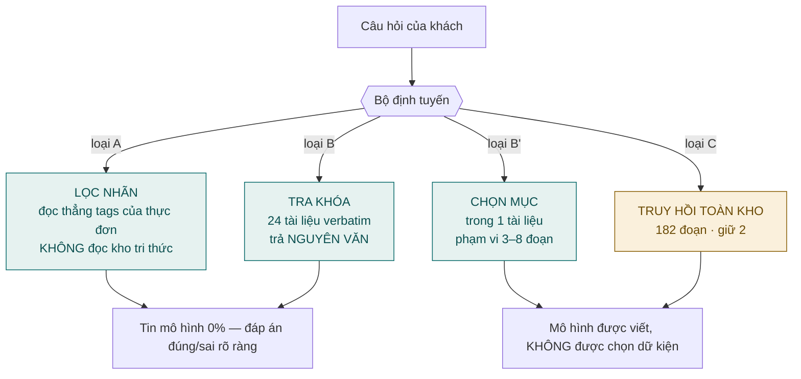
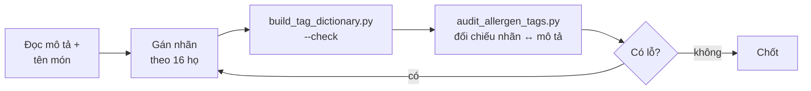
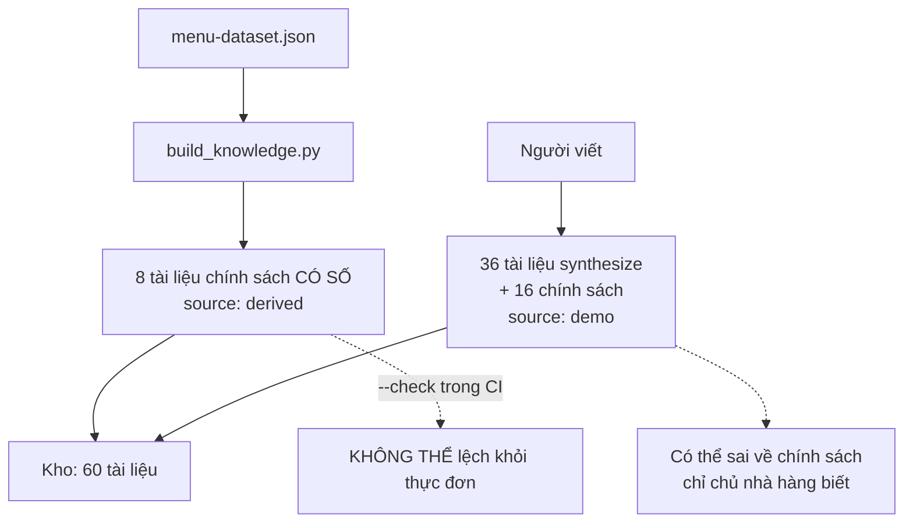
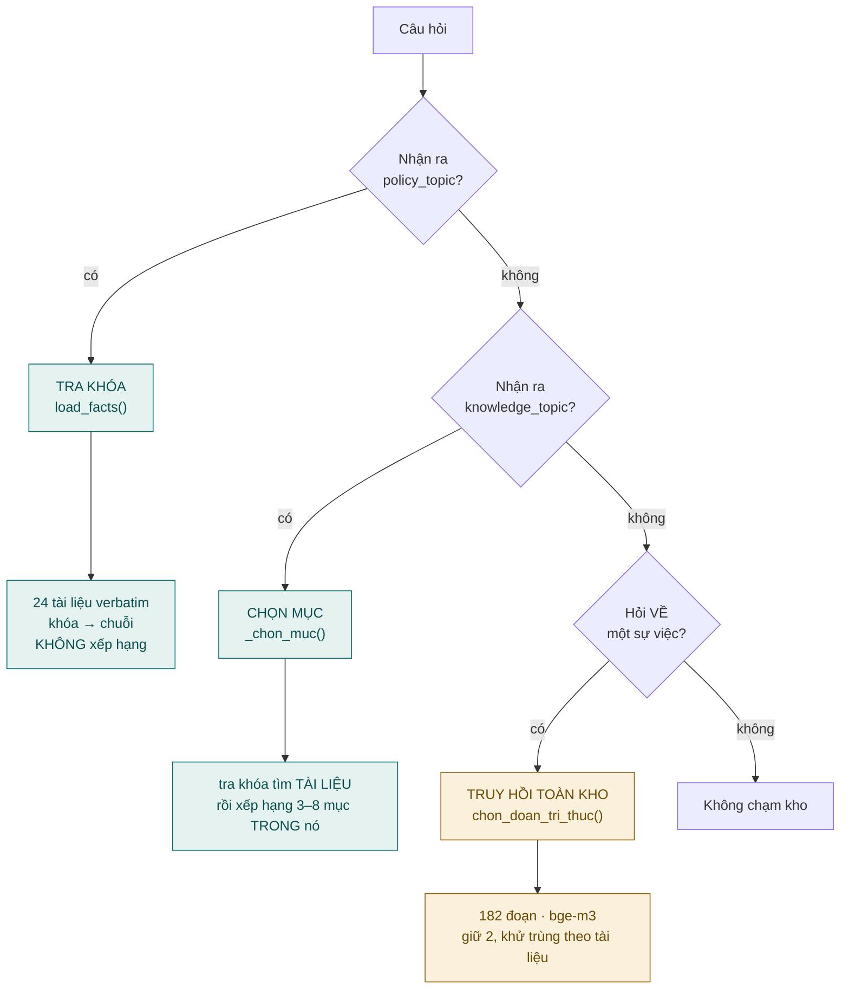
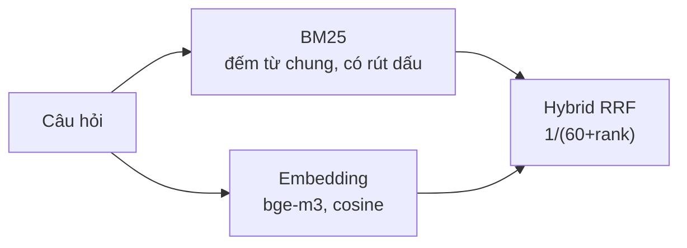
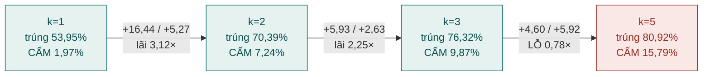
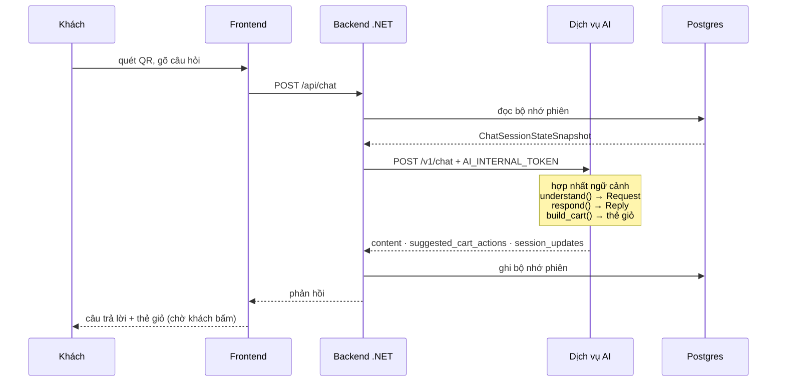
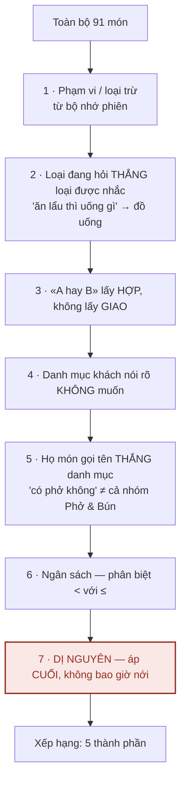
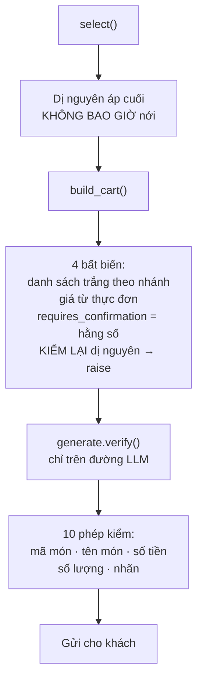
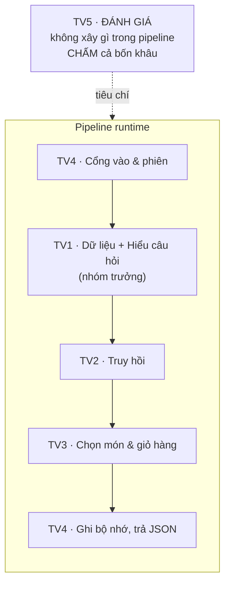

# Giải thích chi tiết toàn bộ dự án

Tài liệu này đi từ **dữ liệu thô** tới **câu trả lời gửi cho khách**, giải thích từng khâu và vì sao
nó được thiết kế như vậy. Đọc kèm [BAO_CAO_HOC_MAY_KPDL.md](BAO_CAO_HOC_MAY_KPDL.md) — báo cáo nêu
kết quả, tài liệu này nêu cơ chế.

**Mục lục**

1. [Tổng quan hệ thống](#1-tổng-quan-hệ-thống)
2. [Quá trình gán nhãn](#2-quá-trình-gán-nhãn)
3. [Xây dựng kho tri thức](#3-xây-dựng-kho-tri-thức)
4. [Kho tri thức hoạt động thế nào](#4-kho-tri-thức-hoạt-động-thế-nào)
5. [Truy hồi hoạt động thế nào](#5-truy-hồi-hoạt-động-thế-nào)
6. [Luồng hoạt động đầy đủ](#6-luồng-hoạt-động-đầy-đủ)
7. [Phần việc từng thành viên](#7-phần-việc-từng-thành-viên)

---

## 1. Tổng quan hệ thống

### 1.1 Hệ thống làm gì

Thực khách quét mã QR tại bàn, mở giao diện chat, và hỏi về món ăn. Trợ lý trả lời, **gợi ý** món
vào giỏ hàng, và nhớ ràng buộc trong suốt phiên. Khách tự bấm thêm vào giỏ — **AI không bao giờ tự
đặt món**.

### 1.2 Bốn đường trả lời, phân theo mức tin cậy

Điều quyết định kiến trúc không phải "dùng mô hình nào" mà là **mỗi loại câu hỏi được phép tin mô
hình đến đâu**:



### 1.3 Ba tầng dữ liệu

| Tầng | Tệp | Nội dung |
|---|---|---|
| Thực đơn | `backend/data/menu-dataset.json` | 91 món · 9 trường mỗi món |
| Từ điển nhãn | `backend/data/menu-tags.json` | 85 nhãn · 16 họ · nhãn nào độc quyền |
| Kho tri thức | `ai/knowledge/**/*.md` | 60 tài liệu · 213 đoạn |

### 1.4 Bản đồ mã nguồn

```
ai/app/
├── understand.py    629 cụm từ vựng → Request        (TV1)
├── answer.py        22 điểm trả về · select() · xếp hạng   (TV3)
├── cart.py          thẻ giỏ hàng · 4 bất biến        (TV3)
├── generate.py      gọi mô hình · 10 phép xác minh   (TV3)
├── session.py       bộ nhớ phiên · 3 quy tắc hợp nhất (TV4)
├── service.py       FastAPI · 5 endpoint             (TV4)
└── rag/
    ├── chunker.py   nạp kho, chia đoạn               (TV1)
    ├── bm25.py      truy hồi từ khóa                 (TV2)
    ├── embedding.py truy hồi ngữ nghĩa · bge-m3      (TV2)
    └── hybrid.py    RRF                              (TV2)

ai/knowledge/        60 tài liệu markdown             (TV1)
ai/scripts/          bộ sinh + bộ rà nhãn             (TV1)
ai/evaluation/       4 tập ca · thước đo · bộ chạy    (TV5)
```

---

## 2. Quá trình gán nhãn

### 2.1 Vì sao cần nhãn thay vì để mô hình đọc mô tả món

Mô tả món là câu giới thiệu, không phải dữ liệu có cấu trúc:

> *"Phở bò tái nạm — nước dùng ninh xương 8 tiếng, bánh phở tươi, thịt bò tái mềm."*

Từ câu này, mô hình **có thể đoán** món không cay, có gluten, hợp bữa sáng. Nhưng "có thể đoán"
không dùng được cho câu hỏi *"món nào không có gluten"* — sai một món là khách dị ứng ăn nhầm.

Nhãn biến phép đoán thành phép **tra bảng**: `allergen:gluten` có hoặc không, và câu trả lời truy
được về đúng một trường dữ liệu.

### 2.2 Cấu trúc một nhãn

```json
"spice:none": {
  "group": "spice",
  "value": "none",
  "label_vi": "Không cay",
  "label_en": "Not spicy",
  "legacy_key": "khong cay",
  "exclusive": true
}
```

**Tiền tố nhóm (`spice:`) là quyết định quan trọng nhất của khâu này.** Bản đầu dùng nhãn trần
(`hot`, `cay`, `nam`), và nó gây một lớp lỗi lặp bảy lần: sau khi rút dấu tiếng Việt, `hot` của
`serving:hot` (nóng) và `hot` của `spice:hot` (cay đậm) là **cùng một chuỗi**.

Cách chặn không phải sửa từng lỗi mà là **đổi hình dạng dữ liệu**: mọi nhãn mang tiền tố nhóm, nên
hai nghĩa không bao giờ va nhau nữa. Đây là nguyên tắc chung của dự án — *sửa lớp lỗi bằng cấu trúc,
không bằng ngoại lệ*.

### 2.3 Quy trình gán, và bộ rà kiểm chứng



Ba bộ rà chạy trong CI, mỗi bộ đối chiếu nhãn với **mô tả món** để tìm chỗ thiếu:

| Bộ rà | Tìm gì | Đã tìm ra |
|---|---|---|
| `audit_allergen_tags.py` | món có nguyên liệu gây dị ứng trong mô tả mà thiếu nhãn | **7 lỗ thật** |
| `audit_season_tags.py` | mô tả nói "thanh nhiệt", "giải nhiệt" mà thiếu `season:cooling` | lỗ dữ liệu |
| `audit_method_tags.py` | mô tả nói cách chế biến mà thiếu `method:*` | — |

**Giới hạn phải nói rõ:** mô tả món **không phải bảng thành phần**. Bộ rà tìm được chỗ mô tả *có
nhắc* mà nhãn *thiếu*; nó **không** tìm được món có dị nguyên mà mô tả cũng không nhắc. Vì vậy nhãn
`allergen` phủ 44/91 và **còn thiếu bao nhiêu thì không biết được từ dữ liệu này**.

### 2.4 Nguyên tắc đọc độ phủ

Đây là nguyên tắc chi phối cả khâu lọc lẫn khâu trả lời:

| Độ phủ | Ý nghĩa của "thiếu nhãn" | Nhãn dùng để |
|---|---|---|
| **91/91** | **lỗi dữ liệu** — mọi món đều phải có | **lọc** (loại món không thỏa) |
| một phần | **chưa ghi nhận** — không phải *không có* | **sắp thứ tự** (không loại món) |

Ví dụ cụ thể: `occasion:date` chỉ có trên **4 món**. Nếu dùng để lọc, câu *"Mình đi hẹn hò, nên gọi
món gì?"* chỉ còn một món (Tôm hùm 890.000đ). Chính ca đánh giá đã ghi trước điều này trong trường
`why`: *"occasion chỉ phủ 79/91 nên thiếu nhãn không có nghĩa món không phù hợp"*.

---

## 3. Xây dựng kho tri thức

### 3.1 Hai nguồn, hai bảo đảm khác nhau



| Nguồn | Số | Bảo đảm |
|---|---:|---|
| `derived` | 8 | **không thể lệch** — sinh lại từ thực đơn mỗi lần, có `--check` |
| `demo` | 52 | không sai về **con số** (số lấy từ thực đơn) nhưng có thể sai về **chính sách** |

### 3.2 Vì sao phải sinh thay vì viết tay

Bản đầu có một tài liệu `menu.md` — 159 dòng **kể lại thực đơn bằng văn xuôi**. Nó ghi *"hơn 90
món"* trong khi thực đơn có **đúng 91 món**. Con số viết tay, không ai canh, và nó sai ngay từ lúc
viết.

Đó là lớp lỗi không tránh được bằng cách cẩn thận: **văn xuôi kể lại dữ liệu thì luôn trôi khỏi dữ
liệu**. Cách duy nhất chặn được là **tính lại từ dữ liệu mỗi lần** — và biến việc đó thành một cổng
CI, không phải một thói quen.

### 3.3 Tám tài liệu chính sách có số

| Chủ đề | Con số sinh ra từ |
|---|---|
| `menu_size` | đếm món và danh mục |
| `price_range` | min / median / max của `price` |
| `preorder` · `takeaway_items` | đếm món mang `serving:*` |
| `children` | đếm `audience:child` và `audience:elderly` |
| `vegetarian` | đếm `diet:vegetarian` |
| `spice_levels` | đếm theo từng giá trị `spice:*` |
| `allergen_labelling` | đếm món có nhãn dị nguyên |

Mỗi câu trong đó truy được về một phép đếm cụ thể trên `menu-dataset.json`.

### 3.4 Một quyết định lớn: bỏ 49 tài liệu sinh theo nhãn

Kho từng có thêm **49 tài liệu**, mỗi giá trị nhãn một tài liệu — *"Món cay"*, *"Món Hà Nội"*, *"Món
có bò"*… Chúng chiếm **190/372 = 51% chỉ mục** và đã bị bỏ hoàn toàn. Lý do là một chuỗi phép đo:

**Bước 1 — không đường nào tới chúng ngoài truy hồi.** Nhánh lọc nhãn không đọc kho
(`select(request, items)` chỉ nhận thực đơn), và **0/49** khóa chủ đề của chúng có trong từ vựng nên
tra khóa không tới được.

**Bước 2 — câu chúng phục vụ là câu chọn món.** 106 ca của tập truy hồi nhắm hoàn toàn vào chúng, và
**không ca nào hỏi tri thức**: *"Món Hà Nội có gì?"*, *"Món nào có bò?"*. Sau khi bổ sung từ vựng,
**99,1% (105/106)** số ca ấy đi thẳng nhánh lọc.

**Bước 3 — chúng làm hỏng phần truy hồi còn lại.** 49 tài liệu dùng chung **đúng 4 tiêu đề mục**, và
tài liệu điển hình có **0 từ chỉ xuất hiện ở riêng nó** (văn xuôi viết tay: 2, nhiều nhất 18). Danh
sách món rò rỉ từ vựng của mọi nhóm khác — *"Canh chua cá lóc"* nằm trong tài liệu vùng miền, cách
chế biến và dịp ăn cùng lúc.

**Bước 4 — ba cách chữa đều không thắng:**

| Cách chữa | Kết quả |
|---|---|
| Xếp hạng lại bằng cross-encoder | p = 0,8238 |
| Gộp 49 tài liệu thành 6 theo họ nhãn | p = 0,5488 |
| Cắt bớt mục cho bớt trùng | 0 từ riêng → 1 |

Thứ trùng lặp là **chính cái khuôn**, nên cách còn lại là bỏ hẳn. Sau khi bỏ, chỉ mục còn **182 đoạn
văn xuôi đồng nhất**, nhóm `written` lên Hit@2 **0,879** và `cấm@5` giảm từ 9 xuống 6.

> **Nội dung mất đi không mất thật.** Mọi thứ 49 tài liệu ấy nói — danh sách món mang nhãn X, dị
> nguyên trong nhóm, dải giá — đều tính được từ nhãn, và nhánh lọc làm việc đó **chính xác 100,00%**.

---

## 4. Kho tri thức hoạt động thế nào

### 4.1 Ba đường tới kho, và chúng khác nhau về bản chất



| Đường | Phạm vi | Có xếp hạng? | Rủi ro chệch |
|---|---|---|---|
| Tra khóa | 24 tài liệu | **không** | **không có** |
| Chọn mục | 3–8 đoạn trong 1 tài liệu | có | thấp |
| Truy hồi toàn kho | 182 đoạn | có | cao nhất |

Thiết kế này đặt **rủi ro tỷ lệ nghịch với tần suất**: đường không rủi ro phục vụ 19,7% lượt trong
tập trả lời, còn đường rủi ro nhất phục vụ phần đuôi dài.

### 4.2 Vì sao tách `verbatim` khỏi `synthesize`

Câu hỏi *"Mấy giờ quán đóng cửa?"* có **một câu trả lời đúng**, và một chữ số lệch là nói sai sự
thật về nhà hàng. Cho mô hình diễn đạt lại câu đó là thêm rủi ro vào chỗ không cần rủi ro nào.

`verbatim` vì vậy **không vào chỉ mục truy hồi**. Nếu để chúng trong đó thì có **hai đường tới cùng
nội dung**, và đường xếp hạng có thể trích một câu chính sách ra giữa câu tư vấn món. Có test chốt
điều này: `test_chi_doan_synthesize_duoc_xep_hang`.

### 4.3 Khử trùng theo tài liệu

Khi truy hồi lấy 2 đoạn, nó **khử trùng theo tài liệu** — hai đoạn phải thuộc hai tài liệu khác
nhau:

```python
da_co, giu = set(), []
for cid in thu_tu_xep_hang:
    if doc_cua[cid] in da_co:
        continue          # bỏ qua: tài liệu này đã có đoạn rồi
    da_co.add(doc_cua[cid])
    giu.append(cid)
    if len(giu) >= 2:
        break
```

Không khử trùng thì hai đoạn của cùng một tài liệu chiếm cả hai suất, và khách nhận hai góc nhìn của
cùng một ý thay vì hai ý.

**Luật này ràng buộc cả thiết kế kho.** Khi thí nghiệm gộp 49 tài liệu thành 6, tài liệu họ chỉ được
góp **một** đoạn vào top-2 — chọn nhầm mục là tiêu cả tài liệu, không còn cơ hội thứ hai. Đo được:
11,3% ca hỏng đúng kiểu đó. Đây là lý do gộp không thắng, và nó cho thấy **độ chi tiết của tài liệu
và luật khử trùng phải đi cùng nhau**.

---

## 5. Truy hồi hoạt động thế nào

### 5.1 Ba phương pháp đã cài và so sánh



**BM25** — xếp hạng theo từ chung giữa câu hỏi và đoạn, có trọng số theo độ hiếm của từ. Nhanh
(1 ms), mạnh khi khách dùng **đúng chữ** của tài liệu, mù khi khách diễn đạt khác.

**Embedding** — mã hóa câu hỏi và đoạn thành vector 1024 chiều rồi so cosine. Bắt được nghĩa gần
nhau dù khác chữ. Chậm hơn (302 ms) vì phải chạy mô hình cho mỗi câu hỏi.

**Hybrid RRF** — gộp hai bảng xếp hạng bằng `Σ 1/(60 + rank)`. Ý tưởng: mỗi bên bù điểm mù của bên
kia.

### 5.2 Kết quả và lý do chốt embedding

| Phương pháp | Hit@1 | **Hit@2** | Hit@5 | nDCG@5 | cấm@5 | p50 |
|---|---:|---:|---:|---:|---:|---:|
| BM25 | 0,545 | 0,712 | 0,773 | 0,463 | 9 | 1,0 ms |
| **Embedding** | 0,697 | **0,879** | **0,939** | **0,636** | **6** | 302 ms |
| Hybrid | **0,712** | 0,803 | 0,864 | 0,563 | 7 | 300 ms |

Hybrid thắng ở **Hit@1** nhưng thua ở **Hit@2** — và hệ thống dùng **2 đoạn**, nên Hit@2 mới là chỉ
số quyết định. Chấm ở k khác k hệ thống dùng là đo một hệ thống **không tồn tại**.

### 5.3 Bốn chỉ số, và vì sao cần cả bốn

| Chỉ số | Đo gì | Vì sao cần |
|---|---|---|
| **Hit@k** | tài liệu đúng có nằm trong k đoạn đầu không | chỉ số chính |
| **MRR@5** | đoạn đúng nằm ở hạng bao nhiêu | phân biệt "đúng hạng 1" với "đúng hạng 5" |
| **nDCG@5** | như trên, có chiết khấu theo vị trí | chuẩn của ngành IR |
| **cấm@5** | có lấy đoạn thuộc chủ đề **bị cấm** không | Hit@5 = 1,0 vẫn đạt khi 4/5 đoạn lạc đề |

`cấm@5` là chỉ số dễ quên nhất và quan trọng nhất về mặt an toàn: một bộ xếp hạng "giỏi hơn" mà kéo
theo đoạn lạc chủ đề thì nó không giỏi hơn, nó chỉ **tự tin hơn**.

### 5.4 Số đoạn trích — vì sao là 2



Từ 3 lên 5 **lỗ**: được 4,60 điểm đúng, trả 5,92 điểm nhiễm chủ đề cấm. Cộng thêm số từ khách phải
đọc tăng từ 173 lên 396. Chốt **k = 2**.

### 5.5 Hai cổng an toàn trên nhánh truy hồi

```python
if request.hoi_ve_su_viec and thuoc_mien(request.text, items):
    _tim = doan_tri_thuc_lien_quan(request.text)
    if _tim is not None:
        ...trả lời...
    # không tìm được → RƠI TIẾP xuống nhánh dưới, không trả bừa
```

- **`thuoc_mien`** — câu phải chạm vốn từ nhà hàng, nếu không thì không có gì để trả lời.
- **Tìm được đoạn** — không tìm được thì rơi tiếp xuống các nhánh cũ.

Nhánh truy hồi vì vậy **không phải một cam kết cuối cùng**; nó có đường lui.

---

## 6. Luồng hoạt động đầy đủ

### 6.1 Một lượt hỏi, từ HTTP tới JSON trả về



### 6.2 Bộ định tuyến: 22 điểm trả về, thứ tự cố định

Định tuyến **không phải bộ phân loại** — không mô hình, không điểm tin cậy. Nó là chuỗi cổng, **cổng
nào khớp trước thì thắng**:

| # | Cổng | Nhánh |
|---:|---|---|
| 1 | ngoài bài toán | từ chối |
| 1b | xã giao | chào / cảm ơn |
| 2 | chủ đề chính sách | tra khóa, nguyên văn |
| 2c | khẩu phần của món đã nêu tên | đọc nhãn `party:*` |
| 2d | chủ đề tri thức nhiều mục | chọn mục |
| 2b | món nhà hàng không bán | nói không có |
| 3 | hỏi giá món đã nêu tên | đọc trường `price` |
| 4 | so sánh hai món | so trường |
| 5 | đắt nhất / rẻ nhất | cực trị trong phạm vi |
| 5b | khách khẳng định giá | đính chính theo thực đơn |
| 6a | dị nguyên của món đã nêu tên | đọc nhãn `allergen:*` |
| 6b | nêu tên món, không hỏi gì cụ thể | nêu dữ kiện |
| **6a-bis** | **hỏi VỀ một sự việc** | **truy hồi toàn kho** |
| 6c | còn lại | **lọc thực đơn** |

Mỗi vị trí đứng ở đó vì một ca hỏng đo được. Ví dụ nhánh xã giao (1b) phải đứng trước mọi nhánh chọn
món: thiếu nó thì *"xin chào"* rơi xuống truy hồi và khách nhận về một danh sách rượu nếp cẩm — vì
cổng `thuoc_mien()` là phép OR trên từng từ đơn của mọi tên món sau khi rút dấu, nên `chao` khớp món
**"Cháo lòng Sài Gòn"**.

### 6.3 Bên trong `select()` — thứ tự áp ràng buộc



Bước 7 là **fail-closed**: thà nói *"không có món nào phù hợp"* còn hơn mời khách một món có thể gây
dị ứng. Ngay cả nhánh «A hay B» ở bước 3 cũng phải áp lại dị nguyên sau khi hợp — nới một hàng rào
an toàn vì câu có chữ "hay" là cách tệ nhất để cơ chế này hỏng.

### 6.4 Khóa xếp hạng

```python
return (-matched, bac, ruou, item["price"], item["id"])
```

| Thành phần | Ý nghĩa |
|---|---|
| `-matched` | số `prefer_tags` khớp, nhiều hơn lên trước |
| `bac` | món mặn (0) → tráng miệng/trái cây (1) → đồ uống (2) |
| `ruou` | **rượu bia không tự đứng đầu khi khách không xin** |
| `price` | rẻ trước |
| `id` | kết quả **tất định tuyệt đối** — cùng câu hỏi luôn cùng thứ tự |

Thành phần `ruou` đến từ một lỗi đo được: bốn món rẻ nhất thực đơn đều là bia (12.000–22.000đ), nên
xếp theo giá làm *"tư vấn đồ uống"* mở đầu bằng ba loại bia cho **mọi** khách — kể cả khách đi với
trẻ con hay còn lái xe. Đây là **xếp hạng, không phải lọc**: khách xin bia thì bia vẫn ra ngay đầu.

### 6.5 Bộ nhớ phiên — ba quy tắc hợp nhất

| Loại | Quy tắc | Vì sao |
|---|---|---|
| Dị nguyên (`avoid_tags`) | **cộng dồn, không bao giờ bỏ** | khai ở lượt 1 thì lượt 5 vẫn phải nhớ |
| Ràng buộc cứng (`spice`, `price`, `diet`) | lượt mới **ghi đè** cùng nhóm | *"cho món khác, rẻ hơn"* phải thay ngân sách cũ |
| Ngữ cảnh (`prefer_tags`) | cộng vào, giữ **5 gần nhất** | sở thích tích lũy nhưng không phình vô hạn |

Bộ nhớ bị **xóa ở cả ba lối thoát**: đóng phiên, thanh toán, hết hạn.

**Bộ nhớ là hàng rào chống trả lời lạc, không chỉ là tiện ích.** Đo được: chạy 163 lượt kịch bản
*không có* bộ nhớ thì 34 lượt (20,9%) rơi xuống truy hồi và lấy về đoạn hoàn toàn không liên quan —
*"Món đầu tiên giá bao nhiêu?"* lấy về tài liệu `first_visit`. Có bộ nhớ, cả 34 lượt về nhánh đúng.

### 6.6 Bốn lớp kiểm soát đầu ra



Lớp 2 có một chi tiết thiết kế đáng nói: khi phát hiện món cấm lọt qua, `build_cart` **`raise
CartError`** chứ không lặng lẽ bỏ món — *"lọc fail-closed đang hỏng, KHÔNG được lặng lẽ bỏ món ở đây
rồi coi như xong"*. Sửa lặng ở lớp cuối là cách để lớp đầu hỏng mà không ai biết.

**Điều bốn lớp này KHÔNG canh:** chúng kiểm *"kết quả có thỏa ràng buộc đã đọc không"*. Nếu bước hiểu
đọc ra **rỗng** thì không có gì để thỏa, và mọi phép kiểm qua hết một cách vô nghĩa — xem mục 5.6.1
của báo cáo.

---

## 7. Phần việc từng thành viên

### 7.1 Cách chia và lý do



**Vì sao tách đánh giá khỏi dữ liệu.** Người viết dữ liệu không nên là người viết ca chấm dữ liệu
đó. Dự án đã ghi lại rằng **thước đo sai nhiều lần hơn hệ thống sai** — riêng đợt gần nhất ba lần.
Cùng một người vừa soạn kho vừa viết ca đo truy hồi trên kho đó sẽ vô thức viết ca mà họ biết kho
trả lời được.

**Vì sao gộp dữ liệu với hiểu câu hỏi.** Một bất biến chạy vắt qua đúng hai phần đó —
`KhoTriThucVaTuVungPhaiKhopNhau` đòi mọi `topic_keys` trong kho có cụm từ vựng nhận ra được và ngược
lại. Hai chủ sở hữu thì mỗi lần thêm tài liệu là một lần phải hẹn nhau.

### 7.2 TV1 — Dữ liệu + Hiểu câu hỏi *(nhóm trưởng)*

**Câu hỏi khâu này trả lời:** *AI được phép nói gì và dựa vào dữ liệu nào — và câu khách vừa gõ nêu
ra những ràng buộc gì?*

| Sở hữu | |
|---|---|
| Dữ liệu | `ai/knowledge/*` · `rag/chunker.py` · `build_knowledge.py` · `build_tag_dictionary.py` · `audit_allergen_tags.py` · `menu-tags.json` |
| Hiểu câu hỏi | `understand.py` · `llm_understand.py` · `test_understand.py` · `test_source_hygiene.py` |

**Kết quả:** 60 tài liệu / 213 đoạn · 85 nhãn / 16 họ · 91/91 món khớp hai nguồn · **629 cụm từ
vựng** · 107 cụm có nguy cơ đụng chữ, cơ chế khớp-dài-trước chặn hết.

**Bài học đắt nhất của khâu này:** đo một cơ chế thì phải **chạy** nó, không phân tích chuỗi thay
cho nó. Phân tích chuỗi con từng cho 17/19 dương tính giả vì nó không biết về luật ăn-hết-đoạn.

**Tự đo bằng:**
```bash
python ai/scripts/build_knowledge.py --check
python ai/scripts/audit_allergen_tags.py
python -m unittest test_understand test_source_hygiene   # trong ai/app
python ai/evaluation/run_ablation.py
```

### 7.3 TV2 — Truy hồi

**Câu hỏi:** *Câu này cần đoạn tri thức nào — và phương pháp lấy nào tốt hơn, đo được?*

**Sở hữu:** `rag/base.py` · `bm25.py` · `embedding.py` · `hybrid.py` · `test_rag.py` ·
`run_retrieval_comparison.py`

**Kết quả:** 114 ca truy hồi · chốt `bge-m3`, `written` Hit@2 **0,879** · hybrid p = 1,0000 và
reranker p = 0,8238 đều **không thắng**.

**Điều đáng nói của khâu này:** ba kết quả âm tính liên tiếp. Giá trị của TV2 không nằm ở việc "làm
cho truy hồi tốt hơn" mà ở việc **chứng minh bằng số rằng thêm phức tạp không giúp gì** — và nhờ đó
hệ thống giữ được một mô hình duy nhất, một phương pháp duy nhất.

**Tự đo bằng:**
```bash
python -m unittest test_rag                        # trong ai/app
python ai/evaluation/run_retrieval_comparison.py
python ai/evaluation/run_rerank_eval.py
```

### 7.4 TV3 — Chọn món & giỏ hàng

**Câu hỏi:** *Với những ràng buộc đã hiểu, món nào thỏa — và thẻ giỏ gợi ý gồm gì?*

**Sở hữu:** `answer.py` · `cart.py` · `generate.py` · `test_cart.py`

**Kết quả:** lọc nhãn **100,00%** trên câu chọn món · 4 bất biến giỏ hàng · 10 phép xác minh câu
sinh · **0 lỗi an toàn** trên mọi tập.

**Điều đáng nói:** khâu này giữ hàng rào an toàn quan trọng nhất. Đo trên 100 câu chạy sau khi khai
dị ứng hải sản, **bao gồm cả câu bị định tuyến sai**: 0 món vi phạm lọt ra, 0 lần hàng rào cuối phải
nổ. Định tuyến sai tốn **chất lượng**, không tốn **an toàn** — vì hàng rào nằm bên trong nhánh chọn
món chứ không nằm ở bộ định tuyến.

**Tự đo bằng:**
```bash
python -m unittest test_cart test_generate         # trong ai/app
python ai/evaluation/run_baseline.py --all
```

### 7.5 TV4 — Cổng vào & phiên

**Câu hỏi:** *Backend gọi vào thế nào, và bộ nhớ trong một phiên QR sống chết ra sao?*

**Sở hữu:** `service.py` · `session.py` · `ai/contracts/*` · `ai/Dockerfile` ·
`deploy/docker-compose.yml`

**Kết quả:** 5 endpoint · 3 quy tắc hợp nhất bộ nhớ · hợp đồng schema · **đã chạy thật qua `docker
compose`**.

**Điều đáng nói:** khâu này chứng minh được điều test không chứng minh được — container dựng lên
được, mạng thông, backend gọi được dịch vụ, và bộ nhớ **thật sự mất** khi đóng phiên. Golden
đầu-cuối **103/103 lượt** ở cả hai cấu hình mô hình.

**Tự đo bằng:**
```bash
python -m unittest test_service test_session       # trong ai/app
docker compose -f deploy/docker-compose.yml up -d --build
python ai/evaluation/wait_for_stack.py
python ai/evaluation/run_golden_e2e.py
```

### 7.6 TV5 — Đánh giá

**Câu hỏi:** *Làm sao biết câu trả lời đúng hay sai — và làm sao biết chính thước đo không sai?*

**Sở hữu:** `ai/evaluation/*` **toàn bộ** · phần cổng đánh giá trong `ci.yml`

**Kết quả:** 147 ca trả lời · 60 kịch bản / 163 lượt · 114 ca truy hồi · 120 ca chọn mục · bộ dò lỗ
**0 lỗ** · **14 cổng `--check`**.

**Điều đáng nói — và đây là đóng góp phương pháp của cả nhóm:** trong dự án này, số lần **thước đo**
sai nhiều hơn số lần **hệ thống** sai. Ba ví dụ gần nhất:

| "Kết quả" | Thực chất |
|---|---|
| Thí nghiệm gộp tài liệu ra **1,89%**, p = 0,0000 | bộ chấm so tiêu đề **tiếng Việt** với nhãn **tiếng Anh** → 102/106 ca không có đích |
| Bốn mẫu từ vựng báo **"0 câu đổi"** | bộ đo chỉ quét `*.json`, bỏ sót 100 câu nằm trong mã Python |
| `test_rag` báo **đỏ** | bộ quét không đọc `working-directory` trong `ci.yml` |

Thứ phát hiện ra cả ba không phải sự cẩn thận mà là kỷ luật **in dữ liệu thô kèm tỷ lệ**. Bộ chạy
`run_chung_cu_dinh_tuyen.py` được viết ra chính vì lý do đó: nó in từng câu, nhánh thực tế, ràng
buộc đọc ra và ba món trả về, để người chấm tự phán xét thay vì tin một con số.

**Tự đo bằng:**
```bash
python ai/evaluation/validate_cases.py
python ai/evaluation/probe_metric_holes.py
python ai/evaluation/analyze_failures.py
python ai/evaluation/run_chung_cu_dinh_tuyen.py --md
python -m unittest discover -s ai/evaluation -p "test_*.py"
```

### 7.7 Giao diện giữa các khâu

```
TV4 → TV1    ChatTurn(question: str, session_state: dict)
TV1 → TV2    Request(require_tags, avoid_tags, prefer_tags, categories,
                     budget_max, wants, ~20 cờ)
TV2 → TV3    Evidence(chunk_id, text, score)  — tối đa 2 đoạn
TV3 → TV4    Reply(text, items, kind, branch) + list[CartAction]
TV5 → tất cả  tiêu chí chấm, tập ca, cổng CI
```

Giao diện chốt **trước** khi viết mã, nên bốn khâu runtime chạy song song ngay từ đầu.

---

## Phụ lục — Ba điều cấm chung

1. **Không viết số vào tài liệu.** Bộ chạy **ghi**, tài liệu **đọc**. Có test chống trôi số.
2. **Tệp sinh ra thì sửa BỘ SINH**, không sửa tệp. 14 cổng `--check` canh điều này.
3. **Không thêm mã mà không phép đo nào phủ.** Một cụm từ vựng đổi 0 câu trên tập đánh giá là một
   cụm không ai canh — nó không được thêm.
