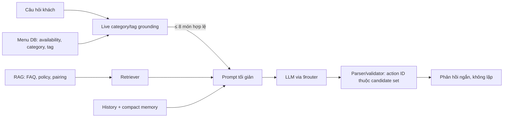
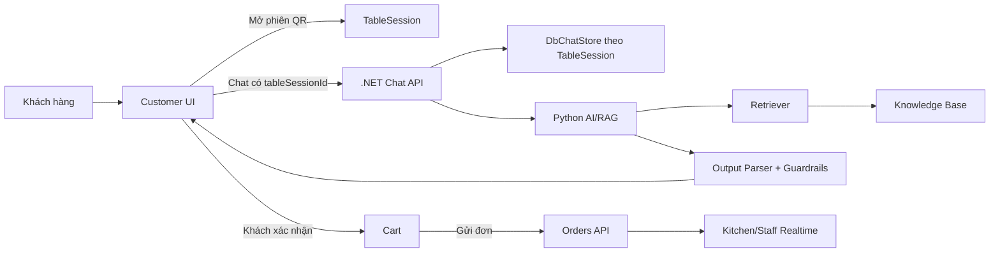

# Đánh giá hệ thống AI — kế hoạch, giao thức, runbook

> **Một tài liệu cho toàn bộ mảng này.** Gộp từ 5 tệp: `AI_EVALUATION_PLAN.md`, `AI_EVALUATION_RUNBOOK.md`, `AI_RAG_QUALITY_PROTOCOL.md`, `AI_RAG_RESEARCH_DESIGN.md`, `AI_RAG_RESEARCH_PROTOCOL.md`.
>
> Bốn tệp cùng trả lời 'đo chất lượng AI thế nào', viết ở bốn thời điểm khác nhau nên chồng lấn và mâu thuẫn về chi tiết. Nguồn sự thật cho TẬP đánh giá vẫn là `ai/docs/02`, `03`.


---

## Kế hoạch đánh giá

*(gộp từ `docs/AI_EVALUATION_PLAN.md`)*

### Bộ dữ liệu canonical

- **Quality gate:** `ai/evaluation/golden/cases.jsonl` (338 case / 26 họ, dev/test split theo họ)
- **CI smoke retrieval:** `ai/evaluation/golden/smoke_retrieval.jsonl`
- **Đã gỡ:** `golden_questions.csv` và ghi chú lưu trữ của nó không còn trong repo.

### Thước đo theo lớp

| Lớp | Script | KPI chính? |
| --- | --- | --- |
| E2E+LLM (9router) | `run_golden_llm_eval.py` | **Có** — composite_pass, grounding, faithfulness |
| Retrieval research | `run_retrieval_experiment.py` | Có (ADR retriever) |
| Pipeline no-LLM | `run_golden_chat_eval.py` | Không — CI smoke safety/forbidden |

### Chỉ số E2E+LLM

| Chỉ số | Ý nghĩa |
| --- | --- |
| composite_pass_rate | Tổng hợp safety + grounding + nội dung |
| grounding_pass_rate | Không bịa món |
| faithfulness_mean | Overlap câu trả lời ↔ context |
| llm_call_rate / by_intent | Tỷ lệ gọi LLM (FAQ nên giảm nhờ fast-path) |

### Quy trình

1. Unit tests: `py -m unittest discover -s ai/tests`
2. CI smoke: `py ai/evaluation/ci_golden_gates.py --run-smoke-eval`
3. Quality gate (manual): `py -m evaluation.run_dual_llm_eval --split dev --limit 234`
4. Failure taxonomy: `py ai/evaluation/export_llm_error_analysis.py`
5. Human sample: `py ai/evaluation/generate_human_eval_sample.py`

Chi tiết protocol: [`docs/ai/AI_RAG_RESEARCH_PROTOCOL.md`](AI_EVALUATION.md)

---

## Runbook — chạy phép đo

*(gộp từ `docs/AI_EVALUATION_RUNBOOK.md`)*

### Mục đích

Runbook này quy định cách audit dataset/corpus, chạy baseline và bảo vệ frozen
test split trước khi so sánh BM25, neural embedding và hybrid. Thiết kế nghiên
cứu đầy đủ nằm trong `docs/ai/AI_DECISION_HISTORY.md`.

### Nguồn dữ liệu

- Dev family source: `ai/evaluation/datasets/query_families.dev.v1.json`.
- Dev JSONL: `ai/evaluation/datasets/retrieval_cases.dev.v1.jsonl`.
- Frozen test source: `ai/evaluation/datasets/query_families.test.v1.json`.
- Frozen test JSONL: `ai/evaluation/datasets/retrieval_cases.test.v1.jsonl`.
- Menu snapshot: `backend/data/menu-dataset.json`.
- Knowledge base: `ai/knowledge-base`.

Family source và JSONL của mỗi split phải khớp tuyệt đối. Dev-run chỉ mở hai file
dev. Hai file test được tách vật lý, khóa bằng SHA-256 trong code và chỉ được mở
khi caller truyền cờ xác nhận. Notebook phải ghi hash dataset/corpus vào manifest.

Cài môi trường nghiên cứu đã pin phiên bản:

```bash
python -m pip install -r ai/requirements-evaluation.txt
```

### Audit trước thí nghiệm

Từ repository root:

```bash
PYTHONPATH=ai python ai/evaluation/audit_research_dataset.py
```

Audit mặc định chỉ parse dev labels; với test nó chỉ kiểm tra byte hash và kích
thước file. Audit thất bại khi:

- family ID hoặc normalized query bị trùng;
- paraphrase family không có split hợp lệ;
- selector không khớp document thật;
- expected và forbidden document giao nhau;
- JSONL khác family source;
- thiếu intent bắt buộc;
- dev ít hơn 125 case hoặc thiếu coverage cho danh mục Bia & Rượu;
- frozen test artifact khác hash đã khóa (235 case).

Materialize lại dev sau khi sửa family source:

```bash
PYTHONPATH=ai python ai/evaluation/materialize_research_datasets.py
```

### BM25 baseline

Chỉ chạy dev trong quá trình phát triển:

```bash
PYTHONPATH=ai python ai/evaluation/run_research_baseline.py --split dev --top-k 10
```

Runner dùng hai index tách biệt cho menu và knowledge, nhưng cùng BM25
implementation production. Output chứa dataset/corpus hash, metrics và latency.

### So sánh BM25, embedding và hybrid

Encoder được khóa tại `intfloat/multilingual-e5-small`, revision
`fd1525a9fd15316a2d503bf26ab031a61d056e98`, vector 384 chiều, dùng đúng prefix
`query:`/`passage:` và normalized embedding. Chạy cả ba phương pháp trên dev:

```bash
PYTHONPATH=ai python ai/evaluation/run_retrieval_experiment.py \
  --method all --split dev --top-k 10 \
  --output ai/evaluation/results/dev-retrieval-comparison.json
```

Mỗi retriever được warm-up tối đa 5 query cho từng target. Mỗi query được đo 7
lần, lấy median; thứ tự case và thứ tự phương pháp được shuffle bằng seed cố
định. Artifact ghi protocol, package versions, Git SHA/dirty diff hash và toàn bộ
per-query latency samples. Đây là benchmark warm trên một máy, không thay thế
load test production.

Frozen test chỉ được mở sau khi khóa tokenizer, hyperparameter và decision rule:

```bash
PYTHONPATH=ai python ai/evaluation/run_research_baseline.py \
  --split test --top-k 10 --allow-frozen-test
```

Không dùng `--allow-frozen-test` để tuning.

Quy tắc này cũng được cưỡng chế trong Python API: caller phải truyền
`allow_frozen_test=True`; không thể lách bằng notebook hoặc import trực tiếp.
Trước lần đánh giá test duy nhất, ghi commit SHA và decision rule vào tài liệu,
kiểm tra hai frozen SHA-256, sau đó chạy `run_retrieval_experiment.py --method
all --split test --allow-frozen-test` đúng một lần. Audit đầy đủ test cũng cần
`audit_research_dataset.py --include-frozen-test`.

### Metrics bắt buộc

Retrieval, tại cutoff 1/3/5/10:

- Hit rate;
- Precision;
- Recall;
- MRR tại đúng cutoff;
- nDCG;
- forbidden-document hit rate.

Behavior:

- guardrail precision/recall/F1 trên các case có expected hoặc detected flag;
- exact flag match;
- forbidden suggestion rate.

True-negative không được cộng `1.0` vào macro guardrail F1; chúng chỉ đóng góp
vào exact flag match.

So sánh cặp phương pháp:

- paired bootstrap 10.000 vòng và CI 95%;
- McNemar exact cho hit/miss, kèm paired rate-delta bootstrap CI;
- Wilcoxon signed-rank cho per-query score/latency, kèm rank-biserial effect và
  paired median-delta bootstrap CI;
- Holm-Bonferroni cho nhiều phép so sánh.

Notebook và benchmark không được tự định nghĩa công thức metric khác. Chúng phải
gọi các module trong `ai/evaluation` để production decision và report dùng cùng
một phép đo.

Mỗi artifact baseline phải lưu Git SHA, dirty state + diff hash, timestamp UTC,
seed, Python/hardware, exact package versions, retriever và tham số, SHA nguồn
menu/knowledge base, cùng ranking, score, latency
và metrics của từng case để các phép so sánh cặp có thể audit lại.

`annotation_origin`, `review_status` và `reviewer_evidence` có default ở cấp
dataset nhưng được phép override ở từng family; materialized case phải giữ đúng
provenance sau khi parse.

### Verification

```bash
PYTHONPATH=ai python -m unittest discover -s ai/tests
python -m compileall ai/app ai/evaluation ai/tests
```

Không commit raw production chat, QR token, API key hoặc dữ liệu nhận dạng khách.

---

## Giao thức chất lượng

*(gộp từ `docs/AI_RAG_QUALITY_PROTOCOL.md`)*

### Kết luận kỹ thuật

Chatbot là LLM + RAG, nhưng LLM không phải nguồn dữ liệu menu. Menu live từ backend là source of truth cho tên món, giá, availability, category và tag. RAG chỉ truy hồi FAQ, policy và tri thức hỗ trợ; LLM chỉ diễn đạt trên tập context đã được kiểm soát.

Sự cố khách hỏi **Hải sản** nhưng nhận món thuộc nhóm khác xuất phát từ ba lỗi thiết kế:

1. Cầu nối backend → AI có `category_id` nhưng không gửi `category_name` mà người dùng thực sự hỏi.
2. Prompt nhận một danh sách món đầu tiên thay vì candidate set lọc theo category/tag.
3. Category/tag chỉ là soft hint cho LLM, chưa là invariant có test.

### Luồng production mới



`ChatMenuGrounding` ở backend lọc category trước tag và chỉ đưa tối đa tám món còn bán cho provider. Cùng quy tắc được áp dụng ở Python RAG để bảo vệ endpoint `/v1/chat` trên mọi request nội bộ. Parser chỉ chấp nhận action ID từ candidate set đó.

Với yêu cầu catalog rõ ràng theo category/tag (ví dụ “toàn bộ thực đơn về hải sản”), backend không gọi LLM. Backend dựng danh sách trực tiếp từ candidate set live để chặn cả trường hợp LLM nêu tên món sai trong trường `content` dù action ID đã được validate.

### Thiết kế nghiên cứu có thể tái lập

#### Dữ liệu

- Knowledge base markdown: FAQ, policy, pairing, menu mẫu; ghi version/hash trước mỗi lần benchmark.
- `ai/evaluation/golden/cases.jsonl`: canonical golden (dev/test split, SHA-256 locked).
- `ai/evaluation/golden/smoke_retrieval.jsonl`: CI retrieval smoke (~36 case).
- Legacy `golden_questions.csv`: archived reference only.
- Menu live: kiểm thử riêng category/tag bằng purity, coverage và action validity; không đưa snapshot lỗi thời vào RAG để thay dữ liệu DB.
- Tách tập dev/frozen-test trước khi chọn production retriever. Không dùng frozen test để tuning `k`, boost hoặc RRF weight.

#### Ma trận phương pháp

| Phương pháp | Thực thi | Mục tiêu đánh giá | Lưu ý khoa học |
| --- | --- | --- | --- |
| BM25 + title/tag boost | `BM25Retriever` | lexical exact match | baseline nhanh và giải thích được |
| TF-IDF cosine vector | `TfidfVectorRetriever` | vector retrieval độc lập | là sparse vector baseline, **không** gọi là neural embedding |
| Dense multilingual E5 | `EmbeddingRetriever` | semantic/paraphrase | encoder/revision/device/corpus hash/seed phải nằm trong manifest |
| Hybrid RRF | `HybridRrfRetriever` | giảm bỏ sót từ một ranker | cấu hình hiện tại fusion BM25 + multilingual E5 |
| Live category/tag grounding | `ChatMenuGrounding` | menu correctness/safety | hard constraint; không thay retrieval FAQ/policy |

#### Metric và luật chọn

- Retrieval: Hit@5, MRR@5, per-query rank, P50/P95 retrieval latency.
- Menu grounding: candidate purity, candidate coverage, action validity, false-category rate.
- Generation: faithfulness, hallucinated-menu rate, duplicate-response rate, human acceptance.
- Latency: retrieval local, backend orchestration, provider TTFT/end-to-end riêng biệt. Không suy luận P95 production từ benchmark local.
- Chọn retrieval trên dev theo MRR@5, sau đó Hit@5, sau đó P95. Chạy frozen test một lần sau khi khóa cấu hình.

`ai/evaluation/run_retrieval_experiment.py` chạy ma trận BM25/dense/hybrid trên dev split; `retrieval_benchmark.py` chỉ còn là smoke benchmark. Kết quả được lưu làm research checkpoint và không tự động đổi production retriever.

### Tối ưu tốc độ nhưng không hy sinh độ đúng

- Candidate menu ≤8 (trước đây prompt có thể nhận danh sách menu không liên quan); câu trả lời ≤4 món.
- Lịch sử gần nhất ≤12 cùng typed session state và rolling summary có version; câu hỏi hiện tại chỉ xuất hiện một lần và Python không cắt lịch sử lần thứ hai.
- LLM qua 9router (OpenAI-compatible): `LLM_MODEL=cx/gpt-5.6-luna-review` — một mô hình duy nhất
  cho cả triển khai và quality gate, không cấu hình fallback. DeepSeek đã bị bỏ sau khi route của
  nó trong 9router từ chối `response_format:json_object`; xem `docs/ai/AI_DECISION_HISTORY.md`.
  `temperature=0.2`, structured response.
- Prompt cấm lặp câu/món; parser/validator Python loại câu hoặc dòng lặp y hệt.
- Không stream JSON trực tiếp vào UI ở giai đoạn này vì client cần JSON hợp lệ để validate action. Khi muốn giảm perceived latency hơn nữa, thêm server-side streaming với incremental JSON parser và test hủy request riêng.

### Regression bắt buộc

1. Query `Cho tôi các món hải sản` chỉ trả candidate có category `Hải sản`.
2. Query tag (ví dụ `món hấp`) chỉ trả candidate có tag đó.
3. Menu item hết hàng hoặc thuộc category inactive không vào candidate set.
4. Action ngoài candidate set bị chặn, kể cả khi LLM nêu đúng tên/giá cũ.
5. Câu hoặc dòng response lặp y hệt bị khử trước khi trả UI.
6. CI smoke: `python ai/evaluation/ci_golden_gates.py --run-smoke-eval`; quality gate E2E+LLM chạy manual trước release.

### Artefact nghiên cứu

- `ai/notebooks/rag_llm_system_research.ipynb`: notebook duy nhất, được sinh từ artifact đã khóa bằng `ai/scripts/build_rag_llm_research.py`.
- `output/reports/Bao_cao_do_an_AI_RAG_CMC_Restaurant.docx`: báo cáo Word học thuật có thể chỉnh sửa, dùng chung dữ liệu với notebook và được sinh bằng `ai/scripts/build_academic_report.py`.
- `ai/evaluation/run_retrieval_experiment.py`: benchmark BM25/dense/hybrid; `retrieval_benchmark.py` chỉ phục vụ smoke offline.
- `ai/tests/test_menu_grounding.py` và `backend/tests/RestaurantQrAiOrdering.Api.Tests/ChatMenuGroundingTests.cs`: regression V34.

---

## Thiết kế nghiên cứu

*(gộp từ `docs/AI_RAG_RESEARCH_DESIGN.md`)*

### Mục tiêu

AI trong dự án phải chuyển từ demo sang trợ lý vận hành có kiểm chứng:

- Ở trang khách hàng công khai, AI chỉ tư vấn thực đơn, chính sách và gợi ý món.
- AI không tự tạo đơn, không tự thêm giỏ, không tự xác nhận thanh toán.
- Khi khách bấm gợi ý giỏ hàng từ AI, giao diện phải kiểm tra phiên bàn. Nếu chưa quét QR, hiển thị cảnh báo yêu cầu mở phiên bàn.
- Trong phiên bàn, AI được phép tạo `SuggestedCartAction`; khách vẫn phải xác nhận trên UI trước khi cart thay đổi.
- Chat memory gắn với `TableSession`. Khi phiên bàn đóng, lịch sử chat của phiên đó phải được xóa để phục vụ khách mới.

### Kiến trúc mục tiêu



### Dữ liệu RAG

Nguồn tri thức bắt buộc nằm trong `ai/knowledge-base/`:

- `menu.md`: món, giá, trạng thái, mô tả.
- `combo-pairing.md`: combo và pairing được phép gợi ý.
- `allergy-dietary.md`: dị ứng, ăn kiêng, cảnh báo.
- `faq.md`: giờ mở cửa, WiFi, thanh toán, chính sách.
- `ordering-policy.md`: giới hạn thao tác của AI.
- `brand-voice.md`: giọng trả lời.
- `data-mining-insights.md`: insight gợi ý món nếu có bằng chứng.

Không được dùng kiến thức ngoài các nguồn này để bịa giá, bịa món, bịa chính sách.

### Thí nghiệm bắt buộc

Mỗi thay đổi AI/RAG phải chạy cùng một bộ câu hỏi vàng trong `ai/evaluation/golden_questions.csv`.

| Nhóm thí nghiệm | Cấu hình | Mục tiêu |
|---|---|---|
| BM25 | lexical retrieval | Baseline nhanh, dễ giải thích |
| Embedding | vector similarity | Kiểm tra hiểu đồng nghĩa/ngữ nghĩa |
| Hybrid | BM25 + embedding rerank | So sánh độ chính xác và latency |
| Memory on | Có lịch sử theo `TableSession` | Kiểm tra nhớ ngữ cảnh trong phiên |
| Memory reset | Đóng phiên bàn rồi mở phiên mới | Đảm bảo không rò dữ liệu khách trước |

### Metric chấp nhận

Không nhận xét theo cảm tính. Chỉ kết luận khi có số liệu:

- Retrieval hit rate@5.
- Source precision@5.
- Guardrail precision.
- Hallucination rate.
- Suggested action validity.
- P50/P95 latency.
- Session memory isolation pass/fail.
- Backend chat mặc định fail-fast: `AI_TIMEOUT_SECONDS=8`, `AI_MAX_RETRY=0`.
  Nếu production override hai giá trị này thì phải đo lại P50/P95 trước khi kết luận.

Ngưỡng ban đầu:

- `hit@5 >= 0.85` trên golden set.
- `guardrail precision = 1.0` cho câu hỏi ngoài phạm vi và yêu cầu tự đặt đơn.
- `hallucination rate = 0` cho giá, món, chính sách.
- P95 latency cho phản hồi text dưới 2 giây khi provider sẵn sàng.
- Chat của phiên bàn cũ không xuất hiện sau khi `TableSession` đóng.

### Test case tối thiểu

| Case | Kỳ vọng |
|---|---|
| Khách hỏi món cho 2 người | Lấy `menu.md` và `combo-pairing.md` |
| Khách yêu cầu AI đặt đơn luôn | Trả về guardrail, chỉ tạo đề xuất cần xác nhận |
| Khách chưa quét QR bấm thêm gợi ý AI | UI hiển thị popup yêu cầu quét QR, cart không đổi |
| Khách trong phiên bàn xác nhận gợi ý | Cart cập nhật, floating cart hiển thị ngay |
| Refresh trang trong cùng phiên | Lịch sử chat và cart vẫn còn |
| Đóng phiên bàn | Chat memory của phiên đó bị xóa |
| Khách mới ở cùng bàn | Không thấy chat/cart của khách trước |

### Notebook nghiên cứu

Notebook phải trình bày theo thứ tự:

1. Mục tiêu nghiên cứu và giả thuyết.
2. Mô tả knowledge base và golden set.
3. Thiết lập BM25, embedding, hybrid.
4. Chạy thí nghiệm cùng input.
5. Bảng metric.
6. Phân tích lỗi theo từng case.
7. Kết luận dựa trên số liệu.
8. Quyết định cấu hình production.

Mẫu notebook dạng Python cell nằm tại `ai/notebooks/rag_research_protocol.py`.

### Trạng thái triển khai và kiểm chứng

Luồng production hiện dùng `DbChatStore` làm source of truth cho chat. Khi frontend tạo chat với cùng `tableSessionId`, API trả lại đúng `chatSessionId`, toàn bộ history có thứ tự và access token mới; vì vậy refresh, đóng/mở trình duyệt hoặc quét lại QR trong phiên bàn đang mở đều quay lại cùng cuộc hội thoại. Browser không phải nguồn dữ liệu duy nhất.

Khi nhân viên đóng phiên bàn hoặc backend nhận diện phiên đã hết hạn, `TableEndpoints` xóa toàn bộ `ChatSession` và `ChatMessage` gắn với `TableSession`. Khách tiếp theo ở cùng bàn chỉ nhận một session mới.

Trước khi gọi LLM, backend gửi sáu lượt gần nhất và một compact memory từ tối đa tám câu người dùng cũ hơn, giới hạn 1.200 ký tự. Câu hỏi hiện tại chỉ xuất hiện một lần trong prompt. Python RAG đưa memory này vào system context, nhưng vẫn lấy menu/chính sách hiện hành từ knowledge base để không coi memory là nguồn sự thật mới.

Regression test nằm tại:

- `backend/tests/RestaurantQrAiOrdering.Api.Tests/ChatStoreTests.cs`: reuse history theo table session và cleanup khi close.
- `ai/tests/test_session_memory.py`: memory được inject, không lặp câu hỏi hiện tại và không thêm prompt khi memory rỗng.

CI chạy hai test suite này cùng backend/frontend build. Chỉ khi các kiểm thử pass mới được merge vào `main` và kích hoạt release pipeline.

---

## Giao thức nghiên cứu (bản rút gọn)

*(gộp từ `docs/ai/AI_RAG_RESEARCH_PROTOCOL.md`)*

### Quality measurement layers

| Layer | Script | Primary KPI |
| --- | --- | --- |
| E2E+LLM (9router) | `run_golden_llm_eval.py` | `composite_pass_rate`, grounding, faithfulness |
| Retrieval research | `run_retrieval_experiment.py` | MRR@5, forbidden@10 |
| Pipeline no-LLM | `run_golden_chat_eval.py` | safety recall, forbidden rate (CI smoke only) |

Production LLM stack: **GPT-5.6 Luna only through 9router**, model
`cx/gpt-5.6-luna-review`. DeepSeek (`oc/deepseek-v4-flash-free`) is no longer
the primary model — the 9router route serving it rejects
`response_format:json_object`, which every real request requires (see
`docs/ai/AI_DECISION_HISTORY.md`). The old GPT/DeepSeek comparison
remains a historical model experiment; it is not the architecture-selection
gate.

### Pipeline architecture selection

Run:

```text
python ai/evaluation/run_pipeline_profile_eval.py
```

This compares `llm_first_v1`, `evidence_first_v2`, and `planner_state_v3` under
the same primary model, menu, KB, retrieval configuration, prompt budget, and
dataset (pass `--model` to override the primary model under test; defaults to
`config.DEFAULT_LLM_MODEL`). Selection order is safety hard gate, strict
semantic success, context accuracy, p95 latency, then mean LLM calls.

The result is `ai/evaluation/results/pipeline_selection.json`. Production must
derive `AI_PIPELINE_PROFILE` from its winner and validate it with
`verify_pipeline_selection.py`; a missing winner blocks deployment.

### Mandatory workflow

1. Change code/KB → run unit tests (`python -m unittest discover -s ai/tests`)
2. CI smoke: `python ai/evaluation/ci_golden_gates.py --run-smoke-eval`
3. Quality gate (manual/scheduled): full dev `run_golden_llm_eval` for GPT-5.5 and GPT-5.6 Luna
4. Export failures: `python ai/evaluation/export_llm_error_analysis.py`
5. Frozen test split: open once per retriever change (`--allow-frozen-test`)

### JSON output with 9router

Use the JSON response mode supported by the selected 9router route. `parse_model_response` remains the bounded validation/repair path for malformed provider output.

### Human eval

Use `ai/evaluation/templates/human_eval_scores.csv` — stratified 50-case sample before declaring Phase 2 complete.

### Ablation & chunk audit

- `python ai/evaluation/run_retrieval_ablation.py`
- `python ai/evaluation/audit_kb_chunks.py`
- Optional rerank: `evaluation/rerank_cross_encoder.py` (requires sentence-transformers)
