<div align="center">
  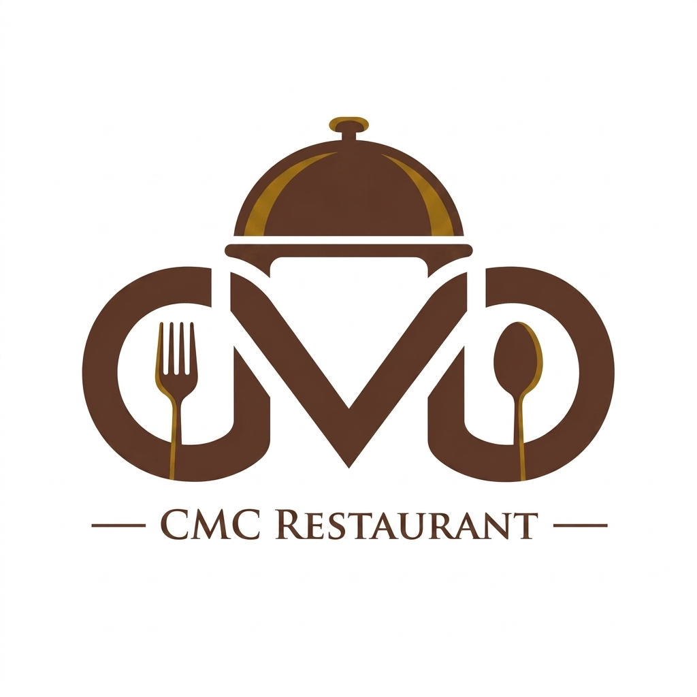

# BÁO CÁO MÔN HỌC
## Học phần: Công nghệ lập trình Web

**Trường Đại học CMC — Khoa Công nghệ thông tin & Truyền thông**

**Đề tài:** CMC Restaurant – Hệ thống quản lý nhà hàng, gọi món bằng QR
và tư vấn món ăn bằng AI

**Repository:** [github.com/Anpham120/restaurant-qr-ai-ordering](https://github.com/Anpham120/restaurant-qr-ai-ordering)

**Sản phẩm trực tuyến:** [cmcrestaurant.app](https://cmcrestaurant.app) · [order.cmcrestaurant.app](https://order.cmcrestaurant.app) · [admin.cmcrestaurant.app](https://admin.cmcrestaurant.app)

**Giảng viên hướng dẫn:** Ngô Việt Anh

**Thời gian thực hiện:** 04/06/2026 – 04/08/2026

</div>

---

## Tài nguyên kèm theo báo cáo

Báo cáo này đi kèm ba tài nguyên có thể kiểm chứng trực tiếp. Mọi phát biểu về công nghệ và
chức năng trong các chương sau đều đối chiếu được với một trong ba nguồn dưới đây.

| Tài nguyên | Địa chỉ |
|---|---|
| Video demo sản phẩm | [Thư mục Google Drive](https://drive.google.com/drive/folders/1VjuqJCl9fBzF6bf2OgoLc-A7bbgY_QW6?usp=drive_link) |
| Mã nguồn | [github.com/Anpham120/restaurant-qr-ai-ordering](https://github.com/Anpham120/restaurant-qr-ai-ordering) |
| Sản phẩm trực tuyến | [cmcrestaurant.app](https://cmcrestaurant.app) · [order.cmcrestaurant.app](https://order.cmcrestaurant.app) · [admin.cmcrestaurant.app](https://admin.cmcrestaurant.app) |

Video demo ghi lại luồng sử dụng thực tế của sản phẩm trên môi trường triển khai, dùng để
đối chiếu với phần mô tả các tầng công nghệ ở những chương sau.

## Danh mục bảng

| Số hiệu | Tên bảng | Mục |
|---|---|---|
| Bảng 1 | Bốn thế hệ kiến trúc ứng dụng web | 1.1 |
| Bảng 2 | Các tầng công nghệ của sản phẩm | 1.3 |
| Bảng 3 | Năm ứng dụng front-end và vai trò tương ứng | 2.2 |
| Bảng 4 | Bảy package dùng chung trong monorepo | 2.3 |
| Bảng 5 | Thư viện front-end và mục đích sử dụng | 2.4 |
| Bảng 6 | Tám tầng middleware trong pipeline | 3.2 |
| Bảng 7 | Đăng ký dịch vụ theo mô-đun | 3.3 |
| Bảng 8 | So sánh Minimal API và MVC Controller | 3.4 |
| Bảng 9 | Quy ước thiết kế REST của dự án | 3.5 |
| Bảng 10 | Mã lỗi nghiệp vụ chuẩn hóa | 3.6 |
| Bảng 11 | Thành phần của Entity Framework Core | 4.2 |
| Bảng 12 | Ba bất biến cưỡng chế ở tầng cơ sở dữ liệu | 4.4 |
| Bảng 13 | So sánh ba cơ chế đẩy dữ liệu từ máy chủ | 5.1 |
| Bảng 14 | Tám sự kiện thời gian thực của hệ thống | 5.3 |
| Bảng 15 | Tiêu chí tách dịch vụ | 6.1 |
| Bảng 16 | Ba cách trả về một phản hồi dài | 6.3 |
| Bảng 17 | Các lớp bảo mật và cơ chế tương ứng | 7.1 |
| Bảng 18 | So sánh JWT và capability token | 7.3 |
| Bảng 19 | Bốn vai trò và phạm vi quyền | 7.4 |
| Bảng 20 | Bộ quét bảo mật tự động | 7.5 |
| Bảng 21 | Dịch vụ trong Docker Compose | 8.1 |
| Bảng 22 | Năm job kiểm tra trong CI | 8.2.3 |
| Bảng 23 | Bốn tầng kiểm thử | 8.3 |
| Bảng 24 | Tổng hợp công nghệ đã áp dụng | Kết luận |

## Danh mục hình

| Số hiệu | Tên hình | Mục |
|---|---|---|
| Hình 1 | Kiến trúc tổng thể của hệ thống | 1.3 |
| Hình 2 | Cấu trúc monorepo front-end | 2.3 |
| Hình 3 | Giao diện các ứng dụng trên môi trường triển khai | 2.6 |
| Hình 4 | Điểm vào gọi món ở khung hiển thị điện thoại 414×896 | 2.6 |
| Hình 5 | Pipeline xử lý một HTTP request | 3.2 |
| Hình 6 | Sơ đồ lớp rút gọn của mô hình dữ liệu | 4.3 |
| Hình 7 | Màn hình khách theo dõi trạng thái thời gian thực | 5.4 |
| Hình 8 | Bảng bếp cập nhật thời gian thực | 5.4 |
| Hình 9 | Đường đi của một yêu cầu qua hai dịch vụ | 6.2 |
| Hình 10 | Dòng chảy CI/CD từ thay đổi mã nguồn tới môi trường thật | 8.2.2 |

## Danh mục từ viết tắt

| Từ viết tắt | Thuật ngữ | Nghĩa sử dụng trong báo cáo |
|---|---|---|
| API | Application Programming Interface | Giao diện lập trình ứng dụng |
| CI/CD | Continuous Integration / Continuous Delivery | Tích hợp liên tục / chuyển giao và triển khai liên tục |
| CORS | Cross-Origin Resource Sharing | Cơ chế chia sẻ tài nguyên giữa các nguồn khác nhau |
| CSR / SSR | Client-Side / Server-Side Rendering | Kết xuất phía trình duyệt / phía máy chủ |
| DI | Dependency Injection | Tiêm phụ thuộc |
| HSTS | HTTP Strict Transport Security | Cơ chế buộc trình duyệt chỉ dùng HTTPS |
| JWT | JSON Web Token | Chuẩn token dùng cho xác thực và phân quyền |
| ORM | Object-Relational Mapping | Ánh xạ đối tượng — quan hệ |
| REST | Representational State Transfer | Kiểu kiến trúc giao tiếp qua HTTP |
| SPA | Single-Page Application | Ứng dụng một trang |
| SSE | Server-Sent Events | Cơ chế máy chủ đẩy sự kiện xuống trình duyệt |

## Bảng phân công công việc

Bảng dưới đây đặt ở phần đầu báo cáo để người đọc xác định ngay phạm vi phụ trách chính của
từng thành viên. Phân công được trình bày theo mô-đun và hiện vật có thể đối chiếu, không được
hiểu là mỗi người chỉ làm việc độc lập trong một khu vực; các hợp đồng giao tiếp, kiểm thử tích
hợp và pull request vẫn cần sự phối hợp giữa các mảng.

*Phân công công việc của các thành viên*

| Thành viên | Phân công chính | Kết quả và hiện vật phụ trách |
|---|---|---|
| Phạm Duy An<br>BIT240002<br>@Anpham120 | Nhóm trưởng; kiến trúc hệ thống; dịch vụ AI/RAG; DevOps; tích hợp và tài liệu | Kiến trúc modular monolith và ranh giới dịch vụ AI; hợp đồng API; bộ đánh giá AI; pipeline CI/CD, triển khai, rollback; tổng hợp báo cáo |
| Bùi Đào Đức Anh<br>BIT240025<br>@buidaoducanh1210 | Backend xác thực, phân quyền, bàn, mã QR, phiên bàn và thanh toán | JWT và khóa tài khoản; cơ chế mở/tiếp tục phiên bằng QR; capability token; thanh toán COD/VietQR; kiểm thử vòng đời phiên và thanh toán |
| Nguyễn Quang Hiếu<br>BIT240091<br>@quanghieu1605 | Backend cơ sở dữ liệu, thực đơn, đơn hàng và cập nhật thời gian thực | PostgreSQL/EF Core; danh mục và món; giỏ hàng, nhiều lượt gọi món, trạng thái đơn; SignalR kết nối luồng khách với bảng bếp |
| Đỗ Tuấn Anh<br>BIT240015<br>@Tanh2k8-123 | Frontend trải nghiệm khách tại bàn | Điểm vào quét QR; thực đơn, giỏ hàng, gửi món và theo dõi trạng thái đơn; giao diện trò chuyện với trợ lý AI; kết nối luồng khách với API |
| Lê Anh<br>BIT240017<br>@totototototoads | Frontend vận hành nhà hàng | Giao diện quản trị; bảng bếp theo trạng thái; quầy thu ngân và hóa đơn bàn; phân tách workspace theo vai trò; cập nhật vận hành gần thời gian thực |

Bảng trên chỉ nêu phạm vi phụ trách chính, không hàm ý mỗi người làm việc tách biệt trong một
khu vực. Lịch sử issue, pull request và commit của từng thành viên tra cứu được tại kho mã
nguồn ghi ở mục Tài nguyên kèm theo báo cáo; việc đánh giá đóng góp dựa trên lịch sử đó và
trên các hiện vật đã hợp nhất.

---

# MỞ ĐẦU

## 1. Lý do chọn đề tài

Một website hiện đại không còn là một tập tài liệu HTML đặt trên máy chủ. Nó là một hệ
thống phân tầng, trong đó mỗi tầng dùng một nhóm công nghệ riêng và các tầng phải phối hợp
với nhau qua những giao thức xác định. Người học lập trình web vì vậy không thể chỉ nắm một
ngôn ngữ hay một framework — cần hiểu vì sao mỗi tầng tồn tại, tầng đó giải quyết vấn đề gì,
và các lựa chọn thay thế khác nhau ở điểm nào.

Báo cáo này chọn cách tiếp cận đi từ một sản phẩm thật. Thay vì trình bày lý thuyết tách
rời, nhóm phân tích toàn bộ các công nghệ đã dùng để xây dựng CMC Restaurant — một hệ thống
gọi món tại nhà hàng đang chạy trên môi trường thật với ba tên miền, khoảng 97.400 dòng mã
và 377 tệp nguồn.

Cách này có hai điểm lợi. Thứ nhất, mọi khẳng định về công nghệ đều kiểm chứng được bằng mã
nguồn cụ thể, không phải trích dẫn tài liệu. Thứ hai, những lựa chọn kỹ thuật đều gắn với
một ràng buộc có thật, nên có thể phân tích được *vì sao chọn* chứ không chỉ *chọn cái gì*.

## 2. Mục tiêu

1. Trình bày có hệ thống các nhóm công nghệ tạo nên một ứng dụng web hiện đại, từ tầng giao
   diện tới tầng dữ liệu và tầng triển khai.
2. Với mỗi công nghệ, phân tích vấn đề nó giải quyết, cách nó được áp dụng trong sản phẩm,
   và các phương án thay thế đã cân nhắc.
3. Làm rõ những kỹ thuật mà một ứng dụng web thực tế cần nhưng thường bị bỏ qua trong bài
   tập nhỏ: giao tiếp thời gian thực, kiểm soát đồng thời, bảo mật nhiều lớp, triển khai tự
   động.

## 3. Phạm vi và phương pháp

**Phạm vi.** Báo cáo tập trung vào công nghệ và kỹ thuật xây dựng ứng dụng web. Các nội dung
nghiệp vụ nhà hàng chỉ nêu ở mức đủ để hiểu bối cảnh kỹ thuật.

**Phương pháp.** Phân tích mã nguồn thực tế của sản phẩm; đối chiếu mỗi lựa chọn công nghệ
với phương án thay thế; và kiểm chứng bằng số đo lấy từ hệ thống đang chạy.

## 4. Bố cục báo cáo

**Chương 1** trình bày tổng quan kiến trúc ứng dụng web hiện đại và giới thiệu sản phẩm.
**Chương 2** phân tích công nghệ tầng giao diện. Chương 3 phân tích tầng máy chủ và
thiết kế API. Chương 4 trình bày tầng dữ liệu. Chương 5 trình bày giao tiếp thời
gian thực. Chương 6 trình bày bảo mật. Chương 7 trình bày triển khai, kiểm thử và
vận hành. Phần cuối nêu kết luận và hướng phát triển.

---

# CHƯƠNG 1. TỔNG QUAN CÔNG NGHỆ WEB HIỆN ĐẠI

## 1.1. Bốn thế hệ kiến trúc ứng dụng web

Hiểu vì sao một ứng dụng web hôm nay có hình dạng như vậy đòi hỏi nhìn lại quá trình nó
tiến hóa. Mỗi thế hệ ra đời để giải một hạn chế của thế hệ trước.

*Bảng 1 — Bốn thế hệ kiến trúc ứng dụng web*

| Thế hệ | Cách hoạt động | Giải quyết được gì | Hạn chế còn lại |
|---|---|---|---|
| **Trang tĩnh** | Máy chủ trả về tệp HTML có sẵn | Phân phối nội dung đơn giản, nhanh | Không có dữ liệu động, không cá nhân hóa |
| **Server-rendered động** | Máy chủ sinh HTML theo dữ liệu mỗi lần yêu cầu (PHP, JSP, ASP.NET MVC + Razor) | Nội dung động, có phiên người dùng | Mỗi thao tác tải lại cả trang; máy chủ gánh cả việc dựng giao diện |
| **SPA + API** | Trình duyệt tải một lần rồi tự dựng giao diện; dữ liệu lấy qua API dạng JSON | Trải nghiệm liền mạch, một API phục vụ nhiều loại client | Tải lần đầu nặng hơn; cần xử lý trạng thái phía client |
| **SPA + API + kênh đẩy** | Bổ sung kênh hai chiều để máy chủ chủ động đẩy dữ liệu | Dữ liệu thay đổi hiển thị ngay, không cần hỏi lại | Phải quản lý trạng thái kết nối |

Sản phẩm trong báo cáo thuộc thế hệ thứ tư. Lý do gắn với đặc thù bài toán: khi bếp đánh
dấu một món đã xong, màn hình của khách phải đổi ngay, và khách thì không bấm tải lại
trang. Ba thế hệ đầu đều không đáp ứng được yêu cầu này một cách tự nhiên.

## 1.2. Các tầng của một ứng dụng web hiện đại

Một ứng dụng web đầy đủ gồm sáu nhóm công nghệ. Báo cáo sẽ đi lần lượt từng nhóm.

```
Trình duyệt          giao diện, định tuyến phía client, quản lý trạng thái
     │  HTTP / WebSocket
Máy chủ ứng dụng     pipeline xử lý request, định tuyến, xác thực, nghiệp vụ
     │  ORM
Cơ sở dữ liệu        lưu trữ, ràng buộc toàn vẹn, giao dịch
     │
Kênh thời gian thực  đẩy sự kiện ngược lên trình duyệt
     │
Lớp bảo mật          HTTPS, xác thực, phân quyền, quét lỗ hổng
     │
Hạ tầng triển khai   đóng gói, tự động hóa, giám sát
```

## 1.3. Sản phẩm minh họa

CMC Restaurant là hệ thống gọi món tại bàn bằng mã QR: khách quét mã trên bàn để xem thực
đơn, gọi món nhiều lượt và theo dõi trạng thái đơn; đồng thời bếp, quầy thu ngân và quản
trị viên làm việc trên cùng một nguồn dữ liệu.

*Bảng 2 — Các tầng công nghệ của sản phẩm*

| Tầng | Công nghệ | Quy mô |
|---|---|---|
| Giao diện | React 19 · TypeScript 5.8 · Vite 7 · React Router 7 | 5 ứng dụng · 7 package dùng chung · 77 tệp `.tsx` |
| Máy chủ | ASP.NET Core · .NET 10 · Minimal API | 84 endpoint · 8 tầng middleware |
| Dữ liệu | PostgreSQL 16 · Entity Framework Core | 24 bảng · 21 migration |
| Thời gian thực | SignalR | 7 loại sự kiện |
| Bảo mật | JWT · PBKDF2 · capability token · HTTPS/HSTS | 4 vai trò · 4 bộ quét tự động |
| Triển khai | Docker Compose · GitHub Actions · VPS | 9 workflow · 3 tên miền |

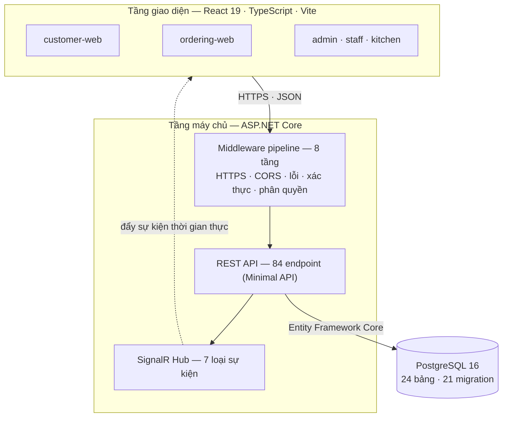

*Hình 1 — Kiến trúc tổng thể của hệ thống.*

Một nguyên tắc được giữ nhất quán: mọi đường đi của dữ liệu đều qua tầng máy chủ. Trình
duyệt không bao giờ nói chuyện trực tiếp với cơ sở dữ liệu hay với dịch vụ nội bộ nào khác.
Nhờ vậy tầng máy chủ là nơi duy nhất có thẩm quyền về quyền truy cập và về tính đúng đắn của
dữ liệu.

## 1.4. Kết luận chương 1

Chương này xác lập khung phân tích cho toàn bộ báo cáo: một ứng dụng web hiện đại gồm sáu
tầng công nghệ, và sản phẩm minh họa thuộc thế hệ kiến trúc SPA kết hợp API và kênh đẩy dữ
liệu. Các chương sau đi lần lượt từng tầng, mỗi tầng đều nêu vấn đề cần giải, công nghệ đã
chọn, và phương án thay thế đã cân nhắc.

---

# CHƯƠNG 2. CÔNG NGHỆ TẦNG GIAO DIỆN

## 2.1. Bài toán của tầng giao diện

Tầng giao diện của sản phẩm này phải phục vụ bốn nhóm người dùng có hoàn cảnh sử dụng khác
hẳn nhau:

- **Khách tại bàn** dùng điện thoại cá nhân qua mạng 4G, không đăng nhập, thao tác một tay.
- **Bếp** dùng màn hình lớn đặt xa, tay bận, cần nút to và ít bước.
- **Quầy thu ngân** dùng máy tính, thao tác nhanh và chính xác về tiền.
- **Quản trị viên** dùng máy tính, làm việc với bảng dữ liệu nhiều cột.

Một giao diện duy nhất phục vụ cả bốn sẽ hoặc quá nặng cho khách, hoặc quá sơ sài cho quản
trị. Đây là ràng buộc dẫn tới quyết định kiến trúc trình bày ở mục 2.2.

## 2.2. Kiến trúc nhiều ứng dụng

Dự án tách tầng giao diện thành năm ứng dụng độc lập, mỗi ứng dụng có bundle riêng.

*Bảng 3 — Năm ứng dụng front-end và vai trò tương ứng*

| Ứng dụng | Người dùng | Đặc điểm kỹ thuật |
|---|---|---|
| `customer-web` | Công chúng | Trang giới thiệu và thực đơn, tối ưu cho tải nhanh |
| `ordering-web` | Khách tại bàn | Không đăng nhập, dùng capability token, có kênh thời gian thực |
| `kitchen-web` | Bếp | Bảng trạng thái, nút lớn, cập nhật liên tục |
| `staff-web` | Nhân viên phục vụ | Theo dõi bàn và yêu cầu hỗ trợ |
| `admin-web` | Quản trị viên | Quản lý dữ liệu nền, nhiều bảng và biểu mẫu |

**Lý do tách.** Khách tại bàn dùng mạng 4G. Nếu gộp cả năm vai trò vào một ứng dụng, trình
duyệt của khách sẽ phải tải cả mã của trang quản trị — thứ họ không bao giờ dùng. Tách bundle
là cách trực tiếp nhất để giảm khối lượng tải của người dùng nhạy cảm nhất về băng thông.

**Cái giá phải trả.** Năm ứng dụng nghĩa là năm lần cấu hình build, và nguy cơ mã bị lặp lại
giữa các ứng dụng. Vấn đề thứ hai được giải bằng monorepo trình bày ở mục kế tiếp.

## 2.3. Monorepo và các package dùng chung

Dự án dùng npm workspaces để tổ chức năm ứng dụng và bảy thư viện nội bộ trong một
repository duy nhất.

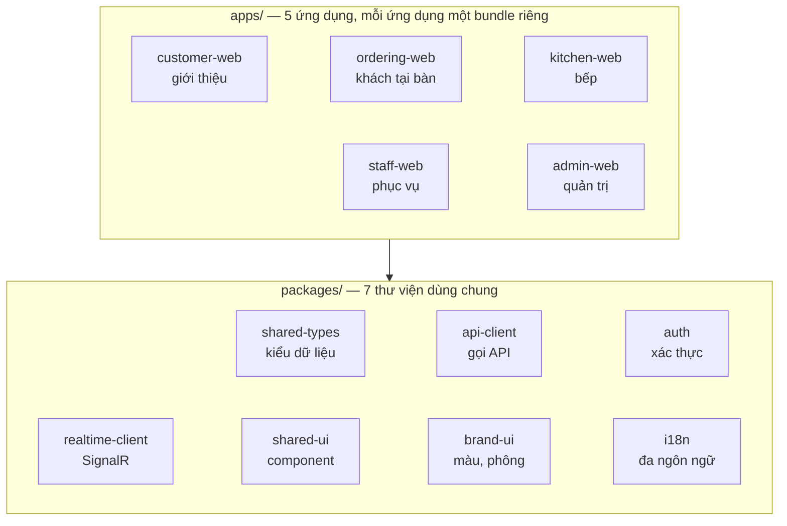

*Hình 2 — Cấu trúc monorepo front-end.*

*Bảng 4 — Bảy package dùng chung trong monorepo*

| Package | Trách nhiệm | Vì sao phải dùng chung |
|---|---|---|
| `shared-types` | Định nghĩa kiểu dữ liệu TypeScript của toàn hệ thống | Năm ứng dụng phải hiểu cùng một hợp đồng dữ liệu với máy chủ |
| `api-client` | Lớp gọi API, xử lý lỗi và tuần tự hóa | Tránh mỗi ứng dụng tự viết một cách gọi khác nhau |
| `auth` | Lưu và làm mới token, bảo vệ tuyến đường | Logic xác thực sai ở một chỗ là lỗ hổng ở mọi chỗ |
| `realtime-client` | Kết nối SignalR, đăng ký nhóm sự kiện | Quản lý vòng đời kết nối là việc dễ sai, nên viết một lần |
| `shared-ui` | Component dùng lại: bảng, biểu mẫu, hộp thoại | Giảm lặp mã giữa các ứng dụng vận hành |
| `brand-ui` | Màu, phông chữ, khoảng cách chuẩn | Năm ứng dụng phải trông như một sản phẩm |
| `i18n` | Chuỗi giao diện đa ngôn ngữ | Chuỗi nằm rải rác thì không dịch được |

Điểm đáng nói nhất là `shared-types`. Kiểu dữ liệu được khai báo một lần và cả năm ứng dụng
cùng dùng, nên khi hợp đồng API đổi, TypeScript báo lỗi biên dịch ở mọi nơi bị ảnh hưởng
— thay vì để lỗi lộ ra lúc chạy.

## 2.4. Thư viện và công cụ

*Bảng 5 — Thư viện front-end và mục đích sử dụng*

| Thư viện | Phiên bản | Vai trò |
|---|---|---|
| `react` / `react-dom` | 19 | Thư viện dựng giao diện theo component |
| `typescript` | 5.8 | Kiểm tra kiểu tĩnh lúc biên dịch |
| `vite` | 7 | Máy chủ phát triển và công cụ đóng gói |
| `react-router-dom` | 7 | Định tuyến phía trình duyệt |
| `@microsoft/signalr` | 9 | Client cho kênh thời gian thực |
| `qrcode` | 1.5 | Sinh mã QR cho từng bàn |
| `vitest` | 4 | Khung kiểm thử |
| `lucide-react`, `@fontsource/*` | — | Bộ biểu tượng và phông chữ nhúng sẵn |

**Vì sao Vite thay cho Webpack.** Vite dùng ES module gốc của trình duyệt trong lúc phát
triển, nên máy chủ khởi động gần như tức thời và cập nhật nóng chỉ nạp lại đúng mô-đun vừa
sửa, không phải đóng gói lại toàn bộ. Với một monorepo năm ứng dụng, khác biệt này rất rõ.

**Vì sao TypeScript.** Front-end trao đổi dữ liệu với 84 endpoint. Nếu không có kiểu tĩnh,
mọi sai lệch giữa hình dạng dữ liệu máy chủ trả về và hình dạng mà giao diện mong đợi chỉ lộ
ra lúc chạy, thường là ở đúng màn hình khách đang dùng. TypeScript đẩy lớp lỗi đó về lúc
biên dịch.

**Phông chữ nhúng sẵn qua `@fontsource`.** Thay vì gọi Google Fonts từ CDN, dự án nhúng phông
vào bundle. Điều này loại bỏ một lần gọi mạng ngoài lúc tải trang — có ý nghĩa với khách dùng
4G — và tránh phụ thuộc vào dịch vụ bên thứ ba.

## 2.5. Định tuyến phía trình duyệt

Trong kiến trúc SPA, khi người dùng bấm một liên kết thì trình duyệt không gửi yêu cầu
tải trang mới. React Router bắt sự kiện đó, đổi địa chỉ trên thanh URL bằng History API, rồi
dựng lại phần giao diện tương ứng.

Ví dụ tuyến đường trong ứng dụng gọi món:

```
/table-session/:sessionId/menu      → thực đơn
/table-session/:sessionId/ai        → trợ lý tư vấn
/table-session/:sessionId/cart      → giỏ hàng
/table-session/:sessionId/orders    → theo dõi đơn đã gọi
```

Tham số `:sessionId` giữ ngữ cảnh phiên bàn xuyên suốt bốn màn hình. Sau khi quét mã QR,
máy chủ trả về trạng thái phiên và ứng dụng tự điều hướng tới đúng tuyến đường tương ứng —
khách quét lại giữa chừng vẫn quay về đúng bước đang dở.

**Quan hệ với định tuyến phía máy chủ.** Hai hệ thống định tuyến này độc lập nhau. Máy chủ
định tuyến theo tài nguyên API (`/api/orders`, `/api/tables/scan`), còn trình duyệt định
tuyến theo màn hình. Máy chủ web tĩnh phải được cấu hình trả về `index.html` cho mọi
đường dẫn không phải API, để React Router xử lý phần còn lại.

## 2.6. Giao diện thực tế

<table>
  <tr>
    <td width="50%" align="center">
      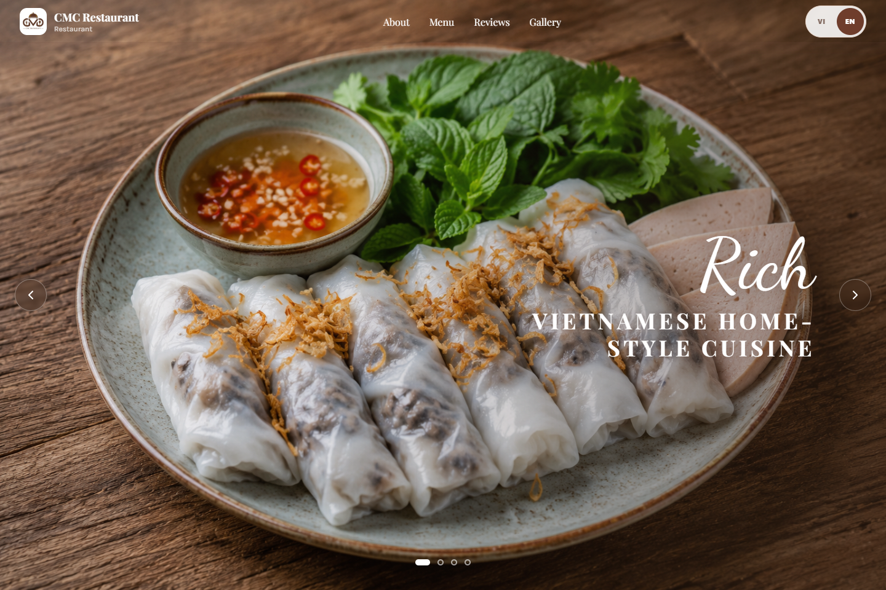<br />
      <strong>customer-web</strong>
    </td>
    <td width="50%" align="center">
      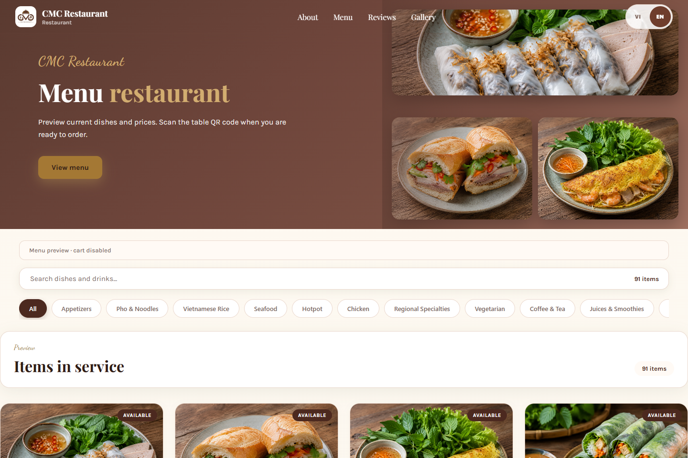<br />
      <strong>Thực đơn — 91 món / 13 danh mục</strong>
    </td>
  </tr>
  <tr>
    <td width="50%" align="center">
      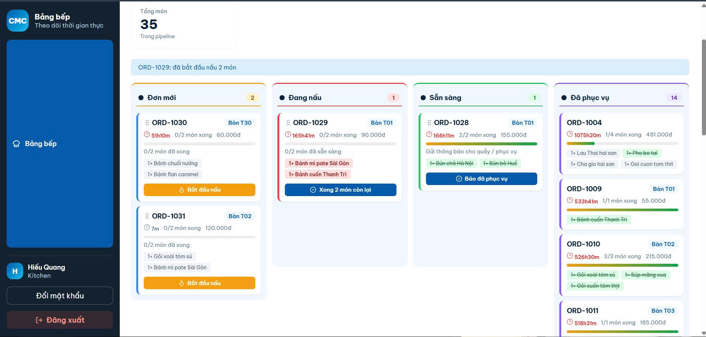<br />
      <strong>kitchen-web</strong>
    </td>
    <td width="50%" align="center">
      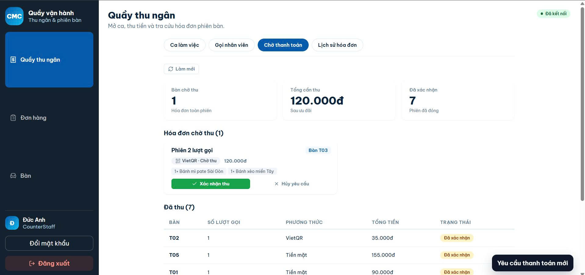<br />
      <strong>staff-web — quầy thu ngân</strong>
    </td>
  </tr>
</table>

*Hình 3 — Giao diện các ứng dụng trên môi trường triển khai.*

<div align="center">
  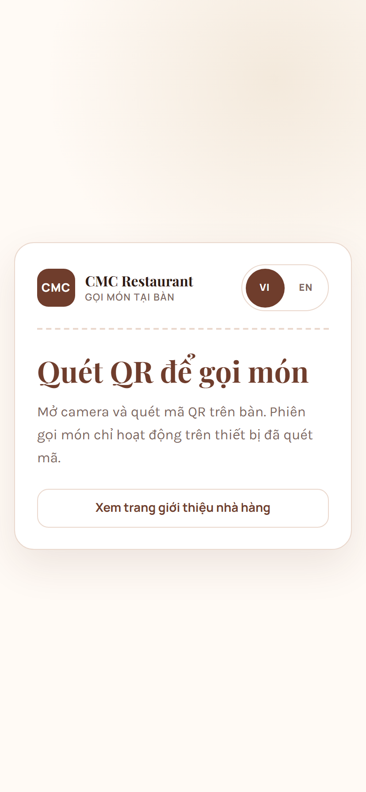

*Hình 4 — Điểm vào gọi món ở khung hiển thị điện thoại 414×896.*
</div>

Giao diện khách được thiết kế theo hướng mobile-first: bố cục dựng cho khung hình dọc
trước, rồi mới mở rộng cho màn hình lớn. Đây là thứ tự ngược với cách làm truyền thống, và
phù hợp với thực tế là mọi khách tại bàn đều dùng điện thoại.

## 2.7. Kết luận chương 2

Tầng giao diện được tổ chức thành năm ứng dụng độc lập trong một monorepo, chia sẻ bảy thư
viện nội bộ. Quyết định tách ứng dụng xuất phát từ một ràng buộc cụ thể — khách tại bàn dùng
mạng 4G — chứ không phải từ sở thích kiến trúc. TypeScript và package `shared-types` đóng vai
trò giữ cho năm ứng dụng và máy chủ nói cùng một hợp đồng dữ liệu.

---

# CHƯƠNG 3. CÔNG NGHỆ TẦNG MÁY CHỦ VÀ THIẾT KẾ API

## 3.1. ASP.NET Core

Tầng máy chủ dùng ASP.NET Core trên .NET 10. Bốn đặc điểm khiến nó phù hợp với bài toán:

**Máy chủ web Kestrel.** Kestrel là máy chủ web nhúng sẵn, chạy được độc lập hoặc sau một
reverse proxy. Trong dự án, Kestrel chạy trong container Docker và nhận yêu cầu đã qua lớp
HTTPS ở phía trước.

**Đa nền tảng.** Ứng dụng phát triển trên Windows nhưng triển khai trên máy chủ Linux, không
phải sửa mã.

**Kiến trúc mô-đun.** Chỉ những gói NuGet thực sự cần mới được thêm vào, nên ảnh Docker của
tầng máy chủ chỉ khoảng 200 MB.

**Dependency Injection tích hợp sẵn.** Không cần thư viện ngoài; container DI là một phần
của framework.

## 3.2. Middleware pipeline

Đây là khái niệm trung tâm của ASP.NET Core. Mỗi yêu cầu HTTP đi qua một chuỗi thành phần
gọi là middleware; mỗi thành phần có thể xử lý yêu cầu, chuyển tiếp cho thành phần kế tiếp,
rồi xử lý tiếp phần phản hồi trên đường quay ra.

```
Yêu cầu vào
   │
   ├─ UseForwardedHeaders      khôi phục IP và scheme gốc sau reverse proxy
   ├─ UseHsts                  báo trình duyệt chỉ dùng HTTPS
   ├─ UseHttpsRedirection      chuyển HTTP sang HTTPS
   ├─ (middleware tùy chỉnh)   xử lý header và ngữ cảnh riêng của dự án
   ├─ UseCors                  kiểm soát nguồn gọi chéo tên miền
   ├─ ApiExceptionHandlingMW   bắt ngoại lệ, chuẩn hóa phản hồi lỗi   ← tự viết
   ├─ UseAuthentication        xác định người gọi là ai
   ├─ UseAuthorization         quyết định người gọi được làm gì
   │
   └─ Endpoint                 84 endpoint nghiệp vụ
```

*Hình 5 — Pipeline xử lý một HTTP request.*

*Bảng 6 — Tám tầng middleware trong pipeline*

| Thứ tự | Middleware | Giải quyết vấn đề gì |
|---|---|---|
| 1 | `UseForwardedHeaders` | Sau reverse proxy, ứng dụng thấy IP của proxy chứ không thấy IP thật của khách. Middleware này khôi phục lại |
| 2 | `UseHsts` | Gửi header buộc trình duyệt chỉ dùng HTTPS trong lần truy cập sau |
| 3 | `UseHttpsRedirection` | Chuyển hướng mọi yêu cầu HTTP sang HTTPS |
| 4 | Middleware nội tuyến | Xử lý header và ngữ cảnh riêng trước khi vào các tầng chuẩn |
| 5 | `UseCors` | Trình duyệt chặn gọi chéo tên miền; middleware này khai báo nguồn nào được phép |
| 6 | `ApiExceptionHandlingMiddleware` | **Tự viết** — bắt mọi ngoại lệ chưa xử lý, ghi log và trả về phản hồi lỗi có cấu trúc |
| 7 | `UseAuthentication` | Đọc JWT hoặc capability token, dựng `HttpContext.User` |
| 8 | `UseAuthorization` | Đối chiếu vai trò và chính sách với yêu cầu của endpoint |

**Thứ tự là một phần của thiết kế.** `UseAuthentication` phải đứng trước `UseAuthorization`,
vì không thể quyết định một người được làm gì khi chưa biết họ là ai. Tương tự,
`ApiExceptionHandlingMiddleware` đặt sớm để bắt được cả ngoại lệ phát sinh trong các tầng
phía sau nó.

**Middleware tự viết.** `ApiExceptionHandlingMiddleware` được cài theo đúng khuôn mẫu của
ASP.NET Core: nhận `RequestDelegate next` và `ILogger` qua constructor, bọc lời gọi tiếp theo
trong khối `try`, và khi có ngoại lệ thì ghi log đầy đủ nhưng chỉ trả ra ngoài một mã tham
chiếu tám ký tự. Người vận hành tra được log bằng mã đó, còn người dùng — kể cả kẻ tấn công
— không đọc được cấu trúc nội bộ của hệ thống.

## 3.3. Dependency Injection

DI cho phép một lớp nhận các phụ thuộc từ bên ngoài thay vì tự khởi tạo chúng. Lợi ích là
giảm ràng buộc cứng giữa các lớp, cho phép thay thế cách cài đặt, và giúp kiểm thử dễ hơn vì
có thể tiêm bản giả lập.

Dự án đăng ký dịch vụ theo mô-đun nghiệp vụ thay vì liệt kê phẳng:

*Bảng 7 — Đăng ký dịch vụ theo mô-đun*

| Lời gọi đăng ký | Nhóm dịch vụ |
|---|---|
| `AddDbContext<RestaurantDbContext>` | Ngữ cảnh cơ sở dữ liệu và chuỗi kết nối |
| `AddRestaurantAuth` | Xác thực, phân quyền, băm mật khẩu |
| `AddRestaurantMenuTableApis` | Thực đơn, danh mục, bàn, phiên bàn |
| `AddRestaurantOrderApis` | Giỏ hàng, đơn hàng, hóa đơn |
| `AddRestaurantPaymentApis` | Thanh toán và giao dịch |
| `AddRestaurantRealtimeApis` | SignalR và bộ phát sự kiện |
| `AddRestaurantChatApis` | Tích hợp dịch vụ tư vấn |
| `AddHealthChecks` | Điểm kiểm tra sức khỏe cho hệ thống giám sát |
| `AddOpenApi` | Sinh mô tả OpenAPI |

Mỗi lời gọi là một extension method gom toàn bộ dịch vụ của một mô-đun. Nhờ vậy tệp
`Program.cs` chỉ dài 273 dòng dù hệ thống có 84 endpoint, và khi thêm một mô-đun mới thì chỉ
thêm hai dòng: một dòng đăng ký dịch vụ, một dòng ánh xạ endpoint.

## 3.4. Minimal API

Dự án dùng Minimal API thay vì MVC Controller. Toàn bộ mã nguồn không có tệp nào kế thừa
`ControllerBase`; thay vào đó có 37 chỗ dùng `MapGroup` và `MapGet`/`MapPost`.

*Bảng 8 — So sánh Minimal API và MVC Controller*

| Tiêu chí | Minimal API (đã chọn) | MVC Controller |
|---|---|---|
| Cách khai báo | Ánh xạ trực tiếp đường dẫn tới hàm xử lý | Lớp kế thừa `ControllerBase`, action là phương thức |
| Mã soạn sẵn | Rất ít | Nhiều hơn: lớp, thuộc tính, quy ước đặt tên |
| Hiệu năng | Nhỉnh hơn do bỏ qua một số tầng của MVC | Đủ tốt cho phần lớn ứng dụng |
| Phù hợp khi | Dịch vụ thuần API, không kết xuất giao diện | Ứng dụng có View server-side, cần filter và model binding phức tạp |
| Nhóm hóa | `MapGroup` gom endpoint cùng tiền tố và cùng chính sách | Thuộc tính `[Route]` trên lớp |

**Vì sao chọn Minimal API.** Tầng máy chủ của dự án không kết xuất giao diện — nó chỉ trả
JSON cho năm ứng dụng React. Toàn bộ bộ máy View, ViewData, Razor và HTML Helper của MVC vì
vậy không được dùng đến. Chọn Minimal API là bỏ đi phần không dùng.

Cần nói rõ để tránh hiểu nhầm: MVC Controller không hề lỗi thời. Nếu ứng dụng cần kết
xuất trang HTML phía máy chủ — ví dụ một trang quản trị nội bộ hoặc một website cần tối ưu
SEO — thì MVC với Razor là lựa chọn tự nhiên hơn, vì nó tích hợp sẵn View engine, Tag Helper
và cơ chế kiểm tra hợp lệ biểu mẫu.

## 3.5. Thiết kế REST API

REST là kiểu kiến trúc trong đó mỗi đường dẫn đại diện một tài nguyên, và động từ HTTP
cho biết thao tác trên tài nguyên đó.

*Bảng 9 — Quy ước thiết kế REST của dự án*

| Động từ | Đường dẫn ví dụ | Ý nghĩa | Mã trạng thái thành công |
|---|---|---|---|
| `GET` | `/api/menu` | Lấy danh sách thực đơn | 200 OK |
| `GET` | `/api/orders/{id}` | Lấy một đơn cụ thể | 200 OK · 404 nếu không có |
| `POST` | `/api/tables/scan` | Mở hoặc tiếp tục phiên bàn | 200 OK |
| `POST` | `/api/orders` | Tạo một lượt đơn mới | 201 Created |
| `PUT` | `/api/menu/{id}` | Cập nhật toàn bộ một món | 200 OK |
| `DELETE` | `/api/cart/items/{id}` | Xóa một dòng giỏ hàng | 204 No Content |

Một điểm thiết kế đáng nêu: hợp đồng API được viết trước khi lập trình. Với năm người
làm song song trên ba tầng, một tài liệu liệt kê rõ đường dẫn, cấu trúc dữ liệu và mã lỗi có
giá trị hơn sự linh hoạt truy vấn — đó cũng là lý do dự án không dùng GraphQL.

### 3.5.1. Model binding và kiểm tra hợp lệ

ASP.NET Core tự động ánh xạ dữ liệu từ nhiều nguồn vào tham số của hàm xử lý:

| Nguồn | Ví dụ |
|---|---|
| Đường dẫn | `/api/orders/{id}` → tham số `id` |
| Chuỗi truy vấn | `/api/menu?categoryId=abc` → tham số `categoryId` |
| Thân yêu cầu | JSON trong `POST` → đối tượng DTO |
| Header | `Authorization: Bearer …` |

Sau khi ánh xạ, dữ liệu được kiểm tra hợp lệ trước khi vào tầng nghiệp vụ. Nguyên tắc của dự
án là không tin dữ liệu từ client: mọi ràng buộc quan trọng đều kiểm ở máy chủ, kể cả khi
giao diện đã kiểm rồi — vì giao diện có thể bị sửa bằng công cụ phát triển của trình duyệt.

### 3.5.2. Idempotency

Mạng di động chập chờn dẫn tới một vấn đề thực tế: khách bấm gửi món, mạng ngắt, ứng dụng gửi
lại — và bếp nhận hai đơn giống nhau.

Dự án giải bằng khóa idempotency. Mỗi yêu cầu tạo đơn hoặc tạo giao dịch thanh toán mang
theo một khóa duy nhất. Máy chủ lưu khóa cùng bản ghi; nếu nhận lại đúng khóa đó thì trả về
kết quả cũ thay vì tạo bản ghi mới.

Đây là kỹ thuật thường không xuất hiện trong bài tập nhỏ nhưng bắt buộc với ứng dụng thật có
liên quan tới tiền.

## 3.6. Xử lý lỗi có cấu trúc

Một API tốt phải trả lỗi theo cách máy đọc được, không chỉ là một chuỗi thông báo.

*Bảng 10 — Mã lỗi nghiệp vụ chuẩn hóa*

| Mã lỗi | Tình huống | Mã HTTP |
|---|---|---|
| `CONFLICT_STALE` | Hai người sửa cùng một đơn, bản của người gửi đã cũ | 409 Conflict |
| `PROMOTION_NOT_FOUND` | Mã khuyến mãi không tồn tại | 400 Bad Request |
| `TABLE_SESSION_EXPIRED` | Phiên bàn đã quá hạn | 410 Gone |

Nhờ có mã lỗi ổn định, ứng dụng React xử lý được từng tình huống khác nhau — hiển thị thông
báo phù hợp, đề nghị tải lại, hoặc chuyển hướng — thay vì chỉ hiện một hộp thoại lỗi chung.

## 3.7. Tài liệu API tự sinh

Dự án bật OpenAPI ngay trong `Program.cs`. Mô tả API được sinh tự động từ chính chữ ký
của các endpoint, nên nó không bao giờ lệch khỏi mã nguồn — khác với tài liệu viết tay vốn
luôn lạc hậu sau vài lần sửa.

## 3.8. Kết luận chương 3

Tầng máy chủ dùng ASP.NET Core với pipeline tám tầng middleware, trong đó có một middleware
tự viết để chuẩn hóa xử lý lỗi. Dependency Injection được tổ chức theo mô-đun nghiệp vụ, giữ
cho tệp khởi động chỉ 273 dòng dù hệ thống có 84 endpoint. Dự án chọn Minimal API thay vì MVC
Controller vì tầng máy chủ không kết xuất giao diện. Hai kỹ thuật vượt ra ngoài phạm vi một
API cơ bản — khóa idempotency và mã lỗi nghiệp vụ chuẩn hóa — được áp dụng vì hệ thống xử lý
tiền thật.

---

# CHƯƠNG 4. CÔNG NGHỆ TẦNG DỮ LIỆU

## 4.1. Vì sao chọn PostgreSQL

Dự án dùng PostgreSQL 16. Lựa chọn này không phải mặc định mà xuất phát từ ba yêu cầu cụ
thể của bài toán, trình bày ở mục 4.4: hệ thống cần unique index có điều kiện, cần
**sequence** ở tầng cơ sở dữ liệu, và cần một cột phiên bản để chống ghi đè đồng thời.

MySQL không hỗ trợ đủ ba tính năng này. Cơ sở dữ liệu phi quan hệ như MongoDB thì sai bản
chất bài toán — dữ liệu ở đây quan hệ chặt và các thao tác về tiền cần tính chất giao dịch
ACID.

## 4.2. Entity Framework Core

EF Core là ORM — lớp trung gian cho phép làm việc với cơ sở dữ liệu bằng đối tượng C#
thay vì viết SQL thủ công.

*Bảng 11 — Thành phần của Entity Framework Core*

| Thành phần | Vai trò | Trong dự án |
|---|---|---|
| **Entity** | Lớp C# tương ứng một bảng | `Order`, `MenuItem`, `TableSession`… |
| **DbSet** | Tập hợp entity, tương ứng một bảng | `db.Orders`, `db.MenuItems` |
| **DbContext** | Cầu nối tới cơ sở dữ liệu; quản lý kết nối, theo dõi thay đổi, lưu | `RestaurantDbContext` |
| **LINQ** | Ngôn ngữ truy vấn có kiểm tra kiểu, dịch sang SQL | Dùng cho toàn bộ truy vấn |
| **Migration** | Ghi lại từng bước thay đổi lược đồ | **21 migration** |

**Migration là điểm mạnh nhất.** Lược đồ cơ sở dữ liệu của dự án không được thiết kế đúng
ngay từ đầu — nó tiến hóa dần qua 21 bước, và mỗi bước để lại một tệp migration kiểm chứng
được. Điều này cho phép dựng lại cơ sở dữ liệu từ số không trên bất kỳ máy nào, và quay
ngược lại một phiên bản trước nếu cần.

Các lệnh chính:

| Lệnh | Tác dụng |
|---|---|
| `Add-Migration <tên>` | Sinh migration từ khác biệt giữa model và lược đồ hiện tại |
| `Update-Database` | Áp dụng migration vào cơ sở dữ liệu |
| `Remove-Migration` | Xóa migration mới nhất chưa áp dụng |
| `Script-Migration` | Sinh script SQL để chạy thủ công trên môi trường sản xuất |

## 4.3. Thiết kế lược đồ

Cơ sở dữ liệu gồm 24 bảng. Sơ đồ dưới đây trình bày 13 bảng tham gia vào vòng đời chính
của một phiên phục vụ.

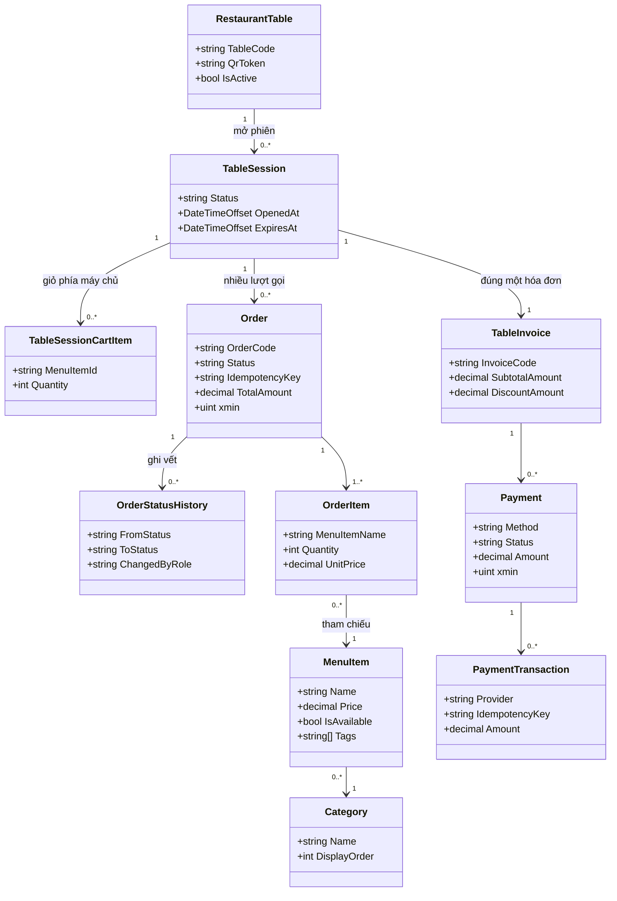

*Hình 6 — Sơ đồ lớp rút gọn của mô hình dữ liệu.*

Trục chính `RestaurantTable → TableSession → Order → OrderItem → MenuItem` là đường đi của
một yêu cầu gọi món. Bội số `TableSession 1 → 1 TableInvoice` đặt cạnh `1 → 0..* Order` thể
hiện trực tiếp quy tắc nghiệp vụ *một phiên có nhiều lượt gọi nhưng chỉ một hóa đơn*.

## 4.4. Ba bất biến đặt ở tầng cơ sở dữ liệu

Đây là phần kỹ thuật đáng chú ý nhất của tầng dữ liệu. Ba quy tắc nghiệp vụ then chốt được
cưỡng chế ở tầng cơ sở dữ liệu chứ không chỉ kiểm ở tầng ứng dụng.

*Bảng 12 — Ba bất biến cưỡng chế ở tầng cơ sở dữ liệu*

| Bất biến | Cơ chế | Vì sao không kiểm ở tầng ứng dụng |
|---|---|---|
| Một bàn chỉ có một phiên đang mở | Unique index có điều kiện trên `RestaurantTableId` khi `Status = Open` | Bốn người quét cùng lúc thì bốn tiến trình cùng đọc "chưa có phiên" rồi cùng tạo. Chỉ ràng buộc ở cơ sở dữ liệu mới chặn được |
| Mã đơn không trùng khi chạy nhiều máy chủ | PostgreSQL sequence | Sinh mã phía ứng dụng thì hai máy chủ có thể sinh cùng một số |
| Hai người sửa cùng một đơn không ghi đè nhau | Optimistic concurrency qua cột hệ thống `xmin` | Người sửa sau sẽ âm thầm xóa thay đổi của người sửa trước |

**Về cột `xmin`.** Đây không phải cột do lập trình viên khai báo mà là cột hệ thống của
PostgreSQL ghi phiên bản của mỗi dòng. EF Core ánh xạ nó thành concurrency token: khi lưu,
EF Core thêm điều kiện `WHERE xmin = <giá trị đã đọc>`. Nếu dòng đã bị người khác sửa thì
`xmin` đã đổi, câu lệnh cập nhật không khớp dòng nào, và EF Core ném ngoại lệ — hệ thống trả
mã lỗi `CONFLICT_STALE` thay vì làm mất dữ liệu.

Nguyên tắc chung rút ra: tầng ứng dụng có lỗi, tầng cơ sở dữ liệu thì không. Ràng buộc
nào quan trọng tới mức không được phép sai thì nên đặt ở nơi thấp nhất có thể.

## 4.5. Truy vấn và nạp dữ liệu liên quan

Khi một entity tham chiếu tới entity khác, có hai cách nạp dữ liệu:

| Cách nạp | Cơ chế | Rủi ro |
|---|---|---|
| **Lazy loading** | Chỉ truy vấn khi thuộc tính liên quan được truy cập | Gây vấn đề N+1: lấy 100 đơn rồi truy cập món của từng đơn sinh ra 101 câu truy vấn |
| **Eager loading** | Nạp sẵn dữ liệu liên quan trong cùng truy vấn, dùng `Include` | Có thể lấy nhiều dữ liệu hơn cần thiết |

Dự án dùng eager loading cho các truy vấn hiển thị danh sách — ví dụ khi bảng bếp lấy
danh sách đơn kèm các món, toàn bộ được nạp trong một lần truy vấn thay vì hàng chục lần.

## 4.6. Giao dịch

Thao tác gửi món lên bếp gồm hai việc phải xảy ra cùng nhau: tạo bản ghi đơn, và xóa giỏ hàng
dùng chung của phiên. Nếu chỉ một trong hai thành công, hệ thống rơi vào trạng thái sai — hoặc
đơn đã tạo mà giỏ vẫn còn món, hoặc giỏ đã xóa mà đơn chưa có.

Dự án bọc cả hai trong một transaction. Đây cũng là lý do kiến trúc chọn một cơ sở dữ liệu
duy nhất thay vì tách thành nhiều dịch vụ: nếu đơn hàng và giỏ hàng nằm trên hai cơ sở dữ liệu
khác nhau thì phải dựng cơ chế bù trừ phức tạp để mô phỏng lại thứ mà một transaction vốn cho
sẵn.

## 4.7. Kết luận chương 4

Tầng dữ liệu dùng PostgreSQL 16 với Entity Framework Core, gồm 24 bảng hình thành qua 22
migration. Điểm đáng chú ý nhất là ba bất biến nghiệp vụ được đưa xuống tầng cơ sở dữ liệu —
unique index có điều kiện, sequence và concurrency token `xmin` — thay vì chỉ kiểm ở tầng ứng
dụng. Lựa chọn PostgreSQL xuất phát trực tiếp từ ba yêu cầu này chứ không phải từ thói quen.

---

# CHƯƠNG 5. GIAO TIẾP THỜI GIAN THỰC

## 5.1. Vì sao HTTP thông thường không đủ

Mô hình HTTP truyền thống là client hỏi, server trả lời. Máy chủ không thể chủ động gửi
dữ liệu khi có thay đổi.

Với bài toán này, hạn chế đó là chí mạng. Khi bếp đánh dấu một món đã xong, màn hình của khách
phải đổi ngay — nhưng khách không bấm gì cả, và cũng không có lý do gì để họ bấm tải lại.

*Bảng 13 — So sánh ba cơ chế đẩy dữ liệu từ máy chủ*

| Cơ chế | Cách hoạt động | Ưu điểm | Hạn chế |
|---|---|---|---|
| **Polling** | Client hỏi lại theo chu kỳ | Đơn giản, chạy ở mọi nơi | Trễ bằng chu kỳ hỏi; tốn băng thông cho các lần hỏi vô ích |
| **Server-Sent Events** | Máy chủ giữ kết nối HTTP và đẩy sự kiện xuống | Nhẹ, dùng lại HTTP | **Một chiều**; giới hạn số kết nối trên HTTP/1.1 |
| **WebSocket** | Kênh song công trên một kết nối TCP | Độ trễ thấp, hai chiều | Có thể bị proxy hoặc tường lửa chặn |

## 5.2. SignalR

Dự án dùng SignalR — thư viện của ASP.NET Core trừu tượng hóa cả ba cơ chế trên.

Điểm mạnh quyết định là cơ chế lùi tự động: SignalR ưu tiên WebSocket, nhưng nếu môi
trường mạng chặn WebSocket thì tự chuyển sang Server-Sent Events, và nếu vẫn không được thì
chuyển sang long-polling — mà mã ứng dụng không phải thay đổi gì.

Điều này quan trọng trong thực tế: mạng wifi của nhà hàng thường đi qua proxy, và không thể
biết trước proxy đó có cho WebSocket đi qua hay không.

Về phía trình duyệt, dự án dùng gói `@microsoft/signalr` phiên bản 9, được bọc lại trong
package nội bộ `realtime-client` để năm ứng dụng dùng chung một cách quản lý vòng đời kết nối.

## 5.3. Tám sự kiện của hệ thống

*Bảng 14 — Tám sự kiện thời gian thực của hệ thống*

| Sự kiện | Phát ra khi | Ai nhận |
|---|---|---|
| `order.created` | Khách gửi món lên bếp | Bảng bếp, màn hình khách |
| `order.statusChanged` | Một đơn đổi trạng thái | Bếp, khách, quầy |
| `order.itemStatusChanged` | Một món trong đơn đổi trạng thái | Bếp, khách |
| `cart.updated` | Giỏ hàng của phiên thay đổi | Các thiết bị cùng phiên bàn |
| `payment.requested` | Khách yêu cầu thanh toán | Quầy thu ngân |
| `tableInvoice.paymentConfirmed` | Quầy xác nhận đã thu tiền của phiên bàn | Màn hình khách, quầy |
| `assistance.requested` | Khách bấm gọi nhân viên | Quầy, nhân viên phục vụ |
| `menu.availabilityChanged` | Bếp bật hoặc tắt trạng thái hết món | Khách đang xem thực đơn |

Sự kiện cuối minh họa rõ giá trị của kênh thời gian thực: khi bếp đánh dấu một món đã hết,
khách đang mở thực đơn thấy thay đổi ngay lập tức, nên không thể gọi món không còn.

**Nhóm kết nối.** SignalR cho phép gom các kết nối thành nhóm. Dự án dùng cơ chế này để một
sự kiện chỉ gửi tới đúng nơi cần: sự kiện của bàn T07 chỉ tới các thiết bị đang mở phiên bàn
T07 và tới màn hình vận hành, không phát cho toàn bộ khách trong nhà hàng.

## 5.4. Kết quả trên giao diện

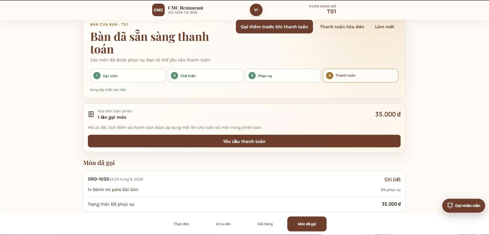

*Hình 7 — Màn hình khách theo dõi trạng thái thời gian thực.*

Thanh bốn bước *Gọi món → Chế biến → Phục vụ → Thanh toán* cập nhật theo sự kiện đẩy về. Dòng
"Đang cập nhật trực tiếp" cho biết kênh thời gian thực đang hoạt động.


*Hình 8 — Bảng bếp cập nhật thời gian thực.*

Điểm cần nhấn: trạng thái mà khách nhìn thấy và trạng thái mà bếp thao tác không phải hai
bản sao cần đồng bộ với nhau. Chúng là cùng một bản ghi trong cơ sở dữ liệu, được hiển
thị theo hai vai trò khác nhau, và kênh SignalR chỉ làm nhiệm vụ báo cho các màn hình biết
rằng bản ghi đó vừa thay đổi.

## 5.5. Kết luận chương 5

Kênh thời gian thực là thành phần biến sản phẩm từ một website thành một hệ thống phối hợp
nhiều vai trò. SignalR được chọn thay vì WebSocket thuần vì cơ chế lùi tự động khi môi trường
mạng chặn WebSocket. Bảy loại sự kiện được thiết kế để mỗi sự kiện chỉ gửi tới đúng nhóm cần
nhận, thay vì phát rộng.

---

# CHƯƠNG 6. KIẾN TRÚC NHIỀU DỊCH VỤ VÀ TRUYỀN DỮ LIỆU DẠNG LUỒNG

## 6.1. Khi nào nên tách một dịch vụ riêng

Phần lớn ứng dụng web bắt đầu là một khối duy nhất, và điều đó thường đúng. Câu hỏi kỹ thuật
đáng quan tâm là: khi nào thì tách một phần ra thành dịch vụ riêng?

Dự án giữ toàn bộ nghiệp vụ nhà hàng trong một tiến trình, nhưng tách duy nhất một thành
phần: dịch vụ tư vấn thực đơn. Tiêu chí tách không phải là sự gọn gàng của sơ đồ mà là sự
khác biệt về vòng đời.

*Bảng 15 — Tiêu chí tách dịch vụ*

| Tiêu chí | Tầng máy chủ nghiệp vụ | Dịch vụ tư vấn |
|---|---|---|
| Ngôn ngữ và môi trường chạy | C# / .NET | Python |
| Kích thước ảnh Docker | ~200 MB | **2,74 GB** |
| Nhịp thay đổi | Theo tính năng nghiệp vụ | Theo kết quả đo chất lượng |
| Cần nhân bản khi | Nhiều bàn cùng gọi món | Nhiều câu hỏi cùng lúc |
| Thời gian phản hồi điển hình | Dưới 100 ms | Vài giây |

Bốn khác biệt trên đều là lý do thực tế. Nếu gộp chung, ảnh Docker của tầng máy chủ sẽ phình
lên gần 3 GB, và mỗi lần sửa một endpoint thực đơn lại phải đóng gói lại toàn bộ thư viện
xử lý ngôn ngữ — biến một thay đổi năm phút thành một quy trình mười lăm phút.

Ngược lại, đơn hàng và thanh toán không được tách, vì chúng luôn thay đổi cùng nhau và
cần chung một giao dịch cơ sở dữ liệu.

## 6.2. Giao tiếp giữa hai dịch vụ

Khi hệ thống có nhiều dịch vụ, cách chúng nói chuyện với nhau trở thành một quyết định thiết
kế. Dự án dùng REST trên mạng nội bộ, với ba ràng buộc:

**Trình duyệt không bao giờ gọi thẳng dịch vụ tư vấn.** Mọi yêu cầu đi qua tầng máy chủ nghiệp
vụ. Nếu cho phép gọi thẳng, sẽ phải cài lại toàn bộ cơ chế xác thực và phân quyền ở dịch vụ
thứ hai — nhân đôi bề mặt tấn công.

**Có xác thực giữa hai dịch vụ.** Mọi lời gọi nội bộ mang theo một token dùng riêng cho kênh
này. Không thể giả định "mạng nội bộ thì an toàn" — nếu một container khác bị chiếm, nó vẫn
nằm trong cùng mạng.

**Dịch vụ tư vấn không có kết nối tới cơ sở dữ liệu.** Nó chỉ nhận dữ liệu qua tham số và trả
kết quả. Nhờ vậy nó không thể vô tình sửa dữ liệu nghiệp vụ, kể cả khi có lỗi lập trình.

```
Trình duyệt ──HTTPS──► Máy chủ nghiệp vụ ──REST nội bộ──► Dịch vụ tư vấn
                            │  (kèm token nội bộ)              │
                            ▼                                  ✗
                       PostgreSQL                    không có đường tới CSDL
```

*Hình 9 — Đường đi của một yêu cầu qua hai dịch vụ.*

## 6.3. Truyền dữ liệu dạng luồng bằng Server-Sent Events

Câu trả lời của dịch vụ tư vấn mất vài giây để sinh ra. Nếu chờ sinh xong mới trả về, người
dùng nhìn màn hình trống suốt thời gian đó và dễ tưởng hệ thống bị treo.

Giải pháp là truyền dạng luồng: máy chủ gửi từng phần ngay khi có, thay vì gửi một lần
toàn bộ.

*Bảng 16 — Ba cách trả về một phản hồi dài*

| Cách | Trải nghiệm | Độ phức tạp |
|---|---|---|
| Trả một lần khi xong | Màn hình trống vài giây, dễ tưởng treo | Thấp nhất |
| Client hỏi lại theo chu kỳ | Thấy tiến độ nhưng giật cục, tốn nhiều lượt gọi | Trung bình |
| **Server-Sent Events** | Chữ hiện dần, cảm giác phản hồi ngay | Trung bình |

Dự án cung cấp hai endpoint song song: một endpoint trả về trọn gói, và một endpoint truyền
luồng bằng SSE cho giao diện chat.

**SSE khác WebSocket ở chỗ nào.** SSE là một chiều — chỉ máy chủ gửi xuống — và chạy trên
HTTP thông thường nên đi qua được hầu hết proxy. WebSocket hai chiều nhưng nặng hơn về
thiết lập. Với bài toán này, dữ liệu chỉ chảy một chiều từ máy chủ xuống trình duyệt, nên SSE
là lựa chọn vừa đủ.

**Khuôn dạng SSE.** Mỗi khối dữ liệu là các dòng văn bản kết thúc bằng một dòng trống:

```
event: chunk
data: {"text": "Mời bạn tham khảo:"}

event: chunk
data: {"text": " Bánh xèo miền Tây (85.000đ)"}

event: done
data: {"finished": true}
```

Chi tiết nhỏ nhưng quan trọng: dòng `event:` cho biết loại sự kiện. Trong quá trình phát
triển, dịch vụ tư vấn từng phát luồng thiếu dòng này, khiến tầng máy chủ không nhận ra
khuôn dạng, bỏ qua toàn bộ luồng và trả về câu dự phòng. Điều đáng nói là phép kiểm riêng
của cả hai dịch vụ đều đạt, vì mỗi bên tự kiểm theo giả định khuôn dạng của riêng mình. Đây
là loại lỗi chỉ lộ ra khi kiểm thử chạy trên toàn hệ thống, trình bày ở mục 8.3.

## 6.4. Ngân sách thời gian chờ phân tầng

Khi một yêu cầu đi qua nhiều dịch vụ, mỗi tầng có một giới hạn thời gian chờ. Nếu đặt sai thứ
tự, hệ thống sẽ hỏng theo cách khó hiểu.

Dự án đặt ngân sách giảm dần từ ngoài vào trong:

```
Trình duyệt   chờ tối đa 60 s
    └─ Máy chủ nghiệp vụ   chờ dịch vụ tư vấn tối đa 50 s
          └─ Dịch vụ tư vấn   chờ nhà cung cấp mô hình tối đa 30 s
```

**Vì sao thứ tự này quan trọng.** Nếu tầng trong chờ lâu hơn tầng ngoài, tầng ngoài sẽ bỏ cuộc
trước và trả lỗi, trong khi tầng trong vẫn đang xử lý — tài nguyên bị chiếm vô ích và thông
báo lỗi không phản ánh đúng nguyên nhân. Đặt ngân sách giảm dần bảo đảm tầng trong luôn kịp
báo lỗi có ý nghĩa trước khi tầng ngoài hết kiên nhẫn.

Số đo thực tế của hệ thống: thời gian phản hồi trung vị 8,6 giây, phân vị 95 là 13,5
giây — đều nằm trong ngân sách 30 giây của tầng trong cùng.

## 6.5. Suy giảm êm

Nguyên tắc: lỗi của một dịch vụ phụ không được biến thành lỗi của cả hệ thống.

| Tình huống | Hệ thống làm gì |
|---|---|
| Nhà cung cấp mô hình không phản hồi | Chuyển sang đường xử lý tất định, vẫn trả lời được phần lớn câu hỏi |
| Thiếu khóa cấu hình | Dịch vụ vẫn khởi động bình thường, chỉ tắt phần cần khóa |
| Lỗi nội bộ chưa lường trước | Trả về HTTP 200 kèm câu chuyển tiếp tới nhân viên, không phải màn hình lỗi |

Điểm cuối đáng giải thích. Thông thường lỗi máy chủ trả mã 500, nhưng ở đây khách đang ngồi
trong nhà hàng và chỉ muốn gọi món. Một màn hình lỗi kỹ thuật không giúp gì cho họ. Trả 200
kèm câu *"anh/chị vui lòng gọi nhân viên hỗ trợ"* là phản hồi hữu ích hơn, còn chi tiết lỗi
vẫn được ghi vào log kèm mã tham chiếu để người vận hành tra cứu.

Khẳng định về hành vi khi lỗi này có phép kiểm đi đúng đường lỗi: bài kiểm thay hàm xử lý
bằng một hàm cố ý phát sinh ngoại lệ, rồi yêu cầu hệ thống vẫn phải trả 200 kèm đúng câu
chuyển tiếp.

## 6.6. Kết luận chương 6

Chương này trình bày kiến trúc nhiều dịch vụ với tiêu chí tách dựa trên khác biệt vòng đời,
cơ chế giao tiếp nội bộ có xác thực và cô lập quyền truy cập dữ liệu, kỹ thuật truyền luồng
bằng Server-Sent Events, ngân sách thời gian chờ phân tầng, và ba mức suy giảm êm. Bốn kỹ
thuật này đều là thứ một ứng dụng web thật cần khi nó không còn là một tiến trình duy nhất.

---

# CHƯƠNG 7. BẢO MẬT ỨNG DỤNG WEB

## 7.1. Các lớp bảo mật

Bảo mật của một ứng dụng web không nằm ở một cơ chế duy nhất mà ở nhiều lớp bổ trợ nhau.

*Bảng 17 — Các lớp bảo mật và cơ chế tương ứng*

| Lớp | Cơ chế trong dự án |
|---|---|
| Kênh truyền | HTTPS bắt buộc · HSTS · chuyển hướng HTTP sang HTTPS |
| Gọi chéo tên miền | CORS khai báo danh sách nguồn được phép |
| Xác thực nhân viên | JWT Bearer |
| Xác thực khách | Capability token cấp theo lần quét mã QR |
| Lưu mật khẩu | PBKDF2-HMAC-SHA256 có salt |
| Chống dò mật khẩu | Khóa tài khoản sau nhiều lần đăng nhập sai |
| Phân quyền | Kiểm tra vai trò ở tầng máy chủ |
| Rò rỉ qua thông báo lỗi | Chỉ trả mã tham chiếu, chi tiết vào log |
| Quản lý bí mật | Biến môi trường, không đưa vào mã nguồn |
| Quét lỗ hổng | Bốn bộ quét tự động chạy trên mọi thay đổi |

## 7.2. Xác thực bằng JWT

**JSON Web Token** là chuỗi ký tự gồm ba phần ngăn cách bởi dấu chấm:

```
<header>.<payload>.<signature>
```

- **Header** khai báo loại token và thuật toán ký.
- **Payload** chứa các *claim*: người dùng là ai, vai trò gì, token hết hạn khi nào.
- **Signature** là chữ ký để bảo đảm token không bị sửa.

Client gửi token trong header của mỗi yêu cầu:

```
Authorization: Bearer <token>
```

Middleware `UseAuthentication` kiểm tra chữ ký và thời hạn, rồi dựng đối tượng `HttpContext.User`
để các tầng sau sử dụng.

**Đặc điểm quan trọng: JWT là stateless.** Máy chủ không cần lưu phiên vì mọi thông tin cần
thiết đã nằm trong token và được chữ ký bảo vệ. Điều này giúp mở rộng theo chiều ngang dễ
dàng — thêm máy chủ mới không phải chia sẻ bộ nhớ phiên. Đổi lại, không thể thu hồi một token
đã phát hành trước khi nó hết hạn, nên thời hạn token phải đặt hợp lý.

## 7.3. Capability token cho khách không đăng nhập

Đây là bài toán riêng của sản phẩm: khách tại bàn không có tài khoản. Họ chỉ quét mã QR
rồi gọi món. Vậy dựa vào đâu để cho phép họ thao tác?

Cách làm ngây thơ là dùng chính `sessionId` làm chứng chỉ — ai biết mã phiên thì được thao
tác. Cách này sai, vì mã phiên xuất hiện trên thanh địa chỉ và có thể bị chia sẻ hoặc đoán ra.

Dự án tách bạch hai khái niệm:

*Bảng 18 — So sánh JWT và capability token*

| Tiêu chí | JWT | Capability token |
|---|---|---|
| Dành cho | Nhân viên đã đăng nhập | Khách không đăng nhập |
| Mang thông tin gì | Danh tính và vai trò | Quyền thao tác trong đúng một phiên bàn |
| Cấp khi nào | Đăng nhập thành công | Mỗi lần quét mã QR |
| Phạm vi | Toàn hệ thống theo vai trò | Chỉ phiên bàn được cấp |

Nguyên tắc rút ra: mã định danh không phải chứng chỉ ủy quyền. Biết `sessionId` không đồng
nghĩa với được quyền thao tác trong phiên đó. Đây cũng là lý do mã trong QR — vốn được in ra
và dán công khai tại bàn — không được dùng trực tiếp làm chứng chỉ, mà phải đổi lấy một
capability token cấp riêng cho từng lần quét.

## 7.4. Phân quyền theo vai trò

*Bảng 19 — Bốn vai trò và phạm vi quyền*

| Vai trò | Được làm gì |
|---|---|
| `Admin` | Quản lý thực đơn, bàn, mã QR, tài khoản và phân quyền |
| `CounterStaff` | Tổng hợp hóa đơn, xác nhận thu tiền, mở và đóng ca quầy |
| `Kitchen` | Cập nhật tiến độ chế biến, bật tắt trạng thái hết món |
| `Staff` | Theo dõi bàn và xử lý yêu cầu hỗ trợ |

**Nguyên tắc không tin client.** Vai trò trong ứng dụng React chỉ dùng để quyết định hiển thị
gì cho gọn mắt. Nó không phải cơ chế phân quyền. Ẩn một nút trên giao diện không ngăn được
ai đó gọi thẳng vào API bằng công cụ khác. Mọi quyết định về quyền đều do máy chủ đưa ra, ở
tầng `UseAuthorization` của pipeline.

## 7.5. Quét lỗ hổng tự động

*Bảng 20 — Bộ quét bảo mật tự động*

| Công cụ | Tìm loại vấn đề gì |
|---|---|
| **CodeQL** | Lỗ hổng trong mã nguồn C#, JavaScript/TypeScript và Python |
| **gitleaks** | Khóa bí mật vô tình bị đưa vào lịch sử mã nguồn |
| **Trivy** | Lỗ hổng đã biết trong thư viện phụ thuộc và trong ảnh container |
| **dependency-review** | Thư viện mới thêm vào có lỗ hổng hay không |

Bốn công cụ này chạy tự động trên mọi thay đổi mã nguồn. Chúng đã phát hiện một lỗ hổng thật:
CodeQL báo *Information exposure through an exception* tại ba vị trí mà không ai nhận ra khi
đọc lại mã — vì từ góc nhìn của người viết, trả chi tiết lỗi ra ngoài trông giống một hành
động thân thiện với người dùng.

Bài học kỹ thuật rút ra: con người rà soát mã theo ý định, còn công cụ rà soát theo luồng
dữ liệu. Chỉ góc nhìn thứ hai mới lần ra được đường đi từ nội dung ngoại lệ tới phản hồi
HTTP gửi cho người dùng.

## 7.6. Kết luận chương 7

Bảo mật của ứng dụng được xây theo nhiều lớp bổ trợ, từ kênh truyền tới xác thực, phân quyền
và quét lỗ hổng tự động. Điểm kỹ thuật đáng chú ý nhất là việc tách bạch giữa mã định danh và
chứng chỉ ủy quyền: capability token cho phép khách không đăng nhập vẫn thao tác an toàn trong
đúng phạm vi phiên bàn của họ.

---

# CHƯƠNG 8. TRIỂN KHAI, KIỂM THỬ VÀ VẬN HÀNH

## 8.1. Đóng gói bằng Docker

Vấn đề kinh điển khi triển khai ứng dụng web là *"chạy được trên máy em nhưng không chạy trên
máy chủ"*. Nguyên nhân thường là khác phiên bản môi trường chạy, khác thư viện hệ thống, hoặc
khác cấu hình.

**Container** giải quyết bằng cách đóng gói ứng dụng cùng toàn bộ môi trường chạy của nó vào
một ảnh duy nhất. Ảnh đó chạy giống hệt nhau ở mọi nơi.

*Bảng 21 — Dịch vụ trong Docker Compose*

| Dịch vụ | Nội dung | Ghi chú |
|---|---|---|
| `db` | PostgreSQL 16 | Dữ liệu lưu trên volume để không mất khi dựng lại container |
| `api` | ASP.NET Core | Ảnh khoảng 200 MB |
| `ai` | Dịch vụ tư vấn | Ảnh 2,74 GB do chứa thư viện xử lý ngôn ngữ |
| `web` | Tệp tĩnh của năm ứng dụng React | Phục vụ sau lớp HTTPS |

Ba tên miền được cấu hình phía trước: `cmcrestaurant.app` cho trang giới thiệu,
`order.cmcrestaurant.app` cho luồng gọi món, `admin.cmcrestaurant.app` cho cổng vận hành.

Một chi tiết tối ưu đáng nêu: khi cài thư viện xử lý ngôn ngữ theo mặc định, trình quản lý gói
tải về bản dành cho GPU và ảnh phình lên 9,29 GB trong khi máy chủ không có GPU. Ghim bản
dành cho CPU đưa ảnh xuống 2,74 GB, và thời gian khởi động dịch vụ giảm từ 97,3 giây
xuống 19,0 giây.

## 8.2. Tích hợp liên tục và triển khai liên tục (CI/CD)

### 8.2.1. Hai khái niệm

Đây là hai khái niệm hay bị dùng lẫn nên cần phân biệt rõ.

**Continuous Integration (CI) — tích hợp liên tục.** Mỗi thay đổi mã nguồn được tự động
kiểm tra ngay khi đưa lên: biên dịch được không, các phép kiểm có đạt không, cấu hình có
hợp lệ không. Mục đích là phát hiện lỗi trong vài phút thay vì vài ngày, khi việc sửa còn rẻ.

**Continuous Delivery / Deployment (CD) — chuyển giao và triển khai liên tục.** Sau khi CI
đạt, phiên bản mới được tự động đưa lên môi trường chạy, không cần thao tác tay. Điều này
loại bỏ lớp lỗi do triển khai thủ công — quên một bước, chép nhầm tệp cấu hình, hoặc mỗi lần
làm một kiểu.

Dự án áp dụng cả hai, với tổng cộng 9 workflow trên GitHub Actions và 2.468 lần chạy
tính tới thời điểm chốt báo cáo.

### 8.2.2. Dòng chảy đầy đủ

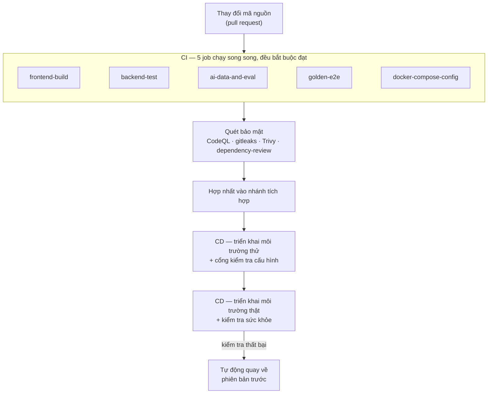

*Hình 10 — Dòng chảy CI/CD từ thay đổi mã nguồn tới môi trường thật.*

### 8.2.3. Năm phép kiểm bắt buộc

*Bảng 22 — Năm job kiểm tra trong CI*

| Job | Trả lời câu hỏi gì | Thuộc tầng nào |
|---|---|---|
| `frontend-build` | Năm ứng dụng React có build ra được không | Giao diện |
| `backend-test` | 84 phép kiểm nghiệp vụ, phân quyền, giao dịch có đạt không | Máy chủ |
| `ai-data-and-eval` | Dữ liệu và tài liệu sinh lại có khớp bản đã lưu không | Dữ liệu |
| `golden-e2e` | Toàn bộ luồng gọi món có chạy xuyên các dịch vụ không | Toàn hệ thống |
| `docker-compose-config` | Cấu hình triển khai có hợp lệ không | Hạ tầng |

Năm job này chạy song song để rút ngắn thời gian phản hồi, và cả năm phải đạt thì thay
đổi mới được hợp nhất.

### 8.2.4. Biến CI thành cổng chặn thật sự

Một pipeline CI chỉ có giá trị khi nó ngăn được mã lỗi đi vào nhánh chính. Nếu nó chỉ báo
đỏ mà vẫn hợp nhất được thì nó là một bảng thông báo, không phải một cổng kiểm soát.

Dự án khai báo cả năm job là status check bắt buộc ở cấu hình nhánh, với hai đặc điểm:

| Cấu hình | Ý nghĩa |
|---|---|
| Áp dụng cho `main` và nhánh tích hợp | Không nhánh quan trọng nào được miễn |
| **Danh sách ngoại lệ để rỗng** | Kể cả chủ repository cũng không bỏ qua được |
| Chặn ghi đè lịch sử | Không ai viết lại được lịch sử đã đẩy lên |

Việc để danh sách ngoại lệ rỗng là quyết định có chủ đích. Nền tảng cho phép chừa cửa cho
quản trị viên, và đó là mặc định mà phần lớn dự án giữ nguyên. Nhóm bỏ hẳn cửa đó, vì một
cổng chặn có ngoại lệ cho người quyền cao nhất thì đúng vào lúc nguy hiểm nhất — lúc gấp,
lúc muộn, lúc *"chỉ sửa một dòng"* — nó sẽ không chặn.

### 8.2.5. Cổng kiểm tra cấu hình hai đầu

Đây là cơ chế dự án tự thiết kế thêm, sinh ra từ một sự cố thật: một biến môi trường mô tả
**sai** thành phần đang chạy. Biến đó không mô-đun nào đọc nên nó không gây lỗi — nhưng mọi
người đọc cấu hình đều tin nó, kể cả chính các thành viên trong nhóm.

Giải pháp là hai điểm kiểm tra hỏi hai câu khác nhau nhưng lấy kỳ vọng từ cùng một nguồn:

| Chạy ở đâu | Câu hỏi |
|---|---|
| Trong CI, trước khi triển khai | *"Cấu hình sắp đưa lên có khớp với bằng chứng đã đo không?"* |
| Trên máy chủ, sau khi triển khai | *"Dịch vụ đang chạy có đúng là cấu hình ấy không?"* |

Bài học rút ra vượt ra ngoài phạm vi một dự án: cấu hình sai còn nguy hiểm hơn thiếu tài
liệu, vì thiếu tài liệu khiến người ta đi hỏi, còn cấu hình sai khiến người ta tin chắc vào
một điều không đúng.

### 8.2.6. Kiểm tra sức khỏe và tự động quay lại

Sau khi triển khai, hệ thống chạy một loạt kiểm tra nhanh. Nếu thất bại, phiên bản cũ được
khôi phục tự động — không chờ người bấm, vì sự cố có thể xảy ra vào lúc không có ai trực.

Hai điểm kiểm tra sức khỏe được cung cấp cho hệ thống giám sát:

| Đường dẫn | Trả lời câu hỏi | Dùng khi nào |
|---|---|---|
| `/health/live` | Tiến trình còn sống không | Bộ điều phối quyết định có khởi động lại container không |
| `/health/ready` | Đã sẵn sàng nhận yêu cầu chưa | Bộ cân bằng tải quyết định có gửi lưu lượng vào không |

Phân biệt hai điểm này quan trọng: một dịch vụ có thể sống nhưng chưa sẵn sàng — ví
dụ đang nạp dữ liệu khởi tạo hoặc chưa kết nối được cơ sở dữ liệu. Gửi lưu lượng vào lúc đó
sẽ gây lỗi cho người dùng.

## 8.3. Kiểm thử

*Bảng 23 — Bốn tầng kiểm thử*

| Tầng | Số lượng | Kiểm cái gì |
|---|---|---|
| Giao diện | **118 test / 36 tệp** | Logic điều hướng, định dạng, ranh giới hợp đồng dữ liệu |
| Máy chủ | **84 test / 25 tệp** | Vòng đời đơn, thanh toán, phiên bàn, phân quyền |
| Dịch vụ tư vấn | **386 test** | Xử lý câu hỏi, phiên, giới hạn quyền |
| Đầu-cuối | **29 kịch bản / 103 bước** | Dựng toàn bộ hệ thống rồi thao tác như người dùng thật |

Tầng đầu-cuối ra đời từ một sự cố có thật: hai dịch vụ trao đổi dữ liệu theo hai giả định khác
nhau về khuôn dạng, khiến luồng bị hỏng — trong khi kiểm thử riêng của cả hai dịch vụ đều
đạt. Đây là loại lỗi mà không tầng kiểm thử thành phần nào phát hiện được, chỉ có kiểm thử
chạy trên toàn hệ thống mới thấy.

## 8.4. Kết luận chương 8

Ứng dụng được đóng gói bằng Docker và triển khai tự động qua một chuỗi gồm kiểm tra tự động,
quét bảo mật, triển khai môi trường thử rồi môi trường thật, kèm cơ chế quay lại tự động khi
kiểm tra sức khỏe thất bại. Bốn tầng kiểm thử với tổng cộng hơn 600 phép kiểm bảo đảm mỗi thay
đổi đều được xác nhận trước khi lên môi trường thật.

---

# KẾT LUẬN

## 1. Tổng hợp công nghệ đã áp dụng

*Bảng 24 — Tổng hợp công nghệ đã áp dụng*

| Tầng | Công nghệ | Vấn đề nó giải quyết |
|---|---|---|
| Giao diện | React 19 + TypeScript + Vite, monorepo 5 app | Bốn nhóm người dùng có hoàn cảnh khác nhau; khách dùng 4G không nên tải bundle quản trị |
| | React Router | Điều hướng không tải lại trang, giữ ngữ cảnh phiên bàn |
| Máy chủ | ASP.NET Core, Minimal API | Không kết xuất giao diện nên bỏ được toàn bộ tầng View của MVC |
| | Middleware pipeline 8 tầng | Tách bạch từng mối quan tâm: HTTPS, CORS, lỗi, xác thực, phân quyền |
| | Dependency Injection theo mô-đun | Giữ tệp khởi động ngắn dù có 84 endpoint |
| Dữ liệu | PostgreSQL 16 + EF Core | Ba bất biến nghiệp vụ cần đúng tính năng của PostgreSQL |
| | 21 migration | Lược đồ tiến hóa được và dựng lại được |
| Thời gian thực | SignalR | Bếp thao tác thì màn hình khách đổi ngay, không cần tải lại |
| Bảo mật | JWT + capability token | Nhân viên có tài khoản, khách thì không — hai cơ chế cho hai đối tượng |
| | Bốn bộ quét tự động | Tìm loại lỗi mà mắt người đọc mã bỏ sót |
| Triển khai | Docker Compose + tự động hóa | Loại bỏ khác biệt môi trường; quay lại được khi hỏng |

## 2. Những kỹ thuật vượt ngoài phạm vi một ứng dụng cơ bản

Ba kỹ thuật dưới đây thường không xuất hiện trong bài tập nhỏ nhưng bắt buộc với ứng dụng
web thật:

**Kiểm soát đồng thời bằng `xmin`.** Khi hai người cùng sửa một bản ghi, hệ thống phát hiện
và từ chối thay vì để người sau âm thầm ghi đè người trước.

**Khóa idempotency.** Khi mạng chập chờn khiến một yêu cầu bị gửi lại, hệ thống nhận ra và
không tạo bản ghi trùng — đặc biệt quan trọng với các thao tác liên quan tới tiền.

**Ràng buộc đặt ở tầng cơ sở dữ liệu.** Unique index có điều kiện chặn được tình huống nhiều
tiến trình cùng lúc tạo phiên cho một bàn, thứ mà kiểm tra ở tầng ứng dụng không chặn nổi.

## 3. Bài học rút ra

**Mỗi lựa chọn công nghệ nên xuất phát từ một ràng buộc có thật.** Dự án tách năm ứng dụng
vì khách dùng 4G; chọn PostgreSQL vì cần ba tính năng cụ thể; chọn SignalR vì mạng nhà hàng
có thể chặn WebSocket. Ngược lại, dự án không dùng Kubernetes, không dùng cơ sở dữ liệu vector
chuyên dụng — vì không có ràng buộc nào đòi hỏi chúng.

**Tầng thấp nhất có thể là nơi tốt nhất để đặt ràng buộc quan trọng.** Tầng ứng dụng có lỗi;
tầng cơ sở dữ liệu thì không.

**Không tin dữ liệu từ phía client.** Giao diện có thể bị sửa; mọi kiểm tra quan trọng phải
lặp lại ở máy chủ.

## 4. Hạn chế và hướng phát triển

**Hạn chế.** Hệ thống chưa được kiểm thử tải nên chưa biết ngưỡng chịu đựng khi nhiều bàn
dùng đồng thời. Chưa có báo cáo độ phủ mã nguồn thống nhất cho cả ba tầng. Chưa kiểm thử khả
năng tiếp cận cho người dùng trình đọc màn hình.

Hai hạn chế còn lại nằm ở chính trải nghiệm của khách, và đều liên quan trực tiếp tới lớp thời
gian thực đã trình bày ở chương 6. Thứ nhất, hệ thống chưa ước lượng và thông báo thời gian
lên món: kênh thời gian thực đẩy được sự kiện *món đã sẵn sàng* ngay khi bếp bấm, nhưng trước
thời điểm đó khách không biết mình còn phải chờ bao lâu. Nguyên nhân không nằm ở tầng web mà ở
dữ liệu — một ước lượng đáng tin cần thời gian chế biến thực tế của từng món và mốc thời gian đo
theo từng món, trong khi bảng lịch sử hiện chỉ ghi mốc ở cấp lượt gọi. Nhóm chọn không hiển thị
một con số tự đặt, vì với giao diện cập nhật theo thời gian thực thì một ước lượng sai sẽ lộ ra
ngay trước mắt khách và làm hỏng lòng tin nhiều hơn là không hiển thị gì.

Thứ hai, khách chưa tự hủy được món của mình. Quy tắc hủy đã có ở tầng nghiệp vụ — món chỉ
hủy được khi bếp chưa làm xong, và cả lượt gọi bị khóa hủy ngay khi một món vào bếp — và các
màn hình của bếp, phục vụ, quản trị đều đã có thao tác hủy. Phần còn thiếu thuần túy là ở lớp
xác thực đã trình bày ở chương 5: endpoint đổi trạng thái món hiện chỉ mở cho vai trò nhân viên,
trong khi khách đi theo cơ chế thẻ truy cập theo lượt gọi chứ không có vai trò trong hệ thống.

**Hướng phát triển.** Ngắn hạn: mở thao tác hủy món cho khách — việc rẻ nhất trong danh sách vì
quy tắc nghiệp vụ đã có sẵn và không cần đổi lược đồ cơ sở dữ liệu, chỉ cần thêm nhánh xác thực
theo thẻ truy cập lượt gọi và một nút trên màn hình theo dõi đơn; song song đó kiểm thử tải để
xác định trần số phiên đồng thời và thiết lập đo độ phủ mã nguồn. Trung hạn: xây dựng ước lượng
thời gian lên món theo thứ tự đo trước hiển thị sau, đồng thời bổ sung khả năng quan sát gồm log
tập trung và cảnh báo tự động, và kiểm thử khả năng tiếp cận. Dài hạn: hỗ trợ nhiều chi nhánh,
và xây dựng ứng dụng di động cho nhân viên phục vụ nếu vận hành thực tế cho thấy cần.

---

# TÀI LIỆU THAM KHẢO

[[1]](https://learn.microsoft.com/aspnet/core)
Microsoft, *ASP.NET Core documentation*.

[[2]](https://learn.microsoft.com/ef/core)
Microsoft, *Entity Framework Core documentation*.

[[3]](https://learn.microsoft.com/aspnet/core/signalr)
Microsoft, *ASP.NET Core SignalR documentation*.

[[4]](https://learn.microsoft.com/aspnet/core/fundamentals/middleware)
Microsoft, *ASP.NET Core Middleware*.

[[5]](https://react.dev)
Meta, *React documentation*.

[[6]](https://reactrouter.com)
Remix, *React Router documentation*.

[[7]](https://vite.dev)
E. You et al., *Vite documentation*.

[[8]](https://www.typescriptlang.org/docs/)
Microsoft, *TypeScript documentation*.

[[9]](https://www.postgresql.org/docs/16/)
The PostgreSQL Global Development Group, *PostgreSQL 16 Documentation*.

[[10]](https://datatracker.ietf.org/doc/html/rfc7519)
M. Jones, J. Bradley, N. Sakimura, *JSON Web Token (JWT)*, RFC 7519, IETF, 2015.

[[11]](https://docs.docker.com/compose/)
Docker Inc., *Docker Compose documentation*.

[[12]](https://github.com/Anpham120/restaurant-qr-ai-ordering)
Nhóm sinh viên, *CMC Restaurant — mã nguồn dự án*, 2026.

---

<div align="center">
<sub>Báo cáo học phần Công nghệ lập trình Web — Trường Đại học CMC — tháng 8 năm 2026</sub>
</div>
