<div align="center">
  

# BÁO CÁO BÀI TẬP LỚN
## Học phần: Công nghệ phần mềm — INFO2005 (3 tín chỉ)

**Trường Đại học CMC — Khoa Công nghệ thông tin & Truyền thông**

**Đề tài:** CMC Restaurant — Hệ thống gọi món và theo dõi trạng thái đơn tại bàn bằng QR,
tích hợp trợ lý AI tư vấn thực đơn

**Repository:** [Kho mã nguồn GitHub](https://github.com/Anpham120/restaurant-qr-ai-ordering)

**Sản phẩm trực tuyến:** [cmcrestaurant.app](https://cmcrestaurant.app) · [order.cmcrestaurant.app](https://order.cmcrestaurant.app) · [admin.cmcrestaurant.app](https://admin.cmcrestaurant.app)

**Giảng viên phụ trách:** Trương Anh Hoàng

**Thời gian thực hiện:** 04/06/2026 – 02/08/2026

</div>

**Nhóm thực hiện (05 sinh viên):**

| Họ và tên | MSSV | Vai trò chính |
|---|---|---|
| Phạm Duy An | BIT240002 | Nhóm trưởng — thiết kế hệ thống, AI/RAG, DevOps |
| Bùi Đào Đức Anh | BIT240025 | Backend — xác thực, phiên bàn, thanh toán |
| Nguyễn Quang Hiếu | BIT240091 | Backend — cơ sở dữ liệu, đơn hàng, thời gian thực |
| Đỗ Tuấn Anh | BIT240015 | Frontend — trải nghiệm khách hàng |
| Lê Anh | BIT240017 | Frontend — giao diện vận hành |

---

## Tóm tắt dự án

Đề tài nghiên cứu việc áp dụng các nguyên lý công nghệ phần mềm để xây dựng một hệ thống hỗ trợ
khách gọi món và theo dõi trạng thái đơn tại bàn bằng mã QR, đồng thời nhận tư vấn thực đơn bằng
AI. Qua quan sát ban đầu tại hai
nhà hàng quy mô vừa ở Hà Nội, nhóm nhận thấy quá trình phục vụ không chỉ gồm thao tác ghi món,
mà là một chuỗi trao đổi trạng thái giữa khách, nhân viên phục vụ, bếp và quầy thu ngân. Khi thông
tin được chuyển bằng lời nói, phiếu giấy hoặc nhiều màn hình không dùng chung dữ liệu, khách khó
biết yêu cầu đã được tiếp nhận hay chưa, bếp khó xác định thứ tự cần xử lý và quầy phải tổng hợp
lại nhiều lượt gọi món trước khi thanh toán.

Từ bối cảnh trên, nhóm phát triển CMC Restaurant theo hai điểm vào chính. Thứ nhất, mã QR gắn với
từng bàn đưa khách vào đúng ngữ cảnh phục vụ, cho phép xem thực đơn, tạo hoặc tiếp tục phiên bàn,
quản lý giỏ hàng, gọi món nhiều lượt và theo dõi trạng thái. Thứ hai, trợ lý AI tiếp nhận yêu cầu
bằng tiếng Việt để hỗ trợ tra cứu và gợi ý món theo khẩu vị, ngân sách hoặc dị nguyên, nhưng chỉ
được sử dụng dữ liệu thực đơn do hệ thống quản lý và không có quyền tự ghi món vào giỏ hàng. Hai
thành phần này được tích hợp với backend nghiệp vụ, cơ sở dữ liệu, bảng bếp và quầy thu ngân để
duy trì một nguồn trạng thái dùng chung trong suốt phiên phục vụ.

CMC Restaurant được xây dựng dưới dạng một sản phẩm khả dụng tối thiểu (MVP), không nhằm khẳng
định rằng mã QR hoặc AI có thể thay thế hoàn toàn nhân viên. Trọng tâm chính của đề tài là luồng
**quét QR — gọi món tại đúng bàn — theo dõi trạng thái đơn của bàn cho đến khi phục vụ và thanh
toán**. Trợ lý AI là thành phần bổ trợ cho bước lựa chọn món, không phải trung tâm điều khiển quy
trình. Khách chủ động khởi tạo tương tác bằng mã QR; hệ thống xác định đúng bàn và phiên; khách
gửi món và theo dõi trạng thái; AI chỉ tư vấn trong phạm vi dữ liệu; còn bếp, quầy và quản trị viên
kiểm soát các trạng thái nghiệp vụ thuộc thẩm quyền của mình. Quá trình thực hiện bao gồm phân tích
yêu cầu, thiết kế kiến trúc, quản lý công việc trên GitHub, kiểm thử tự động và triển khai lên môi
trường VPS để kiểm tra khả năng vận hành đầu cuối.

Kết quả tại thời điểm chốt báo cáo cho thấy MVP đã triển khai được các luồng nghiệp vụ chính và
có các bộ kiểm thử ở frontend, backend và dịch vụ AI. Những số liệu dưới đây phản ánh quy mô hiện
tại của sản phẩm, không được sử dụng thay cho đánh giá hiệu quả thực tế tại nhà hàng:

| Hạng mục | Con số |
|---|---|
| Thời gian và nhân lực | 9 tuần, 5 sinh viên |
| Quy mô mã nguồn | 377 tệp, khoảng 97.400 dòng |
| Bề mặt API | 84 endpoint, 24 bảng cơ sở dữ liệu, 22 migration |
| Kiểm thử | 118 frontend + 84 backend + 386 AI + 128 thước đo |
| Hoạt động trên GitHub | 46 issue (42 issue thuộc 5 milestone), 872 commit, 377 pull request (305 đã merge, 71 đóng không merge, 1 còn mở), 2.468 lần chạy workflow |
| An toàn dị nguyên | Không ghi nhận lỗi trên 140 ca kiểm chứng, trong phạm vi dữ liệu nhãn hiện có |

Báo cáo tập trung vào quá trình hình thành sản phẩm, các quyết định kiến trúc, phương pháp bảo đảm
chất lượng và cách nhóm kiểm chứng các kết quả. Do phạm vi khảo sát người dùng còn nhỏ và chưa có
thử nghiệm vận hành dài hạn tại nhà hàng, báo cáo chỉ kết luận về mức độ hoàn thành kỹ thuật của
MVP; chưa kết luận rằng sản phẩm đã làm giảm thời gian phục vụ hoặc sai sót nghiệp vụ trong thực
tế. Các giới hạn này được trình bày tại mục 5.3.

**Từ khóa:** công nghệ phần mềm; gọi món bằng mã QR; quản lý phiên bàn; trợ lý AI; RAG; kiểm thử
phần mềm; CI/CD.

---

## Mục lục

- **[Danh mục bảng](#danh-mục-bảng)**
- **[Danh mục hình](#danh-mục-hình)**
- **[Danh mục từ viết tắt](#danh-mục-từ-viết-tắt)**
- **[Bảng phân công công việc](#bảng-phân-công-công-việc)**
- **[Đặt vấn đề](#đặt-vấn-đề)**
- **[1. Giới thiệu chung](#1-giới-thiệu-chung)**
  - [1.1. Lý do chọn đề tài](#11-lý-do-chọn-đề-tài)
  - [1.2. Tầm nhìn sản phẩm (Product Vision)](#12-tầm-nhìn-sản-phẩm-product-vision)
  - [1.3. Mục tiêu và phạm vi](#13-mục-tiêu-và-phạm-vi)
  - [1.4. Ý nghĩa và ứng dụng thực tế](#14-ý-nghĩa-và-ứng-dụng-thực-tế)
  - [1.5. Tổ chức báo cáo](#15-tổ-chức-báo-cáo)
- **[2. Phân tích & thiết kế sản phẩm](#2-phân-tích--thiết-kế-sản-phẩm)**
  - [2.1. Phân tích nhu cầu người dùng](#21-phân-tích-nhu-cầu-người-dùng)
  - [2.2. Yêu cầu chức năng và phi chức năng](#22-yêu-cầu-chức-năng-và-phi-chức-năng)
  - [2.3. Kiến trúc sản phẩm](#23-kiến-trúc-sản-phẩm)
  - [2.4. Thiết kế và lập trình phần AI](#24-thiết-kế-và-lập-trình-phần-ai)
  - [2.5. Chất lượng và vận hành](#25-chất-lượng-và-vận-hành)
- **[3. Quy trình cộng tác trên GitHub & sử dụng công cụ AI](#3-quy-trình-cộng-tác-trên-github--sử-dụng-công-cụ-ai)**
  - [3.1. Cách nhóm dùng GitHub](#31-cách-nhóm-dùng-github)
  - [3.2. Nhật ký sử dụng công cụ/tác tử AI](#32-nhật-ký-sử-dụng-công-cụtác-tử-ai)
  - [3.3. Phân công và đóng góp](#33-phân-công-và-đóng-góp)
- **[4. Liên hệ lý thuyết — Sommerville, *Engineering Software Products*](#4-liên-hệ-lý-thuyết--sommerville-engineering-software-products)**
  - [4.1. Tầm nhìn sản phẩm và MVP (Chương 2)](#41-tầm-nhìn-sản-phẩm-và-mvp-chương-2)
  - [4.2. Persona và user story (Chương 3)](#42-persona-và-user-story-chương-3)
  - [4.3. Kiến trúc: monolith hay microservices (Chương 4–5)](#43-kiến-trúc-monolith-hay-microservices-chương-45)
  - [4.4. Triển khai trên hạ tầng đám mây (Chương 5)](#44-triển-khai-trên-hạ-tầng-đám-mây-chương-5)
  - [4.5. Thiết kế giao tiếp giữa các thành phần (Chương 6)](#45-thiết-kế-giao-tiếp-giữa-các-thành-phần-chương-6)
  - [4.6. Bảo mật (Chương 7)](#46-bảo-mật-chương-7)
  - [4.7. Lập trình tin cậy (Chương 8)](#47-lập-trình-tin-cậy-chương-8)
  - [4.8. Kiểm thử (Chương 9)](#48-kiểm-thử-chương-9)
  - [4.9. DevOps và tích hợp liên tục (Chương 10)](#49-devops-và-tích-hợp-liên-tục-chương-10)
  - [4.10. Quản lý cấu hình (Chương 10)](#410-quản-lý-cấu-hình-chương-10)
  - [4.11. Dữ liệu và tài liệu sinh lại được (ngoài phạm vi sách)](#411-dữ-liệu-và-tài-liệu-sinh-lại-được-ngoài-phạm-vi-sách)
- **[5. Kết quả thực hiện](#5-kết-quả-thực-hiện)**
  - [5.1. Sản phẩm / MVP](#51-sản-phẩm--mvp)
  - [5.2. Đánh giá kết quả đạt được](#52-đánh-giá-kết-quả-đạt-được)
  - [5.3. Hạn chế](#53-hạn-chế)
  - [5.4. Hướng phát triển](#54-hướng-phát-triển)
  - [5.5. Kết luận](#55-kết-luận)
- **[6. Tài liệu tham khảo](#6-tài-liệu-tham-khảo)**
  - [6.1. Sách và bài báo](#61-sách-và-bài-báo)
  - [6.2. Tài liệu công nghệ](#62-tài-liệu-công-nghệ)
  - [6.3. Tài liệu và mã nguồn của dự án](#63-tài-liệu-và-mã-nguồn-của-dự-án)
- **[7. Phụ lục — cách kiểm chứng các số liệu chính](#7-phụ-lục--cách-kiểm-chứng-các-số-liệu-chính)**

## Danh mục bảng

1. Bảng 1 — Danh sách thành viên nhóm
2. Bảng 2 — Thống kê tổng quan dự án
3. Bảng 3 — Danh mục từ viết tắt
4. Bảng 4 — Phân công công việc của các thành viên
5. Bảng 5 — Mối liên hệ giữa đề tài và nội dung học phần
6. Bảng 6 — Các thành phần của Product Vision
7. Bảng 7 — Kết quả mong đợi và tiêu chí hoàn thành MVP
8. Bảng 8 — Phạm vi chức năng của MVP
9. Bảng 9 — Phương pháp thu thập yêu cầu
10. Bảng 10 — Persona khách hàng Minh
11. Bảng 11 — Persona nhân viên quầy Lan
12. Bảng 12 — Persona bếp trưởng Tuấn
13. Bảng 13 — User stories, acceptance criteria và minh chứng
14. Bảng 14 — Product Backlog của MVP
15. Bảng 15 — Yêu cầu chức năng
16. Bảng 16 — Yêu cầu phi chức năng
17. Bảng 17 — Trách nhiệm và giới hạn của các tầng kiến trúc
18. Bảng 18 — So sánh modular monolith và microservices
19. Bảng 19 — Phân tách trách nhiệm giữa backend nghiệp vụ và dịch vụ AI
20. Bảng 20 — Bất biến dữ liệu và cơ chế cưỡng chế
21. Bảng 21 — Trạng thái phiên bàn và hành vi khi quét lại
22. Bảng 22 — Đánh giá ưu, nhược điểm của công nghệ được lựa chọn
23. Bảng 23 — So sánh kết quả các phương pháp truy hồi
24. Bảng 24 — Cấu trúc kho tri thức
25. Bảng 25 — So sánh fine-tune với RAG kết hợp lọc nhãn
26. Bảng 26 — Các tầng kiểm thử và phạm vi kết luận
27. Bảng 27 — Ma trận truy vết yêu cầu – kiểm thử
28. Bảng 28 — Các lớp bảo mật và bằng chứng
29. Bảng 29 — Quy tắc code review và quản lý mã nguồn
30. Bảng 30 — Definition of Done
31. Bảng 31 — Kế hoạch và kết quả các milestone
32. Bảng 32 — Hệ thống nhãn của GitHub Issues
33. Bảng 33 — Thống kê commit và pull request
34. Bảng 34 — Các phiên bản phát hành
35. Bảng 35 — Cấu hình branch ruleset
36. Bảng 36 — Nhật ký sử dụng công cụ AI
37. Bảng 37 — Đóng góp của từng thành viên
38. Bảng 38 — Tổng hợp liên hệ lý thuyết Sommerville
39. Bảng 39 — Quy mô mã nguồn theo thành phần
40. Bảng 40 — Kết quả đo chất lượng
41. Bảng 41 — Ma trận rubric và minh chứng
42. Bảng 42 — Mức độ đáp ứng mục tiêu đề tài
43. Bảng 43 — Hạn chế của sản phẩm và quá trình phát triển

## Danh mục hình

1. Hình 1 — Kiến trúc tổng thể của hệ thống
2. Hình 2 — Mô hình quan hệ dữ liệu rút gọn
3. Hình 3 — Máy trạng thái của phiên bàn
4. Hình 4 — Dòng chảy CI/CD
5. Hình 5 — Các milestone của repository
6. Hình 6 — Danh sách issue kèm nhãn và người được gán
7. Hình 7 — Hoạt động commit theo tuần
8. Hình 8 — Danh sách pull request đã hợp nhất
9. Hình 9 — Lịch sử chạy GitHub Actions
10. Hình 10 — Các phiên bản phát hành trên GitHub
11. Hình 11 — Branch ruleset của `main` và `develop`
12. Hình 12 — Nhóm giao diện khách hàng và vận hành
13. Hình 13 — Điểm vào gọi món trên thiết bị di động
14. Hình 14 — So sánh gợi ý AI trước và sau khi khách nêu dị ứng
15. Hình 15 — Bảng bếp thời gian thực
16. Hình 16 — Quầy thu ngân và hóa đơn phiên bàn

## Danh mục từ viết tắt

| Từ viết tắt | Thuật ngữ | Nghĩa sử dụng trong báo cáo |
|---|---|---|
| AI | Artificial Intelligence | Trí tuệ nhân tạo |
| API | Application Programming Interface | Giao diện lập trình ứng dụng |
| CI/CD | Continuous Integration / Continuous Delivery | Tích hợp liên tục / chuyển giao và triển khai liên tục |
| E2E | End-to-End | Kiểm thử xuyên suốt một luồng nghiệp vụ |
| FR | Functional Requirement | Yêu cầu chức năng |
| HTTPS | Hypertext Transfer Protocol Secure | Giao thức HTTP có mã hóa |
| JWT | JSON Web Token | Chuẩn token dùng cho xác thực và phân quyền |
| LLM | Large Language Model | Mô hình ngôn ngữ lớn |
| MVP | Minimum Viable Product | Sản phẩm khả dụng tối thiểu |
| NFR | Non-functional Requirement | Yêu cầu phi chức năng |
| PR | Pull Request | Yêu cầu hợp nhất thay đổi mã nguồn |
| QR | Quick Response | Loại mã hai chiều dùng để nhận diện bàn |
| RAG | Retrieval-Augmented Generation | Sinh câu trả lời có tăng cường bằng truy hồi |
| RBAC | Role-Based Access Control | Kiểm soát truy cập dựa trên vai trò |
| VPS | Virtual Private Server | Máy chủ riêng ảo |

> **Quy ước của báo cáo này.** Các số liệu định lượng chính đều có nguồn và, khi điều kiện cho phép,
> kèm lệnh tái lập ở [Phụ lục](#7-phụ-lục--cách-kiểm-chứng-các-số-liệu-chính).
> Số liệu về repository được **chốt tại tag `v0.3.0`, ngày 02/08/2026**; mọi khẳng định về quy trình
> đều kèm link tới issue, pull request, commit hoặc workflow trên GitHub.
> Các nội dung chưa hoàn thành được trình bày rõ tại mục [5.3](#53-hạn-chế).

---

## Bảng phân công công việc

Bảng dưới đây đặt ở phần đầu báo cáo để người đọc xác định ngay phạm vi phụ trách chính của từng
thành viên. Phân công được trình bày theo mô-đun và hiện vật có thể đối chiếu, không được hiểu là
mỗi người chỉ làm việc độc lập trong một khu vực; các hợp đồng giao tiếp, kiểm thử tích hợp và
pull request vẫn cần sự phối hợp giữa các mảng.

| Thành viên | MSSV | Tài khoản GitHub | Phân công chính | Kết quả và hiện vật phụ trách |
|---|---|---|---|---|
| **Phạm Duy An** | BIT240002 | [@Anpham120](https://github.com/Anpham120) | Nhóm trưởng; kiến trúc hệ thống; dịch vụ AI/RAG; DevOps; tích hợp và tài liệu | Kiến trúc modular monolith và ranh giới dịch vụ AI; hợp đồng API; bộ đánh giá AI; pipeline CI/CD, triển khai, rollback; tổng hợp báo cáo |
| **Bùi Đào Đức Anh** | BIT240025 | [@buidaoducanh1210](https://github.com/buidaoducanh1210) | Backend xác thực, phân quyền, bàn, mã QR, phiên bàn và thanh toán | JWT và khóa tài khoản; cơ chế mở/tiếp tục phiên bằng QR; capability token; thanh toán COD/VietQR; kiểm thử vòng đời phiên và thanh toán |
| **Nguyễn Quang Hiếu** | BIT240091 | [@quanghieu1605](https://github.com/quanghieu1605) | Backend cơ sở dữ liệu, thực đơn, đơn hàng và cập nhật thời gian thực | PostgreSQL/EF Core; danh mục và món; giỏ hàng, nhiều lượt gọi món, trạng thái đơn; SignalR kết nối luồng khách với bảng bếp |
| **Đỗ Tuấn Anh** | BIT240015 | [@Tanh2k8-123](https://github.com/Tanh2k8-123) | Frontend trải nghiệm khách tại bàn | Điểm vào quét QR; thực đơn, giỏ hàng, gửi món và theo dõi trạng thái đơn; giao diện trò chuyện với trợ lý AI; kết nối luồng khách với API |
| **Lê Anh** | BIT240017 | [@totototototoads](https://github.com/totototototoads) | Frontend vận hành nhà hàng | Giao diện quản trị; bảng bếp theo trạng thái; quầy thu ngân và hóa đơn bàn; phân tách workspace theo vai trò; cập nhật vận hành gần thời gian thực |

Số liệu issue, pull request, commit và các liên kết minh chứng cho từng thành viên được trình bày
chi tiết tại mục [3.3](#33-phân-công-và-đóng-góp). Việc đưa bảng này lên đầu báo cáo nhằm
phục vụ tra cứu nhanh; đánh giá đóng góp vẫn dựa trên lịch sử GitHub và hiện vật đã hợp nhất.

---

# Đặt vấn đề

Hoạt động gọi món tại nhà hàng ăn tại chỗ diễn ra trong một không gian vật lý cụ thể, nhưng thông
tin lại phải di chuyển qua nhiều bước. Khách ngồi tại một bàn, xem thực đơn và đưa ra lựa chọn;
nhân viên tiếp nhận yêu cầu; bếp chuyển món qua các trạng thái chế biến; quầy thu ngân tổng hợp
các lượt gọi và xác nhận thanh toán. Trong quy trình này, một yêu cầu chỉ có ý nghĩa khi nó được
gắn đúng với bàn, phiên dùng bữa và thời điểm phát sinh. Nếu thiếu mối liên hệ đó, một danh sách món
dù được nhập đúng vẫn có thể chuyển tới sai bàn, bị bỏ sót khi khách gọi thêm hoặc không được tính
đủ vào hóa đơn.

Việc sử dụng điện thoại cá nhân và trình duyệt tạo điều kiện để khách chủ động tiếp cận dịch vụ
ngay tại bàn mà không cần cài đặt ứng dụng. Mã QR là một điểm vào phù hợp vì có thể đặt trực tiếp
tại vị trí phục vụ và mang theo định danh của bàn. Tuy nhiên, một mã QR chỉ dẫn tới trang thực đơn
tĩnh chưa giải quyết được bài toán nghiệp vụ. Sau lần quét, hệ thống vẫn phải xác định bàn có hợp
lệ hay không, mở hoặc tiếp tục phiên đang hoạt động, duy trì giỏ hàng, liên kết nhiều lượt gọi món
và đưa khách trở lại đúng trạng thái khi họ quét lại bằng cùng hoặc một thiết bị khác.

Xuất phát từ thực tế đó, nhóm xác định **bài toán trung tâm của đồ án** là xây dựng một hệ thống web
cho phép khách quét mã QR tại bàn để xem thực đơn, gọi món nhiều lượt và theo dõi trạng thái đơn
của bàn từ lúc yêu cầu được gửi tới bếp cho đến khi món được chế biến, sẵn sàng, phục vụ và hoàn
tất thanh toán. Trạng thái mà khách nhìn thấy không được tồn tại độc lập với hoạt động phía sau:
bếp phải tiếp nhận đúng món và cập nhật tiến độ; quầy phải nhìn thấy toàn bộ lượt gọi trong cùng
phiên; quản trị viên phải quản lý dữ liệu thực đơn, bàn, QR và tài khoản; backend phải kiểm soát
quyền, giao dịch và các bất biến dữ liệu. Vì vậy, sản phẩm được đặt trong phạm vi đầy đủ của vận
hành nhà hàng, không chỉ giới hạn ở giao diện quét mã và chọn món.

Bên cạnh việc gọi và theo dõi đơn, khách còn gặp khó khăn khi thực đơn có nhiều lựa chọn hoặc khi
nhu cầu được diễn đạt theo khẩu vị, ngân sách, số người và dị nguyên. Nhóm bổ sung trợ lý AI để
tiếp nhận câu hỏi tiếng Việt và hỗ trợ tra cứu, so sánh, gợi ý món. Thành phần này được đặt sau
luồng QR trong thứ tự ưu tiên của sản phẩm: AI giúp khách hiểu thực đơn nhưng không được tự tạo
món, tự sửa giá, tự ghi vào giỏ hàng hoặc tự xác nhận rằng một món an toàn khi dữ liệu chưa đầy
đủ. Quyết định chọn và gửi món vẫn thuộc về khách; dữ liệu thực đơn và quy tắc nghiệp vụ vẫn là
nguồn sự thật của hệ thống.

### Bài toán đặt ra cho hệ thống

Từ các yêu cầu trên, bài toán cần giải quyết không phải là xây dựng ba tính năng độc lập gồm QR,
chatbot và bảng bếp. Mục tiêu là liên kết chúng thành một vòng đời có thể truy vết:
**quét QR → xác định bàn và phiên → xem hoặc được tư vấn món → chọn món → gửi bếp → theo dõi trạng
thái → gọi thêm nếu cần → tổng hợp hóa đơn → xác nhận thanh toán và đóng phiên**. Mọi bước phải
tham chiếu tới cùng một nguồn dữ liệu, đồng thời chỉ cho phép từng vai trò thực hiện các thao tác
thuộc thẩm quyền.

Để hiện thực vòng đời đó, hệ thống phải đồng thời giải quyết các nhóm vấn đề sau:

- nhận diện bàn từ QR, cấp quyền giới hạn cho khách và duy trì một phiên dùng chung khi nhiều thiết
  bị cùng quét;
- quản lý thực đơn, giỏ hàng phía máy chủ, nhiều lượt gọi món và lịch sử chuyển trạng thái của đơn;
- cập nhật gần thời gian thực giữa khách, bếp và quầy để trạng thái hiển thị phản ánh cùng một sự
  kiện nghiệp vụ;
- hỗ trợ AI tư vấn trên dữ liệu món, giá và nhãn hiện có, có cơ chế từ chối hoặc thu hẹp gợi ý khi
  thiếu căn cứ;
- tổng hợp hóa đơn theo phiên bàn, ghi nhận thanh toán, đóng phiên và bảo toàn lịch sử;
- cung cấp giao diện quản trị, phân quyền, kiểm thử và quy trình triển khai để sản phẩm có thể vận
  hành và được kiểm chứng như một hệ thống phần mềm hoàn chỉnh.

Đây là bài toán phù hợp với học phần Công nghệ phần mềm vì kết quả không thể được đánh giá chỉ
bằng việc từng màn hình “chạy được”. Nhóm phải chứng minh sự liên hệ từ vấn đề thực tế tới Product
Vision, persona, user story, yêu cầu chức năng và phi chức năng; từ yêu cầu tới kiến trúc, dữ liệu,
mã nguồn và kiểm thử; và từ mã nguồn tới pull request, CI, release cùng môi trường triển khai. Đề
tài vì thế tập trung vào chất lượng của quá trình hình thành sản phẩm và khả năng truy vết quyết
định, đồng thời giữ giới hạn rằng hiệu quả vận hành thực tế chỉ có thể kết luận sau khảo sát và thử
nghiệm dài hạn tại nhà hàng.

---

# 1. Giới thiệu chung

## 1.1. Lý do chọn đề tài

### Bối cảnh thực tế và nhu cầu phát sinh

Trong mô hình nhà hàng phục vụ tại bàn, một yêu cầu gọi món tưởng như đơn giản lại đi qua nhiều
chủ thể. Khách đọc thực đơn và đưa ra lựa chọn; nhân viên phục vụ tiếp nhận, xác nhận và chuyển
thông tin; bếp sắp xếp món theo thứ tự chế biến; quầy thu ngân tổng hợp các lượt gọi để lập hóa
đơn. Mỗi chủ thể chỉ cần một phần thông tin, nhưng tất cả phải cùng tham chiếu tới đúng bàn, đúng
phiên dùng bữa và đúng trạng thái đơn hàng. Vì vậy, vấn đề cốt lõi không chỉ là “đưa thực đơn lên
website”, mà là duy trì được mối liên hệ giữa hành động của khách và quá trình xử lý phía sau.

Trong quy trình phụ thuộc nhiều vào trao đổi trực tiếp hoặc phiếu giấy, khách thường phải chờ nhân
viên để xin thực đơn, gọi thêm món hoặc hỏi tiến độ. Nhân viên phục vụ đồng thời đảm nhiệm nhiều
bàn nên thông tin có thể phải chờ trước khi được chuyển đến bếp. Khi khách gọi thêm ở một thời
điểm khác, lượt gọi mới phải được gắn đúng vào phiên hiện tại; đến lúc thanh toán, quầy cần biết
đầy đủ bàn đã gọi bao nhiêu lượt, món nào bị hủy, món nào đã phục vụ và khoản tiền cuối cùng là
bao nhiêu. Nếu các bước này sử dụng những bản ghi tách rời, cùng một bàn có thể xuất hiện với các
trạng thái khác nhau ở phía khách, bếp và quầy.

Một khó khăn khác xuất hiện ngay tại thời điểm chọn món. Thực đơn có thể có nhiều nhóm món, tên
món chưa đủ để khách suy ra nguyên liệu, mức giá hoặc mức độ phù hợp với khẩu vị. Khách có thể
hỏi theo cách tự nhiên như “hai người ăn dưới 300 nghìn nên chọn gì”, “món nào không có tôm” hoặc
“tôi muốn món ít cay”. Đây không phải dạng truy vấn chỉ cần tìm đúng một từ khóa. Hệ thống phải
hiểu ý định, đối chiếu với dữ liệu thực đơn hiện có và trả lời theo cách dễ đọc; đồng thời phải
thừa nhận khi dữ liệu nguyên liệu hoặc dị nguyên chưa đủ để đưa ra kết luận chắc chắn.

Trong tuần đầu của dự án, nhóm quan sát hai nhà hàng ăn tại chỗ quy mô vừa ở Hà Nội và trao đổi
không cấu trúc với nhân viên phục vụ, nhân viên quầy. Ba tình huống được ghi nhận lặp lại là khách
cần chờ nhân viên để gọi món hoặc hỏi tiến độ; thông tin từ bàn phải chuyển qua nhiều người trước
khi đến bếp; và nhiều lượt gọi món của cùng một bàn phải được tổng hợp lại khi thanh toán. Những
quan sát này là cơ sở định hướng, không phải kết quả khảo sát có tính đại diện: cỡ mẫu còn nhỏ,
nhóm chưa phỏng vấn chính thức khách hàng và bộ phận bếp, đồng thời chưa đo định lượng thời gian
chờ hoặc tỷ lệ sai sót. Phương pháp thu thập yêu cầu và giới hạn của dữ liệu khảo sát được trình
bày tại mục [2.1.1](#211-phương-pháp-thu-thập-yêu-cầu-và-giới-hạn-của-nó).

### Đặt vấn đề

Từ bối cảnh trên, nhóm đặt ra vấn đề: **làm thế nào để khách có thể chủ động bắt đầu quá trình gọi
món ngay tại bàn, nhận được hỗ trợ khi chưa biết chọn món nào, trong khi toàn bộ yêu cầu vẫn được
gắn đúng với phiên phục vụ và được truyền tới bếp, quầy bằng một trạng thái nhất quán?**

Nếu chỉ sử dụng mã QR để mở một tệp ảnh hoặc trang thực đơn tĩnh, hệ thống mới giải quyết được việc
phân phối nội dung. Nó chưa biết người quét đang ngồi ở bàn nào, chưa duy trì giỏ hàng phía máy chủ,
không liên kết các lần gọi thêm món và không thể đưa khách trở lại đúng trạng thái khi quét lại.
Ngược lại, nếu yêu cầu khách cài ứng dụng hoặc đăng ký tài khoản trước khi gọi món, điểm vào của hệ
thống trở nên nặng hơn so với một bữa ăn thông thường. Do đó, mã QR trong đề tài được xem là một
điểm vào có ngữ cảnh: mỗi mã đại diện cho một bàn, mở hoặc tiếp tục một phiên đang hoạt động và
cấp quyền giới hạn để khách thao tác trong đúng phiên đó.

Nếu chỉ thêm một chatbot ngôn ngữ mà không ràng buộc với dữ liệu nghiệp vụ, hệ thống lại phát sinh
một loại rủi ro khác. Mô hình có thể nêu món không tồn tại, nhầm giá, bỏ qua dị nguyên hoặc diễn
đạt một suy đoán như sự thật. Những sai lệch này đặc biệt nghiêm trọng vì câu trả lời xuất hiện
ngay tại thời điểm khách ra quyết định. Vì vậy, AI trong đề tài không được xem là người tự quyết
định món thay khách. Nó là lớp giao tiếp giúp hiểu câu hỏi và trình bày kết quả, còn danh sách món
hợp lệ phải được lấy từ dữ liệu thực đơn và được lọc bằng các quy tắc tất định trước khi câu trả
lời được gửi ra giao diện.

Như vậy, vấn đề nghiên cứu của đề tài nằm ở sự kết hợp giữa hai nhu cầu. Mã QR phải đưa khách vào
đúng ngữ cảnh bàn và phiên phục vụ; AI phải hỗ trợ lựa chọn trong phạm vi dữ liệu có thể kiểm tra;
backend phải là nguồn quyết định duy nhất về quyền, giỏ hàng, đơn và thanh toán; còn bếp và quầy
phải nhận được thay đổi trạng thái đủ sớm để phối hợp. Chỉ khi các thành phần này dùng chung một
mô hình dữ liệu và một vòng đời nghiệp vụ, trải nghiệm “quét QR — chọn món — gửi bếp — theo dõi —
thanh toán” mới trở thành một quy trình xuyên suốt thay vì tập hợp các màn hình rời rạc.

### Bài toán cần giải quyết

Bài toán tổng quát được xác định là xây dựng một MVP cho phép khách sử dụng thiết bị cá nhân để
quét mã QR tại bàn, truy cập đúng phiên phục vụ, xem thực đơn, gọi món và theo dõi trạng thái đơn
của bàn từ lúc gửi bếp đến khi được phục vụ và thanh toán. Trong hành trình đó, AI hỗ trợ khách
hiểu và lựa chọn món khi cần, nhưng không thay thế luồng gọi món và theo dõi trạng thái. Bài toán
được phân rã thành bốn nhóm yêu cầu liên quan chặt chẽ với nhau.

Thứ nhất là **bài toán nhận diện ngữ cảnh và duy trì phiên bàn**. Mỗi mã QR phải gắn với một bàn
hợp lệ; khi quét, hệ thống cần quyết định mở phiên mới hay tiếp tục phiên đang hoạt động. Nhiều
thiết bị cùng quét một bàn phải nhìn thấy trạng thái phù hợp với cùng phiên, trong khi quyền được
cấp cho khách chỉ giới hạn ở bàn đó. Quét lại sau khi đã gọi món không được đưa khách về một giỏ
hàng trống; phiên đã thanh toán cũng không được tiếp tục sử dụng như phiên đang mở.

Thứ hai là **bài toán lựa chọn và gọi món nhiều lượt**. Thực đơn hiển thị cho khách phải phản ánh
dữ liệu về món, giá, danh mục, trạng thái còn hàng và các nhãn liên quan. Giỏ hàng được duy trì
phía máy chủ để hạn chế phụ thuộc vào một trình duyệt cụ thể. Khách có thể gửi một lượt gọi, tiếp
tục chọn và gọi thêm ở lượt sau; các lượt này vẫn thuộc cùng phiên bàn và được tổng hợp thành một
hóa đơn cuối cùng. Các thao tác hủy, cập nhật trạng thái hoặc thanh toán phải tuân theo quyền và
bất biến nghiệp vụ thay vì chỉ dựa vào việc ẩn hoặc hiện nút trên giao diện.

Thứ ba là **bài toán tư vấn thực đơn bằng AI có kiểm soát**. Trợ lý cần tiếp nhận câu hỏi tiếng
Việt theo khẩu vị, ngân sách, số người hoặc dị nguyên; truy hồi dữ liệu liên quan; rồi trình bày
gợi ý bằng ngôn ngữ tự nhiên. Tuy nhiên, AI không được tự tạo món, sửa giá, tự thêm món vào giỏ
hàng hoặc đưa ra kết luận an toàn khi dữ liệu nhãn chưa đủ. Trong trường hợp thiếu dữ liệu, hệ
thống phải thu hẹp tập gợi ý và khuyến nghị khách xác nhận lại với nhân viên hoặc bếp. Khách vẫn
là người bấm chọn và xác nhận thay đổi giỏ hàng.

Thứ tư là **bài toán đồng bộ quy trình vận hành**. Sau khi khách gửi món, bếp cần nhận được hàng
đợi có thứ tự và cập nhật các bước chế biến; thay đổi này phải phản hồi tới màn hình khách mà không
buộc tải lại thủ công. Quầy cần tổng hợp đầy đủ các lượt gọi của phiên, áp dụng thông tin thanh toán
và đóng phiên khi đã xác nhận thu tiền. Quản trị viên cần quản lý thực đơn, bàn, mã QR và tài khoản
nhưng không được làm thay đổi lịch sử đơn hàng một cách tùy ý. Toàn bộ chuỗi phải có thể kiểm thử,
truy vết qua mã nguồn và tái lập trên môi trường triển khai.

### Lý do lựa chọn QR làm điểm vào và AI làm lớp hỗ trợ

Nhóm lựa chọn mã QR vì đây là cơ chế truy cập phù hợp với bối cảnh tại bàn: khách có thể dùng ngay
trình duyệt trên điện thoại, không cần tìm kiếm địa chỉ website, nhập mã bàn hoặc cài ứng dụng.
Quan trọng hơn, QR cho phép hệ thống mang theo định danh bàn ngay từ điểm vào. Tuy nhiên, nhóm
không coi việc quét mã là mục tiêu cuối cùng; giá trị kỹ thuật nằm ở phần xử lý sau lần quét, gồm
xác thực bàn, cấp capability token, tạo hoặc tiếp tục phiên, tải thực đơn và duy trì trạng thái qua
nhiều lượt tương tác.

AI được lựa chọn vì thực đơn là miền dữ liệu có cấu trúc nhưng câu hỏi của khách thường không có
cấu trúc. Một bộ lọc thông thường xử lý tốt điều kiện rõ ràng, nhưng khách có thể mô tả nhu cầu
bằng nhiều cách và mong đợi một câu trả lời giải thích được. Mô hình ngôn ngữ phù hợp với bước hiểu
và diễn đạt; còn các quyết định có ảnh hưởng trực tiếp tới món, giá và dị nguyên phải được giao cho
dữ liệu và mã tất định. Cách phân vai này biến AI thành thành phần hỗ trợ giao tiếp, không biến nó
thành nguồn sự thật của hệ thống.

Sự kết hợp giữa QR và AI được lựa chọn vì hai thành phần giải quyết hai điểm khác nhau trong cùng
một hành trình. QR giảm trở ngại khi bắt đầu tương tác và giữ ngữ cảnh bàn; AI giảm trở ngại khi
khách cần diễn đạt nhu cầu hoặc so sánh món; hệ thống nghiệp vụ bảo đảm lựa chọn cuối cùng được
ghi nhận đúng và chuyển tới đúng bộ phận. Đây cũng là phạm vi phù hợp để nhóm vận dụng các nội dung
phân tích yêu cầu, thiết kế kiến trúc, bảo mật, kiểm thử, CI/CD và đánh giá một thành phần có đầu
ra xác suất trong cùng một sản phẩm phần mềm.

### Sự phù hợp với học phần Công nghệ phần mềm

Nhóm chọn đề tài vì bài toán cho phép vận dụng đồng thời nhiều nội dung cốt lõi của học phần:

| Nội dung của học phần | Biểu hiện trong đề tài |
|---|---|
| Phân tích yêu cầu | Xác định nhu cầu và quyền hạn khác nhau của khách, bếp, quầy và quản trị viên |
| Mô hình hóa nghiệp vụ | Quản lý vòng đời phiên bàn, nhiều lượt gọi món, chế biến và thanh toán |
| Thiết kế kiến trúc | Tổ chức frontend, backend, cơ sở dữ liệu, cập nhật thời gian thực và dịch vụ AI |
| Bảo đảm chất lượng | Kiểm thử các bất biến nghiệp vụ, phân quyền, giao dịch và hàng rào an toàn cho AI |
| Quản lý quá trình phát triển | Phân rã công việc, quản lý phiên bản, tích hợp liên tục và triển khai |

Thành phần AI làm phát sinh thêm yêu cầu về độ tin cậy: gợi ý món phải dựa trên thực đơn và nhãn
dị nguyên do hệ thống quản lý, thay vì để mô hình ngôn ngữ tự quyết định. Đây là một phần của bài
toán thiết kế và kiểm thử phần mềm, không phải căn cứ để khẳng định sản phẩm có ưu thế thương mại.
Kiến trúc và kết quả đánh giá thành phần này lần lượt được trình bày tại mục
[2.4](#24-thiết-kế-và-lập-trình-phần-ai) và [5.2.2](#522-chất-lượng-đo-được).

## 1.2. Tầm nhìn sản phẩm (Product Vision)

Theo mẫu Product Vision trong *Engineering Software Products* [1, Ch. 2], tầm nhìn sản phẩm được
xây dựng từ vấn đề người dùng, năng lực cốt lõi và ranh giới mà MVP phải tôn trọng. Trọng tâm của
CMC Restaurant không phải là số hóa mọi hoạt động của nhà hàng, mà là tạo một hành trình nhất quán
cho khách tại bàn: **quét mã QR để vào đúng phiên, xem và hiểu thực đơn, nhận tư vấn khi cần, tự
chọn món, gửi yêu cầu và theo dõi quá trình xử lý trên cùng một ngữ cảnh dữ liệu**.

| Thành phần | Nội dung |
|---|---|
| Đối tượng sử dụng | Nhà hàng ăn tại chỗ quy mô vừa; người dùng trực tiếp gồm khách tại bàn, bộ phận bếp, quầy thu ngân và quản trị viên |
| Nhu cầu | Cho phép khách chủ động truy cập đúng bàn, gọi món và theo dõi trạng thái đơn; đồng thời duy trì trạng thái dùng chung từ lúc mở phiên đến khi thanh toán |
| Loại sản phẩm | Hệ thống web gọi món và theo dõi trạng thái đơn tại bàn bằng QR, có trợ lý AI hỗ trợ lựa chọn thực đơn |
| Năng lực cốt lõi | QR mang ngữ cảnh bàn; backend duy trì phiên, lượt gọi và trạng thái đơn; bếp cập nhật tiến độ để khách theo dõi; quầy tổng hợp hóa đơn; AI chỉ tư vấn trên dữ liệu thực đơn |
| Giá trị dự kiến | Giảm các bước truyền đạt lặp lại, giúp khách tiếp cận thông tin chủ động hơn và cho phép các vai trò làm việc trên cùng một nguồn trạng thái |
| Phạm vi phân biệt | Tập trung vào một phiên dùng bữa tại bàn, thay vì giao hàng; mã QR mở phiên có trạng thái thay vì thực đơn tĩnh; AI hỗ trợ lựa chọn nhưng không tự quyết định hoặc tự đặt món |

### Tuyên bố tầm nhìn

> **Đối với** nhà hàng ăn tại chỗ quy mô vừa cần phối hợp thông tin giữa khách, bếp và quầy trong
> suốt một phiên phục vụ, **CMC Restaurant** là một hệ thống web cho phép khách quét mã QR tại bàn
> để truy cập đúng phiên, xem thực đơn, tự lựa chọn, gửi món nhiều lượt và theo dõi trạng thái đơn
> của bàn; khi cần, khách có thể sử dụng AI để nhận tư vấn món trong phạm vi dữ liệu thực đơn. Hệ
> thống đồng thời cung cấp cho bếp, quầy thu ngân và quản trị viên các
> giao diện theo vai trò trên cùng một nguồn dữ liệu. **Khác với** mã QR chỉ mở thực đơn tĩnh hoặc
> ứng dụng giao đồ ăn tập trung vào vận chuyển, sản phẩm lấy phiên dùng bữa tại bàn làm trung tâm:
> QR mang ngữ cảnh bàn, AI hỗ trợ hiểu thực đơn nhưng không có quyền tự đặt món, còn các quyết định
> nghiệp vụ về đơn hàng và thanh toán được kiểm soát bởi backend.

### Diễn giải tầm nhìn theo hành trình người dùng

Từ góc nhìn của khách, trải nghiệm bắt đầu bằng một hành động quen thuộc là mở camera và quét mã
đặt trên bàn. Sau lần quét, khách không chỉ nhận được một danh sách món mà được đưa vào một phiên
phục vụ có trạng thái. Hệ thống biết ngữ cảnh bàn, hiển thị thực đơn hiện hành và duy trì giỏ hàng
phía máy chủ. Nếu nhiều người cùng bàn quét mã, họ cùng tham chiếu tới phiên đang mở; nếu khách
quét lại sau khi đã gọi, giao diện phải đưa họ về đúng giai đoạn thay vì khởi tạo một hành trình
không liên quan.

Trong quá trình xem thực đơn, khách có thể chọn trực tiếp theo danh mục hoặc đặt câu hỏi cho trợ
lý AI. Tầm nhìn sản phẩm xác định AI là một phương thức truy cập dữ liệu bằng ngôn ngữ tự nhiên:
khách mô tả số người, ngân sách, khẩu vị hoặc điều cần tránh; hệ thống đối chiếu với món, giá và
nhãn hiện có rồi đưa ra một tập gợi ý kèm giải thích. Gợi ý không làm thay đổi giỏ hàng. Chỉ khi
khách chủ động bấm chọn, backend mới ghi nhận thay đổi; vì vậy ranh giới giữa “tư vấn” và “thực
hiện giao dịch” được thể hiện ngay trong thiết kế giao diện và hợp đồng dịch vụ.

Từ góc nhìn vận hành, cùng một phiên bàn tiếp tục đi qua bếp và quầy. Bếp tiếp nhận các món khách
đã gửi, sắp xếp và cập nhật trạng thái; khách nhận được thay đổi gần thời gian thực. Khi khách gọi
thêm, hệ thống tạo lượt đơn tiếp theo nhưng không làm mất mối liên hệ với phiên ban đầu. Quầy thu
ngân nhìn thấy toàn bộ các lượt của bàn, lập một hóa đơn chung và đóng phiên sau khi xác nhận thanh
toán. Quản trị viên quản lý dữ liệu nền như thực đơn, bàn và mã QR, nhưng quyền của từng vai trò
được kiểm tra ở backend thay vì phụ thuộc vào màn hình đang hiển thị.

Vì vậy, sản phẩm được định hướng như một hệ thống phối hợp trạng thái chứ không phải một website
thực đơn có thêm chatbot. QR, AI, giỏ hàng, đơn hàng, cập nhật thời gian thực và hóa đơn phải cùng
tham gia vào một vòng đời nghiệp vụ có thể kiểm tra. Nếu QR mở sai bàn, AI đưa ra món ngoài dữ
liệu, bếp không nhận được lượt gọi mới hoặc quầy không tổng hợp đủ các lượt, tầm nhìn sản phẩm chưa
được đáp ứng dù từng màn hình riêng lẻ vẫn hoạt động.

### Nguyên tắc giới hạn của Product Vision

Trợ lý AI được xác định là chức năng hỗ trợ tra cứu và tư vấn món trong phạm vi dữ liệu thực đơn;
quyết định gọi món vẫn do khách thực hiện, còn tình trạng món và quy trình xử lý do nhà hàng kiểm
soát. Mã QR là phương tiện xác định điểm vào, không phải bằng chứng duy nhất để cấp mọi quyền.
Backend vẫn phải kiểm tra capability token, trạng thái phiên và các bất biến nghiệp vụ trước khi
chấp nhận thao tác.

Tầm nhìn không đặt mục tiêu thay thế nhân viên phục vụ, để AI tự quyết định món, tự động hóa hoàn
toàn thanh toán hoặc mở rộng sang giao hàng. Sản phẩm cũng không giả định rằng mọi khách đều muốn
dùng AI: khách vẫn có thể xem danh mục, tìm món và gọi món theo cách trực tiếp. AI là một lựa chọn
hỗ trợ khi khách cần diễn đạt nhu cầu hoặc so sánh, không phải điều kiện bắt buộc để hoàn thành
luồng gọi món.

Tuyên bố trên là cơ sở để ưu tiên backlog và xác định tiêu chí hoàn thành MVP. Nó chưa phải kết
luận rằng sản phẩm đã rút ngắn thời gian phục vụ, giảm sai sót hay có nhu cầu thị trường ở quy mô
lớn. Các kết luận đó chỉ có thể được đưa ra sau khi có khảo sát người dùng rộng hơn, dữ liệu thực
đơn được nhà hàng xác nhận và thử nghiệm thực địa trong thời gian đủ dài. Trong báo cáo này, nhóm
chỉ đánh giá mức độ hoàn thành kỹ thuật và khả năng truy vết từ tầm nhìn tới yêu cầu, thiết kế,
kiểm thử và hiện vật triển khai.

## 1.3. Mục tiêu và phạm vi

### Mục tiêu

Mục tiêu tổng quát của đề tài là xây dựng một MVP hỗ trợ quản lý xuyên suốt phiên phục vụ tại bàn,
đồng thời áp dụng một quy trình phát triển phần mềm có thể truy vết và kiểm chứng.

Các mục tiêu cụ thể được sắp xếp theo đúng mức độ ưu tiên của bài toán:

1. Xây dựng điểm vào bằng mã QR để khách được nhận diện đúng bàn, mở hoặc tiếp tục đúng phiên phục
   vụ mà không phải cài ứng dụng hay nhập mã bàn thủ công.
2. Hoàn thiện luồng gọi món tại bàn gồm xem thực đơn, quản lý giỏ hàng phía máy chủ, gửi món nhiều
   lượt và theo dõi trạng thái của từng lượt đơn từ khi bếp tiếp nhận đến khi món được phục vụ.
3. Mô hình hóa đầy đủ chuỗi vận hành phía nhà hàng: bếp tiếp nhận và cập nhật tiến độ, quầy thu ngân
   tổng hợp các lượt gọi theo phiên, ghi nhận thanh toán và đóng phiên, quản trị viên quản lý dữ liệu
   nền và tài khoản theo đúng quyền hạn.
4. Duy trì một nguồn trạng thái nhất quán giữa khách, bếp, quầy và quản trị viên; các thay đổi quan
   trọng được cập nhật gần thời gian thực nhưng vẫn phải được backend kiểm tra bất biến nghiệp vụ.
5. Tích hợp trợ lý AI như một lớp hỗ trợ tra cứu và tư vấn món, có ràng buộc nhằm hạn chế gợi ý sai
   về món, giá và dị nguyên, đồng thời không cho phép AI tự sửa giỏ hàng hoặc tự xác nhận đặt món.
6. Thiết lập kiểm thử tự động, tích hợp liên tục và môi trường triển khai để đánh giá MVP theo các
   luồng đầu cuối có thể tái lập và truy vết.

### Kết quả mong đợi và tiêu chí hoàn thành

Để tránh đánh giá sản phẩm chỉ bằng số lượng tính năng, mỗi kết quả mong đợi được gắn với một điều
kiện có thể kiểm tra. Bảng này là cơ sở để đối chiếu kết quả tại mục
[5.2.4](#524-đối-chiếu-với-mục-tiêu-đề-tài).

| Kết quả mong đợi | Tiêu chí hoàn thành ở mức MVP | Cách kiểm chứng |
|---|---|---|
| Khách có thể bắt đầu hoặc tiếp tục phiên phục vụ bằng mã QR | Nhiều thiết bị quét cùng bàn sử dụng chung một phiên đang mở; quét lại trở về đúng trạng thái | Kiểm thử vòng đời phiên bàn và capability token |
| Đơn hàng được theo dõi xuyên suốt giữa khách, bếp và quầy | Gọi món nhiều lượt; bếp cập nhật tiến độ; quầy tổng hợp đủ các lượt vào một hóa đơn | Kịch bản đầu cuối và kiểm thử đơn hàng, SignalR, hóa đơn bàn |
| Các vai trò chỉ thực hiện được thao tác thuộc thẩm quyền | Backend kiểm tra JWT, vai trò và quyền đối với phiên bàn; giao diện không phải nguồn quyết định quyền | Kiểm thử phân quyền và kiểm thử ranh giới capability token |
| Trợ lý AI chỉ tư vấn trong phạm vi dữ liệu thực đơn | Không ghi nhận món hoặc giá ngoài dữ liệu trong tập ca công bố; ràng buộc dị nguyên được xử lý theo cơ chế fail-closed | Bộ đánh giá AI, kiểm thử hợp đồng và golden E2E |
| MVP có thể triển khai và kiểm tra lặp lại | Các thành phần chạy trên môi trường triển khai; CI thực thi kiểm thử và kiểm tra cấu hình trước khi hợp nhất | GitHub Actions, health check, release và lệnh tái lập tại Phụ lục |

### Phạm vi chức năng của MVP

| Nhóm chức năng | Nội dung trong phạm vi |
|---|---|
| Khách tại bàn | Quét mã QR, xem thực đơn, quản lý giỏ hàng, gọi món nhiều lượt và theo dõi trạng thái |
| Phiên bàn | Mở hoặc tiếp tục phiên đang hoạt động, liên kết các lượt gọi món và đóng phiên sau thanh toán |
| Bếp | Tiếp nhận danh sách món, cập nhật các bước chế biến và thông báo thay đổi trạng thái |
| Quầy thu ngân | Theo dõi bàn, tổng hợp hóa đơn, ghi nhận thanh toán COD hoặc xác nhận VietQR thủ công |
| Quản trị | Quản lý thực đơn, bàn, mã QR, tài khoản, khuyến mãi, tích điểm và báo cáo cơ bản |
| Trợ lý AI | Tiếp nhận yêu cầu bằng tiếng Việt và hỗ trợ tra cứu, gợi ý món trong phạm vi dữ liệu thực đơn |

Các yêu cầu chức năng, phi chức năng và tiêu chí chấp nhận được đặc tả tại mục
[2.1](#21-phân-tích-nhu-cầu-người-dùng) và [2.2](#22-yêu-cầu-chức-năng-và-phi-chức-năng).
Thiết kế chi tiết của phiên bàn và trợ lý AI được trình bày tương ứng tại mục
[2.3.4](#234-máy-trạng-thái-của-phiên-bàn) và [2.4](#24-thiết-kế-và-lập-trình-phần-ai);
các kết quả định lượng được tập trung tại mục [5.2](#52-đánh-giá-kết-quả-đạt-được).

### Ngoài phạm vi (có chủ đích)

- **Giao hàng và mang về.** Hai chức năng từng xuất hiện trong thiết kế ban đầu nhưng được loại bỏ
  để tập trung vào quy trình phục vụ tại bàn; thay đổi được ghi nhận tại
  [migration `RemoveDeliveryAndBindTableSession`](https://github.com/Anpham120/restaurant-qr-ai-ordering/blob/main/backend/src/RestaurantQrAiOrdering.Api/Data/Migrations/20260620155616_RemoveDeliveryAndBindTableSession.cs).
- **Cổng thanh toán tự động.** VietQR dừng ở mức sinh mã; giao dịch do quầy xác nhận thủ công vì
  nhóm chưa tích hợp webhook của đơn vị cung cấp dịch vụ thanh toán.
- **Ứng dụng di động riêng cho nhân viên phục vụ.** MVP chỉ cung cấp các giao diện web cho khách,
  bếp, quầy và quản trị viên.
- **Fine-tune mô hình ngôn ngữ.** Xem lý do ở [§2.4.4](#244-vì-sao-không-fine-tune).

## 1.4. Ý nghĩa và ứng dụng thực tế

Về mặt học tập, đề tài tạo điều kiện để nhóm thực hiện một chu trình phát triển tương đối đầy đủ:
từ khảo sát vấn đề, đặc tả yêu cầu và thiết kế kiến trúc đến lập trình, kiểm thử, quản lý cấu hình
và triển khai. Việc tích hợp AI còn cho phép nhóm xem xét cách kiểm soát một thành phần có đầu ra
xác suất trong hệ thống chứa các quy tắc nghiệp vụ tất định.

Về mặt ứng dụng, MVP minh họa một phương án tập trung dữ liệu của phiên phục vụ và phân phối thông
tin đó theo vai trò. Hệ thống đã được triển khai trên VPS với HTTPS, PostgreSQL và các tên miền
riêng để kiểm tra khả năng tích hợp của các thành phần trong một môi trường gần với vận hành thực
tế. Kết quả triển khai cho thấy giải pháp có thể vận hành về mặt kỹ thuật; chưa đủ dữ liệu để khẳng
định mức giảm thời gian chờ, khối lượng công việc hoặc sai sót tại nhà hàng.

## 1.5. Tổ chức báo cáo

Phần còn lại của báo cáo được tổ chức như sau:

- **Chương 2** trình bày kết quả phân tích yêu cầu, kiến trúc, thiết kế dữ liệu, thành phần AI và
  các biện pháp bảo đảm chất lượng.
- **Chương 3** mô tả quá trình cộng tác trên GitHub, cách sử dụng công cụ AI và đóng góp của từng
  thành viên.
- **Chương 4** đối chiếu các quyết định của dự án với những chủ đề tương ứng trong
  *Engineering Software Products*.
- **Chương 5** trình bày MVP, kết quả đo, mức độ đáp ứng mục tiêu, các giới hạn và hướng phát triển.
- **Chương 6** liệt kê tài liệu tham khảo; **Chương 7** cung cấp lệnh và nguồn để kiểm tra lại các
  số liệu chính.

---

# 2. Phân tích & thiết kế sản phẩm

## 2.1. Phân tích nhu cầu người dùng

### 2.1.1. Phương pháp thu thập yêu cầu và giới hạn của nó

Nhóm ghi rõ cách thu thập yêu cầu để người đọc đánh giá được **mức tin cậy** của phần phân tích
dưới đây, thay vì phải mặc định tin.

| Hạng mục | Nội dung |
|---|---|
| Cách làm | Quan sát trực tiếp tại chỗ và trò chuyện không cấu trúc với nhân viên trong lúc vắng khách |
| Phạm vi | Hai nhà hàng ăn tại chỗ quy mô vừa ở Hà Nội, mỗi nơi hai buổi trưa cao điểm |
| Thời gian | Tuần đầu của dự án, đầu tháng 6/2026 |
| Đối tượng trao đổi | Nhân viên phục vụ và nhân viên quầy; **không** phỏng vấn được bếp trưởng và khách |
| Nguồn bổ sung | Đối chiếu với [khảo sát giao diện và tính năng của 11 website nhà hàng](../RESTAURANT_UI_FEATURE_BENCHMARK.md) |

**Giới hạn cần nêu thẳng.** Đây **không phải** một nghiên cứu người dùng theo chuẩn: cỡ mẫu nhỏ,
không phỏng vấn bán cấu trúc, không ghi âm, không mã hóa dữ liệu định tính. Cụ thể:

- **Persona bếp trưởng và persona khách hàng chủ yếu do nhóm suy luận**, dựa trên quan sát hành vi
  và trên trao đổi gián tiếp qua nhân viên phục vụ — không phải từ phỏng vấn trực tiếp.
- Quan sát chỉ diễn ra vào **giờ trưa cao điểm**, nên có thể phóng đại mức độ nghiêm trọng của vấn
  đề so với giờ vắng.
- Không có số liệu định lượng về thời gian chờ; các mô tả trong báo cáo là **định tính**.

Nhóm giữ nguyên phần persona vì nó đã thực sự dẫn hướng thiết kế — đặc biệt ràng buộc về dị nguyên
đã trở thành NFR-01 và định hình toàn bộ kiến trúc phần AI. Nhưng nó nên được đọc như **giả thuyết
làm việc có cơ sở quan sát**, không phải kết luận nghiên cứu. Việc kiểm chứng lại persona bằng
phỏng vấn có cấu trúc được ghi trong hướng phát triển ở mục [5.4](#54-hướng-phát-triển).

### 2.1.2. Personas

**Persona 1 — Minh, khách ăn tại bàn**

| Thuộc tính | Nội dung |
|---|---|
| Bối cảnh | 26 tuổi, nhân viên văn phòng, đi ăn trưa cùng 3 đồng nghiệp, có 45 phút nghỉ |
| Mục tiêu | Gọi món nhanh, biết món nào hợp khẩu vị, không phải chờ nhân viên |
| Khó chịu | Menu giấy không có ảnh; hỏi nhân viên món nào ngon thì được trả lời chung chung; không biết đơn đang tới đâu |
| Ràng buộc | **Dị ứng hải sản.** Ngại hỏi đi hỏi lại về thành phần món |
| Năng lực số | Dùng điện thoại thành thạo nhưng **không cài thêm app cho một bữa ăn** |

**Persona 2 — Chị Lan, nhân viên quầy thu ngân**

| Thuộc tính | Nội dung |
|---|---|
| Bối cảnh | 34 tuổi, trực quầy ca trưa và ca tối, 30 bàn |
| Mục tiêu | Biết bàn nào đã gọi gì, tất toán nhanh và không nhầm tiền |
| Khó chịu | Một bàn gọi 3–4 lượt, cộng tay dễ sai; khách hỏi "món của tôi tới đâu rồi" mà chị không biết |
| Ràng buộc | Không có thời gian học phần mềm phức tạp; ca bận thì thao tác phải dưới 3 chạm |
| Năng lực số | Dùng được máy tính cơ bản |

**Persona 3 — Anh Tuấn, bếp trưởng**

| Thuộc tính | Nội dung |
|---|---|
| Bối cảnh | 41 tuổi, điều phối 5 đầu bếp |
| Mục tiêu | Thấy hàng đợi món theo thứ tự, đánh dấu món xong để nhân viên mang ra |
| Khó chịu | Đơn giấy bị mất hoặc mờ; không biết món nào gấp; hết nguyên liệu mà khách vẫn gọi được |
| Ràng buộc | Tay bận, màn hình xa — thao tác phải **to, ít bước, không cần bàn phím** |

### 2.1.3. Kịch bản sử dụng (Scenarios)

**Kịch bản A — Minh gọi món trưa (đường hạnh phúc)**

> Minh ngồi bàn T07, quét mã QR dán trên bàn. Trình duyệt mở thực đơn, phía trên hiển thị "Bàn T07". Minh mở tab trợ lý và gõ: *"mình dị ứng hải sản, cho mình món cay vừa tầm 150k"*. Trợ lý trả về 3 món đã loại toàn bộ món có hải sản, kèm giá. Minh bấm thêm 2 món vào giỏ, đồng nghiệp quét cùng mã QR trên điện thoại của họ và **vào đúng phiên bàn đó**, thêm món của mình. Minh bấm "Gửi bếp". Màn hình chuyển sang theo dõi trạng thái, cập nhật khi bếp bắt đầu chế biến và khi món sẵn sàng.

**Kịch bản B — Bàn gọi thêm lượt hai rồi tất toán**

> Sau 20 phút, nhóm gọi thêm 2 món tráng miệng — đây là **lượt gọi thứ hai trong cùng một phiên bàn**, không phải một đơn mới không liên quan. Khi ăn xong, Minh bấm "Thanh toán". Hệ thống gộp **cả hai lượt vào một hóa đơn bàn**, áp khuyến mãi nếu có, hiển thị mã VietQR. Chị Lan ở quầy thấy yêu cầu thanh toán, đối chiếu và **xác nhận thủ công**. Phiên bàn đóng, bàn T07 trở lại trạng thái trống.

**Kịch bản C — Trợ lý gặp câu ngoài phạm vi (đường lỗi)**

> Một khách hỏi *"nhà hàng có tuyển nhân viên không?"*. Câu này không thuộc thực đơn cũng không thuộc kho tri thức chính sách. Trợ lý **không đoán**: nó trả lời rằng chưa có thông tin và đề nghị khách hỏi nhân viên. Nếu dịch vụ AI gặp lỗi nội bộ, khách **vẫn nhận HTTP 200 kèm đúng câu chuyển nhân viên đó**, không phải màn hình lỗi — chi tiết lỗi chỉ đi vào log kèm mã tham chiếu.

### 2.1.4. User stories và acceptance criteria

Backlog thật của nhóm nằm ở [46 issue trên GitHub](https://github.com/Anpham120/restaurant-qr-ai-ordering/issues?q=is%3Aissue),
gắn nhãn theo vai trò (`role:backend`, `role:frontend`, `role:ai`, `role:devops`,
`role:docs`, `role:testing`) và theo tuần (`week-1`…`week-5`). Bảng dưới trích
các story lõi kèm tiêu chí chấp nhận và bằng chứng đã thực hiện.

| # | User story | Acceptance criteria | Bằng chứng |
|---|---|---|---|
| US-01 | **Là khách tại bàn**, tôi muốn quét QR để xem thực đơn, **để** không phải chờ nhân viên | • Quét QR mở đúng phiên bàn đó<br>• Không yêu cầu cài app hay đăng nhập<br>• Nhiều thiết bị quét cùng mã → vào **cùng một phiên đang mở**<br>• Mỗi lần quét cấp capability token mới | [Issue #68](https://github.com/Anpham120/restaurant-qr-ai-ordering/issues/68) · [Sơ đồ trạng thái phiên QR](../QR_SESSION_STATE_MACHINE.md) · [Kiểm thử vòng đời phiên bàn](../../backend/tests/RestaurantQrAiOrdering.Api.Tests/TableSessionLifecycleTests.cs) |
| US-02 | **Là khách**, tôi muốn thêm món vào giỏ và gửi bếp nhiều lượt, **để** gọi thêm mà không phải mở đơn mới | • Giỏ lưu **phía máy chủ**, không phải `localStorage`<br>• Một phiên bàn chứa nhiều lượt đơn<br>• Đóng tab rồi quét lại vẫn thấy giỏ | [Issue #69](https://github.com/Anpham120/restaurant-qr-ai-ordering/issues/69) · [PR #90](https://github.com/Anpham120/restaurant-qr-ai-ordering/pull/90) · [Kiểm thử vòng đời đơn](../../backend/tests/RestaurantQrAiOrdering.Api.Tests/OrderLifecycleTests.cs) |
| US-03 | **Là khách có dị ứng**, tôi muốn trợ lý không gợi ý món chứa thứ tôi dị ứng | • Ràng buộc dị ứng là **fail-closed**: thiếu dữ liệu thì loại món, không đoán<br>• Ràng buộc được giữ qua nhiều lượt hội thoại<br>• Không ghi nhận lỗi trên tập đánh giá đã công bố, trong phạm vi dữ liệu nhãn hiện có | **0 lỗi ghi nhận/140 ca + 0/87 lượt phiên + 0/8 ca chọn món** · [Bộ chạy đánh giá](../../ai/evaluation/run_baseline.py) · [PR #377](https://github.com/Anpham120/restaurant-qr-ai-ordering/pull/377) |
| US-04 | **Là khách**, tôi muốn trợ lý gợi ý món theo khẩu vị và ngân sách | • Gợi ý chỉ gồm món **có thật trong thực đơn**<br>• Giá nêu ra phải là giá thật<br>• Câu do mô hình viết mà nhắc món/giá không có → **bị chặn**, chuyển sang câu khuôn mẫu | 68/76 câu sinh được dùng, 8 chuyển sang khuôn mẫu, **không có ca giảm điểm** · [Kết quả LLM/RAG loại C](../../ai/evaluation/measurements/llm_rag_loai_c.json) |
| US-05 | **Là khách**, tôi muốn thấy đơn của mình đang ở bước nào | • Trạng thái đẩy realtime qua SignalR<br>• Khách, nhân viên và bếp thấy **cùng một trạng thái** | [#13](https://github.com/Anpham120/restaurant-qr-ai-ordering/issues/13) · [PR #92](https://github.com/Anpham120/restaurant-qr-ai-ordering/pull/92) · [PR #346](https://github.com/Anpham120/restaurant-qr-ai-ordering/pull/346) |
| US-06 | **Là bếp trưởng**, tôi muốn một bảng hàng đợi món thao tác được bằng vài chạm | • Bảng kéo–thả theo trạng thái<br>• Bật/tắt tình trạng "hết món" ngay trên bảng, có hiệu lực ngay với khách đang xem thực đơn<br>• Cập nhật hiện trên máy khác **không cần tải lại trang** | [#15](https://github.com/Anpham120/restaurant-qr-ai-ordering/issues/15) · [PR #356](https://github.com/Anpham120/restaurant-qr-ai-ordering/pull/356) |
| US-07 | **Là nhân viên quầy**, tôi muốn tất toán **một hóa đơn cho cả bàn** | • Nhiều lượt đơn gộp thành một `TableInvoice`<br>• Khuyến mãi và tích điểm áp **một lần lúc tất toán**<br>• COD và VietQR xác nhận thủ công có ghi vết | [Issue #70](https://github.com/Anpham120/restaurant-qr-ai-ordering/issues/70) · [PR #91](https://github.com/Anpham120/restaurant-qr-ai-ordering/pull/91) · [Kiểm thử hóa đơn bàn](../../backend/tests/RestaurantQrAiOrdering.Api.Tests/TableInvoiceTests.cs) |
| US-08 | **Là quản trị viên**, tôi muốn quản lý thực đơn, bàn/QR và người dùng | • CRUD thực đơn/danh mục có kiểm tra ràng buộc<br>• Sinh và in mã QR theo bàn<br>• Phân quyền theo vai trò, **backend là nguồn quyền duy nhất** | [Issue #9](https://github.com/Anpham120/restaurant-qr-ai-ordering/issues/9) · [Issue #82](https://github.com/Anpham120/restaurant-qr-ai-ordering/issues/82) · [Kiểm thử CRUD bàn](../../backend/tests/RestaurantQrAiOrdering.Api.Tests/AdminTableCrudTests.cs) · [Kiểm thử quản lý người dùng](../../backend/tests/RestaurantQrAiOrdering.Api.Tests/UserManagementTests.cs) |
| US-09 | **Là trưởng nhóm**, tôi muốn mọi thay đổi đều qua CI trước khi vào `develop` | • 5 job CI chạy trên mọi PR<br>• Kết quả CI hiển thị trên PR trước khi merge<br>• Deploy production chỉ đi từ `main`<br>• Cả 5 job là **required check** trong branch ruleset của `main` và `develop`, không có ngoại lệ | [Issue #16](https://github.com/Anpham120/restaurant-qr-ai-ordering/issues/16) · [`ci.yml`](https://github.com/Anpham120/restaurant-qr-ai-ordering/blob/main/.github/workflows/ci.yml) · [Cấu hình branch ruleset](../BRANCH_RULESET.md) · mục [3.1.5](#315-branch-ruleset--biến-ci-từ-thói-quen-thành-cổng-chặn) |

### 2.1.5. Product Backlog

GitHub Issues là nguồn lưu lịch sử chi tiết của backlog. Bảng dưới tổng hợp 46 issue ở cấp *epic*
để người đọc thấy quan hệ giữa nhu cầu người dùng, mức ưu tiên, kế hoạch theo milestone và kết quả.
Mức ưu tiên sử dụng quy ước MoSCoW. Repository chưa áp dụng nhãn ưu tiên một cách nhất quán cho
mọi issue, vì vậy cột này là bản tổng hợp phạm vi MVP trong báo cáo, không phải metadata được xuất
trực tiếp từ GitHub.

| ID | Backlog item | User story | Ưu tiên | Milestone / issue tiêu biểu | Trạng thái tại mốc chốt |
|---|---|---|---|---|---|
| PB-01 | Mở, tiếp tục và bảo vệ phiên bàn bằng mã QR | US-01 | Must | [#68](https://github.com/Anpham120/restaurant-qr-ai-ordering/issues/68) · Tuần 5 | Hoàn thành |
| PB-02 | Giỏ phía máy chủ và gọi món nhiều lượt | US-02 | Must | [#69](https://github.com/Anpham120/restaurant-qr-ai-ordering/issues/69) · [PR #90](https://github.com/Anpham120/restaurant-qr-ai-ordering/pull/90) | Hoàn thành |
| PB-03 | Theo dõi đơn và bảng bếp cập nhật gần thời gian thực | US-05, US-06 | Must | [#13](https://github.com/Anpham120/restaurant-qr-ai-ordering/issues/13) · [#15](https://github.com/Anpham120/restaurant-qr-ai-ordering/issues/15) | Hoàn thành |
| PB-04 | Hóa đơn phiên bàn và thanh toán tại quầy | US-07 | Must | [#70](https://github.com/Anpham120/restaurant-qr-ai-ordering/issues/70) · [PR #91](https://github.com/Anpham120/restaurant-qr-ai-ordering/pull/91) | Hoàn thành; VietQR xác nhận thủ công |
| PB-05 | Tư vấn món và ràng buộc an toàn cho AI | US-03, US-04 | Must | [#54](https://github.com/Anpham120/restaurant-qr-ai-ordering/issues/54) · [#72](https://github.com/Anpham120/restaurant-qr-ai-ordering/issues/72) | Hoàn thành trong phạm vi dữ liệu nhãn hiện có |
| PB-06 | Quản trị thực đơn, bàn, mã QR và người dùng | US-08 | Must | [#9](https://github.com/Anpham120/restaurant-qr-ai-ordering/issues/9) · [#82](https://github.com/Anpham120/restaurant-qr-ai-ordering/issues/82) | Hoàn thành |
| PB-07 | Khuyến mãi, tích điểm, ca quầy và báo cáo cơ bản | US-07, US-08 | Should | [Milestone Tuần 5](https://github.com/Anpham120/restaurant-qr-ai-ordering/milestone/5) | Hoàn thành ở mức MVP |
| PB-08 | Kiểm thử, CI/CD, health check và rollback | US-09 | Must | [#16](https://github.com/Anpham120/restaurant-qr-ai-ordering/issues/16) · [#78](https://github.com/Anpham120/restaurant-qr-ai-ordering/issues/78) | Hoàn thành; ruleset bật ở giai đoạn cuối |
| PB-09 | Giao hàng, mang về và đối soát ngân hàng tự động | — | Won't trong MVP | [Migration loại bỏ giao hàng](https://github.com/Anpham120/restaurant-qr-ai-ordering/blob/main/backend/src/RestaurantQrAiOrdering.Api/Data/Migrations/20260620155616_RemoveDeliveryAndBindTableSession.cs) | Ngoài phạm vi |

## 2.2. Yêu cầu chức năng và phi chức năng

### 2.2.1. Yêu cầu chức năng (FR)

Mười ba yêu cầu chức năng dưới đây được rút ra trực tiếp từ ba persona và các kịch bản ở mục 2.1,
nên mỗi yêu cầu đều truy ngược được về một nhu cầu cụ thể của một người dùng cụ thể. Cột **Module**
cho thấy yêu cầu ấy được hiện thực ở đâu trong kiến trúc — nhờ vậy, khi một yêu cầu thay đổi, nhóm
biết ngay phạm vi ảnh hưởng thay vì phải dò khắp cơ sở mã.

| Mã | Yêu cầu | Module |
|---|---|---|
| FR-01 | Quản lý thực đơn: danh mục, món, ảnh, giá, nhãn, trạng thái còn/hết | `Menu`, `Categories` |
| FR-02 | Quản lý bàn và mã QR cố định theo bàn | `Tables` |
| FR-03 | Phiên bàn: mở, tái sử dụng, cấp capability token, đóng khi tất toán | `Tables`, `Orders` |
| FR-04 | Giỏ hàng lưu phía máy chủ theo phiên bàn | `Cart` |
| FR-05 | Đơn hàng nhiều lượt trong một phiên; lịch sử chuyển trạng thái | `Orders` |
| FR-06 | Hóa đơn bàn: gộp lượt, khuyến mãi, tích điểm, tất toán | `Orders`, `Promotions`, `Loyalty` |
| FR-07 | Thanh toán COD và VietQR có xác nhận thủ công tại quầy | `Payments` |
| FR-08 | Bảng bếp: hàng đợi món, cập nhật tiến độ, bật/tắt hết món | `Orders`, `Realtime` |
| FR-09 | Ca quầy: mở ca, giao dịch, đóng ca và đối soát | `Counter` |
| FR-10 | Xác thực JWT và phân quyền theo vai trò (Admin / CounterStaff / Kitchen / Staff) | `Auth`, `Users` |
| FR-11 | Chat AI: phiên chat, lịch sử tin nhắn, gợi ý món, phản hồi | `Chat` |
| FR-12 | Cập nhật thời gian thực bằng SignalR cho khách, nhân viên và bếp | `Realtime` |
| FR-13 | Báo cáo vận hành cơ bản | `Reports` |

Bề mặt API hiện tại: **84 endpoint** — chi tiết ở [`API_CONTRACT.md`](../API_CONTRACT.md).

### 2.2.2. Yêu cầu phi chức năng (NFR)

Nếu yêu cầu chức năng trả lời câu hỏi *hệ thống làm được gì*, thì các yêu cầu dưới đây trả lời câu
hỏi khó hơn nhiều: *làm sao biết nó vẫn đúng khi có sự cố*. Nhóm đặt ra một kỷ luật cho toàn bộ mục
này — **một yêu cầu phi chức năng không có cột "cách kiểm chứng" thì không được ghi vào bảng**, vì
một cam kết không đo được thì không khác gì một lời hứa.

Bốn yêu cầu đầu tiên chi phối toàn bộ thiết kế phần AI, và trong đó NFR-01
về an toàn dị ứng không phải là một mục tiêu chất lượng thông thường mà là một **ràng buộc tuyệt
đối**: một lần sai duy nhất có thể gây hậu quả y tế thật cho khách, nên hệ thống được thiết kế để
thà từ chối gợi ý còn hơn đoán.

| Mã | Yêu cầu | Cách đạt được | Cách kiểm chứng |
|---|---|---|---|
| NFR-01 **An toàn dữ liệu dị ứng** | Không gợi ý món chứa dị nguyên khách đã nêu, trong phạm vi dữ liệu nhãn hiện có | Ràng buộc dị ứng đưa về **mã tất định**, fail-closed: thiếu nhãn thì loại món | **Không ghi nhận lỗi** trên 140 ca + 87 lượt phiên + 8 ca chọn món · [bộ chạy đánh giá](../../ai/evaluation/run_baseline.py). Xem giới hạn ở mục [5.3](#53-hạn-chế) |
| NFR-02 **Không bịa món, không bịa giá** | Mọi tên món và số tiền trong câu trả lời phải có trong thực đơn | Hàng rào chặn ở đường sinh | 8/8 câu bị chặn đúng lý do "số tiền không phải giá của món nào" · [kết quả đo](../../ai/evaluation/measurements/llm_rag_loai_c.json) |
| NFR-03 **AI không có quyền ghi** | AI không tạo đơn, không sửa giỏ, không thanh toán | Dịch vụ AI **cố ý không trả** `accepted_menu_item_ids` / `added_to_cart_menu_item_ids` | [Ranh giới bất biến của AI](../AI_NO_TOUCH_BOUNDARY.md) · [Kiểm thử hợp đồng phía frontend](../../frontend/src/ordering/aiContractBoundary.test.ts) |
| NFR-04 **Suy giảm êm** | Lỗi nội bộ của AI không được thành màn hình lỗi cho khách | `POST /v1/chat` bắt `Exception` rộng, trả 200 + câu chuyển nhân viên | [Kiểm thử tiêm lỗi vào đường xử lý `respond()`](../../ai/app/test_service.py) |
| NFR-05 **Không tin client** | Vai trò trong frontend chỉ phục vụ UX | JWT + `RequireAuthorization` phía backend là nguồn quyền duy nhất | [Thiết kế bảo mật](../../SECURITY.md) · [Kiểm thử capability token](../../backend/tests/RestaurantQrAiOrdering.Api.Tests/CapabilityTokenPrecisionTests.cs) |
| NFR-06 **Không lộ secret** | Khóa AI, JWT signing key, mật khẩu DB không nằm trong repo | GitHub Environments + `.env.example` placeholder | [Job `secret-scan` và `trivy-filesystem`](../../.github/workflows/security.yml) |
| NFR-07 **Độ trễ trợ lý** | Khách không chờ quá lâu một câu trả lời | Ngân sách timeout phân tầng: AI 30 s **<** backend 50 s | Đo: **p50 8,6 s · p95 13,5 s** · [kết quả đo](../../ai/evaluation/measurements/llm_rag_loai_c.json) · [kiểm thử cấu hình](../../backend/tests/RestaurantQrAiOrdering.Api.Tests/DeploymentConfigurationTests.cs) |
| NFR-08 **Khởi động dịch vụ** | Container lên kịp trước khi `api` bỏ cuộc | Vector embedding **tính sẵn lúc build** | 97,3 s → **19,0 s**; `HEALTHCHECK start-period` 15 s → 90 s · [quy trình đo](../../ai/README.md) |
| NFR-09 **Dữ liệu sinh không được trôi** | Tài liệu và từ điển nhãn phải khớp thực đơn | Bộ sinh có chế độ `--check` | [Bốn bước `--check` trong CI](../../.github/workflows/ci.yml) |
| NFR-10 **Triển khai lùi được** | Deploy hỏng phải quay lại được | Workflow `rollback.yml` tự dispatch khi smoke thất bại | [`rollback.yml`](https://github.com/Anpham120/restaurant-qr-ai-ordering/blob/main/.github/workflows/rollback.yml) |

## 2.3. Kiến trúc sản phẩm

### 2.3.1. Sơ đồ tổng thể

Sơ đồ dưới đây thể hiện một nguyên tắc mà nhóm giữ nhất quán từ đầu tới cuối dự án: **mọi đường đi
của dữ liệu đều phải qua backend**. Ba ứng dụng phía trình duyệt không bao giờ gọi thẳng dịch vụ
AI, và dịch vụ AI không bao giờ chạm vào cơ sở dữ liệu. Cách bố trí này khiến backend trở thành nơi
duy nhất có thẩm quyền về quyền và về dữ liệu — điều kiện cần để những cam kết an toàn ở mục 2.2.2
có thể được bảo đảm thay vì chỉ được kỳ vọng.

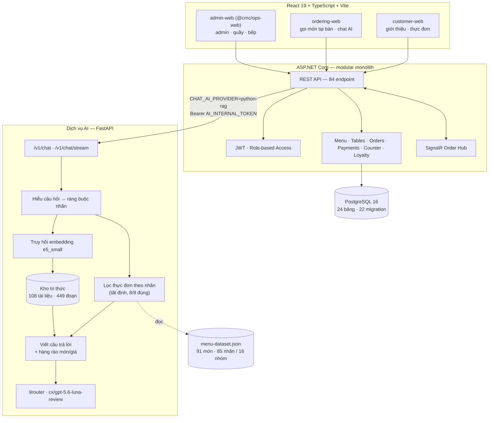

**Đọc sơ đồ theo trách nhiệm.** Cách nhanh nhất để nắm kiến trúc này là nhìn vào việc mỗi tầng
**không được phép làm gì** — bởi chính các điều cấm mới là thứ giữ cho hệ thống an toàn, còn danh
sách chức năng giữa các tầng có thể chồng lấn.

| Tầng | Chịu trách nhiệm | **Không được phép** |
|---|---|---|
| Ba ứng dụng web | Hiển thị, thu thao tác người dùng, giữ trải nghiệm mượt | Quyết định quyền; gọi thẳng dịch vụ AI; coi `localStorage` là nguồn sự thật |
| Backend .NET | Nguồn sự thật duy nhất về quyền và dữ liệu; điều phối mọi lời gọi | Ủy quyền quyết định quyền cho bất kỳ tầng nào khác |
| PostgreSQL | Lưu trữ và **cưỡng chế các bất biến nghiệp vụ** | — |
| Dịch vụ AI | Hiểu câu hỏi, chọn món bằng mã tất định, viết câu trả lời | Chạm vào cơ sở dữ liệu; tạo đơn; sửa giỏ hàng; thanh toán |

**Một lượt đi thật.** Khi khách hỏi trợ lý một câu, dữ liệu đi theo đúng thứ tự sau — mỗi mũi tên
trong sơ đồ tương ứng một bước:

1. `ordering-web` gửi câu hỏi tới **backend**, kèm capability token của phiên bàn. Nó không biết địa
   chỉ của dịch vụ AI, và cũng không cần biết.
2. **Backend** kiểm tra token, xác nhận phiên bàn còn mở, rồi mới gọi dịch vụ AI qua mạng nội bộ
   với `Bearer AI_INTERNAL_TOKEN`. Đây là điểm chặn duy nhất, nên cũng là điểm dễ kiểm soát nhất.
3. **Dịch vụ AI** hiểu câu hỏi thành ràng buộc dạng nhãn, **lọc thực đơn bằng mã tất định**, truy
   hồi tri thức nếu câu hỏi cần, rồi để mô hình diễn đạt trên tập món đã chốt.
4. Câu trả lời quay ngược lại đúng đường cũ. Nếu khách bấm thêm món vào giỏ, thao tác ấy là **một
   lời gọi API riêng** tới backend — dịch vụ AI không tham gia và cũng không được thông báo.

Bước 4 là chỗ thể hiện rõ nhất ranh giới quyền: trợ lý có thể *gợi ý* món, nhưng việc món đó có vào
giỏ hay không do khách bấm và do backend ghi. Chi tiết ở mục
[2.4.1](#241-nguyên-tắc-trung-tâm-mô-hình-hiểu-và-viết-nhưng-không-chọn).

### 2.3.2. Ba quyết định kiến trúc và lý do

**Quyết định 1 — Modular monolith cho nghiệp vụ, không dùng microservices**

| Tiêu chí | Modular monolith (đã chọn) | Microservices (đã loại) |
|---|---|---|
| Transaction đơn ↔ thanh toán ↔ tồn kho | Một transaction cơ sở dữ liệu, nhất quán ngay | Phải dựng saga / eventual consistency |
| Chi phí vận hành cho 5 sinh viên | 1 tiến trình, 1 pipeline deploy | N tiến trình, N pipeline, service mesh, tracing phân tán |
| Ranh giới module | Thư mục theo domain (`Orders/`, `Payments/`, `Menu/`…) — **vẫn có ranh giới rõ** | Ranh giới cứng hơn nhưng phải trả giá bằng hạ tầng |
| Khi cần tách sau này | Ranh giới module đã sẵn để cắt | — |

**Phản biện.** Microservices *không* sai về nguyên tắc — nó không phù hợp với quy mô dự án này.
Microservices đánh đổi khả năng phát hành độc lập bằng độ phức tạp vận hành [1, Ch.4–5]. Đơn hàng
và thanh toán ở đây **luôn thay đổi cùng nhau**, nên tách chúng ra sẽ tạo thêm giao tiếp phân tán
giữa hai thành phần vốn cần nhất quán.

**Quyết định 2 — AI là service riêng, và đây là ngoại lệ có lý do**

Nhóm chọn monolith cho nghiệp vụ nhưng tách AI ra. Đây **không** phải mâu thuẫn, vì tiêu chí tách là *"vòng đời có khác nhau không"*:

| | Backend nghiệp vụ | Dịch vụ AI |
|---|---|---|
| Ngôn ngữ | C# / .NET | Python 3.12 |
| Kích thước ảnh Docker | ~200 MB | **2,74 GB** (torch + sentence-transformers) |
| Nhịp thay đổi | Theo tính năng nhà hàng | Theo phép đo chất lượng |
| Cần scale khi | Nhiều bàn cùng gọi món | Nhiều câu hỏi cùng lúc |

Gộp chung sẽ kéo ảnh backend lên gần 3 GB và buộc mọi lần sửa một endpoint thực đơn phải build lại toàn bộ tầng embedding.

**Quyết định 3 — REST + SignalR, không GraphQL**

REST được chọn vì **hợp đồng là điều nhóm cần nhất**: 5 người làm song song trên 3 tầng, nên một tài liệu liệt kê rõ endpoint/DTO/error code ([API_CONTRACT.md](../API_CONTRACT.md)) có giá trị hơn tính linh hoạt truy vấn của GraphQL. Với dữ liệu **đẩy** (trạng thái đơn), REST polling không đủ nên bổ sung **SignalR** — đúng chỗ cần và chỉ ở chỗ đó.

### 2.3.3. Thiết kế cơ sở dữ liệu

Cơ sở dữ liệu dùng PostgreSQL 16 với EF Core, gồm **24 bảng hình thành qua 22 migration**. Con số
migration nói lên một điều mà sơ đồ tĩnh không nói được: lược đồ này **không được thiết kế đúng
ngay từ đầu** mà tiến hóa dần theo hiểu biết của nhóm về bài toán, và mỗi bước tiến hóa đều để lại
dấu vết kiểm chứng được.

Điểm thiết kế quan trọng nhất nằm ở chỗ ba quy tắc nghiệp vụ then chốt được **cưỡng chế ở tầng cơ
sở dữ liệu** chứ không chỉ ở tầng ứng dụng, nghĩa là chúng vẫn đúng ngay cả khi có lỗi lập trình ở
tầng trên.

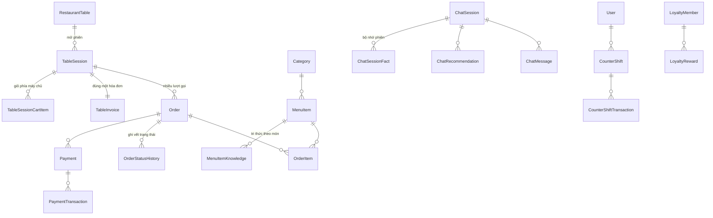

Ba bất biến dữ liệu được đưa xuống tầng cơ sở dữ liệu thay vì chỉ kiểm ở tầng ứng dụng:

| Bất biến | Cưỡng chế bằng | Migration |
|---|---|---|
| Một bàn chỉ có **một phiên đang mở** tại một thời điểm | Unique index có điều kiện | [`EnforceSingleActiveTableSession`](https://github.com/Anpham120/restaurant-qr-ai-ordering/blob/main/backend/src/RestaurantQrAiOrdering.Api/Data/Migrations/20260711131239_EnforceSingleActiveTableSession.cs) |
| Mã đơn không trùng khi có nhiều máy chủ | PostgreSQL sequence, không sinh phía ứng dụng | [`AddXminAndOrderCodeSequence`](https://github.com/Anpham120/restaurant-qr-ai-ordering/blob/main/backend/src/RestaurantQrAiOrdering.Api/Data/Migrations/20260620145916_AddXminAndOrderCodeSequence.cs) |
| Hai người sửa cùng một đơn không ghi đè nhau | Optimistic concurrency qua `xmin` → lỗi `CONFLICT_STALE` | cùng migration trên |

Mỗi phiên bàn có **đúng một hóa đơn** nhưng **nhiều lượt đơn** — đây là mô hình nghiệp vụ thật của nhà hàng, và nhóm đã phải refactor để đạt được nó ([kế hoạch refactor](../ORDERING_SESSION_INVOICE_REFACTOR_PLAN.md)).

### 2.3.4. Máy trạng thái của phiên bàn

Đây là phần kỹ thuật đứng sau lời hứa ở mục [1.3](#13-mục-tiêu-và-phạm-vi) rằng *quét lại mã QR thì
quay về đúng bước đang dở*. Câu hỏi phải trả lời được là: khi một người quét mã của bàn T07, hệ
thống lấy gì để quyết định đưa họ tới màn hình nào?

Câu trả lời cố tình **không** dựa vào thiết bị hay vào lịch sử trình duyệt — hai thứ đều mất khi
khách đổi máy hoặc đóng tab. Nó dựa vào **trạng thái của chính phiên bàn trên máy chủ**, suy ra từ
đơn và hóa đơn đang có:

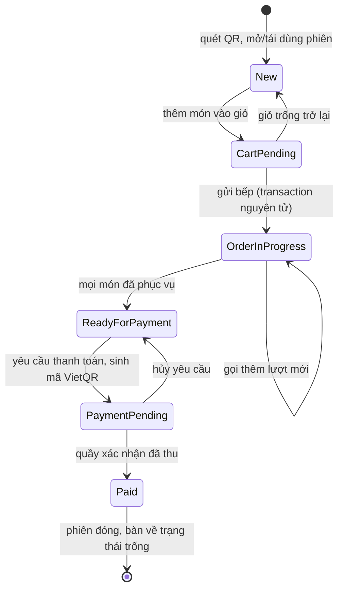

| Trạng thái | Nghĩa | Quét lại thì vào đâu |
|---|---|---|
| `New` | Chưa có gì trong giỏ và chưa có đơn nào còn hiệu lực | Thực đơn |
| `CartPending` | Giỏ có món nhưng chưa gửi bếp | Giỏ hàng |
| `OrderInProgress` | Có ít nhất một đơn ở `Draft`/`Placed`/`Confirmed`/`Preparing`/`Ready` | Trang theo dõi đơn |
| `ReadyForPayment` | Mọi món đã phục vụ, chưa yêu cầu thanh toán | Trang đơn, mở sẵn hóa đơn |
| `PaymentPending` | Đã yêu cầu thanh toán, quầy chưa xác nhận | Trang đơn, mở sẵn hóa đơn |
| `Paid` | Quầy đã xác nhận thu tiền | Trang đơn, mở sẵn hóa đơn |

Ba điều đáng nói về cách máy trạng thái này được cài đặt.

**Thứ nhất, trạng thái được suy ra, không được lưu.** Hệ thống không có một cột `resume_state`
để cập nhật mỗi khi có việc xảy ra; nó tính lại từ danh sách đơn và trạng thái hóa đơn mỗi lần
khách quét ([`deriveSessionHubState`](https://github.com/Anpham120/restaurant-qr-ai-ordering/blob/main/frontend/src/ordering/sessionResumeState.ts)).
Cách này chậm hơn một chút nhưng loại bỏ hẳn một lớp lỗi mà nhóm đã gặp ở bản đầu: cột trạng thái
lưu sẵn bị lệch khỏi dữ liệu thật khi một luồng cập nhật quên ghi vào nó.

**Thứ hai, đơn đã hủy bị loại khỏi phép tính.** Một phiên có ba đơn trong đó hai đơn `Cancelled` thì
vẫn là `New` chứ không phải `OrderInProgress` — nếu không, khách hủy hết đơn sẽ bị kẹt ở màn hình
theo dõi một danh sách rỗng.

**Thứ ba, trạng thái phiên và trạng thái đơn là hai tầng khác nhau.** Phiên chỉ có `Open`, `Closed`,
`Expired`; sáu trạng thái ở trên là **cách diễn giải** phiên cho phía khách. Tách hai tầng cho phép
đổi trải nghiệm quét lại mà không phải động tới vòng đời phiên trong cơ sở dữ liệu. Toàn bộ bảng
trên có kiểm thử hồi quy ở [`TableSessionResumeStateTests.cs`](https://github.com/Anpham120/restaurant-qr-ai-ordering/blob/main/backend/tests/RestaurantQrAiOrdering.Api.Tests/TableSessionResumeStateTests.cs)
và [`sessionResumeState.test.ts`](https://github.com/Anpham120/restaurant-qr-ai-ordering/blob/main/frontend/src/ordering/sessionResumeState.test.ts).

### 2.3.5. Đánh giá ưu — nhược điểm công nghệ đã chọn

| Công nghệ | Ưu | Nhược | Vì sao vẫn chọn |
|---|---|---|---|
| **React 19 + Vite (5 app, npm workspaces)** [9] | Mỗi vai trò có bundle riêng, tải nhẹ; chia sẻ code qua `packages/` | Cấu hình workspace phức tạp hơn một SPA | Khách tại bàn dùng mạng 4G — không nên tải cả bundle admin |
| **ASP.NET Core + EF Core** [6], [7] | Type-safe, migration tốt, tích hợp SignalR sẵn | Ảnh Docker và bộ nhớ nặng hơn Node | Nghiệp vụ có tiền và ràng buộc → cần kiểu chặt và transaction tốt |
| **PostgreSQL 16** [11] | Transaction ACID, unique index có điều kiện, sequence | Cần vận hành backup/restore | Ba bất biến ở §2.3.3 đều cần đúng những tính năng này |
| **SignalR** [8] | Đẩy trạng thái, tự fallback khi WebSocket bị chặn | Thêm trạng thái kết nối phải quản lý | Polling không đủ cho bảng bếp |
| **FastAPI + Python 3.12** [10] | Hệ sinh thái AI đầy đủ, viết bộ đánh giá nhanh | Ảnh 2,74 GB | Xem quyết định 2 ở §2.3.2 |
| **Embedding `e5_small`** | Đo thắng BM25 ở cả hai tập | Ảnh nặng, khởi động chậm nếu không tính sẵn vector | Đã đo, không đoán — xem §2.4.2 |
| **9router (OpenAI-compatible)** | Đổi mô hình không phải sửa mã | Phụ thuộc gateway ngoài | Có đường lùi tất định khi gateway hỏng |
| **Docker Compose trên VPS** | Đủ cho quy mô hiện tại, dễ hiểu, rollback nhanh | Không tự scale như Kubernetes | K8s cho 1 nhà hàng là phức tạp thừa |

## 2.4. Thiết kế và lập trình phần AI

### 2.4.1. Nguyên tắc trung tâm: mô hình HIỂU và VIẾT, nhưng không CHỌN

Đây là quyết định thiết kế quan trọng nhất của cả sản phẩm.

```text
Câu khách  →  [HIỂU]      mô hình đọc câu tiếng Việt → ràng buộc dạng nhãn JSON
           →  [CHỌN]      mã TẤT ĐỊNH lọc thực đơn theo nhãn      ← mô hình KHÔNG chạm vào
           →  [VIẾT]      mô hình diễn đạt trên tập món đã chốt
           →  [CHẶN]      câu nhắc món/giá không có trong tập → lùi về khuôn mẫu
```

Nếu để mô hình chọn món, thử nghiệm trên một tập hữu hạn không đủ để bảo đảm mô hình sẽ luôn loại
món có tôm cho khách dị ứng tôm. Khi việc chọn là một phép lọc trên bảng nhãn, câu hỏi chuyển thành
*"bảng nhãn có đúng không"* — một giả định có thể tra cứu, đối chiếu và bảo vệ bằng kiểm thử hồi quy.

Số đo xác nhận: **lọc theo nhãn đúng 8/8 ca chọn món, trong khi RAG sai 6–7/8.**

Cơ chế này quan sát được trực tiếp trên sản phẩm đang chạy: cặp hình
[5.2 và 5.3](#511-giao-diện) chụp cùng một phiên bàn trước và sau khi khách nêu dị ứng tôm, cho thấy
bốn món bị loại khỏi danh sách gợi ý ngay ở bước **CHỌN** — trước khi mô hình được phép viết câu trả
lời.

### 2.4.2. Chọn bộ truy hồi bằng phép đo và điều chỉnh kết luận trước đó

Nhóm so ba phương pháp trên hai phân vùng dữ liệu: BM25 [5], embedding multilingual E5 [4] và
phương pháp hybrid kết hợp hai tín hiệu. Phân vùng thứ hai ban đầu được thiết kế làm tập
niêm phong; do đã được mở hai lần trong quá trình hoàn thiện, kết quả trên phân vùng này hiện chỉ
được diễn giải như số liệu hồi quy, không phải ước lượng độc lập về khả năng khái quát (xem cảnh
báo phương pháp tại mục [5.2.2](#522-chất-lượng-đo-được)).

| Tập | Số ca | BM25 (top-1) | Embedding (top-1) | Hybrid (top-1) |
|---|---|---|---|---|
| Phát triển | 124 ca / 9 họ | 0,803 | **0,921** | 0,908 |
| Niêm phong | 44 ca / 4 họ | 0,750 | 0,864 | **0,886** |

**Kết quả này trái với dự đoán ban đầu.** Tài liệu ADR trước đó của nhóm đã chốt *"hybrid BM25 + E5 thắng"* — và phép đo lại trên kho tri thức mới cho thấy **hybrid không tốt hơn embedding đơn lẻ một cách đáng kể**, trong khi nó tốn thêm một tầng xếp hạng. Nhóm bỏ hybrid. ADR cũ được [giữ trong `archive/` kèm banner](../archive/README.md) chứ không xóa, vì nó ghi lại *điều kiện nào từng làm kết luận đó đúng*.

### 2.4.3. Kho tri thức được SINH từ dữ liệu, không viết tay

Bản kho tri thức đầu tiên có một tệp `menu.md` dài 159 dòng **kể lại thực đơn bằng văn xuôi** — và
nó ghi *"hơn 90 món"* trong khi thực đơn có **đúng 91 món**. Con số được nhập thủ công, không có
cơ chế đối chiếu tự động và đã không khớp dữ liệu nguồn.

Bài học được đưa thành quy tắc: **văn xuôi kể lại dữ liệu thì luôn trôi khỏi dữ liệu.** Kho tri thức hiện tại chia hai loại:

| Loại | Số tài liệu | Nguồn |
|---|---|---|
| `derived` | 49 | **Sinh từ `menu-dataset.json`** — không thể lệch, vì nó *là* thực đơn diễn đạt lại |
| `written` + `policy` | 36 + 24 | Người viết — chính sách nhà hàng, gợi ý kết hợp món |

`python ai/scripts/build_knowledge.py --check` chạy trong CI: nếu thực đơn đổi mà tài liệu `derived`
không đổi theo, kiểm tra CI thất bại.

### 2.4.4. Vì sao không fine-tune

| | Fine-tune | RAG [3] + lọc nhãn (đã chọn) |
|---|---|---|
| Khi thực đơn đổi giá | Train lại | Có hiệu lực ngay |
| Chứng minh không bịa giá | Rất khó | Hàng rào chặn ở đường sinh, đo được |
| Dữ liệu cần | Hàng nghìn cặp hỏi–đáp chất lượng cao | Đã có sẵn thực đơn + chính sách |
| Truy vết câu trả lời | Không truy được về nguồn | Truy được về một dòng dữ liệu cụ thể |

Menu và giá của nhà hàng đổi thường xuyên — đó là yếu tố quyết định.

## 2.5. Chất lượng và vận hành

### 2.5.1. Kiểm thử

Chiến lược kiểm thử của nhóm được xây dựng quanh một câu hỏi đơn giản nhưng khó trả lời: *một phép
kiểm xanh thì thật sự chứng minh được điều gì?* Câu hỏi ấy dẫn nhóm tới việc phân tầng kiểm thử
theo **phạm vi mà mỗi tầng có thẩm quyền kết luận**, thay vì chỉ chạy theo con số tổng.

| Tầng | Số lượng | Nội dung |
|---|---|---|
| Frontend (Vitest) | **118 test / 36 tệp** | Logic điều hướng, định dạng, ranh giới hợp đồng AI |
| Backend (.NET) | **84 test / 25 tệp** | Vòng đời đơn, thanh toán, phiên bàn, hóa đơn, phân quyền, hồi quy PostgreSQL |
| AI — mã (`ai/app`) | **386 test** | Hiểu câu hỏi, phiên, trả lời, giỏ, hợp đồng, đóng gói, vệ sinh mã nguồn |
| AI — thước đo (`ai/evaluation`) | **128 test** | Thước đo hai chiều, bộ dò lỗ, tập ca, golden |
| Golden đầu-cuối | **29 hội thoại / 103 lượt** | [`ai/evaluation/run_golden_e2e.py`](../../ai/evaluation/run_golden_e2e.py) — dựng stack thật rồi hỏi như khách, chạy trong job CI `golden-e2e` |

#### Ma trận truy vết yêu cầu – kiểm thử

Ma trận rút gọn dưới đây nối user story lõi với FR/NFR và hiện vật kiểm thử chính. Mục tiêu là cho
phép truy ngược từ một kết quả kiểm thử về nhu cầu người dùng, thay vì chỉ báo cáo tổng số test.

| User story | FR/NFR liên quan | Kiểm thử hoặc phép đo chính |
|---|---|---|
| US-01 — Quét QR vào đúng phiên bàn | FR-02, FR-03, NFR-05 | [Vòng đời phiên bàn](../../backend/tests/RestaurantQrAiOrdering.Api.Tests/TableSessionLifecycleTests.cs) · [Capability token](../../backend/tests/RestaurantQrAiOrdering.Api.Tests/CapabilityTokenPrecisionTests.cs) · [Kho capability phía khách](../../frontend/src/ordering/sessionCapabilityStore.test.ts) |
| US-02 — Giỏ phía máy chủ, gọi nhiều lượt | FR-04, FR-05 | [Vòng đời đơn](../../backend/tests/RestaurantQrAiOrdering.Api.Tests/OrderLifecycleTests.cs) · [Xóa giỏ sau gửi món](../../backend/tests/RestaurantQrAiOrdering.Api.Tests/OrderCartClearTests.cs) · [Tóm tắt giỏ theo phiên](../../frontend/src/ordering/cartSessionSummary.test.ts) |
| US-03 — Không gợi ý món vi phạm dị nguyên | NFR-01, NFR-03 | [Bộ chạy đánh giá nền](../../ai/evaluation/run_baseline.py) · [Đánh giá theo phiên](../../ai/evaluation/test_session_eval.py) · [Ranh giới hợp đồng AI](../../backend/tests/RestaurantQrAiOrdering.Api.Tests/AiContractBoundaryTests.cs) |
| US-04 — Gợi ý theo khẩu vị và ngân sách | FR-11, NFR-02, NFR-07 | [Kiểm thử tạo câu trả lời](../../ai/app/test_answer.py) · [Kiểm thử sinh câu](../../ai/app/test_generate.py) · [Kết quả LLM/RAG loại C](../../ai/evaluation/measurements/llm_rag_loai_c.json) |
| US-05 — Theo dõi trạng thái đơn | FR-05, FR-12 | [Khôi phục phiên bàn](../../backend/tests/RestaurantQrAiOrdering.Api.Tests/TableSessionResumeStateTests.cs) · [Vòng đời đơn phía khách](../../frontend/src/ordering/sessionOrdersLifecycle.test.ts) · [Thanh toán realtime](../../frontend/src/ordering/orderingPaymentRealtime.test.ts) |
| US-06 — Bảng bếp thao tác nhanh | FR-08, FR-12 | [Migration trạng thái bếp](../../backend/tests/RestaurantQrAiOrdering.Api.Tests/KitchenStatusMigrationTests.cs) · [Pipeline bảng bếp](../../frontend/src/components/kitchen/kitchenOrderPipeline.test.ts) · [Hook realtime vận hành](../../frontend/src/hooks/useOpsRealtime.test.ts) |
| US-07 — Một hóa đơn cho cả bàn | FR-06, FR-07 | [Hóa đơn bàn](../../backend/tests/RestaurantQrAiOrdering.Api.Tests/TableInvoiceTests.cs) · [Vòng đời thanh toán](../../backend/tests/RestaurantQrAiOrdering.Api.Tests/PaymentLifecycleTests.cs) · [Thanh toán hóa đơn phía khách](../../frontend/src/ordering/tableInvoicePaymentLifecycle.test.ts) |
| US-08 — Quản trị thực đơn, bàn và người dùng | FR-01, FR-02, FR-10 | [CRUD bàn](../../backend/tests/RestaurantQrAiOrdering.Api.Tests/AdminTableCrudTests.cs) · [Quản lý người dùng](../../backend/tests/RestaurantQrAiOrdering.Api.Tests/UserManagementTests.cs) · [Sơ đồ tầng](../../frontend/src/components/admin/floorMapUtils.test.ts) |
| US-09 — CI trước khi vào `develop` | NFR-06, NFR-09, NFR-10 | [Workflow CI](../../.github/workflows/ci.yml) · [Cấu hình triển khai](../../backend/tests/RestaurantQrAiOrdering.Api.Tests/DeploymentConfigurationTests.cs) · [Đóng gói dịch vụ AI](../../ai/app/test_packaging.py) |

**Kiểm tra chính thước đo.** Nhóm coi hàm chấm điểm là mã cần được kiểm thử: bộ dò
[Bộ dò lỗ của thước đo](../../ai/evaluation/probe_metric_holes.py) đưa các câu trả lời cố ý vô nghĩa
vào thước đo và yêu cầu chúng phải trượt.
Bộ dò phát hiện **24 trường hợp chấp nhận sai**; cả 24 trường hợp đã được khắc phục. Nếu bỏ qua
bước này, độ tin cậy của các số liệu do thước đo tạo ra sẽ không được xác lập.

Ngoài ra, các kiểm thử đi trực tiếp vào đường xử lý lỗi thay vì chỉ dựa trên mô tả trong tài liệu.
Ví dụ, NFR-04 được kiểm bằng cách thay `respond()` bằng một hàm phát sinh `RuntimeError`, rồi yêu
cầu phản hồi HTTP 200 kèm thông báo chuyển tiếp tới nhân viên.

### 2.5.2. Bảo mật

Nguyên tắc xuyên suốt của nhóm khi thiết kế bảo mật là **không tầng nào được phép tin tầng đứng
trước nó**. Giao diện có thể bị sửa bằng DevTools, `localStorage` có thể bị can thiệp, và một
`sessionId` lộ ra ngoài không được phép trở thành chìa khóa vào phiên của người khác. Vì vậy mọi
quyết định về quyền đều được đẩy xuống backend, nơi duy nhất có đủ thẩm quyền để nói *không*.

Bảng dưới đây liệt kê từng lớp phòng thủ kèm bằng chứng kiểm chứng được — nhóm cố ý không ghi
biện pháp nào mà không chỉ ra được nơi nó thực sự tồn tại trong mã nguồn hoặc trong cấu hình CI.

| Lớp | Biện pháp | Bằng chứng |
|---|---|---|
| Xác thực | JWT; mật khẩu **PBKDF2-HMAC-SHA256 có salt**; API không trả password hash | [SECURITY.md](../../SECURITY.md) |
| Phân quyền | `RequireAuthorization` theo vai trò ở backend; **vai trò trong frontend chỉ phục vụ UX** | [Kiểm thử capability token](../../backend/tests/RestaurantQrAiOrdering.Api.Tests/CapabilityTokenPrecisionTests.cs) |
| Chống dò mật khẩu | Khóa tài khoản sau nhiều lần sai | [`AddLoginLockout`](https://github.com/Anpham120/restaurant-qr-ai-ordering/blob/main/backend/src/RestaurantQrAiOrdering.Api/Data/Migrations/20260621031254_AddLoginLockout.cs) |
| Phiên bàn | Capability token cấp mới mỗi lần quét; `sessionId` **không phải** thông tin cấp quyền | [Sơ đồ trạng thái phiên QR](../QR_SESSION_STATE_MACHINE.md) |
| Ranh giới AI | Mọi `/v1/*` đòi `AI_INTERNAL_TOKEN`; frontend **không bao giờ** gọi thẳng dịch vụ AI | [Ranh giới bất biến của AI](../AI_NO_TOUCH_BOUNDARY.md) |
| Rò rỉ qua lỗi | Chi tiết exception **không vào câu trả lời khách**; chỉ mã tham chiếu 8 ký tự ra ngoài, chi tiết vào log | [PR #256 — khắc phục cảnh báo CodeQL](https://github.com/Anpham120/restaurant-qr-ai-ordering/pull/256) |
| Secrets | GitHub Environments; `.env` bị ignore; chỉ commit `.env.example` | [Job `secret-scan` trong security.yml](../../.github/workflows/security.yml) |
| Quét tự động | **CodeQL** (C#, JS/TS, Python) + **gitleaks** + **Trivy** + **dependency-review** | [`security.yml`](https://github.com/Anpham120/restaurant-qr-ai-ordering/blob/main/.github/workflows/security.yml) |
| Cập nhật phụ thuộc | Dependabot nhắm `develop` (không nhắm thẳng `main`) | [`dependabot.yml`](https://github.com/Anpham120/restaurant-qr-ai-ordering/blob/main/.github/dependabot.yml) |

Điểm nhóm muốn nhấn mạnh không nằm ở số lượng biện pháp mà ở chỗ **quét tự động đã thực sự bắt
được lỗi mà mắt người bỏ qua**. CodeQL báo *Information exposure through an exception* tại ba vị
trí mà không thành viên nào nhận ra khi đọc lại mã, bởi từ góc nhìn của người viết, việc trả chi
tiết lỗi ra ngoài trông giống một hành động thân thiện với người dùng. Bản sửa giữ lại toàn bộ giá
trị chẩn đoán bằng cách trả một **mã tham chiếu tám ký tự** cho khách và đẩy chi tiết vào log — người
vận hành vẫn tra được, còn kẻ tấn công thì không đọc được cấu trúc nội bộ của hệ thống.

### 2.5.3. Lập trình tin cậy

Ba kỹ thuật được áp dụng có ý thức:

1. **Fail-closed cho việc nguy hiểm.** Thiếu dữ liệu dị nguyên thì **loại món**, không đoán. Trên
   tập đánh giá đã công bố, trong phạm vi dữ liệu nhãn hiện có, không ghi nhận lỗi an toàn.
2. **Suy giảm êm cho việc không nguy hiểm.** Gateway mô hình hỏng → chạy đường tất định. `LLM_API_KEY` rỗng → dịch vụ vẫn lên. Lỗi nội bộ → 200 + câu chuyển nhân viên.
3. **Khẳng định về hành vi lỗi phải có kiểm thử đi đúng đường lỗi đó.** Tài liệu từng khẳng định
   dịch vụ "thoái hóa êm" khi thiếu cấu hình, nhưng một dòng `urllib.request.Request(...)` nằm
   **ngoài** khối `try` khiến dịch vụ dừng bất thường. Từ đó các khẳng định loại này đều phải có
   kiểm thử tiêm lỗi tương ứng.

**Một ví dụ cùng lớp lỗi, được phát hiện trong đợt rà soát cuối.** Khối `except` của `/v1/chat`
gọi `print()` để ghi log, trong khi thông điệp chứa tiếng Việt có dấu. Trên console Windows mặc
định (cp1252), lệnh `print` phát sinh `UnicodeEncodeError`, làm chính cơ chế xử lý lỗi dừng bất
thường và khiến khách nhận HTTP 500. CI chạy Linux/UTF-8 không tái hiện điều kiện này; lỗi chỉ xuất
hiện trong môi trường phát triển Windows nên ban đầu dễ bị nhầm với khác biệt cấu hình cục bộ.

Biện pháp khắc phục gồm hai lớp: cấu hình `stdout` sang UTF-8 khi nạp module và sử dụng hàm
`_in_log` không truyền lỗi ghi log ngược về luồng xử lý yêu cầu. Nếu lớp thứ nhất không khả dụng,
thông điệp được chuyển thành chuỗi thoát ASCII. Kiểm thử hai chiều dựng một luồng chỉ mã hóa được
ASCII, xác nhận `print` trực tiếp phát sinh lỗi, sau đó xác nhận `_in_log` vẫn ghi được nội dung mà
không làm yêu cầu thất bại. Qua đó, hàm ghi log trong đường xử lý lỗi được xem là một phần của cơ
chế an toàn, không chỉ là tiện ích phụ.

### 2.5.4. CI/CD và DevOps

```mermaid
flowchart LR
  PR["Pull Request → develop"] --> CI
  subgraph CI["ci.yml — 5 job"]
    J1["frontend-build"]
    J2["backend-test"]
    J3["ai-data-and-eval"]
    J4["golden-e2e"]
    J5["docker-compose-config"]
  end
  CI --> SEC["security.yml<br/>CodeQL · gitleaks · Trivy"]
  SEC --> MERGE["merge vào develop"]
  MERGE --> STG["deploy-staging.yml<br/>+ cổng verify_deploy_config"]
  STG --> PROMO["promote-production.yml<br/>develop → main"]
  PROMO --> PROD["deploy-production.yml<br/>+ health-check.sh"]
  PROD -->|"smoke thất bại"| RB["rollback.yml"]
```

Job **`golden-e2e`** dựng toàn bộ stack (PostgreSQL → backend .NET → dịch vụ AI) và thực thi chuỗi
QR → phiên bàn → phiên chat → câu trả lời → thẻ giỏ → giỏ hàng. Job này bổ sung khoảng trống giữa
các tập kiểm thử thành phần. Trước đó, dịch vụ AI phát SSE thiếu dòng `event:` khiến backend bỏ qua
stream và trả câu dự phòng, dù kiểm thử riêng của cả hai dịch vụ đều đạt vì mỗi bên dùng một giả
định khung dữ liệu khác nhau.

**Cổng deploy hai đầu.** `verify_deploy_config.py` chạy ở CI hỏi *"cấu hình sắp deploy có khớp bằng chứng đã đo không?"*; `health-check.sh` chạy trên VPS hỏi *"dịch vụ đang chạy có đúng là cấu hình ấy không?"*. Cả hai lấy kỳ vọng từ **cùng một hàm**, nên không có con số viết tay nào để trôi.

Tổng cộng **2.468 lần chạy workflow** tính tới 03/08/2026.

### 2.5.5. Code review và quản lý mã nguồn

Với năm người làm song song trên cùng một cơ sở mã, quy ước là điều kiện phối hợp. Nhóm kết hợp
**cổng kiểm tra tự động** với **peer review của thành viên** để thay đổi được kiểm chứng trước merge.

| Quy tắc | Thực thi |
|---|---|
| Nhánh `main` chỉ nhận từ `develop` | [PR #407](https://github.com/Anpham120/restaurant-qr-ai-ordering/pull/407) — khắc phục khả năng merge thẳng |
| Mọi thay đổi qua Pull Request | **377 PR** (305 merge), không có commit trực tiếp lên `main` |
| PR và CI xanh là **bắt buộc ở mức nền tảng** | Branch ruleset trên `main` + `develop`, 5 status check bắt buộc, không có ngoại lệ — xem mục [3.1.5](#315-branch-ruleset--biến-ci-từ-thói-quen-thành-cổng-chặn) |
| Conventional Commits | `feat:` `fix:` `docs:` `test:` `chore:` |
| PR template bắt buộc | [`pull_request_template.md`](https://github.com/Anpham120/restaurant-qr-ai-ordering/blob/main/.github/pull_request_template.md) — mô tả, lệnh kiểm chứng, ảnh chụp cho thay đổi UI |
| Issue template có cấu trúc | [`ISSUE_TEMPLATE/task.yml`](https://github.com/Anpham120/restaurant-qr-ai-ordering/tree/main/.github/ISSUE_TEMPLATE) |
| Tự merge khi CI xanh, **trừ khi PR đụng migration** | [PR #405](https://github.com/Anpham120/restaurant-qr-ai-ordering/pull/405) — migration cơ sở dữ liệu luôn cần người xem |
| Human peer review trước merge | [PR #426](https://github.com/Anpham120/restaurant-qr-ai-ordering/pull/426) — bốn thành viên gửi `APPROVED` có nội dung cụ thể trước khi PR được chuyển Ready và hợp nhất |

**Phạm vi của bằng chứng code review.** Ở mốc `v0.3.0`, 377 pull request có review CodeQL/Copilot
nhưng chưa có review chính thức từ thành viên. Bốn phê duyệt ở
[PR #424](https://github.com/Anpham120/restaurant-qr-ai-ordering/pull/424) xảy ra **sau**
auto-merge nên không được dùng làm bằng chứng review-before-merge.

Nhóm thực hiện lại tại [PR #426](https://github.com/Anpham120/restaurant-qr-ai-ordering/pull/426):
tác giả không tự phê duyệt; bốn thành viên gửi `APPROVED` có nhận xét cụ thể lúc 21:39–21:40;
toàn bộ CI đạt; PR chỉ được chuyển Ready và hợp nhất lúc 22:28 ngày 04/08/2026. Thứ tự này chứng
minh review diễn ra trước merge, nhưng là bằng chứng bổ sung cuối kỳ, **không đại diện cho toàn bộ
377 PR trước đó**. Xem [quy trình và truy vấn kiểm tra](HUMAN_PEER_REVIEW.md).

Review tự động vẫn có tác động kỹ thuật: cảnh báo CodeQL làm thay đổi cách che chi tiết exception
tại [PR #256](https://github.com/Anpham120/restaurant-qr-ai-ordering/pull/256) và
[PR #377](https://github.com/Anpham120/restaurant-qr-ai-ordering/pull/377); PR #426 bổ sung lớp
kiểm tra độc lập của thành viên. Migration được loại khỏi auto-merge vì có thể thay đổi dữ liệu
production và không phải lúc nào cũng hoàn tác đầy đủ bằng `Down()`.

---

# 3. Quy trình cộng tác trên GitHub & sử dụng công cụ AI

## 3.1. Cách nhóm dùng GitHub

Quy trình làm việc được tổ chức theo chuỗi: user story hoặc lỗi → issue → nhánh thay đổi → pull
request → kiểm thử CI → hợp nhất → release. Để một hạng mục được xem là hoàn thành ở thời điểm
chốt báo cáo, nhóm đối chiếu theo Definition of Done sau:

| Điều kiện hoàn thành | Minh chứng dùng để kiểm tra |
|---|---|
| Phạm vi và tiêu chí chấp nhận được mô tả | Nội dung issue và liên kết user story |
| Mã nguồn nằm trên nhánh thay đổi và được đưa vào bằng pull request | Lịch sử branch, commit và PR |
| Kiểm thử liên quan được bổ sung hoặc có giải thích nếu chưa thể tự động hóa | Tệp kiểm thử, lệnh kiểm tra trong PR và báo cáo §2.5.1 |
| CI bắt buộc đạt trước khi hợp nhất | Status checks và branch ruleset |
| Thay đổi hợp đồng, vận hành hoặc hành vi người dùng được cập nhật tài liệu | README, tài liệu kiến trúc, API hoặc hướng dẫn triển khai |
| Mốc phát hành có thể truy về đúng commit | Tag và GitHub Release |

Definition of Done trên được tổng hợp từ issue template, PR template, workflow và ruleset hiện có.
Một số issue giai đoạn đầu chưa ghi đủ từng trường thông tin; báo cáo không diễn giải bảng này như
bằng chứng rằng mọi issue đều tuân thủ hoàn toàn ngay từ tuần đầu.

### 3.1.1. Milestones — 5 mốc theo tuần, bao phủ 42/46 issue

Nhóm dùng milestone như một cam kết về **phạm vi của từng tuần**, chứ không phải như một nhãn dán
chỉ để phân loại trên bảng điều khiển. Mỗi mốc chỉ được đóng khi toàn bộ issue thuộc mốc đó đã đóng;
khi phạm vi một mốc tăng bất thường, nhóm rà soát lại kế hoạch thay vì mặc định chuyển việc sang
tuần sau.

Mốc Tuần 5 với 18 issue là ví dụ rõ nhất cho cơ chế này. Đây là tuần nhóm quyết định thay toàn bộ
dữ liệu giả bằng PostgreSQL thật — một quyết định làm khối lượng công việc tăng gấp ba so với các
tuần trước, nhưng được chấp nhận vì hoãn nó lại sẽ khiến mọi thứ xây thêm phía trên đều phải làm
lại.

| Milestone | Mục tiêu | Issue đã đóng |
|---|---|---|
| [Tuần 1 — Nền tảng dự án](https://github.com/Anpham120/restaurant-qr-ai-ordering/milestone/1) | Tài liệu quản trị, quy trình Git, solution backend, entity lõi, khung giao diện | 5 |
| [Tuần 2 — Lõi đặt món](https://github.com/Anpham120/restaurant-qr-ai-ordering/milestone/2) | Xác thực, thực đơn, bàn QR, giỏ, đặt món, quản trị, kịch bản kiểm thử | 6 |
| [Tuần 3 — AI và thời gian thực](https://github.com/Anpham120/restaurant-qr-ai-ordering/milestone/3) | AI, RAG, chatbot, lịch sử chat, SignalR | 7 |
| [Tuần 4 — Triển khai và báo cáo](https://github.com/Anpham120/restaurant-qr-ai-ordering/milestone/4) | Kiểm thử, CI/CD, triển khai, health check, rollback, tài liệu | 6 |
| [Tuần 5 — Nâng cấp ưu tiên backend](https://github.com/Anpham120/restaurant-qr-ai-ordering/milestone/5) | Monolith module hóa, PostgreSQL thật, thanh toán, dịch vụ AI riêng, **bỏ toàn bộ mock khỏi nghiệp vụ** | 18 |

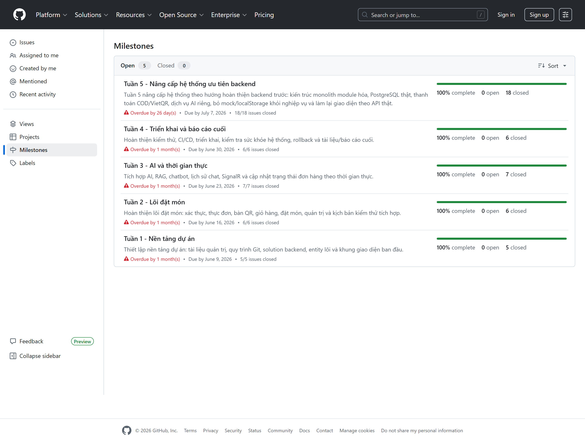

*Hình 3.1 — Trang Milestones. Cả 5 mốc đều đạt 100% complete: 5 + 6 + 7 + 6 + 18 = 42 issue
đóng theo mốc. Bốn issue bổ sung (`#81`, `#82`, `#242`, `#249`) được tạo ngoài kế hoạch tuần và
không gắn milestone. Nguồn: [github.com/Anpham120/restaurant-qr-ai-ordering/milestones](https://github.com/Anpham120/restaurant-qr-ai-ordering/milestones)*

### 3.1.2. Issues — 46 issue, gắn nhãn theo vai trò và theo tuần

Với 46 issue trong toàn bộ dự án và năm người, việc tìm lại một đầu việc cũ sẽ trở nên tốn kém nếu
không có cách phân loại nhất quán. Nhóm giải quyết bằng hệ thống nhãn **ba chiều**, cho phép truy
vấn backlog từ bất kỳ góc nào: theo người chịu trách nhiệm, theo bản chất công việc, hoặc theo thời
điểm.

| Chiều | Nhãn |
|---|---|
| Vai trò | `role:lead` `role:backend` `role:frontend` `role:ai` `role:devops` `role:docs` `role:testing` `role:integration` |
| Loại việc | `type:feature` `type:docs` `type:test` `type:infra` `type:integration` |
| Tuần | `week-1` … `week-5` |
| Trạng thái | `status:blocked` `status:needs-review` `status:done` |

Trong 46 issue, **42 issue thuộc năm milestone** và 44 issue có ít nhất một người phụ trách.
Bốn issue bổ sung (`#81`, `#82`, `#242`, `#249`) không gắn milestone; riêng `#81` và `#82`
không có assignee. Đây là hai ngoại lệ của quy trình, được giữ nguyên trong số liệu thay vì quy
về mô tả “mọi issue đều được gán”. Với các issue theo kế hoạch, hệ thống nhãn cho phép trả lời
*ai phụ trách, thuộc tuần nào và có nằm trên đường găng hay không*. Ví dụ
[Issue #72 — Làm cứng tích hợp dịch vụ AI và rào chắn an toàn](https://github.com/Anpham120/restaurant-qr-ai-ordering/issues/72)
mang `role:ai`, `role:integration`, `type:feature`, `week-5`.

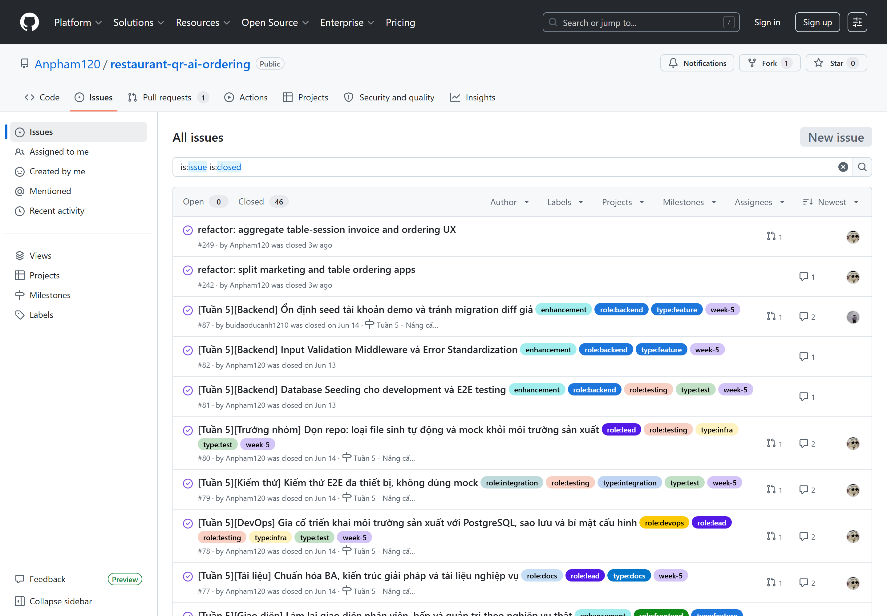

*Hình 3.2 — 46 issue đã đóng, 0 issue còn mở. Phần lớn issue mang nhãn theo vai trò, loại việc và
tuần; 42 issue gắn milestone và 44 issue có assignee. Nguồn:
[github.com/Anpham120/restaurant-qr-ai-ordering/issues](https://github.com/Anpham120/restaurant-qr-ai-ordering/issues?q=is%3Aissue+is%3Aclosed)*

### 3.1.3. Commits và Pull Requests

Các con số dưới đây có ý nghĩa với rubric học phần ở một điểm cụ thể: tiêu chí *sử dụng GitHub*
không chấm số lượng, mà chấm **liệu quy trình có thật sự được vận hành hay chỉ được mô tả**. Ba chỉ
số đầu bảng — commit, pull request, và số lần chạy workflow — chỉ đồng thời lớn khi nhóm thực sự
làm việc qua nhánh, qua pull request và qua CI trong suốt thời gian dự án.

| Chỉ số | Giá trị |
|---|---|
| Tổng commit | **872** |
| Tổng Pull Request | **377** — **305 đã merge**, 71 đóng mà không merge, 1 còn mở (`#420`) |
| Lần chạy workflow | **2.468** |
| Khoảng thời gian | 04/06/2026 → 02/08/2026 |
| **Mốc chốt số liệu** | tag [`v0.3.0`](https://github.com/Anpham120/restaurant-qr-ai-ordering/releases/tag/v0.3.0), ngày 02/08/2026 |
| Nhánh chính | `main` (production) ← `develop` (tích hợp) ← nhánh tính năng |

Con số **71 pull request bị đóng mà không merge** cho thấy pull request được sử dụng như một điểm
kiểm soát thay vì chỉ là thủ tục. Các PR này bị đóng khi trùng phạm vi với PR khác, khi cách tiếp
cận đã được thay thế, hoặc khi CI thất bại và nhóm chọn thực hiện lại thay vì tiếp tục sửa trên
nhánh cũ.

Commit **rải đều** theo tiến độ, không dồn 1–2 lần cuối kỳ:

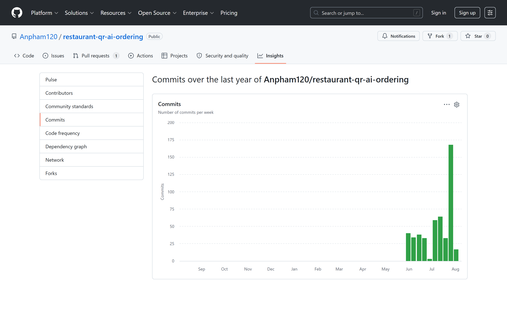

*Hình 3.3 — Commit theo tuần. Hoạt động trải liên tục từ tuần đầu tháng 6 tới đầu tháng 8, tuần nào cũng có commit. Đây là bằng chứng trực tiếp cho tiêu chí "commit đều" của rubric, đối lập với mẫu "dồn 1–2 lần cuối kỳ". Nguồn: [github.com/Anpham120/restaurant-qr-ai-ordering/graphs/commit-activity](https://github.com/Anpham120/restaurant-qr-ai-ordering/graphs/commit-activity)*

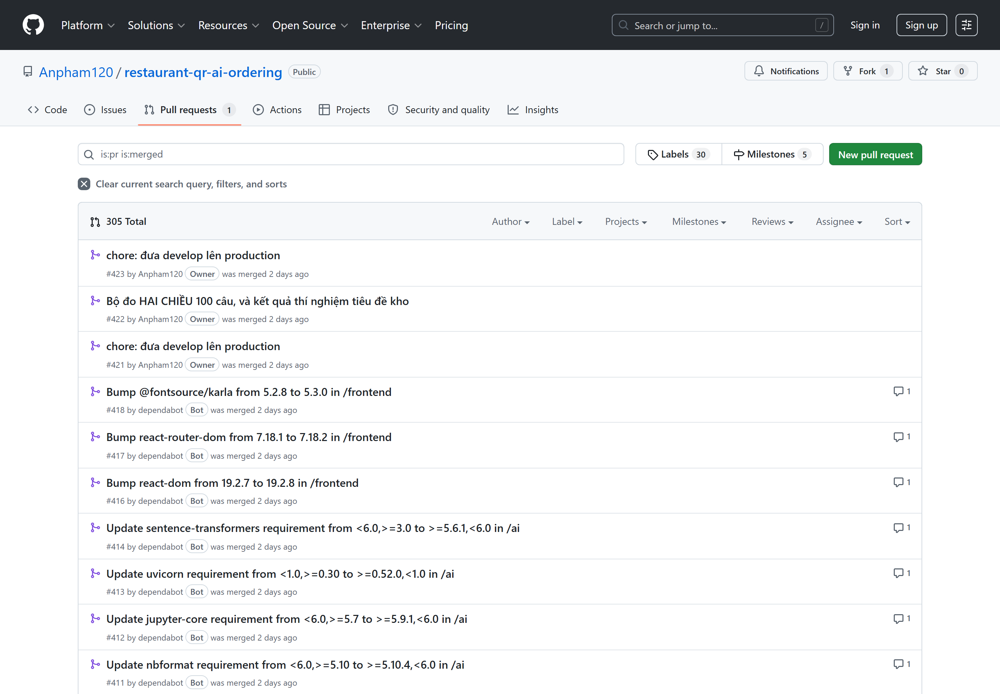

*Hình 3.4 — Pull request đã merge. Mọi thay đổi vào `develop` đều đi qua PR; không có commit trực tiếp lên `main`. Nguồn: [github.com/Anpham120/restaurant-qr-ai-ordering/pulls](https://github.com/Anpham120/restaurant-qr-ai-ordering/pulls?q=is%3Apr+is%3Amerged)*

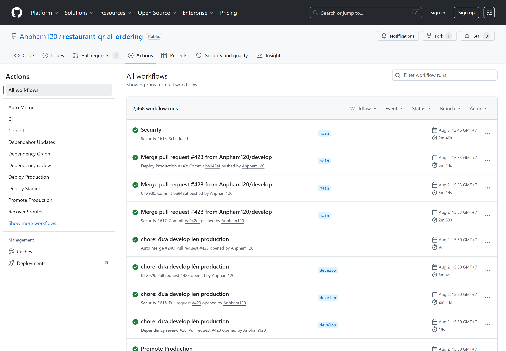

*Hình 3.5 — Tab Actions chụp ngày 03/08/2026: **2.468 lần chạy workflow** trên 9 workflow (CI, Security, Auto Merge, Deploy Staging, Deploy Production, Promote Production, Rollback, Dependency Graph, Dependency review). Nguồn: [github.com/Anpham120/restaurant-qr-ai-ordering/actions](https://github.com/Anpham120/restaurant-qr-ai-ordering/actions)*

### 3.1.4. Releases

Ba bản phát hành, mỗi bản gắn tag trên một commit thật của `main` và ứng với một giai đoạn có ranh giới rõ:

| Bản | Ngày | Phạm vi | Commit | PR | Nội dung chính |
|---|---|---|---|---|---|
| [v0.1.0](https://github.com/Anpham120/restaurant-qr-ai-ordering/releases/tag/v0.1.0) | 19/06/2026 | MVP đầu tiên | 196 | 85 | Luồng gọi món lõi chạy được đầu-cuối |
| [v0.2.0](https://github.com/Anpham120/restaurant-qr-ai-ordering/releases/tag/v0.2.0) | mốc 22/07/2026 | Vận hành thật | 357 | 129 | PostgreSQL thật, phiên bàn, hóa đơn bàn, quầy thu ngân, 12 migration |
| [v0.3.0](https://github.com/Anpham120/restaurant-qr-ai-ordering/releases/tag/v0.3.0) | mốc 02/08/2026 | Tái cấu trúc AI | 319 | 75 | Tái cấu trúc toàn bộ `ai/`, bổ sung cổng kiểm tra triển khai hai đầu và khắc phục ba điểm yếu CI/CD |

**v0.3.0** xóa nhiều mã hơn lượng bổ sung (+84.967/−241.284 dòng). Bản phát hành không thêm tính
năng mới cho khách mà tập trung nâng khả năng giải thích và kiểm chứng hệ thống; các số liệu tại
mục [5.2.2](#522-chất-lượng-đo-được) được chốt theo phiên bản này.

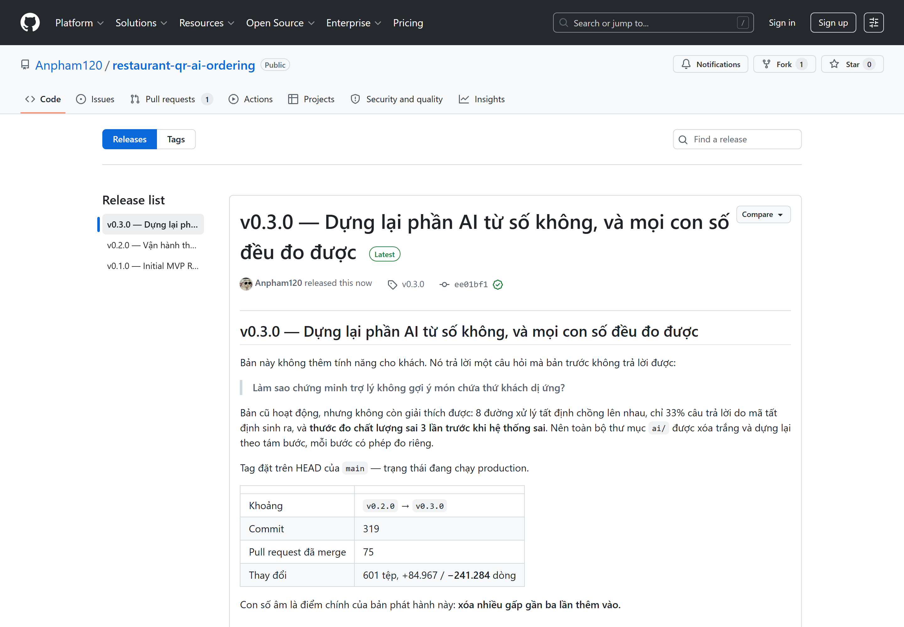

*Hình 3.6 — Trang Releases. Nguồn: [github.com/Anpham120/restaurant-qr-ai-ordering/releases](https://github.com/Anpham120/restaurant-qr-ai-ordering/releases)*

### 3.1.5. Branch ruleset — biến CI từ thói quen thành cổng chặn

Suốt phần lớn thời gian làm dự án, việc "mọi thay đổi phải qua pull request và phải xanh CI" được
nhóm giữ bằng **kỷ luật**: ai cũng làm đúng, nhưng không có gì ngăn được một người vội vàng đẩy
thẳng lên nhánh chính. Nhóm coi đó là một điểm yếu thật, vì một quy tắc chỉ dựa vào thiện chí sẽ
đứt đúng vào lúc bận nhất.

Ruleset [`CI/CD protected branches`](https://github.com/Anpham120/restaurant-qr-ai-ordering/settings/rules)
đóng lại khoảng trống ấy ở mức nền tảng: từ đây quy tắc không còn nằm ở chỗ mọi người nhớ làm, mà
nằm ở chỗ GitHub **từ chối thao tác sai**.

| Nội dung | Cấu hình thực tế |
|---|---|
| Phạm vi áp dụng | `refs/heads/main` và `refs/heads/develop` |
| Trạng thái | `active` — chặn thật, không phải chế độ chỉ cảnh báo |
| Danh sách ngoại lệ | **rỗng** — không tài khoản nào, kể cả chủ repository, được bỏ qua |
| Bắt buộc pull request | Không commit thẳng vào hai nhánh trên |
| Bắt buộc CI xanh | 5 job: `backend-test`, `frontend-build`, `ai-data-and-eval`, `golden-e2e`, `docker-compose-config` |
| Chặn force push | `non_fast_forward` — không ai viết lại được lịch sử đã đẩy |
| Chặn xóa nhánh | `deletion` |

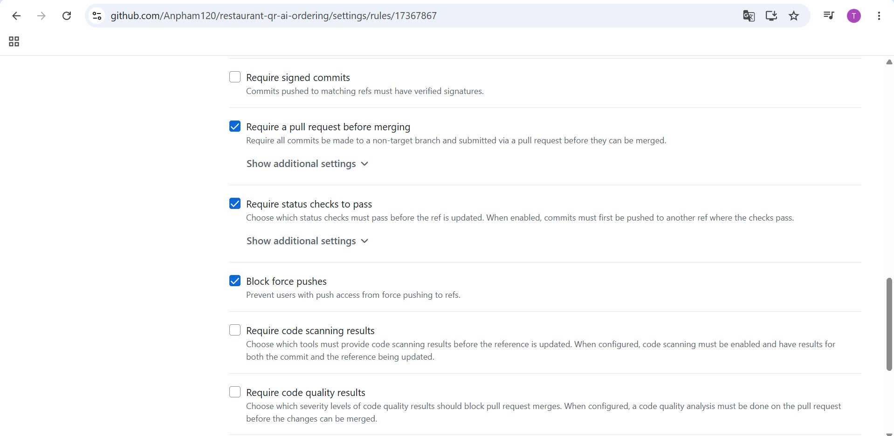

*Hình 3.7 — Ruleset đang bật trên `main` và `develop`. Ba mục được đánh dấu là bắt buộc pull request trước khi merge, bắt buộc status check xanh, và chặn force push. Nguồn: [Settings → Rules](https://github.com/Anpham120/restaurant-qr-ai-ordering/settings/rules)*

Đáng chú ý là **danh sách ngoại lệ để rỗng**. GitHub cho phép chừa cửa cho quản trị viên, và đó là
lựa chọn mặc định mà phần lớn dự án giữ nguyên. Nhóm bỏ hẳn cửa đó, vì một cổng chặn có ngoại lệ
cho người quyền cao nhất thì đúng vào tình huống nguy hiểm nhất — lúc gấp, lúc muộn, lúc "chỉ sửa
một dòng" — nó sẽ không chặn. Cái giá phải trả là chính nhóm cũng phải tuân thủ đầy đủ quy trình
khi cần sửa khẩn cấp; nhóm chấp nhận đánh đổi đó.

Năm status check bắt buộc **trùng đúng** năm job trong [`ci.yml`](https://github.com/Anpham120/restaurant-qr-ai-ordering/blob/main/.github/workflows/ci.yml).
Điều này có một hệ quả cụ thể đáng nêu: `golden-e2e` — kịch bản gọi món đầu-cuối có trợ lý AI mô tả
ở mục [5.1.2](#512-kịch-bản-minh-họa-đầu-cuối) — nay là **điều kiện để merge**. Nói cách khác, luồng
tính năng trọng tâm của đề tài không thể bị làm hỏng một cách âm thầm: hỏng là không vào được nhánh
chính.

Nhóm ghi rõ mốc thời gian để không nhận công quá phần mình: ruleset được bật ở **giai đoạn cuối dự
án**, nên **377 pull request** trước đó đi qua CI vì nhóm tự tuân thủ chứ chưa vì bị chặn. Bằng
chứng cho giai đoạn ấy vẫn là lịch sử thật — không có commit trực tiếp nào lên `main` — còn ruleset
là thứ bảo đảm điều đó tiếp tục đúng khi không còn ai theo dõi.

### 3.1.6. README.md

[README](https://github.com/Anpham120/restaurant-qr-ai-ordering#readme) đóng vai trang giới thiệu sản phẩm: mô tả bài toán, gallery giao diện production, sơ đồ kiến trúc Mermaid, hướng dẫn chạy từng tầng, lệnh kiểm chứng, và **bảng số liệu đo được**. Tài liệu chi tiết tách sang [Documentation Hub](../README.md) theo 6 chủ đề.

## 3.2. Nhật ký sử dụng công cụ/tác tử AI

Nhóm dùng tác tử AI (Claude Code / Codex) như **một thành viên viết mã cần được review**, chứ không
phải một máy sinh đáp án. Quy tắc phối hợp được ghi thành tệp [`AGENTS.md`](https://github.com/Anpham120/restaurant-qr-ai-ordering/blob/main/AGENTS.md)
ở gốc repository, để mọi phiên làm việc với tác tử đều bắt đầu từ cùng một bộ ràng buộc thay vì phụ
thuộc vào cách diễn đạt của từng người.

Nhóm ý thức rằng phần này là nơi một báo cáo dễ trở nên hình thức nhất: liệt kê vài lần dùng AI rồi
kết luận rằng công cụ *hữu ích*. Để tránh điều đó, bảng dưới đây chỉ ghi những trường hợp mà nhóm
**có thể chỉ ra bằng chứng của cả ba cột** — gợi ý ban đầu, phép kiểm chứng đã thực hiện, và quyết
định cuối cùng kèm lý do. Đáng chú ý là trong tám trường hợp, có **ba lần gợi ý của AI sai** và
nhóm chỉ phát hiện được nhờ đo lại chứ không nhờ đọc mã.

### 3.2.1. Ba cột: AI gợi ý — nhóm kiểm chứng — nhóm tự quyết

| # | AI gợi ý | Nhóm kiểm chứng / sửa / loại bỏ | Nhóm tự quyết định |
|---|---|---|---|
| 1 | Dùng **hybrid BM25 + embedding** cho truy hồi, vì "hybrid thường tốt hơn" | Đo trên tập phát triển và phân vùng được thiết kế để niêm phong. Kết quả: embedding 0,921 so với hybrid 0,908 ở tập phát triển. Phân vùng niêm phong về sau đã được mở hai lần, nên hiện chỉ dùng cho hồi quy | **Loại bỏ hybrid.** Chọn embedding đơn lẻ. Giữ ADR cũ trong `archive/` để ghi lại điều kiện từng làm nó đúng |
| 2 | Viết `menu.md` kể lại thực đơn bằng văn xuôi cho kho tri thức | Đối chiếu với dữ liệu: tài liệu ghi *"hơn 90 món"*, thực đơn có **91 món** | **Đổi cách làm:** tài liệu `derived` phải **sinh từ dữ liệu**, có `--check` trong CI. Chỉ giữ văn xuôi cho phần chính sách mà dữ liệu không suy ra được |
| 3 | Dùng `sentence-transformers` với torch mặc định | Đo kích thước ảnh: **9,29 GB** vì pip lấy bản CUDA | **Ghim bản CPU-only** → 2,74 GB ([PR #268](https://github.com/Anpham120/restaurant-qr-ai-ordering/pull/268)) |
| 4 | Tài liệu do AI viết khẳng định dịch vụ "thoái hóa êm khi thiếu cấu hình" | **Tiêm lỗi vào đúng đường xử lý.** Phát hiện `urllib.request.Request(...)` nằm ngoài khối `try`, làm dịch vụ dừng bất thường thay vì thoái hóa | **Thiết lập quy tắc:** mọi khẳng định về hành vi khi lỗi phải có kiểm thử đi đúng đường lỗi đó |
| 5 | Sinh bộ test cho phần chat | Chạy bộ dò lỗ: thước đo chấp nhận câu trả lời vô nghĩa ở 24 trường hợp | **Khắc phục cả 24 trường hợp chấp nhận sai** trước khi sử dụng số liệu do thước đo tạo ra |
| 6 | Giữ nguyên biến môi trường cũ trong `.env.example` và compose cho "an toàn" | Đối chiếu với mã: **7 biến không mô-đun nào đọc**, và `RAG_RETRIEVAL_METHOD=hybrid` **nói sai** về hệ thống đang chạy | **Gỡ hết.** Biến chết còn tệ hơn thiếu tài liệu, vì người đọc **tin** nó |
| 7 | Thêm `AI_PIPELINE_PROFILE` vào workflow deploy để "cấu hình linh hoạt" | Đọc mã backend: `ChatAiProvider.ReadPipelineProfile()` phát sinh lỗi với mọi giá trị ngoài 3 tên profile cũ; đặt tên mới sẽ làm mọi lượt chat thất bại | **Không truyền biến đó.** Thêm kiểm thử hồi quy cho khối biến môi trường của Compose theo **cả hai chiều** |
| 8 | Notebook báo cáo có thể sửa tay cho nhanh | CI `--check` phát hiện notebook không sinh lại được; một ô phát sinh `TypeError` hai lần nhưng `--check` vẫn thành công | **Bổ sung kiểm tra thứ hai:** đọc **kết quả đã commit** và báo lỗi nếu có ô thực thi thất bại. Phân biệt trạng thái *"tệp tồn tại"* với *"tệp thực thi thành công"* |

### 3.2.2. Nguyên tắc trách nhiệm khi dùng AI

Bốn nguyên tắc nhóm rút ra và áp dụng nhất quán:

1. **AI không được là nguồn sự thật.** Các số liệu do AI đề xuất phải được đối chiếu với dữ liệu
   hoặc đo lại. Trong tám trường hợp ở bảng trên, ba gợi ý sai được phát hiện nhờ phép đo.
2. **Tài liệu do AI viết là giả thuyết cho tới khi có kiểm thử.** Trường hợp #4 cho thấy tài liệu
   có thể đúng về ý định nhưng sai về hành vi thực tế khi chưa có phép kiểm tương ứng.
3. **Không chấp nhận mã mà nhóm không giải thích được.** Ranh giới đóng băng [`AI_NO_TOUCH_BOUNDARY.md`](../AI_NO_TOUCH_BOUNDARY.md) tồn tại để tác tử không âm thầm sửa hợp đồng AI khi đang refactor nghiệp vụ.
4. **Ghi lại cả những lần đo sai.** [Tài liệu phân tích lỗi](../../ai/docs/07-error-analysis.md)
   ghi rõ **4 lần nhóm tự đo sai** — vì một phương pháp giấu sai lầm của mình thì không kiểm chứng được.

## 3.3. Phân công và đóng góp

### 3.3.1. Nguyên tắc đối chiếu đóng góp

Bảng phân công công việc đã được đặt ngay sau Danh mục từ viết tắt để giảng viên có thể tra cứu
nhanh trách nhiệm chính, tài khoản GitHub và hiện vật phụ trách của từng thành viên. Phần này không
lặp lại danh sách đó mà tập trung đối chiếu phân công với bằng chứng thực hiện. Việc đánh giá không
chỉ dựa vào số commit, bởi một commit có thể rất nhỏ hoặc chứa thay đổi được tạo tự động; nhóm sử
dụng đồng thời lượt gán issue, pull request, commit không phải merge và các hiện vật tiêu biểu đã
được hợp nhất vào repository.

### 3.3.2. Đóng góp đối chiếu được trên GitHub

Số liệu được chốt tại [tag `v0.3.0`](https://github.com/Anpham120/restaurant-qr-ai-ordering/releases/tag/v0.3.0).
Cột issue đếm **lượt gán** (một issue có thể có hai người);
cột PR chỉ đếm PR do năm thành viên tạo, không tính 71 PR Dependabot và 3 PR của GitHub Actions;
cột commit đếm commit tác giả **không phải merge commit**, sau khi hợp nhất các tên/email Git của
cùng một thành viên. Cách tính này tránh ghi công merge tự động như một đóng góp mã nguồn. Nguồn
đối chiếu gồm [Insights → Contributors](https://github.com/Anpham120/restaurant-qr-ai-ordering/graphs/contributors),
GitHub API và lịch sử Git; lệnh tái lập được ghi tại
[Phụ lục](#7-phụ-lục--cách-kiểm-chứng-các-số-liệu-chính). Số commit chỉ được dùng để đối chiếu,
không được dùng thay cho đánh giá khối lượng hoặc chất lượng đóng góp.

| Thành viên | Mảng phụ trách | Lượt gán issue | PR đã tạo | Commit không merge | Đóng góp tiêu biểu |
|---|---|---|---|---|---|
| **Phạm Duy An**<br/>[@Anpham120](https://github.com/Anpham120) | Kiến trúc · AI/RAG · DevOps · Tài liệu | **16** | **272** | **423** | Hợp đồng API ([#73](https://github.com/Anpham120/restaurant-qr-ai-ordering/issues/73)), kiến trúc monolith module hóa ([#64](https://github.com/Anpham120/restaurant-qr-ai-ordering/issues/64)), dịch vụ AI + RAG ([#54](https://github.com/Anpham120/restaurant-qr-ai-ordering/issues/54), [PR #377](https://github.com/Anpham120/restaurant-qr-ai-ordering/pull/377)), CI/CD + rollback ([#16](https://github.com/Anpham120/restaurant-qr-ai-ordering/issues/16)), triển khai production ([#78](https://github.com/Anpham120/restaurant-qr-ai-ordering/issues/78)) |
| **Bùi Đào Đức Anh**<br/>[@buidaoducanh1210](https://github.com/buidaoducanh1210) | Backend — xác thực & thanh toán | **8** | 9 | 18 | Xác thực/JWT/phân quyền ([#66](https://github.com/Anpham120/restaurant-qr-ai-ordering/issues/66), [PR #86](https://github.com/Anpham120/restaurant-qr-ai-ordering/pull/86)), bàn + QR + phiên bàn ([#68](https://github.com/Anpham120/restaurant-qr-ai-ordering/issues/68), [PR #89](https://github.com/Anpham120/restaurant-qr-ai-ordering/pull/89)), thanh toán COD/VietQR ([#70](https://github.com/Anpham120/restaurant-qr-ai-ordering/issues/70), [PR #91](https://github.com/Anpham120/restaurant-qr-ai-ordering/pull/91)), ổn định seed demo ([PR #93](https://github.com/Anpham120/restaurant-qr-ai-ordering/pull/93)) |
| **Nguyễn Quang Hiếu**<br/>[@quanghieu1605](https://github.com/quanghieu1605) | Backend — dữ liệu & realtime | **8** | 9 | 25 | PostgreSQL + EF Core/Npgsql ([#65](https://github.com/Anpham120/restaurant-qr-ai-ordering/issues/65), [PR #84](https://github.com/Anpham120/restaurant-qr-ai-ordering/pull/84)), thực đơn/danh mục ([#67](https://github.com/Anpham120/restaurant-qr-ai-ordering/issues/67), [PR #88](https://github.com/Anpham120/restaurant-qr-ai-ordering/pull/88)), vòng đời đơn hàng ([#69](https://github.com/Anpham120/restaurant-qr-ai-ordering/issues/69), [PR #90](https://github.com/Anpham120/restaurant-qr-ai-ordering/pull/90)), SignalR + luồng bếp ([#13](https://github.com/Anpham120/restaurant-qr-ai-ordering/issues/13), [PR #92](https://github.com/Anpham120/restaurant-qr-ai-ordering/pull/92)) |
| **Đỗ Tuấn Anh**<br/>[@Tanh2k8-123](https://github.com/Tanh2k8-123) | Frontend — khách hàng | **7** | 5 | 9 | Khởi tạo React + routing theo vai trò ([#4](https://github.com/Anpham120/restaurant-qr-ai-ordering/issues/4)), luồng QR–giỏ–thanh toán ([#8](https://github.com/Anpham120/restaurant-qr-ai-ordering/issues/8), [PR #32](https://github.com/Anpham120/restaurant-qr-ai-ordering/pull/32)), giao diện chatbot ([#14](https://github.com/Anpham120/restaurant-qr-ai-ordering/issues/14), [PR #42](https://github.com/Anpham120/restaurant-qr-ai-ordering/pull/42)), khớp luồng khách với backend thật ([#75](https://github.com/Anpham120/restaurant-qr-ai-ordering/issues/75), [PR #99](https://github.com/Anpham120/restaurant-qr-ai-ordering/pull/99)) |
| **Lê Anh**<br/>[@totototototoads](https://github.com/totototototoads) | Frontend — vận hành | **7** | 8 | 9 | Thực đơn khách có ngữ cảnh bàn QR ([#5](https://github.com/Anpham120/restaurant-qr-ai-ordering/issues/5)), giao diện quản trị ([#9](https://github.com/Anpham120/restaurant-qr-ai-ordering/issues/9)), bảng bếp realtime ([#15](https://github.com/Anpham120/restaurant-qr-ai-ordering/issues/15)), hoàn thiện admin/staff/kitchen/QR ([PR #50](https://github.com/Anpham120/restaurant-qr-ai-ordering/pull/50)), nối tầng gọi API ([#74](https://github.com/Anpham120/restaurant-qr-ai-ordering/issues/74), [PR #100](https://github.com/Anpham120/restaurant-qr-ai-ordering/pull/100)) |

# 4. Liên hệ lý thuyết — Sommerville, Engineering Software Products

Phần này không nhằm chứng minh rằng nhóm đã làm đúng theo sách. Một bản đối chiếu kiểu ấy dễ viết
nhưng gần như vô giá trị, bởi bất kỳ dự án nào cũng có thể tìm ra vài đoạn văn để tự khẳng định
mình. Điều nhóm cho là đáng viết hơn là **chỗ lý thuyết đã dẫn đường, chỗ nó không áp dụng được, và
chỗ thực tế buộc nhóm phải đi xa hơn những gì sách đề cập**.

Mỗi mục dưới đây trình bày theo bốn phần cố định: **sách nói gì**, **nhóm làm gì**, **minh chứng
kiểm tra được**, và **phản biện**. Phần phản biện là phần nhóm đầu tư nhiều công nhất, vì đó là nơi
duy nhất thể hiện được nhóm có thực sự hiểu điều mình áp dụng hay không.

### Bảng tổng hợp nhanh

| Chương | Nội dung áp dụng | Kết luận của nhóm |
|---|---|---|
| Ch.2 — Tầm nhìn sản phẩm | Tầm nhìn một đoạn, 6 năng lực lõi, cắt bỏ phạm vi | Áp dụng đầy đủ |
| Ch.3 — Persona và user story | 3 persona, 9 user story, backlog 46 issue | Áp dụng; tự phản biện thứ tự thực hiện |
| Ch.4–5 — Kiến trúc | Modular monolith, tách riêng dịch vụ AI | Áp dụng; **bác bỏ** microservices có căn cứ |
| Ch.5 — Triển khai đám mây | Docker Compose trên VPS | Một phần; **không** dùng Kubernetes |
| Ch.6 — Giao tiếp dịch vụ | REST + hợp đồng viết trước, SignalR cho dữ liệu đẩy | Áp dụng; **bác bỏ** GraphQL có căn cứ |
| Ch.7 — Bảo mật | JWT, PBKDF2, capability token, quét tự động | Áp dụng, bắt được lỗ hổng thật |
| Ch.8 — Lập trình tin cậy | Fail-closed, suy giảm êm, kiểm thử tiêm lỗi | Áp dụng; bổ sung quy tắc riêng |
| Ch.9 — Kiểm thử | Bốn tầng test, golden đầu-cuối | Áp dụng; thêm kiểm tra thước đo |
| Ch.10 — DevOps | CI, triển khai tự động, rollback | Áp dụng; continuous deployment |
| Ch.10 — Quản lý cấu hình | Gỡ cấu hình chết, kiểm thử hồi quy hai chiều | Áp dụng; mở rộng từ bài học riêng |
| Ngoài sách | Dữ liệu và tài liệu sinh lại được | **Bổ sung** so với phạm vi sách |

---

## 4.1. Tầm nhìn sản phẩm và MVP (Chương 2)

**Sách nói gì.** Sommerville lập luận rằng một sản phẩm phần mềm cần một tầm nhìn phát biểu được
trong vài câu, và MVP phải là tập nhỏ nhất còn mang lại giá trị. Kỷ luật khó nhất không phải chọn
làm gì, mà là **từ chối làm** những thứ nghe có vẻ hợp lý [1, Ch.2].

**Nhóm làm gì.** Tầm nhìn viết theo khuôn *Cho – Là – Giúp – Khác với* (xem mục 1.2), chốt đúng
**sáu năng lực lõi**, và gỡ Delivery cùng Pickup ra khỏi phạm vi.

**Minh chứng.** [Release v0.1.0](https://github.com/Anpham120/restaurant-qr-ai-ordering/releases/tag/v0.1.0) ·
[Milestone Tuần 1–2](https://github.com/Anpham120/restaurant-qr-ai-ordering/milestones) ·
[migration gỡ Delivery](https://github.com/Anpham120/restaurant-qr-ai-ordering/blob/main/backend/src/RestaurantQrAiOrdering.Api/Data/Migrations/20260620155616_RemoveDeliveryAndBindTableSession.cs)

**Phản biện — phù hợp.** Điều đáng nói không phải là nhóm *chọn* phạm vi hẹp, mà là nhóm đã **gỡ bỏ
thứ đã viết xong**. Delivery từng có bảng trong cơ sở dữ liệu, có enum, có mã xử lý; việc xóa nó đòi
một migration riêng và một vòng sửa các chỗ phụ thuộc. Đây chính là cái giá mà Sommerville nói tới:
giữ MVP tối thiểu **tốn công hơn** là chỉ đơn giản không làm gì thêm, vì nó buộc phải phá bỏ công
sức đã bỏ ra.

## 4.2. Persona và user story (Chương 3)

**Sách nói gì.** Persona giúp đội phát triển giữ liên hệ với người dùng thật, thay vì thiết kế cho
một người dùng trừu tượng không tồn tại. User story kèm tiêu chí chấp nhận biến nhu cầu thành thứ
kiểm chứng được [1, Ch.3].

**Nhóm làm gì.** Ba persona (khách ăn tại bàn, nhân viên quầy, bếp trưởng), chín user story lõi kèm
tiêu chí chấp nhận, và backlog gồm 46 issue gắn nhãn theo ba chiều.

**Minh chứng.** [46 issue](https://github.com/Anpham120/restaurant-qr-ai-ordering/issues?q=is%3Aissue) ·
[hệ thống nhãn](https://github.com/Anpham120/restaurant-qr-ai-ordering/labels) · mục 2.1 của báo cáo này

**Phản biện — phù hợp một phần, và nhóm tự phản biện chính mình.** Persona đã phát huy tác dụng
thật: ràng buộc về dị nguyên của persona khách hàng trở thành NFR-01 và định hình toàn bộ thiết kế
phần AI. Nhưng **persona được viết muộn**, sau khi backlog đã hình thành. Nhóm cho rằng nếu làm
đúng thứ tự sách đề nghị, vòng refactor quan hệ *phiên bàn ↔ hóa đơn* ở Tuần 5 có lẽ đã tránh được
— vì bản chất vòng refactor ấy là hệ quả của việc mô hình dữ liệu ban đầu không xuất phát từ hành
vi thật của một bữa ăn.

## 4.3. Kiến trúc: monolith hay microservices (Chương 4–5)

**Sách nói gì.** Microservices đổi lấy khả năng phát hành độc lập bằng **độ phức tạp vận hành**.
Cái giá đó chỉ đáng trả khi các thành phần thực sự cần scale riêng hoặc thay đổi theo nhịp khác
nhau [1, Ch.4–5].

**Nhóm làm gì.** Chọn **modular monolith** cho toàn bộ nghiệp vụ, và tách **duy nhất** dịch vụ AI
thành tiến trình riêng.

**Minh chứng.** [Kiến trúc backend](../BACKEND_MODULAR_MONOLITH_ARCHITECTURE.md) · [Issue #64](https://github.com/Anpham120/restaurant-qr-ai-ordering/issues/64)

**Phản biện — bác bỏ microservices, có căn cứ định lượng.** Đơn hàng, thanh toán và tồn kho ở bài
toán này **luôn thay đổi cùng nhau** và cần nhất quán ngay lập tức. Tách chúng thành ba dịch vụ
buộc phải dựng saga để mô phỏng lại thứ mà một transaction cơ sở dữ liệu vốn cho sẵn — tức là tự
tạo ra vấn đề rồi tự giải nó.

Dịch vụ AI **được** tách, nhưng theo một tiêu chí hoàn toàn khác: ảnh Docker 2,74 GB so với khoảng
200 MB của backend, ngôn ngữ khác, nhịp thay đổi khác (theo phép đo chất lượng chứ không theo tính
năng nhà hàng), và lý do scale khác. Kết luận nhóm rút ra: **tiêu chí tách dịch vụ là sự khác biệt
về vòng đời, không phải sự gọn gàng của sơ đồ.**

## 4.4. Triển khai trên hạ tầng đám mây (Chương 5)

**Sách nói gì.** Hạ tầng nên tương xứng với tải thật và với năng lực vận hành của đội, không nên
chọn theo mức độ hiện đại [1, Ch.5].

**Nhóm làm gì.** Docker Compose trên một VPS, tách bạch ba môi trường staging, production và
rollback.

**Minh chứng.** [`deploy/docker-compose.yml`](https://github.com/Anpham120/restaurant-qr-ai-ordering/blob/main/deploy/docker-compose.yml) ·
[Tài liệu triển khai](../CICD_PIPELINE.md)

**Phản biện — phù hợp có giới hạn.** Compose đủ cho một nhà hàng và, quan trọng hơn, đủ đơn giản để
cả năm thành viên hiểu được toàn bộ đường đi từ mã nguồn tới máy chủ. Nhóm **không áp dụng
auto-scaling và Infrastructure as Code**: chưa có tải thật để biện minh, và việc học Kubernetes
trong chín tuần sẽ lấy mất thời gian của phần lõi. Đây là một đánh đổi có ý thức, được ghi lại để
người đọc đánh giá — không phải một thiếu sót bị bỏ quên.

## 4.5. Thiết kế giao tiếp giữa các thành phần (Chương 6)

**Sách nói gì.** REST phù hợp cho giao tiếp giữa dịch vụ và client khi hợp đồng ổn định; lựa chọn
kiểu giao tiếp nên xuất phát từ ràng buộc thực tế của đội [1, Ch.6].

**Nhóm làm gì.** 84 endpoint REST với **hợp đồng viết trước khi code**, và SignalR chỉ dùng cho dữ
liệu **đẩy** từ máy chủ xuống.

**Minh chứng.** [Hợp đồng API](../API_CONTRACT.md) · [Issue #73](https://github.com/Anpham120/restaurant-qr-ai-ordering/issues/73) ·
[Issue #10](https://github.com/Anpham120/restaurant-qr-ai-ordering/issues/10)

**Phản biện — bác bỏ GraphQL, có căn cứ.** Ba ứng dụng web cộng dịch vụ AI dùng chung một API, nên
hợp đồng viết trước chính là điều kiện để năm người làm song song mà không chặn nhau. GraphQL giải
bài toán *client cần linh hoạt truy vấn* — nhưng đó không phải bài toán của nhóm. Cái nhóm thiếu là
**một hợp đồng rõ ràng và ổn định**, và thêm một tầng schema linh hoạt vào lúc ấy sẽ làm vấn đề tệ
hơn chứ không tốt hơn.

Việc bổ sung SignalR minh họa nguyên tắc ngược lại: REST polling **không đủ** cho trạng thái đơn
hàng, nên nhóm thêm một cơ chế đẩy — nhưng chỉ đúng ở chỗ cần, không mở rộng ra toàn hệ thống.

## 4.6. Bảo mật (Chương 7)

**Sách nói gì.** Bảo mật phải được thiết kế từ đầu, và **quét tự động** có thể phát hiện các lớp
lỗi mà quá trình rà soát thủ công bỏ sót [1, Ch.7].

**Nhóm làm gì.** JWT với mật khẩu băm PBKDF2-HMAC-SHA256 có salt, capability token cho phiên bàn,
khóa tài khoản khi đăng nhập sai nhiều lần, cùng bộ quét CodeQL, gitleaks và Trivy chạy trên mọi
pull request.

**Minh chứng.** [SECURITY.md](../../SECURITY.md) ·
[`security.yml`](https://github.com/Anpham120/restaurant-qr-ai-ordering/blob/main/.github/workflows/security.yml)

**Phản biện — phù hợp, và có một lỗ hổng thật bị bắt.** CodeQL báo *Information exposure through an
exception* tại ba vị trí mà không thành viên nào nhận ra khi đọc lại mã — bởi từ góc nhìn của người
viết, trả chi tiết lỗi ra ngoài trông giống một hành động thân thiện với người dùng. Bản sửa giữ
nguyên giá trị chẩn đoán bằng cách trả **mã tham chiếu tám ký tự** cho khách và đẩy chi tiết vào
log. Trường hợp này minh họa trực tiếp vai trò của quét bảo mật tự động trong quá trình phát triển.

## 4.7. Lập trình tin cậy (Chương 8)

**Sách nói gì.** Hệ thống tin cậy cần xử lý được trường hợp bất thường, và phải thoái hóa êm thay
vì dừng bất thường khi gặp lỗi ngoài dự kiến [1, Ch.8].

**Nhóm làm gì.** Fail-closed cho việc nguy hiểm (thiếu dữ liệu dị nguyên thì loại món, không đoán),
suy giảm êm cho phần còn lại, và **kiểm thử tiêm lỗi** cho các khẳng định về hành vi khi có sự cố.

**Minh chứng.** Không ghi nhận lỗi an toàn trên 140 ca, trong phạm vi dữ liệu nhãn hiện có ·
[PR #377](https://github.com/Anpham120/restaurant-qr-ai-ordering/pull/377)

**Phản biện — phù hợp, và đây là chương nhóm học được nhiều nhất.** Bài học quan trọng nhất lại
không nằm trong sách mà nằm ở một lỗi thật. Tài liệu của nhóm khẳng định dịch vụ *"thoái hóa êm khi
thiếu cấu hình"*, nhưng một dòng `urllib.request.Request(...)` nằm **ngoài** khối `try` khiến dịch
vụ dừng bất thường thay vì thoái hóa. Tài liệu đúng về ý định nhưng sai về hành vi thực tế; lỗi
không được phát hiện sớm vì chưa có kiểm thử đi đúng đường xử lý đó.

Từ đó nhóm rút ra một quy tắc riêng, áp dụng cho toàn dự án: **mọi khẳng định về hành vi khi lỗi
đều phải có kiểm thử đi đúng đường lỗi ấy.** Một biến thể cùng lớp lỗi được phát hiện ở đợt rà soát
cuối, mô tả chi tiết ở mục 2.5.3.

## 4.8. Kiểm thử (Chương 9)

**Sách nói gì.** Kiểm thử phân tầng theo đơn vị, tích hợp và hệ thống, mỗi tầng trả lời một câu hỏi
khác nhau [1, Ch.9].

**Nhóm làm gì.** 118 test frontend, 84 test backend, 386 test mã AI, 128 test thước đo, cùng bộ
golden đầu-cuối chạy trên stack thật.

**Minh chứng.** [`ci.yml`](https://github.com/Anpham120/restaurant-qr-ai-ordering/blob/main/.github/workflows/ci.yml) ·
[Kế hoạch kiểm thử](../TEST_PLAN.md)

**Phản biện — phù hợp và được bổ sung cho bối cảnh AI.** Bên cạnh các tầng kiểm thử phần mềm thông
thường, dự án đặt thêm câu hỏi: **ai kiểm tra chính thước đo dùng để đánh giá đầu ra AI?**

Câu hỏi này nảy sinh vì phần AI không thể đánh giá bằng so sánh đầu ra với một giá trị cố định; nó
cần một hàm chấm điểm. Mà hàm chấm điểm cũng là mã, và mã thì có lỗi. Nhóm viết một bộ dò
([`probe_metric_holes.py`](../../ai/evaluation/probe_metric_holes.py)) đưa những câu trả lời
**cố ý vô nghĩa** vào thước đo và đòi thước đo phải
cho trượt. Bộ dò phát hiện **24 trường hợp chấp nhận sai** — tức 24 kiểu câu trả lời vô nghĩa vẫn
được chấm là đạt. Nếu bỏ
qua bước này, các kết quả phụ thuộc vào thước đo ở mục 5.2.2 sẽ thiếu cơ sở tin cậy.

**Chưa làm:** kiểm thử tải và kiểm thử khả năng tiếp cận, ghi ở mục 5.3.

## 4.9. DevOps và tích hợp liên tục (Chương 10)

**Sách nói gì.** CI/CD rút ngắn vòng phản hồi và giảm rủi ro phát hành, với điều kiện pipeline thực
sự tham gia kiểm soát thay đổi thay vì chỉ chạy để cung cấp thông tin [1, Ch.10].

**Nhóm làm gì.** Năm job CI và bốn workflow triển khai, kèm **cổng kiểm tra hai đầu** đối chiếu cấu
hình đang chạy với cấu hình đã được đo. Cả năm job được khai báo là **status check bắt buộc** trong
branch ruleset của `main` và `develop`, nên điều kiện "pipeline phải là cổng chặn" mà sách đặt ra
được thực thi ở mức nền tảng: khi kiểm tra CI thất bại, thay đổi không đủ điều kiện merge.

**Minh chứng.** [`ci.yml`](https://github.com/Anpham120/restaurant-qr-ai-ordering/blob/main/.github/workflows/ci.yml) ·
[`deploy-staging.yml`](https://github.com/Anpham120/restaurant-qr-ai-ordering/blob/main/.github/workflows/deploy-staging.yml) ·
[`rollback.yml`](https://github.com/Anpham120/restaurant-qr-ai-ordering/blob/main/.github/workflows/rollback.yml) ·
branch ruleset ở mục [3.1.5](#315-branch-ruleset--biến-ci-từ-thói-quen-thành-cổng-chặn) ·
**2.468 lần chạy workflow** tính tới 03/08/2026

**Phản biện — phù hợp, và có cả continuous deployment.** Nhóm không dừng ở tích hợp liên tục:
`develop` tự động triển khai lên staging, `main` tự động lên production, và `rollback.yml` **tự
kích hoạt** khi kiểm tra khói sau triển khai thất bại. Đây là điểm khác biệt so với phần lớn đồ án
sinh viên, vốn thường dừng ở việc chạy test trên pull request.

**Không áp dụng blue-green hay canary:** một VPS, một nhà hàng, và vài giây gián đoạn khi khởi động
lại là chấp nhận được. Áp dụng chúng ở quy mô này sẽ chỉ tạo ra độ phức tạp không đổi lấy được gì.

## 4.10. Quản lý cấu hình (Chương 10)

**Sách nói gì.** Cấu hình phải được quản lý như mã nguồn, vì nó quyết định hành vi hệ thống ở môi
trường thật [1, Ch.10].

**Nhóm làm gì.** Gỡ **bảy biến môi trường không còn được sử dụng**, và thêm kiểm thử hồi quy cho khối biến môi trường của
Docker Compose **theo cả hai chiều** — biến cần có thì phải có, biến đã gỡ thì phải không xuất hiện
trở lại.

**Minh chứng.** [`test_packaging.py`](https://github.com/Anpham120/restaurant-qr-ai-ordering/blob/main/ai/app/test_packaging.py) ·
[`ai/.env.example`](https://github.com/Anpham120/restaurant-qr-ai-ordering/blob/main/ai/.env.example)

**Phản biện — phù hợp, và mở rộng từ một bài học riêng.** Biến `RAG_RETRIEVAL_METHOD=hybrid` tồn
tại trong cấu hình suốt một giai đoạn dài, trong khi bộ truy hồi thực sự chạy là `embedding`.
**Không mô-đun nào đọc biến đó**, nên nó không gây lỗi — nhưng mọi người đọc cấu hình đều tin nó,
kể cả chính các thành viên trong nhóm.

Kết luận nhóm rút ra vượt ra ngoài điều sách nói: **cấu hình chết nguy hiểm hơn là thiếu tài liệu**,
bởi thiếu tài liệu khiến người ta đi hỏi, còn cấu hình chết khiến người ta tin chắc vào một điều
sai. Đó là lý do kiểm thử hồi quy được viết theo cả hai chiều thay vì chỉ kiểm biến bắt buộc.

## 4.11. Dữ liệu và tài liệu sinh lại được (ngoài phạm vi sách)

**Sách nói gì.** Sommerville xem tài liệu là một hiện vật gắn với quy trình phát triển; dự án mở
rộng cách tiếp cận này bằng yêu cầu tài liệu dẫn xuất phải sinh lại được [1, Ch.10].

**Nhóm làm gì.** Tài liệu tri thức `derived`, từ điển nhãn, notebook giảng dạy và báo cáo đồ án đều
có chế độ `--check` chạy trong CI: nếu bản đã commit khác bản sinh lại, kiểm tra CI thất bại.

**Minh chứng.** [`build_knowledge.py`](https://github.com/Anpham120/restaurant-qr-ai-ordering/blob/main/ai/scripts/build_knowledge.py) ·
[`build_bao_cao_do_an.py`](https://github.com/Anpham120/restaurant-qr-ai-ordering/blob/main/ai/docs/build_bao_cao_do_an.py)

**Phản biện — ngoài phạm vi sách, và nhóm cho rằng đây là chỗ cần bổ sung.** Kinh nghiệm cụ thể:
một tài liệu tri thức viết tay ghi *"hơn 90 món"* trong khi thực đơn có **đúng 91 món**. Sai lệch
này nhỏ, nhưng nó cho thấy một quy luật rộng hơn — **văn xuôi kể lại dữ liệu thì luôn trôi khỏi dữ
liệu**, vì dữ liệu đổi còn văn xuôi thì không tự đổi theo.

Cơ chế nhóm lựa chọn là **sinh lại tài liệu từ dữ liệu** và để CI báo lỗi khi bản đã commit lệch
khỏi kết quả sinh. Với các hệ thống có phần dữ liệu lớn, cơ chế này nên được quy định trong quy
trình thay vì phụ thuộc vào thao tác thủ công.

---

# 5. Kết quả thực hiện

## 5.1. Sản phẩm / MVP

### 5.1.1. Giao diện

Các ảnh dưới đây được chụp từ phiên bản triển khai trên VPS, truy cập qua HTTPS và sử dụng
PostgreSQL. Môi trường này được dùng để kiểm tra sự tích hợp giữa frontend, backend, dịch vụ AI và
cơ sở dữ liệu ngoài máy phát triển. Việc triển khai công khai chứng minh khả năng vận hành kỹ thuật
của phiên bản hiện tại, nhưng không thay thế cho thử nghiệm sử dụng dài hạn tại nhà hàng.

**Nói rõ về dữ liệu.** Hạ tầng và cơ sở dữ liệu là thật, nhưng **thực đơn 91 món hiện tại là dữ
liệu mẫu** do nhóm dựng để phát triển và đánh giá, chưa phải thực đơn vận hành của một nhà hàng
thương mại. Cấu trúc của nó cố ý đều đặn — 13 danh mục, mỗi danh mục đúng 7 món — trong khi thực
đơn thật không bao giờ đều như vậy. Điều này được ghi rõ trong
[tài liệu tập đánh giá](../../ai/docs/02-evaluation-set.md), và nó là một hạn chế cần lưu ý khi đọc
các con số ở mục [5.2.2](#522-chất-lượng-đo-được): kết quả đo trên một thực đơn cân đối có thể lạc
quan hơn so với thực đơn thật vốn lệch và nhiều ngoại lệ.

<table>
  <tr>
    <td width="50%" align="center">
      <br />
      <strong>Website nhà hàng</strong><br />
      <sub>Điểm vào công khai — giới thiệu, thực đơn, dẫn tới luồng gọi món</sub>
    </td>
    <td width="50%" align="center">
      <br />
      <strong>Thực đơn — 91 món / 13 danh mục</strong><br />
      <sub>Ảnh, giá, nhãn dị nguyên và trạng thái còn hàng đọc trực tiếp từ PostgreSQL</sub>
    </td>
  </tr>
  <tr>
    <td width="50%" align="center">
      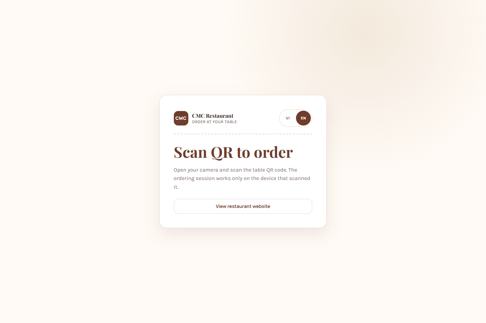<br />
      <strong>Điểm vào gọi món bằng QR</strong><br />
      <sub>Quét mã trên bàn → mở/tái sử dụng phiên bàn → cấp capability token</sub>
    </td>
    <td width="50%" align="center">
      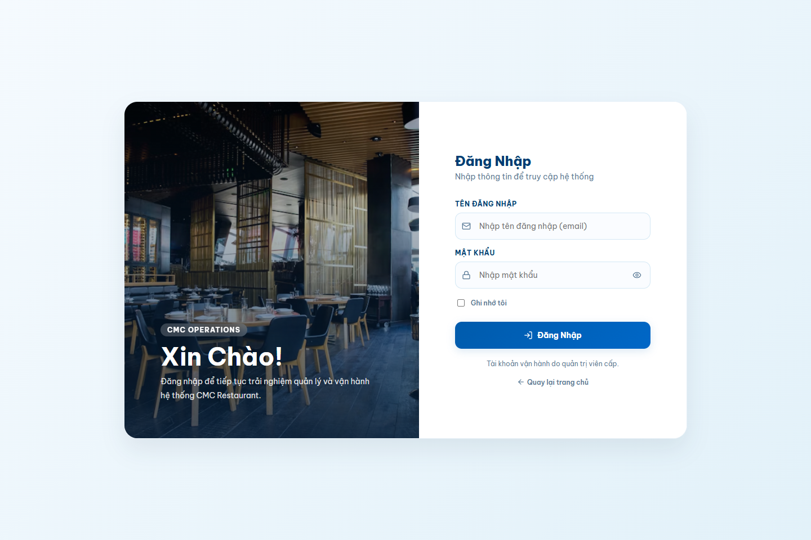<br />
      <strong>Cổng vận hành</strong><br />
      <sub>Một build phục vụ admin, quầy và bếp; vai trò quyết định workspace sau đăng nhập</sub>
    </td>
  </tr>
</table>

<div align="center">
  

*Hình 5.1 — Điểm vào gọi món ở khung hiển thị điện thoại 414×896, tương ứng với thiết bị mà khách
sử dụng tại bàn. Giao diện được thiết kế để thao tác bằng một tay.*
</div>

#### Trợ lý AI trong phiên bàn — và điều xảy ra khi khách nêu dị ứng

Hai ảnh dưới đây là cùng một phiên bàn T03, cách nhau ba phút. Nhóm đặt chúng cạnh nhau vì một ảnh
đơn lẻ chỉ chứng minh trợ lý *trả lời được*, còn cặp ảnh này chứng minh điều khó hơn nhiều và cũng
là điều NFR-01 đòi hỏi: **ràng buộc an toàn của khách thực sự thay đổi tập món được đề xuất.**

<table>
  <tr>
    <td width="50%" align="center" valign="top">
      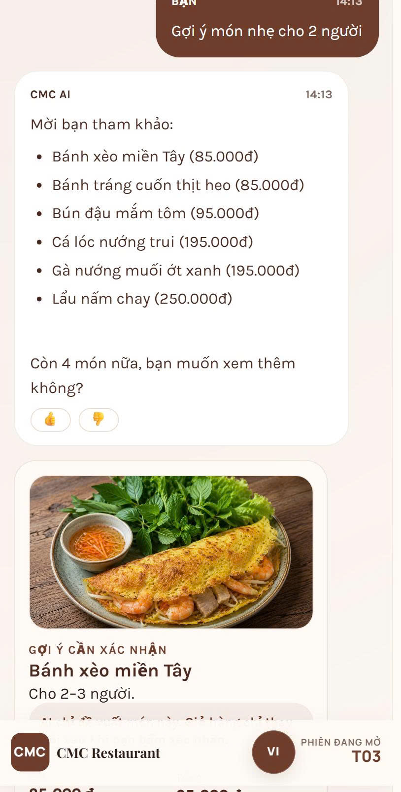<br />
      <strong>Hình 5.2 — Câu hỏi mở, 14:13</strong><br />
      <sub>"Gợi ý món nhẹ cho 2 người" — sáu món kèm giá, bên dưới là thẻ món ghi rõ <em>gợi ý cần xác nhận</em></sub>
    </td>
    <td width="50%" align="center" valign="top">
      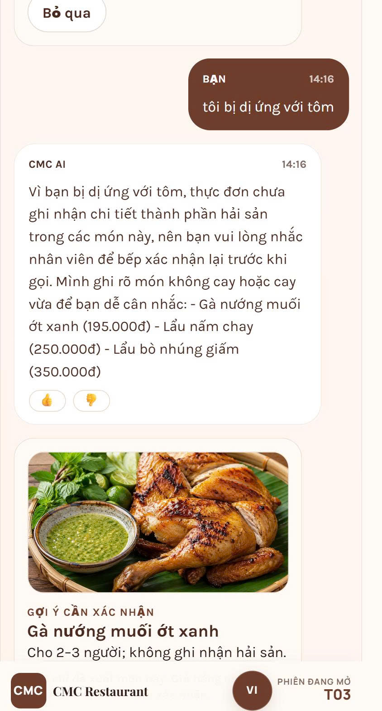<br />
      <strong>Hình 5.3 — Sau khi nêu dị ứng, 14:16</strong><br />
      <sub>"tôi bị dị ứng với tôm" — danh sách thu còn ba món, kèm khuyến cáo hỏi lại bếp</sub>
    </td>
  </tr>
</table>

Điểm cần đọc kỹ ở Hình 5.3 nằm ở chỗ **món nào biến mất**. Bốn trong sáu món của câu trả lời trước
— bánh xèo miền Tây, bánh tráng cuốn thịt heo, bún đậu mắm tôm, cá lóc nướng trui — không còn xuất
hiện. Hai món an toàn được giữ lại, và một món mới được bổ sung từ phần thực đơn còn lại. Đây không
phải mô hình *nói khác đi cho hợp ngữ cảnh*: tập món đã bị **mã tất định lọc lại** theo nhãn dị
nguyên trước khi mô hình được phép viết câu, đúng như phân vai mô tả ở mục
[2.4](#24-thiết-kế-và-lập-trình-phần-ai).

Câu trả lời còn làm một việc mà nhóm cho là quan trọng hơn cả việc lọc đúng: **nó tự nhận phần mình
không biết.** Trợ lý nói thẳng rằng thực đơn *chưa ghi nhận chi tiết thành phần hải sản* cho những
món này và đề nghị khách nhắc nhân viên xác nhận với bếp; thẻ món bên dưới cũng ghi rõ *"không ghi
nhận hải sản"* thay vì khẳng định *"không chứa hải sản"*. Khoảng cách giữa hai cách nói ấy chính là
hạn chế số 7 ở mục [5.3](#53-hạn-chế) — nhãn dị nguyên mới phủ 44/91 món — và giao diện hiển thị
rõ giới hạn này cho khách. Đó là biểu hiện cụ thể của nguyên tắc
fail-closed: khi dữ liệu không đủ để bảo đảm an toàn, hệ thống **thu hẹp và cảnh báo**, chứ không
đoán.

Chi tiết thứ ba đáng chú ý nằm ở thẻ món phía dưới mỗi câu trả lời, nơi ghi *"gợi ý cần xác nhận"*
kèm dòng giải thích rằng giỏ hàng chỉ thay đổi khi khách tự bấm. Đây là ranh giới quyền hạn ở mục
[2.4.1](#241-nguyên-tắc-trung-tâm-mô-hình-hiểu-và-viết-nhưng-không-chọn) được hiện ra thành giao
diện: **trợ lý không có quyền ghi vào giỏ hàng**, nó chỉ đề xuất. Một hệ thống cho phép mô hình tự
thêm món có thể giảm một thao tác cho khách nhưng cũng làm tăng rủi ro biến một gợi ý sai thành
thay đổi thật trong giỏ hàng.

#### Bảng bếp và quầy thu ngân — phía sau cùng một phiên bàn


*Hình 5.4 — Bảng bếp thời gian thực. Bốn cột ứng với bốn trạng thái của vòng đời đơn: đơn mới (2), đang nấu (1), sẵn sàng (1), đã phục vụ (14) — tổng 35 món trong luồng. Dải thông báo phía trên là sự kiện SignalR vừa đẩy về ("ORD-1029: đã bắt đầu nấu 2 món"): bếp không phải bấm tải lại, và cùng sự kiện đó cũng đẩy tới màn hình khách. Đồng hồ trên mỗi thẻ đếm từ lúc đơn được tạo, nên các đơn thử nghiệm tồn từ những ngày trước hiển thị số giờ lớn; đơn thật vừa tạo là ORD-1031 với 7 phút.*


*Hình 5.5 — Quầy thu ngân. Thẻ "Phiên 2 lượt gọi" của bàn T03 là minh chứng trực tiếp cho khái niệm **hóa đơn phiên bàn**: khách gọi làm hai lần trong cùng một lượt ngồi, hệ thống gộp lại thành một hóa đơn 120.000đ thay vì hai hóa đơn rời. Phương thức VietQR đang ở trạng thái chờ thu và chỉ chuyển sang đã thu khi nhân viên bấm xác nhận — bước thủ công này là hạn chế số 3 ở mục [5.3](#53-hạn-chế), không phải thiếu sót bị bỏ quên.*

Ba màn hình trên không chỉ là ảnh minh họa: chúng là ba lát cắt của **cùng một dòng dữ liệu**. Phiên
bàn do khách mở bằng QR sinh ra đơn; đơn hiện trên bảng bếp và đổi trạng thái theo thao tác của bếp;
trạng thái ấy đẩy ngược về màn hình khách qua SignalR; và khi phiên đóng, mọi lượt gọi của phiên gộp
thành một hóa đơn ở quầy. Không có bước nào trong chuỗi này đi qua email, giấy viết tay hay lời gọi
nhau — đúng vấn đề mà mục [1.1](#11-lý-do-chọn-đề-tài) đặt ra ở đầu báo cáo.

### 5.1.2. Kịch bản minh họa đầu-cuối

Chuỗi dưới đây được **tự động hóa trong job CI `golden-e2e`** trên toàn bộ stack:

```text
1. Khách quét QR bàn T07
   → POST /api/tables/scan          → mở/tái sử dụng phiên bàn, trả capability token
2. Khách mở tab trợ lý
   → POST /api/chat/sessions        → tạo phiên chat gắn với phiên bàn
3. Khách: "mình dị ứng hải sản, cho món cay vừa dưới 150k"
   → POST /api/chat/.../messages    → backend .NET
     → POST /v1/chat                → dịch vụ AI
       → hiểu câu → ràng buộc {avoid: allergen:seafood, spice: medium, price: <150k}
       → lọc thực đơn theo nhãn (tất định)
       → mô hình viết câu trả lời trên tập đã chốt
       → hàng rào: mọi tên món và số tiền phải có trong tập  (đạt)
   → Khách nhận 3 gợi ý + thẻ món
4. Khách bấm thêm món vào giỏ
   → POST /api/cart/items           → giỏ lưu phía máy chủ (AI không có quyền này)
5. Khách gửi bếp
   → POST /api/orders               → lượt đơn #1 của phiên
   → SignalR đẩy order.created      → bảng bếp và màn hình khách cập nhật
6. Khách gọi thêm → lượt đơn #2 trong cùng phiên bàn
7. Tất toán
   → POST /api/table-invoices       → gộp cả 2 lượt, áp khuyến mãi, sinh mã VietQR
   → Quầy xác nhận thủ công         → phiên bàn đóng, bàn về trạng thái trống
```

**Kết quả đo: 103/103 lượt đạt trên 29 hội thoại**, ở cả hai chế độ (có và không có đường sinh).

## 5.2. Đánh giá kết quả đạt được

### 5.2.1. Quy mô sản phẩm

Số dòng mã không phải thước đo trực tiếp của chất lượng. Bảng dưới chỉ mô tả quy mô và sự phân bố
của hiện vật phần mềm giữa các thành phần, qua đó cung cấp bối cảnh cho chiến lược phân công,
quản lý cấu hình và kiểm thử.

| Thành phần | Tệp | Dòng mã |
|---|---|---|
| Backend API | 118 | 50.023 |
| Backend tests | 25 | 3.823 |
| Frontend (trang & component dùng chung) | 152 | 15.420 |
| Frontend (entry point 5 app + packages) | 18 | 2.957 |
| Dịch vụ AI | 29 | 13.532 |
| Bộ đánh giá AI | 26 | 7.528 |
| Script sinh dữ liệu AI | 9 | 4.127 |
| **Tổng** | **377** | **~97.400** |

Cộng thêm: **24 bảng cơ sở dữ liệu**, **22 migration**, **84 endpoint**, **9 workflow GitHub Actions**, **91 món / 13 danh mục / 85 nhãn**, **108 tài liệu tri thức / 449 đoạn**.

### 5.2.2. Chất lượng đo được

Các số liệu trong bảng đều chỉ tới tệp kết quả hoặc lệnh đo cụ thể tại
[Phụ lục](#7-phụ-lục--cách-kiểm-chứng-các-số-liệu-chính). Cột **Nguồn** được bổ sung vì trong quá
trình thực hiện đã có ba số liệu mô tả được ghi trước khi đo và sau đó phải điều chỉnh. Việc lưu
nguồn cho từng kết quả giúp phân biệt dữ liệu đo được với nhận định của nhóm.

| Phép đo | Kết quả | Nguồn |
|---|---|---|
| Golden E2E qua stack thật | **103/103 lượt** · 29 hội thoại | [Kết quả Golden E2E](../../ai/evaluation/measurements/golden_e2e.json) |
| An toàn dị ứng (fail-closed) | **Không ghi nhận lỗi** trên 140 ca + 87 lượt phiên + 8 ca chọn món, trong phạm vi dữ liệu nhãn hiện có | [Bộ chạy đánh giá nền](../../ai/evaluation/run_baseline.py) với tùy chọn `--all` |
| Trả lời chỉ bằng tra thực đơn (phân vùng từng được thiết kế niêm phong; hiện dùng cho hồi quy) | **23/27 — 85,2 %** | [Kết quả trả lời không dùng mô hình](../../ai/docs/04-answers-without-a-model.md) |
| Chọn món bằng lọc nhãn | **8/8** (RAG: 1–2/8) | [Phân tích lỗi và kết quả chọn món](../../ai/docs/07-error-analysis.md) |
| Truy hồi tri thức, phân vùng từng được thiết kế niêm phong (top-1; hiện dùng cho hồi quy) | BM25 0,750 · **embedding 0,864** · hybrid 0,886 | [Kết quả truy hồi niêm phong](../../ai/evaluation/measurements/chon_muc_niem_phong.json) |
| Test backend | **84/84 đạt**, 0 trượt, 0 bỏ qua | [Dự án kiểm thử backend](../../backend/tests/RestaurantQrAiOrdering.Api.Tests/RestaurantQrAiOrdering.Api.Tests.csproj) |
| Đường sinh không làm giảm kết quả ca nào | **76/76**, 68 câu sinh dùng được, 8 chuyển sang khuôn mẫu | [Kết quả LLM/RAG loại C](../../ai/evaluation/measurements/llm_rag_loai_c.json) |
| Độ trễ trợ lý | p50 **8,6 s** · p95 **13,5 s** | [Cùng tệp kết quả LLM/RAG loại C](../../ai/evaluation/measurements/llm_rag_loai_c.json) |
| Khởi động dịch vụ AI | 97,3 s → **19,0 s** | [Quy trình đo tại bước 8](../../ai/README.md) |
| Kích thước ảnh AI | 9,29 GB → **2,74 GB** | [Cùng quy trình đo tại bước 8](../../ai/README.md) |
| Test frontend | **118/118** | [Cấu hình và lệnh kiểm thử frontend](../../frontend/package.json) |
| Test AI (mã + thước đo) | **386 + 128 đạt** (3 + 1 bỏ qua) | [Kiểm thử mã AI](../../ai/app) · [kiểm thử thước đo](../../ai/evaluation) |

**Môi trường đo.** Toàn bộ số liệu trong bảng chốt tại tag
[`v0.3.0`](https://github.com/Anpham120/restaurant-qr-ai-ordering/releases/tag/v0.3.0), đo ngày
02/08/2026 trên Windows 11 với .NET SDK 10.0, Node.js 22 và Python 3.12; phần đo AI chạy trong
container Linux của `deploy/docker-compose.yml`. Tại mốc chốt, nhóm chưa thiết lập cách thu thập
độ phủ nhất quán cho cả frontend, backend và AI, nên báo cáo không đưa ra số coverage. Tổng số test
và số ca đạt không được diễn giải thay cho độ phủ mã nguồn.

> **Cảnh báo về tập niêm phong — cần đọc trước khi diễn giải hai dòng có chữ "niêm phong".**
>
> Tập niêm phong được lập để làm tập giữ riêng (*held-out*), tức chỉ mở một lần sau khi hệ thống đã
> chốt, nhằm ước lượng khách quan khả năng khái quát. Trên thực tế nhóm đã **mở tập này hai lần**:
> ngày 30/07/2026 trên kho 303 đoạn, và ngày 31/07/2026 trên kho 425 đoạn sau khi bổ sung tài liệu.
> Trạng thái ấy được ghi lại trong
> [`ai/evaluation/retrieval_split.json`](../../ai/evaluation/retrieval_split.json) ở trường
> `sealed_opened`.
>
> Hệ quả về phương pháp: **kể từ lần mở thứ nhất, tập này không còn là held-out.** Các con số đo
> trên nó sau thời điểm đó chỉ có giá trị **hồi quy** — xác nhận hệ thống không tụt so với chính
> nó — chứ không còn là ước lượng độc lập về khả năng khái quát sang dữ liệu chưa từng thấy.
>
> Nhóm giữ nguyên các con số thay vì bỏ đi, nhưng ghi rõ giới hạn này để người đọc không diễn giải
> chúng mạnh hơn mức bằng chứng cho phép. Muốn có ước lượng độc lập thật sự thì phải lập một tập
> mới và **chưa từng mở**, việc này ghi trong hướng phát triển ở mục
> [5.4](#54-hướng-phát-triển).

### 5.2.3. Đối chiếu với rubric học phần

Bảng dưới đây đóng vai trò **chỉ mục minh chứng** theo từng yêu cầu của rubric. Bảng không tự kết
luận dự án đạt mức điểm nào; quyết định đánh giá thuộc về giảng viên sau khi kiểm tra hiện vật và
vấn đáp.

| Tiêu chí rubric | Yêu cầu ở mức Giỏi | Vị trí / minh chứng | Trạng thái và giới hạn |
|---|---|---|---|
| Hình thức báo cáo — 10 % | Đúng cấu trúc, rõ ràng, không lỗi chính tả | Bìa, tóm tắt, mục lục, danh mục viết tắt, đánh số chương, chú thích hình, tài liệu tham khảo và phụ lục tái lập | Đã kiểm tra liên kết và cấu trúc Markdown; định dạng trang cuối cùng còn phụ thuộc công cụ xuất bản |
| GitHub — Issues/Milestones | Issue có nhãn, phân công; milestone đầy đủ | §3.1.1–3.1.2; ảnh Hình 3.1–3.2; 46 issue, 42 có milestone, 44 có assignee | Bốn issue không có milestone và hai issue không có assignee đã được nêu rõ |
| GitHub — Commits | Commit đều, thông điệp rõ | §3.1.3; Hình 3.3; 872 commit tại `v0.3.0` | Hoạt động trải theo các tuần; bảng đóng góp tách commit tác giả khỏi merge commit |
| GitHub — Pull request / review | Có PR và code review | §2.5.5, §3.1.3; 377 PR tại mốc chốt; CodeQL/Copilot; [PR #426](https://github.com/Anpham120/restaurant-qr-ai-ordering/pull/426) có 4 `APPROVED` trước merge | Đã có bằng chứng human peer review trước merge ở cuối kỳ; không suy diễn cho toàn bộ lịch sử PR |
| GitHub — Release/README/CI | Release gắn tag; README đầy đủ; có kiểm thử | §3.1.4–3.1.6; ba release; chín workflow; năm status check bắt buộc | Ruleset chỉ được bật ở giai đoạn cuối |
| Phân tích nhu cầu | Product Vision, persona, scenario, user story, backlog, acceptance criteria | §1.2; §2.1.2–2.1.5; 3 persona, 3 scenario, 9 story và backlog 9 epic | Persona dựa trên khảo sát nhỏ; hai vai trò được suy luận gián tiếp |
| Yêu cầu sản phẩm | Mục tiêu và phạm vi chức năng, phi chức năng rõ | §1.3; §2.2; 13 FR, 10 NFR có cách kiểm chứng | Một số NFR chưa có phép đo tải, coverage và a11y |
| Kiến trúc và công nghệ | Giải thích cloud, microservices/REST và ưu nhược điểm | §2.3.1–2.3.5; §4.3–4.5; sơ đồ, ADR và bảng so sánh | Modular monolith và tách AI được giải thích theo quy mô; không khẳng định khả năng mở rộng chưa đo |
| Kiểm thử và QA | Có kiểm thử, đánh giá chất lượng và báo cáo kiểm thử | §2.5.1–2.5.4; §5.2.2; ma trận truy vết US–FR/NFR–test | Có kết quả nhiều tầng; chưa có coverage thống nhất và kiểm thử tải |
| Nội dung / MVP — 30 % | MVP chạy, demo được | §5.1; ảnh giao diện và kịch bản đầu cuối; các tên miền triển khai | Dữ liệu thực đơn là dữ liệu mẫu; chưa có thử nghiệm vận hành dài hạn |
| Liên hệ Sommerville | Lý thuyết → áp dụng → minh chứng → phản biện | §4.1–4.11, ghi rõ chương sách và liên kết issue/PR/release | Có cả quyết định áp dụng, không áp dụng và thay đổi quyết định sau phép đo |
| Nhật ký AI | AI gợi ý → nhóm kiểm chứng/sửa/loại bỏ → nhóm tự quyết | §3.2.1; năm trường hợp có kết quả và PR/tệp minh chứng | Chỉ ghi các trường hợp có thể truy vết; không dùng nhật ký mẫu |
| Vấn đáp — 20 % | Giải thích quyết định kỹ thuật và đóng góp cá nhân | §3.3; bảng công việc, issue, PR và commit theo từng thành viên; [bộ câu hỏi chuẩn bị theo CLO](CHUAN_BI_VAN_DAP.md) | Điểm phụ thuộc câu trả lời trực tiếp; báo cáo không thể thay thế phần bảo vệ |

### 5.2.4. Đối chiếu với mục tiêu đề tài

Bảng sau đối chiếu năm mục tiêu đã nêu tại mục [1.3](#13-mục-tiêu-và-phạm-vi) với kết quả có thể
kiểm chứng tại thời điểm chốt báo cáo. Mức “đạt” trong bảng chỉ áp dụng cho phạm vi MVP, không được
hiểu là sản phẩm đã được xác nhận hiệu quả trong vận hành thương mại.

| Mục tiêu | Mức độ đáp ứng | Cơ sở đánh giá | Giới hạn còn lại |
|---|---|---|---|
| Phân tích nhu cầu và mô hình hóa nghiệp vụ | Đạt ở mức MVP | Persona, kịch bản, user story, FR/NFR và ma trận truy vết tại §2.1–2.2 | Mẫu khảo sát nhỏ; chưa phỏng vấn trực tiếp khách và bếp |
| Duy trì trạng thái nhất quán cho phiên bàn, đơn hàng và thanh toán | Đạt về thiết kế và kiểm thử hiện có | Máy trạng thái, bất biến cơ sở dữ liệu và transaction tại §2.3.3–2.3.4; kiểm thử backend tại §5.2.2 | Chưa kiểm thử tải và cạnh tranh ở quy mô vận hành thực tế |
| Cung cấp giao diện theo vai trò và cập nhật gần thời gian thực | Đạt ở mức MVP | Luồng khách, bếp, quầy và quản trị tại §5.1; cập nhật SignalR trong kiến trúc §2.3 | Chưa có nghiên cứu khả dụng hoặc kiểm thử khả năng tiếp cận |
| Tích hợp trợ lý AI có ràng buộc về món, giá và dị nguyên | Đạt trong phạm vi bộ dữ liệu đã công bố | Kiến trúc lọc tất định và hàng rào tại §2.4; các phép đo tại §5.2.2 | Nhãn dị nguyên chưa phủ toàn bộ thực đơn và chưa được bếp xác nhận |
| Thiết lập kiểm thử, CI và môi trường triển khai | Đạt ở mức kỹ thuật | Các bộ kiểm thử, workflow, ruleset và môi trường VPS tại §2.5, §3.1.5 và §5.2.2 | Chưa có báo cáo coverage thống nhất, kiểm thử tải và quan sát vận hành đầy đủ |

## 5.3. Hạn chế

Một báo cáo chỉ trình bày kết quả thuận lợi sẽ không cung cấp đủ cơ sở để đánh giá độ tin cậy của
toàn bộ dự án. Vì vậy, nhóm trình bày chín hạn chế dưới
đây, kèm **lý do vì sao chưa làm** và **hệ quả thực tế** của mỗi hạn chế.

Phần lớn hạn chế là kết quả của các quyết định ưu tiên trong phạm vi chín tuần và năm thành viên:
nhóm tập trung kiểm chứng các chức năng đã triển khai trước khi mở rộng thêm phạm vi.

| # | Hạn chế | Vì sao chưa làm | Ảnh hưởng |
|---|---|---|---|
| 1 | **Chưa kiểm thử tải.** Độ trễ p50 8,6 s và p95 13,5 s đo trên một máy, chưa có nhiều người dùng đồng thời | Cần môi trường và công cụ đo tải; ưu tiên thấp hơn đúng đắn chức năng | Chưa biết hệ thống chịu được bao nhiêu bàn cùng lúc |
| 2 | **Chưa có đánh giá của con người cho chất lượng câu trả lời.** Các kết quả chất lượng câu trả lời hiện dựa trên chấm điểm tự động | Cần ≥50 câu chấm tay, ≥20 % chấm đôi để tính độ đồng thuận | Chấm tự động đo *đúng/sai theo dữ liệu*, không đo đầy đủ mức tự nhiên của câu |
| 3 | **VietQR chưa tự động đối soát** — quầy xác nhận thủ công | Cần hợp đồng và webhook với ngân hàng | Có rủi ro thao tác người ở bước xác nhận tiền |
| 4 | **Chưa có báo cáo độ phủ mã nguồn, kiểm thử khả năng tiếp cận (a11y) và ngân sách hiệu năng frontend** | Chưa thiết lập công cụ và ngưỡng thống nhất cho ba stack trong mốc chốt | Chưa định lượng được phần mã chưa được kiểm thử; trải nghiệm với trình đọc màn hình và giới hạn hiệu năng frontend chưa được xác minh |
| 5 | **Độ trễ trợ lý còn cao** (p95 13,5 s) | Phần lớn là thời gian gọi mô hình qua gateway | Khách phải chờ; chấp nhận được nhưng chưa tốt |
| 6 | **Ảnh Docker AI 2,74 GB** | Đánh đổi để có embedding chất lượng cao | Deploy chậm, tốn băng thông |
| 7 | **Nhãn dị nguyên mới phủ 44/91 món**, và bảng nhãn **chưa được bếp xác nhận** | Cần audit thủ công phần còn lại, và cần người có chuyên môn về nguyên liệu đối chiếu | Cơ chế fail-closed khiến món thiếu nhãn bị loại khỏi gợi ý, nên rủi ro nghiêng về phía thu hẹp gợi ý chứ không phải gợi ý sai. Tuy nhiên **điều này không đủ để kết luận hệ thống an toàn về mặt y tế** — xem ghi chú bên dưới |
| 8 | **Branch ruleset chỉ mới bật ở giai đoạn cuối** | Cần quyền admin repository, thu xếp được muộn | 377 pull request trước đó qua CI nhờ kỷ luật của nhóm chứ chưa nhờ cơ chế bắt buộc; ruleset chỉ bảo đảm cho các thay đổi sau thời điểm kích hoạt — xem mục [3.1.5](#315-branch-ruleset--biến-ci-từ-thói-quen-thành-cổng-chặn) |
| 9 | **Human peer review mới được thiết lập ở giai đoạn cuối** | [PR #426](https://github.com/Anpham120/restaurant-qr-ai-ordering/pull/426) có bốn `APPROVED` trước merge, nhưng 377 PR tại mốc `v0.3.0` chủ yếu dựa vào tự kiểm tra, CI, CodeQL và Copilot | Đáp ứng được bằng chứng review người cho quy trình bổ sung, nhưng không chứng minh toàn bộ lịch sử thay đổi đã được thành viên phản biện |

> **Phạm vi của kết luận an toàn.** Các con số về dị nguyên trong báo cáo có nghĩa chính xác là:
> *không ghi nhận lỗi trên tập ca đã công bố, với bảng nhãn hiện tại*. Chúng **không** chứng minh
> hệ thống an toàn về mặt y tế trong vận hành thật, vì ba lý do: bảng nhãn mới phủ 44/91 món, bảng
> nhãn chưa được đối chiếu với bếp và nhà cung cấp nguyên liệu, và một tập ca hữu hạn không bao giờ
> chứng minh được tính chất phổ quát. Trước khi phục vụ khách thật, bảng nhãn phải được người có
> chuyên môn xác nhận, và giao diện phải nêu rõ trợ lý chỉ mang tính tham khảo.

## 5.4. Hướng phát triển

Các hướng dưới đây được sắp theo thứ tự **tỉ lệ giữa giá trị thu được và công sức bỏ ra**, không
phải theo mức độ hấp dẫn về mặt kỹ thuật. Bảy việc ngắn hạn đều nhằm biến những hạn chế ở mục 5.3
từ chỗ *đã biết nhưng chưa xử lý* thành chỗ *đã đo và đã đóng*, bởi đó là cách rẻ nhất để nâng độ
tin cậy của toàn hệ thống.

**Ngắn hạn (1–2 tháng)**

1. Hoàn tất rà soát nhãn dị nguyên cho 47 món còn lại, và **đưa bảng nhãn cho bếp xác nhận** trước
   khi coi bất kỳ kết luận an toàn nào là dùng được trong vận hành thật.
2. Lập một **tập niêm phong mới, chưa từng mở**, để có lại ước lượng độc lập về khả năng khái quát
   — điều mà tập niêm phong hiện tại không còn cung cấp được sau hai lần mở.
3. Kiểm chứng lại ba persona bằng **phỏng vấn bán cấu trúc**, bao gồm cả bếp trưởng và khách hàng,
   là hai nhóm chưa được tiếp cận trực tiếp ở giai đoạn phân tích.
4. Thực hiện đánh giá bởi con người trên 50–100 câu, ≥20 % chấm đôi, báo cáo độ đồng thuận.
5. Kiểm thử tải trên staging, xác định trần số bàn đồng thời.
6. Thiết lập báo cáo độ phủ cho frontend, backend và AI; công bố riêng phạm vi loại trừ và đặt
   ngưỡng tối thiểu theo module thay vì chỉ đưa một tỷ lệ tổng.
7. Duy trì quy trình human peer review đã áp dụng tại
   [PR #426](https://github.com/Anpham120/restaurant-qr-ai-ordering/pull/426) cho các thay đổi sau
   mốc báo cáo: tác giả không tự phê duyệt; reviewer ghi nhận nhận xét cụ thể hoặc trạng thái
   `APPROVED`; PR mô tả cách nhận xét đã được xử lý.
8. Đưa các kiểm tra an ninh — `codeql`, `secret-scan`, `trivy-fs`, `dependency-review` — vào danh
   sách status check bắt buộc của ruleset. Hiện chúng có chạy trên mọi pull request nhưng **chưa
   chặn merge**, nên một cảnh báo bảo mật vẫn có thể bị bỏ qua nếu người review không để ý.

**Trung hạn (3–6 tháng)**

9. Giảm p95 xuống dưới 8 s: cache câu hỏi lặp, rút ngắn prompt, cân nhắc mô hình nhỏ hơn cho bước *hiểu*.
10. Tích hợp webhook ngân hàng cho VietQR để bỏ bước xác nhận thủ công.
11. Kiểm thử a11y và thiết lập ngân sách hiệu năng cho ứng dụng khách.
12. Bổ sung khả năng quan sát: log tập trung, tracing và cảnh báo khi tỷ lệ fallback tăng bất thường.

**Dài hạn**

13. Nhiều chi nhánh (multi-tenant) — hiện thiết kế là single-tenant.
14. Học từ phản hồi khách để cải thiện kho tri thức, có vòng kiểm duyệt của người.
15. Ứng dụng di động cho nhân viên phục vụ nếu vận hành thực tế cho thấy cần.

## 5.5. Kết luận

Đề tài đã hoàn thành một MVP cho quy trình phục vụ tại bàn, gồm luồng khách quét QR và gọi món,
luồng bếp cập nhật tiến độ, luồng quầy tổng hợp hóa đơn và thành phần AI hỗ trợ tư vấn thực đơn.
Kết quả quan trọng của dự án không chỉ là các chức năng đã triển khai mà còn là khả năng truy vết
từ nhu cầu người dùng tới thiết kế, mã nguồn, kiểm thử và hiện vật GitHub.

Trong phạm vi dữ liệu đã công bố, các luồng lõi hoạt động trên môi trường triển khai và đạt kết quả
kiểm thử nêu tại mục 5.2.2. Tuy nhiên, báo cáo chưa có cơ sở kết luận về hiệu quả vận hành thương
mại, khả năng chịu tải hay an toàn y tế. Các kết luận đó đòi hỏi dữ liệu dị nguyên hoàn chỉnh, đánh
giá người dùng, kiểm thử tải và thử nghiệm thực địa. Human peer review đã được bổ sung ở PR #426;
quy trình này cần tiếp tục được duy trì cho các thay đổi sau mốc báo cáo.

---

# 6. Tài liệu tham khảo

## 6.1. Sách và bài báo

[[1]](https://www.pearson.com/en-gb/subject-catalog/p/engineering-software-products-an-introduction-to-modern-software-engineering-global-edition/P200000000587/9781292476308)
I. Sommerville, *Engineering Software Products: An Introduction to Modern Software
Engineering*. Pearson Education, 2020.

[[2]](https://www.mheducation.com/highered/product/Software-Engineering-A-Practitioners-Approach-Pressman.html)
R. S. Pressman and B. R. Maxim, *Software Engineering: A Practitioner's Approach*, 9th ed.
McGraw-Hill, 2020.

[[3]](https://arxiv.org/abs/2005.11401)
P. Lewis et al., “Retrieval-Augmented Generation for Knowledge-Intensive NLP Tasks,”
*Advances in Neural Information Processing Systems*, 2020.

[[4]](https://arxiv.org/abs/2212.03533)
L. Wang et al., “Text Embeddings by Weakly-Supervised Contrastive Pre-training,” 2024.

[[5]](https://doi.org/10.1561/1500000019)
S. Robertson and H. Zaragoza, “The Probabilistic Relevance Framework: BM25 and Beyond,”
*Foundations and Trends in Information Retrieval*, vol. 3, no. 4, 2009.

## 6.2. Tài liệu công nghệ

[[6]](https://learn.microsoft.com/aspnet/core)
Microsoft, *ASP.NET Core documentation*.

[[7]](https://learn.microsoft.com/ef/core)
Microsoft, *Entity Framework Core documentation*.

[[8]](https://learn.microsoft.com/aspnet/core/signalr)
Microsoft, *ASP.NET Core SignalR documentation*.

[[9]](https://react.dev)
Meta, *React documentation*.

[[10]](https://fastapi.tiangolo.com)
S. Ramírez, *FastAPI documentation*.

[[11]](https://www.postgresql.org/docs/16/)
The PostgreSQL Global Development Group, *PostgreSQL 16 Documentation*.

## 6.3. Tài liệu và mã nguồn của dự án

[[12]](https://github.com/Anpham120/restaurant-qr-ai-ordering/tree/v0.3.0)
Nhóm 5 sinh viên, *CMC Restaurant — QR AI Ordering*, mã nguồn tại tag `v0.3.0`, 2026.

[[13]](https://github.com/Anpham120/restaurant-qr-ai-ordering/blob/develop/docs/SYSTEM_ANALYSIS_DESIGN.md)
*Phân tích và thiết kế hệ thống* — tài liệu hợp nhất lập ở giai đoạn phân tích và thiết kế.

[[14]](https://github.com/Anpham120/restaurant-qr-ai-ordering/blob/develop/docs/API_CONTRACT.md)
*Hợp đồng API*.

[[15]](https://github.com/Anpham120/restaurant-qr-ai-ordering/blob/develop/docs/ai/AI_PRODUCTION_OPERATIONS.md)
*Vận hành dịch vụ AI tư vấn đặt món*.

[[16]](https://github.com/Anpham120/restaurant-qr-ai-ordering/blob/develop/ai/README.md)
*Tám bước dựng lại phần AI, mỗi bước kèm phép đo*.

[[17]](https://github.com/Anpham120/restaurant-qr-ai-ordering/blob/develop/docs/README.md)
*Điểm vào toàn bộ tài liệu dự án*.

---

# 7. Phụ lục — cách kiểm chứng các số liệu chính

Chạy từ thư mục gốc repository.

```powershell
# --- Quy mô và cấu trúc ---
git rev-list --count v0.3.0                       # 872 commit tại mốc chốt
gh pr list --state all --limit 1000 --json number,state,author
# → 377 PR: 305 MERGED, 71 CLOSED không merge, 1 OPEN (#420)
gh issue list --state all --limit 200 --json number,milestone,assignees
# → 46 issue: 42 có milestone; 44 có assignee
# → ngoài milestone: #81, #82, #242, #249; không có assignee: #81, #82

# Commit tác giả, bỏ merge commit; hợp nhất các tên Git của cùng người
git rev-list --count --no-merges --author='Anpham120\|Phạm Duy An\|Pham Duy An' v0.3.0 # 423
git rev-list --count --no-merges --author='buidaoducanh1210' v0.3.0                 # 18
git rev-list --count --no-merges --author='Quang Hieu\|Quang Hiếu\|quanghieu' v0.3.0 # 25
git rev-list --count --no-merges --author='Tanh2k8\|Tuấn Anh' v0.3.0                # 9
git rev-list --count --no-merges --author='Lê Anh\|totototo' v0.3.0                 # 9

# --- Branch ruleset (mục 3.1.5) ---
gh api repos/Anpham120/restaurant-qr-ai-ordering/rulesets
# → "CI/CD protected branches", target branch, enforcement "active"
gh api repos/Anpham120/restaurant-qr-ai-ordering/rulesets/17367867
# → conditions: refs/heads/main + refs/heads/develop
# → bypass_actors: []  (không ngoại lệ cho bất kỳ ai)
# → rules: pull_request, required_status_checks (5 job), non_fast_forward, deletion

# --- Kiểm thử ---
npm --prefix frontend test                        # 118 test / 36 tệp
npm --prefix frontend run build
dotnet test backend/RestaurantQrAiOrdering.sln --configuration Release

$env:PYTHONIOENCODING = "utf-8"                   # cần thiết trên Windows
python -m unittest discover -s ai/app -p "test_*.py"          # 386 test
python -m unittest discover -s ai/evaluation -p "test_*.py"   # 128 test

# --- Số đo chất lượng AI ---
python ai/evaluation/run_baseline.py --all        # an toàn dị ứng + tỷ lệ trả lời được
python ai/evaluation/run_ablation.py              # giá trị từng cơ chế
python ai/evaluation/probe_metric_holes.py        # bộ dò lỗ của chính thước đo

# --- Dữ liệu và tài liệu phải sinh lại khớp ---
python ai/scripts/build_tag_dictionary.py --check
python ai/scripts/build_knowledge.py --check
python ai/notebooks/build_teaching_notebook.py --check
python ai/docs/build_bao_cao_do_an.py --check

# --- Cấu hình triển khai ---
docker compose -f deploy/docker-compose.yml config
python ai/evaluation/verify_deploy_config.py --chi-bo-truy-hoi
```

Các tệp số đo AI thô nằm tại [`ai/evaluation/measurements/`](../../ai/evaluation/measurements/).
Mỗi tệp lưu phản hồi `/ready` tại thời điểm đo để các kết quả AI trong mục 5.2.2 có thể truy về
một lần chạy cụ thể.

---

<div align="center">
<sub>Báo cáo học phần Công nghệ phần mềm (INFO2005) — Trường Đại học CMC — 02/08/2026</sub>
</div>
