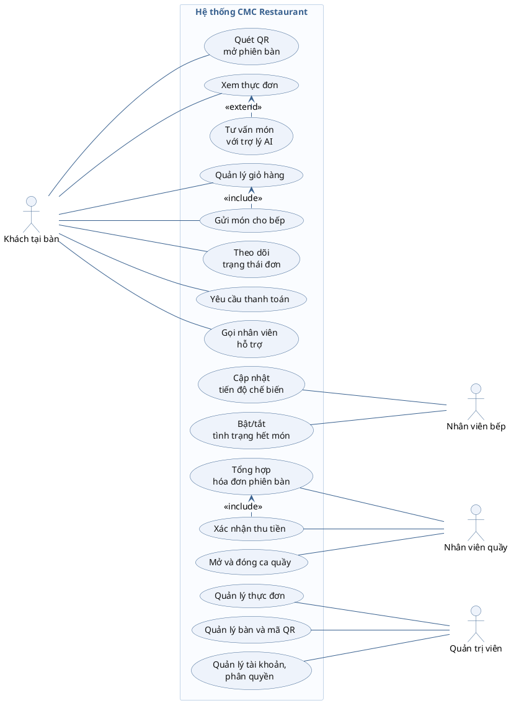
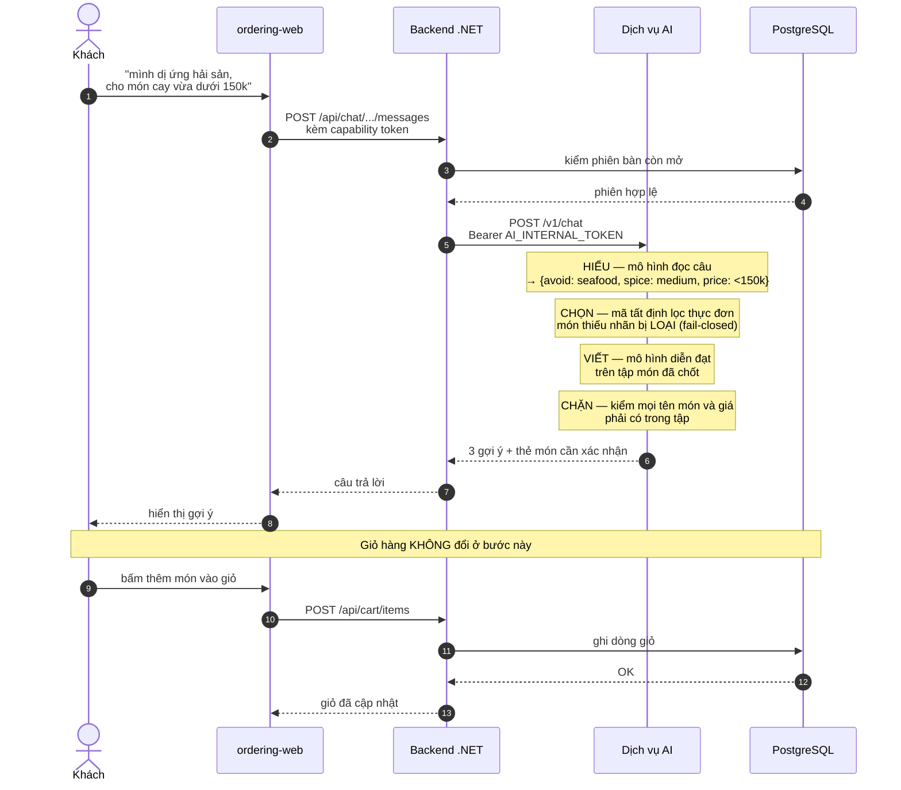
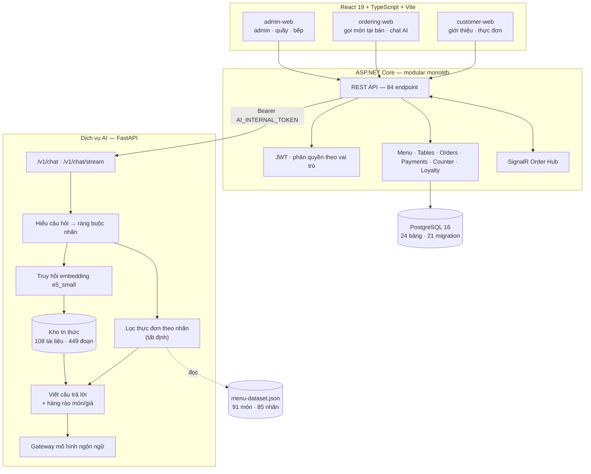
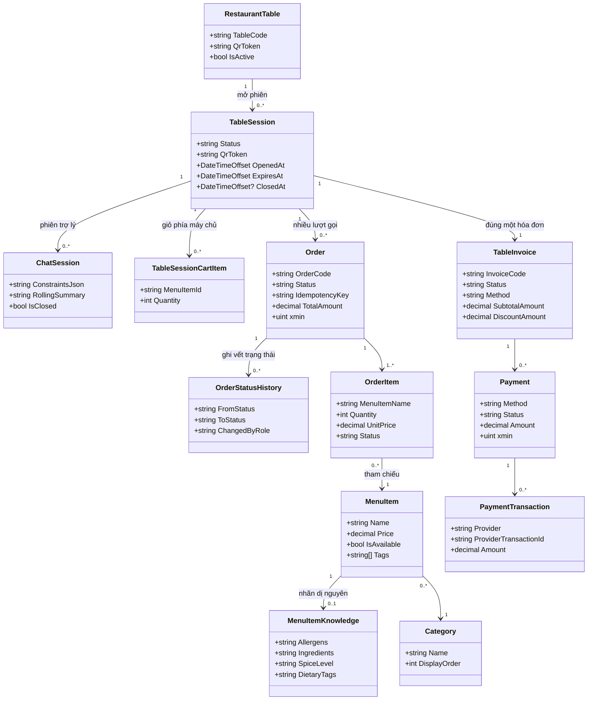
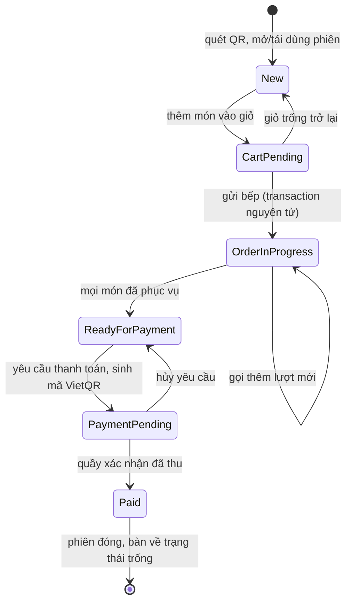
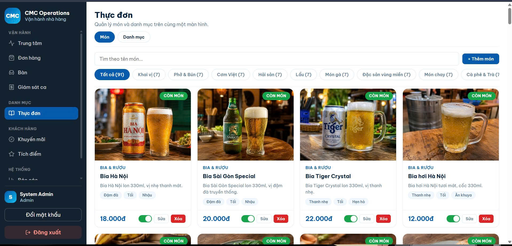
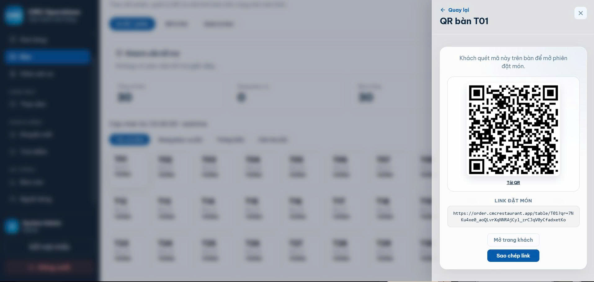
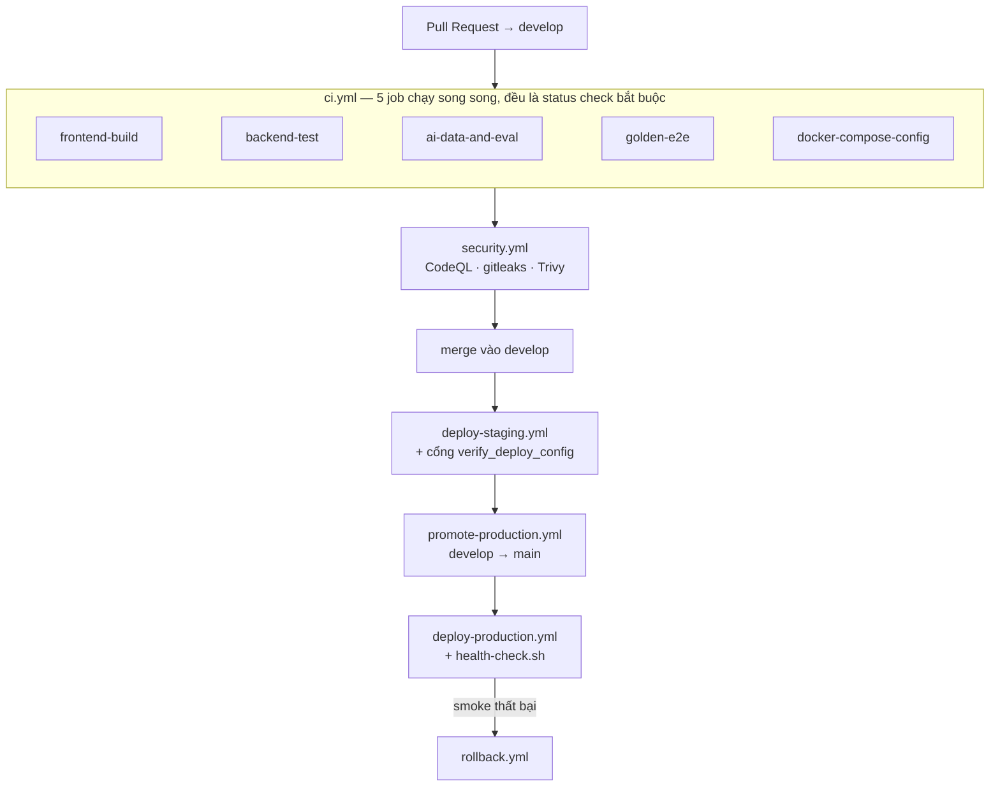

<div align="center">
  

# BÁO CÁO ĐỒ ÁN CHUYÊN NGÀNH
## Học phần: Đồ án chuyên ngành

**Trường Đại học CMC — Khoa Công nghệ thông tin & Truyền thông**

**Đề tài:** CMC Restaurant – Hệ thống quản lý nhà hàng, gọi món bằng QR
và tư vấn món ăn bằng AI

**Repository:** [github.com/Anpham120/restaurant-qr-ai-ordering](https://github.com/Anpham120/restaurant-qr-ai-ordering)

**Sản phẩm trực tuyến:** [cmcrestaurant.app](https://cmcrestaurant.app) · [order.cmcrestaurant.app](https://order.cmcrestaurant.app) · [admin.cmcrestaurant.app](https://admin.cmcrestaurant.app)

**Giảng viên hướng dẫn:** Ngô Việt Anh

**Thời gian thực hiện:** 04/06/2026 – 04/08/2026

</div>

---

## Tài nguyên kèm theo báo cáo

Báo cáo này đi kèm ba tài nguyên có thể kiểm chứng trực tiếp. Mọi phát biểu về chức năng
trong các chương sau đều đối chiếu được với một trong ba nguồn dưới đây.

| Tài nguyên | Địa chỉ |
|---|---|
| Video demo sản phẩm | [Thư mục Google Drive](https://drive.google.com/drive/folders/1VjuqJCl9fBzF6bf2OgoLc-A7bbgY_QW6?usp=drive_link) |
| Mã nguồn | [github.com/Anpham120/restaurant-qr-ai-ordering](https://github.com/Anpham120/restaurant-qr-ai-ordering) |
| Sản phẩm trực tuyến | [cmcrestaurant.app](https://cmcrestaurant.app) · [order.cmcrestaurant.app](https://order.cmcrestaurant.app) · [admin.cmcrestaurant.app](https://admin.cmcrestaurant.app) |

Video demo ghi lại luồng sử dụng thực tế của sản phẩm trên môi trường triển khai, dùng để
đối chiếu với phần mô tả chức năng ở chương 2 và kết quả kiểm thử ở chương 4.

## Danh mục bảng

| Số hiệu | Tên bảng | Mục |
|---|---|---|
| Bảng 1 | Ba tình huống lặp lại ghi nhận từ khảo sát | 1.1 |
| Bảng 2 | Ba persona của hệ thống | 1.2 |
| Bảng 3 | Đặc tả UC-01: Quét QR mở phiên bàn | 2.1.2 |
| Bảng 4 | Đặc tả UC-02: Gửi món cho bếp | 2.1.2 |
| Bảng 5 | Đặc tả UC-03: Tư vấn món với trợ lý AI | 2.1.2 |
| Bảng 6 | Yêu cầu chức năng | 2.2 |
| Bảng 7 | Yêu cầu phi chức năng và cách kiểm chứng | 2.3 |
| Bảng 8 | Trách nhiệm và giới hạn của từng tầng kiến trúc | 2.4.1 |
| Bảng 9 | So sánh modular monolith và microservices | 2.4.2 |
| Bảng 10 | Tiêu chí tách dịch vụ AI | 2.4.3 |
| Bảng 11 | Bất biến dữ liệu và cơ chế cưỡng chế | 2.5 |
| Bảng 12 | Sáu trạng thái tiếp tục của phiên bàn | 2.6 |
| Bảng 13 | Cấu trúc kho tri thức | 2.7.2 |
| Bảng 14 | So sánh ba phương pháp truy hồi (độ chính xác top-1) | 2.7.3 |
| Bảng 15 | So sánh fine-tune và RAG kết hợp lọc nhãn | 2.7.4 |
| Bảng 16 | Công nghệ sử dụng và lý do lựa chọn | 3.1 |
| Bảng 17 | Tám sự kiện thời gian thực | 3.2.3 |
| Bảng 18 | Năm job kiểm tra bắt buộc trong CI | 3.4 |
| Bảng 19 | Bốn tầng kiểm thử | 4.1 |
| Bảng 20 | Ma trận truy vết yêu cầu – kiểm thử (rút gọn) | 4.1 |
| Bảng 21 | Kết quả đo chất lượng | 4.2 |
| Bảng 22 | Đối chiếu kết quả với mục tiêu đề tài | 4.4 |
| Bảng 23 | Hạn chế của sản phẩm | Kết luận |

## Danh mục hình

| Số hiệu | Tên hình | Mục |
|---|---|---|
| Hình 1 | Biểu đồ use case tổng quát của hệ thống | 2.1.1 |
| Hình 2 | Sơ đồ tuần tự của use case tư vấn món và thêm món vào giỏ | 2.1.3 |
| Hình 3 | Kiến trúc tổng thể của hệ thống | 2.4.1 |
| Hình 4 | Sơ đồ lớp UML rút gọn của mô hình dữ liệu | 2.5 |
| Hình 5 | Máy trạng thái của phiên bàn | 2.6 |
| Hình 6 | Phân vai giữa mô hình ngôn ngữ và mã tất định | 2.7.1 |
| Hình 7 | Nhóm giao diện khách hàng và vận hành trên môi trường triển khai | 3.2 |
| Hình 8 | Điểm vào gọi món ở khung hiển thị điện thoại 414×896, tương ứng thiết bị khách dùng tại bàn | 3.2 |
| Hình 9 | Màn hình khách theo dõi trạng thái đơn của bàn, ở trạng thái `ReadyForPayment` | 3.2.1 |
| Hình 10 | Bảng bếp thời gian thực | 3.2.2 |
| Hình 11 | Quầy thu ngân | 3.2.2 |
| Hình 12 | Quản lý thực đơn | 3.2.4 |
| Hình 13 | Sinh mã QR theo bàn | 3.2.4 |
| Hình 14 | So sánh gợi ý AI trước và sau khi khách nêu dị ứng, trong cùng một phiên bàn | 3.3 |
| Hình 15 | Dòng chảy CI/CD từ pull request tới production | 3.4 |
| Hình 16 | Branch ruleset đang bật trên `main` và `develop` | 3.4 |

## Danh mục từ viết tắt

| Từ viết tắt | Thuật ngữ | Nghĩa sử dụng trong báo cáo |
|---|---|---|
| AI | Artificial Intelligence | Trí tuệ nhân tạo |
| API | Application Programming Interface | Giao diện lập trình ứng dụng |
| CI/CD | Continuous Integration / Continuous Delivery | Tích hợp và triển khai liên tục |
| E2E | End-to-End | Kiểm thử xuyên suốt một luồng nghiệp vụ |
| FR / NFR | Functional / Non-functional Requirement | Yêu cầu chức năng / phi chức năng |
| JWT | JSON Web Token | Chuẩn token dùng cho xác thực và phân quyền |
| LLM | Large Language Model | Mô hình ngôn ngữ lớn |
| MVP | Minimum Viable Product | Sản phẩm khả dụng tối thiểu |
| QR | Quick Response | Loại mã hai chiều dùng để nhận diện bàn |
| RAG | Retrieval-Augmented Generation | Sinh câu trả lời có tăng cường bằng truy hồi |
| SSE | Server-Sent Events | Cơ chế máy chủ đẩy sự kiện xuống trình duyệt |

> **Quy ước của báo cáo.** Mọi số liệu định lượng đều đo được và chốt tại tag
> [`v0.3.0`](https://github.com/Anpham120/restaurant-qr-ai-ordering/releases/tag/v0.3.0)
> ngày 02/08/2026. Những nội dung chưa hoàn thành được nêu rõ tại phần Kết luận.

## Bảng phân công công việc

Bảng dưới đây đặt ở phần đầu báo cáo để người đọc xác định ngay phạm vi phụ trách chính của
từng thành viên. Phân công được trình bày theo mô-đun và hiện vật có thể đối chiếu, không được
hiểu là mỗi người chỉ làm việc độc lập trong một khu vực; các hợp đồng giao tiếp, kiểm thử tích
hợp và pull request vẫn cần sự phối hợp giữa các mảng.

*Phân công công việc của các thành viên*

| Thành viên | Phân công chính | Kết quả và hiện vật phụ trách |
|---|---|---|
| Phạm Duy An<br>BIT240002<br>@Anpham120 | Nhóm trưởng; kiến trúc hệ thống; dịch vụ AI/RAG; DevOps; tích hợp và tài liệu | Kiến trúc modular monolith và ranh giới dịch vụ AI; hợp đồng API; bộ đánh giá AI; pipeline CI/CD, triển khai, rollback; tổng hợp báo cáo |
| Bùi Đào Đức Anh<br>BIT240025<br>@buidaoducanh1210 | Backend xác thực, phân quyền, bàn, mã QR, phiên bàn và thanh toán | JWT và khóa tài khoản; cơ chế mở/tiếp tục phiên bằng QR; capability token; thanh toán COD/VietQR; kiểm thử vòng đời phiên và thanh toán |
| Nguyễn Quang Hiếu<br>BIT240091<br>@quanghieu1605 | Backend cơ sở dữ liệu, thực đơn, đơn hàng và cập nhật thời gian thực | PostgreSQL/EF Core; danh mục và món; giỏ hàng, nhiều lượt gọi món, trạng thái đơn; SignalR kết nối luồng khách với bảng bếp |
| Đỗ Tuấn Anh<br>BIT240015<br>@Tanh2k8-123 | Frontend trải nghiệm khách tại bàn | Điểm vào quét QR; thực đơn, giỏ hàng, gửi món và theo dõi trạng thái đơn; giao diện trò chuyện với trợ lý AI; kết nối luồng khách với API |
| Lê Anh<br>BIT240017<br>@totototototoads | Frontend vận hành nhà hàng | Giao diện quản trị; bảng bếp theo trạng thái; quầy thu ngân và hóa đơn bàn; phân tách workspace theo vai trò; cập nhật vận hành gần thời gian thực |

Bảng trên chỉ nêu phạm vi phụ trách chính, không hàm ý mỗi người làm việc tách biệt trong một
khu vực. Lịch sử issue, pull request và commit của từng thành viên tra cứu được tại kho mã
nguồn ghi ở mục Tài nguyên kèm theo báo cáo; việc đánh giá đóng góp dựa trên lịch sử đó và
trên các hiện vật đã hợp nhất.

---

# MỞ ĐẦU

## 1. Lý do chọn đề tài

Trong mô hình nhà hàng phục vụ tại bàn, một yêu cầu gọi món tưởng như đơn giản lại đi qua
bốn chủ thể: khách chọn món, nhân viên tiếp nhận, bếp chế biến, quầy thu ngân lập hóa đơn.
Mỗi chủ thể chỉ cần một mảnh thông tin, nhưng tất cả phải cùng tham chiếu đúng một bàn,
đúng một phiên dùng bữa và đúng một trạng thái đơn hàng.

Khi thông tin di chuyển bằng lời nói và phiếu giấy, trạng thái ấy không được ghi lại ở một
nơi chung. Hệ quả là khách phải chờ nhân viên mới hỏi được tiến độ, thông tin từ bàn phải
qua nhiều người mới tới bếp, và đến lúc thanh toán, quầy phải tổng hợp thủ công nhiều lượt
gọi món của cùng một bàn.

Điện thoại cá nhân và trình duyệt tạo điều kiện để khách chủ động tiếp cận dịch vụ ngay tại
bàn mà không cần cài ứng dụng. Mã QR là điểm vào phù hợp vì có thể dán trực tiếp tại vị trí
phục vụ và mang theo định danh của bàn. Tuy nhiên, một mã QR chỉ dẫn tới trang thực đơn tĩnh
chưa giải quyết được bài toán nghiệp vụ: hệ thống vẫn phải xác định bàn có hợp lệ hay không,
mở hoặc tiếp tục phiên đang hoạt động, duy trì giỏ hàng, liên kết nhiều lượt gọi món và đưa
khách trở lại đúng trạng thái khi họ quét lại.

Bên cạnh đó, khách còn gặp khó khăn ngay tại thời điểm chọn món. Tên món không đủ để suy ra
nguyên liệu, mức giá hay mức độ phù hợp với khẩu vị. Câu hỏi thật của khách thường là
*"hai người ăn dưới 300 nghìn nên chọn gì"* hoặc *"món nào không có tôm"* — không phải dạng
truy vấn chỉ cần tìm đúng một từ khóa.

Đề tài được chọn vì nó cho phép vận dụng đồng thời nhiều nội dung chuyên ngành: phân tích
yêu cầu, mô hình hóa nghiệp vụ có trạng thái, thiết kế kiến trúc, thiết kế cơ sở dữ liệu,
bảo mật, kiểm thử và triển khai. Riêng thành phần AI làm phát sinh thêm một yêu cầu mà phần
mềm thông thường không có: kiểm soát một thành phần có đầu ra xác suất trong hệ thống chứa
các quy tắc nghiệp vụ tất định.

## 2. Mục tiêu của đề tài

Mục tiêu tổng quát là xây dựng một sản phẩm khả dụng tối thiểu (MVP) hỗ trợ quản lý xuyên
suốt phiên phục vụ tại bàn. Sáu mục tiêu cụ thể, sắp theo mức độ ưu tiên:

1. Xây dựng điểm vào bằng mã QR để khách được nhận diện đúng bàn và mở hoặc tiếp tục đúng
   phiên phục vụ mà không phải cài ứng dụng.
2. Hoàn thiện luồng gọi món gồm xem thực đơn, quản lý giỏ hàng phía máy chủ, gửi món nhiều
   lượt và theo dõi trạng thái từng lượt đơn.
3. Mô hình hóa chuỗi vận hành phía nhà hàng: bếp cập nhật tiến độ, quầy tổng hợp hóa đơn
   theo phiên, quản trị viên quản lý dữ liệu nền theo đúng quyền hạn.
4. Duy trì một nguồn trạng thái nhất quán giữa các vai trò, cập nhật gần thời gian thực
   nhưng vẫn được backend kiểm tra bất biến nghiệp vụ.
5. Tích hợp trợ lý AI như một lớp hỗ trợ tra cứu và tư vấn món, có ràng buộc nhằm hạn chế
   gợi ý sai về món, giá và dị nguyên.
6. Thiết lập kiểm thử tự động, tích hợp liên tục và môi trường triển khai để đánh giá sản
   phẩm theo các luồng đầu cuối tái lập được.

## 3. Đối tượng và phạm vi

**Đối tượng nghiên cứu.** Quy trình phục vụ tại bàn của nhà hàng ăn tại chỗ quy mô vừa, và
các kỹ thuật xây dựng hệ thống web có trạng thái kết hợp thành phần ngôn ngữ tự nhiên.

**Phạm vi chức năng.** Sáu nhóm chức năng: khách tại bàn, phiên bàn, bếp, quầy thu ngân,
quản trị và trợ lý AI.

**Ngoài phạm vi, có chủ đích.**

- Giao hàng và mang về — loại bỏ để tập trung vào phục vụ tại bàn.
- Cổng thanh toán tự động — VietQR dừng ở mức sinh mã, quầy xác nhận thủ công.
- Ứng dụng di động riêng cho nhân viên — chỉ cung cấp giao diện web.
- Fine-tune mô hình ngôn ngữ — lý do trình bày tại mục 2.7.

## 4. Phương pháp nghiên cứu

Đề tài sử dụng bốn phương pháp:

**Khảo sát thực địa.** Quan sát trực tiếp và trò chuyện không cấu trúc với nhân viên tại hai
nhà hàng ăn tại chỗ quy mô vừa ở Hà Nội trong tuần đầu dự án.

**Phân tích và thiết kế hướng đối tượng.** Xây dựng persona, kịch bản sử dụng, đặc tả yêu cầu
chức năng và phi chức năng, mô hình hóa dữ liệu bằng sơ đồ lớp UML và mô hình hóa hành vi
bằng máy trạng thái.

**Thực nghiệm có đối chứng.** Với các quyết định kỹ thuật có nhiều phương án, nhóm đo trên
tập dữ liệu tách biệt thay vì chọn theo cảm tính — cụ thể là việc chọn bộ truy hồi cho thành
phần AI, trình bày tại mục 2.7.

**Kiểm thử phân tầng.** Bốn tầng kiểm thử tự động cộng một bộ kiểm thử đầu cuối chạy trên
môi trường triển khai thật, trình bày tại chương 4.

## 5. Bố cục báo cáo

**Chương 1** trình bày bài toán thực tế, kết quả khảo sát nhu cầu người dùng và cơ sở lý
thuyết của các kỹ thuật được áp dụng. Chương 2 đặc tả yêu cầu và trình bày thiết kế hệ
thống gồm kiến trúc, cơ sở dữ liệu, máy trạng thái và thành phần AI. Chương 3 trình bày
công nghệ sử dụng, việc cài đặt các chức năng chính, quy trình phát triển và triển khai.
**Chương 4** trình bày chiến lược kiểm thử, kết quả đo và đối chiếu với mục tiêu đề tài.
Phần cuối nêu kết luận, hạn chế và hướng phát triển.

---

# CHƯƠNG 1. TỔNG QUAN VÀ CƠ SỞ LÝ THUYẾT

## 1.1. Bài toán thực tế

Trong tuần đầu của dự án, nhóm quan sát hai nhà hàng ăn tại chỗ quy mô vừa ở Hà Nội, mỗi nơi
hai buổi trưa cao điểm, và trao đổi không cấu trúc với nhân viên phục vụ cùng nhân viên quầy.

*Bảng 1 — Ba tình huống lặp lại ghi nhận từ khảo sát*

| Tình huống ghi nhận | Nguyên nhân kỹ thuật | Hệ quả |
|---|---|---|
| Khách phải chờ nhân viên để gọi món hoặc hỏi tiến độ | Không có kênh để khách tự truy cập trạng thái đơn của mình | Thời gian chờ tăng vào giờ cao điểm |
| Thông tin từ bàn phải qua nhiều người trước khi tới bếp | Yêu cầu được truyền bằng lời nói hoặc phiếu giấy, không có bản ghi chung | Sai sót khi chuyển tiếp; bếp không biết thứ tự ưu tiên |
| Nhiều lượt gọi của cùng một bàn phải tổng hợp thủ công lúc thanh toán | Mỗi lượt gọi là một bản ghi rời, không gắn với một phiên dùng bữa | Cộng tay dễ nhầm; khó áp khuyến mãi một lần |

**Giới hạn của khảo sát.** Đây không phải một nghiên cứu người dùng theo chuẩn: cỡ mẫu nhỏ,
không phỏng vấn bán cấu trúc, không ghi âm, không mã hóa dữ liệu định tính. Nhóm chưa tiếp
cận trực tiếp được bếp trưởng và khách hàng; hai persona tương ứng chủ yếu do nhóm suy luận
từ quan sát hành vi và trao đổi gián tiếp. Quan sát chỉ diễn ra vào giờ trưa cao điểm nên có
thể phóng đại mức độ nghiêm trọng so với giờ vắng. Kết quả khảo sát vì vậy được đọc như
**giả thuyết làm việc có cơ sở quan sát**, không phải kết luận nghiên cứu.

Từ ba tình huống trên, bài toán trung tâm được xác định là: liên kết mã QR, trợ lý tư vấn
và quy trình vận hành thành một vòng đời có thể truy vết, trong đó mọi bước tham chiếu tới
cùng một nguồn dữ liệu và mỗi vai trò chỉ thực hiện được thao tác thuộc thẩm quyền:

```
quét QR → xác định bàn và phiên → xem hoặc được tư vấn món → chọn món
   → gửi bếp → theo dõi trạng thái → gọi thêm nếu cần
   → tổng hợp hóa đơn → xác nhận thanh toán và đóng phiên
```

## 1.2. Phân tích nhu cầu người dùng

*Bảng 2 — Ba persona của hệ thống*

| Persona | Bối cảnh | Mục tiêu | Ràng buộc quyết định thiết kế |
|---|---|---|---|
| **Minh** — khách ăn tại bàn | 26 tuổi, ăn trưa cùng 3 đồng nghiệp, có 45 phút | Gọi món nhanh, biết món nào hợp khẩu vị, không phải chờ nhân viên | **Dị ứng hải sản**; không cài thêm ứng dụng cho một bữa ăn |
| **Chị Lan** — nhân viên quầy | 34 tuổi, trực 30 bàn ca trưa và ca tối | Biết bàn nào đã gọi gì, tất toán nhanh và không nhầm tiền | Ca bận thì thao tác phải dưới 3 chạm |
| **Anh Tuấn** — bếp trưởng | 41 tuổi, điều phối 5 đầu bếp | Thấy hàng đợi món theo thứ tự, đánh dấu món xong | Tay bận, màn hình xa — thao tác phải to, ít bước, không cần bàn phím |

Ràng buộc dị ứng của persona Minh là ràng buộc định hình toàn bộ kiến trúc phần AI. Nó
trở thành yêu cầu phi chức năng NFR-01 và là lý do việc chọn món không được giao cho mô hình
ngôn ngữ, trình bày tại mục 2.7.

**Kịch bản sử dụng tiêu biểu.** Minh ngồi bàn T07, quét mã QR dán trên bàn. Trình duyệt mở
thực đơn với ngữ cảnh "Bàn T07". Minh mở tab trợ lý và gõ *"mình dị ứng hải sản, cho món cay
vừa tầm 150k"*. Trợ lý trả về ba món đã loại toàn bộ món có hải sản. Minh thêm món vào giỏ;
đồng nghiệp quét cùng mã QR trên điện thoại của họ và vào đúng phiên bàn đó. Sau khi gửi
bếp, màn hình chuyển sang theo dõi trạng thái. Hai mươi phút sau nhóm gọi thêm tráng miệng —
đây là lượt gọi thứ hai trong cùng một phiên, và khi tất toán, hệ thống gộp cả hai lượt
vào một hóa đơn.

## 1.3. Cơ sở lý thuyết

### 1.3.1. Mã QR như một điểm vào có ngữ cảnh

Mã QR thường được dùng như một cách rút gọn địa chỉ web. Trong đề tài này, mã QR đóng vai trò
khác: mỗi mã gắn với một bàn cụ thể và mang theo một `qrToken` cố định. Khi quét, hệ thống
không chỉ mở một trang mà thực hiện một giao dịch nghiệp vụ — xác thực bàn, mở hoặc tiếp tục
phiên, và cấp quyền thao tác giới hạn.

Điểm cần phân biệt về mặt bảo mật: mã trong QR không phải thứ cấp quyền. Nó là một mã
định danh công khai — bởi bản chất nó được in và dán tại bàn cho bất kỳ ai quét. Quyền thao
tác đến từ một *capability token* được backend cấp riêng cho từng lần quét. Nhờ đó, một mã QR
bị chụp lại hoặc chia sẻ vẫn chỉ mở được phiên của đúng bàn đó và không kế thừa quyền của lần
quét trước.

### 1.3.2. Phiên có trạng thái và bài toán khôi phục

Một hệ thống gọi món tại bàn phải trả lời được câu hỏi: khi khách quét lại mã QR sau khi đã
gọi món, đưa họ về màn hình nào?

Có hai hướng tiếp cận. Hướng thứ nhất lưu trạng thái ở phía client — trong `localStorage`
hoặc cookie. Hướng này đơn giản nhưng mất trạng thái khi khách đóng tab hoặc đổi thiết bị,
và không hỗ trợ nhiều thiết bị cùng bàn. Hướng thứ hai lưu trạng thái ở phía máy chủ, gắn với
phiên bàn.

Đề tài chọn hướng thứ hai, và đi thêm một bước: trạng thái không được lưu mà được suy
ra từ dữ liệu nghiệp vụ đang có. Cách này tránh được lớp lỗi khi một luồng cập nhật quên
ghi vào cột trạng thái, khiến cột đó lệch khỏi dữ liệu thật. Chi tiết tại mục 2.6.

### 1.3.3. Kiến trúc modular monolith

Kiến trúc microservices đổi khả năng phát hành độc lập lấy độ phức tạp vận hành. Cái giá đó
chỉ đáng trả khi các thành phần thực sự cần scale riêng hoặc thay đổi theo nhịp khác nhau.

Modular monolith là hướng trung gian: mã nguồn chia theo miền nghiệp vụ với ranh giới rõ
ràng, nhưng chạy trong một tiến trình và dùng chung một cơ sở dữ liệu. Nhờ đó vẫn giữ được
tính nhất quán giao dịch, đồng thời ranh giới module đã sẵn sàng để tách khi thực sự cần.
Cơ sở lý thuyết này dẫn tới quyết định kiến trúc trình bày tại mục 2.4.

### 1.3.4. RAG và ràng buộc an toàn cho thành phần xác suất

**Retrieval-Augmented Generation (RAG)** là kỹ thuật kết hợp một bộ truy hồi với một mô hình
sinh: thay vì để mô hình trả lời từ tri thức đã học, hệ thống truy hồi các đoạn dữ liệu liên
quan rồi yêu cầu mô hình diễn đạt dựa trên chúng. Ưu điểm là câu trả lời truy vết được về một
đoạn dữ liệu cụ thể, và dữ liệu đổi thì câu trả lời đổi theo ngay mà không cần huấn luyện lại.

Tuy nhiên RAG chưa đủ cho bài toán này. Truy hồi là một phép xếp hạng theo độ tương đồng,
mang bản chất xác suất. Với ràng buộc dị ứng, một lần sai duy nhất có thể gây hậu quả y tế
thật, và thử nghiệm trên một tập hữu hạn không bao giờ chứng minh được tính chất phổ quát.

Nguyên tắc đề tài áp dụng: phân vai theo chi phí của sai lầm. Việc nào sai mà người dùng
tự phát hiện được thì giao cho mô hình; việc nào sai mà người dùng không phát hiện được thì
giao cho mã tất định. Cụ thể, mô hình được *hiểu* câu hỏi và *viết* câu trả lời, nhưng việc
*chọn* món là một phép lọc tất định trên bảng nhãn. Khi đó câu hỏi về tính đúng đắn chuyển từ
*"mô hình có luôn đúng không"* — không trả lời được — sang *"bảng nhãn có đúng không"* — tra
được, đối chiếu được và bảo vệ được bằng kiểm thử hồi quy.

## 1.4. Kết luận chương 1

Chương này xác định bài toán trung tâm là liên kết mã QR, trợ lý tư vấn và quy trình vận hành
thành một vòng đời truy vết được trên cùng một nguồn dữ liệu. Khảo sát thực địa cho ba tình
huống lặp lại, từ đó dựng ba persona mà ràng buộc dị ứng của persona khách hàng trở thành yêu
cầu định hình kiến trúc phần AI. Bốn cơ sở lý thuyết được xác lập làm nền cho thiết kế ở
chương sau: mã QR như điểm vào có ngữ cảnh, phiên có trạng thái suy ra được, kiến trúc modular
monolith, và nguyên tắc phân vai theo chi phí của sai lầm khi tích hợp thành phần xác suất.

---

# CHƯƠNG 2. PHÂN TÍCH VÀ THIẾT KẾ HỆ THỐNG

## 2.1. Mô hình hóa chức năng bằng use case

### 2.1.1. Biểu đồ use case tổng quát

Hệ thống có bốn tác nhân, trong đó Khách tại bàn là tác nhân duy nhất không cần đăng nhập —
quyền của họ đến từ capability token cấp theo lần quét mã QR.



*Hình 1 — Biểu đồ use case tổng quát của hệ thống.*

Quan hệ giữa các use case: `Gửi món cho bếp` include `Quản lý giỏ hàng` vì không thể gửi
một giỏ rỗng; `Tư vấn món với trợ lý AI` extend `Xem thực đơn` vì đây là lối tắt tùy chọn
chứ không bắt buộc; `Xác nhận thu tiền` include `Tổng hợp hóa đơn phiên bàn` vì hóa đơn
phải tồn tại trước khi thu.

### 2.1.2. Đặc tả các use case chính

*Bảng 3 — Đặc tả UC-01: Quét QR mở phiên bàn*

| Mục | Nội dung |
|---|---|
| **Tác nhân** | Khách tại bàn |
| **Tiền điều kiện** | Bàn tồn tại trong hệ thống và đang ở trạng thái hoạt động |
| **Hậu điều kiện** | Khách có capability token hợp lệ và đang ở đúng màn hình tương ứng trạng thái phiên |
| **Luồng chính** | 1. Khách quét mã QR dán trên bàn<br>2. Trình duyệt mở liên kết kèm `qrToken`<br>3. Hệ thống kiểm tra bàn hợp lệ<br>4. Hệ thống kiểm tra bàn đã có phiên đang mở chưa<br>5. Nếu chưa: tạo phiên mới. Nếu rồi: dùng lại phiên đó<br>6. Hệ thống cấp capability token riêng cho lần quét này<br>7. Hệ thống suy ra trạng thái tiếp tục và chuyển khách tới màn hình tương ứng |
| **Luồng thay thế 4a** | Bàn đã có phiên đang mở → bỏ qua bước 5, dùng lại phiên hiện có (nhiều thiết bị cùng bàn) |
| **Luồng ngoại lệ 3a** | Mã QR không hợp lệ hoặc bàn đã bị vô hiệu hóa → trả lỗi và hướng dẫn khách gọi nhân viên |
| **Luồng ngoại lệ 5a** | Phiên đã quá hạn (`ExpiresAt`) → đóng phiên cũ, mở phiên mới |
| **Yêu cầu liên quan** | FR-02, FR-03, NFR-05 |

*Bảng 4 — Đặc tả UC-02: Gửi món cho bếp*

| Mục | Nội dung |
|---|---|
| **Tác nhân** | Khách tại bàn |
| **Tiền điều kiện** | Phiên bàn đang mở; giỏ hàng có ít nhất một món |
| **Hậu điều kiện** | Một lượt đơn mới thuộc phiên hiện tại được tạo; giỏ hàng dùng chung được xóa; bảng bếp nhận được đơn |
| **Luồng chính** | 1. Khách xem lại giỏ và bấm gửi bếp<br>2. Hệ thống mở một transaction<br>3. Tạo bản ghi đơn kèm mã đơn sinh từ sequence<br>4. Chuyển các dòng giỏ thành các dòng đơn<br>5. Xóa giỏ dùng chung của phiên<br>6. Commit transaction<br>7. Phát sự kiện `order.created` tới bảng bếp và các thiết bị cùng phiên |
| **Luồng thay thế 1a** | Đây là lượt gọi thứ hai trở đi → đơn mới vẫn gắn cùng `TableSessionId`, không tạo phiên mới |
| **Luồng ngoại lệ 3a** | Một món trong giỏ vừa bị đánh dấu hết → từ chối gửi, báo rõ món nào và giữ nguyên giỏ |
| **Luồng ngoại lệ 6a** | Transaction thất bại → không có đơn nào được tạo và giỏ giữ nguyên |
| **Yêu cầu liên quan** | FR-04, FR-05, FR-12 |

*Bảng 5 — Đặc tả UC-03: Tư vấn món với trợ lý AI*

| Mục | Nội dung |
|---|---|
| **Tác nhân** | Khách tại bàn; tác nhân phụ: dịch vụ AI |
| **Tiền điều kiện** | Phiên bàn đang mở |
| **Hậu điều kiện** | Khách nhận được danh sách gợi ý kèm giải thích; giỏ hàng không thay đổi |
| **Luồng chính** | 1. Khách nhập câu hỏi bằng tiếng Việt<br>2. Backend kiểm capability token và trạng thái phiên<br>3. Backend gọi dịch vụ AI qua mạng nội bộ<br>4. Dịch vụ AI chuyển câu hỏi thành ràng buộc dạng nhãn<br>5. Mã tất định lọc thực đơn theo nhãn<br>6. Truy hồi tri thức bổ sung nếu cần<br>7. Mô hình viết câu trả lời trên tập món đã chốt<br>8. Hàng rào kiểm mọi tên món và số tiền phải có trong tập<br>9. Trả kết quả về khách kèm thẻ món "cần xác nhận" |
| **Luồng thay thế 5a** | Món thiếu nhãn dị nguyên → loại khỏi tập gợi ý và ghi chú để cảnh báo khách (fail-closed) |
| **Luồng ngoại lệ 8a** | Câu trả lời nhắc món hoặc giá ngoài tập → chặn, thay bằng câu khuôn mẫu tất định |
| **Luồng ngoại lệ 3a** | Dịch vụ AI không phản hồi hoặc lỗi nội bộ → trả HTTP 200 kèm câu chuyển nhân viên |
| **Yêu cầu liên quan** | FR-11, NFR-01, NFR-02, NFR-03, NFR-04 |

### 2.1.3. Sơ đồ tuần tự cho use case tư vấn món

UC-03 là use case có nhiều thành phần tham gia nhất, và cũng là nơi thể hiện rõ nhất nguyên
tắc phân vai đã nêu ở mục 1.3.4. Sơ đồ dưới đây mô tả trình tự trao đổi giữa năm đối tượng.



*Hình 2 — Sơ đồ tuần tự của use case tư vấn món và thêm món vào giỏ.*

Hai điểm cần đọc trên sơ đồ. Thứ nhất, dịch vụ AI không có mũi tên nào tới PostgreSQL —
nó chỉ nhận và trả dữ liệu qua backend. Thứ hai, việc thêm món vào giỏ ở cuối là một lời gọi
API hoàn toàn riêng mà dịch vụ AI không tham gia và cũng không được thông báo. Đây là cách
NFR-03 được bảo đảm ở mức thiết kế chứ không phải ở mức quy ước.

## 2.2. Yêu cầu chức năng

Mười ba yêu cầu chức năng được rút ra trực tiếp từ ba persona và kịch bản ở chương 1. Cột
Module cho biết yêu cầu được hiện thực ở đâu trong kiến trúc, nhờ vậy khi một yêu cầu thay
đổi thì phạm vi ảnh hưởng xác định được ngay.

*Bảng 6 — Yêu cầu chức năng*

| Mã | Yêu cầu | Module |
|---|---|---|
| FR-01 | Quản lý thực đơn: danh mục, món, ảnh, giá, nhãn, trạng thái còn/hết | `Menu`, `Categories` |
| FR-02 | Quản lý bàn và mã QR cố định theo bàn | `Tables` |
| FR-03 | Phiên bàn: mở, tái sử dụng, cấp capability token, đóng khi tất toán | `Tables`, `Orders` |
| FR-04 | Giỏ hàng lưu phía máy chủ theo phiên bàn | `Cart` |
| FR-05 | Đơn hàng nhiều lượt trong một phiên; lịch sử chuyển trạng thái | `Orders` |
| FR-06 | Hóa đơn bàn: gộp lượt, khuyến mãi, tích điểm, tất toán | `Orders`, `Promotions`, `Loyalty` |
| FR-07 | Thanh toán COD và VietQR có xác nhận thủ công tại quầy | `Payments` |
| FR-08 | Bảng bếp: hàng đợi món, cập nhật tiến độ, bật/tắt hết món | `Orders`, `Realtime` |
| FR-09 | Ca quầy: mở ca, ghi giao dịch, đóng ca và đối soát tiền mặt | `Counter` |
| FR-10 | Xác thực JWT và phân quyền theo vai trò | `Auth`, `Users` |
| FR-11 | Trợ lý AI: phiên chat, lịch sử tin nhắn, gợi ý món, phản hồi | `Chat` |
| FR-12 | Cập nhật thời gian thực cho khách, nhân viên và bếp | `Realtime` |
| FR-13 | Báo cáo vận hành cơ bản | `Reports` |

Bề mặt API hiện tại gồm 84 endpoint.

## 2.3. Yêu cầu phi chức năng

Nếu yêu cầu chức năng trả lời câu hỏi *hệ thống làm được gì*, các yêu cầu dưới đây trả lời
câu hỏi khó hơn: *làm sao biết nó vẫn đúng khi có sự cố*. Nhóm đặt một kỷ luật cho toàn bộ
mục này — một yêu cầu phi chức năng không có cách kiểm chứng thì không được ghi vào bảng.

*Bảng 7 — Yêu cầu phi chức năng và cách kiểm chứng*

| Mã | Yêu cầu | Cách đạt được | Cách kiểm chứng |
|---|---|---|---|
| NFR-01 **An toàn dữ liệu dị ứng** | Không gợi ý món chứa dị nguyên khách đã nêu, trong phạm vi dữ liệu nhãn hiện có | Ràng buộc dị ứng đưa về mã tất định, fail-closed: thiếu nhãn thì loại món | Không ghi nhận lỗi trên 140 ca + 87 lượt phiên + 8 ca chọn món |
| NFR-02 **Không bịa món, không bịa giá** | Mọi tên món và số tiền trong câu trả lời phải có trong thực đơn | Hàng rào chặn ở đường sinh | 8/8 câu bị chặn đúng lý do |
| NFR-03 **AI không có quyền ghi** | AI không tạo đơn, không sửa giỏ, không thanh toán | Dịch vụ AI cố ý không trả về mã món đã chấp nhận | Kiểm thử hợp đồng ở cả backend và frontend |
| NFR-04 **Suy giảm êm** | Lỗi nội bộ của AI không thành màn hình lỗi cho khách | Bắt exception rộng, trả HTTP 200 kèm câu chuyển nhân viên | Kiểm thử tiêm lỗi vào đường xử lý |
| NFR-05 **Không tin client** | Vai trò trong frontend chỉ phục vụ trải nghiệm | JWT và kiểm quyền phía backend là nguồn quyền duy nhất | Kiểm thử ranh giới capability token |
| NFR-06 **Không lộ secret** | Khóa AI, khóa ký JWT, mật khẩu cơ sở dữ liệu không nằm trong repository | GitHub Environments và tệp mẫu chỉ chứa giá trị giữ chỗ | Job quét secret trong CI |
| NFR-07 **Độ trễ trợ lý** | Khách không chờ quá lâu một câu trả lời | Ngân sách timeout phân tầng: AI 30 s < backend 50 s | Đo p50 8,6 s · p95 13,5 s |
| NFR-08 **Khởi động dịch vụ** | Container lên kịp trước khi backend bỏ cuộc | Vector embedding tính sẵn lúc build | 97,3 s → 19,0 s |
| NFR-09 **Dữ liệu sinh không được trôi** | Tài liệu và từ điển nhãn phải khớp thực đơn | Bộ sinh có chế độ kiểm tra | Bốn bước kiểm tra chạy trong CI |
| NFR-10 **Triển khai lùi được** | Triển khai hỏng phải quay lại được | Workflow rollback tự kích hoạt khi smoke test thất bại | Lịch sử chạy workflow |

## 2.4. Kiến trúc hệ thống

### 2.4.1. Sơ đồ tổng thể

Sơ đồ dưới đây thể hiện một nguyên tắc giữ nhất quán từ đầu tới cuối dự án: mọi đường đi
của dữ liệu đều phải qua backend. Ba ứng dụng phía trình duyệt không bao giờ gọi thẳng dịch
vụ AI, và dịch vụ AI không bao giờ chạm vào cơ sở dữ liệu. Cách bố trí này khiến backend trở
thành nơi duy nhất có thẩm quyền về quyền và về dữ liệu — điều kiện cần để các cam kết an
toàn ở mục 2.3 được bảo đảm thay vì chỉ được kỳ vọng.



*Hình 3 — Kiến trúc tổng thể của hệ thống.*

Cách nhanh nhất để nắm kiến trúc này là nhìn vào việc mỗi tầng không được phép làm gì —
bởi chính các điều cấm mới là thứ giữ cho hệ thống an toàn.

*Bảng 8 — Trách nhiệm và giới hạn của từng tầng kiến trúc*

| Tầng | Chịu trách nhiệm | Không được phép |
|---|---|---|
| Ba ứng dụng web | Hiển thị, thu thao tác người dùng | Quyết định quyền; gọi thẳng dịch vụ AI; coi bộ nhớ trình duyệt là nguồn sự thật |
| Backend .NET | Nguồn sự thật duy nhất về quyền và dữ liệu; điều phối mọi lời gọi | Ủy quyền quyết định quyền cho tầng khác |
| PostgreSQL | Lưu trữ và cưỡng chế các bất biến nghiệp vụ | — |
| Dịch vụ AI | Hiểu câu hỏi, chọn món bằng mã tất định, viết câu trả lời | Chạm cơ sở dữ liệu; tạo đơn; sửa giỏ hàng; thanh toán |

### 2.4.2. Quyết định 1 — modular monolith cho nghiệp vụ

*Bảng 9 — So sánh modular monolith và microservices*

| Tiêu chí | Modular monolith (đã chọn) | Microservices (đã loại) |
|---|---|---|
| Transaction đơn ↔ thanh toán ↔ phiên bàn | Một transaction, nhất quán ngay | Phải dựng saga và cơ chế bù trừ |
| Chi phí vận hành cho 5 người, 9 tuần | 1 tiến trình, 1 pipeline | N tiến trình, N pipeline, tracing phân tán |
| Ranh giới module | Thư mục theo miền — vẫn có ranh giới rõ | Ranh giới cứng hơn nhưng trả giá bằng hạ tầng |
| Khi cần tách sau này | Ranh giới đã sẵn để cắt | — |

Đơn hàng, thanh toán và phiên bàn ở bài toán này luôn thay đổi cùng nhau và cần nhất quán
ngay. Ngoài ra, ba bất biến dữ liệu ở mục 2.5 chỉ cưỡng chế được khi có một cơ sở dữ liệu
duy nhất. Tách chúng ra buộc phải cài lại các bất biến này ở tầng ứng dụng, mà tầng ứng dụng
thì có lỗi.

Cần nói rõ: microservices không sai về nguyên tắc, nó không phù hợp với quy mô và ràng
buộc của bài toán này.

### 2.4.3. Quyết định 2 — tách riêng dịch vụ AI

Nhóm chọn monolith cho nghiệp vụ nhưng tách dịch vụ AI. Đây không phải mâu thuẫn, vì tiêu chí
tách là sự khác biệt về vòng đời.

*Bảng 10 — Tiêu chí tách dịch vụ AI*

| Tiêu chí | Backend nghiệp vụ | Dịch vụ AI |
|---|---|---|
| Ngôn ngữ | C# / .NET | Python 3.12 |
| Kích thước ảnh Docker | ~200 MB | **2,74 GB** |
| Nhịp thay đổi | Theo tính năng nhà hàng | Theo phép đo chất lượng |
| Cần scale khi | Nhiều bàn cùng gọi món | Nhiều câu hỏi cùng lúc |

Gộp chung sẽ kéo ảnh backend lên gần 3 GB và buộc mọi lần sửa một endpoint thực đơn phải
build lại toàn bộ tầng embedding.

### 2.4.4. Quyết định 3 — REST kết hợp SignalR

REST được chọn vì hợp đồng là điều nhóm cần nhất: năm người làm song song trên ba tầng,
nên một tài liệu liệt kê rõ endpoint, cấu trúc dữ liệu và mã lỗi có giá trị hơn tính linh
hoạt truy vấn của GraphQL. Cái nhóm thiếu là một hợp đồng ổn định, và thêm một tầng schema
linh hoạt vào lúc đó sẽ làm vấn đề tệ hơn.

Với dữ liệu đẩy từ máy chủ xuống — trạng thái đơn hàng — REST polling không đủ cho bảng
bếp, nên bổ sung SignalR. SignalR được chọn thay vì WebSocket thuần vì nó tự lùi về
long-polling khi WebSocket bị chặn, điều có thể xảy ra khi mạng nhà hàng đi qua proxy.

## 2.5. Thiết kế cơ sở dữ liệu

Cơ sở dữ liệu dùng PostgreSQL 16 với Entity Framework Core, gồm 24 bảng hình thành qua 22
migration. Con số migration nói lên một điều mà sơ đồ tĩnh không nói được: lược đồ này
không được thiết kế đúng ngay từ đầu mà tiến hóa dần theo hiểu biết của nhóm về bài toán, và
mỗi bước tiến hóa đều để lại dấu vết kiểm chứng được.



*Hình 4 — Sơ đồ lớp UML rút gọn của mô hình dữ liệu. Bội số đọc theo chiều mũi tên; thuộc tính lấy nguyên tên từ lược đồ.*

Sơ đồ trình bày 13 trong số 24 bảng, chọn theo tiêu chí *bảng nào tham gia vào vòng đời
của một phiên phục vụ*. Các bảng không vẽ thuộc ba nhóm phụ trợ — lịch sử hội thoại, vận hành
quầy, khuyến mãi và tích điểm — đều treo dưới một nút đã có trên sơ đồ.

Ba điểm đáng đọc. Thứ nhất, trục dọc `RestaurantTable → TableSession → Order → OrderItem`
là đường đi của một yêu cầu gọi món; mọi nhánh khác treo vào trục này. Thứ hai, bội số
`TableSession 1 → 1 TableInvoice` đặt cạnh `1 → 0..* Order` thể hiện trực tiếp quy tắc *một
phiên nhiều lượt gọi nhưng đúng một hóa đơn*. Thứ ba, `MenuItemKnowledge` với trường
`Allergens` là nơi dữ liệu dị nguyên thực sự nằm — bảng mà mã tất định đọc ở bước chọn món.

Ba quy tắc nghiệp vụ then chốt được cưỡng chế ở tầng cơ sở dữ liệu chứ không chỉ ở tầng ứng
dụng, nghĩa là chúng vẫn đúng ngay cả khi có lỗi lập trình ở tầng trên.

*Bảng 11 — Bất biến dữ liệu và cơ chế cưỡng chế*

| Bất biến | Cưỡng chế bằng |
|---|---|
| Một bàn chỉ có một phiên đang mở tại một thời điểm | Unique index có điều kiện |
| Mã đơn không trùng khi có nhiều máy chủ | PostgreSQL sequence, không sinh phía ứng dụng |
| Hai người sửa cùng một đơn không ghi đè nhau | Optimistic concurrency qua cột hệ thống `xmin` |

Trường `xmin` không phải cột do nhóm khai báo mà là cột hệ thống của PostgreSQL, được EF Core
ánh xạ để làm concurrency token.

## 2.6. Máy trạng thái của phiên bàn

Đây là phần kỹ thuật đứng sau lời hứa *quét lại mã QR thì quay về đúng bước đang dở*. Câu hỏi
phải trả lời được là: khi một người quét mã của bàn T07, hệ thống lấy gì để quyết định đưa họ
tới màn hình nào?

Câu trả lời cố tình không dựa vào thiết bị hay lịch sử trình duyệt — hai thứ đều mất khi
khách đổi máy hoặc đóng tab. Nó dựa vào trạng thái của chính phiên bàn trên máy chủ, suy ra
từ đơn và hóa đơn đang có.



*Hình 5 — Máy trạng thái của phiên bàn.*

*Bảng 12 — Sáu trạng thái tiếp tục của phiên bàn*

| Trạng thái | Nghĩa | Quét lại thì vào đâu |
|---|---|---|
| `New` | Chưa có gì trong giỏ và chưa có đơn nào còn hiệu lực | Thực đơn |
| `CartPending` | Giỏ có món nhưng chưa gửi bếp | Giỏ hàng |
| `OrderInProgress` | Có ít nhất một đơn ở `Draft`/`Placed`/`Confirmed`/`Preparing`/`Ready` | Trang theo dõi đơn |
| `ReadyForPayment` | Mọi món đã phục vụ, chưa yêu cầu thanh toán | Trang đơn, mở sẵn hóa đơn |
| `PaymentPending` | Đã yêu cầu thanh toán, quầy chưa xác nhận | Trang đơn, mở sẵn hóa đơn |
| `Paid` | Quầy đã xác nhận thu tiền | Trang đơn, mở sẵn hóa đơn |

Ba điểm về cách cài đặt.

**Trạng thái được suy ra, không được lưu.** Hệ thống không có cột `resume_state` để cập nhật
mỗi khi có việc xảy ra; nó tính lại từ danh sách đơn và trạng thái hóa đơn mỗi lần khách quét.
Cách này chậm hơn một chút nhưng loại bỏ hẳn một lớp lỗi mà nhóm đã gặp ở bản đầu: cột trạng
thái lưu sẵn bị lệch khỏi dữ liệu thật khi một luồng cập nhật quên ghi vào nó.

**Đơn đã hủy bị loại khỏi phép tính.** Một phiên có ba đơn trong đó hai đơn `Cancelled` thì
vẫn là `New` chứ không phải `OrderInProgress` — nếu không, khách hủy hết đơn sẽ bị kẹt ở màn
hình theo dõi một danh sách rỗng.

**Trạng thái phiên và trạng thái đơn là hai tầng khác nhau.** Phiên chỉ có `Open`, `Closed`,
`Expired`; sáu trạng thái ở trên là cách diễn giải phiên cho phía khách. Tách hai tầng cho
phép đổi trải nghiệm quét lại mà không phải động tới vòng đời phiên trong cơ sở dữ liệu.

## 2.7. Thiết kế thành phần AI

### 2.7.1. Nguyên tắc trung tâm

Đây là quyết định thiết kế quan trọng nhất của cả sản phẩm.

```text
Câu khách  →  [HIỂU]   mô hình đọc câu tiếng Việt → ràng buộc dạng nhãn JSON
           →  [CHỌN]   mã TẤT ĐỊNH lọc thực đơn theo nhãn   ← mô hình KHÔNG chạm vào
           →  [VIẾT]   mô hình diễn đạt trên tập món đã chốt
           →  [CHẶN]   câu nhắc món/giá không có trong tập → lùi về khuôn mẫu
```

*Hình 6 — Phân vai giữa mô hình ngôn ngữ và mã tất định.*

Nếu để mô hình chọn món, thử nghiệm trên một tập hữu hạn không đủ để bảo đảm mô hình sẽ luôn
loại món có tôm cho khách dị ứng tôm. Khi việc chọn là một phép lọc trên bảng nhãn, câu hỏi
chuyển thành *"bảng nhãn có đúng không"* — một giả định có thể tra cứu, đối chiếu và bảo vệ
bằng kiểm thử hồi quy.

Số đo xác nhận: lọc theo nhãn đúng 8/8 ca chọn món, trong khi để RAG chọn chỉ đúng 1–2/8.

Ở bước chọn có một quy tắc quan trọng: fail-closed. Món nào thiếu nhãn dị nguyên thì
bị loại, không phải được giữ. Khi dữ liệu không đủ, hệ thống thu hẹp gợi ý và khuyến cáo
khách xác nhận lại với nhân viên chứ không suy đoán.

Ràng buộc dị ứng được giữ qua nhiều lượt hội thoại nhờ lưu ở `ChatSession.ConstraintsJson` và
`RollingSummary`: khách nêu dị ứng ở lượt một, đến lượt bốn hỏi *"còn món nào rẻ hơn không"*
thì ràng buộc vẫn còn hiệu lực.

### 2.7.2. Kho tri thức sinh từ dữ liệu

Bản kho tri thức đầu tiên có một tệp mô tả thực đơn bằng văn xuôi dài 159 dòng, và nó ghi
*"hơn 90 món"* trong khi thực đơn có đúng 91 món. Con số được nhập thủ công, không có cơ
chế đối chiếu tự động và đã không khớp dữ liệu nguồn.

Bài học được đưa thành quy tắc: văn xuôi kể lại dữ liệu thì luôn trôi khỏi dữ liệu, vì dữ
liệu đổi theo từng migration còn văn xuôi chỉ đổi khi có người nhớ ra.

*Bảng 13 — Cấu trúc kho tri thức*

| Loại | Số tài liệu | Nguồn |
|---|---|---|
| `derived` | 49 | Sinh từ `menu-dataset.json` — không thể lệch, vì nó *là* thực đơn diễn đạt lại |
| `written` + `policy` | 36 + 24 | Người viết — chính sách nhà hàng, gợi ý kết hợp món |

Bộ sinh có chế độ kiểm tra chạy trong CI: nếu thực đơn đổi mà tài liệu `derived` không đổi
theo, kiểm tra CI thất bại.

### 2.7.3. Chọn bộ truy hồi bằng thực nghiệm

Nhóm so ba phương pháp trên hai phân vùng dữ liệu tách biệt: BM25, embedding multilingual E5,
và phương pháp hybrid kết hợp hai tín hiệu.

*Bảng 14 — So sánh ba phương pháp truy hồi (độ chính xác top-1)*

| Phân vùng | Số ca | BM25 | **Embedding** | Hybrid |
|---|---|---|---|---|
| Phát triển | 124 ca / 9 họ | 0,803 | **0,921** | 0,908 |
| Phân vùng thứ hai | 44 ca / 4 họ | 0,750 | 0,864 | **0,886** |

**Kết quả trái với dự đoán ban đầu.** Tài liệu quyết định kiến trúc trước đó của nhóm đã chốt
*"hybrid BM25 + E5 thắng"*, và phép đo lại trên kho tri thức mới cho thấy hybrid không tốt
hơn embedding đơn lẻ một cách đáng kể ở phân vùng phát triển, trong khi nó tốn thêm một tầng
xếp hạng. Nhóm bỏ hybrid và giữ tài liệu cũ trong thư mục lưu trữ kèm ghi chú, vì nó ghi lại
điều kiện nào từng làm kết luận đó đúng.

Cần lưu ý: phân vùng thứ hai ban đầu được thiết kế làm tập niêm phong, nhưng đã được mở hai
lần trong quá trình hoàn thiện, nên kết quả trên phân vùng này chỉ được diễn giải như số liệu
hồi quy chứ không phải ước lượng độc lập về khả năng khái quát.

### 2.7.4. Vì sao không fine-tune

*Bảng 15 — So sánh fine-tune và RAG kết hợp lọc nhãn*

| Tiêu chí | Fine-tune | RAG + lọc nhãn (đã chọn) |
|---|---|---|
| Khi thực đơn đổi giá | Phải huấn luyện lại | Có hiệu lực ngay |
| Chứng minh không bịa giá | Rất khó | Hàng rào chặn ở đường sinh, đo được |
| Dữ liệu cần | Hàng nghìn cặp hỏi–đáp chất lượng cao | Đã có sẵn thực đơn và chính sách |
| Truy vết câu trả lời | Không truy được về nguồn | Truy được về một dòng dữ liệu cụ thể |

Thực đơn và giá của nhà hàng đổi thường xuyên — đó là yếu tố quyết định.

## 2.8. Kết luận chương 2

Chương này đặc tả 13 yêu cầu chức năng và 10 yêu cầu phi chức năng, trong đó mỗi yêu cầu phi
chức năng đều kèm cách kiểm chứng. Ba quyết định kiến trúc được trình bày kèm căn cứ: modular
monolith cho nghiệp vụ vì đơn hàng và thanh toán cần chung transaction; tách riêng dịch vụ AI
vì khác biệt vòng đời; REST kết hợp SignalR vì hợp đồng ổn định quan trọng hơn linh hoạt truy
vấn. Thiết kế dữ liệu đưa ba bất biến nghiệp vụ xuống tầng cơ sở dữ liệu, và máy trạng thái
phiên bàn được thiết kế theo hướng suy ra thay vì lưu sẵn. Thành phần AI áp dụng nguyên tắc
phân vai theo chi phí của sai lầm, với bộ truy hồi được chọn bằng thực nghiệm có đối chứng.

---

# CHƯƠNG 3. XÂY DỰNG VÀ TRIỂN KHAI

## 3.1. Công nghệ sử dụng

*Bảng 16 — Công nghệ sử dụng và lý do lựa chọn*

| Công nghệ | Ưu điểm | Nhược điểm | Vì sao vẫn chọn |
|---|---|---|---|
| **React 19 + Vite** — 5 app, npm workspaces | Mỗi vai trò có bundle riêng, tải nhẹ; chia sẻ mã qua `packages/` | Cấu hình workspace phức tạp hơn một SPA | Khách tại bàn dùng mạng 4G — không nên tải cả bundle quản trị |
| **ASP.NET Core + EF Core** | Kiểu chặt, migration có phiên bản, tích hợp SignalR sẵn | Ảnh Docker và bộ nhớ nặng hơn Node | Nghiệp vụ có tiền và ràng buộc nên cần kiểu chặt và transaction tốt |
| **PostgreSQL 16** | Transaction ACID, unique index có điều kiện, sequence, cột `xmin` | Cần vận hành sao lưu và phục hồi | Ba bất biến ở mục 2.4 đều cần đúng những tính năng này |
| **SignalR** | Đẩy trạng thái, tự lùi về long-polling khi WebSocket bị chặn | Thêm trạng thái kết nối phải quản lý | Polling không đủ cho bảng bếp |
| **FastAPI + Python 3.12** | Hệ sinh thái AI đầy đủ, viết bộ đánh giá nhanh | Ảnh 2,74 GB | Xem quyết định tách dịch vụ ở mục 2.4.3 |
| **Embedding `e5_small`** | Đo thắng BM25 ở cả hai phân vùng | Ảnh nặng, khởi động chậm nếu không tính sẵn vector | Đã đo, không đoán — xem mục 2.7.3 |
| **Docker Compose trên VPS** | Đủ cho quy mô hiện tại, dễ hiểu, quay lại nhanh | Không tự scale như Kubernetes | Kubernetes cho một nhà hàng là phức tạp thừa |

Một chi tiết đáng nêu về đóng gói: khi cài `sentence-transformers` theo mặc định, pip kéo về
bản CUDA và ảnh Docker lên 9,29 GB trong khi máy chủ không có GPU. Ghim bản CPU-only đưa
ảnh xuống 2,74 GB; cộng với việc tính sẵn vector embedding lúc build, thời gian khởi động
dịch vụ giảm từ 97,3 giây xuống 19,0 giây.

## 3.2. Cài đặt các chức năng chính

Toàn bộ ảnh dưới đây chụp từ phiên bản đang chạy trên máy chủ, truy cập qua HTTPS với
PostgreSQL. Cần nói rõ về dữ liệu: hạ tầng và cơ sở dữ liệu là thật, nhưng thực đơn 91 món
hiện tại là dữ liệu mẫu do nhóm dựng để phát triển và đánh giá. Cấu trúc của nó cố ý đều
đặn — 13 danh mục, mỗi danh mục đúng 7 món — trong khi thực đơn thật không bao giờ đều như
vậy. Đây là hạn chế cần lưu ý khi đọc các con số ở chương 4.

<table>
  <tr>
    <td width="50%" align="center">
      <br />
      <strong>Website nhà hàng</strong>
    </td>
    <td width="50%" align="center">
      <br />
      <strong>Thực đơn — 91 món / 13 danh mục</strong>
    </td>
  </tr>
  <tr>
    <td width="50%" align="center">
      <br />
      <strong>Điểm vào gọi món bằng QR</strong>
    </td>
    <td width="50%" align="center">
      <br />
      <strong>Cổng vận hành theo vai trò</strong>
    </td>
  </tr>
</table>

*Hình 7 — Nhóm giao diện khách hàng và vận hành trên môi trường triển khai.*

<div align="center">
  

*Hình 8 — Điểm vào gọi món ở khung hiển thị điện thoại 414×896, tương ứng thiết bị khách dùng tại bàn.*
</div>

### 3.2.1. Luồng khách tại bàn

Khi khách quét mã, backend nhận yêu cầu tại `POST /api/tables/scan`, kiểm bàn hợp lệ, rồi mở
phiên mới hoặc trả về phiên đang mở của bàn đó kèm một capability token cấp riêng cho lần
quét này. Ràng buộc *một bàn chỉ có một phiên đang mở* được cưỡng chế bằng unique index có
điều kiện, nên bốn người cùng bàn cùng quét sẽ vào chung một phiên.

Giỏ hàng lưu ở bảng `TableSessionCartItem` gắn với phiên bàn, không nằm trong bộ nhớ trình
duyệt. Nhờ đó khách đóng tab hoặc đổi thiết bị vẫn còn giỏ.

Khi khách gửi món, `POST /api/orders` tạo lượt đơn mới và xóa giỏ dùng chung trong cùng
một transaction, nên không có khoảnh khắc nào đơn đã lưu mà giỏ vẫn còn hoặc ngược lại.


*Hình 9 — Màn hình khách theo dõi trạng thái đơn của bàn, ở trạng thái `ReadyForPayment`.*

Thanh bốn bước *Gọi món → Chế biến → Phục vụ → Thanh toán* là cách diễn đạt cho khách của sáu
trạng thái nội bộ ở Bảng 12. Dòng "Đang cập nhật trực tiếp" cho biết màn hình đang nhận sự kiện
thời gian thực. Khối "Hóa đơn toàn phiên" thể hiện khái niệm hóa đơn phiên bàn nhìn từ phía
khách: khuyến mãi và tích điểm áp một lần cho toàn bộ món trong phiên.

### 3.2.2. Bếp và quầy thu ngân


*Hình 10 — Bảng bếp thời gian thực. Bốn cột ứng với bốn trạng thái của vòng đời đơn.*

Vòng đời một đơn đi qua tám trạng thái `Draft → Placed → Confirmed → Preparing → Ready →
Served → Completed`, cộng nhánh `Cancelled`. Mỗi lần đổi ghi một dòng vào `OrderStatusHistory`
kèm trạng thái trước, trạng thái sau và vai trò đã thao tác. Ngoài ra từng món có trạng
thái riêng gồm `Pending → Preparing → Ready → Served → Cancelled`, vì bếp làm xong từng món
chứ không xong cả đơn một lúc.


*Hình 11 — Quầy thu ngân. Thẻ "Phiên 2 lượt gọi" là minh chứng cho khái niệm hóa đơn phiên bàn.*

Quầy tổng hợp mọi lượt gọi của phiên thành một `TableInvoice`, cộng `SubtotalAmount`, trừ
`DiscountAmount` rồi ra tổng. Khuyến mãi được xử lý bởi một bộ tính riêng: nhận mã và giá trị
đơn, tra bảng khuyến mãi, kiểm hiệu lực theo thời gian và theo giá trị đơn tối thiểu, rồi mới
tính mức giảm. Mã sai hoặc hết hạn trả về mã lỗi rõ ràng thay vì âm thầm bỏ qua.

Ca quầy có vòng đời riêng: mở ca khai báo số dư tiền mặt đầu ca, mọi giao dịch trong ca ghi
vào bảng giao dịch ca, đóng ca khai báo số tiền mặt thực tế để hệ thống đối soát với số hệ
thống ghi nhận.

### 3.2.3. Cập nhật thời gian thực

Hệ thống phát bảy loại sự kiện qua SignalR. Cùng một sự kiện được đẩy tới cả màn hình vận
hành và màn hình khách, nên hai bên không phải hai bản sao cần khớp nhau bằng thao tác của
người — chúng là cùng một bản ghi hiển thị theo hai vai trò.

*Bảng 17 — Tám sự kiện thời gian thực*

| Sự kiện | Kích hoạt khi | Ai nhận |
|---|---|---|
| `order.created` | Khách gửi món | Bảng bếp, màn hình khách |
| `order.statusChanged` | Đơn đổi trạng thái | Bảng bếp, màn hình khách, quầy |
| `order.itemStatusChanged` | Một món đổi trạng thái | Bảng bếp, màn hình khách |
| `cart.updated` | Giỏ hàng của phiên thay đổi | Các thiết bị cùng phiên |
| `payment.requested` | Khách yêu cầu thanh toán | Quầy thu ngân |
| `tableInvoice.paymentConfirmed` | Quầy xác nhận đã thu tiền | Màn hình khách, quầy |
| `assistance.requested` | Khách bấm "Gọi nhân viên" | Quầy, nhân viên phục vụ |
| `menu.availabilityChanged` | Bếp bật/tắt "hết món" | Khách đang xem thực đơn |

Sự kiện cuối đáng chú ý: khi bếp đánh dấu một món hết, khách đang mở thực đơn nhận được thay
đổi ngay mà không phải tải lại trang.

### 3.2.4. Quản trị dữ liệu nền



*Hình 12 — Quản lý thực đơn. Bộ lọc danh mục hiển thị đúng cấu trúc dữ liệu: tổng 91 món, mỗi danh mục 7 món.*



*Hình 13 — Sinh mã QR theo bàn. Mỗi bàn có một mã và một liên kết đặt món riêng, tải về được để in.*

Đây là lớp làm cho toàn bộ vòng đời phía trên chạy được: có thực đơn thì trợ lý mới có dữ liệu
để tư vấn, có mã QR theo bàn thì khách mới vào đúng phiên, có tài khoản đúng vai trò thì bếp
và quầy mới thao tác được.

Về phân quyền, hệ thống dùng JWT với bốn vai trò `Admin`, `CounterStaff`, `Kitchen`, `Staff`.
Mật khẩu băm bằng PBKDF2-HMAC-SHA256 có salt, và tài khoản bị khóa sau nhiều lần đăng nhập
sai. Vai trò trong frontend chỉ phục vụ trải nghiệm — mọi quyết định về quyền đều do backend
đưa ra.

## 3.3. Cài đặt trợ lý AI

Dịch vụ AI là một tiến trình FastAPI riêng, chỉ nhận lời gọi từ backend qua mạng nội bộ kèm
`Bearer AI_INTERNAL_TOKEN`, và không có kết nối tới cơ sở dữ liệu.

<table>
  <tr>
    <td width="50%" align="center" valign="top">
      <br />
      <strong>Hình 14a — Câu hỏi mở</strong><br />
      <sub>Sáu món kèm giá</sub>
    </td>
    <td width="50%" align="center" valign="top">
      <br />
      <strong>Hình 14b — Sau khi nêu dị ứng tôm</strong><br />
      <sub>Danh sách thu còn ba món</sub>
    </td>
  </tr>
</table>

*Hình 14 — So sánh gợi ý AI trước và sau khi khách nêu dị ứng, trong cùng một phiên bàn.*

Điểm cần đọc kỹ ở Hình 14b nằm ở chỗ món nào biến mất. Bốn trong sáu món của câu trả lời
trước — bánh xèo miền Tây, bánh tráng cuốn thịt heo, bún đậu mắm tôm, cá lóc nướng trui —
không còn xuất hiện. Đây không phải mô hình nói khác đi cho hợp ngữ cảnh: tập món đã bị mã
tất định lọc lại theo nhãn dị nguyên trước khi mô hình được phép viết câu.

Câu trả lời còn làm một việc đáng chú ý: nó tự nhận phần mình không biết. Trợ lý nói rằng thực
đơn chưa ghi nhận chi tiết thành phần hải sản cho những món này và đề nghị khách nhắc nhân
viên xác nhận với bếp; thẻ món ghi *"không ghi nhận hải sản"* thay vì khẳng định *"không chứa
hải sản"*. Khoảng cách giữa hai cách nói ấy chính là giới hạn của dữ liệu nhãn hiện có, và hệ
thống chọn phơi nó ra cho khách thấy.

Thẻ món phía dưới mỗi câu trả lời ghi *"gợi ý cần xác nhận"* kèm dòng giải thích rằng giỏ hàng
chỉ thay đổi khi khách tự bấm. Đây là ranh giới quyền hạn NFR-03 được hiện ra thành giao diện:
dịch vụ AI cố ý không trả về danh sách mã món đã chấp nhận, nên việc thêm món vào giỏ là
một lời gọi API riêng tới backend mà dịch vụ AI không tham gia.

Về khả năng chịu lỗi, khi gateway mô hình hỏng thì hệ thống chạy đường tất định; khi thiếu
khóa API thì dịch vụ vẫn khởi động; khi có lỗi nội bộ thì trả HTTP 200 kèm câu chuyển nhân
viên, còn chi tiết lỗi vào log kèm mã tham chiếu tám ký tự. Ngân sách timeout được phân tầng
AI 30 giây nhỏ hơn backend 50 giây, để lỗi không dồn ngược lên khách.

## 3.4. Quy trình phát triển và tích hợp liên tục

Quy trình làm việc tổ chức theo chuỗi: yêu cầu hoặc lỗi → issue → nhánh thay đổi → pull
request → kiểm tra CI → hợp nhất → phát hành. Nhánh `main` nhận thay đổi từ `develop`, và
`develop` nhận từ các nhánh tính năng.



*Hình 15 — Dòng chảy CI/CD từ pull request tới production.*

*Bảng 18 — Năm job kiểm tra bắt buộc trong CI*

| Job | Trả lời câu hỏi |
|---|---|
| `frontend-build` | Năm ứng dụng có build ra được không |
| `backend-test` | Các test nghiệp vụ, phân quyền và giao dịch có đạt không |
| `ai-data-and-eval` | Dữ liệu và tài liệu sinh lại có khớp bản đã commit không |
| `golden-e2e` | Toàn bộ luồng gọi món có chạy được xuyên các dịch vụ không |
| `docker-compose-config` | Cấu hình triển khai có hợp lệ không |

Job `golden-e2e` ra đời từ một sự cố cụ thể. Dịch vụ AI phát sự kiện SSE nhưng thiếu dòng
`event:`, khiến backend không nhận ra khung dữ liệu, bỏ qua luồng và trả câu dự phòng. Vấn đề
là kiểm thử riêng của cả hai dịch vụ đều đạt, vì mỗi bên tự kiểm theo giả định khung dữ
liệu của riêng mình. Đó là loại lỗi không tầng kiểm thử thành phần nào bắt được, nên nhóm bổ
sung một job dựng toàn bộ stack thật rồi chạy chuỗi nghiệp vụ đầu cuối.

**Cổng kiểm tra hai đầu.** Hai script hỏi hai câu khác nhau nhưng lấy kỳ vọng từ cùng một hàm:
`verify_deploy_config.py` chạy trong CI hỏi *"cấu hình sắp triển khai có khớp bằng chứng đã đo
không?"*; `health-check.sh` chạy trên máy chủ hỏi *"dịch vụ đang chạy có đúng cấu hình ấy
không?"*. Cơ chế này sinh ra sau khi nhóm phát hiện một biến môi trường mô tả sai bộ truy hồi
đang chạy — biến đó không mô-đun nào đọc nên không gây lỗi, nhưng mọi người đọc cấu hình đều
tin nó.

**Cổng chặn ở mức nền tảng.** Năm job trên được khai báo là status check bắt buộc trong branch
ruleset của `main` và `develop`, với danh sách ngoại lệ để rỗng.


*Hình 16 — Branch ruleset đang bật trên `main` và `develop`.*

Việc để danh sách ngoại lệ rỗng là có chủ đích. GitHub cho phép chừa cửa cho quản trị viên, và
đó là lựa chọn mặc định mà phần lớn dự án giữ nguyên. Nhóm bỏ hẳn cửa đó, vì một cổng chặn có
ngoại lệ cho người quyền cao nhất thì đúng vào tình huống nguy hiểm nhất — lúc gấp, lúc muộn —
nó sẽ không chặn.

Một ngoại lệ có chủ đích khác: nhóm bật tự động hợp nhất khi CI đạt, trừ khi pull request
đụng vào migration cơ sở dữ liệu. Lý do là migration không hoàn tác được bằng một lần revert:
một thay đổi thông thường sai thì lùi lại là xong, nhưng một migration đã chạy trên production
đã kịp đổi dữ liệu thật. Nguyên tắc rút ra là mức độ tự động hóa nên tỉ lệ nghịch với chi
phí của sai lầm.

## 3.5. Triển khai và vận hành

Hệ thống triển khai bằng Docker Compose trên một máy chủ riêng ảo, với ba môi trường tách bạch
là staging, production và đường quay lại. Ba tên miền được cấu hình sau HTTPS:
`cmcrestaurant.app` cho website giới thiệu, `order.cmcrestaurant.app` cho luồng gọi món tại
bàn, `admin.cmcrestaurant.app` cho cổng vận hành.

Nhóm không áp dụng auto-scaling hay Infrastructure as Code: chưa có tải thật để biện minh, và
việc học Kubernetes trong thời gian thực hiện đề tài sẽ lấy mất thời gian của phần lõi. Đây là
một đánh đổi có ý thức chứ không phải thiếu sót bị bỏ quên.

Về bảo mật, ngoài JWT và capability token đã nêu, hệ thống có chín lớp phòng thủ được kiểm
chứng bằng bộ quét tự động chạy trên mọi pull request: CodeQL cho ba ngôn ngữ, gitleaks quét
secret, Trivy quét hệ tệp, và dependency-review cho thư viện phụ thuộc. Bộ quét này đã phát
hiện một lỗ hổng thật: CodeQL báo *Information exposure through an exception* tại ba vị trí
mà không thành viên nào nhận ra khi đọc lại mã. Bản sửa giữ nguyên giá trị chẩn đoán bằng cách
trả một mã tham chiếu tám ký tự cho khách và đẩy chi tiết vào log.

## 3.6. Kết luận chương 3

Chương này trình bày bảy nhóm công nghệ được lựa chọn kèm phân tích ưu nhược điểm, việc cài
đặt bốn nhóm chức năng chính với ảnh chụp từ môi trường triển khai thật, thiết kế cài đặt của
trợ lý AI với ba cơ chế bảo vệ, và quy trình phát triển gồm năm job kiểm tra bắt buộc cùng
cổng kiểm tra triển khai hai đầu. Hai cơ chế đáng chú ý đều sinh ra từ sự cố thật: job kiểm
thử đầu cuối ra đời sau lỗi khung dữ liệu SSE, và cổng kiểm tra cấu hình ra đời sau khi phát
hiện biến môi trường mô tả sai hệ thống đang chạy.

---

# CHƯƠNG 4. KIỂM THỬ VÀ ĐÁNH GIÁ

## 4.1. Chiến lược kiểm thử

Chiến lược kiểm thử được xây dựng quanh một câu hỏi đơn giản nhưng khó trả lời: *một phép kiểm
đạt thì thật sự chứng minh được điều gì?* Câu hỏi ấy dẫn tới việc phân tầng kiểm thử theo
**phạm vi mà mỗi tầng có thẩm quyền kết luận**, thay vì chỉ chạy theo con số tổng.

*Bảng 19 — Bốn tầng kiểm thử*

| Tầng | Số lượng | Phạm vi kết luận |
|---|---|---|
| Frontend (Vitest) | **118 test / 36 tệp** | Logic điều hướng, định dạng, ranh giới hợp đồng AI |
| Backend (.NET) | **84 test / 25 tệp** | Vòng đời đơn, thanh toán, phiên bàn, hóa đơn, phân quyền |
| Dịch vụ AI — mã | **386 test** | Hiểu câu hỏi, phiên, trả lời, giỏ, hợp đồng, đóng gói |
| Dịch vụ AI — thước đo | **128 test** | Thước đo hai chiều, bộ dò lỗ, tập ca, golden |
| Đầu cuối (golden E2E) | **29 hội thoại / 103 lượt** | Dựng stack thật rồi hỏi như khách |

Để bảo đảm mỗi yêu cầu đều có ít nhất một phép kiểm tương ứng, nhóm lập ma trận truy vết nối
user story lõi với yêu cầu và hiện vật kiểm thử. Mục tiêu là cho phép truy ngược từ một kết
quả kiểm thử về nhu cầu người dùng, thay vì chỉ báo cáo tổng số test.

*Bảng 20 — Ma trận truy vết yêu cầu – kiểm thử (rút gọn)*

| Nhu cầu | FR/NFR | Kiểm thử chính |
|---|---|---|
| Quét QR vào đúng phiên bàn | FR-02, FR-03, NFR-05 | Vòng đời phiên bàn · Capability token |
| Giỏ phía máy chủ, gọi nhiều lượt | FR-04, FR-05 | Vòng đời đơn · Xóa giỏ sau gửi món |
| Không gợi ý món vi phạm dị nguyên | NFR-01, NFR-03 | Bộ chạy đánh giá nền · Ranh giới hợp đồng AI |
| Gợi ý theo khẩu vị và ngân sách | FR-11, NFR-02, NFR-07 | Kiểm thử tạo câu trả lời · Kết quả đo đường sinh |
| Theo dõi trạng thái đơn | FR-05, FR-12 | Khôi phục phiên bàn · Thanh toán thời gian thực |
| Bảng bếp thao tác nhanh | FR-08, FR-12 | Pipeline bảng bếp · Hook thời gian thực |
| Một hóa đơn cho cả bàn | FR-06, FR-07 | Hóa đơn bàn · Vòng đời thanh toán |
| Quản trị thực đơn, bàn, người dùng | FR-01, FR-02, FR-10 | CRUD bàn · Quản lý người dùng |

**Kiểm chính thước đo.** Thành phần AI không thể đánh giá bằng cách so sánh đầu ra với một giá
trị cố định; nó cần một hàm chấm điểm. Mà hàm chấm điểm cũng là mã, và mã thì có lỗi. Nhóm
viết một bộ dò đưa những câu trả lời cố ý vô nghĩa vào thước đo và đòi thước đo phải cho
trượt. Bộ dò phát hiện 24 trường hợp chấp nhận sai — tức 24 kiểu câu trả lời vô nghĩa vẫn
được chấm là đạt — và cả 24 đã được khắc phục. Nếu bỏ qua bước này, độ tin cậy của mọi con số
do thước đo tạo ra sẽ không được xác lập.

Ngoài ra, các kiểm thử về hành vi khi có lỗi đi trực tiếp vào đường xử lý lỗi thay vì chỉ dựa
trên mô tả trong tài liệu. Ví dụ NFR-04 được kiểm bằng cách thay hàm xử lý bằng một hàm phát
sinh lỗi, rồi yêu cầu hệ thống vẫn trả HTTP 200 kèm thông báo chuyển tiếp tới nhân viên.

## 4.2. Kết quả đo

Mọi con số trong bảng đều đến từ một tệp kết quả cụ thể có thể mở ra đọc, và mọi phép đo đều
tái lập được. Cột nguồn tồn tại vì trong quá trình thực hiện đã có ba số liệu được ghi vào
tài liệu trước khi được đo, và cả ba về sau đều phải điều chỉnh.

*Bảng 21 — Kết quả đo chất lượng*

| Phép đo | Kết quả |
|---|---|
| Golden E2E qua stack thật | **103/103 lượt** trên 29 hội thoại |
| An toàn dị ứng (fail-closed) | **Không ghi nhận lỗi** trên 140 ca + 87 lượt phiên + 8 ca chọn món |
| Chọn món bằng lọc nhãn | **8/8** (để RAG chọn: 1–2/8) |
| Đường sinh không làm giảm kết quả ca nào | **76/76** — 68 câu sinh dùng được, 8 chuyển khuôn mẫu |
| Truy hồi tri thức, phân vùng phát triển (top-1) | BM25 0,803 · embedding 0,921 · hybrid 0,908 |
| Test backend | **84/84 đạt**, 0 trượt |
| Test frontend | **118/118 đạt** |
| Test dịch vụ AI (mã + thước đo) | **386 + 128 đạt** |
| Độ trễ trợ lý | p50 8,6 s · p95 13,5 s |
| Khởi động dịch vụ AI | 97,3 s → 19,0 s |
| Kích thước ảnh Docker AI | 9,29 GB → 2,74 GB |

**Môi trường đo.** Toàn bộ số liệu chốt tại tag `v0.3.0`, đo ngày 02/08/2026 trên Windows 11
với .NET SDK 10.0, Node.js 22 và Python 3.12; phần đo AI chạy trong container Linux. Nhóm
**không đưa ra số độ phủ mã nguồn** vì chưa thiết lập được cách thu thập nhất quán cho cả ba
stack, và không muốn ghi một con số không tự đo được. Tổng số test và số ca đạt không được
diễn giải thay cho độ phủ.

## 4.3. Đánh giá chất lượng thành phần AI

Ba kết quả đáng chú ý về thành phần AI.

**Việc tách bước chọn món ra khỏi mô hình có hiệu quả đo được.** Lọc theo nhãn đúng 8/8 ca,
trong khi để RAG đảm nhiệm việc chọn chỉ đúng 1–2/8. Chênh lệch này xác nhận giả thuyết ở mục
1.3.4: truy hồi theo độ tương đồng không phải công cụ phù hợp cho một ràng buộc cần đúng tuyệt
đối.

**Hàng rào chặn hoạt động đúng thiết kế.** Trên 76 câu do mô hình sinh, 68 câu dùng được và 8
câu bị chặn rồi chuyển sang khuôn mẫu, không có ca nào bị giảm điểm vì đường sinh. Tám câu
bị chặn đều đúng lý do *"số tiền không phải giá của món nào"*.

**Đường tất định là đường lùi thật, không phải dự phòng hình thức.** Nhóm đo riêng khả năng
trả lời khi bỏ hẳn mô hình: 23/27 câu — 85,2% trả lời được chỉ bằng tra thực đơn. Nghĩa là
với phần lớn câu hỏi thường gặp, hệ thống vẫn phục vụ được khi gateway mô hình hỏng. Mô hình
đóng góp ở phần đuôi — những câu diễn đạt vòng vo, nhiều ràng buộc cùng lúc, hoặc tham chiếu
ngược về lượt trước — cùng với chất lượng diễn đạt của toàn bộ câu trả lời.

Cần lưu ý con số 23/27 đo trên phân vùng đã được mở hai lần nên chỉ có giá trị hồi quy.

## 4.4. Đối chiếu với mục tiêu đề tài

*Bảng 22 — Đối chiếu kết quả với mục tiêu đề tài*

| # | Mục tiêu | Mức độ đáp ứng | Cơ sở đánh giá | Giới hạn còn lại |
|---|---|---|---|---|
| 1 | Điểm vào bằng mã QR, nhận diện đúng bàn, mở hoặc tiếp tục đúng phiên | Đạt ở mức MVP | Máy trạng thái mục 2.6; unique index mục 2.5; kiểm thử vòng đời phiên bàn | Chưa đo hành vi khi nhiều thiết bị quét đồng thời ở quy mô thật |
| 2 | Luồng gọi món: thực đơn, giỏ máy chủ, nhiều lượt, theo dõi trạng thái | Đạt ở mức MVP | Hình 14 và Hình 9; golden E2E 103/103 lượt | Chưa có số đo cho tình huống mất kết nối giữa chừng |
| 3 | Mô hình hóa chuỗi vận hành: bếp, quầy, quản trị | Đạt ở mức MVP | Hình 10–Hình 13; kiểm thử hóa đơn, thanh toán, phân quyền | Chưa có nghiên cứu khả dụng; VietQR còn xác nhận thủ công |
| 4 | Nguồn trạng thái nhất quán, cập nhật gần thời gian thực | Đạt về thiết kế và kiểm thử hiện có | Ba bất biến mục 2.5; tám sự kiện mục 3.2.3 | Chưa kiểm thử tải và tranh chấp ghi ở quy mô thật |
| 5 | Trợ lý AI có ràng buộc về món, giá và dị nguyên | Đạt trong phạm vi dữ liệu đã công bố | Phân vai mục 2.7.1; các phép đo mục 4.2 | Nhãn dị nguyên phủ 44/91 món, chưa được bếp xác nhận |
| 6 | Kiểm thử tự động, tích hợp liên tục, môi trường triển khai | Đạt ở mức kỹ thuật | Bốn tầng kiểm thử mục 4.1; năm job bắt buộc mục 3.4 | Chưa có báo cáo độ phủ, chưa kiểm thử tải |

## 4.5. Kết luận chương 4

Chương này trình bày chiến lược kiểm thử bốn tầng cộng một tầng kiểm chính thước đo — bước bổ
sung đã phát hiện và khắc phục 24 trường hợp thước đo chấp nhận sai. Kết quả đo cho thấy sáu
mục tiêu của đề tài đều đạt ở mức sản phẩm khả dụng tối thiểu, trong đó việc tách bước chọn
món ra khỏi mô hình ngôn ngữ cho hiệu quả đo được rõ rệt (8/8 so với 1–2/8). Mỗi mục tiêu đạt
được đều kèm giới hạn cụ thể, tập trung ở ba nhóm: chưa kiểm thử tải, dữ liệu nhãn dị nguyên
chưa đầy đủ, và một số cơ chế còn phụ thuộc thao tác thủ công.

---

# KẾT LUẬN VÀ HƯỚNG PHÁT TRIỂN

## 1. Kết quả đạt được

Đề tài đã hoàn thành một sản phẩm khả dụng tối thiểu cho quy trình phục vụ tại bàn, gồm luồng
khách quét mã QR và gọi món, luồng bếp cập nhật tiến độ, luồng quầy tổng hợp hóa đơn theo
phiên, và thành phần AI hỗ trợ tư vấn thực đơn có ràng buộc an toàn. Sản phẩm chạy trên môi
trường triển khai thật với ba tên miền sau HTTPS và cơ sở dữ liệu PostgreSQL.

Về mặt kỹ thuật, ba kết quả nhóm cho là đáng kể nhất:

**Mô hình hóa phiên bàn có trạng thái.** Sáu trạng thái tiếp tục được suy ra từ dữ liệu nghiệp
vụ thay vì lưu sẵn, kết hợp ba bất biến cưỡng chế ở tầng cơ sở dữ liệu, cho phép khách quét
lại mã QR ở bất kỳ thiết bị nào và quay về đúng bước đang dở.

**Phân vai giữa mô hình ngôn ngữ và mã tất định.** Nguyên tắc chia theo chi phí của sai lầm
cho hiệu quả đo được: lọc theo nhãn đúng 8/8 ca chọn món so với 1–2/8 khi để RAG đảm nhiệm.
Đây là câu trả lời cho bài toán tích hợp một thành phần xác suất vào hệ thống chứa quy tắc
tất định.

**Khả năng truy vết từ nhu cầu tới số đo.** Mỗi yêu cầu phi chức năng đều kèm cách kiểm chứng,
mỗi kết quả đo đều truy được về một tệp kết quả cụ thể, và mọi phép đo đều tái lập được bằng
lệnh đã công bố.

## 2. Hạn chế

*Bảng 23 — Hạn chế của sản phẩm*

| # | Hạn chế | Vì sao chưa làm | Ảnh hưởng |
|---|---|---|---|
| 1 | **Nhãn dị nguyên mới phủ 44/91 món** và chưa được bếp xác nhận | Cần rà soát thủ công phần còn lại và cần người có chuyên môn về nguyên liệu đối chiếu | Cơ chế fail-closed khiến rủi ro nghiêng về thu hẹp gợi ý, nhưng chưa đủ để kết luận an toàn về mặt y tế |
| 2 | **Chưa kiểm thử tải** — độ trễ p50 8,6 s và p95 13,5 s đo trên một máy | Cần môi trường và công cụ đo tải | Chưa biết hệ thống chịu được bao nhiêu bàn cùng lúc |
| 3 | **Chưa có báo cáo độ phủ mã nguồn** | Chưa thiết lập công cụ và ngưỡng thống nhất cho ba stack | Chưa định lượng được phần mã chưa được kiểm thử |
| 4 | **VietQR chưa tự động đối soát** — quầy xác nhận thủ công | Cần hợp đồng và webhook với ngân hàng | Có rủi ro thao tác người ở bước xác nhận tiền |
| 5 | **Độ trễ trợ lý còn cao** (p95 13,5 s) | Phần lớn là thời gian gọi mô hình qua gateway bên ngoài | Khách phải chờ; chấp nhận được nhưng chưa tốt |
| 6 | **Chưa có đánh giá của con người** cho chất lượng câu trả lời | Cần ít nhất 50 câu chấm tay, 20% chấm đôi để tính độ đồng thuận | Chấm tự động đo đúng/sai theo dữ liệu, không đo mức tự nhiên của câu |
| 7 | **Chưa kiểm thử khả năng tiếp cận** | Hết thời gian | Trải nghiệm với trình đọc màn hình chưa được xác minh |
| 8 | **Thực đơn hiện tại là dữ liệu mẫu** | Chưa hợp tác với một nhà hàng cụ thể | Kết quả đo trên thực đơn cân đối có thể lạc quan hơn thực tế |
| 9 | **Chưa ước lượng và thông báo thời gian lên món** — khách chỉ thấy trạng thái đang chuẩn bị hay đã sẵn sàng | Ước lượng đáng tin cần thời gian chế biến thực tế do bếp cung cấp và mốc thời gian đo theo từng món, trong khi lịch sử hiện chỉ ghi mốc ở cấp lượt gọi. Nhóm chọn không hiển thị con số tự đặt vì ước lượng sai hại hơn không có | Khách phải tự phỏng đoán thời gian chờ; bếp chưa có số liệu để đo tốc độ phục vụ |
| 10 | **Khách chưa tự hủy được món** — quy tắc hủy đã có ở tầng nghiệp vụ và bếp, phục vụ, quản trị đều đã có thao tác hủy, riêng màn hình khách thì chưa | Endpoint đổi trạng thái món chỉ mở cho vai trò nhân viên; mở cho khách cần thêm nhánh xác thực theo thẻ truy cập lượt gọi và giới hạn chỉ hủy được món còn ở trạng thái chờ | Khách phải gọi nhân viên để hủy, mất một phần giá trị tự phục vụ của mô hình gọi món qua QR |

**Về phạm vi của kết luận an toàn.** Các con số về dị nguyên trong báo cáo có nghĩa chính xác
là: *không ghi nhận lỗi trên tập ca đã công bố, với bảng nhãn hiện tại*. Chúng không chứng
minh hệ thống an toàn về mặt y tế trong vận hành thật, vì ba lý do: bảng nhãn mới phủ 44/91
món, bảng nhãn chưa được đối chiếu với bếp và nhà cung cấp nguyên liệu, và một tập ca hữu hạn
không bao giờ chứng minh được tính chất phổ quát.

**Về tập dữ liệu đánh giá.** Phân vùng ban đầu được thiết kế làm tập niêm phong đã được mở hai
lần trong quá trình hoàn thiện. Kể từ lần mở thứ nhất, nó không còn là tập giữ riêng, nên các
con số đo trên nó chỉ có giá trị hồi quy chứ không phải ước lượng độc lập về khả năng khái
quát sang dữ liệu chưa từng thấy.

## 3. Hướng phát triển

**Ngắn hạn (1–2 tháng)** — tập trung đóng lại chính những hạn chế đã nêu, vì đó là cách hiệu
quả nhất để nâng độ tin cậy của toàn hệ thống.

1. Hoàn tất rà soát nhãn dị nguyên cho 47 món còn lại và đưa bảng nhãn cho bếp xác nhận trước
   khi coi bất kỳ kết luận an toàn nào là dùng được trong vận hành thật.
2. Lập một tập niêm phong mới, chưa từng mở, để có lại ước lượng độc lập về khả năng khái quát.
3. Kiểm thử tải trên môi trường staging, xác định trần số bàn đồng thời.
4. Thiết lập báo cáo độ phủ cho cả ba stack, công bố phạm vi loại trừ và đặt ngưỡng theo module.
5. Thực hiện đánh giá của con người trên 50–100 câu với ít nhất 20% chấm đôi.
6. Mở thao tác hủy món cho chính khách — hạn chế 10. Đây là việc rẻ nhất trong danh sách vì quy
   tắc nghiệp vụ đã có sẵn và không cần đổi lược đồ cơ sở dữ liệu; phần còn thiếu chỉ là nhánh
   xác thực theo thẻ truy cập lượt gọi và một nút trên màn hình theo dõi đơn.

**Trung hạn (3–6 tháng)**

7. Giảm p95 xuống dưới 8 giây: cache câu hỏi lặp, rút ngắn prompt, cân nhắc mô hình nhỏ hơn
   cho bước hiểu.
8. Tích hợp webhook ngân hàng cho VietQR để bỏ bước xác nhận thủ công.
9. Kiểm thử khả năng tiếp cận và thiết lập ngân sách hiệu năng cho ứng dụng khách.
10. Bổ sung khả năng quan sát: log tập trung, tracing, cảnh báo khi tỷ lệ trả lời dự phòng tăng
    bất thường.
11. Xây dựng ước lượng thời gian lên món — hạn chế 9. Thứ tự bắt buộc là đo trước, hiển thị sau:
    bổ sung mốc thời gian theo từng món để thu thập thời gian chế biến thực tế, đối chiếu với thời
    gian bếp tự khai, rồi mới hiển thị cho khách khi sai số đã đủ nhỏ. Ước lượng phải tính cả độ
    sâu hàng đợi của bếp, vì cùng một món sẽ lâu hơn khi có nhiều phiếu đang chờ.

**Dài hạn**

12. Hỗ trợ nhiều chi nhánh — thiết kế hiện tại là một nhà hàng duy nhất.
13. Học từ phản hồi của khách để cải thiện kho tri thức, có vòng kiểm duyệt của người.
14. Ứng dụng di động cho nhân viên phục vụ nếu vận hành thực tế cho thấy cần.

---

# TÀI LIỆU THAM KHẢO

[[1]](https://www.pearson.com/en-gb/subject-catalog/p/engineering-software-products-an-introduction-to-modern-software-engineering-global-edition/P200000000587/9781292476308)
I. Sommerville, *Engineering Software Products: An Introduction to Modern Software Engineering*.
Pearson Education, 2020.

[[2]](https://arxiv.org/abs/2005.11401)
P. Lewis et al., "Retrieval-Augmented Generation for Knowledge-Intensive NLP Tasks,"
*Advances in Neural Information Processing Systems*, 2020.

[[3]](https://arxiv.org/abs/2212.03533)
L. Wang et al., "Text Embeddings by Weakly-Supervised Contrastive Pre-training," 2024.

[[4]](https://doi.org/10.1561/1500000019)
S. Robertson and H. Zaragoza, "The Probabilistic Relevance Framework: BM25 and Beyond,"
*Foundations and Trends in Information Retrieval*, vol. 3, no. 4, 2009.

[[5]](https://learn.microsoft.com/aspnet/core)
Microsoft, *ASP.NET Core documentation*.

[[6]](https://learn.microsoft.com/ef/core)
Microsoft, *Entity Framework Core documentation*.

[[7]](https://learn.microsoft.com/aspnet/core/signalr)
Microsoft, *ASP.NET Core SignalR documentation*.

[[8]](https://react.dev)
Meta, *React documentation*.

[[9]](https://fastapi.tiangolo.com)
S. Ramírez, *FastAPI documentation*.

[[10]](https://www.postgresql.org/docs/16/)
The PostgreSQL Global Development Group, *PostgreSQL 16 Documentation*.

[[11]](https://github.com/Anpham120/restaurant-qr-ai-ordering/tree/v0.3.0)
Nhóm sinh viên, *CMC Restaurant — QR AI Ordering*, mã nguồn tại tag `v0.3.0`, 2026.

---

<div align="center">
<sub>Báo cáo Đồ án chuyên ngành — Trường Đại học CMC — tháng 8 năm 2026</sub>
</div>
